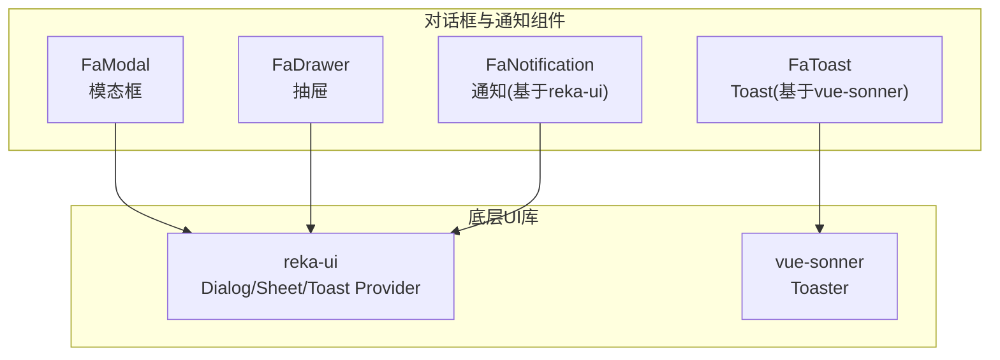
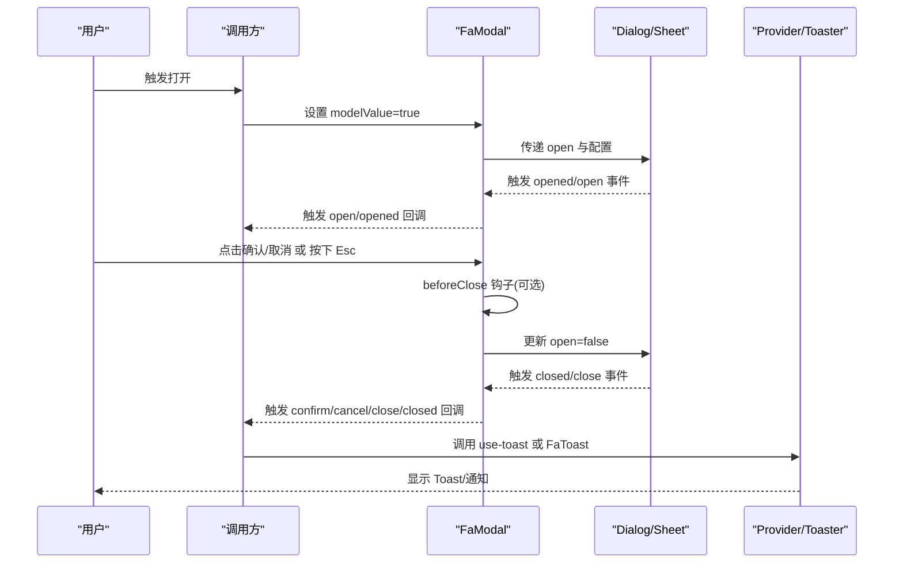
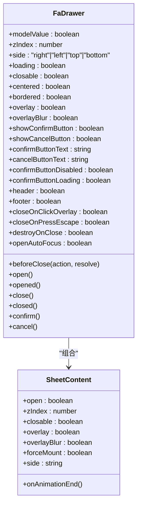
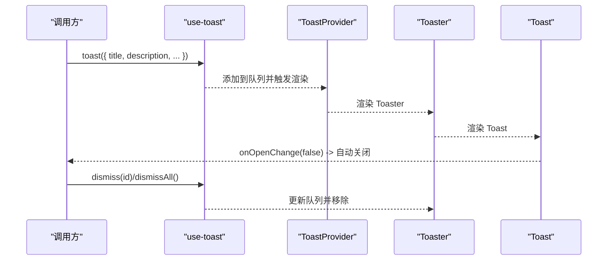
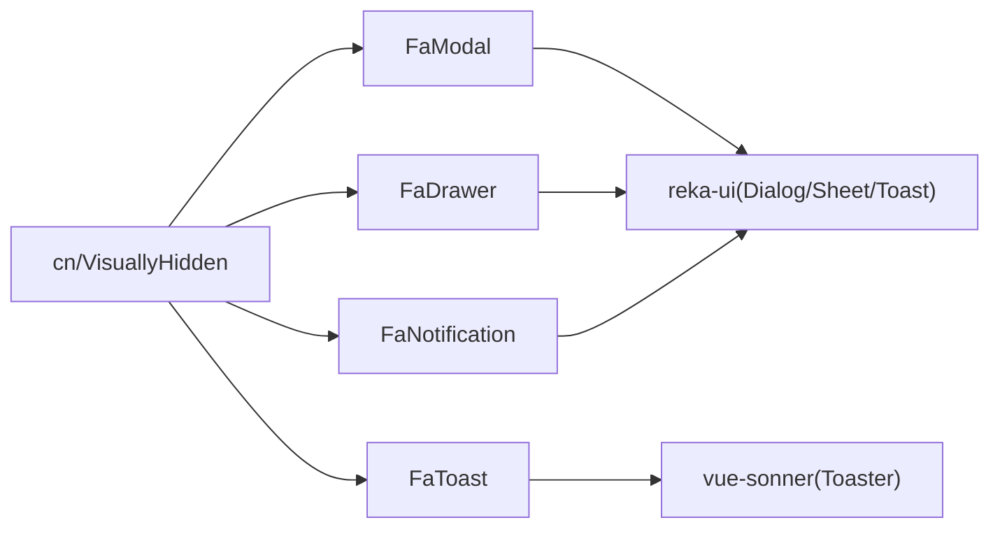

# 对话框与通知组件

<cite>
**本文档引用的文件**
- [FaModal/index.vue](file://frontend-fantastic-admin/src/ui/components/FaModal/index.vue)
- [FaModal/dialog/Dialog.vue](file://frontend-fantastic-admin/src/ui/components/FaModal/dialog/Dialog.vue)
- [FaModal/dialog/DialogContent.vue](file://frontend-fantastic-admin/src/ui/components/FaModal/dialog/DialogContent.vue)
- [FaModal/dialog/DialogHeader.vue](file://frontend-fantastic-admin/src/ui/components/FaModal/dialog/DialogHeader.vue)
- [FaModal/dialog/DialogTitle.vue](file://frontend-fantastic-admin/src/ui/components/FaModal/dialog/DialogTitle.vue)
- [FaModal/dialog/DialogDescription.vue](file://frontend-fantastic-admin/src/ui/components/FaModal/dialog/DialogDescription.vue)
- [FaModal/dialog/DialogFooter.vue](file://frontend-fantastic-admin/src/ui/components/FaModal/dialog/DialogFooter.vue)
- [FaModal/dialog/DialogClose.vue](file://frontend-fantastic-admin/src/ui/components/FaModal/dialog/DialogClose.vue)
- [FaModal/dialog/DialogTrigger.vue](file://frontend-fantastic-admin/src/ui/components/FaModal/dialog/DialogTrigger.vue)
- [FaModal/use-draggable.ts](file://frontend-fantastic-admin/src/ui/components/FaModal/use-draggable.ts)
- [FaDrawer/index.vue](file://frontend-fantastic-admin/src/ui/components/FaDrawer/index.vue)
- [FaDrawer/sheet/Sheet.vue](file://frontend-fantastic-admin/src/ui/components/FaDrawer/sheet/Sheet.vue)
- [FaDrawer/sheet/SheetContent.vue](file://frontend-fantastic-admin/src/ui/components/FaDrawer/sheet/SheetContent.vue)
- [FaDrawer/sheet/SheetHeader.vue](file://frontend-fantastic-admin/src/ui/components/FaDrawer/sheet/SheetHeader.vue)
- [FaDrawer/sheet/SheetTitle.vue](file://frontend-fantastic-admin/src/ui/components/FaDrawer/sheet/SheetTitle.vue)
- [FaDrawer/sheet/SheetDescription.vue](file://frontend-fantastic-admin/src/ui/components/FaDrawer/sheet/SheetDescription.vue)
- [FaDrawer/sheet/SheetFooter.vue](file://frontend-fantastic-admin/src/ui/components/FaDrawer/sheet/SheetFooter.vue)
- [FaDrawer/sheet/SheetClose.vue](file://frontend-fantastic-admin/src/ui/components/FaDrawer/sheet/SheetClose.vue)
- [FaDrawer/sheet/SheetTrigger.vue](file://frontend-fantastic-admin/src/ui/components/FaDrawer/sheet/SheetTrigger.vue)
- [FaNotification/index.vue](file://frontend-fantastic-admin/src/ui/components/FaNotification/index.vue)
- [FaNotification/toast/Toaster.vue](file://frontend-fantastic-admin/src/ui/components/FaNotification/toast/Toaster.vue)
- [FaNotification/toast/use-toast.ts](file://frontend-fantastic-admin/src/ui/components/FaNotification/toast/use-toast.ts)
- [FaNotification/toast/ToastProvider.vue](file://frontend-fantastic-admin/src/ui/components/FaNotification/toast/ToastProvider.vue)
- [FaNotification/toast/Toast.vue](file://frontend-fantastic-admin/src/ui/components/FaNotification/toast/Toast.vue)
- [FaToast/index.vue](file://frontend-fantastic-admin/src/ui/components/FaToast/index.vue)
- [FaToast/sonner/Sonner.vue](file://frontend-fantastic-admin/src/ui/components/FaToast/sonner/Sonner.vue)
- [frontend-fantastic-admin/src/ui/components/FaModal/index.ts](file://frontend-fantastic-admin/src/ui/components/FaModal/index.ts)
- [frontend-fantastic-admin/src/ui/components/FaDrawer/index.ts](file://frontend-fantastic-admin/src/ui/components/FaDrawer/index.ts)
- [frontend-fantastic-admin/src/ui/components/FaNotification/index.ts](file://frontend-fantastic-admin/src/ui/components/FaNotification/index.ts)
- [frontend-fantastic-admin/src/ui/components/FaToast/index.ts](file://frontend-fantastic-admin/src/ui/components/FaToast/index.ts)
</cite>

## 目录
1. [简介](#简介)
2. [项目结构](#项目结构)
3. [核心组件](#核心组件)
4. [架构总览](#架构总览)
5. [详细组件分析](#详细组件分析)
6. [依赖关系分析](#依赖关系分析)
7. [性能考虑](#性能考虑)
8. [故障排除指南](#故障排除指南)
9. [结论](#结论)
10. [附录](#附录)

## 简介
本文件面向 MRR 前端项目中的对话框与通知组件，系统性梳理以下能力：
- 模态框（Modal）：支持拖拽、最大化、遮罩层、加载态、确认/取消按钮、打开/关闭回调与 beforeClose 钩子、焦点管理与键盘交互。
- 抽屉（Drawer）：支持从右侧滑入、遮罩层、加载态、确认/取消按钮、打开/关闭回调与 beforeClose 钩子、焦点管理与键盘交互。
- 消息提示与 Toast 通知：基于 reka-ui 的 Toaster 与基于 vue-sonner 的 FaToast，支持多类型状态、自动移除、可更新、可手动关闭。
- 全局配置与样式定制：通过主题变量、颜色方案、类名合并工具与样式覆盖实现一致的视觉与行为。

## 项目结构
组件位于前端工程的 UI 组件库目录中，采用按功能分层组织：
- 模态框：FaModal
- 抽屉：FaDrawer
- 通知：FaNotification（基于 reka-ui）、FaToast（基于 vue-sonner）
- 样式与工具：cn 类名合并、VisuallyHidden 屏蔽元素、颜色方案由设置仓库提供



图表来源
- [FaModal/index.vue:1-303](file://frontend-fantastic-admin/src/ui/components/FaModal/index.vue#L1-L303)
- [FaDrawer/index.vue:1-244](file://frontend-fantastic-admin/src/ui/components/FaDrawer/index.vue#L1-L244)
- [FaNotification/index.vue:1-12](file://frontend-fantastic-admin/src/ui/components/FaNotification/index.vue#L1-L12)
- [FaToast/index.vue:1-15](file://frontend-fantastic-admin/src/ui/components/FaToast/index.vue#L1-L15)

章节来源
- [FaModal/index.vue:1-303](file://frontend-fantastic-admin/src/ui/components/FaModal/index.vue#L1-L303)
- [FaDrawer/index.vue:1-244](file://frontend-fantastic-admin/src/ui/components/FaDrawer/index.vue#L1-L244)
- [FaNotification/index.vue:1-12](file://frontend-fantastic-admin/src/ui/components/FaNotification/index.vue#L1-L12)
- [FaToast/index.vue:1-15](file://frontend-fantastic-admin/src/ui/components/FaToast/index.vue#L1-L15)

## 核心组件
- 模态框（FaModal）
  - 支持属性：模型值、z-index、是否可关闭、是否可最大化、是否可拖拽、居中显示、边框、遮罩与模糊、确认/取消按钮、标题/描述/图标、beforeClose 钩子、销毁策略、焦点控制、加载态等。
  - 事件：update:modelValue、open、opened、close、closed、confirm、cancel。
  - 插槽：header、default、footer。
  - 关键特性：拖拽移动、最大化切换、遮罩点击关闭、Esc 关闭、动画结束回调、加载态覆盖层。
- 抽屉（FaDrawer）
  - 支持属性：模型值、z-index、位置（side）、是否可关闭、内容居中、边框、遮罩与模糊、确认/取消按钮、标题/描述、beforeClose 钩子、销毁策略、焦点控制、加载态等。
  - 事件：update:modelValue、open、opened、close、closed、confirm、cancel。
  - 插槽：header、default、footer。
  - 关键特性：遮罩点击关闭、Esc 关闭、动画结束回调、加载态覆盖层。
- 通知（FaNotification）
  - 提供 Toaster 容器与 use-toast 组合式函数，支持添加、更新、关闭、批量关闭与自动移除。
  - Toast 组件基于 reka-ui，支持变体样式与无障碍标签。
- Toast（FaToast）
  - 基于 vue-sonner 的 Toaster，统一在顶部居中显示，支持主题色随设置仓库切换。

章节来源
- [FaModal/index.vue:19-47](file://frontend-fantastic-admin/src/ui/components/FaModal/index.vue#L19-L47)
- [FaDrawer/index.vue:18-43](file://frontend-fantastic-admin/src/ui/components/FaDrawer/index.vue#L18-L43)
- [FaNotification/toast/use-toast.ts:125-167](file://frontend-fantastic-admin/src/ui/components/FaNotification/toast/use-toast.ts#L125-L167)
- [FaToast/index.vue:9-14](file://frontend-fantastic-admin/src/ui/components/FaToast/index.vue#L9-L14)

## 架构总览
组件采用“容器 + 分离的 UI 片段”模式，通过 reka-ui 的 Dialog/Sheet/Toast 提供基础交互语义，再以 FaModal/FaDrawer/FaNotification/FaToast 封装业务所需的默认行为与样式。



图表来源
- [FaModal/index.vue:115-171](file://frontend-fantastic-admin/src/ui/components/FaModal/index.vue#L115-L171)
- [FaDrawer/index.vue:81-137](file://frontend-fantastic-admin/src/ui/components/FaDrawer/index.vue#L81-L137)
- [FaNotification/toast/use-toast.ts:80-123](file://frontend-fantastic-admin/src/ui/components/FaNotification/toast/use-toast.ts#L80-L123)
- [FaToast/sonner/Sonner.vue:9-22](file://frontend-fantastic-admin/src/ui/components/FaToast/sonner/Sonner.vue#L9-L22)

## 详细组件分析

### 模态框（FaModal）分析
- 结构与职责
  - 容器：FaModal/index.vue 负责状态管理、事件转发、插槽渲染、拖拽与最大化、遮罩与键盘交互、加载态覆盖层。
  - UI 片段：Dialog/DialogContent/DialogHeader/DialogTitle/DialogDescription/DialogFooter 等来自 reka-ui 的封装。
  - 工具：use-draggable.ts 提供拖拽位移计算。
- 打开/关闭逻辑
  - 双向绑定 modelValue；watch 同步内部 isOpen；根据 isOpen 发出 open/opened/close/closed 事件。
  - beforeClose 钩子支持三种动作：'close'/'cancel'/'confirm'，允许异步校验或保存。
- 遮罩层与焦点管理
  - 点击遮罩：closeOnClickOverlay 控制；通过 data-modal-id 匹配当前实例。
  - Esc 关闭：closeOnPressEscape 控制；preventDefault 阻止外部默认行为。
  - 自动聚焦：openAutoFocus 控制；未启用时阻止自动聚焦。
- 动画与生命周期
  - animation-end 事件区分 opened 与 closed；destroyOnClose 决定是否销毁 DOM。
- 使用示例（最佳实践）
  - 异步确认：在 beforeClose 中执行异步请求，成功后回调 resolve 关闭，失败则保持打开。
  - 批量操作：在确认按钮上叠加 loading 状态，避免重复提交。
  - 确认对话：仅显示确认按钮，隐藏取消按钮；设置 closeOnPressEscape=false 以防止误关。
  - 加载态：在长耗时操作期间显示全局加载覆盖层。
- 键盘交互与无障碍
  - 使用 VisuallyHidden 包裹标题/描述，确保屏幕阅读器可读。
  - 通过 openAutoFocus/focus-outside/escape-key-down 等事件实现可控的焦点与键盘行为。

```mermaid
classDiagram
class FaModal {
+modelValue : boolean
+zIndex : number
+loading : boolean
+closable : boolean
+maximize : boolean
+draggable : boolean
+center : boolean
+overlay : boolean
+overlayBlur : boolean
+showConfirmButton : boolean
+showCancelButton : boolean
+confirmButtonText : string
+cancelButtonText : string
+confirmButtonDisabled : boolean
+confirmButtonLoading : boolean
+header : boolean
+footer : boolean
+closeOnClickOverlay : boolean
+closeOnPressEscape : boolean
+destroyOnClose : boolean
+openAutoFocus : boolean
+beforeClose(action, resolve)
+open()
+opened()
+close()
+closed()
+confirm()
+cancel()
}
class DialogContent {
+open : boolean
+zIndex : number
+closable : boolean
+overlay : boolean
+overlayBlur : boolean
+maximize : boolean
+maximizable : boolean
+forceMount : boolean
+onToggleMaximize()
+onAnimationEnd()
}
class useDraggable {
+isDragging : boolean
+transform : { offsetX, offsetY }
}
FaModal --> DialogContent : "组合"
FaModal --> useDraggable : "使用"
```

图表来源
- [FaModal/index.vue:19-47](file://frontend-fantastic-admin/src/ui/components/FaModal/index.vue#L19-L47)
- [FaModal/index.vue:90-102](file://frontend-fantastic-admin/src/ui/components/FaModal/index.vue#L90-L102)
- [FaModal/dialog/DialogContent.vue](file://frontend-fantastic-admin/src/ui/components/FaModal/dialog/DialogContent.vue)

章节来源
- [FaModal/index.vue:1-303](file://frontend-fantastic-admin/src/ui/components/FaModal/index.vue#L1-L303)
- [FaModal/dialog/Dialog.vue:1-16](file://frontend-fantastic-admin/src/ui/components/FaModal/dialog/Dialog.vue#L1-L16)
- [FaModal/dialog/DialogContent.vue](file://frontend-fantastic-admin/src/ui/components/FaModal/dialog/DialogContent.vue)
- [FaModal/dialog/DialogHeader.vue](file://frontend-fantastic-admin/src/ui/components/FaModal/dialog/DialogHeader.vue)
- [FaModal/dialog/DialogTitle.vue](file://frontend-fantastic-admin/src/ui/components/FaModal/dialog/DialogTitle.vue)
- [FaModal/dialog/DialogDescription.vue](file://frontend-fantastic-admin/src/ui/components/FaModal/dialog/DialogDescription.vue)
- [FaModal/dialog/DialogFooter.vue](file://frontend-fantastic-admin/src/ui/components/FaModal/dialog/DialogFooter.vue)
- [FaModal/dialog/DialogClose.vue](file://frontend-fantastic-admin/src/ui/components/FaModal/dialog/DialogClose.vue)
- [FaModal/dialog/DialogTrigger.vue](file://frontend-fantastic-admin/src/ui/components/FaModal/dialog/DialogTrigger.vue)
- [FaModal/use-draggable.ts](file://frontend-fantastic-admin/src/ui/components/FaModal/use-draggable.ts)

### 抽屉（FaDrawer）分析
- 结构与职责
  - 容器：FaDrawer/index.vue 负责状态管理、事件转发、插槽渲染、遮罩与键盘交互、加载态覆盖层。
  - UI 片段：Sheet/SheetContent/SheetHeader/SheetTitle/SheetDescription/SheetFooter 等来自 reka-ui 的封装。
- 打开/关闭逻辑
  - 双向绑定 modelValue；watch 同步内部 isOpen；发出 open/opened/close/closed 事件。
  - beforeClose 钩子支持 'close'/'cancel'/'confirm'，允许异步校验或保存。
- 遮罩层与焦点管理
  - 点击遮罩：closeOnClickOverlay 控制；通过 data-drawerId 匹配当前实例。
  - Esc 关闭：closeOnPressEscape 控制；preventDefault 阻止外部默认行为。
  - 自动聚焦：openAutoFocus 控制；未启用时阻止自动聚焦。
- 使用示例（最佳实践）
  - 侧栏导航：设置 side='right'，内容区使用滚动区域，避免遮挡主内容。
  - 表单编辑：在 footer 中放置确认/取消按钮，结合 beforeClose 进行表单校验。
  - 加载态：在长耗时操作期间显示全局加载覆盖层。
- 键盘交互与无障碍
  - 使用 VisuallyHidden 包裹标题/描述，确保屏幕阅读器可读。
  - 通过 openAutoFocus/focus-outside/escape-key-down 等事件实现可控的焦点与键盘行为。



图表来源
- [FaDrawer/index.vue:18-43](file://frontend-fantastic-admin/src/ui/components/FaDrawer/index.vue#L18-L43)
- [FaDrawer/sheet/Sheet.vue:1-16](file://frontend-fantastic-admin/src/ui/components/FaDrawer/sheet/Sheet.vue#L1-L16)
- [FaDrawer/sheet/SheetContent.vue](file://frontend-fantastic-admin/src/ui/components/FaDrawer/sheet/SheetContent.vue)

章节来源
- [FaDrawer/index.vue:1-244](file://frontend-fantastic-admin/src/ui/components/FaDrawer/index.vue#L1-L244)
- [FaDrawer/sheet/Sheet.vue:1-16](file://frontend-fantastic-admin/src/ui/components/FaDrawer/sheet/Sheet.vue#L1-L16)
- [FaDrawer/sheet/SheetContent.vue](file://frontend-fantastic-admin/src/ui/components/FaDrawer/sheet/SheetContent.vue)
- [FaDrawer/sheet/SheetHeader.vue](file://frontend-fantastic-admin/src/ui/components/FaDrawer/sheet/SheetHeader.vue)
- [FaDrawer/sheet/SheetTitle.vue](file://frontend-fantastic-admin/src/ui/components/FaDrawer/sheet/SheetTitle.vue)
- [FaDrawer/sheet/SheetDescription.vue](file://frontend-fantastic-admin/src/ui/components/FaDrawer/sheet/SheetDescription.vue)
- [FaDrawer/sheet/SheetFooter.vue](file://frontend-fantastic-admin/src/ui/components/FaDrawer/sheet/SheetFooter.vue)
- [FaDrawer/sheet/SheetClose.vue](file://frontend-fantastic-admin/src/ui/components/FaDrawer/sheet/SheetClose.vue)
- [FaDrawer/sheet/SheetTrigger.vue](file://frontend-fantastic-admin/src/ui/components/FaDrawer/sheet/SheetTrigger.vue)

### 通知与 Toast 分析
- FaNotification（基于 reka-ui）
  - Toaster 容器负责渲染队列中的 Toast。
  - use-toast 提供 toast、dismiss、useToast 等 API，支持限制数量、延迟移除、批量关闭。
  - Toast 组件基于 reka-ui 的 ToastRoot，支持变体样式与无障碍标签。
- FaToast（基于 vue-sonner）
  - 在顶部居中显示，主题随设置仓库的颜色方案切换。
  - 通过 classes 覆盖 toast/description/actionButton/cancelButton/icon 的样式类名。



图表来源
- [FaNotification/toast/use-toast.ts:80-123](file://frontend-fantastic-admin/src/ui/components/FaNotification/toast/use-toast.ts#L80-L123)
- [FaNotification/toast/ToastProvider.vue:1-13](file://frontend-fantastic-admin/src/ui/components/FaNotification/toast/ToastProvider.vue#L1-L13)
- [FaNotification/toast/Toaster.vue](file://frontend-fantastic-admin/src/ui/components/FaNotification/toast/Toaster.vue)
- [FaNotification/toast/Toast.vue:1-27](file://frontend-fantastic-admin/src/ui/components/FaNotification/toast/Toast.vue#L1-L27)
- [FaToast/index.vue:9-14](file://frontend-fantastic-admin/src/ui/components/FaToast/index.vue#L9-L14)
- [FaToast/sonner/Sonner.vue:9-22](file://frontend-fantastic-admin/src/ui/components/FaToast/sonner/Sonner.vue#L9-L22)

章节来源
- [FaNotification/index.vue:1-12](file://frontend-fantastic-admin/src/ui/components/FaNotification/index.vue#L1-L12)
- [FaNotification/toast/use-toast.ts:1-168](file://frontend-fantastic-admin/src/ui/components/FaNotification/toast/use-toast.ts#L1-L168)
- [FaNotification/toast/ToastProvider.vue:1-13](file://frontend-fantastic-admin/src/ui/components/FaNotification/toast/ToastProvider.vue#L1-L13)
- [FaNotification/toast/Toast.vue:1-27](file://frontend-fantastic-admin/src/ui/components/FaNotification/toast/Toast.vue#L1-L27)
- [FaToast/index.vue:1-15](file://frontend-fantastic-admin/src/ui/components/FaToast/index.vue#L1-L15)
- [FaToast/sonner/Sonner.vue:1-23](file://frontend-fantastic-admin/src/ui/components/FaToast/sonner/Sonner.vue#L1-L23)

## 依赖关系分析
- 组件耦合
  - FaModal/FaDrawer 依赖 reka-ui 的 Dialog/Sheet 提供的基础交互语义。
  - FaNotification/FaToast 分别依赖 reka-ui 与 vue-sonner 的 Provider/Toaster。
- 外部依赖
  - reka-ui：DialogRoot、Sheet、ToastRoot、ToastProvider 等。
  - vue-sonner：Toaster。
  - 工具：cn 类名合并、VisuallyHidden 屏蔽元素、颜色方案来自设置仓库。
- 潜在循环依赖
  - 组件间无直接循环导入；Provider 作为顶层容器，子组件仅消费其上下文。



图表来源
- [FaModal/index.vue:3-13](file://frontend-fantastic-admin/src/ui/components/FaModal/index.vue#L3-L13)
- [FaDrawer/index.vue:3-12](file://frontend-fantastic-admin/src/ui/components/FaDrawer/index.vue#L3-L12)
- [FaNotification/index.vue](file://frontend-fantastic-admin/src/ui/components/FaNotification/index.vue#L2)
- [FaToast/index.vue:2-3](file://frontend-fantastic-admin/src/ui/components/FaToast/index.vue#L2-L3)

章节来源
- [FaModal/index.vue:1-303](file://frontend-fantastic-admin/src/ui/components/FaModal/index.vue#L1-L303)
- [FaDrawer/index.vue:1-244](file://frontend-fantastic-admin/src/ui/components/FaDrawer/index.vue#L1-L244)
- [FaNotification/index.vue:1-12](file://frontend-fantastic-admin/src/ui/components/FaNotification/index.vue#L1-L12)
- [FaToast/index.vue:1-15](file://frontend-fantastic-admin/src/ui/components/FaToast/index.vue#L1-L15)

## 性能考虑
- 渲染优化
  - destroyOnClose：在关闭时销毁 DOM，减少内存占用；forceMount：在首次打开后保留 DOM，避免重复挂载。
  - 加载态覆盖层：仅在 loading 为真时渲染，避免不必要的节点。
- 动画与拖拽
  - 拖拽过程中禁用过渡动画，提升交互顺滑度；最大化时重置 transform。
- 通知队列
  - use-toast 限制队列长度，避免过多 Toast 占用渲染资源；延迟移除机制统一管理超时任务。

## 故障排除指南
- 打不开/无法关闭
  - 检查 modelValue 是否正确双向绑定；确认 open/opened/close/closed 事件是否被监听。
  - 若设置了 closeOnPressEscape=false，Esc 不会关闭；若设置了 closeOnClickOverlay=false，点击遮罩不会关闭。
- beforeClose 未生效
  - 确认传入了 beforeClose 函数，并在异步流程结束后调用回调 resolve。
- 焦点问题
  - 若 openAutoFocus=false，自动聚焦会被阻止；可通过自定义 ref 管理焦点。
- 拖拽无效
  - 确认 draggable=true 且 header=true；最大化状态下拖拽被禁用。
- Toast 不显示
  - 确认已引入 FaNotification/FaToast 容器；检查主题与位置配置；确保未被其他遮罩层遮挡。

章节来源
- [FaModal/index.vue:173-197](file://frontend-fantastic-admin/src/ui/components/FaModal/index.vue#L173-L197)
- [FaDrawer/index.vue:139-163](file://frontend-fantastic-admin/src/ui/components/FaDrawer/index.vue#L139-L163)
- [FaNotification/toast/use-toast.ts:80-123](file://frontend-fantastic-admin/src/ui/components/FaNotification/toast/use-toast.ts#L80-L123)
- [FaToast/sonner/Sonner.vue:9-22](file://frontend-fantastic-admin/src/ui/components/FaToast/sonner/Sonner.vue#L9-L22)

## 结论
本组件库提供了完善的模态框、抽屉、通知与 Toast 能力，具备良好的可扩展性与无障碍支持。通过统一的事件流、钩子函数与样式体系，能够满足复杂业务场景下的交互需求。建议在实际使用中：
- 明确打开/关闭条件与 beforeClose 流程，保障数据一致性。
- 合理使用遮罩、键盘与焦点控制，提升可用性与可访问性。
- 利用全局配置（如主题）与样式覆盖，保持视觉一致性。

## 附录
- 全局配置与样式定制
  - 主题与颜色方案：通过设置仓库提供的 currentColorScheme 控制 FaToast 主题。
  - 类名合并：使用 cn 工具进行条件样式拼接，便于覆盖默认样式。
  - 样式覆盖：FaToast 通过 classes 覆盖 toast/description/actionButton/cancelButton/icon 的样式类名，实现细粒度定制。

章节来源
- [FaToast/index.vue:9-14](file://frontend-fantastic-admin/src/ui/components/FaToast/index.vue#L9-L14)
- [FaToast/sonner/Sonner.vue:12-21](file://frontend-fantastic-admin/src/ui/components/FaToast/sonner/Sonner.vue#L12-L21)
- [FaModal/index.vue:228-233](file://frontend-fantastic-admin/src/ui/components/FaModal/index.vue#L228-L233)
- [FaDrawer/index.vue:185-187](file://frontend-fantastic-admin/src/ui/components/FaDrawer/index.vue#L185-L187)