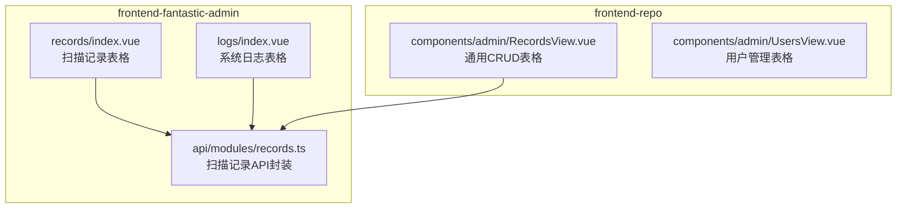
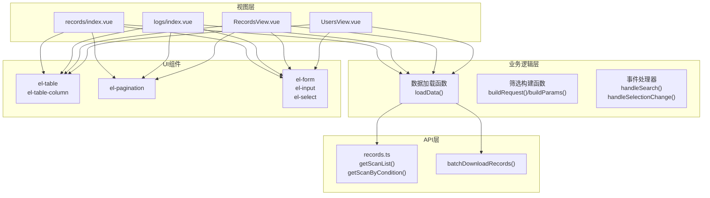
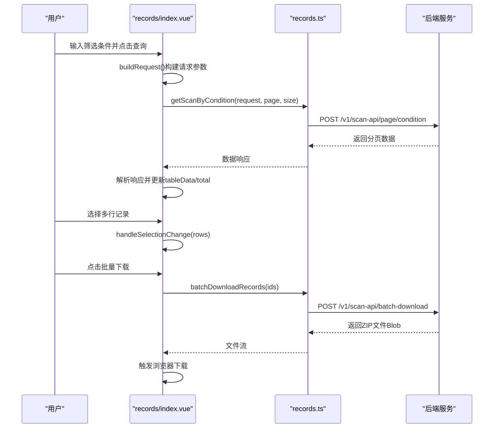
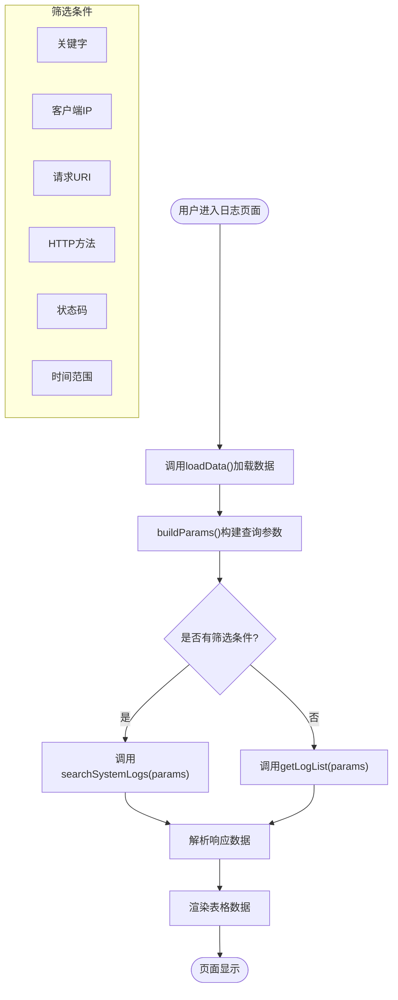
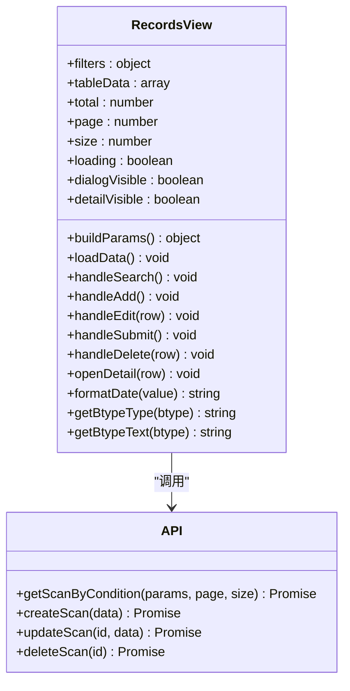
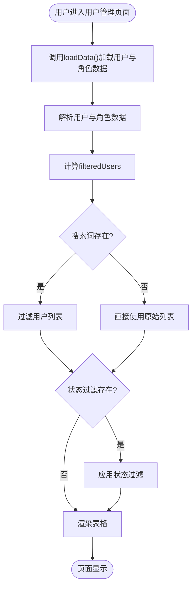
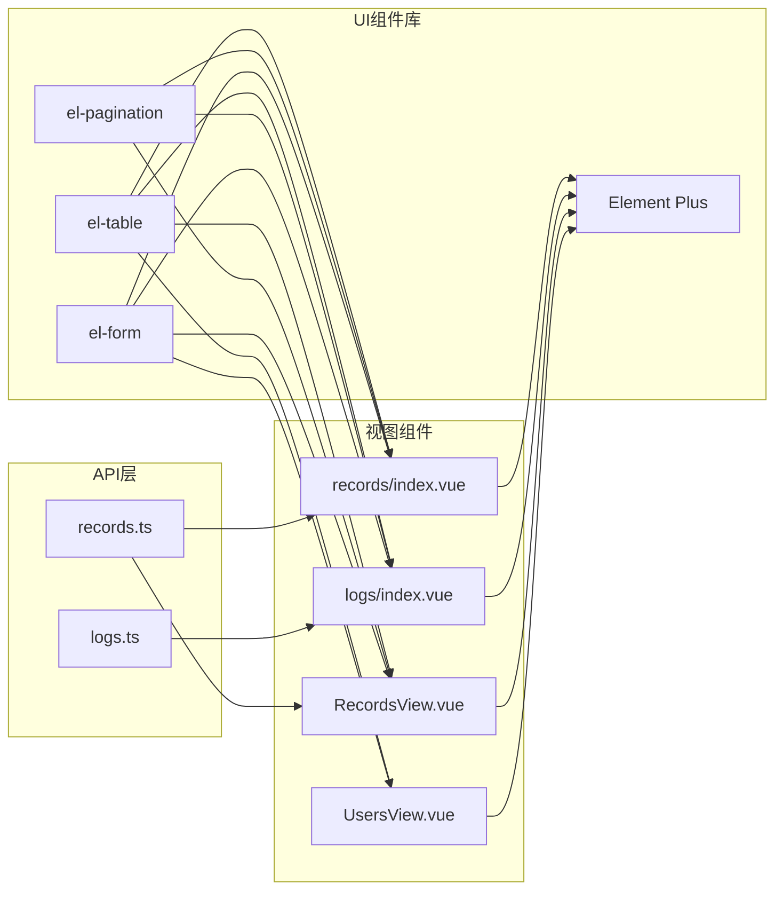

# 数据表格组件

<cite>
**本文档引用的文件**
- [records/index.vue](file://frontend-fantastic-admin/src/views/records/index.vue)
- [logs/index.vue](file://frontend-fantastic-admin/src/views/logs/index.vue)
- [records.ts](file://frontend-fantastic-admin/src/api/modules/records.ts)
- [RecordsView.vue](file://frontend-repo/src/components/admin/RecordsView.vue)
- [UsersView.vue](file://frontend-repo/src/components/admin/UsersView.vue)
</cite>

## 目录
1. [简介](#简介)
2. [项目结构](#项目结构)
3. [核心组件](#核心组件)
4. [架构概览](#架构概览)
5. [详细组件分析](#详细组件分析)
6. [依赖关系分析](#依赖关系分析)
7. [性能考虑](#性能考虑)
8. [故障排除指南](#故障排除指南)
9. [结论](#结论)

## 简介
本文件为MRR项目中的数据表格组件提供全面的技术文档。重点覆盖以下方面：
- 数据渲染：从API获取数据并展示在表格中
- 排序与筛选：基于Element Plus的筛选器与分页控件
- 分页功能：支持页码切换与每页条数调整
- 列配置：静态列定义与动态列渲染
- 行选择与批量操作：多选框与批量下载
- 自定义列渲染：标签、图标、格式化显示
- 高级用法：条件格式化与动态列
- 性能优化：大数据量处理策略
- 导出与打印：批量下载与响应式适配

## 项目结构
MRR项目包含两个前端仓库，均实现了数据表格组件：
- frontend-fantastic-admin：包含扫描记录与系统日志的表格页面
- frontend-repo：包含通用CRUD表格页面（用户管理、记录管理等）

**图表来源**
- [records/index.vue:1-329](file://frontend-fantastic-admin/src/views/records/index.vue#L1-L329)
- [logs/index.vue:1-365](file://frontend-fantastic-admin/src/views/logs/index.vue#L1-L365)
- [records.ts:1-57](file://frontend-fantastic-admin/src/api/modules/records.ts#L1-L57)
- [RecordsView.vue:1-513](file://frontend-repo/src/components/admin/RecordsView.vue#L1-L513)
- [UsersView.vue:1-481](file://frontend-repo/src/components/admin/UsersView.vue#L1-L481)

**章节来源**
- [records/index.vue:1-329](file://frontend-fantastic-admin/src/views/records/index.vue#L1-L329)
- [logs/index.vue:1-365](file://frontend-fantastic-admin/src/views/logs/index.vue#L1-L365)
- [records.ts:1-57](file://frontend-fantastic-admin/src/api/modules/records.ts#L1-L57)
- [RecordsView.vue:1-513](file://frontend-repo/src/components/admin/RecordsView.vue#L1-L513)
- [UsersView.vue:1-481](file://frontend-repo/src/components/admin/UsersView.vue#L1-L481)

## 核心组件
本节概述各表格组件的关键特性与实现要点：

- 扫描记录表格（records/index.vue）
  - 支持病案号、病人序号、扫描人员、类型等多条件筛选
  - 提供批量下载功能，通过多选框选择记录后批量打包下载
  - 使用分页控件进行页码切换与每页条数调整
  - 自定义列渲染：类型标签、文件名溢出提示、操作按钮

- 系统日志表格（logs/index.vue）
  - 支持关键字、客户端IP、请求URI、方法、状态码、时间范围等筛选
  - 提供刷新与详情查看功能
  - 自定义列渲染：HTTP方法标签、状态码标签、执行时间格式化

- 通用CRUD表格（RecordsView.vue）
  - 支持增删改查与条件分页
  - 包含表单验证、对话框编辑、删除确认
  - 自定义列渲染：类型标签、状态标签、日期格式化

- 用户管理表格（UsersView.vue）
  - 支持搜索与状态过滤
  - 展示角色与权限列表
  - 自定义列渲染：角色标签、权限标签、状态标签、日期格式化

**章节来源**
- [records/index.vue:195-234](file://frontend-fantastic-admin/src/views/records/index.vue#L195-L234)
- [logs/index.vue:231-279](file://frontend-fantastic-admin/src/views/logs/index.vue#L231-L279)
- [RecordsView.vue:56-99](file://frontend-repo/src/components/admin/RecordsView.vue#L56-L99)
- [UsersView.vue:61-115](file://frontend-repo/src/components/admin/UsersView.vue#L61-L115)

## 架构概览
表格组件采用典型的MVVM架构，结合Element Plus UI组件库实现数据绑定与交互。

**图表来源**
- [records/index.vue:57-77](file://frontend-fantastic-admin/src/views/records/index.vue#L57-L77)
- [logs/index.vue:63-89](file://frontend-fantastic-admin/src/views/logs/index.vue#L63-L89)
- [records.ts:4-51](file://frontend-fantastic-admin/src/api/modules/records.ts#L4-L51)
- [RecordsView.vue:295-314](file://frontend-repo/src/components/admin/RecordsView.vue#L295-L314)
- [UsersView.vue:178-194](file://frontend-repo/src/components/admin/UsersView.vue#L178-L194)

## 详细组件分析

### 扫描记录表格组件
该组件展示了完整的表格功能实现，包括筛选、分页、批量操作等。

**图表来源**
- [records/index.vue:47-77](file://frontend-fantastic-admin/src/views/records/index.vue#L47-L77)
- [records.ts:9-14](file://frontend-fantastic-admin/src/api/modules/records.ts#L9-L14)
- [records.ts:46-51](file://frontend-fantastic-admin/src/api/modules/records.ts#L46-L51)

组件特性：
- 筛选机制：支持病案号、病人序号、扫描人员、类型、上传标记等条件
- 分页控制：当前页、每页大小、总记录数
- 批量操作：多选框选择 + 批量下载
- 自定义渲染：类型标签、文件名溢出提示、操作按钮

**章节来源**
- [records/index.vue:22-28](file://frontend-fantastic-admin/src/views/records/index.vue#L22-L28)
- [records/index.vue:57-77](file://frontend-fantastic-admin/src/views/records/index.vue#L57-L77)
- [records/index.vue:93-126](file://frontend-fantastic-admin/src/views/records/index.vue#L93-L126)
- [records.ts:9-14](file://frontend-fantastic-admin/src/api/modules/records.ts#L9-L14)

### 系统日志表格组件
该组件专注于日志数据的查询与展示，提供了丰富的筛选选项。

**图表来源**
- [logs/index.vue:39-61](file://frontend-fantastic-admin/src/views/logs/index.vue#L39-L61)
- [logs/index.vue:63-89](file://frontend-fantastic-admin/src/views/logs/index.vue#L63-L89)

组件特性：
- 多维度筛选：关键字、IP、URI、方法、状态码、时间范围
- 详情查看：点击查看详情对话框
- 格式化显示：时间格式化、状态码标签样式

**章节来源**
- [logs/index.vue:17-24](file://frontend-fantastic-admin/src/views/logs/index.vue#L17-L24)
- [logs/index.vue:39-61](file://frontend-fantastic-admin/src/views/logs/index.vue#L39-L61)
- [logs/index.vue:106-117](file://frontend-fantastic-admin/src/views/logs/index.vue#L106-L117)

### 通用CRUD表格组件
该组件实现了完整的增删改查功能，适合通用数据管理场景。

**图表来源**
- [RecordsView.vue:271-293](file://frontend-repo/src/components/admin/RecordsView.vue#L271-L293)
- [RecordsView.vue:295-314](file://frontend-repo/src/components/admin/RecordsView.vue#L295-L314)
- [RecordsView.vue:367-398](file://frontend-repo/src/components/admin/RecordsView.vue#L367-L398)

组件特性：
- 完整CRUD：新增、编辑、删除、详情查看
- 表单验证：基于Element Plus的表单校验
- 条件分页：支持多种条件组合查询
- 自定义渲染：类型标签、状态标签、日期格式化

**章节来源**
- [RecordsView.vue:206-226](file://frontend-repo/src/components/admin/RecordsView.vue#L206-L226)
- [RecordsView.vue:271-293](file://frontend-repo/src/components/admin/RecordsView.vue#L271-L293)
- [RecordsView.vue:367-421](file://frontend-repo/src/components/admin/RecordsView.vue#L367-L421)

### 用户管理表格组件
该组件展示了复杂表格场景的实现，包括搜索、过滤、权限展示等功能。

**图表来源**
- [UsersView.vue:178-194](file://frontend-repo/src/components/admin/UsersView.vue#L178-L194)
- [UsersView.vue:196-207](file://frontend-repo/src/components/admin/UsersView.vue#L196-L207)

组件特性：
- 搜索与过滤：用户名、姓名、角色、状态多维过滤
- 权限展示：动态权限列表渲染
- 角色管理：角色标签样式区分
- 状态切换：启用/禁用账号的快速切换

**章节来源**
- [UsersView.vue:196-207](file://frontend-repo/src/components/admin/UsersView.vue#L196-L207)
- [UsersView.vue:230-251](file://frontend-repo/src/components/admin/UsersView.vue#L230-L251)
- [UsersView.vue:311-340](file://frontend-repo/src/components/admin/UsersView.vue#L311-L340)

## 依赖关系分析
表格组件之间的依赖关系如下：

**图表来源**
- [records.ts:1-57](file://frontend-fantastic-admin/src/api/modules/records.ts#L1-L57)
- [records/index.vue:1-329](file://frontend-fantastic-admin/src/views/records/index.vue#L1-L329)
- [logs/index.vue:1-365](file://frontend-fantastic-admin/src/views/logs/index.vue#L1-L365)
- [RecordsView.vue:1-513](file://frontend-repo/src/components/admin/RecordsView.vue#L1-L513)
- [UsersView.vue:1-481](file://frontend-repo/src/components/admin/UsersView.vue#L1-L481)

**章节来源**
- [records.ts:1-57](file://frontend-fantastic-admin/src/api/modules/records.ts#L1-L57)
- [records/index.vue:1-329](file://frontend-fantastic-admin/src/views/records/index.vue#L1-L329)
- [logs/index.vue:1-365](file://frontend-fantastic-admin/src/views/logs/index.vue#L1-L365)
- [RecordsView.vue:1-513](file://frontend-repo/src/components/admin/RecordsView.vue#L1-L513)
- [UsersView.vue:1-481](file://frontend-repo/src/components/admin/UsersView.vue#L1-L481)

## 性能考虑
针对大数据量场景，建议采用以下优化策略：

1. **分页加载**
   - 使用后端分页，避免一次性加载大量数据
   - 合理设置每页大小，默认20条较为合适

2. **虚拟滚动**
   - 对于超大表格数据，考虑使用虚拟滚动组件
   - 限制同时渲染的DOM节点数量

3. **懒加载**
   - 对于详情内容，采用点击展开的方式加载
   - 图片等资源采用懒加载策略

4. **缓存策略**
   - 对于筛选条件稳定的场景，添加本地缓存
   - 避免重复的API请求

5. **渲染优化**
   - 使用`show-overflow-tooltip`处理长文本
   - 避免在模板中进行复杂的计算逻辑

6. **网络优化**
   - 合并多个API请求
   - 使用防抖处理频繁的筛选操作

## 故障排除指南
常见问题及解决方案：

1. **数据加载失败**
   - 检查API连接状态
   - 验证请求参数格式
   - 查看控制台错误信息

2. **筛选无效**
   - 确认筛选条件是否正确传递
   - 检查后端接口是否支持相应字段
   - 验证数据类型匹配

3. **分页异常**
   - 确认total值正确更新
   - 检查page与size参数传递
   - 验证后端分页逻辑

4. **批量操作失败**
   - 确认至少选择了一条记录
   - 检查权限是否足够
   - 验证后端批量处理接口

5. **样式显示问题**
   - 检查CSS类名是否正确
   - 确认Element Plus版本兼容性
   - 验证响应式断点设置

**章节来源**
- [records/index.vue:69-73](file://frontend-fantastic-admin/src/views/records/index.vue#L69-L73)
- [logs/index.vue:81-85](file://frontend-fantastic-admin/src/views/logs/index.vue#L81-L85)
- [RecordsView.vue:307-311](file://frontend-repo/src/components/admin/RecordsView.vue#L307-L311)
- [UsersView.vue:296-308](file://frontend-repo/src/components/admin/UsersView.vue#L296-L308)

## 结论
MRR项目的数据表格组件展现了完整的数据管理能力，涵盖了从基础的筛选、分页到高级的批量操作、自定义渲染等特性。通过合理的架构设计与性能优化策略，这些组件能够有效支撑各种数据密集型应用场景。建议在实际使用中根据具体需求选择合适的组件，并结合项目特点进行定制化开发。