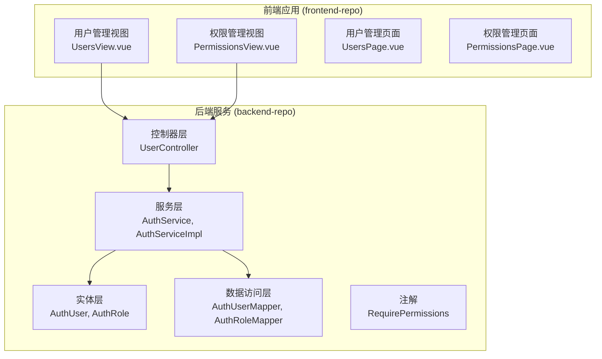
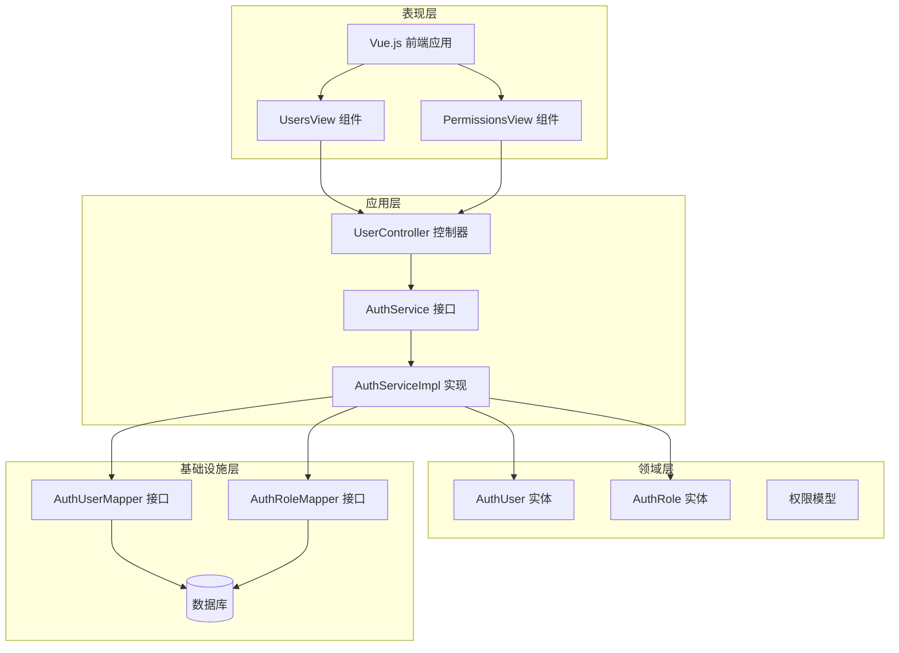
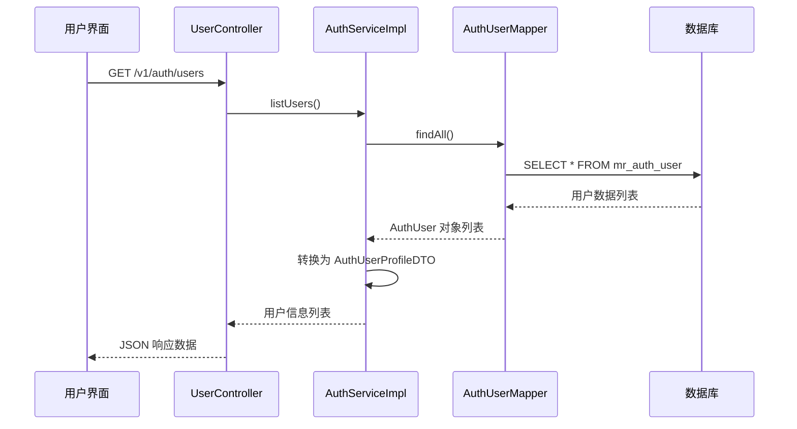
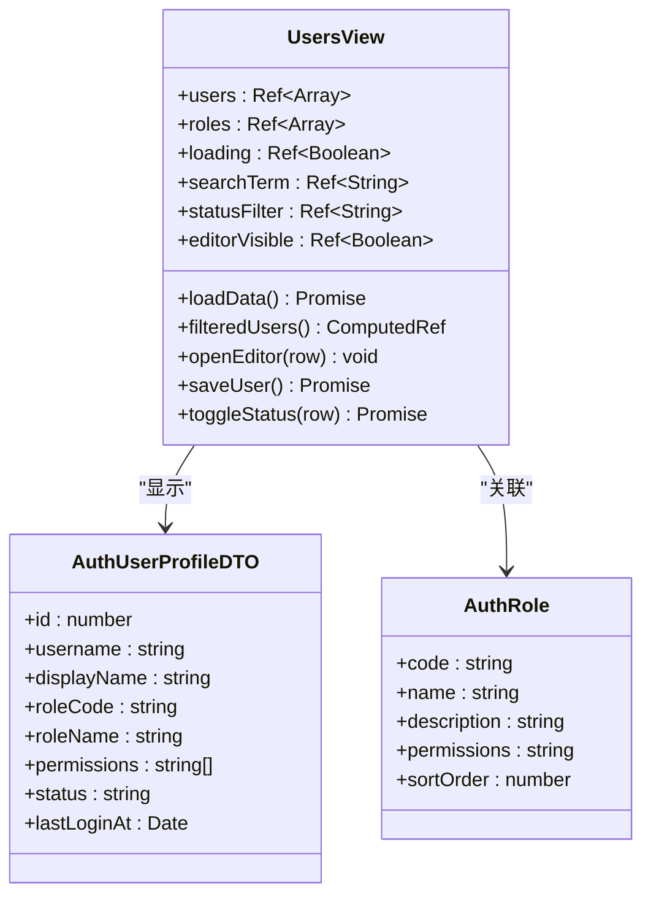
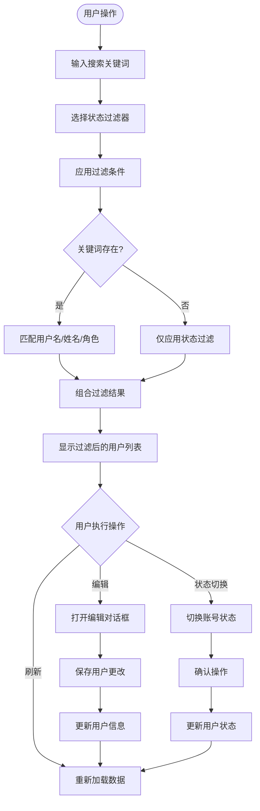
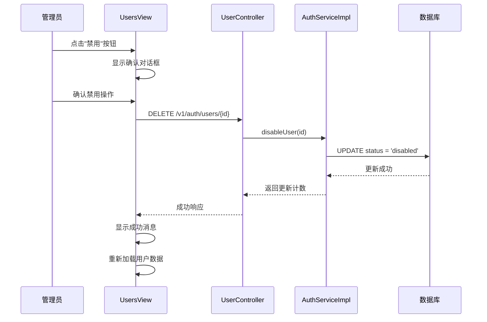
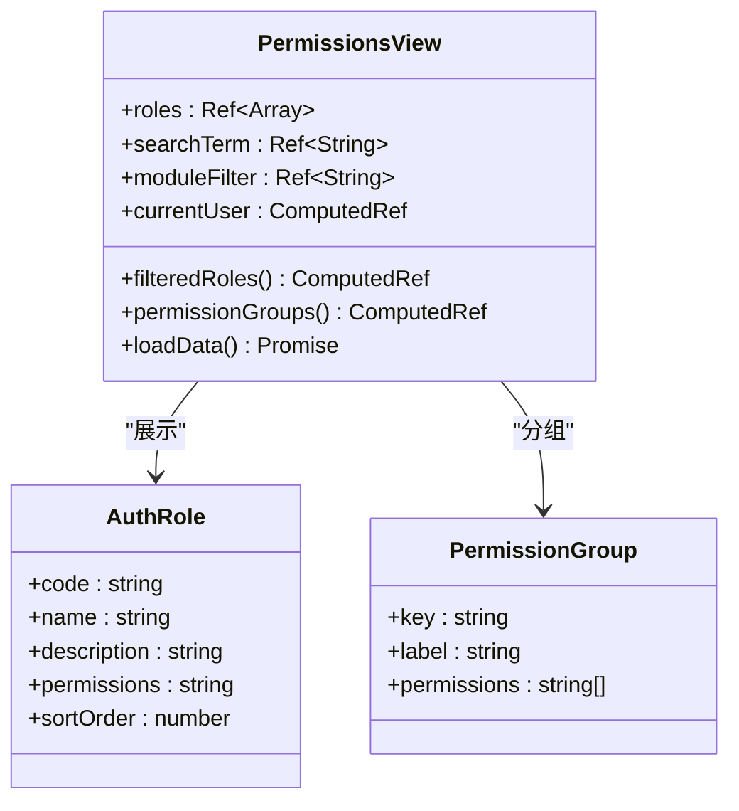
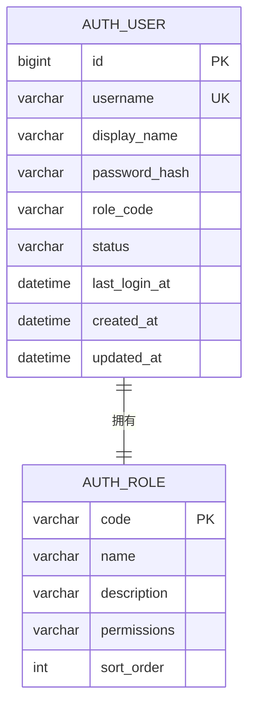
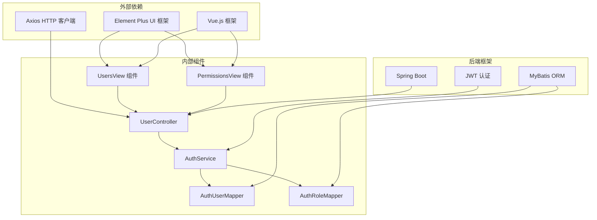
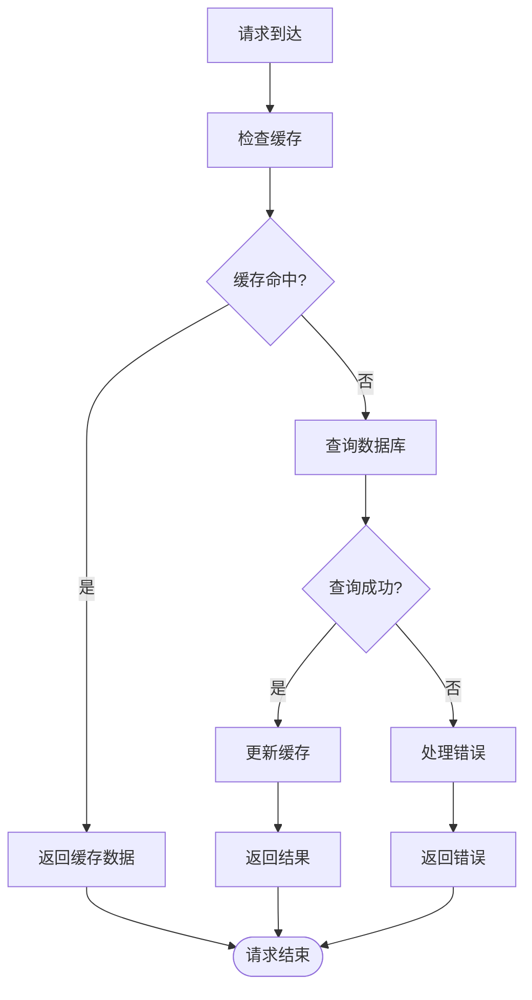

# 管理员管理组件

<cite>
**本文档引用的文件**
- [UserController.java](file://backend-repo/src/main/java/com/zjcxph/imgapi/controller/UserController.java)
- [AuthService.java](file://backend-repo/src/main/java/com/zjcxph/imgapi/service/AuthService.java)
- [AuthServiceImpl.java](file://backend-repo/src/main/java/com/zjcxph/imgapi/service/impl/AuthServiceImpl.java)
- [AuthUser.java](file://backend-repo/src/main/java/com/zjcxph/imgapi/entity/AuthUser.java)
- [AuthRole.java](file://backend-repo/src/main/java/com/zjcxph/imgapi/entity/AuthRole.java)
- [AuthUserMapper.java](file://backend-repo/src/main/java/com/zjcxph/imgapi/mapper/AuthUserMapper.java)
- [AuthRoleMapper.java](file://backend-repo/src/main/java/com/zjcxph/imgapi/mapper/AuthRoleMapper.java)
- [RequirePermissions.java](file://backend-repo/src/main/java/com/zjcxph/imgapi/annotation/RequirePermissions.java)
- [UsersView.vue](file://frontend-repo/src/components/admin/UsersView.vue)
- [PermissionsView.vue](file://frontend-repo/src/components/admin/PermissionsView.vue)
- [UsersPage.vue](file://frontend-repo/src/views/admin/UsersPage.vue)
- [PermissionsPage.vue](file://frontend-repo/src/views/admin/PermissionsPage.vue)
</cite>

## 目录
1. [简介](#简介)
2. [项目结构](#项目结构)
3. [核心组件](#核心组件)
4. [架构概览](#架构概览)
5. [详细组件分析](#详细组件分析)
6. [依赖关系分析](#依赖关系分析)
7. [性能考虑](#性能考虑)
8. [故障排除指南](#故障排除指南)
9. [结论](#结论)

## 简介

管理员管理组件是MRR系统的核心后台管理功能，负责用户管理、权限控制和系统设置等关键业务。该组件采用前后端分离架构，后端基于Spring Boot构建RESTful API，前端使用Vue.js开发响应式管理界面。

系统实现了基于角色的权限管理系统（RBAC），支持用户列表管理、角色分配、权限配置等功能。管理员可以通过直观的界面完成用户账户的创建、修改、禁用等操作，同时可以查看和管理系统的权限结构。

## 项目结构

管理员管理组件在项目中的组织结构如下：



**图表来源**
- [UserController.java:27-95](file://backend-repo/src/main/java/com/zjcxph/imgapi/controller/UserController.java#L27-L95)
- [AuthServiceImpl.java:25-151](file://backend-repo/src/main/java/com/zjcxph/imgapi/service/impl/AuthServiceImpl.java#L25-L151)
- [UsersView.vue:1-481](file://frontend-repo/src/components/admin/UsersView.vue#L1-L481)
- [PermissionsView.vue:1-421](file://frontend-repo/src/components/admin/PermissionsView.vue#L1-L421)

**章节来源**
- [UserController.java:1-95](file://backend-repo/src/main/java/com/zjcxph/imgapi/controller/UserController.java#L1-L95)
- [UsersView.vue:1-481](file://frontend-repo/src/components/admin/UsersView.vue#L1-L481)
- [PermissionsView.vue:1-421](file://frontend-repo/src/components/admin/PermissionsView.vue#L1-L421)

## 核心组件

管理员管理组件由以下核心组件构成：

### 后端核心组件

1. **UserController**: RESTful API控制器，处理用户认证和权限管理请求
2. **AuthService/Impl**: 用户认证和权限管理服务接口及实现
3. **AuthUser/AuthRole**: 用户和角色实体模型
4. **AuthUserMapper/AuthRoleMapper**: 数据访问层接口
5. **RequirePermissions**: 权限注解，用于方法级权限控制

### 前端核心组件

1. **UsersView**: 用户管理界面组件，提供用户列表、搜索、编辑功能
2. **PermissionsView**: 权限管理界面组件，展示角色权限矩阵
3. **UsersPage/PermissionsPage**: 页面路由组件，承载具体视图

**章节来源**
- [AuthService.java:12-25](file://backend-repo/src/main/java/com/zjcxph/imgapi/service/AuthService.java#L12-L25)
- [AuthServiceImpl.java:25-151](file://backend-repo/src/main/java/com/zjcxph/imgapi/service/impl/AuthServiceImpl.java#L25-L151)
- [UsersView.vue:152-343](file://frontend-repo/src/components/admin/UsersView.vue#L152-L343)
- [PermissionsView.vue:157-294](file://frontend-repo/src/components/admin/PermissionsView.vue#L157-L294)

## 架构概览

管理员管理组件采用分层架构设计，实现了清晰的关注点分离：



**图表来源**
- [UserController.java:27-95](file://backend-repo/src/main/java/com/zjcxph/imgapi/controller/UserController.java#L27-L95)
- [AuthServiceImpl.java:25-151](file://backend-repo/src/main/java/com/zjcxph/imgapi/service/impl/AuthServiceImpl.java#L25-L151)
- [AuthUserMapper.java:13-78](file://backend-repo/src/main/java/com/zjcxph/imgapi/mapper/AuthUserMapper.java#L13-L78)
- [AuthRoleMapper.java:10-19](file://backend-repo/src/main/java/com/zjcxph/imgapi/mapper/AuthRoleMapper.java#L10-L19)

### 数据流架构

系统采用异步数据流处理模式，支持并发数据加载和实时状态更新：



**图表来源**
- [UserController.java:59-64](file://backend-repo/src/main/java/com/zjcxph/imgapi/controller/UserController.java#L59-L64)
- [AuthServiceImpl.java:69-72](file://backend-repo/src/main/java/com/zjcxph/imgapi/service/impl/AuthServiceImpl.java#L69-L72)
- [AuthUserMapper.java:46-59](file://backend-repo/src/main/java/com/zjcxph/imgapi/mapper/AuthUserMapper.java#L46-L59)

**章节来源**
- [UserController.java:27-95](file://backend-repo/src/main/java/com/zjcxph/imgapi/controller/UserController.java#L27-L95)
- [AuthServiceImpl.java:69-105](file://backend-repo/src/main/java/com/zjcxph/imgapi/service/impl/AuthServiceImpl.java#L69-L105)

## 详细组件分析

### 用户管理组件

用户管理组件提供了完整的用户生命周期管理功能：

#### 用户列表界面



**图表来源**
- [UsersView.vue:152-343](file://frontend-repo/src/components/admin/UsersView.vue#L152-L343)
- [AuthUser.java:12-134](file://backend-repo/src/main/java/com/zjcxph/imgapi/entity/AuthUser.java#L12-L134)
- [AuthRole.java:6-53](file://backend-repo/src/main/java/com/zjcxph/imgapi/entity/AuthRole.java#L6-L53)

##### 搜索和过滤机制

用户管理界面实现了多层次的搜索和过滤功能：



**图表来源**
- [UsersView.vue:196-207](file://frontend-repo/src/components/admin/UsersView.vue#L196-L207)
- [UsersView.vue:311-340](file://frontend-repo/src/components/admin/UsersView.vue#L311-L340)

##### 用户状态管理流程



**图表来源**
- [UsersView.vue:311-340](file://frontend-repo/src/components/admin/UsersView.vue#L311-L340)
- [UserController.java:84-93](file://backend-repo/src/main/java/com/zjcxph/imgapi/controller/UserController.java#L84-L93)
- [AuthServiceImpl.java:94-100](file://backend-repo/src/main/java/com/zjcxph/imgapi/service/impl/AuthServiceImpl.java#L94-L100)

**章节来源**
- [UsersView.vue:1-481](file://frontend-repo/src/components/admin/UsersView.vue#L1-L481)
- [UserController.java:59-93](file://backend-repo/src/main/java/com/zjcxph/imgapi/controller/UserController.java#L59-L93)

### 权限管理组件

权限管理组件提供了角色权限的可视化展示和管理功能：

#### 权限矩阵展示



**图表来源**
- [PermissionsView.vue:157-294](file://frontend-repo/src/components/admin/PermissionsView.vue#L157-L294)
- [AuthRole.java:6-53](file://backend-repo/src/main/java/com/zjcxph/imgapi/entity/AuthRole.java#L6-L53)

##### 权限模块分类机制

权限管理界面实现了基于模块的权限分类展示：

| 模块代码 | 中文名称 | 权限前缀示例 | 描述 |
|---------|----------|-------------|------|
| auth | 认证 | auth:* | 用户认证和授权相关权限 |
| record | 病案 | record:* | 病案管理和查询权限 |
| log | 日志 | log:* | 系统日志查看和管理权限 |
| system | 系统 | system:* | 系统配置和管理权限 |
| statistics | 统计 | statistics:* | 数据统计和报表权限 |
| search | 检索 | search:* | 数据检索和搜索权限 |
| other | 其他 | 无前缀 | 其他未分类权限 |

**章节来源**
- [PermissionsView.vue:1-421](file://frontend-repo/src/components/admin/PermissionsView.vue#L1-L421)
- [AuthRole.java:1-53](file://backend-repo/src/main/java/com/zjcxph/imgapi/entity/AuthRole.java#L1-L53)

### 权限验证和安全控制

系统实现了多层次的安全控制机制：

#### 方法级权限控制

```mermaid
flowchart TD
Request[HTTP 请求) --> Controller[控制器方法]
Controller --> CheckAnnotation["检查 @RequirePermissions 注解"]
CheckAnnotation --> HasPermission{"用户是否具备所需权限?"}
HasPermission --> |是| ExecuteMethod["执行业务方法"]
HasPermission --> |否| Return403["返回 403 Forbidden"]
ExecuteMethod --> MethodLogic["业务逻辑处理"]
MethodLogic --> ReturnSuccess["返回成功响应"]
Return403 --> ErrorResponse["返回错误信息"]
ReturnSuccess --> End([请求结束])
ErrorResponse --> End
```

**图表来源**
- [RequirePermissions.java:8-12](file://backend-repo/src/main/java/com/zjcxph/imgapi/annotation/RequirePermissions.java#L8-L12)
- [UserController.java:60-71](file://backend-repo/src/main/java/com/zjcxph/imgapi/controller/UserController.java#L60-L71)

#### 权限模型设计



**图表来源**
- [AuthUser.java:14-24](file://backend-repo/src/main/java/com/zjcxph/imgapi/entity/AuthUser.java#L14-L24)
- [AuthRole.java:7-11](file://backend-repo/src/main/java/com/zjcxph/imgapi/entity/AuthRole.java#L7-L11)

**章节来源**
- [RequirePermissions.java:1-13](file://backend-repo/src/main/java/com/zjcxph/imgapi/annotation/RequirePermissions.java#L1-L13)
- [AuthUser.java:116-132](file://backend-repo/src/main/java/com/zjcxph/imgapi/entity/AuthUser.java#L116-L132)

## 依赖关系分析

管理员管理组件的依赖关系体现了清晰的分层架构：



**图表来源**
- [UsersView.vue:155-156](file://frontend-repo/src/components/admin/UsersView.vue#L155-L156)
- [PermissionsView.vue:159-160](file://frontend-repo/src/components/admin/PermissionsView.vue#L159-L160)
- [UserController.java:32-36](file://backend-repo/src/main/java/com/zjcxph/imgapi/controller/UserController.java#L32-L36)

### 组件耦合度分析

系统采用了松耦合的设计原则：

- **前端组件间耦合**: 通过Vue组件通信机制实现低耦合
- **前后端耦合**: 通过RESTful API实现清晰的接口边界
- **服务层耦合**: 通过接口抽象实现可替换的服务实现
- **数据访问层耦合**: 通过MyBatis映射器实现数据访问抽象

**章节来源**
- [UsersView.vue:1-481](file://frontend-repo/src/components/admin/UsersView.vue#L1-L481)
- [PermissionsView.vue:1-421](file://frontend-repo/src/components/admin/PermissionsView.vue#L1-L421)
- [AuthServiceImpl.java:25-34](file://backend-repo/src/main/java/com/zjcxph/imgapi/service/impl/AuthServiceImpl.java#L25-L34)

## 性能考虑

管理员管理组件在设计时充分考虑了性能优化：

### 前端性能优化

1. **虚拟滚动**: 用户列表采用虚拟滚动技术，支持大量数据的高效渲染
2. **懒加载**: 图片和资源采用懒加载策略，减少初始加载时间
3. **缓存机制**: 用户会话信息和权限数据采用本地缓存
4. **并发加载**: 用户数据和角色数据采用并发加载策略

### 后端性能优化

1. **数据库索引**: 关键查询字段建立适当索引
2. **SQL优化**: 使用JOIN查询减少数据库往返次数
3. **连接池**: 配置合理的数据库连接池参数
4. **缓存策略**: Redis缓存热点数据

### 缓存策略



## 故障排除指南

### 常见问题诊断

#### 用户管理问题

| 问题现象 | 可能原因 | 解决方案 |
|---------|---------|---------|
| 用户列表为空 | 数据库连接异常 | 检查数据库配置和连接状态 |
| 搜索功能失效 | 前端过滤逻辑错误 | 检查搜索关键词处理逻辑 |
| 状态切换失败 | 权限不足或网络异常 | 验证用户权限和网络连接 |
| 编辑保存失败 | 数据验证错误 | 检查必填字段和数据格式 |

#### 权限管理问题

| 问题现象 | 可能原因 | 解决方案 |
|---------|---------|---------|
| 权限显示异常 | 角色权限数据格式错误 | 检查权限字符串格式 |
| 模块分类不正确 | 权限前缀解析错误 | 验证权限前缀规则 |
| 权限计算错误 | 权限去重逻辑问题 | 检查Set去重实现 |

#### 后端服务问题

| 问题现象 | 可能原因 | 解决方案 |
|---------|---------|---------|
| API调用超时 | 数据库查询慢 | 优化SQL查询和添加索引 |
| 权限验证失败 | JWT令牌过期 | 重新登录获取新令牌 |
| 数据不一致 | 事务处理错误 | 检查事务边界和回滚逻辑 |

**章节来源**
- [UsersView.vue:188-193](file://frontend-repo/src/components/admin/UsersView.vue#L188-L193)
- [PermissionsView.vue:190-195](file://frontend-repo/src/components/admin/PermissionsView.vue#L190-L195)

### 调试工具和技巧

1. **浏览器开发者工具**: 检查网络请求和响应
2. **Vue DevTools**: 分析组件状态和props传递
3. **后端日志**: 查看详细的错误堆栈信息
4. **数据库监控**: 分析SQL执行时间和性能

## 结论

管理员管理组件是一个功能完整、架构清晰的后台管理系统。通过采用分层架构设计、严格的权限控制机制和响应式的前端界面，系统能够有效支撑MRR项目的管理需求。

组件的主要优势包括：

1. **模块化设计**: 清晰的职责分离和低耦合的组件结构
2. **安全性保障**: 多层次的权限验证和安全控制机制
3. **用户体验**: 直观的界面设计和流畅的操作体验
4. **可扩展性**: 灵活的架构设计支持功能扩展和定制

未来可以在以下方面进一步优化：

1. **批量操作功能**: 添加用户批量导入导出和批量状态修改功能
2. **审计日志**: 完善操作审计和变更追踪功能
3. **性能监控**: 集成APM工具进行性能监控和分析
4. **移动端适配**: 优化移动端的用户体验