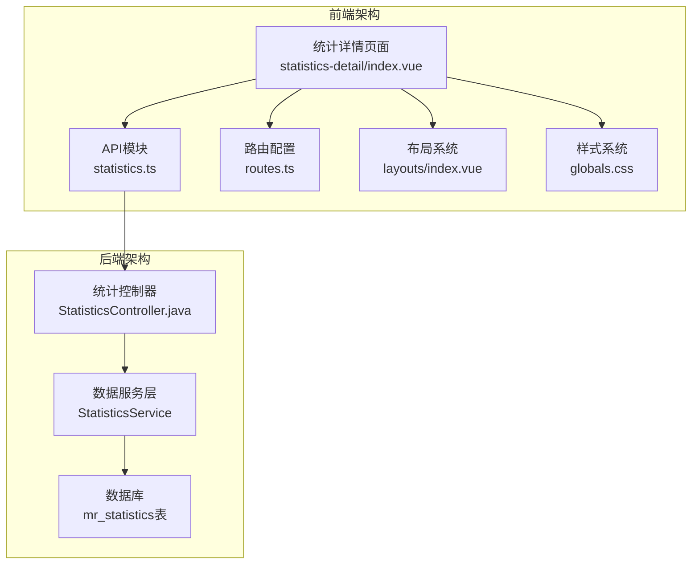
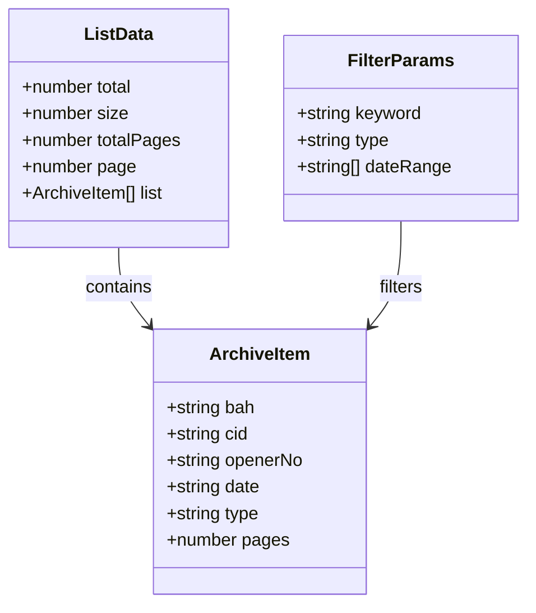
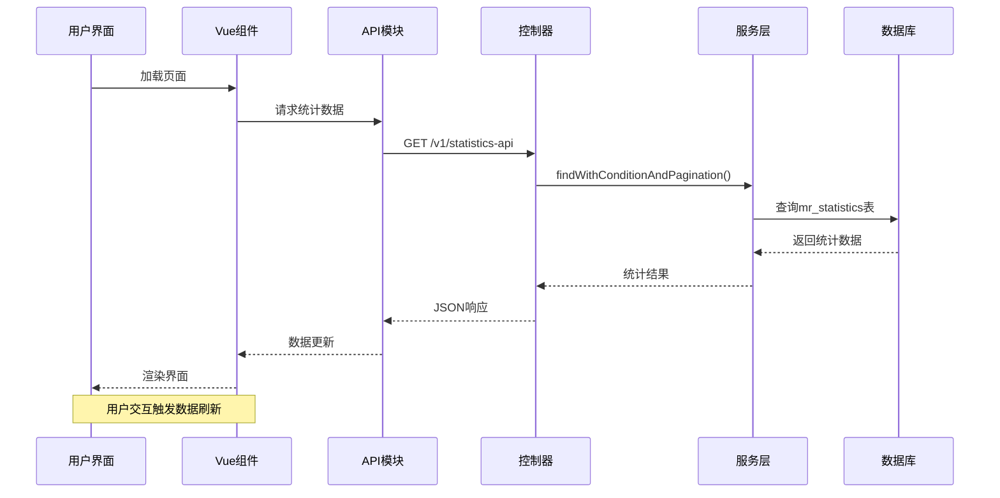
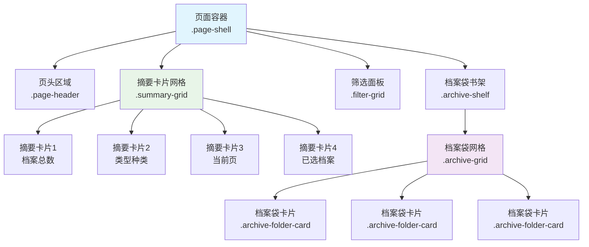
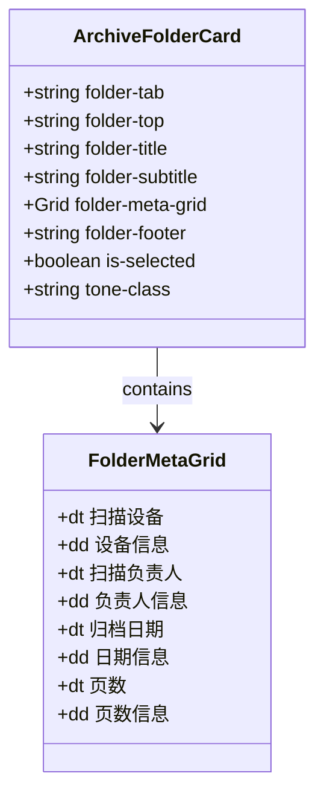
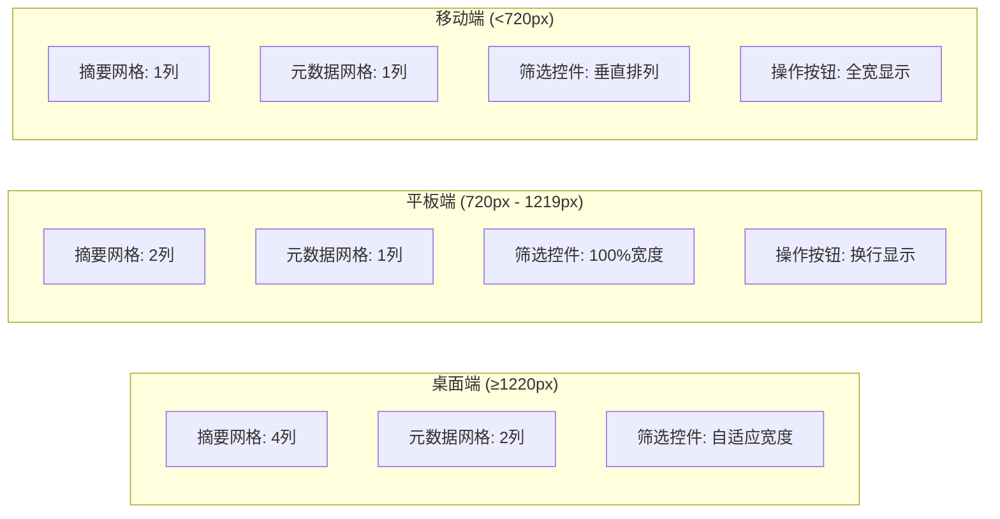

# 统计详情页面响应式设计

<cite>
**本文档引用的文件**
- [statistics-detail/index.vue](file://frontend-fantastic-admin/src/views/statistics-detail/index.vue)
- [StatisticsController.java](file://backend-repo/src/main/java/com/zjcxph/imgapi/controller/StatisticsController.java)
- [statistics.ts](file://frontend-fantastic-admin/src/api/modules/statistics.ts)
- [routes.ts](file://frontend-fantastic-admin/src/router/routes.ts)
- [globals.css](file://frontend-fantastic-admin/src/assets/styles/globals.css)
- [variables.scss](file://frontend-fantastic-admin/src/assets/styles/resources/variables.scss)
- [utils.scss](file://frontend-fantastic-admin/src/assets/styles/resources/utils.scss)
- [index.vue](file://frontend-fantastic-admin/src/layouts/index.vue)
- [settings.ts](file://frontend-fantastic-admin/src/settings.ts)
- [settings.ts](file://frontend-fantastic-admin/src/store/modules/settings.ts)
- [useMainPage.ts](file://frontend-fantastic-admin/src/utils/composables/useMainPage.ts)
- [vite.config.ts](file://frontend-fantastic-admin/vite.config.ts)
</cite>

## 目录
1. [简介](#简介)
2. [项目结构概览](#项目结构概览)
3. [核心组件分析](#核心组件分析)
4. [架构概览](#架构概览)
5. [详细组件分析](#详细组件分析)
6. [响应式设计实现](#响应式设计实现)
7. [性能考虑](#性能考虑)
8. [故障排除指南](#故障排除指南)
9. [结论](#结论)

## 简介

统计详情页面是MRR（Medical Record Repository）系统中的核心功能模块，负责展示病案统计的详细信息。该页面采用现代化的响应式设计，能够在不同设备和屏幕尺寸上提供一致的用户体验。页面通过仿真的档案袋卡片形式展示病案明细，集成了完整的筛选、分页和排序功能。

本页面实现了从桌面端到移动端的全面响应式适配，包括网格布局的智能调整、交互元素的优化以及视觉样式的自适应变化。

## 项目结构概览

MRR项目采用前后端分离架构，统计详情页面位于前端项目中，通过API与后端服务进行数据交互。



**图表来源**
- [statistics-detail/index.vue:1-768](file://frontend-fantastic-admin/src/views/statistics-detail/index.vue#L1-L768)
- [StatisticsController.java:1-281](file://backend-repo/src/main/java/com/zjcxph/imgapi/controller/StatisticsController.java#L1-L281)

**章节来源**
- [statistics-detail/index.vue:1-768](file://frontend-fantastic-admin/src/views/statistics-detail/index.vue#L1-L768)
- [routes.ts:136-143](file://frontend-fantastic-admin/src/router/routes.ts#L136-L143)

## 核心组件分析

统计详情页面的核心组件包含以下主要部分：

### 数据模型结构
页面使用了标准化的数据模型来处理病案统计信息：



**图表来源**
- [statistics-detail/index.vue:10-37](file://frontend-fantastic-admin/src/views/statistics-detail/index.vue#L10-L37)

### 核心功能特性
- **实时数据加载**：支持异步数据获取和错误处理
- **智能筛选**：基于关键词、类型、日期范围的多维筛选
- **灵活排序**：支持多种排序方式（日期、病案号、页数等）
- **分页控制**：动态分页和页面大小调整
- **响应式布局**：自适应不同屏幕尺寸

**章节来源**
- [statistics-detail/index.vue:109-165](file://frontend-fantastic-admin/src/views/statistics-detail/index.vue#L109-L165)
- [statistics-detail/index.vue:44-55](file://frontend-fantastic-admin/src/views/statistics-detail/index.vue#L44-L55)

## 架构概览

统计详情页面采用MVVM架构模式，结合Vue 3的Composition API实现。



**图表来源**
- [statistics.ts:4-21](file://frontend-fantastic-admin/src/api/modules/statistics.ts#L4-L21)
- [StatisticsController.java:43-109](file://backend-repo/src/main/java/com/zjcxph/imgapi/controller/StatisticsController.java#L43-L109)

## 详细组件分析

### 页面布局组件

统计详情页面采用网格布局系统，实现了多层次的响应式适配：



**图表来源**
- [statistics-detail/index.vue:228-440](file://frontend-fantastic-admin/src/views/statistics-detail/index.vue#L228-L440)

### 交互组件设计

页面实现了丰富的用户交互功能：

#### 档案袋卡片组件
每个档案袋卡片都包含完整的病案信息展示：



**图表来源**
- [statistics-detail/index.vue:372-421](file://frontend-fantastic-admin/src/views/statistics-detail/index.vue#L372-L421)

#### 筛选功能组件
页面提供了多维度的筛选能力：

| 筛选类型 | 控件类型 | 功能描述 |
|---------|---------|----------|
| 关键词搜索 | ElInput | 支持病案号和扫描设备的模糊搜索 |
| 类型筛选 | ElSelect | 按病案类型进行精确筛选 |
| 日期范围 | ElDatePicker | 支持自定义日期范围查询 |
| 排序方式 | ElSelect | 支持多种排序规则切换 |

**章节来源**
- [statistics-detail/index.vue:316-364](file://frontend-fantastic-admin/src/views/statistics-detail/index.vue#L316-L364)

## 响应式设计实现

统计详情页面实现了多层次的响应式设计，确保在各种设备上的最佳体验。

### 移动端适配策略



**图表来源**
- [statistics-detail/index.vue:733-767](file://frontend-fantastic-admin/src/views/statistics-detail/index.vue#L733-L767)

### 关键响应式断点

页面使用了三个主要的媒体查询断点：

| 断点范围 | 设计目标 | 主要变化 |
|---------|----------|----------|
| ≥1220px | 大屏幕桌面设备 | 最大化信息密度，使用4列摘要网格 |
| 720px-1219px | 平板设备 | 减少列数，优化触摸交互 |
| <720px | 移动设备 | 垂直布局，简化界面元素 |

### 样式系统架构

```mermaid
graph TB
subgraph "CSS变量系统"
A[:root --g-header-height]
B[:root --g-main-sidebar-width]
C[:root --g-sub-sidebar-width]
D[:root --g-tabbar-height]
end
subgraph "组件样式"
E[全局样式<br/>globals.css]
F[工具类样式<br/>utils.scss]
G[变量定义<br/>variables.scss]
H[页面特定样式<br/>statistics-detail.vue]
end
subgraph "响应式样式"
I[@media queries]
J[Grid布局调整]
K[Flex布局调整]
end
A --> E
B --> E
C --> E
D --> E
E --> H
F --> H
G --> H
H --> I
I --> J
I --> K
```

**图表来源**
- [globals.css:1-87](file://frontend-fantastic-admin/src/assets/styles/globals.css#L1-L87)
- [utils.scss:1-54](file://frontend-fantastic-admin/src/assets/styles/resources/utils.scss#L1-L54)

### 动态布局调整机制

页面通过CSS Grid和Flexbox的组合实现了智能的布局调整：

#### 摘要网格响应式
- **桌面端**: 使用4列Grid布局最大化信息展示
- **平板端**: 自动调整为2列布局
- **移动端**: 调整为单列垂直布局

#### 档案袋网格响应式
- **自动填充**: 使用`repeat(auto-fill, minmax(280px, 1fr))`实现自适应列数
- **最小宽度**: 确保每个卡片至少280px的可视宽度
- **间距统一**: 保持16px的网格间距

#### 筛选控件响应式
- **弹性布局**: 使用Flexbox实现控件的智能排列
- **宽度自适应**: 不同控件根据内容需求调整宽度
- **换行处理**: 在窄屏设备上自动换行显示

**章节来源**
- [statistics-detail/index.vue:583-767](file://frontend-fantastic-admin/src/views/statistics-detail/index.vue#L583-L767)

## 性能考虑

统计详情页面在设计时充分考虑了性能优化：

### 数据加载优化
- **分页加载**: 默认每页18条记录，避免一次性加载大量数据
- **条件筛选**: 通过后端条件过滤减少数据传输量
- **缓存策略**: 合理利用浏览器缓存机制

### 渲染性能优化
- **虚拟滚动**: 对于大数据集考虑使用虚拟滚动技术
- **懒加载**: 图片和重资源的延迟加载
- **组件复用**: 合理使用Vue的组件复用机制

### 网络性能优化
- **请求合并**: 将多个小请求合并为批量请求
- **压缩传输**: 启用Gzip压缩减少传输体积
- **CDN加速**: 静态资源通过CDN分发

## 故障排除指南

### 常见问题及解决方案

#### 数据加载失败
**问题症状**: 页面显示错误消息，数据为空
**可能原因**:
- 网络连接异常
- 后端服务不可用
- API参数错误

**解决步骤**:
1. 检查网络连接状态
2. 验证API端点可用性
3. 确认请求参数格式正确

#### 响应式布局异常
**问题症状**: 页面在某些设备上显示错乱
**可能原因**:
- CSS媒体查询冲突
- 样式优先级问题
- 浏览器兼容性问题

**解决步骤**:
1. 检查媒体查询语法
2. 验证CSS优先级顺序
3. 测试不同浏览器兼容性

#### 性能问题
**问题症状**: 页面加载缓慢，交互响应迟缓
**可能原因**:
- 过多DOM节点
- 复杂的CSS计算
- JavaScript执行阻塞

**解决步骤**:
1. 使用浏览器开发者工具分析性能
2. 优化CSS选择器复杂度
3. 实施懒加载和虚拟滚动

**章节来源**
- [statistics-detail/index.vue:152-156](file://frontend-fantastic-admin/src/views/statistics-detail/index.vue#L152-L156)

## 结论

统计详情页面的响应式设计成功实现了跨设备的一致用户体验。通过精心设计的网格系统、智能的布局调整机制和完善的交互功能，页面能够在从桌面端到移动端的各种场景下提供优秀的使用体验。

### 设计亮点

1. **智能网格系统**: 基于CSS Grid和Flexbox的混合布局，实现了真正的响应式设计
2. **用户体验优化**: 通过合理的间距、对比度和交互反馈提升了整体体验
3. **性能考虑**: 在保证功能完整性的同时，充分考虑了性能优化
4. **可维护性**: 清晰的代码结构和模块化设计便于后续维护和扩展

### 技术创新

- **动态样式变量**: 使用CSS自定义属性实现主题和样式的动态切换
- **智能断点**: 基于内容密度的响应式断点设计，而非简单的设备分类
- **渐进增强**: 从基础功能开始，逐步增强高级特性

该页面为MRR系统的前端开发提供了优秀的参考模板，展示了如何在现代Web应用中实现高质量的响应式设计。