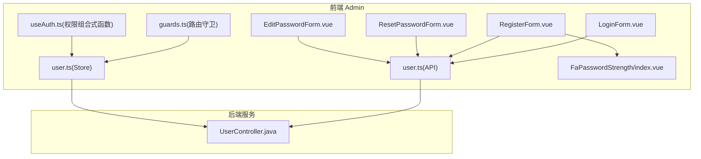
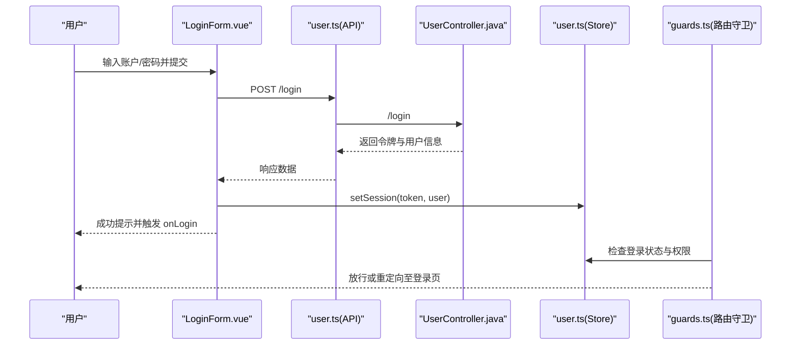
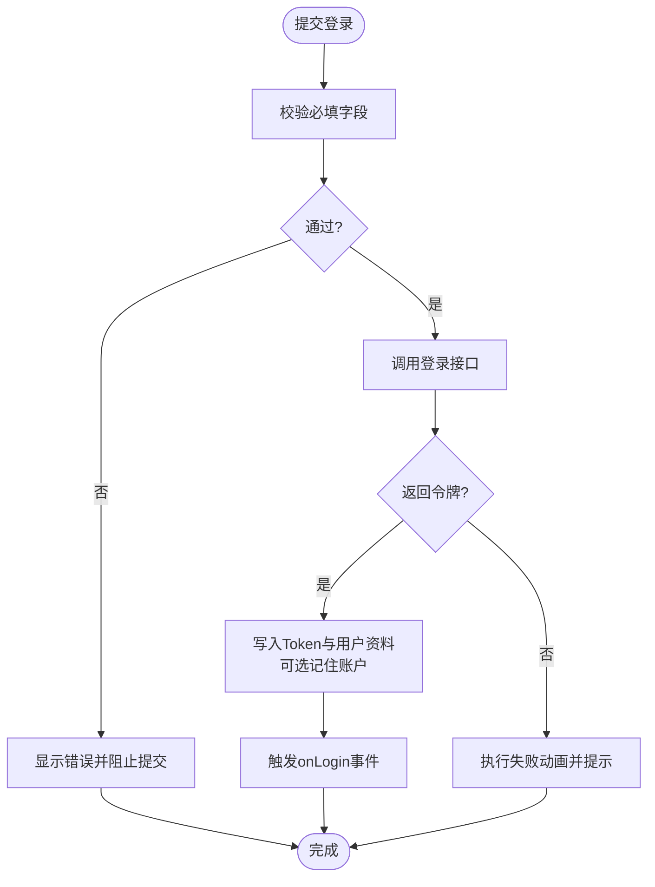
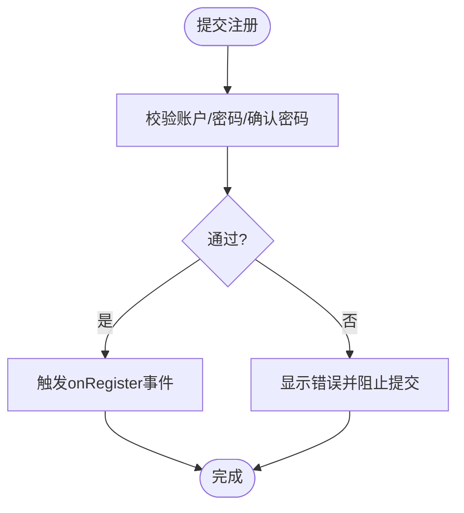
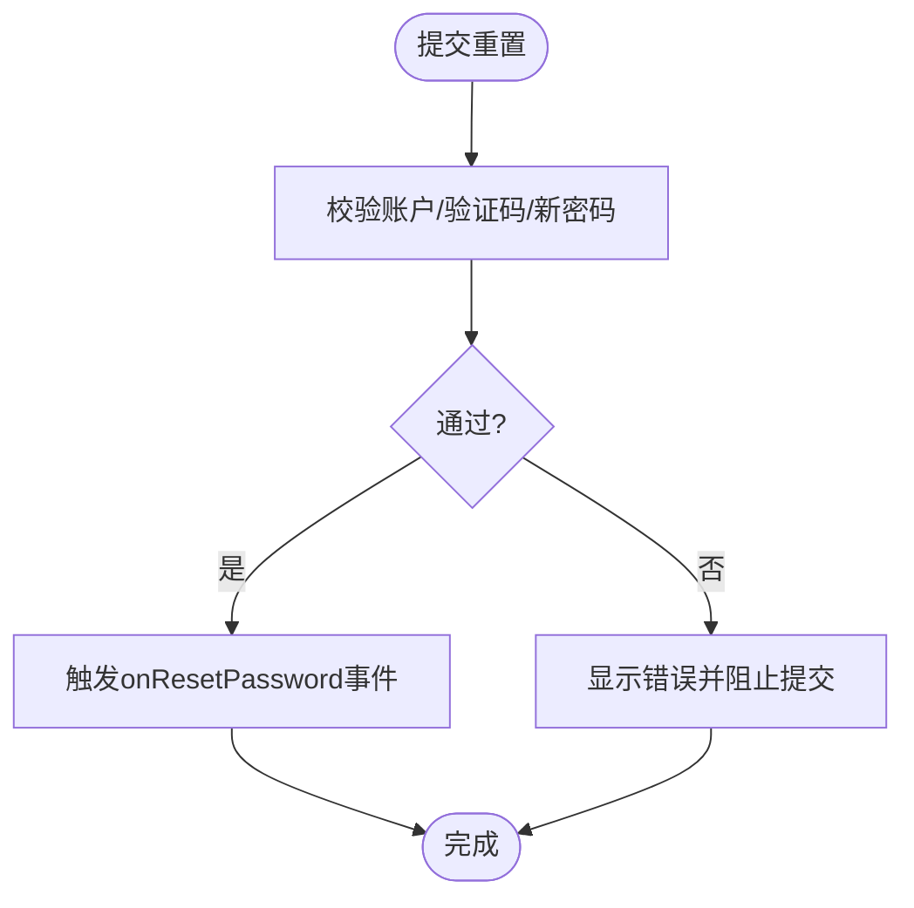
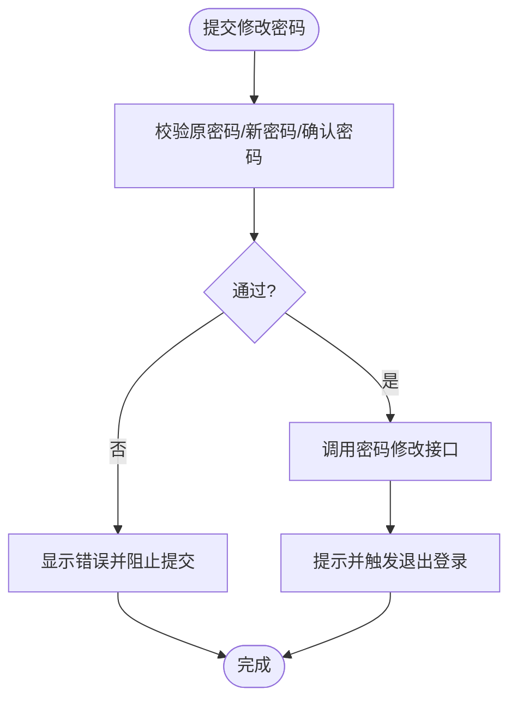
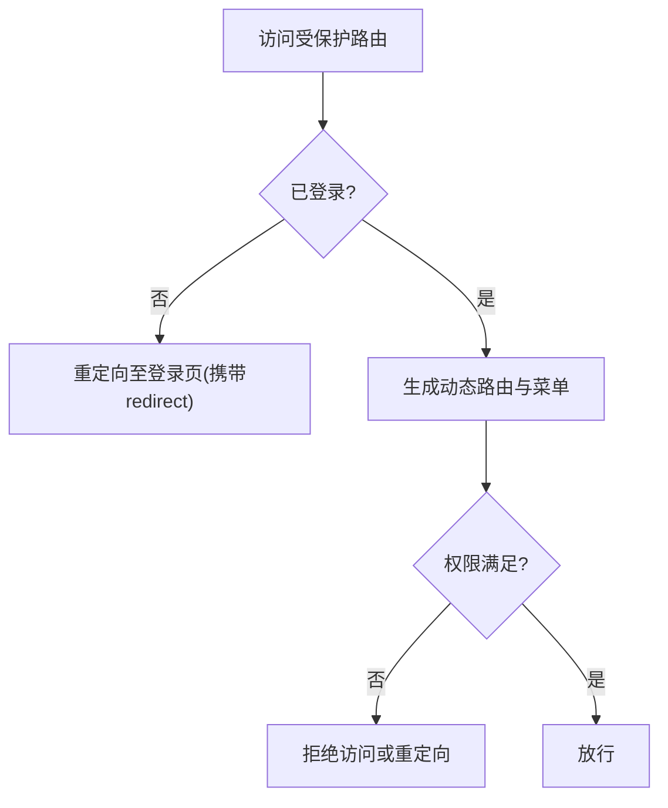
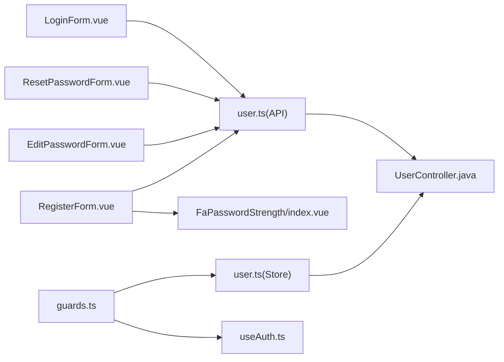

# 认证组件

<cite>
**本文引用的文件**
- [frontend-fantastic-admin/src/components/AccountForm/LoginForm.vue](file://frontend-fantastic-admin/src/components/AccountForm/LoginForm.vue)
- [frontend-fantastic-admin/src/components/AccountForm/RegisterForm.vue](file://frontend-fantastic-admin/src/components/AccountForm/RegisterForm.vue)
- [frontend-fantastic-admin/src/components/AccountForm/ResetPasswordForm.vue](file://frontend-fantastic-admin/src/components/AccountForm/ResetPasswordForm.vue)
- [frontend-fantastic-admin/src/components/AccountForm/EditPasswordForm.vue](file://frontend-fantastic-admin/src/components/AccountForm/EditPasswordForm.vue)
- [frontend-fantastic-admin/src/api/modules/user.ts](file://frontend-fantastic-admin/src/api/modules/user.ts)
- [frontend-fantastic-admin/src/store/modules/user.ts](file://frontend-fantastic-admin/src/store/modules/user.ts)
- [frontend-fantastic-admin/src/router/guards.ts](file://frontend-fantastic-admin/src/router/guards.ts)
- [frontend-fantastic-admin/src/utils/composables/useAuth.ts](file://frontend-fantastic-admin/src/utils/composables/useAuth.ts)
- [frontend-fantastic-admin/src/ui/components/FaPasswordStrength/index.vue](file://frontend-fantastic-admin/src/ui/components/FaPasswordStrength/index.vue)
- [frontend-fantastic-admin/src/api/modules/auth.ts](file://frontend-fantastic-admin/src/api/modules/auth.ts)
- [backend-repo/src/main/java/com/zjcxph/imgapi/controller/UserController.java](file://backend-repo/src/main/java/com/zjcxph/imgapi/controller/UserController.java)
</cite>

## 目录
1. [简介](#简介)
2. [项目结构](#项目结构)
3. [核心组件](#核心组件)
4. [架构总览](#架构总览)
5. [组件详细分析](#组件详细分析)
6. [依赖关系分析](#依赖关系分析)
7. [性能考量](#性能考量)
8. [故障排查指南](#故障排查指南)
9. [结论](#结论)
10. [附录](#附录)

## 简介
本文件面向“认证组件”的使用者与维护者，系统化梳理登录、注册、密码重置与修改密码等表单组件的用户界面与交互流程；记录字段校验规则、表单提交处理机制；提供典型使用示例以覆盖不同认证场景；并给出密码强度检测、验证码集成与多因素认证的扩展建议，以及表单状态管理、错误处理与用户体验优化的最佳实践。

## 项目结构
认证相关代码主要分布在前端 Admin 项目与后端 Spring Boot 项目中：
- 前端 Admin（Vue 3 + Vite）：认证表单组件、API 封装、用户状态管理、路由守卫与权限组合式函数。
- 后端服务（Spring Boot）：认证接口、会话与权限控制。

图表来源
- [frontend-fantastic-admin/src/components/AccountForm/LoginForm.vue:1-287](file://frontend-fantastic-admin/src/components/AccountForm/LoginForm.vue#L1-L287)
- [frontend-fantastic-admin/src/components/AccountForm/RegisterForm.vue:1-101](file://frontend-fantastic-admin/src/components/AccountForm/RegisterForm.vue#L1-L101)
- [frontend-fantastic-admin/src/components/AccountForm/ResetPasswordForm.vue:1-109](file://frontend-fantastic-admin/src/components/AccountForm/ResetPasswordForm.vue#L1-L109)
- [frontend-fantastic-admin/src/components/AccountForm/EditPasswordForm.vue:1-91](file://frontend-fantastic-admin/src/components/AccountForm/EditPasswordForm.vue#L1-L91)
- [frontend-fantastic-admin/src/api/modules/user.ts:1-21](file://frontend-fantastic-admin/src/api/modules/user.ts#L1-L21)
- [frontend-fantastic-admin/src/store/modules/user.ts:1-129](file://frontend-fantastic-admin/src/store/modules/user.ts#L1-L129)
- [frontend-fantastic-admin/src/router/guards.ts:1-214](file://frontend-fantastic-admin/src/router/guards.ts#L1-L214)
- [frontend-fantastic-admin/src/utils/composables/useAuth.ts:1-33](file://frontend-fantastic-admin/src/utils/composables/useAuth.ts#L1-L33)
- [frontend-fantastic-admin/src/ui/components/FaPasswordStrength/index.vue:57-99](file://frontend-fantastic-admin/src/ui/components/FaPasswordStrength/index.vue#L57-L99)
- [backend-repo/src/main/java/com/zjcxph/imgapi/controller/UserController.java:1-95](file://backend-repo/src/main/java/com/zjcxph/imgapi/controller/UserController.java#L1-L95)

章节来源
- [frontend-fantastic-admin/src/components/AccountForm/LoginForm.vue:1-287](file://frontend-fantastic-admin/src/components/AccountForm/LoginForm.vue#L1-L287)
- [frontend-fantastic-admin/src/components/AccountForm/RegisterForm.vue:1-101](file://frontend-fantastic-admin/src/components/AccountForm/RegisterForm.vue#L1-L101)
- [frontend-fantastic-admin/src/components/AccountForm/ResetPasswordForm.vue:1-109](file://frontend-fantastic-admin/src/components/AccountForm/ResetPasswordForm.vue#L1-L109)
- [frontend-fantastic-admin/src/components/AccountForm/EditPasswordForm.vue:1-91](file://frontend-fantastic-admin/src/components/AccountForm/EditPasswordForm.vue#L1-L91)
- [frontend-fantastic-admin/src/api/modules/user.ts:1-21](file://frontend-fantastic-admin/src/api/modules/user.ts#L1-L21)
- [frontend-fantastic-admin/src/store/modules/user.ts:1-129](file://frontend-fantastic-admin/src/store/modules/user.ts#L1-L129)
- [frontend-fantastic-admin/src/router/guards.ts:1-214](file://frontend-fantastic-admin/src/router/guards.ts#L1-L214)
- [frontend-fantastic-admin/src/utils/composables/useAuth.ts:1-33](file://frontend-fantastic-admin/src/utils/composables/useAuth.ts#L1-L33)
- [frontend-fantastic-admin/src/ui/components/FaPasswordStrength/index.vue:57-99](file://frontend-fantastic-admin/src/ui/components/FaPasswordStrength/index.vue#L57-L99)
- [backend-repo/src/main/java/com/zjcxph/imgapi/controller/UserController.java:1-95](file://backend-repo/src/main/java/com/zjcxph/imgapi/controller/UserController.java#L1-L95)

## 核心组件
- 登录表单（LoginForm）：用户名/密码登录，支持“记住我”、加载态与动画反馈、错误消息提示。
- 注册表单（RegisterForm）：用户名、密码与确认密码，内置密码强度指示器与二次校验。
- 密码重置表单（ResetPasswordForm）：用户名、图形验证码（6位）、新密码，带倒计时发送验证码。
- 修改密码表单（EditPasswordForm）：原密码、新密码与确认密码，提交后模拟修改并强制重新登录。
- 用户状态管理（User Store）：Token、头像、账号、权限与个人资料持久化，登录/登出流程。
- 路由守卫（Router Guards）：鉴权拦截、动态路由生成、权限白名单与自动重定向。
- 权限组合式函数（useAuth）：基于配置的权限判定与路由元信息授权。
- 密码强度组件（FaPasswordStrength）：密码强度可视化与安全建议提示。
- 前端认证 API（user.ts）：封装登录、当前用户、密码修改等接口调用。
- 后端认证控制器（UserController）：登录、当前用户、用户与角色列表等接口。

章节来源
- [frontend-fantastic-admin/src/components/AccountForm/LoginForm.vue:1-287](file://frontend-fantastic-admin/src/components/AccountForm/LoginForm.vue#L1-L287)
- [frontend-fantastic-admin/src/components/AccountForm/RegisterForm.vue:1-101](file://frontend-fantastic-admin/src/components/AccountForm/RegisterForm.vue#L1-L101)
- [frontend-fantastic-admin/src/components/AccountForm/ResetPasswordForm.vue:1-109](file://frontend-fantastic-admin/src/components/AccountForm/ResetPasswordForm.vue#L1-L109)
- [frontend-fantastic-admin/src/components/AccountForm/EditPasswordForm.vue:1-91](file://frontend-fantastic-admin/src/components/AccountForm/EditPasswordForm.vue#L1-L91)
- [frontend-fantastic-admin/src/store/modules/user.ts:1-129](file://frontend-fantastic-admin/src/store/modules/user.ts#L1-L129)
- [frontend-fantastic-admin/src/router/guards.ts:1-214](file://frontend-fantastic-admin/src/router/guards.ts#L1-L214)
- [frontend-fantastic-admin/src/utils/composables/useAuth.ts:1-33](file://frontend-fantastic-admin/src/utils/composables/useAuth.ts#L1-L33)
- [frontend-fantastic-admin/src/ui/components/FaPasswordStrength/index.vue:57-99](file://frontend-fantastic-admin/src/ui/components/FaPasswordStrength/index.vue#L57-L99)
- [frontend-fantastic-admin/src/api/modules/user.ts:1-21](file://frontend-fantastic-admin/src/api/modules/user.ts#L1-L21)
- [backend-repo/src/main/java/com/zjcxph/imgapi/controller/UserController.java:1-95](file://backend-repo/src/main/java/com/zjcxph/imgapi/controller/UserController.java#L1-L95)

## 架构总览
认证流程从表单组件发起，经前端 API 层调用后端接口，成功后写入用户状态并触发路由跳转；路由守卫根据权限与配置决定页面可访问性。

图表来源
- [frontend-fantastic-admin/src/components/AccountForm/LoginForm.vue:50-98](file://frontend-fantastic-admin/src/components/AccountForm/LoginForm.vue#L50-L98)
- [frontend-fantastic-admin/src/api/modules/user.ts:3-7](file://frontend-fantastic-admin/src/api/modules/user.ts#L3-L7)
- [backend-repo/src/main/java/com/zjcxph/imgapi/controller/UserController.java:38-47](file://backend-repo/src/main/java/com/zjcxph/imgapi/controller/UserController.java#L38-L47)
- [frontend-fantastic-admin/src/store/modules/user.ts:44-64](file://frontend-fantastic-admin/src/store/modules/user.ts#L44-L64)
- [frontend-fantastic-admin/src/router/guards.ts:13-34](file://frontend-fantastic-admin/src/router/guards.ts#L13-L34)

## 组件详细分析

### 登录表单（LoginForm）
- 字段与校验
  - 账户：必填
  - 密码：必填
  - 记住我：布尔值
- 行为与交互
  - 提交时禁用按钮并触发动画反馈
  - 成功：写入 Token 与用户资料，按需持久化账户；触发 onLogin 事件
  - 失败：解析错误消息并弹出提示，执行摇摆动画
- 状态管理
  - 使用用户 Store 写入本地存储与全局状态
- 安全与体验
  - 自动填充属性与无障碍标签
  - 减少运动偏好下的动画优化

图表来源
- [frontend-fantastic-admin/src/components/AccountForm/LoginForm.vue:37-98](file://frontend-fantastic-admin/src/components/AccountForm/LoginForm.vue#L37-L98)
- [frontend-fantastic-admin/src/store/modules/user.ts:44-64](file://frontend-fantastic-admin/src/store/modules/user.ts#L44-L64)

章节来源
- [frontend-fantastic-admin/src/components/AccountForm/LoginForm.vue:16-98](file://frontend-fantastic-admin/src/components/AccountForm/LoginForm.vue#L16-L98)
- [frontend-fantastic-admin/src/store/modules/user.ts:44-64](file://frontend-fantastic-admin/src/store/modules/user.ts#L44-L64)

### 注册表单（RegisterForm）
- 字段与校验
  - 账户：必填
  - 密码：必填，长度 6-18
  - 确认密码：必填，需与密码一致
- 行为与交互
  - 提交时触发 onRegister 事件，交由上层处理后续逻辑
  - 密码强度通过 FaPasswordStrength 可视化提示
- 错误处理
  - 使用 FormMessage 实时反馈校验错误

图表来源
- [frontend-fantastic-admin/src/components/AccountForm/RegisterForm.vue:22-42](file://frontend-fantastic-admin/src/components/AccountForm/RegisterForm.vue#L22-L42)
- [frontend-fantastic-admin/src/ui/components/FaPasswordStrength/index.vue:57-99](file://frontend-fantastic-admin/src/ui/components/FaPasswordStrength/index.vue#L57-L99)

章节来源
- [frontend-fantastic-admin/src/components/AccountForm/RegisterForm.vue:11-42](file://frontend-fantastic-admin/src/components/AccountForm/RegisterForm.vue#L11-L42)
- [frontend-fantastic-admin/src/ui/components/FaPasswordStrength/index.vue:57-99](file://frontend-fantastic-admin/src/ui/components/FaPasswordStrength/index.vue#L57-L99)

### 密码重置表单（ResetPasswordForm）
- 字段与校验
  - 账户：必填
  - 验证码：必填，6 位
  - 新密码：必填，长度 6-18
- 行为与交互
  - 发送验证码按钮带倒计时（60 秒）
  - 提交时触发 onResetPassword 事件
- 集成点
  - 验证码输入使用 FaPinInput 组件
  - 表单消息与错误样式统一

图表来源
- [frontend-fantastic-admin/src/components/AccountForm/ResetPasswordForm.vue:22-37](file://frontend-fantastic-admin/src/components/AccountForm/ResetPasswordForm.vue#L22-L37)

章节来源
- [frontend-fantastic-admin/src/components/AccountForm/ResetPasswordForm.vue:11-37](file://frontend-fantastic-admin/src/components/AccountForm/ResetPasswordForm.vue#L11-L37)

### 修改密码表单（EditPasswordForm）
- 字段与校验
  - 原密码：必填
  - 新密码：必填，长度 6-18
  - 确认密码：必填，需与新密码一致
- 行为与交互
  - 提交后调用用户 Store 的密码修改方法
  - 成功后提示并强制退出登录
- 错误处理
  - 使用 FormMessage 实时反馈校验错误

图表来源
- [frontend-fantastic-admin/src/components/AccountForm/EditPasswordForm.vue:16-41](file://frontend-fantastic-admin/src/components/AccountForm/EditPasswordForm.vue#L16-L41)
- [frontend-fantastic-admin/src/store/modules/user.ts:109-111](file://frontend-fantastic-admin/src/store/modules/user.ts#L109-L111)

章节来源
- [frontend-fantastic-admin/src/components/AccountForm/EditPasswordForm.vue:12-41](file://frontend-fantastic-admin/src/components/AccountForm/EditPasswordForm.vue#L12-L41)
- [frontend-fantastic-admin/src/store/modules/user.ts:109-111](file://frontend-fantastic-admin/src/store/modules/user.ts#L109-L111)

### 密码强度检测（FaPasswordStrength）
- 功能要点
  - 根据密码内容计算强度并可视化进度条
  - 提示包含长度、大小写、数字、特殊字符等建议
- 集成位置
  - 注册表单中作为密码输入的描述信息展示

章节来源
- [frontend-fantastic-admin/src/ui/components/FaPasswordStrength/index.vue:57-99](file://frontend-fantastic-admin/src/ui/components/FaPasswordStrength/index.vue#L57-L99)
- [frontend-fantastic-admin/src/components/AccountForm/RegisterForm.vue:66-73](file://frontend-fantastic-admin/src/components/AccountForm/RegisterForm.vue#L66-L73)

### 验证码集成与倒计时
- 发送验证码
  - ResetPasswordForm 内置倒计时（60 秒），按钮禁用直至结束
  - 使用计时器更新剩余秒数
- 集成建议
  - 前端仅负责 UI 与倒计时；后端需提供验证码生成与校验接口

章节来源
- [frontend-fantastic-admin/src/components/AccountForm/ResetPasswordForm.vue:39-49](file://frontend-fantastic-admin/src/components/AccountForm/ResetPasswordForm.vue#L39-L49)

### 多因素认证（MFA）支持方案
- 方案概述
  - 在登录成功后，若启用 MFA，引导用户完成二次验证（如短信/邮件验证码、TOTP 等）
  - 二次验证通过后才允许进入受保护页面
- 前端扩展点
  - 在登录成功后的路由守卫阶段增加 MFA 校验分支
  - 引导用户到 MFA 验证页面，完成后写入最终会话状态
- 安全建议
  - 严格限制 MFA 请求频率与有效期
  - 采用一次性令牌与防重放机制

（本节为概念性指导，无需源码引用）

### 表单状态管理与错误处理
- 状态管理
  - 用户 Store 统一管理 Token、头像、账号、权限与个人资料，并持久化到本地存储
  - 登录成功后写入状态并触发路由跳转
- 错误处理
  - 登录失败时解析响应消息并提示
  - 提交失败时统一弹窗提示并可分组展示
- 用户体验
  - 加载态与动画反馈减少感知延迟
  - 减少运动偏好下的动画优化

章节来源
- [frontend-fantastic-admin/src/store/modules/user.ts:44-100](file://frontend-fantastic-admin/src/store/modules/user.ts#L44-L100)
- [frontend-fantastic-admin/src/components/AccountForm/LoginForm.vue:33-98](file://frontend-fantastic-admin/src/components/AccountForm/LoginForm.vue#L33-L98)

### 路由守卫与权限控制
- 登录拦截
  - 未登录访问受保护路由时重定向至登录页并携带重定向参数
- 动态路由生成
  - 登录后根据配置与权限生成路由与菜单
- 权限判定
  - 结合 useAuth 组合式函数与路由元信息中的 auth 字段进行访问控制
- 自动重定向
  - 父级路由未配置重定向时，自动选择首个具备访问权限的子路由

图表来源
- [frontend-fantastic-admin/src/router/guards.ts:6-101](file://frontend-fantastic-admin/src/router/guards.ts#L6-L101)
- [frontend-fantastic-admin/src/utils/composables/useAuth.ts:1-33](file://frontend-fantastic-admin/src/utils/composables/useAuth.ts#L1-L33)

章节来源
- [frontend-fantastic-admin/src/router/guards.ts:1-214](file://frontend-fantastic-admin/src/router/guards.ts#L1-L214)
- [frontend-fantastic-admin/src/utils/composables/useAuth.ts:1-33](file://frontend-fantastic-admin/src/utils/composables/useAuth.ts#L1-L33)

### 使用示例（典型场景）
- 场景一：标准登录
  - 步骤：渲染 LoginForm，绑定 onLogin 事件，登录成功后跳转首页
  - 关键点：登录成功写入 Token 与用户资料，触发路由守卫
  - 参考路径：[frontend-fantastic-admin/src/components/AccountForm/LoginForm.vue:50-98](file://frontend-fantastic-admin/src/components/AccountForm/LoginForm.vue#L50-L98)，[frontend-fantastic-admin/src/store/modules/user.ts:44-64](file://frontend-fantastic-admin/src/store/modules/user.ts#L44-L64)
- 场景二：注册并登录
  - 步骤：渲染 RegisterForm，绑定 onRegister 事件，交由上层处理注册流程；随后跳转登录页
  - 关键点：密码强度可视化与二次校验
  - 参考路径：[frontend-fantastic-admin/src/components/AccountForm/RegisterForm.vue:39-42](file://frontend-fantastic-admin/src/components/AccountForm/RegisterForm.vue#L39-L42)，[frontend-fantastic-admin/src/ui/components/FaPasswordStrength/index.vue:57-99](file://frontend-fantastic-admin/src/ui/components/FaPasswordStrength/index.vue#L57-L99)
- 场景三：忘记密码
  - 步骤：渲染 ResetPasswordForm，点击发送验证码按钮，填写验证码与新密码后提交
  - 关键点：倒计时与 6 位验证码输入
  - 参考路径：[frontend-fantastic-admin/src/components/AccountForm/ResetPasswordForm.vue:39-49](file://frontend-fantastic-admin/src/components/AccountForm/ResetPasswordForm.vue#L39-L49)
- 场景四：修改密码
  - 步骤：渲染 EditPasswordForm，输入原密码与新密码后提交，提示后自动退出登录
  - 关键点：前后端配合完成密码变更
  - 参考路径：[frontend-fantastic-admin/src/components/AccountForm/EditPasswordForm.vue:33-41](file://frontend-fantastic-admin/src/components/AccountForm/EditPasswordForm.vue#L33-L41)，[frontend-fantastic-admin/src/store/modules/user.ts:109-111](file://frontend-fantastic-admin/src/store/modules/user.ts#L109-L111)

## 依赖关系分析
- 组件间依赖
  - 表单组件依赖前端 API 模块与 UI 组合式表单组件
  - 用户 Store 为登录与登出的核心状态中心
  - 路由守卫依赖用户 Store 与权限组合式函数
- 外部依赖
  - 后端认证接口提供登录、当前用户、用户与角色列表等能力

图表来源
- [frontend-fantastic-admin/src/components/AccountForm/LoginForm.vue:1-20](file://frontend-fantastic-admin/src/components/AccountForm/LoginForm.vue#L1-L20)
- [frontend-fantastic-admin/src/components/AccountForm/RegisterForm.vue:1-20](file://frontend-fantastic-admin/src/components/AccountForm/RegisterForm.vue#L1-L20)
- [frontend-fantastic-admin/src/components/AccountForm/ResetPasswordForm.vue:1-20](file://frontend-fantastic-admin/src/components/AccountForm/ResetPasswordForm.vue#L1-L20)
- [frontend-fantastic-admin/src/components/AccountForm/EditPasswordForm.vue:1-20](file://frontend-fantastic-admin/src/components/AccountForm/EditPasswordForm.vue#L1-L20)
- [frontend-fantastic-admin/src/api/modules/user.ts:1-21](file://frontend-fantastic-admin/src/api/modules/user.ts#L1-L21)
- [frontend-fantastic-admin/src/store/modules/user.ts:1-129](file://frontend-fantastic-admin/src/store/modules/user.ts#L1-L129)
- [frontend-fantastic-admin/src/router/guards.ts:1-214](file://frontend-fantastic-admin/src/router/guards.ts#L1-L214)
- [frontend-fantastic-admin/src/utils/composables/useAuth.ts:1-33](file://frontend-fantastic-admin/src/utils/composables/useAuth.ts#L1-L33)
- [frontend-fantastic-admin/src/ui/components/FaPasswordStrength/index.vue:57-99](file://frontend-fantastic-admin/src/ui/components/FaPasswordStrength/index.vue#L57-L99)
- [backend-repo/src/main/java/com/zjcxph/imgapi/controller/UserController.java:1-95](file://backend-repo/src/main/java/com/zjcxph/imgapi/controller/UserController.java#L1-L95)

章节来源
- [frontend-fantastic-admin/src/components/AccountForm/LoginForm.vue:1-20](file://frontend-fantastic-admin/src/components/AccountForm/LoginForm.vue#L1-L20)
- [frontend-fantastic-admin/src/components/AccountForm/RegisterForm.vue:1-20](file://frontend-fantastic-admin/src/components/AccountForm/RegisterForm.vue#L1-L20)
- [frontend-fantastic-admin/src/components/AccountForm/ResetPasswordForm.vue:1-20](file://frontend-fantastic-admin/src/components/AccountForm/ResetPasswordForm.vue#L1-L20)
- [frontend-fantastic-admin/src/components/AccountForm/EditPasswordForm.vue:1-20](file://frontend-fantastic-admin/src/components/AccountForm/EditPasswordForm.vue#L1-L20)
- [frontend-fantastic-admin/src/api/modules/user.ts:1-21](file://frontend-fantastic-admin/src/api/modules/user.ts#L1-L21)
- [frontend-fantastic-admin/src/store/modules/user.ts:1-129](file://frontend-fantastic-admin/src/store/modules/user.ts#L1-L129)
- [frontend-fantastic-admin/src/router/guards.ts:1-214](file://frontend-fantastic-admin/src/router/guards.ts#L1-L214)
- [frontend-fantastic-admin/src/utils/composables/useAuth.ts:1-33](file://frontend-fantastic-admin/src/utils/composables/useAuth.ts#L1-L33)
- [frontend-fantastic-admin/src/ui/components/FaPasswordStrength/index.vue:57-99](file://frontend-fantastic-admin/src/ui/components/FaPasswordStrength/index.vue#L57-L99)
- [backend-repo/src/main/java/com/zjcxph/imgapi/controller/UserController.java:1-95](file://backend-repo/src/main/java/com/zjcxph/imgapi/controller/UserController.java#L1-L95)

## 性能考量
- 表单提交
  - 使用加载态与动画反馈改善感知性能，避免频繁重绘
- 路由生成
  - 动态路由仅在首次登录后生成，后续复用以降低开销
- 权限判定
  - 权限组合式函数基于本地存储与配置快速判定，避免重复请求
- 存储策略
  - 用户资料与 Token 持久化于本地存储，减少重复登录成本

（本节为通用指导，无需源码引用）

## 故障排查指南
- 登录失败
  - 现象：提示错误消息，表单轻微摇摆
  - 排查：检查网络请求、后端返回结构与消息字段映射
  - 参考路径：[frontend-fantastic-admin/src/components/AccountForm/LoginForm.vue:76-90](file://frontend-fantastic-admin/src/components/AccountForm/LoginForm.vue#L76-L90)
- 验证码倒计时异常
  - 现象：按钮无法重新发送或倒计时不变化
  - 排查：确认倒计时逻辑与计时器清理
  - 参考路径：[frontend-fantastic-admin/src/components/AccountForm/ResetPasswordForm.vue:39-49](file://frontend-fantastic-admin/src/components/AccountForm/ResetPasswordForm.vue#L39-L49)
- 密码强度不生效
  - 现象：注册时未显示强度提示
  - 排查：确认 FaPasswordStrength 组件正确传入密码值
  - 参考路径：[frontend-fantastic-admin/src/ui/components/FaPasswordStrength/index.vue:57-99](file://frontend-fantastic-admin/src/ui/components/FaPasswordStrength/index.vue#L57-L99)，[frontend-fantastic-admin/src/components/AccountForm/RegisterForm.vue:66-73](file://frontend-fantastic-admin/src/components/AccountForm/RegisterForm.vue#L66-L73)
- 登录后仍被重定向至登录页
  - 现象：登录成功后立即被重定向
  - 排查：检查路由守卫逻辑与权限生成流程
  - 参考路径：[frontend-fantastic-admin/src/router/guards.ts:35-89](file://frontend-fantastic-admin/src/router/guards.ts#L35-L89)

章节来源
- [frontend-fantastic-admin/src/components/AccountForm/LoginForm.vue:76-90](file://frontend-fantastic-admin/src/components/AccountForm/LoginForm.vue#L76-L90)
- [frontend-fantastic-admin/src/components/AccountForm/ResetPasswordForm.vue:39-49](file://frontend-fantastic-admin/src/components/AccountForm/ResetPasswordForm.vue#L39-L49)
- [frontend-fantastic-admin/src/ui/components/FaPasswordStrength/index.vue:57-99](file://frontend-fantastic-admin/src/ui/components/FaPasswordStrength/index.vue#L57-L99)
- [frontend-fantastic-admin/src/components/AccountForm/RegisterForm.vue:66-73](file://frontend-fantastic-admin/src/components/AccountForm/RegisterForm.vue#L66-L73)
- [frontend-fantastic-admin/src/router/guards.ts:35-89](file://frontend-fantastic-admin/src/router/guards.ts#L35-L89)

## 结论
本认证组件体系以表单组件为核心，结合前端 API、用户状态管理与路由守卫，形成完整的登录、注册、密码重置与修改密码流程。通过密码强度可视化与验证码倒计时增强用户体验；通过权限组合式函数与路由守卫保障访问安全。建议在现有基础上扩展后端验证码与 MFA 接口，完善多因素认证能力，并持续优化错误提示与加载态反馈。

## 附录
- 后端认证接口概览
  - 登录：POST /login
  - 当前用户：GET /v1/auth/me
  - 用户列表：GET /v1/auth/users
  - 角色列表：GET /v1/auth/roles
  - 更新用户：PUT /v1/auth/users/{id}
  - 删除用户：DELETE /v1/auth/users/{id}

章节来源
- [backend-repo/src/main/java/com/zjcxph/imgapi/controller/UserController.java:38-93](file://backend-repo/src/main/java/com/zjcxph/imgapi/controller/UserController.java#L38-L93)
- [frontend-fantastic-admin/src/api/modules/auth.ts:3-25](file://frontend-fantastic-admin/src/api/modules/auth.ts#L3-L25)