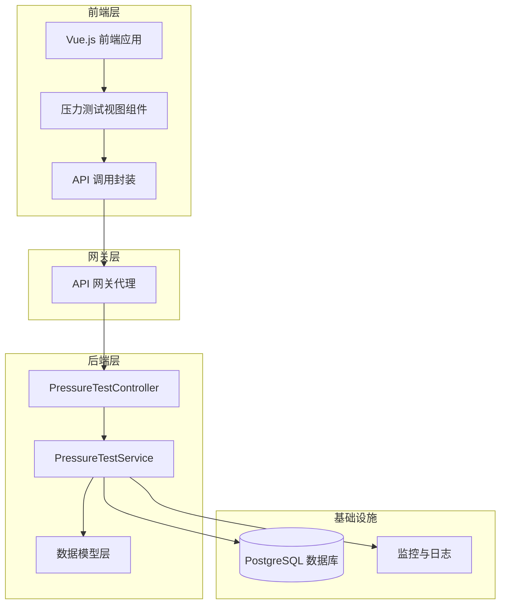
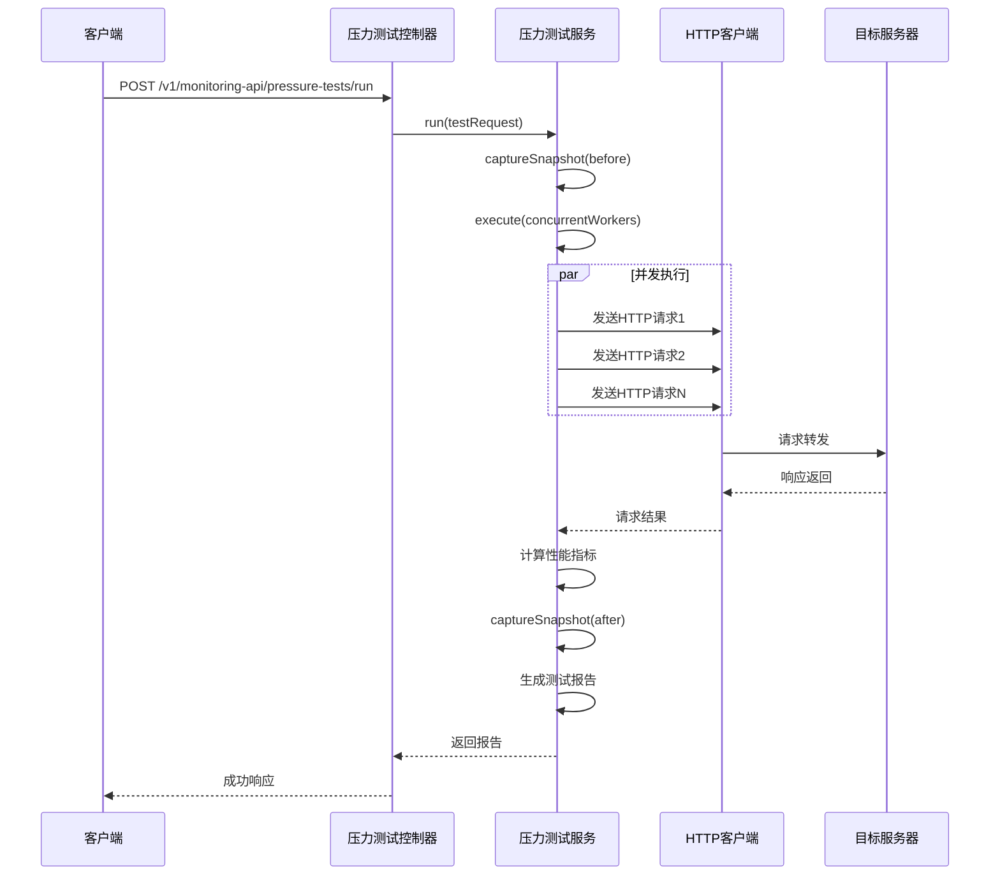
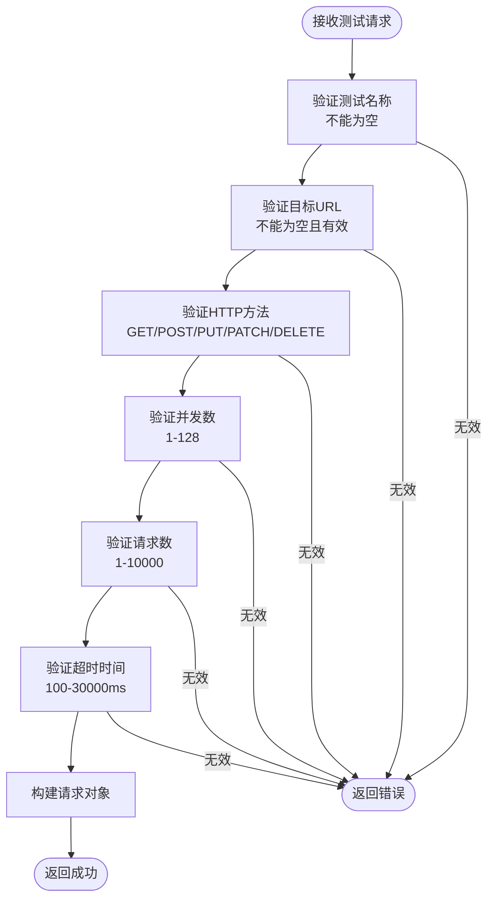
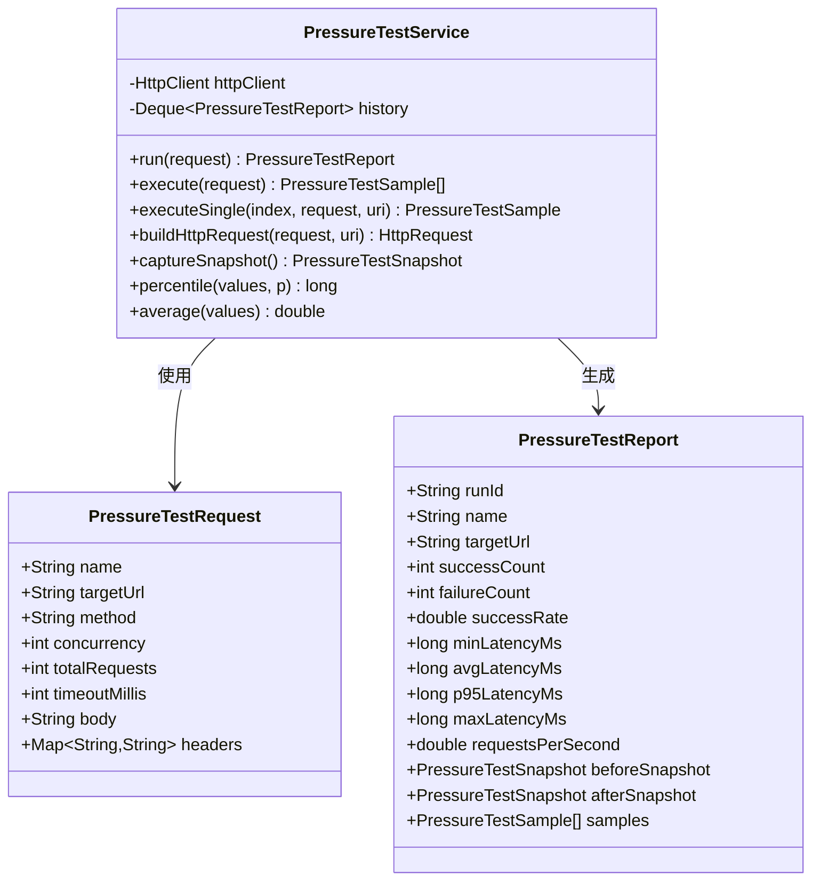
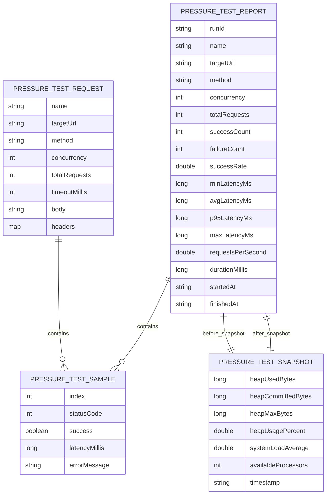
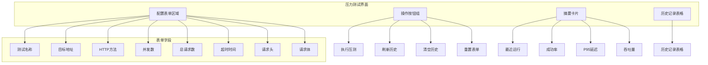
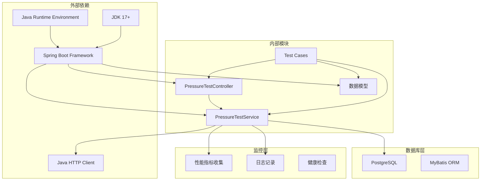

# 压力测试API

<cite>
**本文档引用的文件**
- [PressureTestController.java](file://backend-repo/src/main/java/com/zjcxph/imgapi/controller/PressureTestController.java)
- [PressureTestService.java](file://backend-repo/src/main/java/com/zjcxph/imgapi/monitoring/PressureTestService.java)
- [PressureTestRequest.java](file://backend-repo/src/main/java/com/zjcxph/imgapi/monitoring/PressureTestRequest.java)
- [PressureTestReport.java](file://backend-repo/src/main/java/com/zjcxph/imgapi/monitoring/PressureTestReport.java)
- [PressureTestSample.java](file://backend-repo/src/main/java/com/zjcxph/imgapi/monitoring/PressureTestSample.java)
- [PressureTestSnapshot.java](file://backend-repo/src/main/java/com/zjcxph/imgapi/monitoring/PressureTestSnapshot.java)
- [PressureTestControllerIntegrationTest.java](file://backend-repo/src/test/java/com/zjcxph/imgapi/PressureTestControllerIntegrationTest.java)
- [PressureTestServiceTest.java](file://backend-repo/src/test/java/com/zjcxph/imgapi/PressureTestServiceTest.java)
- [PressureTestView.vue](file://frontend-repo/src/components/admin/PressureTestView.vue)
- [API_CONTRACT.md](file://backend-repo/API_CONTRACT.md)
- [SYSTEM_ARCHITECTURE.md](file://SYSTEM_ARCHITECTURE.md)
</cite>

## 目录
1. [简介](#简介)
2. [项目结构](#项目结构)
3. [核心组件](#核心组件)
4. [架构概览](#架构概览)
5. [详细组件分析](#详细组件分析)
6. [依赖关系分析](#依赖关系分析)
7. [性能考虑](#性能考虑)
8. [故障排除指南](#故障排除指南)
9. [结论](#结论)
10. [附录](#附录)

## 简介

MRR压力测试API是一个专门设计用于系统负载测试、性能基准测试和压力评估的完整解决方案。该API提供了实时的并发用户模拟、精确的响应时间测量、详细的测试报告生成和全面的性能指标统计功能。

本API的核心目标是帮助开发者和运维团队：
- 执行系统级别的压力测试和负载测试
- 分析系统的性能瓶颈和容量限制
- 监控关键性能指标（如吞吐量、延迟、成功率）
- 提供可追溯的测试历史和报告
- 支持自动化测试集成和持续性能监控

## 项目结构

MRR项目采用前后端分离的架构设计，压力测试功能位于后端服务中，通过RESTful API提供服务，前端通过Vue.js组件进行用户交互。



**图表来源**
- [PressureTestController.java:1-73](file://backend-repo/src/main/java/com/zjcxph/imgapi/controller/PressureTestController.java#L1-L73)
- [PressureTestService.java:1-293](file://backend-repo/src/main/java/com/zjcxph/imgapi/monitoring/PressureTestService.java#L1-L293)

**章节来源**
- [SYSTEM_ARCHITECTURE.md:1-72](file://SYSTEM_ARCHITECTURE.md#L1-L72)
- [API_CONTRACT.md:1-44](file://backend-repo/API_CONTRACT.md#L1-L44)

## 核心组件

压力测试API由多个核心组件构成，每个组件都有明确的职责和功能：

### 控制器层
- **PressureTestController**: 提供RESTful API接口，处理压力测试的启动、查询和管理操作
- **Result**: 统一的响应包装类，确保API响应格式的一致性

### 服务层
- **PressureTestService**: 核心业务逻辑实现，负责并发请求执行、性能指标计算和报告生成
- **HttpClient**: 基于Java标准库的HTTP客户端，支持自定义超时和重定向策略

### 数据模型层
- **PressureTestRequest**: 测试请求参数的验证和封装
- **PressureTestReport**: 完整的测试报告数据结构
- **PressureTestSample**: 单个请求样本的数据模型
- **PressureTestSnapshot**: 系统资源快照数据

**章节来源**
- [PressureTestController.java:22-73](file://backend-repo/src/main/java/com/zjcxph/imgapi/controller/PressureTestController.java#L22-L73)
- [PressureTestService.java:32-293](file://backend-repo/src/main/java/com/zjcxph/imgapi/monitoring/PressureTestService.java#L32-L293)

## 架构概览

压力测试API采用分层架构设计，确保了良好的可维护性和扩展性：



**图表来源**
- [PressureTestController.java:35-41](file://backend-repo/src/main/java/com/zjcxph/imgapi/controller/PressureTestController.java#L35-L41)
- [PressureTestService.java:44-112](file://backend-repo/src/main/java/com/zjcxph/imgapi/monitoring/PressureTestService.java#L44-L112)

**章节来源**
- [PressureTestService.java:138-170](file://backend-repo/src/main/java/com/zjcxph/imgapi/monitoring/PressureTestService.java#L138-L170)

## 详细组件分析

### 压力测试控制器 (PressureTestController)

控制器层提供了完整的RESTful API接口，支持压力测试的全生命周期管理：

#### 核心API端点

| 端点 | 方法 | 描述 | 请求体 | 响应 |
|------|------|------|--------|------|
| `/v1/monitoring-api/pressure-tests/run` | POST | 运行压力测试 | PressureTestRequest | PressureTestReport |
| `/v1/monitoring-api/pressure-tests/history` | GET | 获取测试历史 | 无 | List<PressureTestReport> |
| `/v1/monitoring-api/pressure-tests/latest` | GET | 获取最新测试结果 | 无 | PressureTestReport 或 null |
| `/v1/monitoring-api/pressure-tests/{runId}` | GET | 根据运行ID获取报告 | 无 | PressureTestReport 或错误 |
| `/v1/monitoring-api/pressure-tests/history` | DELETE | 清空测试历史 | 无 | 成功消息 |

#### 参数验证规则

控制器对输入参数进行了严格的验证，确保测试的安全性和有效性：



**图表来源**
- [PressureTestRequest.java:14-33](file://backend-repo/src/main/java/com/zjcxph/imgapi/monitoring/PressureTestRequest.java#L14-L33)

**章节来源**
- [PressureTestController.java:35-71](file://backend-repo/src/main/java/com/zjcxph/imgapi/controller/PressureTestController.java#L35-L71)

### 压力测试服务 (PressureTestService)

服务层是整个压力测试系统的核心，实现了复杂的并发处理和性能分析功能：

#### 并发执行引擎

服务使用固定大小的线程池来模拟并发用户访问：



**图表来源**
- [PressureTestService.java:32-293](file://backend-repo/src/main/java/com/zjcxph/imgapi/monitoring/PressureTestService.java#L32-L293)
- [PressureTestRequest.java:12-180](file://backend-repo/src/main/java/com/zjcxph/imgapi/monitoring/PressureTestRequest.java#L12-L180)
- [PressureTestReport.java:6-317](file://backend-repo/src/main/java/com/zjcxph/imgapi/monitoring/PressureTestReport.java#L6-L317)

#### 性能指标计算

服务实现了多种性能指标的计算和统计：

| 指标类型 | 计算公式 | 描述 |
|----------|----------|------|
| 成功率 | (成功请求数/总请求数) × 100% | 衡量系统稳定性的重要指标 |
| 平均延迟 | Σ延迟时间/请求数 | 反映系统响应速度的平均水平 |
| P95延迟 | 排序后第95百分位延迟 | 关注尾部延迟，反映较差用户体验 |
| 吞吐量 | 总请求数/测试时长(s) | 衡量系统处理能力的关键指标 |
| 最小/最大延迟 | 最小值/最大值 | 延迟范围的极端情况 |

#### 系统资源监控

服务不仅监控网络性能，还捕获系统资源使用情况：

- **堆内存使用**: 已用/提交/最大堆内存字节
- **内存使用率**: 堆内存使用百分比
- **系统负载**: 操作系统平均负载
- **可用处理器**: CPU核心数量

**章节来源**
- [PressureTestService.java:44-112](file://backend-repo/src/main/java/com/zjcxph/imgapi/monitoring/PressureTestService.java#L44-L112)
- [PressureTestService.java:232-251](file://backend-repo/src/main/java/com/zjcxph/imgapi/monitoring/PressureTestService.java#L232-L251)

### 数据模型设计

#### 压力测试请求模型



**图表来源**
- [PressureTestRequest.java:12-180](file://backend-repo/src/main/java/com/zjcxph/imgapi/monitoring/PressureTestRequest.java#L12-L180)
- [PressureTestSample.java:3-82](file://backend-repo/src/main/java/com/zjcxph/imgapi/monitoring/PressureTestSample.java#L3-L82)
- [PressureTestReport.java:6-317](file://backend-repo/src/main/java/com/zjcxph/imgapi/monitoring/PressureTestReport.java#L6-L317)
- [PressureTestSnapshot.java:3-118](file://backend-repo/src/main/java/com/zjcxph/imgapi/monitoring/PressureTestSnapshot.java#L3-L118)

**章节来源**
- [PressureTestRequest.java:38-65](file://backend-repo/src/main/java/com/zjcxph/imgapi/monitoring/PressureTestRequest.java#L38-L65)
- [PressureTestReport.java:29-75](file://backend-repo/src/main/java/com/zjcxph/imgapi/monitoring/PressureTestReport.java#L29-L75)

### 前端集成组件

前端使用Vue.js开发了完整的压力测试界面，提供了直观的用户交互体验：

#### 主要功能特性

| 功能模块 | 描述 | 技术实现 |
|----------|------|----------|
| 测试配置表单 | 支持测试名称、目标URL、HTTP方法等配置 | Element Plus 表单组件 |
| 并发控制 | 数字输入框限制并发数范围 (1-128) | el-input-number 组件 |
| 请求参数配置 | 支持请求头和请求体的JSON配置 | textarea 输入组件 |
| 实时结果显示 | 展示成功率、P95延迟、吞吐量等关键指标 | 响应式数据绑定 |
| 历史记录管理 | 支持查看、刷新、清空历史测试记录 | el-table 数据表格 |

#### 用户界面布局



**图表来源**
- [PressureTestView.vue:14-64](file://frontend-repo/src/components/admin/PressureTestView.vue#L14-L64)
- [PressureTestView.vue:67-121](file://frontend-repo/src/components/admin/PressureTestView.vue#L67-L121)

**章节来源**
- [PressureTestView.vue:124-247](file://frontend-repo/src/components/admin/PressureTestView.vue#L124-L247)

## 依赖关系分析

压力测试API的依赖关系清晰明确，遵循了分层架构的最佳实践：



**图表来源**
- [SYSTEM_ARCHITECTURE.md:18-25](file://SYSTEM_ARCHITECTURE.md#L18-L25)
- [PressureTestController.java:1-25](file://backend-repo/src/main/java/com/zjcxph/imgapi/controller/PressureTestController.java#L1-L25)

**章节来源**
- [SYSTEM_ARCHITECTURE.md:43-47](file://SYSTEM_ARCHITECTURE.md#L43-L47)

## 性能考虑

### 并发处理优化

压力测试服务采用了高效的并发处理策略：

- **固定线程池**: 使用 `Executors.newFixedThreadPool()` 创建固定大小的线程池
- **原子计数器**: 通过 `AtomicInteger` 实现线程安全的请求分配
- **同步列表**: 使用 `Collections.synchronizedList()` 确保样本收集的线程安全

### 内存管理

- **历史限制**: 默认只保留最近20次测试结果，防止内存泄漏
- **及时清理**: 测试完成后立即释放线程池资源
- **对象复用**: 合理使用对象生命周期，避免频繁的对象创建

### 网络性能

- **连接复用**: HTTP客户端支持连接复用，减少连接开销
- **超时控制**: 支持自定义超时时间，防止长时间阻塞
- **重定向处理**: 自动处理HTTP重定向，确保测试准确性

## 故障排除指南

### 常见问题及解决方案

#### 测试执行失败

**问题症状**: 压力测试执行过程中出现异常或部分请求失败

**可能原因**:
1. 目标服务器不可达或响应超时
2. 并发数设置过高导致系统资源不足
3. 请求参数配置错误

**解决步骤**:
1. 检查目标URL是否正确且可访问
2. 适当降低并发数和总请求数
3. 验证HTTP方法和请求参数的正确性
4. 查看系统日志获取详细错误信息

#### 性能指标异常

**问题症状**: 成功率过低或延迟过高

**诊断方法**:
1. 检查系统资源使用情况（CPU、内存、磁盘IO）
2. 分析网络延迟和带宽使用情况
3. 监控数据库连接池状态
4. 查看应用程序日志中的异常信息

#### 内存溢出问题

**问题症状**: 应用程序出现内存不足或GC频繁

**预防措施**:
1. 合理设置并发数，避免同时发起过多请求
2. 控制测试时长，避免长时间持续压力测试
3. 监控堆内存使用情况，及时调整参数
4. 定期清理测试历史记录

**章节来源**
- [PressureTestServiceTest.java:40-105](file://backend-repo/src/test/java/com/zjcxph/imgapi/PressureTestServiceTest.java#L40-L105)
- [PressureTestControllerIntegrationTest.java:49-116](file://backend-repo/src/test/java/com/zjcxph/imgapi/PressureTestControllerIntegrationTest.java#L49-L116)

## 结论

MRR压力测试API提供了一个完整、可靠且易于使用的系统性能测试解决方案。通过精心设计的架构和实现，该API能够满足各种规模的压力测试需求，从简单的单接口测试到复杂的端到端系统评估。

### 主要优势

1. **全面的功能覆盖**: 支持多种HTTP方法、并发用户模拟和详细的性能指标统计
2. **可靠的架构设计**: 采用分层架构，确保代码的可维护性和可扩展性
3. **完善的测试保障**: 包含单元测试和集成测试，确保功能的正确性
4. **友好的用户界面**: 提供直观的前端界面，简化测试操作流程
5. **灵活的配置选项**: 支持自定义测试参数，适应不同的测试场景需求

### 应用场景

- **性能基准测试**: 评估系统在标准负载下的性能表现
- **容量规划**: 确定系统的最大承载能力和性能瓶颈
- **回归测试**: 在每次代码变更后验证系统性能是否受到影响
- **持续监控**: 集成到CI/CD流程中，实现持续的性能监控

### 未来发展

随着系统的不断演进，压力测试API将继续完善以下方面：
- 增加更多测试场景和模板
- 提供更丰富的可视化报告功能
- 支持分布式压力测试
- 集成更多的监控和告警机制

## 附录

### API使用示例

#### 基本压力测试请求

```json
{
  "name": "api-health-check",
  "targetUrl": "http://localhost:8080/v1/system/health",
  "method": "GET",
  "concurrency": 10,
  "totalRequests": 100,
  "timeoutMillis": 5000,
  "headers": {
    "Content-Type": "application/json",
    "Authorization": "Bearer token"
  },
  "body": ""
}
```

#### 复杂场景测试请求

```json
{
  "name": "bulk-data-upload",
  "targetUrl": "http://localhost:8080/v1/data/upload",
  "method": "POST",
  "concurrency": 50,
  "totalRequests": 500,
  "timeoutMillis": 10000,
  "headers": {
    "Content-Type": "application/octet-stream",
    "X-Batch-Size": "100"
  },
  "body": "[binary data]"
}
```

### 测试报告解读

#### 关键指标说明

| 指标名称 | 含义 | 正常范围 | 重要性 |
|----------|------|----------|--------|
| 成功率 | 成功响应占总请求数的百分比 | ≥95% | 高 |
| 平均延迟 | 所有请求的平均响应时间 | ≤200ms | 高 |
| P95延迟 | 排序后第95百分位的响应时间 | ≤500ms | 中高 |
| 吞吐量 | 每秒处理的请求数 | 根据业务需求而定 | 中 |
| 内存使用率 | 堆内存使用百分比 | ≤80% | 中 |

### 最佳实践建议

1. **测试环境隔离**: 确保测试环境与生产环境完全隔离
2. **渐进式测试**: 从低并发开始，逐步增加负载
3. **多次测试**: 每个场景至少运行3次，取平均值
4. **结果对比**: 建立基线数据，便于后续对比分析
5. **监控告警**: 设置适当的监控和告警阈值
6. **文档记录**: 详细记录测试过程和结果，便于追溯