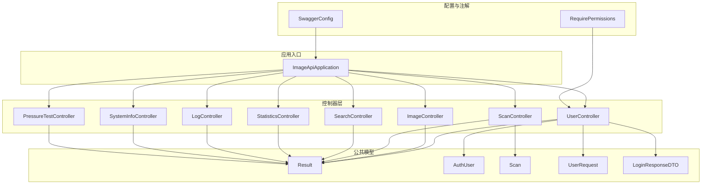
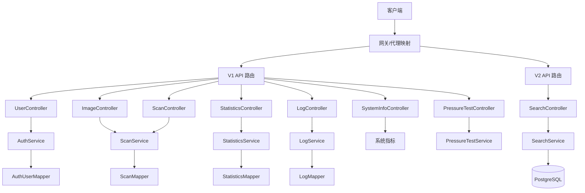
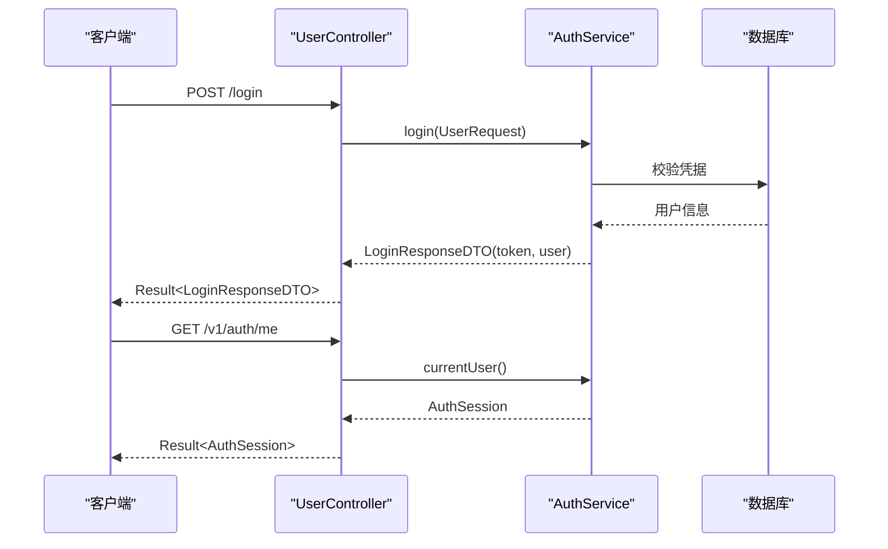
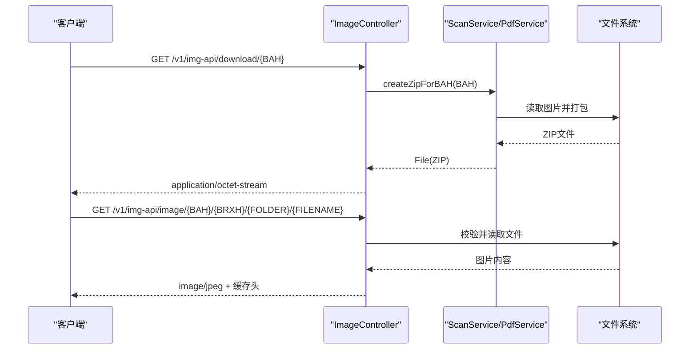
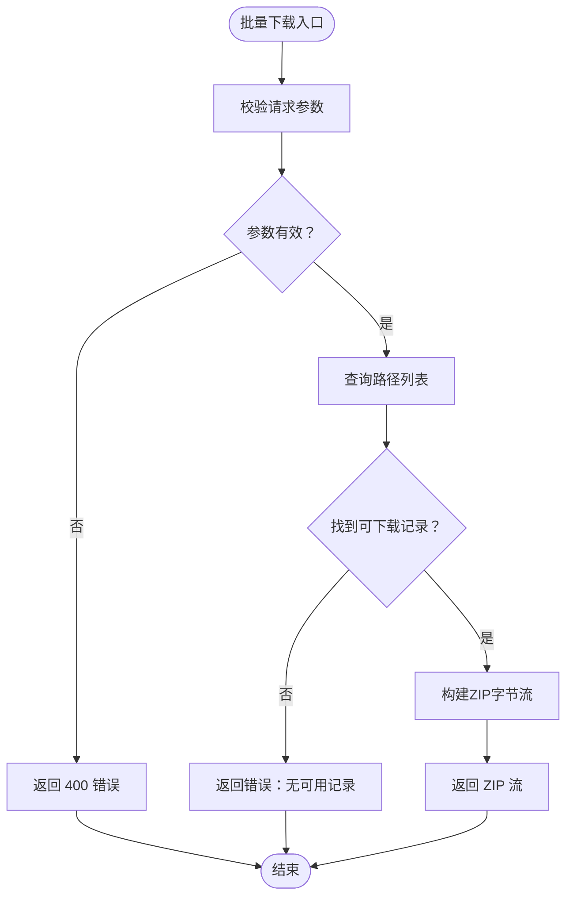
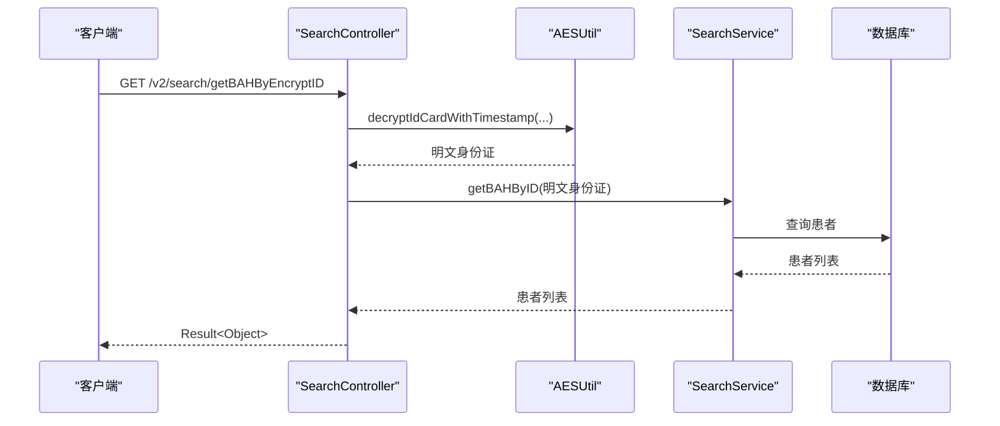
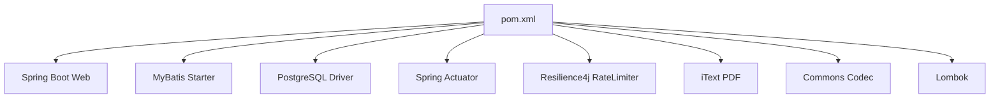

# 后端API文档

<cite>
**本文档引用的文件**
- [ImageApiApplication.java](file://backend-repo/src/main/java/com/zjcxph/imgapi/ImageApiApplication.java)
- [API_CONTRACT.md](file://backend-repo/API_CONTRACT.md)
- [application.properties](file://backend-repo/src/main/resources/application.properties)
- [pom.xml](file://backend-repo/pom.xml)
- [UserController.java](file://backend-repo/src/main/java/com/zjcxph/imgapi/controller/UserController.java)
- [ImageController.java](file://backend-repo/src/main/java/com/zjcxph/imgapi/controller/ImageController.java)
- [ScanController.java](file://backend-repo/src/main/java/com/zjcxph/imgapi/controller/ScanController.java)
- [SearchController.java](file://backend-repo/src/main/java/com/zjcxph/imgapi/controller/SearchController.java)
- [StatisticsController.java](file://backend-repo/src/main/java/com/zjcxph/imgapi/controller/StatisticsController.java)
- [LogController.java](file://backend-repo/src/main/java/com/zjcxph/imgapi/controller/LogController.java)
- [SystemInfoController.java](file://backend-repo/src/main/java/com/zjcxph/imgapi/controller/SystemInfoController.java)
- [PressureTestController.java](file://backend-repo/src/main/java/com/zjcxph/imgapi/controller/PressureTestController.java)
- [SwaggerConfig.java](file://backend-repo/src/main/java/com/zjcxph/imgapi/config/SwaggerConfig.java)
- [RequirePermissions.java](file://backend-repo/src/main/java/com/zjcxph/imgapi/annotation/RequirePermissions.java)
- [Result.java](file://backend-repo/src/main/java/com/zjcxph/imgapi/common/Result.java)
- [AuthUser.java](file://backend-repo/src/main/java/com/zjcxph/imgapi/entity/AuthUser.java)
- [Scan.java](file://backend-repo/src/main/java/com/zjcxph/imgapi/entity/Scan.java)
- [UserRequest.java](file://backend-repo/src/main/java/com/zjcxph/imgapi/dto/req/UserRequest.java)
- [LoginResponseDTO.java](file://backend-repo/src/main/java/com/zjcxph/imgapi/dto/resp/LoginResponseDTO.java)
</cite>

## 目录
1. [简介](#简介)
2. [项目结构](#项目结构)
3. [核心组件](#核心组件)
4. [架构概览](#架构概览)
5. [详细组件分析](#详细组件分析)
6. [依赖分析](#依赖分析)
7. [性能考虑](#性能考虑)
8. [故障排除指南](#故障排除指南)
9. [结论](#结论)
10. [附录](#附录)

## 简介
本文件为MRR后端API的全面技术文档，覆盖RESTful API的HTTP方法、URL模式、请求/响应模式与身份验证方法。文档重点阐述用户管理、影像扫描、日志管理、统计分析等核心功能的API接口，提供具体的请求示例、响应格式与错误处理策略，并记录认证机制、权限控制与安全考虑。同时包含速率限制、版本信息与向后兼容性说明，以及常见使用场景、客户端实现指南与性能优化建议。

## 项目结构
后端采用Spring Boot应用，通过多个控制器模块化提供不同领域的API能力：
- 认证与权限：UserController
- 影像管理：ImageController
- 扫描记录：ScanController
- 搜索服务：SearchController
- 统计分析：StatisticsController
- 日志管理：LogController
- 系统信息：SystemInfoController
- 压力测试：PressureTestController
- 配置与注解：SwaggerConfig、RequirePermissions
- 公共响应模型：Result
- 实体与DTO：AuthUser、Scan、UserRequest、LoginResponseDTO

**图表来源**
- [ImageApiApplication.java:1-20](file://backend-repo/src/main/java/com/zjcxph/imgapi/ImageApiApplication.java#L1-L20)
- [UserController.java:1-95](file://backend-repo/src/main/java/com/zjcxph/imgapi/controller/UserController.java#L1-L95)
- [ImageController.java:1-283](file://backend-repo/src/main/java/com/zjcxph/imgapi/controller/ImageController.java#L1-L283)
- [ScanController.java:1-333](file://backend-repo/src/main/java/com/zjcxph/imgapi/controller/ScanController.java#L1-L333)
- [SearchController.java:1-92](file://backend-repo/src/main/java/com/zjcxph/imgapi/controller/SearchController.java#L1-L92)
- [StatisticsController.java:1-281](file://backend-repo/src/main/java/com/zjcxph/imgapi/controller/StatisticsController.java#L1-L281)
- [LogController.java:1-245](file://backend-repo/src/main/java/com/zjcxph/imgapi/controller/LogController.java#L1-L245)
- [SystemInfoController.java:1-236](file://backend-repo/src/main/java/com/zjcxph/imgapi/controller/SystemInfoController.java#L1-L236)
- [PressureTestController.java:1-73](file://backend-repo/src/main/java/com/zjcxph/imgapi/controller/PressureTestController.java#L1-L73)
- [SwaggerConfig.java:1-41](file://backend-repo/src/main/java/com/zjcxph/imgapi/config/SwaggerConfig.java#L1-L41)
- [RequirePermissions.java:1-13](file://backend-repo/src/main/java/com/zjcxph/imgapi/annotation/RequirePermissions.java#L1-L13)
- [Result.java:1-77](file://backend-repo/src/main/java/com/zjcxph/imgapi/common/Result.java#L1-L77)
- [AuthUser.java:1-134](file://backend-repo/src/main/java/com/zjcxph/imgapi/entity/AuthUser.java#L1-L134)
- [Scan.java:1-116](file://backend-repo/src/main/java/com/zjcxph/imgapi/entity/Scan.java#L1-L116)
- [UserRequest.java:1-31](file://backend-repo/src/main/java/com/zjcxph/imgapi/dto/req/UserRequest.java#L1-L31)
- [LoginResponseDTO.java:1-34](file://backend-repo/src/main/java/com/zjcxph/imgapi/dto/resp/LoginResponseDTO.java#L1-L34)

**章节来源**
- [ImageApiApplication.java:1-20](file://backend-repo/src/main/java/com/zjcxph/imgapi/ImageApiApplication.java#L1-L20)
- [pom.xml:1-136](file://backend-repo/pom.xml#L1-L136)

## 核心组件
- 应用入口与配置
  - 应用启动类启用调度、配置属性扫描与MyBatis Mapper扫描。
  - 运行端口、图像URL、PostgreSQL数据源、日志保留策略、AES密钥等通过环境变量或配置文件注入。
- 公共响应模型
  - Result统一返回结构，包含状态码、时间戳、消息、数据与分页总数。
- 认证与权限注解
  - RequirePermissions用于标注需要特定权限的方法，配合拦截器进行权限校验。
- Swagger/OpenAPI
  - 定义Bearer JWT鉴权方案，提供API文档访问入口。

**章节来源**
- [application.properties:1-49](file://backend-repo/src/main/resources/application.properties#L1-L49)
- [Result.java:1-77](file://backend-repo/src/main/java/com/zjcxph/imgapi/common/Result.java#L1-L77)
- [RequirePermissions.java:1-13](file://backend-repo/src/main/java/com/zjcxph/imgapi/annotation/RequirePermissions.java#L1-L13)
- [SwaggerConfig.java:1-41](file://backend-repo/src/main/java/com/zjcxph/imgapi/config/SwaggerConfig.java#L1-L41)

## 架构概览
后端采用分层架构：
- 控制器层：暴露REST API，负责请求路由与响应封装。
- 业务层：各Service实现具体业务逻辑。
- 数据访问层：MyBatis Mapper负责数据库操作。
- 配置层：Swagger、拦截器、全局异常处理等。

**图表来源**
- [API_CONTRACT.md:5-10](file://backend-repo/API_CONTRACT.md#L5-L10)
- [UserController.java:27-95](file://backend-repo/src/main/java/com/zjcxph/imgapi/controller/UserController.java#L27-L95)
- [ImageController.java:36-283](file://backend-repo/src/main/java/com/zjcxph/imgapi/controller/ImageController.java#L36-L283)
- [ScanController.java:38-333](file://backend-repo/src/main/java/com/zjcxph/imgapi/controller/ScanController.java#L38-L333)
- [StatisticsController.java:30-281](file://backend-repo/src/main/java/com/zjcxph/imgapi/controller/StatisticsController.java#L30-L281)
- [LogController.java:32-245](file://backend-repo/src/main/java/com/zjcxph/imgapi/controller/LogController.java#L32-L245)
- [SystemInfoController.java:22-236](file://backend-repo/src/main/java/com/zjcxph/imgapi/controller/SystemInfoController.java#L22-L236)
- [PressureTestController.java:22-73](file://backend-repo/src/main/java/com/zjcxph/imgapi/controller/PressureTestController.java#L22-L73)
- [SearchController.java:19-92](file://backend-repo/src/main/java/com/zjcxph/imgapi/controller/SearchController.java#L19-L92)

## 详细组件分析

### 认证与用户管理 API
- 登录
  - 方法与路径：POST /login
  - 请求体：UserRequest（用户名、密码）
  - 成功响应：Result<LoginResponseDTO>，包含token与用户会话信息
  - 失败响应：Result<LoginResponseDTO>，错误消息
  - 示例请求：见[UserRequest.java:8-31](file://backend-repo/src/main/java/com/zjcxph/imgapi/dto/req/UserRequest.java#L8-L31)
  - 示例响应：见[LoginResponseDTO.java:7-34](file://backend-repo/src/main/java/com/zjcxph/imgapi/dto/resp/LoginResponseDTO.java#L7-L34)
- 当前用户
  - 方法与路径：GET /v1/auth/me
  - 成功响应：Result<AuthSession>
  - 失败响应：Result<AuthSession>，未登录或令牌过期
- 用户列表与角色列表
  - 方法与路径：GET /v1/auth/users、GET /v1/auth/roles
  - 需要权限：user:manage、role:read
  - 成功响应：Result<List<...>>
- 更新用户
  - 方法与路径：PUT /v1/auth/users/{id}
  - 请求体：AuthUserUpdateRequest
  - 成功响应：Result<AuthUserProfileDTO>
  - 失败响应：用户不存在
- 禁用用户
  - 方法与路径：DELETE /v1/auth/users/{id}
  - 成功响应：Result<Void>
  - 失败响应：用户不存在

**图表来源**
- [UserController.java:38-57](file://backend-repo/src/main/java/com/zjcxph/imgapi/controller/UserController.java#L38-L57)
- [UserRequest.java:8-31](file://backend-repo/src/main/java/com/zjcxph/imgapi/dto/req/UserRequest.java#L8-L31)
- [LoginResponseDTO.java:7-34](file://backend-repo/src/main/java/com/zjcxph/imgapi/dto/resp/LoginResponseDTO.java#L7-L34)

**章节来源**
- [UserController.java:27-95](file://backend-repo/src/main/java/com/zjcxph/imgapi/controller/UserController.java#L27-L95)
- [RequirePermissions.java:8-13](file://backend-repo/src/main/java/com/zjcxph/imgapi/annotation/RequirePermissions.java#L8-L13)
- [UserRequest.java:8-31](file://backend-repo/src/main/java/com/zjcxph/imgapi/dto/req/UserRequest.java#L8-L31)
- [LoginResponseDTO.java:7-34](file://backend-repo/src/main/java/com/zjcxph/imgapi/dto/resp/LoginResponseDTO.java#L7-L34)

### 影像管理 API
- 心跳检测
  - 方法与路径：GET /v1/img-api/hello
  - 成功响应：Result<Object>
- 下载病案压缩包
  - 方法与路径：GET /v1/img-api/download/{BAH}
  - 参数：BAH（8位数字）
  - 成功响应：application/octet-stream（ZIP文件）
- 获取病案号下的图片数据
  - 方法与路径：GET /v1/img-api/{bah}
  - 参数：bah（8位数字）
  - 成功响应：Result<Object>，包含图片URL与元数据
- 获取单张图片
  - 方法与路径：GET /v1/img-api/image/{BAH}/{BRXH}/{FOLDER}/{FILENAME}
  - 参数：BAH、BRXH、FOLDER、FILENAME
  - 成功响应：图片流（image/jpeg），带缓存头
- 修改图片类型
  - 方法与路径：PUT /v1/img-api/updateImageType/{id}
  - 请求体：ImageRequest（含btype）
  - 成功响应：Result<Void>

**图表来源**
- [ImageController.java:63-83](file://backend-repo/src/main/java/com/zjcxph/imgapi/controller/ImageController.java#L63-L83)
- [ImageController.java:204-253](file://backend-repo/src/main/java/com/zjcxph/imgapi/controller/ImageController.java#L204-L253)

**章节来源**
- [ImageController.java:36-283](file://backend-repo/src/main/java/com/zjcxph/imgapi/controller/ImageController.java#L36-L283)

### 扫描记录管理 API
- 创建扫描记录
  - 方法与路径：POST /v1/scan-api
  - 请求体：ScanRequest
  - 成功响应：Result<Object>，返回创建后的Scan
- 更新扫描记录
  - 方法与路径：PUT /v1/scan-api/{id}
  - 请求体：ScanRequest
  - 成功响应：Result<Object>
- 删除扫描记录
  - 方法与路径：DELETE /v1/scan-api/{id}
  - 成功响应：Result<Object>
- 查询扫描记录
  - 方法与路径：GET /v1/scan-api、GET /v1/scan-api/{id}、GET /v1/scan-api/bah/{bah}、GET /v1/scan-api/brxh/{brxh}
  - 成功响应：Result<Object>
- 分页查询
  - 方法与路径：GET /v1/scan-api/page?page=&size=
  - 成功响应：Result<Object>，包含list、total、page、size
- 条件查询
  - 方法与路径：POST /v1/scan-api/condition、POST /v1/scan-api/page/condition
  - 请求体：ScanRequest
  - 成功响应：Result<Object>
- 批量下载
  - 方法与路径：POST /v1/scan-api/batch-download
  - 请求体：BatchDownloadRequest（ids数组）
  - 成功响应：application/octet-stream（ZIP文件）

**图表来源**
- [ScanController.java:256-281](file://backend-repo/src/main/java/com/zjcxph/imgapi/controller/ScanController.java#L256-L281)

**章节来源**
- [ScanController.java:38-333](file://backend-repo/src/main/java/com/zjcxph/imgapi/controller/ScanController.java#L38-L333)

### 搜索 API
- 默认流程：根据身份证（明文）查询病案号
  - 方法与路径：GET /v2/search/getBAHByID/{idCard}
  - 成功响应：Result<Object>，返回患者列表
- 加密ID查询（新方案）
  - 方法与路径：GET /v2/search/getBAHByEncryptID
  - 参数：EncryptID、userId、iv、timestamp
  - 成功响应：Result<Object>
- 加密ID查询（兼容旧版）
  - 方法与路径：GET /v2/search/getBAHByEncryptIDLegacy
  - 参数：EncryptID、userId、iv
  - 成功响应：Result<Object>

**图表来源**
- [SearchController.java:39-55](file://backend-repo/src/main/java/com/zjcxph/imgapi/controller/SearchController.java#L39-L55)

**章节来源**
- [SearchController.java:19-92](file://backend-repo/src/main/java/com/zjcxph/imgapi/controller/SearchController.java#L19-L92)

### 统计分析 API
- 分页+条件查询
  - 方法与路径：GET /v1/statistics-api
  - 参数：page、size、keyword、type、startDate、endDate、sortBy、sortOrder
  - 成功响应：Result<Object>，包含list、total、page、size、totalPages、sortBy、sortOrder
- 按病案号查询
  - 方法与路径：GET /v1/statistics-api/bah/{bah}
  - 成功响应：Result<Object>
- 按日期查询
  - 方法与路径：GET /v1/statistics-api/date/{date}
  - 成功响应：Result<Object>
- 统计汇总
  - 方法与路径：GET /v1/statistics-api/bah-summary、/v1/statistics-api/date-summary、/v1/statistics-api/summary、/v1/statistics-api/type-summary
  - 成功响应：Result<Object>
- 条件统计（按日期范围与类型）
  - 方法与路径：GET /v1/statistics-api/date-summary/condition
  - 参数：startDate、endDate、type
  - 成功响应：Result<Object>
- 综合仪表盘
  - 方法与路径：GET /v1/statistics-api/dashboard
  - 成功响应：Result<Object>，包含概览、近期趋势、TOP病案号等

**章节来源**
- [StatisticsController.java:30-281](file://backend-repo/src/main/java/com/zjcxph/imgapi/controller/StatisticsController.java#L30-L281)

### 日志管理 API
- 查询日志
  - 方法与路径：GET /v2/logs、/v1/logs-api
  - 支持按ID、客户端IP、URI、关键词、时间范围等查询
- 清理保留策略
  - 方法与路径：POST /v2/logs/retention/cleanup
  - 参数：cutoff（可选）
  - 成功响应：Result<LogRetentionCleanupResult>
- 导出保留日志
  - 方法与路径：GET /v2/logs/retention/export
  - 成功响应：CSV流，包含导出总量与截止时间头
- 搜索日志
  - 方法与路径：GET /v2/logs/search
  - 参数：page、size、keyword、clientIp、requestUri、method、responseStatus、startTime、endTime
  - 成功响应：Result<Map<String, Object>>

**章节来源**
- [LogController.java:32-245](file://backend-repo/src/main/java/com/zjcxph/imgapi/controller/LogController.java#L32-L245)

### 系统信息 API
- 系统基础信息：GET /v1/system/info
- 内存详情：GET /v1/system/memory
- 运行时信息：GET /v1/system/runtime
- 健康检查：GET /v1/system/health
- 系统属性：GET /v1/system/properties
- 统一概览：GET /v1/system/overview

**章节来源**
- [SystemInfoController.java:22-236](file://backend-repo/src/main/java/com/zjcxph/imgapi/controller/SystemInfoController.java#L22-L236)

### 压力测试 API
- 运行压力测试：POST /v1/monitoring-api/pressure-tests/run
- 获取历史：GET /v1/monitoring-api/pressure-tests/history
- 获取最新：GET /v1/monitoring-api/pressure-tests/latest
- 按运行ID查询：GET /v1/monitoring-api/pressure-tests/{runId}
- 清空历史：DELETE /v1/monitoring-api/pressure-tests/history

**章节来源**
- [PressureTestController.java:22-73](file://backend-repo/src/main/java/com/zjcxph/imgapi/controller/PressureTestController.java#L22-L73)

## 依赖分析
- 外部依赖
  - Spring Boot Web、MyBatis Starter、PostgreSQL驱动、Spring Actuator、Resilience4j限流器、iText PDF库、Apache Commons Codec、Lombok等。
- 运行时配置
  - 服务器端口、图像URL、压缩配置、数据源连接池参数、日志保留策略、AES密钥等。
- 版本与兼容性
  - Spring Boot 4.0.3、Java 21、PostgreSQL、OpenAPI 3.0。

**图表来源**
- [pom.xml:27-114](file://backend-repo/pom.xml#L27-L114)

**章节来源**
- [pom.xml:1-136](file://backend-repo/pom.xml#L1-L136)
- [application.properties:1-49](file://backend-repo/src/main/resources/application.properties#L1-L49)

## 性能考虑
- 压缩与缓存
  - 服务器启用响应压缩与静态资源缓存，提升传输效率与前端加载速度。
- 数据库连接池
  - Hikari连接池参数可调，建议在高并发场景下适当增大最大池大小与连接超时。
- 批量下载
  - 批量下载采用流式ZIP构建，避免一次性加载全部图片至内存；建议客户端合理设置IDs数量。
- 日志保留
  - 可配置保留天数、批处理大小与每轮最大批次，避免清理过程对系统造成过大压力。
- API分页
  - 统计与日志接口支持分页，建议客户端设置合理页大小上限（如200）。

[本节为通用性能指导，不直接分析具体文件]

## 故障排除指南
- 认证失败
  - 现象：登录返回无效凭据或当前用户返回未登录/令牌过期
  - 排查：确认用户名/密码正确、JWT令牌存在且未过期
  - 参考：[UserController.java:38-57](file://backend-repo/src/main/java/com/zjcxph/imgapi/controller/UserController.java#L38-L57)
- 权限不足
  - 现象：返回403或业务失败提示
  - 排查：确认用户角色具备所需权限（如user:manage、role:read）
  - 参考：[RequirePermissions.java:8-13](file://backend-repo/src/main/java/com/zjcxph/imgapi/annotation/RequirePermissions.java#L8-L13)
- 文件不存在/读取错误
  - 现象：图片下载返回404或500
  - 排查：确认文件路径、文件存在性与权限
  - 参考：[ImageController.java:224-252](file://backend-repo/src/main/java/com/zjcxph/imgapi/controller/ImageController.java#L224-L252)
- 批量下载失败
  - 现象：返回400或500
  - 排查：确认ids非空、对应记录存在且文件可读
  - 参考：[ScanController.java:256-281](file://backend-repo/src/main/java/com/zjcxph/imgapi/controller/ScanController.java#L256-L281)
- 日志导出失败
  - 现象：导出接口返回400
  - 排查：确认日志保留已启用且保留天数>0
  - 参考：[LogController.java:108-148](file://backend-repo/src/main/java/com/zjcxph/imgapi/controller/LogController.java#L108-L148)

**章节来源**
- [UserController.java:38-95](file://backend-repo/src/main/java/com/zjcxph/imgapi/controller/UserController.java#L38-L95)
- [ImageController.java:204-253](file://backend-repo/src/main/java/com/zjcxph/imgapi/controller/ImageController.java#L204-L253)
- [ScanController.java:256-281](file://backend-repo/src/main/java/com/zjcxph/imgapi/controller/ScanController.java#L256-L281)
- [LogController.java:108-148](file://backend-repo/src/main/java/com/zjcxph/imgapi/controller/LogController.java#L108-L148)

## 结论
本API文档系统性地梳理了MRR后端的核心REST接口，涵盖认证、影像、扫描、搜索、统计、日志与系统监控等模块。通过统一的Result响应模型、权限注解与OpenAPI文档，提升了系统的可维护性与可观测性。建议在生产环境中完善速率限制、审计日志与安全加固，并结合本文档的性能与故障排除建议进行持续优化。

[本节为总结性内容，不直接分析具体文件]

## 附录

### 版本与兼容性
- API版本
  - v1：/v1/* 路径下的核心业务接口
  - v2：/v2/* 路径下的搜索与扩展接口
- 向后兼容
  - 搜索接口提供默认明文ID查询与加密ID查询（新/旧两种），确保历史客户端平滑过渡
  - 批量下载接口通过网关映射至v1路径，保持前端调用一致性

**章节来源**
- [API_CONTRACT.md:5-10](file://backend-repo/API_CONTRACT.md#L5-L10)
- [API_CONTRACT.md:24-29](file://backend-repo/API_CONTRACT.md#L24-L29)

### 认证与权限
- 认证方式
  - Bearer JWT，通过Authorization头传递
- 权限控制
  - 使用@RequirePermissions注解标注受保护接口，基于用户权限集合进行校验
- 安全建议
  - 强制HTTPS传输、定期轮换密钥、限制令牌有效期、启用CORS白名单

**章节来源**
- [SwaggerConfig.java:14-38](file://backend-repo/src/main/java/com/zjcxph/imgapi/config/SwaggerConfig.java#L14-L38)
- [RequirePermissions.java:8-13](file://backend-repo/src/main/java/com/zjcxph/imgapi/annotation/RequirePermissions.java#L8-L13)
- [AuthUser.java:116-133](file://backend-repo/src/main/java/com/zjcxph/imgapi/entity/AuthUser.java#L116-L133)

### 响应模型与错误处理
- 统一响应结构
  - Result<T>包含code、timestamp、message、data、total
- 错误处理策略
  - 参数校验失败返回400
  - 业务逻辑失败返回400
  - 资源不存在返回404
  - 服务器内部错误返回500
- 建议
  - 客户端对非2xx状态码进行统一处理与重试策略

**章节来源**
- [Result.java:5-77](file://backend-repo/src/main/java/com/zjcxph/imgapi/common/Result.java#L5-L77)

### 常见使用场景与客户端实现指南
- 场景一：登录并获取当前用户信息
  - 步骤：POST /login → 保存token → GET /v1/auth/me
  - 参考：[UserController.java:38-57](file://backend-repo/src/main/java/com/zjcxph/imgapi/controller/UserController.java#L38-L57)
- 场景二：批量下载病案图片
  - 步骤：POST /v1/scan-api/batch-download → 保存ZIP文件
  - 参考：[ScanController.java:256-281](file://backend-repo/src/main/java/com/zjcxph/imgapi/controller/ScanController.java#L256-L281)
- 场景三：按日期范围统计
  - 步骤：GET /v1/statistics-api/date-summary/condition?startDate=&endDate=&type=
  - 参考：[StatisticsController.java:160-187](file://backend-repo/src/main/java/com/zjcxph/imgapi/controller/StatisticsController.java#L160-L187)

**章节来源**
- [UserController.java:38-57](file://backend-repo/src/main/java/com/zjcxph/imgapi/controller/UserController.java#L38-L57)
- [ScanController.java:256-281](file://backend-repo/src/main/java/com/zjcxph/imgapi/controller/ScanController.java#L256-L281)
- [StatisticsController.java:160-187](file://backend-repo/src/main/java/com/zjcxph/imgapi/controller/StatisticsController.java#L160-L187)