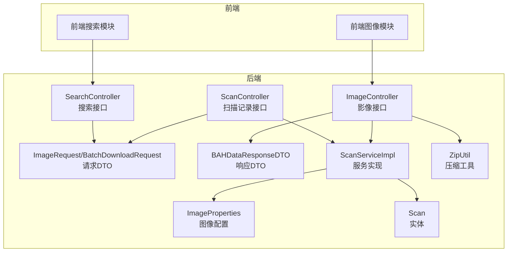
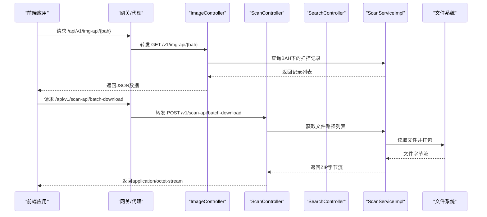
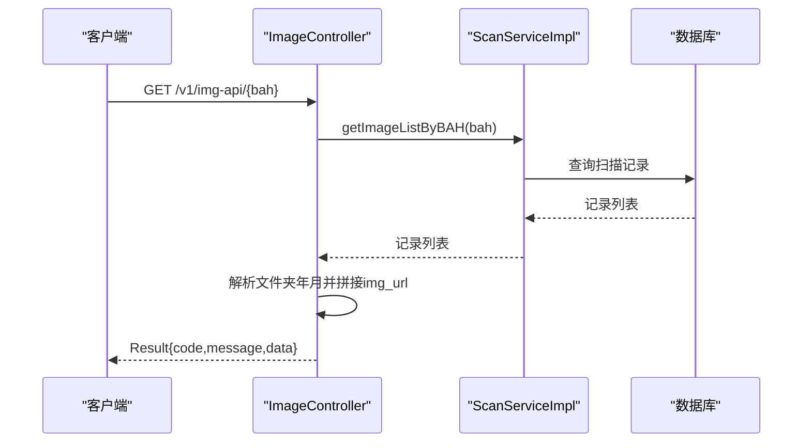
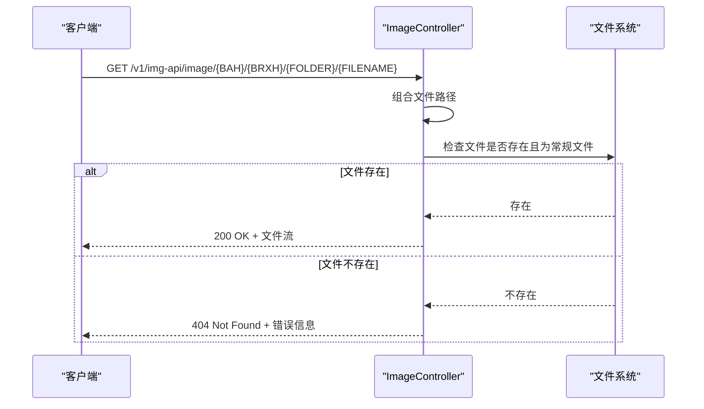
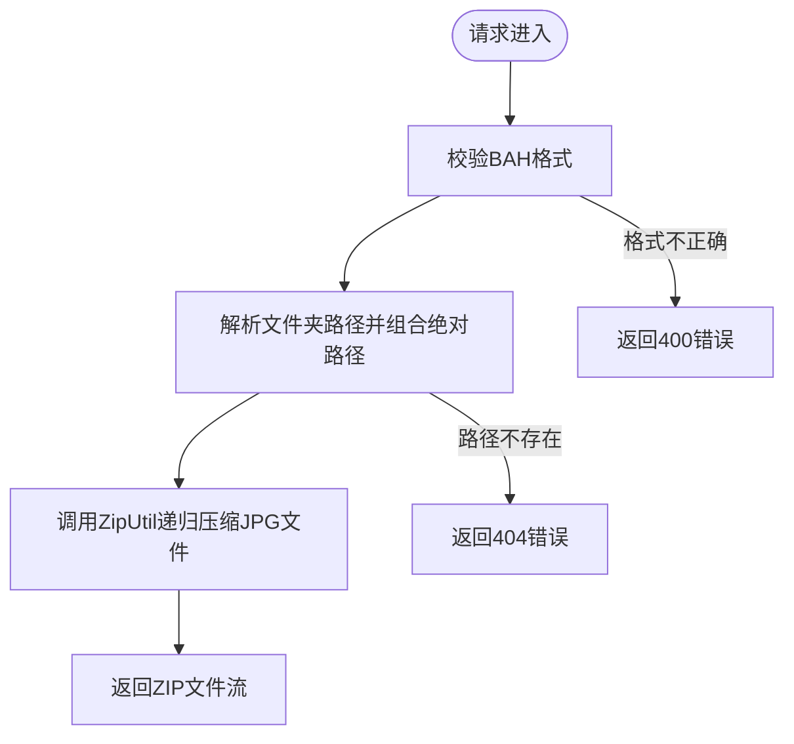
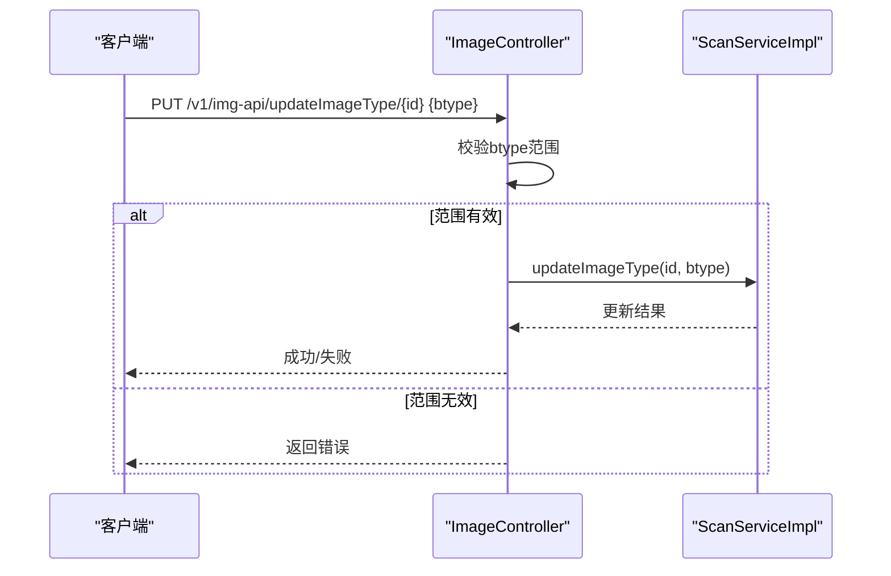
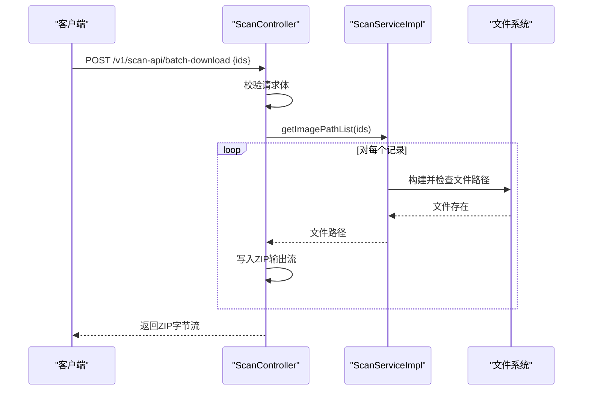
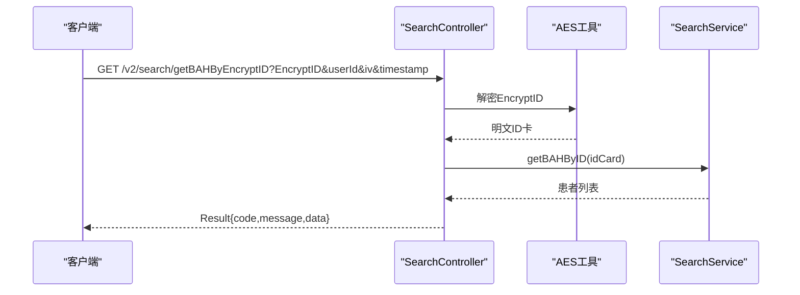
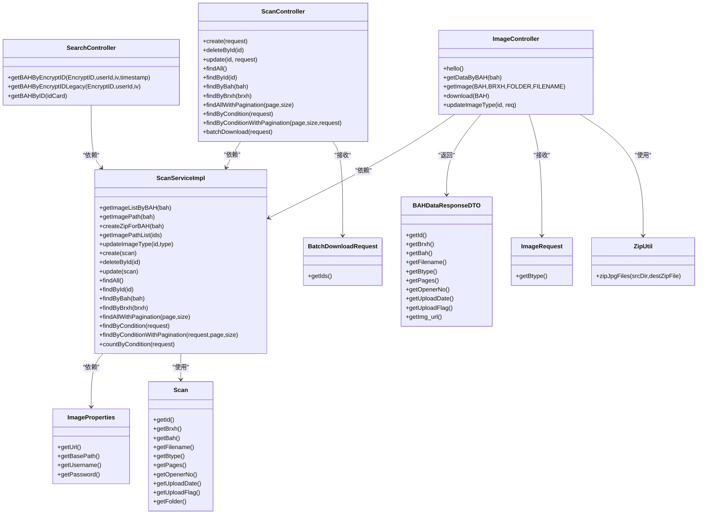

# 影像管理API

<cite>
**本文档引用的文件**
- [ImageController.java](file://backend-repo/src/main/java/com/zjcxph/imgapi/controller/ImageController.java)
- [ScanController.java](file://backend-repo/src/main/java/com/zjcxph/imgapi/controller/ScanController.java)
- [SearchController.java](file://backend-repo/src/main/java/com/zjcxph/imgapi/controller/SearchController.java)
- [ImageProperties.java](file://backend-repo/src/main/java/com/zjcxph/imgapi/config/ImageProperties.java)
- [ImageRequest.java](file://backend-repo/src/main/java/com/zjcxph/imgapi/dto/req/ImageRequest.java)
- [BAHDataResponseDTO.java](file://backend-repo/src/main/java/com/zjcxph/imgapi/dto/resp/BAHDataResponseDTO.java)
- [Scan.java](file://backend-repo/src/main/java/com/zjcxph/imgapi/entity/Scan.java)
- [ScanServiceImpl.java](file://backend-repo/src/main/java/com/zjcxph/imgapi/service/impl/ScanServiceImpl.java)
- [BatchDownloadRequest.java](file://backend-repo/src/main/java/com/zjcxph/imgapi/dto/req/BatchDownloadRequest.java)
- [ZipUtil.java](file://backend-repo/src/main/java/com/zjcxph/imgapi/utils/ZipUtil.java)
- [API_CONTRACT.md](file://backend-repo/API_CONTRACT.md)
- [application.properties](file://backend-repo/src/main/resources/application.properties)
</cite>

## 目录
1. [简介](#简介)
2. [项目结构](#项目结构)
3. [核心组件](#核心组件)
4. [架构总览](#架构总览)
5. [详细组件分析](#详细组件分析)
6. [依赖关系分析](#依赖关系分析)
7. [性能考虑](#性能考虑)
8. [故障排除指南](#故障排除指南)
9. [结论](#结论)
10. [附录](#附录)

## 简介
本文件为MRR影像管理API的全面技术文档，覆盖影像查询、下载、类型更新等核心接口，详细说明BAH编号查询、影像文件访问、文件夹路径解析等功能；包含影像类型更新、批量下载与文件传输协议；提供请求示例、响应格式与错误处理策略；记录文件存储策略、访问权限控制与性能优化方案，并涵盖影像预览、缩略图生成与压缩传输等高级功能。

## 项目结构
后端采用Spring Boot架构，主要控制器位于`controller`包，数据传输对象位于`dto`包，实体模型位于`entity`包，服务层位于`service`包，配置信息位于`config`包，工具类位于`utils`包。前端通过代理将请求映射到后端不同版本的API命名空间。

**图表来源**
- [ImageController.java:36-52](file://backend-repo/src/main/java/com/zjcxph/imgapi/controller/ImageController.java#L36-L52)
- [ScanController.java:38-49](file://backend-repo/src/main/java/com/zjcxph/imgapi/controller/ScanController.java#L38-L49)
- [SearchController.java:19-32](file://backend-repo/src/main/java/com/zjcxph/imgapi/controller/SearchController.java#L19-L32)
- [ImageProperties.java:5-44](file://backend-repo/src/main/java/com/zjcxph/imgapi/config/ImageProperties.java#L5-L44)
- [ImageRequest.java:5-20](file://backend-repo/src/main/java/com/zjcxph/imgapi/dto/req/ImageRequest.java#L5-L20)
- [BatchDownloadRequest.java:7-18](file://backend-repo/src/main/java/com/zjcxph/imgapi/dto/req/BatchDownloadRequest.java#L7-L18)
- [BAHDataResponseDTO.java:7-35](file://backend-repo/src/main/java/com/zjcxph/imgapi/dto/resp/BAHDataResponseDTO.java#L7-L35)
- [Scan.java:9-34](file://backend-repo/src/main/java/com/zjcxph/imgapi/entity/Scan.java#L9-L34)
- [ScanServiceImpl.java:15-24](file://backend-repo/src/main/java/com/zjcxph/imgapi/service/impl/ScanServiceImpl.java#L15-L24)
- [ZipUtil.java:14-50](file://backend-repo/src/main/java/com/zjcxph/imgapi/utils/ZipUtil.java#L14-L50)

**章节来源**
- [API_CONTRACT.md:5-43](file://backend-repo/API_CONTRACT.md#L5-L43)
- [application.properties:1-49](file://backend-repo/src/main/resources/application.properties#L1-L49)

## 核心组件
- 影像控制器（ImageController）：提供影像查询、单图下载、类型更新、BAH压缩包下载等接口。
- 扫描记录控制器（ScanController）：提供扫描记录的增删改查、条件查询、分页查询、批量下载等接口。
- 搜索控制器（SearchController）：提供基于加密ID卡解密后的BAH查询、明文ID卡查询等接口。
- 配置类（ImageProperties）：封装图像访问URL、基础路径、用户名密码等配置项。
- 请求/响应DTO：定义请求体与响应体的数据结构。
- 实体类（Scan）：描述扫描记录的数据模型。
- 服务实现（ScanServiceImpl）：封装业务逻辑，如路径解析、压缩打包、类型更新等。
- 工具类（ZipUtil）：提供目录下JPG文件的递归压缩功能。

**章节来源**
- [ImageController.java:36-52](file://backend-repo/src/main/java/com/zjcxph/imgapi/controller/ImageController.java#L36-L52)
- [ScanController.java:38-49](file://backend-repo/src/main/java/com/zjcxph/imgapi/controller/ScanController.java#L38-L49)
- [SearchController.java:19-32](file://backend-repo/src/main/java/com/zjcxph/imgapi/controller/SearchController.java#L19-L32)
- [ImageProperties.java:5-44](file://backend-repo/src/main/java/com/zjcxph/imgapi/config/ImageProperties.java#L5-L44)
- [ImageRequest.java:5-20](file://backend-repo/src/main/java/com/zjcxph/imgapi/dto/req/ImageRequest.java#L5-L20)
- [BAHDataResponseDTO.java:7-35](file://backend-repo/src/main/java/com/zjcxph/imgapi/dto/resp/BAHDataResponseDTO.java#L7-L35)
- [Scan.java:9-34](file://backend-repo/src/main/java/com/zjcxph/imgapi/entity/Scan.java#L9-L34)
- [ScanServiceImpl.java:15-24](file://backend-repo/src/main/java/com/zjcxph/imgapi/service/impl/ScanServiceImpl.java#L15-L24)
- [ZipUtil.java:14-50](file://backend-repo/src/main/java/com/zjcxph/imgapi/utils/ZipUtil.java#L14-L50)

## 架构总览
后端通过REST控制器暴露API，前端通过反向代理将请求路由到不同版本的命名空间：
- v1/img-api：影像相关接口
- v1/scan-api：扫描记录相关接口
- v2/search：搜索相关接口

**图表来源**
- [API_CONTRACT.md:7-8](file://backend-repo/API_CONTRACT.md#L7-L8)
- [ImageController.java:176-202](file://backend-repo/src/main/java/com/zjcxph/imgapi/controller/ImageController.java#L176-L202)
- [ScanController.java:256-281](file://backend-repo/src/main/java/com/zjcxph/imgapi/controller/ScanController.java#L256-L281)
- [ScanServiceImpl.java:63-65](file://backend-repo/src/main/java/com/zjcxph/imgapi/service/impl/ScanServiceImpl.java#L63-L65)

**章节来源**
- [API_CONTRACT.md:5-43](file://backend-repo/API_CONTRACT.md#L5-L43)

## 详细组件分析

### 影像查询接口
- 接口名称：获取BAH下的图片数据
- HTTP方法：GET
- URL模式：/v1/img-api/{bah}
- 参数：
  - 路径参数：bah（8位数字）
- 响应：Result包装的列表，包含每张图片的详细信息及可访问的img_url
- 业务逻辑：
  - 从数据库查询指定BAH的所有扫描记录
  - 解析文件夹路径中的年月部分，构造访问URL
  - 将每条记录转换为响应DTO并返回

**图表来源**
- [ImageController.java:176-202](file://backend-repo/src/main/java/com/zjcxph/imgapi/controller/ImageController.java#L176-L202)
- [ScanServiceImpl.java:26-29](file://backend-repo/src/main/java/com/zjcxph/imgapi/service/impl/ScanServiceImpl.java#L26-L29)

**章节来源**
- [ImageController.java:176-202](file://backend-repo/src/main/java/com/zjcxph/imgapi/controller/ImageController.java#L176-L202)
- [BAHDataResponseDTO.java:7-35](file://backend-repo/src/main/java/com/zjcxph/imgapi/dto/resp/BAHDataResponseDTO.java#L7-L35)

### 单图下载接口
- 接口名称：获取指定图片文件
- HTTP方法：GET
- URL模式：/v1/img-api/image/{BAH}/{BRXH}/{FOLDER}/{FILENAME}
- 参数：
  - 路径参数：BAH（8位数字）、BRXH（病人序号）、FOLDER（日期格式YY.MM.DD）、FILENAME（文件名）
- 响应：二进制流（JPEG），设置Content-Disposition为inline，启用缓存控制
- 业务逻辑：
  - 组合文件绝对路径
  - 校验文件存在性与类型
  - 返回文件流并设置合适的响应头

**图表来源**
- [ImageController.java:204-253](file://backend-repo/src/main/java/com/zjcxph/imgapi/controller/ImageController.java#L204-L253)

**章节来源**
- [ImageController.java:204-253](file://backend-repo/src/main/java/com/zjcxph/imgapi/controller/ImageController.java#L204-L253)

### BAH压缩包下载接口
- 接口名称：下载BAH对应的压缩包
- HTTP方法：GET
- URL模式：/v1/img-api/download/{BAH}
- 参数：
  - 路径参数：BAH（8位数字）
- 响应：application/octet-stream，文件名为{BAH}.zip
- 业务逻辑：
  - 通过服务层构建BAH对应的文件夹路径
  - 使用ZipUtil将该目录下的所有JPG文件递归压缩
  - 返回压缩包文件流

**图表来源**
- [ImageController.java:63-83](file://backend-repo/src/main/java/com/zjcxph/imgapi/controller/ImageController.java#L63-L83)
- [ScanServiceImpl.java:48-60](file://backend-repo/src/main/java/com/zjcxph/imgapi/service/impl/ScanServiceImpl.java#L48-L60)
- [ZipUtil.java:16-49](file://backend-repo/src/main/java/com/zjcxph/imgapi/utils/ZipUtil.java#L16-L49)

**章节来源**
- [ImageController.java:63-83](file://backend-repo/src/main/java/com/zjcxph/imgapi/controller/ImageController.java#L63-L83)
- [ScanServiceImpl.java:48-60](file://backend-repo/src/main/java/com/zjcxph/imgapi/service/impl/ScanServiceImpl.java#L48-L60)
- [ZipUtil.java:16-49](file://backend-repo/src/main/java/com/zjcxph/imgapi/utils/ZipUtil.java#L16-L49)

### 影像类型更新接口
- 接口名称：根据图片ID修改图片类型
- HTTP方法：PUT
- URL模式：/v1/img-api/updateImageType/{id}
- 参数：
  - 路径参数：id（整数）
  - 请求体：ImageRequest（包含btype字段）
- 业务逻辑：
  - 校验btype范围（0-14）
  - 调用服务层执行更新操作
  - 返回统一结果包装

**图表来源**
- [ImageController.java:255-281](file://backend-repo/src/main/java/com/zjcxph/imgapi/controller/ImageController.java#L255-L281)
- [ImageRequest.java:5-20](file://backend-repo/src/main/java/com/zjcxph/imgapi/dto/req/ImageRequest.java#L5-L20)
- [ScanServiceImpl.java:67-70](file://backend-repo/src/main/java/com/zjcxph/imgapi/service/impl/ScanServiceImpl.java#L67-L70)

**章节来源**
- [ImageController.java:255-281](file://backend-repo/src/main/java/com/zjcxph/imgapi/controller/ImageController.java#L255-L281)
- [ImageRequest.java:5-20](file://backend-repo/src/main/java/com/zjcxph/imgapi/dto/req/ImageRequest.java#L5-L20)
- [ScanServiceImpl.java:67-70](file://backend-repo/src/main/java/com/zjcxph/imgapi/service/impl/ScanServiceImpl.java#L67-L70)

### 扫描记录管理接口
- 接口名称：批量下载扫描记录对应的图片
- HTTP方法：POST
- URL模式：/v1/scan-api/batch-download
- 请求体：BatchDownloadRequest（ids数组）
- 响应：application/octet-stream，文件名为scan-batch-{timestamp}.zip
- 业务逻辑：
  - 校验请求体
  - 查询每个记录的文件路径
  - 逐个读取文件并写入ZIP输出流
  - 返回ZIP字节流

**图表来源**
- [ScanController.java:256-281](file://backend-repo/src/main/java/com/zjcxph/imgapi/controller/ScanController.java#L256-L281)
- [BatchDownloadRequest.java:7-18](file://backend-repo/src/main/java/com/zjcxph/imgapi/dto/req/BatchDownloadRequest.java#L7-L18)
- [ScanServiceImpl.java:63-65](file://backend-repo/src/main/java/com/zjcxph/imgapi/service/impl/ScanServiceImpl.java#L63-L65)
- [ScanController.java:283-331](file://backend-repo/src/main/java/com/zjcxph/imgapi/controller/ScanController.java#L283-L331)

**章节来源**
- [ScanController.java:256-281](file://backend-repo/src/main/java/com/zjcxph/imgapi/controller/ScanController.java#L256-L281)
- [BatchDownloadRequest.java:7-18](file://backend-repo/src/main/java/com/zjcxph/imgapi/dto/req/BatchDownloadRequest.java#L7-L18)
- [ScanServiceImpl.java:63-65](file://backend-repo/src/main/java/com/zjcxph/imgapi/service/impl/ScanServiceImpl.java#L63-L65)
- [ScanController.java:283-331](file://backend-repo/src/main/java/com/zjcxph/imgapi/controller/ScanController.java#L283-L331)

### 搜索接口
- 接口名称：根据加密ID卡查询BAH
- HTTP方法：GET
- URL模式：/v2/search/getBAHByEncryptID
- 参数：
  - 查询参数：EncryptID、userId、iv、timestamp
- 响应：Result包装的患者列表
- 业务逻辑：
  - 使用AES工具解密EncryptID
  - 调用搜索服务查询BAH列表
  - 记录日志并返回结果

**图表来源**
- [SearchController.java:39-55](file://backend-repo/src/main/java/com/zjcxph/imgapi/controller/SearchController.java#L39-L55)

**章节来源**
- [SearchController.java:39-55](file://backend-repo/src/main/java/com/zjcxph/imgapi/controller/SearchController.java#L39-L55)

## 依赖关系分析
- 控制器依赖服务层：ImageController、ScanController、SearchController均注入对应的服务实现。
- 服务层依赖配置与映射：ScanServiceImpl依赖ImageProperties与ScanMapper。
- DTO与实体：BAHDataResponseDTO用于响应，Scan用于数据库映射。
- 工具类：ZipUtil独立提供压缩功能。

**图表来源**
- [ImageController.java:36-52](file://backend-repo/src/main/java/com/zjcxph/imgapi/controller/ImageController.java#L36-L52)
- [ScanController.java:38-49](file://backend-repo/src/main/java/com/zjcxph/imgapi/controller/ScanController.java#L38-L49)
- [SearchController.java:19-32](file://backend-repo/src/main/java/com/zjcxph/imgapi/controller/SearchController.java#L19-L32)
- [ScanServiceImpl.java:15-24](file://backend-repo/src/main/java/com/zjcxph/imgapi/service/impl/ScanServiceImpl.java#L15-L24)
- [ImageProperties.java:5-44](file://backend-repo/src/main/java/com/zjcxph/imgapi/config/ImageProperties.java#L5-L44)
- [Scan.java:9-34](file://backend-repo/src/main/java/com/zjcxph/imgapi/entity/Scan.java#L9-L34)
- [BAHDataResponseDTO.java:7-35](file://backend-repo/src/main/java/com/zjcxph/imgapi/dto/resp/BAHDataResponseDTO.java#L7-L35)
- [ImageRequest.java:5-20](file://backend-repo/src/main/java/com/zjcxph/imgapi/dto/req/ImageRequest.java#L5-L20)
- [BatchDownloadRequest.java:7-18](file://backend-repo/src/main/java/com/zjcxph/imgapi/dto/req/BatchDownloadRequest.java#L7-L18)
- [ZipUtil.java:14-50](file://backend-repo/src/main/java/com/zjcxph/imgapi/utils/ZipUtil.java#L14-L50)

**章节来源**
- [ImageController.java:36-52](file://backend-repo/src/main/java/com/zjcxph/imgapi/controller/ImageController.java#L36-L52)
- [ScanController.java:38-49](file://backend-repo/src/main/java/com/zjcxph/imgapi/controller/ScanController.java#L38-L49)
- [SearchController.java:19-32](file://backend-repo/src/main/java/com/zjcxph/imgapi/controller/SearchController.java#L19-L32)
- [ScanServiceImpl.java:15-24](file://backend-repo/src/main/java/com/zjcxph/imgapi/service/impl/ScanServiceImpl.java#L15-L24)

## 性能考虑
- 压缩传输：后端启用GZIP压缩，对JSON、HTML、XML、CSS、JavaScript、Octet-stream等类型生效，提升大文件传输效率。
- 缓存控制：单图下载设置Cache-Control为public、max-age=86400、immutable，减少重复请求。
- 分页查询：扫描记录支持分页查询，避免一次性返回大量数据。
- 批量下载：批量下载采用内存流式写入ZIP，减少磁盘I/O开销。
- 前端预加载：前端通过IntersectionObserver与Image.decode进行按需加载与预加载，降低首屏延迟与切换闪屏。

**章节来源**
- [application.properties:4-8](file://backend-repo/src/main/resources/application.properties#L4-L8)
- [ImageController.java:235-238](file://backend-repo/src/main/java/com/zjcxph/imgapi/controller/ImageController.java#L235-L238)
- [ScanController.java:200-221](file://backend-repo/src/main/java/com/zjcxph/imgapi/controller/ScanController.java#L200-L221)

## 故障排除指南
- 404 Not Found：
  - 单图下载时文件不存在或非常规文件
  - BAH压缩包时未找到对应路径
- 500 Internal Server Error：
  - 文件读取异常
  - 批量下载过程中IO异常
- 参数校验失败：
  - BAH必须为8位数字
  - 类型更新时btype必须在0-14范围内
- 权限与认证：
  - 配置中包含图像访问凭据（用户名/密码），需确保正确配置以访问底层文件系统

**章节来源**
- [ImageController.java:65-83](file://backend-repo/src/main/java/com/zjcxph/imgapi/controller/ImageController.java#L65-L83)
- [ImageController.java:224-231](file://backend-repo/src/main/java/com/zjcxph/imgapi/controller/ImageController.java#L224-L231)
- [ImageController.java:245-252](file://backend-repo/src/main/java/com/zjcxph/imgapi/controller/ImageController.java#L245-L252)
- [ScanController.java:277-280](file://backend-repo/src/main/java/com/zjcxph/imgapi/controller/ScanController.java#L277-L280)
- [application.properties:30-33](file://backend-repo/src/main/resources/application.properties#L30-L33)

## 结论
本API文档系统性地梳理了MRR影像管理的核心接口，明确了各接口的HTTP方法、URL模式、参数定义与响应格式，并结合前后端代理映射关系，提供了完整的调用链路说明。通过合理的文件存储策略、缓存与压缩机制以及前端预加载优化，能够满足影像查询、下载与管理的高效需求。

## 附录

### API清单与示例
- 影像查询
  - 方法：GET
  - 路径：/v1/img-api/{bah}
  - 示例：GET /api/v1/img-api/00789508
- 单图下载
  - 方法：GET
  - 路径：/v1/img-api/image/{BAH}/{BRXH}/{FOLDER}/{FILENAME}
  - 示例：GET /api/v1/img-api/image/00789508/605746/24.04.30/0072.jpg
- BAH压缩包下载
  - 方法：GET
  - 路径：/v1/img-api/download/{BAH}
  - 示例：GET /api/v1/img-api/download/00789508
- 类型更新
  - 方法：PUT
  - 路径：/v1/img-api/updateImageType/{id}
  - 请求体：{ btype: number }
  - 示例：PUT /api/v1/img-api/updateImageType/123 { "btype": 5 }
- 批量下载
  - 方法：POST
  - 路径：/v1/scan-api/batch-download
  - 请求体：{ ids: string[] }
  - 示例：POST /api/v1/scan-api/batch-download { "ids": ["1","2","3"] }
- 搜索BAH
  - 方法：GET
  - 路径：/v2/search/getBAHByEncryptID
  - 示例：GET /searchApi/getBAHByEncryptID?EncryptID=...&userId=...&iv=...&timestamp=...

**章节来源**
- [API_CONTRACT.md:17-39](file://backend-repo/API_CONTRACT.md#L17-L39)

### 响应格式约定
- 成功响应：Result包装，包含code、message、data字段
- 错误响应：Result包装，包含code、message、timestamp（在特定接口中）

**章节来源**
- [ImageController.java:56-61](file://backend-repo/src/main/java/com/zjcxph/imgapi/controller/ImageController.java#L56-L61)
- [ImageController.java:226-230](file://backend-repo/src/main/java/com/zjcxph/imgapi/controller/ImageController.java#L226-L230)

### 文件存储策略与路径解析
- 基础路径：由配置项提供，用于定位图像文件根目录
- 路径规则：文件夹前缀取自日期字符串的前5位（YY.MM），最终文件夹命名为“BRXH-BAH”
- 压缩策略：仅压缩JPG文件，递归遍历子目录

**章节来源**
- [ImageProperties.java:37-43](file://backend-repo/src/main/java/com/zjcxph/imgapi/config/ImageProperties.java#L37-L43)
- [ImageController.java:189-192](file://backend-repo/src/main/java/com/zjcxph/imgapi/controller/ImageController.java#L189-L192)
- [ImageController.java:216-219](file://backend-repo/src/main/java/com/zjcxph/imgapi/controller/ImageController.java#L216-L219)
- [ScanServiceImpl.java:32-46](file://backend-repo/src/main/java/com/zjcxph/imgapi/service/impl/ScanServiceImpl.java#L32-L46)
- [ZipUtil.java:23-36](file://backend-repo/src/main/java/com/zjcxph/imgapi/utils/ZipUtil.java#L23-L36)

### 访问权限控制
- 图像访问凭据：用户名与密码通过配置项提供，用于访问底层文件系统
- 建议：在生产环境强制配置并启用HTTPS，避免凭据泄露

**章节来源**
- [application.properties:30-33](file://backend-repo/src/main/resources/application.properties#L30-L33)