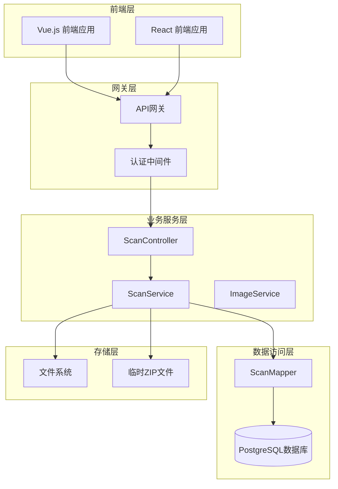
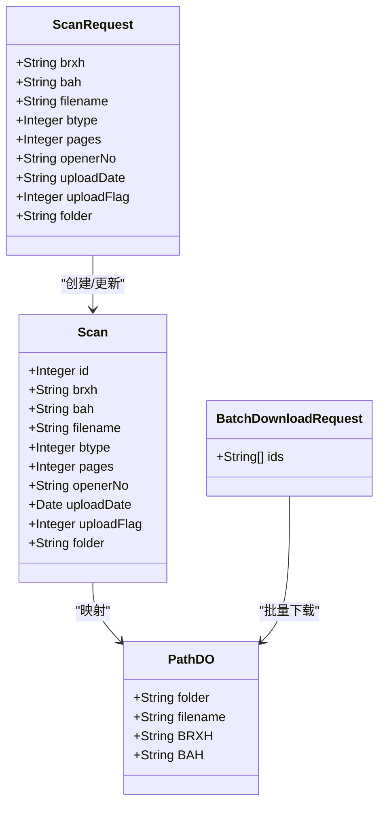
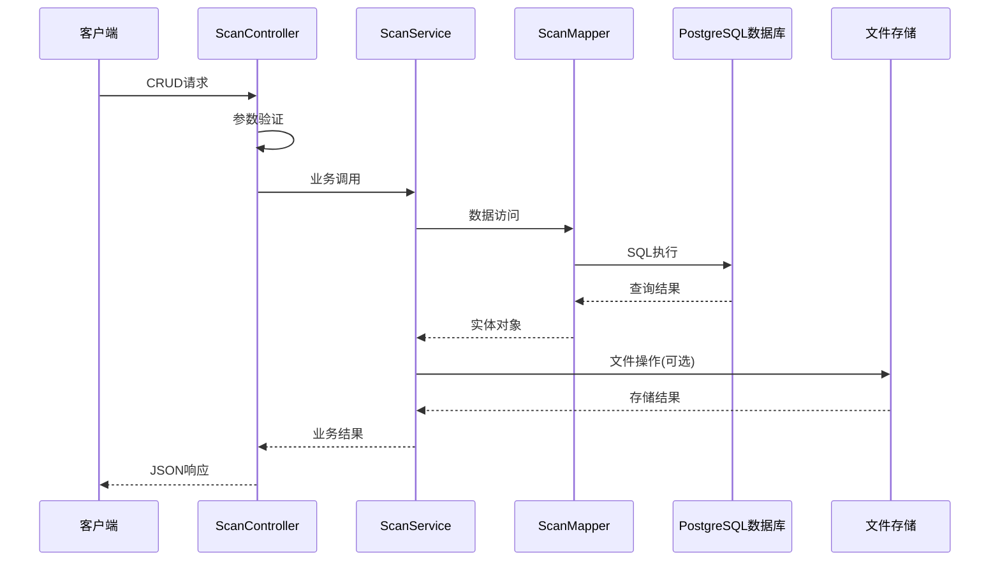
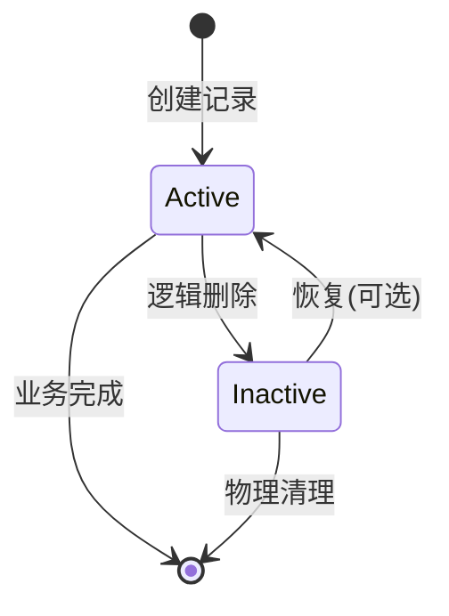
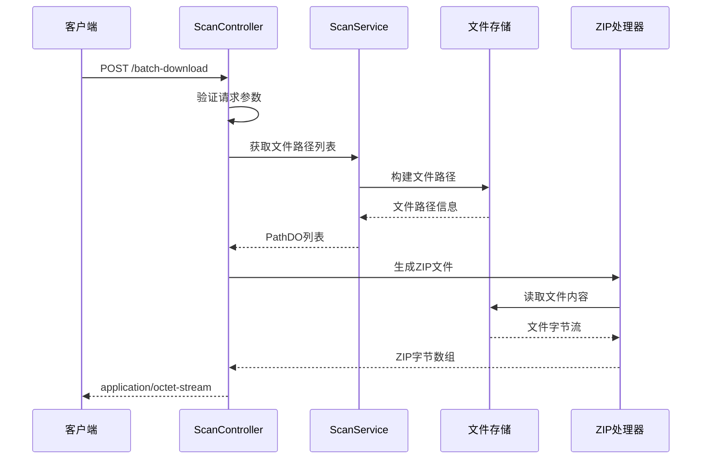
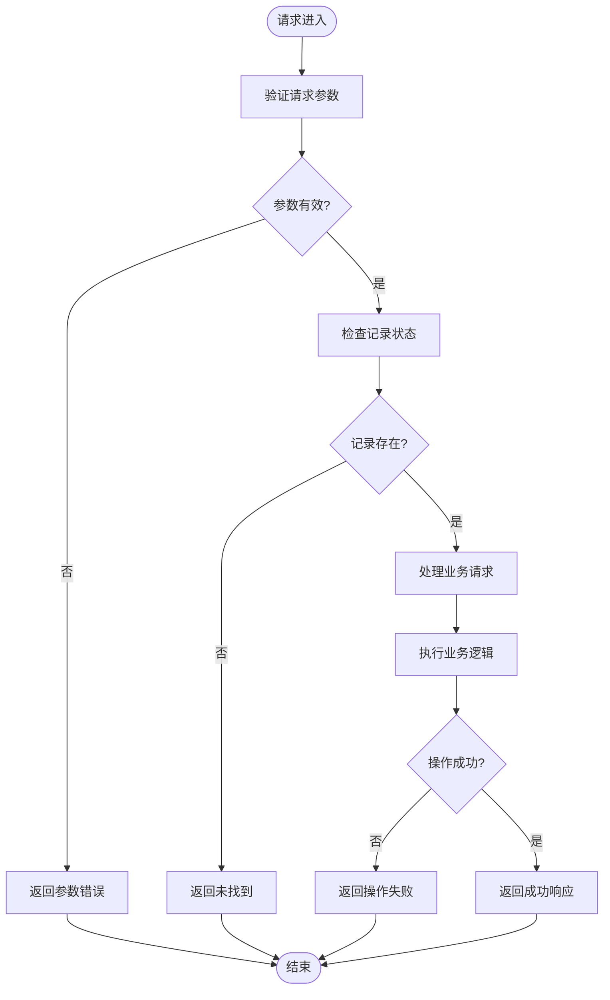
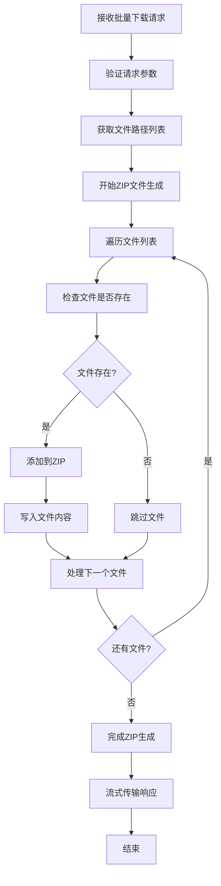
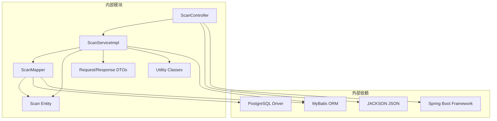

# 扫描记录API

<cite>
**本文档引用的文件**
- [ScanController.java](file://backend-repo/src/main/java/com/zjcxph/imgapi/controller/ScanController.java)
- [ScanServiceImpl.java](file://backend-repo/src/main/java/com/zjcxph/imgapi/service/impl/ScanServiceImpl.java)
- [ScanMapper.java](file://backend-repo/src/main/java/com/zjcxph/imgapi/mapper/ScanMapper.java)
- [Scan.java](file://backend-repo/src/main/java/com/zjcxph/imgapi/entity/Scan.java)
- [PathDO.java](file://backend-repo/src/main/java/com/zjcxph/imgapi/entity/PathDO.java)
- [ScanRequest.java](file://backend-repo/src/main/java/com/zjcxph/imgapi/dto/req/ScanRequest.java)
- [BatchDownloadRequest.java](file://backend-repo/src/main/java/com/zjcxph/imgapi/dto/req/BatchDownloadRequest.java)
- [ZipUtil.java](file://backend-repo/src/main/java/com/zjcxph/imgapi/utils/ZipUtil.java)
- [schema-postgresql.sql](file://backend-repo/src/main/resources/schema-postgresql.sql)
- [API_CONTRACT.md](file://backend-repo/API_CONTRACT.md)
- [application.properties](file://backend-repo/src/main/resources/application.properties)
- [records.ts](file://frontend-repo/src/api/records.ts)
- [records.ts](file://frontend-fantastic-admin/src/api/modules/records.ts)
- [ScanTest.java](file://backend-repo/src/test/java/com/zjcxph/imgapi/ScanTest.java)
</cite>

## 目录
1. [简介](#简介)
2. [项目结构](#项目结构)
3. [核心组件](#核心组件)
4. [架构概览](#架构概览)
5. [详细组件分析](#详细组件分析)
6. [依赖关系分析](#依赖关系分析)
7. [性能考虑](#性能考虑)
8. [故障排除指南](#故障排除指南)
9. [结论](#结论)
10. [附录](#附录)

## 简介

扫描记录API是MRR（Medical Record Repository）系统的核心组件，负责管理病案扫描记录的完整生命周期。该API提供了完整的CRUD操作、高级查询功能、批量下载能力以及与图像存储系统的深度集成。

本API基于Spring Boot框架构建，采用RESTful设计原则，支持PostgreSQL数据库存储，实现了高效的扫描记录管理和批量文件下载功能。系统通过严格的参数验证、状态管理和事务控制确保数据的一致性和可靠性。

## 项目结构

MRR系统采用典型的三层架构设计，主要包含以下模块：



**图表来源**
- [ScanController.java:1-333](file://backend-repo/src/main/java/com/zjcxph/imgapi/controller/ScanController.java#L1-L333)
- [ScanServiceImpl.java:1-135](file://backend-repo/src/main/java/com/zjcxph/imgapi/service/impl/ScanServiceImpl.java#L1-L135)

**章节来源**
- [ScanController.java:1-50](file://backend-repo/src/main/java/com/zjcxph/imgapi/controller/ScanController.java#L1-L50)
- [ScanServiceImpl.java:1-25](file://backend-repo/src/main/java/com/zjcxph/imgapi/service/impl/ScanServiceImpl.java#L1-L25)

## 核心组件

### 数据模型

扫描记录系统的核心数据模型包括以下关键实体：



**图表来源**
- [Scan.java:1-116](file://backend-repo/src/main/java/com/zjcxph/imgapi/entity/Scan.java#L1-L116)
- [PathDO.java:1-47](file://backend-repo/src/main/java/com/zjcxph/imgapi/entity/PathDO.java#L1-L47)
- [ScanRequest.java:1-105](file://backend-repo/src/main/java/com/zjcxph/imgapi/dto/req/ScanRequest.java#L1-L105)
- [BatchDownloadRequest.java:1-19](file://backend-repo/src/main/java/com/zjcxph/imgapi/dto/req/BatchDownloadRequest.java#L1-L19)

### 数据库架构

系统使用PostgreSQL作为主数据库，核心表结构如下：

| 字段名 | 类型 | 约束 | 描述 |
|--------|------|------|------|
| id | INTEGER | 主键, 自增 | 记录唯一标识 |
| brxh | TEXT | 非空 | 病人序号 |
| bah | TEXT | 非空 | 病案号 |
| filename | TEXT | 非空 | 文件名 |
| btype | INTEGER |  | 图片类型 |
| pages | INTEGER |  | 页码数量 |
| openerno | TEXT |  | 开启编号 |
| uploaddate | TEXT |  | 上传日期 |
| uploadflag | INTEGER | 默认0 | 上传状态标志 |
| folder | TEXT | 非空 | 文件夹路径 |

**章节来源**
- [schema-postgresql.sql:3-14](file://backend-repo/src/main/resources/schema-postgresql.sql#L3-L14)
- [Scan.java:11-20](file://backend-repo/src/main/java/com/zjcxph/imgapi/entity/Scan.java#L11-L20)

## 架构概览

扫描记录API采用经典的MVC架构模式，结合分层设计原则：



**图表来源**
- [ScanController.java:54-138](file://backend-repo/src/main/java/com/zjcxph/imgapi/controller/ScanController.java#L54-L138)
- [ScanServiceImpl.java:73-91](file://backend-repo/src/main/java/com/zjcxph/imgapi/service/impl/ScanServiceImpl.java#L73-L91)

### 状态管理机制

系统实现了完整的状态管理，通过`uploadFlag`字段实现逻辑删除：



**章节来源**
- [ScanMapper.java:39](file://backend-repo/src/main/java/com/zjcxph/imgapi/mapper/ScanMapper.java#L39)
- [ScanTest.java:176-178](file://backend-repo/src/test/java/com/zjcxph/imgapi/ScanTest.java#L176-L178)

## 详细组件分析

### 控制器层

ScanController提供了完整的API端点，支持多种查询方式和批量操作。

#### CRUD操作端点

| 方法 | 端点 | 功能描述 | 请求参数 | 响应数据 |
|------|------|----------|----------|----------|
| POST | `/v1/scan-api` | 创建扫描记录 | ScanRequest | Scan实体 |
| GET | `/v1/scan-api/{id}` | 获取单条记录 | 路径参数id | Scan实体 |
| PUT | `/v1/scan-api/{id}` | 更新记录 | 路径参数id, ScanRequest | Scan实体 |
| DELETE | `/v1/scan-api/{id}` | 删除记录 | 路径参数id | 操作结果 |
| GET | `/v1/scan-api` | 获取所有记录 | 无 | Scan列表 |

#### 高级查询端点

| 方法 | 端点 | 功能描述 | 请求参数 | 响应数据 |
|------|------|----------|----------|----------|
| GET | `/v1/scan-api/bah/{bah}` | 按病案号查询 | 路径参数bah | Scan列表 |
| GET | `/v1/scan-api/brxh/{brxh}` | 按病人序号查询 | 路径参数brxh | Scan列表 |
| GET | `/v1/scan-api/page` | 分页查询 | page, size | 分页结果 |
| POST | `/v1/scan-api/condition` | 条件查询 | ScanRequest | Scan列表 |
| POST | `/v1/scan-api/page/condition` | 条件分页查询 | ScanRequest, page, size | 分页结果 |

#### 批量下载功能

批量下载端点支持ZIP文件生成和流式传输：



**图表来源**
- [ScanController.java:256-281](file://backend-repo/src/main/java/com/zjcxph/imgapi/controller/ScanController.java#L256-L281)
- [ScanController.java:283-315](file://backend-repo/src/main/java/com/zjcxph/imgapi/controller/ScanController.java#L283-L315)

**章节来源**
- [ScanController.java:54-138](file://backend-repo/src/main/java/com/zjcxph/imgapi/controller/ScanController.java#L54-L138)
- [ScanController.java:200-254](file://backend-repo/src/main/java/com/zjcxph/imgapi/controller/ScanController.java#L200-L254)

### 服务层

ScanService实现了业务逻辑封装，提供数据访问和文件操作功能。

#### 核心业务方法

| 方法签名 | 功能描述 | 返回值 |
|----------|----------|--------|
| `create(Scan)` | 创建扫描记录 | Scan或null |
| `findById(Integer)` | 根据ID查询 | Scan或null |
| `update(Scan)` | 更新扫描记录 | Scan或null |
| `deleteById(Integer)` | 删除扫描记录 | boolean |
| `findAll()` | 获取所有记录 | List<Scan> |
| `findByBah(String)` | 按病案号查询 | List<Scan> |
| `findByBrxh(String)` | 按病人序号查询 | List<Scan> |
| `findAllWithPagination(int,int)` | 分页查询 | List<Scan> |
| `findByCondition(ScanRequest)` | 条件查询 | List<Scan> |
| `findByConditionWithPagination(ScanRequest,int,int)` | 条件分页查询 | List<Scan> |
| `countByCondition(ScanRequest)` | 统计符合条件的记录数 | long |
| `getImagePathList(List<String>)` | 获取文件路径列表 | List<PathDO> |
| `getImagePath(String)` | 获取图片路径 | Path或null |

**章节来源**
- [ScanServiceImpl.java:73-133](file://backend-repo/src/main/java/com/zjcxph/imgapi/service/impl/ScanServiceImpl.java#L73-L133)

### 数据访问层

ScanMapper使用MyBatis注解实现数据持久化操作。

#### SQL查询映射

| 方法 | 对应SQL | 功能 |
|------|---------|------|
| `findBAH(String)` | `SELECT * FROM mr_scan WHERE BAH = #{bah} ORDER BY pages` | 按病案号查询 |
| `getImagePathList(List<String>)` | `IN`查询语句 | 批量获取文件路径 |
| `insert(Scan)` | `INSERT`语句 | 创建记录 |
| `update(Scan)` | `UPDATE`语句（动态） | 更新记录 |
| `deleteById(Integer)` | `UPDATE uploadflag = 0` | 逻辑删除 |
| `findAll()` | `SELECT * FROM mr_scan ORDER BY id` | 获取所有记录 |
| `findByBah(String)` | `WHERE BAH = #{bah}` | 按病案号查询 |
| `findByBrxh(String)` | `WHERE BRXH = #{brxh}` | 按病人序号查询 |
| `findAllWithPagination(int,int)` | `LIMIT #{limit} OFFSET #{offset}` | 分页查询 |
| `findByCondition(ScanRequest)` | 动态`WHERE`子句 | 条件查询 |
| `findByConditionWithPagination(ScanRequest,int,int)` | 动态查询+分页 | 条件分页查询 |
| `countByCondition(ScanRequest)` | `COUNT(*)`统计 | 条件统计 |

**章节来源**
- [ScanMapper.java:17-129](file://backend-repo/src/main/java/com/zjcxph/imgapi/mapper/ScanMapper.java#L17-L129)

### 数据验证规则

系统实现了多层次的数据验证机制：

#### 参数验证

| 参数 | 验证规则 | 错误消息 |
|------|----------|----------|
| id | 非null | "ID 不能为空" |
| page | >= 1 | "页码必须大于 0" |
| size | >= 1 | "每页大小必须大于 0" |
| bah | 非null且非空 | "病案号不能为空" |
| brxh | 非null且非空 | "病人序号不能为空" |
| ids | 非null且非空 | "ids cannot be empty" |

#### 业务验证



**图表来源**
- [ScanController.java:90-101](file://backend-repo/src/main/java/com/zjcxph/imgapi/controller/ScanController.java#L90-L101)
- [ScanController.java:209-211](file://backend-repo/src/main/java/com/zjcxph/imgapi/controller/ScanController.java#L209-L211)

**章节来源**
- [ScanController.java:90-101](file://backend-repo/src/main/java/com/zjcxph/imgapi/controller/ScanController.java#L90-L101)
- [ScanController.java:209-211](file://backend-repo/src/main/java/com/zjcxph/imgapi/controller/ScanController.java#L209-L211)

### 批量下载实现细节

批量下载功能实现了高效的ZIP文件生成和流式传输机制：

#### ZIP文件生成流程



**图表来源**
- [ScanController.java:283-315](file://backend-repo/src/main/java/com/zjcxph/imgapi/controller/ScanController.java#L283-L315)

#### 文件路径构建规则

系统根据数据库中的文件元数据构建实际文件路径：

| 元数据字段 | 路径组件 | 示例 |
|------------|----------|------|
| folder | 父目录 | "24.03.18" → "24.03" |
| brxh | 病人目录 | "605746" |
| bah | 病案目录 | "00789508" |
| filename | 文件名 | "image_001.jpg" |

最终路径格式：`basePath/folderParent/folder/brxh-bah/filename`

**章节来源**
- [ScanController.java:317-331](file://backend-repo/src/main/java/com/zjcxph/imgapi/controller/ScanController.java#L317-L331)
- [ScanServiceImpl.java:32-46](file://backend-repo/src/main/java/com/zjcxph/imgapi/service/impl/ScanServiceImpl.java#L32-L46)

## 依赖关系分析

系统采用清晰的分层依赖关系，确保模块间的松耦合：



**图表来源**
- [ScanController.java:1-50](file://backend-repo/src/main/java/com/zjcxph/imgapi/controller/ScanController.java#L1-L50)
- [ScanServiceImpl.java:1-25](file://backend-repo/src/main/java/com/zjcxph/imgapi/service/impl/ScanServiceImpl.java#L1-L25)

### 关键依赖特性

| 依赖项 | 版本 | 用途 | 配置位置 |
|--------|------|------|----------|
| Spring Boot | 3.x | 核心框架 | pom.xml |
| MyBatis | 3.x | ORM映射 | pom.xml |
| PostgreSQL Driver | 42.x | 数据库连接 | pom.xml |
| Lombok | 1.x | 代码简化 | pom.xml |
| SLF4J | 2.x | 日志记录 | pom.xml |

**章节来源**
- [ScanController.java:1-333](file://backend-repo/src/main/java/com/zjcxph/imgapi/controller/ScanController.java#L1-L333)
- [ScanServiceImpl.java:1-135](file://backend-repo/src/main/java/com/zjcxph/imgapi/service/impl/ScanServiceImpl.java#L1-L135)

## 性能考虑

### 数据库优化

系统通过索引优化和查询优化提升性能：

#### 索引策略

| 索引名称 | 表名 | 列 | 类型 | 用途 |
|----------|------|----|------|------|
| idx_mr_scan_bah | app.mr_scan | bah | B-tree | 病案号查询 |
| idx_mr_scan_brxh | app.mr_scan | brxh | B-tree | 病人序号查询 |
| idx_access_log_access_time | app.access_log | access_time | B-tree | 日志查询 |
| idx_access_log_client_ip | app.access_log | client_ip | B-tree | IP过滤 |

#### 查询优化

- **分页查询**：使用LIMIT和OFFSET实现高效分页
- **条件查询**：动态WHERE子句避免全表扫描
- **批量操作**：IN子句优化批量ID查询
- **缓存策略**：启用Spring Boot自动配置缓存

### 缓存配置

系统配置了多层缓存机制：

| 缓存类型 | 配置项 | 值 | 说明 |
|----------|--------|----|------|
| HTTP缓存 | spring.web.resources.cache.cachecontrol.max-age | 365天 | 静态资源缓存 |
| 压缩 | server.compression.enabled | true | 响应压缩 |
| 最小响应大小 | server.compression.min-response-size | 1024字节 | 启用压缩的最小阈值 |
| MIME类型 | server.compression.mime-types | 多种类型 | 支持压缩的媒体类型 |

### 并发控制

系统实现了完善的并发控制机制：

#### 数据库层面

- **连接池配置**：最大20个连接，最小5个空闲
- **超时设置**：连接超时30秒，空闲超时300秒
- **事务隔离**：默认事务隔离级别

#### 应用层面

- **线程安全**：所有服务方法都是线程安全的
- **异常处理**：统一的异常处理机制
- **资源管理**：自动资源清理和释放

**章节来源**
- [application.properties:15-19](file://backend-repo/src/main/resources/application.properties#L15-L19)
- [application.properties:4-6](file://backend-repo/src/main/resources/application.properties#L4-L6)

## 故障排除指南

### 常见问题及解决方案

#### 数据库连接问题

**症状**：应用启动失败，数据库连接异常
**原因**：
- 数据库URL配置错误
- 用户名或密码不正确
- 网络连接问题

**解决方案**：
1. 检查`application.properties`中的数据库配置
2. 验证数据库服务状态
3. 确认网络连通性

#### 文件路径错误

**症状**：批量下载返回空响应或部分文件缺失
**原因**：
- 文件路径配置错误
- 文件不存在或权限不足
- 文件夹结构发生变化

**解决方案**：
1. 检查`image.basePath`配置
2. 验证文件系统权限
3. 确认文件夹结构符合预期

#### 性能问题

**症状**：查询响应时间过长
**原因**：
- 缺少必要的数据库索引
- 查询条件过于复杂
- 数据量过大

**解决方案**：
1. 添加适当的数据库索引
2. 优化查询条件
3. 考虑数据分区策略

### 错误响应格式

系统统一使用Result包装器返回错误信息：

```json
{
  "code": 400,
  "message": "参数验证失败",
  "data": null,
  "success": false
}
```

**章节来源**
- [ScanController.java:78](file://backend-repo/src/main/java/com/zjcxph/imgapi/controller/ScanController.java#L78)
- [ScanController.java:277-280](file://backend-repo/src/main/java/com/zjcxph/imgapi/controller/ScanController.java#L277-L280)

## 结论

扫描记录API是一个功能完整、设计合理的医疗记录管理系统核心组件。系统通过清晰的分层架构、严格的参数验证、完善的错误处理机制和高效的性能优化策略，为医疗记录管理提供了可靠的技术支撑。

### 主要优势

1. **完整的CRUD功能**：支持所有基本的记录管理操作
2. **灵活的查询能力**：提供多种查询方式满足不同需求
3. **高效的批量处理**：优化的ZIP生成和流式传输机制
4. **可靠的错误处理**：统一的异常处理和状态管理
5. **良好的性能表现**：通过索引优化和缓存策略提升响应速度

### 技术亮点

- **分层架构设计**：清晰的职责分离和依赖管理
- **数据验证机制**：多层次的参数和业务验证
- **状态管理模式**：通过uploadFlag实现逻辑删除
- **文件系统集成**：与图像存储系统的深度整合
- **性能优化策略**：数据库索引、缓存和连接池优化

该API为MRR系统的稳定运行和未来发展奠定了坚实的基础，能够有效支持大规模医疗记录的存储、查询和管理需求。

## 附录

### API使用示例

#### 创建扫描记录
```javascript
// 前端调用示例
const recordData = {
  brxh: "605746",
  bah: "00789508",
  filename: "image_001.jpg",
  btype: 1,
  pages: 10,
  openerNo: "OP001",
  uploadFlag: 1,
  folder: "24.03.18"
};

await createScan(recordData);
```

#### 批量下载文件
```javascript
// 前端调用示例
const selectedIds = ["1", "2", "3", "4", "5"];
const response = await batchDownloadRecords(selectedIds);

// 保存ZIP文件
const blob = new Blob([response], { type: 'application/zip' });
const url = window.URL.createObjectURL(blob);
const a = document.createElement('a');
a.href = url;
a.download = 'scan-batch-' + Date.now() + '.zip';
a.click();
```

#### 条件查询
```javascript
// 前端调用示例
const condition = {
  bah: "00789508",
  btype: 1,
  uploadFlag: 1
};

const page = 1;
const size = 10;

await getScanByCondition(condition, page, size);
```

**章节来源**
- [records.ts:45-55](file://frontend-repo/src/api/records.ts#L45-L55)
- [records.ts:19-21](file://frontend-repo/src/api/records.ts#L19-L21)
- [records.ts:31-35](file://frontend-repo/src/api/records.ts#L31-L35)

### 配置参考

#### 环境变量配置

| 配置项 | 默认值 | 说明 |
|--------|--------|------|
| SERVER_PORT | 18045 | 服务器端口 |
| SPRING_DATASOURCE_URL | jdbc:postgresql://localhost:5432/imgapi?currentSchema=app | 数据库连接URL |
| IMAGE_BASE_PATH | ./data/img | 图像文件基础路径 |
| IMAGE_USERNAME | br_admin | 图像服务用户名 |
| IMAGE_PASSWORD | br_password | 图像服务密码 |

#### 数据库初始化

系统启动时会自动执行数据库初始化脚本，创建必要的表结构和索引。首次运行时建议检查数据库连接配置和权限设置。