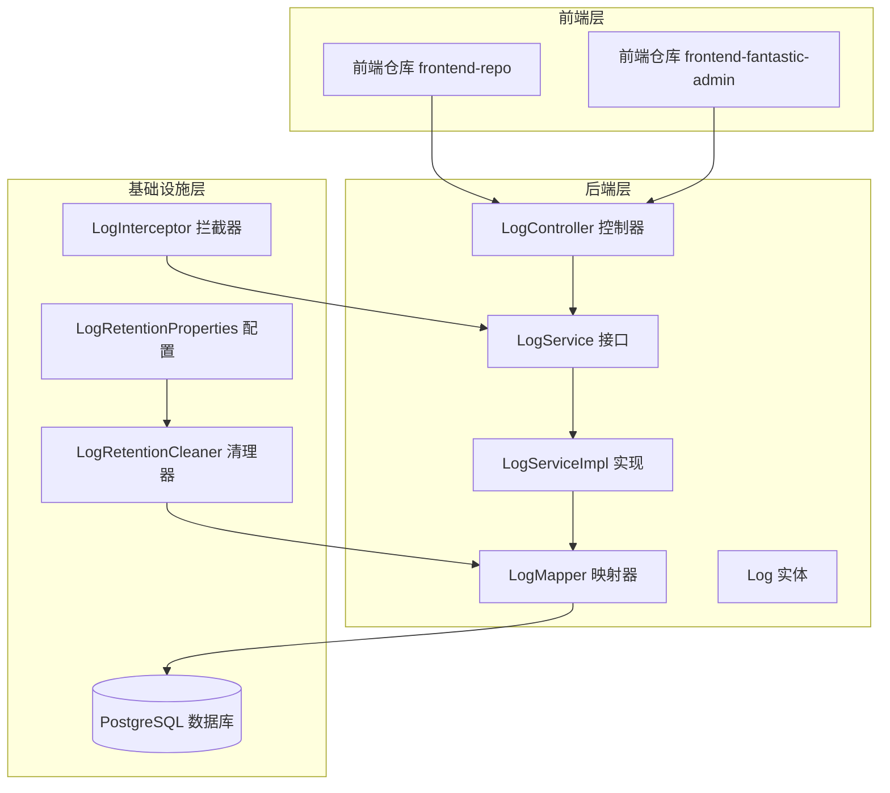
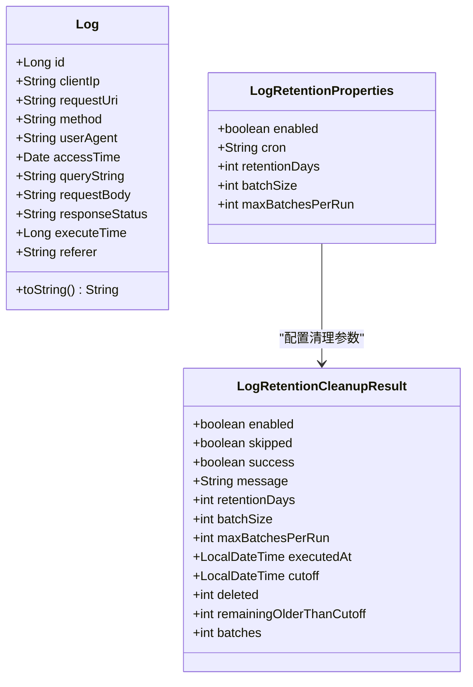
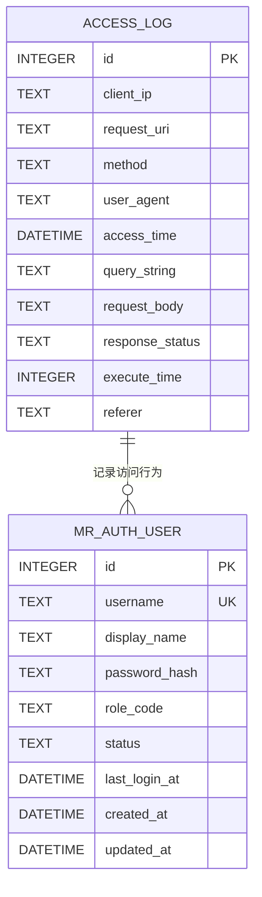
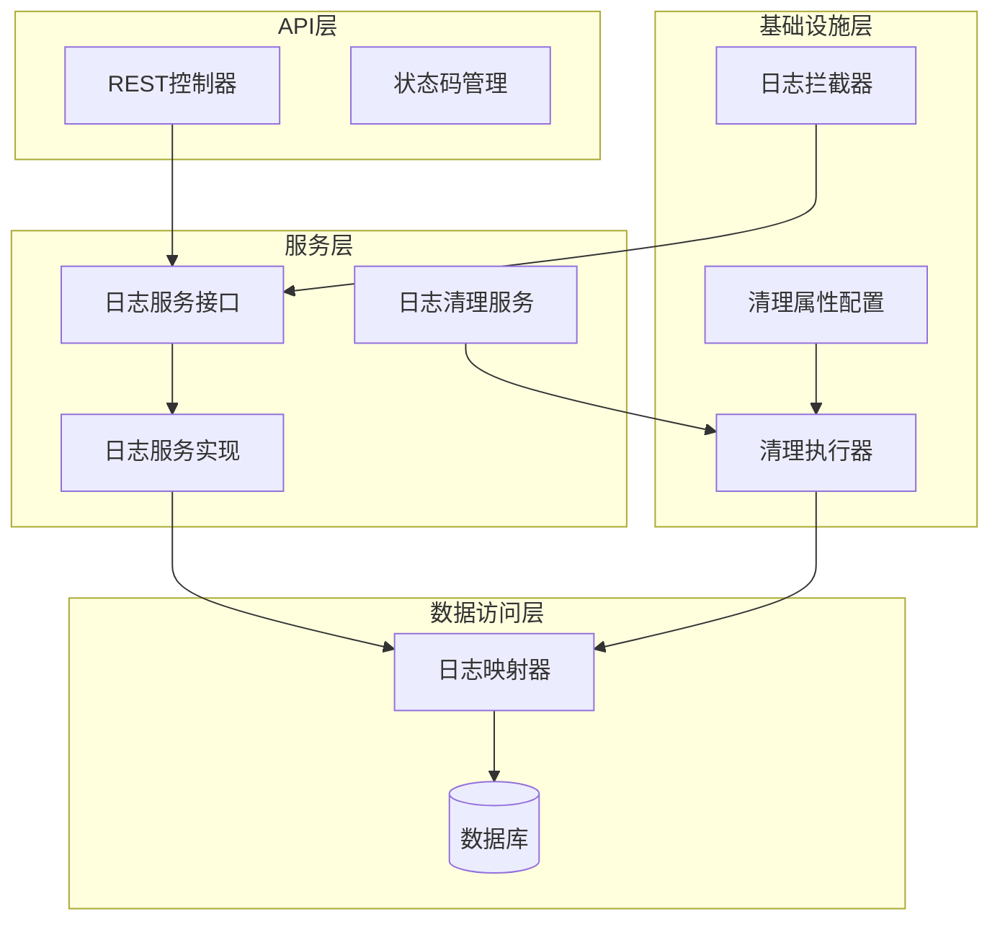
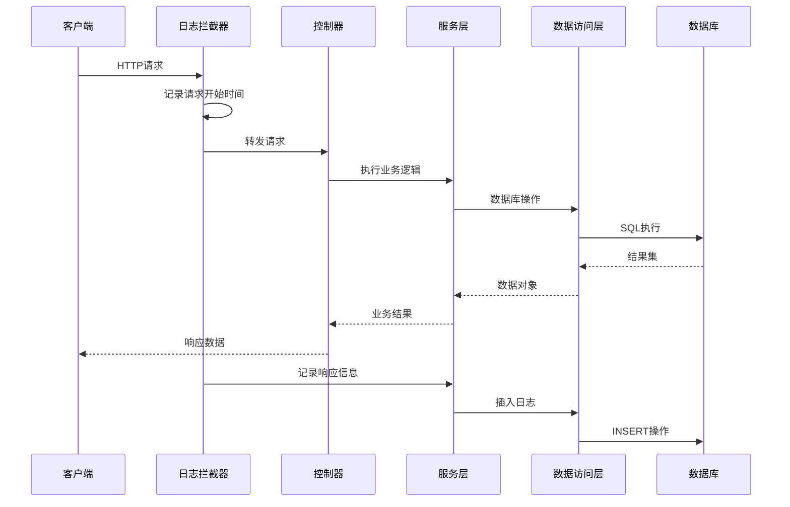
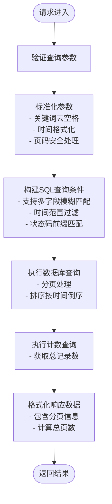
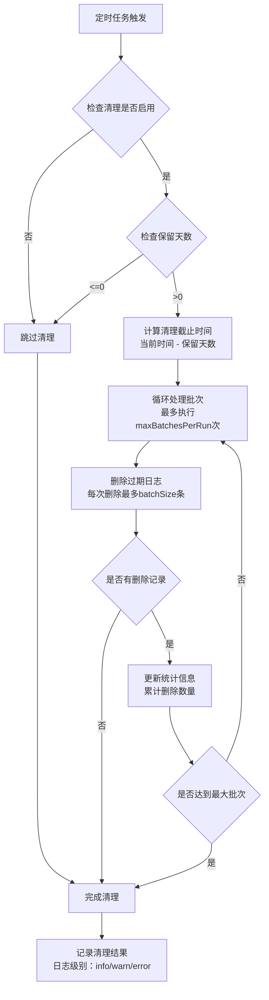
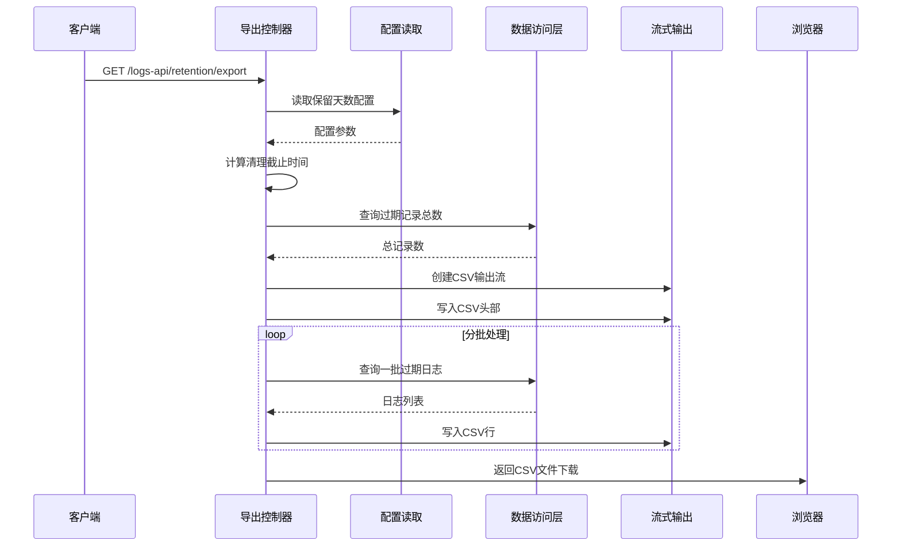
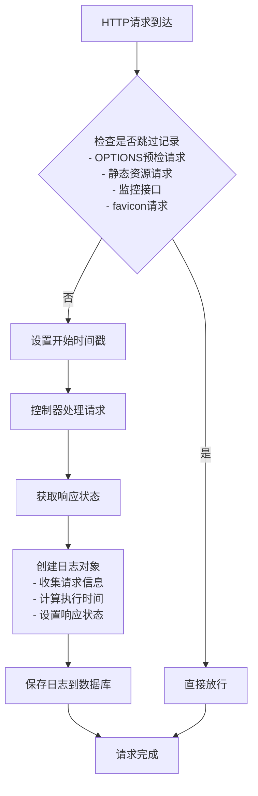
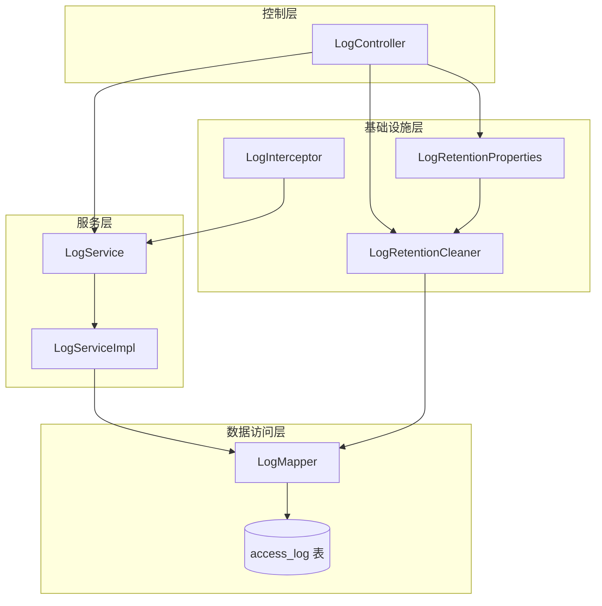

# 日志管理API

<cite>
**本文档引用的文件**
- [LogController.java](file://backend-repo/src/main/java/com/zjcxph/imgapi/controller/LogController.java)
- [LogService.java](file://backend-repo/src/main/java/com/zjcxph/imgapi/service/LogService.java)
- [LogServiceImpl.java](file://backend-repo/src/main/java/com/zjcxph/imgapi/service/impl/LogServiceImpl.java)
- [Log.java](file://backend-repo/src/main/java/com/zjcxph/imgapi/entity/Log.java)
- [LogMapper.java](file://backend-repo/src/main/java/com/zjcxph/imgapi/mapper/LogMapper.java)
- [LogRetentionProperties.java](file://backend-repo/src/main/java/com/zjcxph/imgapi/config/LogRetentionProperties.java)
- [LogRetentionCleaner.java](file://backend-repo/src/main/java/com/zjcxph/imgapi/scheduler/LogRetentionCleaner.java)
- [LogInterceptor.java](file://backend-repo/src/main/java/com/zjcxph/imgapi/interceptors/LogInterceptor.java)
- [LogRetentionCleanupResult.java](file://backend-repo/src/main/java/com/zjcxph/imgapi/dto/resp/LogRetentionCleanupResult.java)
- [schema.sql](file://mrr-db/schema.sql)
- [application.properties](file://backend-repo/src/main/resources/application.properties)
- [logs.ts](file://frontend-repo/src/api/logs.ts)
- [logs.ts](file://frontend-fantastic-admin/src/api/modules/logs.ts)
- [系统日志功能说明.md](file://frontend-repo/docs/guide/系统日志功能说明.md)
- [API_CONTRACT.md](file://backend-repo/API_CONTRACT.md)
</cite>

## 目录
1. [简介](#简介)
2. [项目结构](#项目结构)
3. [核心组件](#核心组件)
4. [架构概览](#架构概览)
5. [详细组件分析](#详细组件分析)
6. [依赖关系分析](#依赖关系分析)
7. [性能考虑](#性能考虑)
8. [故障排除指南](#故障排除指南)
9. [结论](#结论)

## 简介

MRR日志管理API是一个完整的系统日志查询、管理和清理解决方案。该系统提供了对访问日志的实时记录、查询、过滤和管理功能，支持自动清理策略和手动清理操作。系统采用Spring Boot框架构建，使用MyBatis进行数据库操作，实现了高性能的日志管理系统。

该API主要面向以下需求：
- 实时记录HTTP请求访问日志
- 提供强大的日志查询和过滤功能
- 支持日志保留策略和自动清理
- 提供日志导出功能
- 支持前端管理界面集成

## 项目结构

MRR日志管理API采用标准的Spring Boot三层架构设计：

**图表来源**
- [LogController.java:1-245](file://backend-repo/src/main/java/com/zjcxph/imgapi/controller/LogController.java#L1-L245)
- [LogServiceImpl.java:1-71](file://backend-repo/src/main/java/com/zjcxph/imgapi/service/impl/LogServiceImpl.java#L1-L71)
- [LogMapper.java:1-166](file://backend-repo/src/main/java/com/zjcxph/imgapi/mapper/LogMapper.java#L1-L166)

**章节来源**
- [LogController.java:1-245](file://backend-repo/src/main/java/com/zjcxph/imgapi/controller/LogController.java#L1-L245)
- [LogServiceImpl.java:1-71](file://backend-repo/src/main/java/com/zjcxph/imgapi/service/impl/LogServiceImpl.java#L1-L71)
- [LogMapper.java:1-166](file://backend-repo/src/main/java/com/zjcxph/imgapi/mapper/LogMapper.java#L1-L166)

## 核心组件

### 日志实体模型

系统使用统一的日志实体模型来表示所有类型的访问日志：

**图表来源**
- [Log.java:1-138](file://backend-repo/src/main/java/com/zjcxph/imgapi/entity/Log.java#L1-L138)
- [LogRetentionProperties.java:1-54](file://backend-repo/src/main/java/com/zjcxph/imgapi/config/LogRetentionProperties.java#L1-L54)
- [LogRetentionCleanupResult.java:1-119](file://backend-repo/src/main/java/com/zjcxph/imgapi/dto/resp/LogRetentionCleanupResult.java#L1-L119)

### 数据库架构

系统使用SQLite作为日志存储，主要的数据表结构如下：

**图表来源**
- [schema.sql:1-95](file://mrr-db/schema.sql#L1-L95)

**章节来源**
- [Log.java:1-138](file://backend-repo/src/main/java/com/zjcxph/imgapi/entity/Log.java#L1-L138)
- [schema.sql:1-95](file://mrr-db/schema.sql#L1-L95)

## 架构概览

MRR日志管理API采用分层架构设计，实现了清晰的关注点分离：

**图表来源**
- [LogController.java:32-54](file://backend-repo/src/main/java/com/zjcxph/imgapi/controller/LogController.java#L32-L54)
- [LogServiceImpl.java:11-71](file://backend-repo/src/main/java/com/zjcxph/imgapi/service/impl/LogServiceImpl.java#L11-L71)
- [LogRetentionCleaner.java:13-24](file://backend-repo/src/main/java/com/zjcxph/imgapi/scheduler/LogRetentionCleaner.java#L13-L24)

系统的核心工作流程：

**图表来源**
- [LogInterceptor.java:21-58](file://backend-repo/src/main/java/com/zjcxph/imgapi/interceptors/LogInterceptor.java#L21-L58)
- [LogController.java:150-202](file://backend-repo/src/main/java/com/zjcxph/imgapi/controller/LogController.java#L150-L202)
- [LogServiceImpl.java:17-20](file://backend-repo/src/main/java/com/zjcxph/imgapi/service/impl/LogServiceImpl.java#L17-L20)

**章节来源**
- [LogController.java:32-54](file://backend-repo/src/main/java/com/zjcxph/imgapi/controller/LogController.java#L32-L54)
- [LogInterceptor.java:15-89](file://backend-repo/src/main/java/com/zjcxph/imgapi/interceptors/LogInterceptor.java#L15-L89)

## 详细组件分析

### 日志查询接口

系统提供了多种日志查询方式，满足不同的使用场景：

#### 基础查询接口

**图表来源**
- [LogController.java:150-202](file://backend-repo/src/main/java/com/zjcxph/imgapi/controller/LogController.java#L150-L202)
- [LogMapper.java:70-113](file://backend-repo/src/main/java/com/zjcxph/imgapi/mapper/LogMapper.java#L70-L113)

#### 高级搜索功能

系统支持复杂的日志搜索功能，包括：

**搜索参数支持**：
- 关键词搜索：支持IP、URI、User-Agent、Query String、Request Body、Referer等字段的模糊匹配
- IP地址过滤：精确匹配客户端IP地址
- URI过滤：精确匹配请求路径
- 方法过滤：精确匹配HTTP方法（GET、POST等）
- 状态码过滤：支持前缀匹配（如2、4、500等）
- 时间范围过滤：支持开始时间和结束时间的精确匹配

**搜索算法复杂度**：
- 时间复杂度：O(n) - 需要扫描匹配条件
- 空间复杂度：O(1) - 使用游标和分页机制
- 性能优化：通过索引和适当的查询条件限制

**章节来源**
- [LogController.java:150-202](file://backend-repo/src/main/java/com/zjcxph/imgapi/controller/LogController.java#L150-L202)
- [LogMapper.java:70-146](file://backend-repo/src/main/java/com/zjcxph/imgapi/mapper/LogMapper.java#L70-L146)

### 日志清理机制

系统实现了智能的日志保留策略，支持自动和手动清理两种模式：

#### 自动清理流程

**图表来源**
- [LogRetentionCleaner.java:26-37](file://backend-repo/src/main/java/com/zjcxph/imgapi/scheduler/LogRetentionCleaner.java#L26-L37)
- [LogRetentionCleaner.java:39-117](file://backend-repo/src/main/java/com/zjcxph/imgapi/scheduler/LogRetentionCleaner.java#L39-L117)

#### 手动清理接口

系统提供了灵活的手动清理接口，支持自定义清理截止时间：

**接口特性**：
- 支持指定清理截止时间，不使用默认的保留策略
- 强制执行模式，即使清理功能被禁用也会执行
- 返回详细的清理统计信息

**清理统计信息**：
- 已删除记录数
- 剩余过期记录数
- 执行批次数量
- 清理执行时间
- 清理截止时间

**章节来源**
- [LogController.java:94-106](file://backend-repo/src/main/java/com/zjcxph/imgapi/controller/LogController.java#L94-L106)
- [LogRetentionCleaner.java:31-37](file://backend-repo/src/main/java/com/zjcxph/imgapi/scheduler/LogRetentionCleaner.java#L31-L37)
- [LogRetentionCleanupResult.java:1-119](file://backend-repo/src/main/java/com/zjcxph/imgapi/dto/resp/LogRetentionCleanupResult.java#L1-L119)

### 日志导出功能

系统提供了高效的CSV格式日志导出功能，支持大体量数据的流式导出：

#### 导出流程设计

**图表来源**
- [LogController.java:108-148](file://backend-repo/src/main/java/com/zjcxph/imgapi/controller/LogController.java#L108-L148)
- [LogMapper.java:41-68](file://backend-repo/src/main/java/com/zjcxph/imgapi/mapper/LogMapper.java#L41-L68)

#### 导出特性

**性能优化**：
- 分批处理：默认每批处理5000条记录
- 流式输出：避免内存溢出
- UTF-8编码：支持中文字符
- CSV格式：标准格式便于导入

**导出内容**：
- 记录ID、客户端IP、请求URI
- HTTP方法、User-Agent、访问时间
- 查询字符串、请求体、响应状态码
- 执行时间、Referer信息

**章节来源**
- [LogController.java:108-148](file://backend-repo/src/main/java/com/zjcxph/imgapi/controller/LogController.java#L108-L148)

### 日志拦截器

系统使用Spring MVC拦截器自动记录所有HTTP请求的访问日志：

#### 拦截器工作流程

**图表来源**
- [LogInterceptor.java:21-58](file://backend-repo/src/main/java/com/zjcxph/imgapi/interceptors/LogInterceptor.java#L21-L58)

#### 拦截器配置

**跳过规则**：
- 预检请求（OPTIONS）：避免重复记录CORS预检
- 静态资源：图片、CSS、JavaScript等静态文件
- 监控接口：/actuator/ 开头的监控端点
- 文档接口：/swagger-ui/、/v3/api-docs/ 开头的API文档
- 特殊路径：/favicon.ico、/error 等

**IP地址获取**：
- 优先级：X-Forwarded-For → X-Real-IP → RemoteAddr
- 支持代理服务器环境

**章节来源**
- [LogInterceptor.java:15-89](file://backend-repo/src/main/java/com/zjcxph/imgapi/interceptors/LogInterceptor.java#L15-L89)

## 依赖关系分析

系统各组件之间的依赖关系清晰明确：

**图表来源**
- [LogController.java:34-54](file://backend-repo/src/main/java/com/zjcxph/imgapi/controller/LogController.java#L34-L54)
- [LogServiceImpl.java:11-16](file://backend-repo/src/main/java/com/zjcxph/imgapi/service/impl/LogServiceImpl.java#L11-L16)
- [LogRetentionCleaner.java:13-24](file://backend-repo/src/main/java/com/zjcxph/imgapi/scheduler/LogRetentionCleaner.java#L13-L24)

**章节来源**
- [LogController.java:34-54](file://backend-repo/src/main/java/com/zjcxph/imgapi/controller/LogController.java#L34-L54)
- [LogServiceImpl.java:11-16](file://backend-repo/src/main/java/com/zjcxph/imgapi/service/impl/LogServiceImpl.java#L11-L16)

## 性能考虑

### 数据库性能优化

**索引策略**：
- access_time字段：用于时间范围查询和排序
- client_ip字段：用于IP地址过滤
- request_uri字段：用于URI过滤

**查询优化**：
- 使用LIMIT和OFFSET实现分页
- 采用游标查询避免全表扫描
- 批量删除操作减少事务开销

### 缓存策略

系统采用多层缓存策略：

**应用层缓存**：
- 日志查询结果缓存（短期有效）
- 配置信息缓存
- 用户会话信息缓存

**数据库连接池**：
- 最大连接数：20
- 最小空闲连接：5
- 连接超时：30秒
- 空闲超时：300秒

### 监控指标

系统集成了Spring Boot Actuator监控：

**健康检查**：
- 数据库连接状态
- 应用运行状态
- 磁盘空间使用率

**性能指标**：
- 请求响应时间
- 数据库查询延迟
- 内存使用情况

**章节来源**
- [application.properties:10-49](file://backend-repo/src/main/resources/application.properties#L10-L49)

## 故障排除指南

### 常见问题诊断

**日志查询无结果**：
1. 检查时间范围参数是否正确
2. 验证关键字是否包含在正确的字段中
3. 确认分页参数是否合理

**清理功能异常**：
1. 检查清理配置是否启用
2. 验证保留天数设置
3. 查看清理日志中的错误信息

**导出功能失败**：
1. 检查磁盘空间是否充足
2. 验证CSV文件格式
3. 确认浏览器兼容性

### 调试工具

**日志级别配置**：
- DEBUG：详细的操作日志
- INFO：正常业务流程日志
- WARN：潜在问题警告
- ERROR：错误异常日志

**监控接口**：
- /actuator/health：系统健康状态
- /actuator/metrics：性能指标
- /actuator/prometheus：Prometheus格式指标

**章节来源**
- [application.properties:24-29](file://backend-repo/src/main/resources/application.properties#L24-L29)
- [LogRetentionCleaner.java:110-114](file://backend-repo/src/main/java/com/zjcxph/imgapi/scheduler/LogRetentionCleaner.java#L110-L114)

## 结论

MRR日志管理API提供了一个完整、高效、可扩展的日志管理系统。系统具有以下优势：

**功能完整性**：
- 支持多种查询方式和过滤条件
- 实现了智能的日志保留策略
- 提供了灵活的导出功能
- 集成了自动清理机制

**性能优化**：
- 采用分页和游标技术处理大数据量
- 实现了批量删除优化
- 提供了多层缓存策略
- 支持流式数据处理

**可维护性**：
- 清晰的分层架构设计
- 完善的错误处理机制
- 详细的日志记录
- 可配置的清理策略

该系统能够满足医疗影像管理系统的日志管理需求，为系统运维和故障排查提供了强有力的技术支撑。