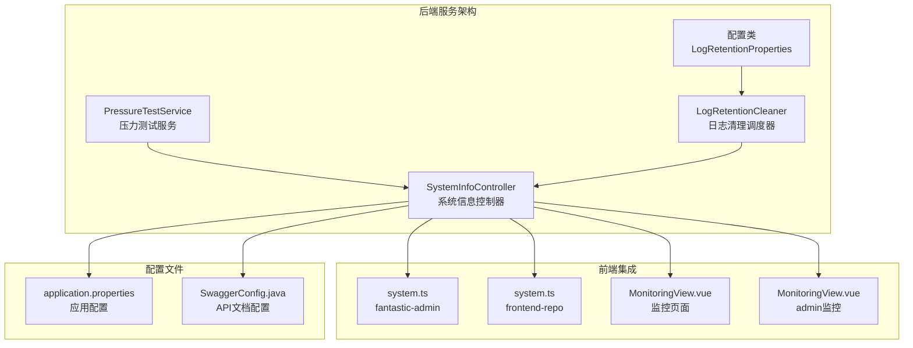
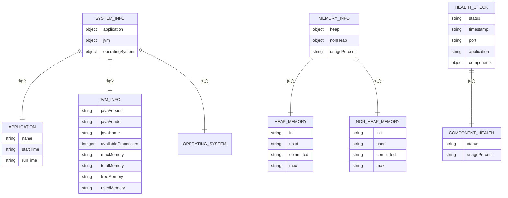
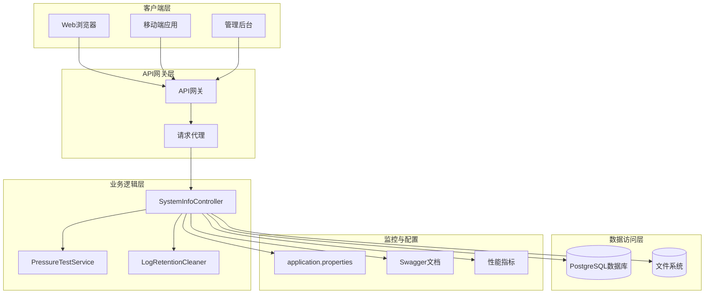
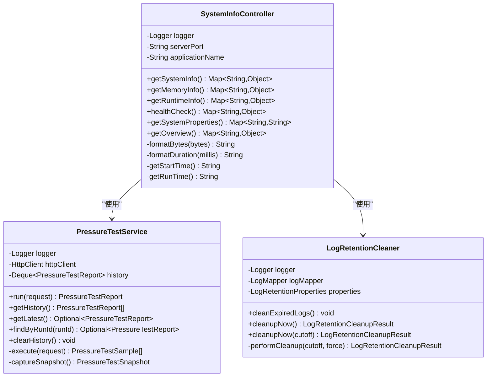
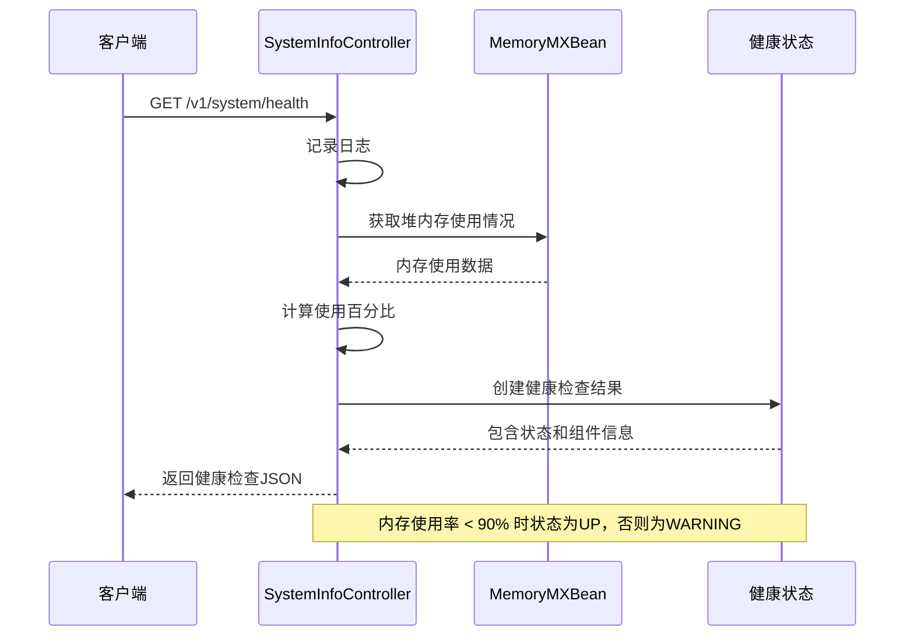
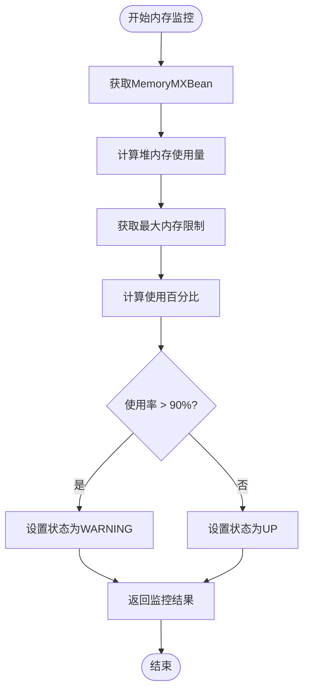
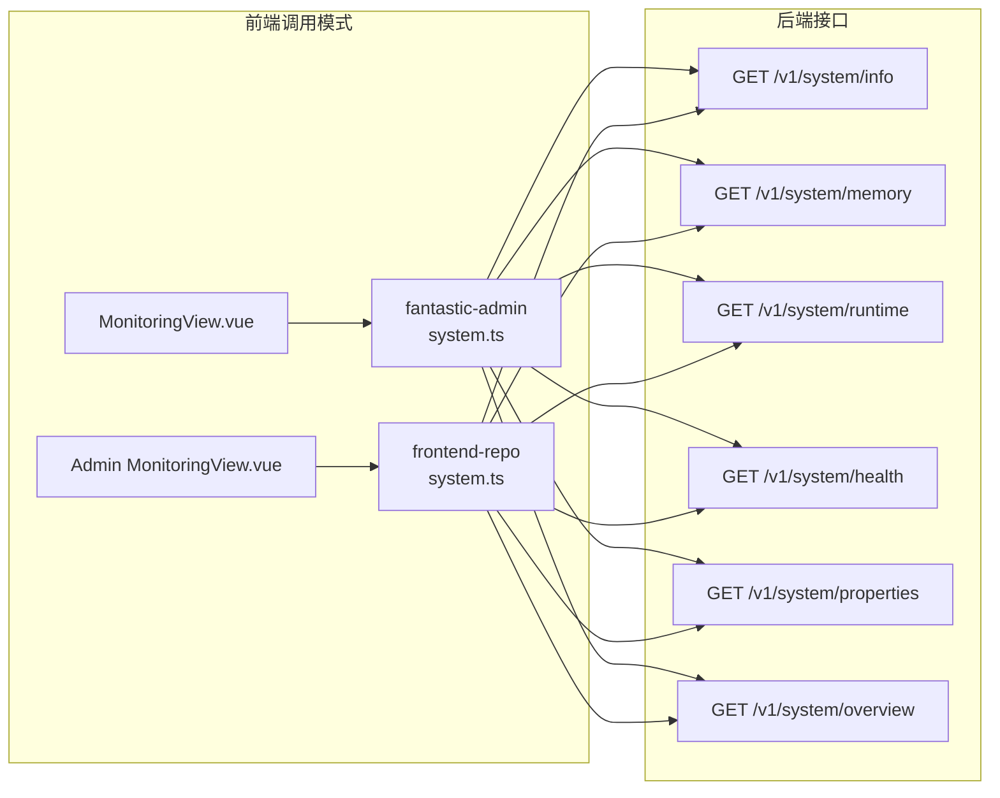
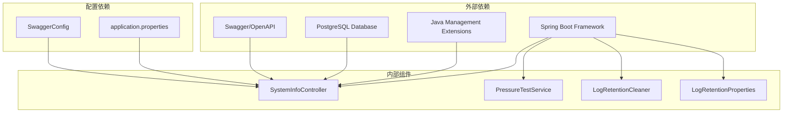

# 系统信息API

<cite>
**本文档引用的文件**
- [SystemInfoController.java](file://backend-repo/src/main/java/com/zjcxph/imgapi/controller/SystemInfoController.java)
- [PressureTestService.java](file://backend-repo/src/main/java/com/zjcxph/imgapi/monitoring/PressureTestService.java)
- [LogRetentionCleaner.java](file://backend-repo/src/main/java/com/zjcxph/imgapi/scheduler/LogRetentionCleaner.java)
- [application.properties](file://backend-repo/src/main/resources/application.properties)
- [API_CONTRACT.md](file://backend-repo/API_CONTRACT.md)
- [SwaggerConfig.java](file://backend-repo/src/main/java/com/zjcxph/imgapi/config/SwaggerConfig.java)
- [LogRetentionProperties.java](file://backend-repo/src/main/java/com/zjcxph/imgapi/config/LogRetentionProperties.java)
- [system.ts（前端fantastic-admin）](file://frontend-fantastic-admin/src/api/modules/system.ts)
- [system.ts（前端repo）](file://frontend-repo/src/api/system.ts)
- [index.vue（前端监控页面）](file://frontend-fantastic-admin/src/views/monitoring/index.vue)
- [MonitoringView.vue（前端admin监控）](file://frontend-repo/src/components/admin/MonitoringView.vue)
</cite>

## 目录
1. [简介](#简介)
2. [项目结构](#项目结构)
3. [核心组件](#核心组件)
4. [架构概览](#架构概览)
5. [详细组件分析](#详细组件分析)
6. [依赖关系分析](#依赖关系分析)
7. [性能考虑](#性能考虑)
8. [故障排除指南](#故障排除指南)
9. [结论](#结论)

## 简介

系统信息API是MRR（医学记录管理系统）的核心监控组件，提供全面的系统运行状态查询、资源配置监控和健康检查功能。该API通过RESTful接口暴露系统关键指标，包括数据库连接状态、内存使用率、磁盘空间和网络连接等监控指标。

系统信息API采用Spring Boot框架构建，集成了多种监控机制，包括实时系统指标采集、性能数据统计和资源使用情况跟踪。该API不仅提供基础的系统信息查询，还包含了高级的健康检查机制和告警策略。

## 项目结构

系统信息API位于后端服务的控制器层，采用标准的分层架构设计：

**图表来源**
- [SystemInfoController.java:1-236](file://backend-repo/src/main/java/com/zjcxph/imgapi/controller/SystemInfoController.java#L1-L236)
- [PressureTestService.java:1-293](file://backend-repo/src/main/java/com/zjcxph/imgapi/monitoring/PressureTestService.java#L1-L293)
- [LogRetentionCleaner.java:1-119](file://backend-repo/src/main/java/com/zjcxph/imgapi/scheduler/LogRetentionCleaner.java#L1-L119)

**章节来源**
- [SystemInfoController.java:1-236](file://backend-repo/src/main/java/com/zjcxph/imgapi/controller/SystemInfoController.java#L1-L236)
- [API_CONTRACT.md:1-44](file://backend-repo/API_CONTRACT.md#L1-L44)

## 核心组件

系统信息API由多个核心组件构成，每个组件负责特定的监控功能：

### 主要接口端点

系统信息API提供以下主要接口：

| 接口路径 | 方法 | 功能描述 | 响应格式 |
|---------|------|----------|----------|
| `/v1/system/info` | GET | 获取系统基本信息 | JSON对象 |
| `/v1/system/memory` | GET | 获取内存详细信息 | JSON对象 |
| `/v1/system/runtime` | GET | 获取运行时信息 | JSON对象 |
| `/v1/system/health` | GET | 系统健康检查 | JSON对象 |
| `/v1/system/properties` | GET | 获取系统属性 | 键值对映射 |
| `/v1/system/overview` | GET | 获取统一监控数据 | 综合数据对象 |

### 数据模型结构

系统信息API返回的数据采用层次化的JSON结构：

**图表来源**
- [SystemInfoController.java:37-180](file://backend-repo/src/main/java/com/zjcxph/imgapi/controller/SystemInfoController.java#L37-L180)

**章节来源**
- [SystemInfoController.java:35-180](file://backend-repo/src/main/java/com/zjcxph/imgapi/controller/SystemInfoController.java#L35-L180)

## 架构概览

系统信息API采用模块化设计，各个组件之间通过清晰的接口进行交互：

**图表来源**
- [API_CONTRACT.md:7-9](file://backend-repo/API_CONTRACT.md#L7-L9)
- [application.properties:1-49](file://backend-repo/src/main/resources/application.properties#L1-L49)

## 详细组件分析

### SystemInfoController 分析

SystemInfoController是系统信息API的核心控制器，负责处理所有系统监控相关的请求。

#### 类结构图

**图表来源**
- [SystemInfoController.java:25-236](file://backend-repo/src/main/java/com/zjcxph/imgapi/controller/SystemInfoController.java#L25-L236)
- [PressureTestService.java:32-293](file://backend-repo/src/main/java/com/zjcxph/imgapi/monitoring/PressureTestService.java#L32-L293)
- [LogRetentionCleaner.java:14-119](file://backend-repo/src/main/java/com/zjcxph/imgapi/scheduler/LogRetentionCleaner.java#L14-L119)

#### 健康检查流程

**图表来源**
- [SystemInfoController.java:120-144](file://backend-repo/src/main/java/com/zjcxph/imgapi/controller/SystemInfoController.java#L120-L144)

#### 内存监控算法

**图表来源**
- [SystemInfoController.java:72-100](file://backend-repo/src/main/java/com/zjcxph/imgapi/controller/SystemInfoController.java#L72-L100)
- [SystemInfoController.java:131-141](file://backend-repo/src/main/java/com/zjcxph/imgapi/controller/SystemInfoController.java#L131-L141)

**章节来源**
- [SystemInfoController.java:25-236](file://backend-repo/src/main/java/com/zjcxph/imgapi/controller/SystemInfoController.java#L25-L236)

### 前端集成分析

系统信息API在前后端都有完整的集成实现：

#### 前端API调用模式

**图表来源**
- [system.ts（前端fantastic-admin）:1-26](file://frontend-fantastic-admin/src/api/modules/system.ts#L1-L26)
- [system.ts（前端repo）:1-26](file://frontend-repo/src/api/system.ts#L1-L26)

#### 实时监控界面

前端监控界面提供了丰富的可视化展示：

| 监控指标 | 数据来源 | 阈值设置 | 视觉反馈 |
|---------|----------|----------|----------|
| 健康状态 | /v1/system/health | UP/WARNING/DANGER | 颜色编码 |
| 运行时长 | /v1/system/runtime | 持续监控 | 实时显示 |
| 堆内存使用率 | /v1/system/memory | 70%/85% | 进度条颜色 |
| CPU负载估算 | /v1/system/info | 50%/75% | 负载等级标签 |
| 网络状态 | 浏览器API | 在线/离线 | 状态指示器 |
| 磁盘空间 | 浏览器Storage API | 80%/90% | 使用率显示 |

**章节来源**
- [index.vue（前端监控页面）:1-284](file://frontend-fantastic-admin/src/views/monitoring/index.vue#L1-L284)
- [MonitoringView.vue（前端admin监控）:1-553](file://frontend-repo/src/components/admin/MonitoringView.vue#L1-L553)

## 依赖关系分析

系统信息API的依赖关系相对简单，主要依赖于Spring Boot框架和JMX监控机制：

**图表来源**
- [application.properties:1-49](file://backend-repo/src/main/resources/application.properties#L1-L49)
- [SwaggerConfig.java:12-41](file://backend-repo/src/main/java/com/zjcxph/imgapi/config/SwaggerConfig.java#L12-L41)

### 配置管理

系统信息API通过多种配置方式实现灵活的部署和监控：

| 配置项 | 默认值 | 环境变量 | 用途 |
|--------|--------|----------|------|
| server.port | 18045 | SERVER_PORT | 服务器端口 |
| spring.datasource.url | jdbc:postgresql://localhost:5432/imgapi | SPRING_DATASOURCE_URL | 数据库连接 |
| app.log-retention.enabled | false | APP_LOG_RETENTION_ENABLED | 日志清理开关 |
| management.endpoints.web.exposure | health,info,metrics,prometheus | - | Actuator端点 |

**章节来源**
- [application.properties:1-49](file://backend-repo/src/main/resources/application.properties#L1-L49)
- [LogRetentionProperties.java:1-54](file://backend-repo/src/main/java/com/zjcxph/imgapi/config/LogRetentionProperties.java#L1-L54)

## 性能考虑

系统信息API在设计时充分考虑了性能优化：

### 内存使用优化

- **延迟计算**：系统信息采用按需计算的方式，避免不必要的内存分配
- **缓存策略**：健康检查结果在短时间内重复使用，减少重复计算
- **字节格式化**：使用高效的字节格式化方法，避免字符串操作开销

### 并发处理

- **线程安全**：所有监控数据都是只读访问，不存在并发修改问题
- **异步操作**：压力测试服务使用线程池处理并发请求
- **资源管理**：正确关闭HTTP客户端连接，避免资源泄漏

### 监控频率建议

基于系统的实际需求，建议以下更新频率：

| 监控类型 | 推荐频率 | 最小间隔 |
|----------|----------|----------|
| 健康检查 | 30秒 | 10秒 |
| 内存监控 | 1分钟 | 30秒 |
| CPU负载 | 1分钟 | 30秒 |
| 磁盘空间 | 5分钟 | 1分钟 |
| 网络状态 | 实时 | 30秒 |

## 故障排除指南

### 常见问题及解决方案

#### 数据库连接问题

**症状**：系统信息接口返回异常或超时

**诊断步骤**：
1. 检查数据库连接字符串配置
2. 验证数据库服务状态
3. 查看连接池配置参数

**解决方案**：
- 调整连接超时时间
- 增加最大连接数
- 检查防火墙设置

#### 内存不足问题

**症状**：内存使用率达到或超过90%

**诊断步骤**：
1. 检查堆内存配置
2. 分析内存泄漏
3. 监控GC活动

**解决方案**：
- 增加JVM堆内存
- 优化应用程序内存使用
- 调整垃圾回收参数

#### 磁盘空间不足

**症状**：磁盘使用率接近100%

**诊断步骤**：
1. 检查日志文件大小
2. 分析临时文件使用
3. 监控存储增长趋势

**解决方案**：
- 启用日志轮转
- 清理临时文件
- 扩展存储容量

### 健康检查阈值配置

系统信息API的健康检查阈值可以通过以下方式配置：

| 阈值类型 | 配置参数 | 默认值 | 说明 |
|----------|----------|--------|------|
| 内存使用率 | 90% | 90% | 警告阈值 |
| 磁盘使用率 | 90% | 90% | 警告阈值 |
| CPU负载 | 75% | 75% | 高负载阈值 |
| 网络连接 | 在线状态 | 在线 | 连接状态 |

**章节来源**
- [LogRetentionCleaner.java:26-119](file://backend-repo/src/main/java/com/zjcxph/imgapi/scheduler/LogRetentionCleaner.java#L26-L119)
- [PressureTestService.java:38-40](file://backend-repo/src/main/java/com/zjcxph/imgapi/monitoring/PressureTestService.java#L38-L40)

## 结论

系统信息API为MRR系统提供了全面的监控和诊断能力。通过标准化的RESTful接口，该API能够实时提供系统运行状态、资源配置和健康检查信息。

### 主要优势

1. **全面性**：涵盖系统信息、内存监控、运行时状态、健康检查等多个维度
2. **易用性**：提供简洁的API接口和直观的前端展示
3. **可扩展性**：模块化设计便于添加新的监控指标
4. **可靠性**：内置错误处理和性能优化机制

### 未来改进方向

1. **增强告警机制**：实现更精细的阈值管理和通知策略
2. **扩展监控范围**：增加更多系统指标如网络I/O、进程状态等
3. **性能优化**：进一步优化大数据量场景下的查询性能
4. **安全增强**：添加访问控制和审计日志功能

系统信息API作为MRR系统的重要组成部分，为系统的稳定运行和高效维护提供了坚实的技术支撑。