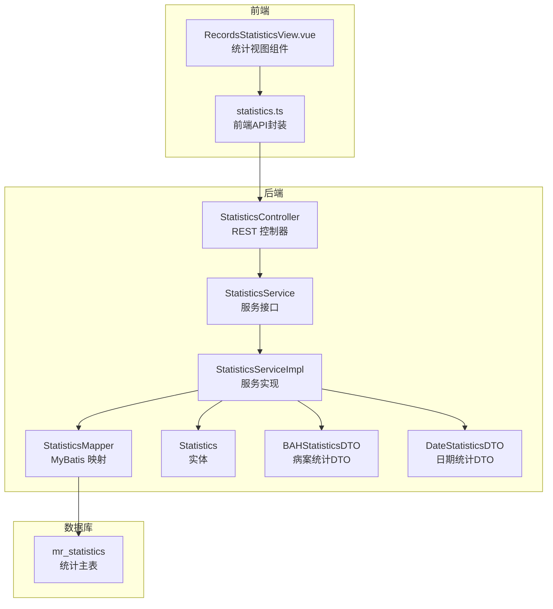
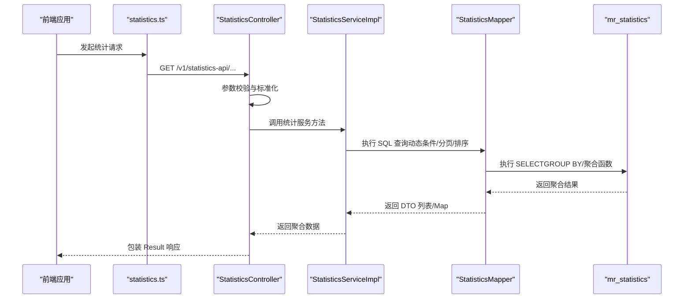
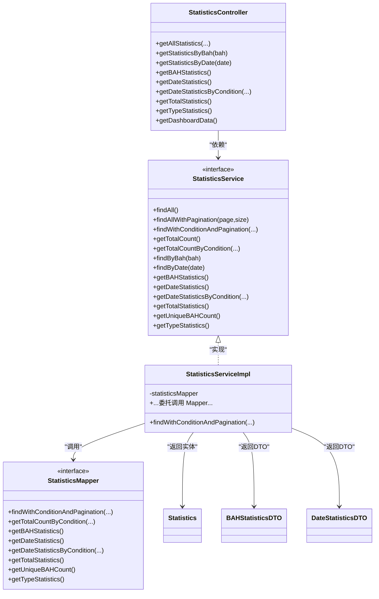

# 统计分析API

<cite>
**本文档引用的文件**
- [StatisticsController.java](file://backend-repo/src/main/java/com/zjcxph/imgapi/controller/StatisticsController.java)
- [StatisticsService.java](file://backend-repo/src/main/java/com/zjcxph/imgapi/service/StatisticsService.java)
- [StatisticsServiceImpl.java](file://backend-repo/src/main/java/com/zjcxph/imgapi/service/impl/StatisticsServiceImpl.java)
- [StatisticsMapper.java](file://backend-repo/src/main/java/com/zjcxph/imgapi/mapper/StatisticsMapper.java)
- [Statistics.java](file://backend-repo/src/main/java/com/zjcxph/imgapi/entity/Statistics.java)
- [BAHStatisticsDTO.java](file://backend-repo/src/main/java/com/zjcxph/imgapi/dto/resp/BAHStatisticsDTO.java)
- [DateStatisticsDTO.java](file://backend-repo/src/main/java/com/zjcxph/imgapi/dto/resp/DateStatisticsDTO.java)
- [schema.sql](file://mrr-db/schema.sql)
- [statistics.ts](file://frontend-repo/src/api/statistics.ts)
- [RecordsStatisticsView.vue](file://frontend-repo/src/components/admin/RecordsStatisticsView.vue)
- [StatisticsTest.java](file://backend-repo/src/test/java/com/zjcxph/imgapi/StatisticsTest.java)
</cite>

## 目录
1. [简介](#简介)
2. [项目结构](#项目结构)
3. [核心组件](#核心组件)
4. [架构概览](#架构概览)
5. [详细组件分析](#详细组件分析)
6. [依赖关系分析](#依赖关系分析)
7. [性能考量](#性能考量)
8. [故障排除指南](#故障排除指南)
9. [结论](#结论)
10. [附录](#附录)

## 简介
本文件为 MRR 病案统计分析 API 的详细技术文档，覆盖以下方面：
- 统计数据查询接口：按日期、类型、病案号等维度的查询与聚合
- 统计计算逻辑与聚合算法：分组统计、条件筛选、排序与分页
- 数据准确性保障：字段校验、边界值处理、日期格式规范化
- 历史数据统计、实时统计与报表生成：总体统计、趋势统计、类型分布
- 参数说明、时间范围设置与数据格式化：请求参数、响应结构、前端展示
- 缓存策略、性能优化与大数据量处理：分页限制、索引建议、SQL 优化
- 图表数据接口、导出功能与自定义统计模板：前端图表集成、可扩展性

## 项目结构
后端采用经典的三层架构（Controller-Service-Mapper），配合 MyBatis 注解映射 SQL，实体与 DTO 负责数据传输。

**图表来源**
- [StatisticsController.java:30-281](file://backend-repo/src/main/java/com/zjcxph/imgapi/controller/StatisticsController.java#L30-L281)
- [StatisticsService.java:10-56](file://backend-repo/src/main/java/com/zjcxph/imgapi/service/StatisticsService.java#L10-L56)
- [StatisticsServiceImpl.java:14-98](file://backend-repo/src/main/java/com/zjcxph/imgapi/service/impl/StatisticsServiceImpl.java#L14-L98)
- [StatisticsMapper.java:14-168](file://backend-repo/src/main/java/com/zjcxph/imgapi/mapper/StatisticsMapper.java#L14-L168)
- [Statistics.java:6-74](file://backend-repo/src/main/java/com/zjcxph/imgapi/entity/Statistics.java#L6-L74)
- [BAHStatisticsDTO.java:9-47](file://backend-repo/src/main/java/com/zjcxph/imgapi/dto/resp/BAHStatisticsDTO.java#L9-L47)
- [DateStatisticsDTO.java:9-47](file://backend-repo/src/main/java/com/zjcxph/imgapi/dto/resp/DateStatisticsDTO.java#L9-L47)
- [schema.sql:40-48](file://mrr-db/schema.sql#L40-L48)
- [statistics.ts:1-24](file://frontend-repo/src/api/statistics.ts#L1-L24)
- [RecordsStatisticsView.vue:1-800](file://frontend-repo/src/components/admin/RecordsStatisticsView.vue#L1-L800)

**章节来源**
- [StatisticsController.java:30-281](file://backend-repo/src/main/java/com/zjcxph/imgapi/controller/StatisticsController.java#L30-L281)
- [StatisticsService.java:10-56](file://backend-repo/src/main/java/com/zjcxph/imgapi/service/StatisticsService.java#L10-L56)
- [StatisticsServiceImpl.java:14-98](file://backend-repo/src/main/java/com/zjcxph/imgapi/service/impl/StatisticsServiceImpl.java#L14-L98)
- [StatisticsMapper.java:14-168](file://backend-repo/src/main/java/com/zjcxph/imgapi/mapper/StatisticsMapper.java#L14-L168)
- [schema.sql:40-48](file://mrr-db/schema.sql#L40-L48)

## 核心组件
- 控制器层：提供 REST 接口，负责参数解析、请求校验与响应封装
- 服务层：定义统计查询契约，协调 Mapper 完成复杂聚合
- 数据访问层：基于 MyBatis 注解编写 SQL，支持动态条件、分页与排序
- 实体与 DTO：Statistics 为原始记录实体；BAHStatisticsDTO/DateStatisticsDTO 为聚合统计结果
- 前端集成：通过 API 封装调用后端接口，并在视图组件中渲染图表与表格

**章节来源**
- [StatisticsController.java:43-281](file://backend-repo/src/main/java/com/zjcxph/imgapi/controller/StatisticsController.java#L43-L281)
- [StatisticsService.java:10-56](file://backend-repo/src/main/java/com/zjcxph/imgapi/service/StatisticsService.java#L10-L56)
- [StatisticsServiceImpl.java:14-98](file://backend-repo/src/main/java/com/zjcxph/imgapi/service/impl/StatisticsServiceImpl.java#L14-L98)
- [StatisticsMapper.java:14-168](file://backend-repo/src/main/java/com/zjcxph/imgapi/mapper/StatisticsMapper.java#L14-L168)
- [Statistics.java:6-74](file://backend-repo/src/main/java/com/zjcxph/imgapi/entity/Statistics.java#L6-L74)
- [BAHStatisticsDTO.java:9-47](file://backend-repo/src/main/java/com/zjcxph/imgapi/dto/resp/BAHStatisticsDTO.java#L9-L47)
- [DateStatisticsDTO.java:9-47](file://backend-repo/src/main/java/com/zjcxph/imgapi/dto/resp/DateStatisticsDTO.java#L9-L47)

## 架构概览
统计 API 的典型调用链路如下：

**图表来源**
- [statistics.ts:1-24](file://frontend-repo/src/api/statistics.ts#L1-L24)
- [StatisticsController.java:43-281](file://backend-repo/src/main/java/com/zjcxph/imgapi/controller/StatisticsController.java#L43-L281)
- [StatisticsServiceImpl.java:14-98](file://backend-repo/src/main/java/com/zjcxph/imgapi/service/impl/StatisticsServiceImpl.java#L14-L98)
- [StatisticsMapper.java:14-168](file://backend-repo/src/main/java/com/zjcxph/imgapi/mapper/StatisticsMapper.java#L14-L168)

## 详细组件分析

### 控制器层：StatisticsController
- 接口职责
  - 全量分页查询：支持关键字、类型、日期范围、排序字段与方向
  - 单字段查询：按病案号、按日期模糊匹配
  - 聚合统计：按病案号、按日期、按类型、总体统计、仪表盘
  - 条件统计：按日期范围与类型统计每日数据
- 关键参数
  - 分页：page（默认1）、size（默认100，上限1000）
  - 搜索：keyword（匹配 bah/cid/openerNo/date/type）、type、startDate、endDate
  - 排序：sortBy（bah/cid/openerNo/date/type/pages，默认date）、sortOrder（asc/desc）
- 响应封装：统一 Result 包裹，包含 list、total、page、size、totalPages、sortBy、sortOrder 等

**章节来源**
- [StatisticsController.java:43-281](file://backend-repo/src/main/java/com/zjcxph/imgapi/controller/StatisticsController.java#L43-L281)

### 服务层：StatisticsService 与 StatisticsServiceImpl
- 方法清单
  - 分页查询：findWithConditionAndPagination(...)
  - 总数统计：getTotalCount()/getTotalCountByCondition(...)
  - 单字段查询：findByBah(...)、findByDate(...)
  - 聚合统计：getBAHStatistics()、getDateStatistics()、getDateStatisticsByCondition(...)
  - 总体统计：getTotalStatistics()、getUniqueBAHCount()、getTypeStatistics()
- 实现模式：委托给 StatisticsMapper，保持服务层薄逻辑

**章节来源**
- [StatisticsService.java:10-56](file://backend-repo/src/main/java/com/zjcxph/imgapi/service/StatisticsService.java#L10-L56)
- [StatisticsServiceImpl.java:14-98](file://backend-repo/src/main/java/com/zjcxph/imgapi/service/impl/StatisticsServiceImpl.java#L14-L98)

### 数据访问层：StatisticsMapper
- SQL 特性
  - 动态 WHERE 条件：keyword 类型匹配、type 精确匹配、startDate/endDate 范围比较
  - 排序字段选择：支持 bah/cid/openerNo/date/type/pages，默认 date
  - 聚合查询：COUNT(*)、SUM(pages)、GROUP BY bah/date/type
  - 日期处理：对 date 字段进行替换处理以兼容不同格式
- 性能注意
  - 使用 LIMIT/OFFSET 实现分页
  - GROUP BY 与聚合函数在大数据量下需索引支撑

**章节来源**
- [StatisticsMapper.java:14-168](file://backend-repo/src/main/java/com/zjcxph/imgapi/mapper/StatisticsMapper.java#L14-L168)

### 实体与 DTO
- Statistics 实体：包含 bah、cid、openerNo、date、type、pages 等字段
- BAHStatisticsDTO：按病案号统计的 recordCount 与 totalPages
- DateStatisticsDTO：按日期统计的 recordCount 与 totalPages

**章节来源**
- [Statistics.java:6-74](file://backend-repo/src/main/java/com/zjcxph/imgapi/entity/Statistics.java#L6-L74)
- [BAHStatisticsDTO.java:9-47](file://backend-repo/src/main/java/com/zjcxph/imgapi/dto/resp/BAHStatisticsDTO.java#L9-L47)
- [DateStatisticsDTO.java:9-47](file://backend-repo/src/main/java/com/zjcxph/imgapi/dto/resp/DateStatisticsDTO.java#L9-L47)

### 前端集成
- API 封装：statistics.ts 提供 summary、date-summary、dashboard、列表查询等方法
- 视图组件：RecordsStatisticsView.vue 展示总览卡片、趋势图表、病案明细表格与分页
- 交互流程：组件发起请求 -> 获取聚合数据 -> 渲染图表与表格 -> 支持搜索、排序、分页

**章节来源**
- [statistics.ts:1-24](file://frontend-repo/src/api/statistics.ts#L1-L24)
- [RecordsStatisticsView.vue:1-800](file://frontend-repo/src/components/admin/RecordsStatisticsView.vue#L1-L800)

## 依赖关系分析

**图表来源**
- [StatisticsController.java:30-281](file://backend-repo/src/main/java/com/zjcxph/imgapi/controller/StatisticsController.java#L30-L281)
- [StatisticsService.java:10-56](file://backend-repo/src/main/java/com/zjcxph/imgapi/service/StatisticsService.java#L10-L56)
- [StatisticsServiceImpl.java:14-98](file://backend-repo/src/main/java/com/zjcxph/imgapi/service/impl/StatisticsServiceImpl.java#L14-L98)
- [StatisticsMapper.java:14-168](file://backend-repo/src/main/java/com/zjcxph/imgapi/mapper/StatisticsMapper.java#L14-L168)
- [Statistics.java:6-74](file://backend-repo/src/main/java/com/zjcxph/imgapi/entity/Statistics.java#L6-L74)
- [BAHStatisticsDTO.java:9-47](file://backend-repo/src/main/java/com/zjcxph/imgapi/dto/resp/BAHStatisticsDTO.java#L9-L47)
- [DateStatisticsDTO.java:9-47](file://backend-repo/src/main/java/com/zjcxph/imgapi/dto/resp/DateStatisticsDTO.java#L9-L47)

## 性能考量
- 分页与限制
  - 默认每页 100 条，最大 1000 条，避免一次性返回大量数据
  - 通过 LIMIT/OFFSET 实现分页，建议在高频查询场景下强制使用分页参数
- SQL 优化
  - 动态 WHERE 条件与 LIKE 模糊匹配可能影响索引使用，建议在高频字段建立合适索引
  - 日期范围查询使用替换函数处理格式，建议确保 date 字段格式一致性
- 聚合查询
  - GROUP BY + SUM/COUNT 在大表上需要索引与分区策略支撑，建议对 date、type、bah 建立复合索引
- 前端渲染
  - 图表数据量较大时启用横向滚动与动态宽度适配，避免 DOM 过载

[本节为通用性能指导，无需特定文件来源]

## 故障排除指南
- 常见问题
  - 参数非法：page/size 必须大于 0，否则返回错误
  - 日期格式：控制器内部对日期范围进行归一化处理，前端传入 YYYY-MM-DD 更稳妥
  - 数据缺失：空值字段（如 openerNo='NULL'）在前端展示时会转换为占位符
- 排查步骤
  - 后端：查看控制器日志与参数标准化逻辑
  - 数据库：确认 mr_statistics 表结构与索引是否存在
  - 前端：检查 API 请求参数与响应数据结构
- 单元测试参考
  - 提供了分页、条件统计、聚合统计、数据完整性等测试用例，便于定位问题

**章节来源**
- [StatisticsController.java:66-80](file://backend-repo/src/main/java/com/zjcxph/imgapi/controller/StatisticsController.java#L66-L80)
- [StatisticsTest.java:36-294](file://backend-repo/src/test/java/com/zjcxph/imgapi/StatisticsTest.java#L36-L294)

## 结论
该统计 API 采用清晰的分层设计，提供了全面的统计查询能力，涵盖历史数据与实时统计、聚合与明细、图表与报表。通过参数标准化、分页限制与聚合查询，兼顾了易用性与性能。建议在生产环境中配合合适的数据库索引与缓存策略，进一步提升查询效率与用户体验。

[本节为总结性内容，无需特定文件来源]

## 附录

### API 接口定义与参数说明
- 获取所有统计数据（分页+条件）
  - 方法：GET /v1/statistics-api
  - 参数：page（默认1）、size（默认100，上限1000）、keyword、type、startDate、endDate、sortBy（bah/cid/openerNo/date/type/pages，默认date）、sortOrder（asc/desc，默认desc）
  - 响应：list、total、page、size、totalPages、sortBy、sortOrder
- 根据病案号查询
  - 方法：GET /v1/statistics-api/bah/{bah}
  - 参数：bah（非空）
  - 响应：匹配记录列表
- 根据日期查询
  - 方法：GET /v1/statistics-api/date/{date}
  - 参数：date（非空，支持模糊匹配）
  - 响应：匹配记录列表
- 按病案号统计（记录数与总页数）
  - 方法：GET /v1/statistics-api/bah-summary
  - 响应：BAHStatisticsDTO 列表
- 按日期统计（记录数与总页数）
  - 方法：GET /v1/statistics-api/date-summary
  - 响应：DateStatisticsDTO 列表
- 按条件统计每日数据（日期范围+类型）
  - 方法：GET /v1/statistics-api/date-summary/condition
  - 参数：startDate（YYYY-MM-DD）、endDate（YYYY-MM-DD）、type
  - 响应：DateStatisticsDTO 列表
- 总体统计
  - 方法：GET /v1/statistics-api/summary
  - 响应：total（totalRecords、totalPages）、uniqueBAHCount、byType（按类型统计）
- 按类型统计
  - 方法：GET /v1/statistics-api/type-summary
  - 响应：按类型统计的列表
- 仪表盘数据
  - 方法：GET /v1/statistics-api/dashboard
  - 响应：overview（总体统计）、uniqueBAHCount、recentTrend（最近30天趋势）、topBAH（前10个病案号）

**章节来源**
- [StatisticsController.java:43-242](file://backend-repo/src/main/java/com/zjcxph/imgapi/controller/StatisticsController.java#L43-L242)

### 数据模型与字段说明
- mr_statistics 表字段
  - bah：病案号
  - cid：扫描设备ID
  - openerNo：扫描负责人
  - date：日期（字符串，可能包含斜杠）
  - type：类型
  - pages：页数
- 统计 DTO 字段
  - BAHStatisticsDTO：bah、recordCount、totalPages
  - DateStatisticsDTO：date、recordCount、totalPages

**章节来源**
- [schema.sql:40-48](file://mrr-db/schema.sql#L40-L48)
- [BAHStatisticsDTO.java:9-47](file://backend-repo/src/main/java/com/zjcxph/imgapi/dto/resp/BAHStatisticsDTO.java#L9-L47)
- [DateStatisticsDTO.java:9-47](file://backend-repo/src/main/java/com/zjcxph/imgapi/dto/resp/DateStatisticsDTO.java#L9-L47)

### 计算逻辑与聚合算法
- 分页与排序
  - offset = (page - 1) × size
  - 排序字段支持多列，日期字段进行格式替换以保证比较正确性
- 条件筛选
  - keyword 对多个字段进行 LIKE 匹配
  - type 精确匹配
  - startDate/endDate 使用替换后的日期进行范围比较
- 聚合统计
  - GROUP BY bah/date/type，COUNT(*) 计算记录数，SUM(pages) 计算总页数
- 仪表盘
  - 近期趋势：最近30天的每日统计
  - Top 病案号：按记录数取前10

**章节来源**
- [StatisticsController.java:160-242](file://backend-repo/src/main/java/com/zjcxph/imgapi/controller/StatisticsController.java#L160-L242)
- [StatisticsMapper.java:24-168](file://backend-repo/src/main/java/com/zjcxph/imgapi/mapper/StatisticsMapper.java#L24-L168)

### 前端图表与导出
- 图表数据接口
  - summary：总体统计
  - date-summary：每日统计
  - dashboard：仪表盘数据
  - 列表查询：支持关键字、类型、日期范围、排序与分页
- 导出与模板
  - 当前实现聚焦于数据展示与查询，未包含导出与自定义模板功能
  - 可通过前端将列表数据转为 CSV/Excel，或在后端新增导出接口

**章节来源**
- [statistics.ts:1-24](file://frontend-repo/src/api/statistics.ts#L1-L24)
- [RecordsStatisticsView.vue:1-800](file://frontend-repo/src/components/admin/RecordsStatisticsView.vue#L1-L800)

### 数据准确性保障
- 参数校验：非法 page/size 直接拒绝
- 字段校验：测试用例验证空病案号与负页数的处理
- 日期处理：统一替换格式并进行范围比较
- 唯一性统计：DISTINCT bah 计算唯一病案号数量

**章节来源**
- [StatisticsController.java:66-80](file://backend-repo/src/main/java/com/zjcxph/imgapi/controller/StatisticsController.java#L66-L80)
- [StatisticsTest.java:257-292](file://backend-repo/src/test/java/com/zjcxph/imgapi/StatisticsTest.java#L257-L292)