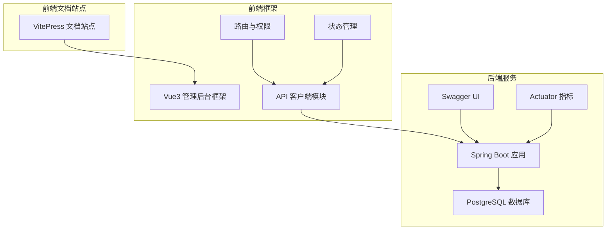
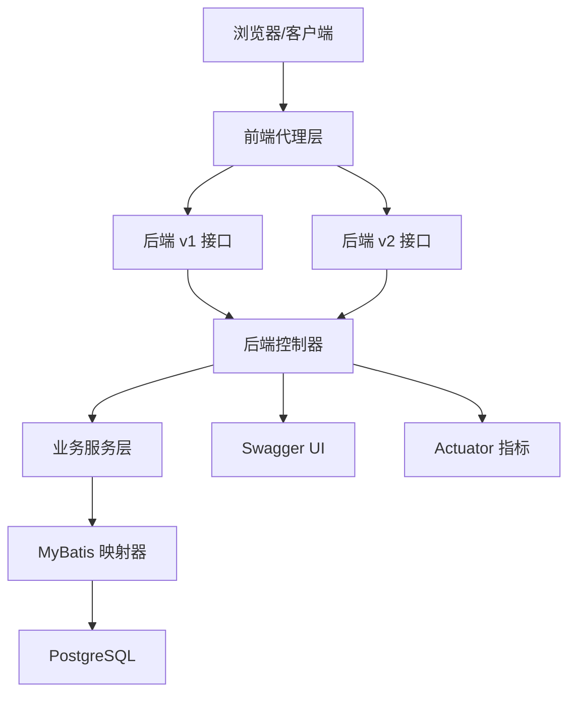
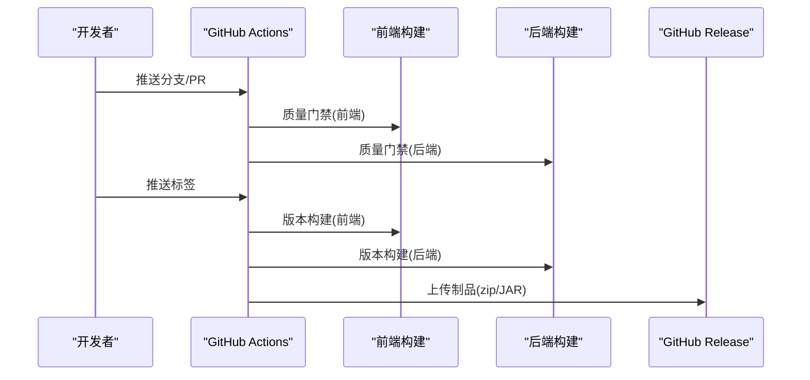
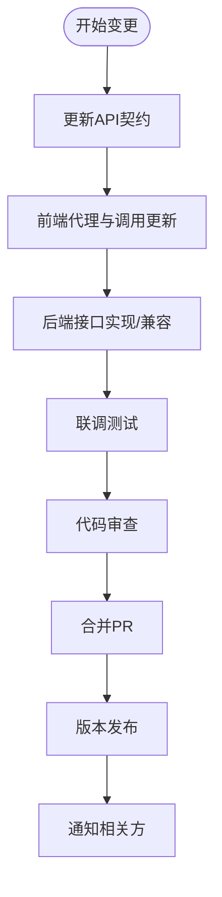
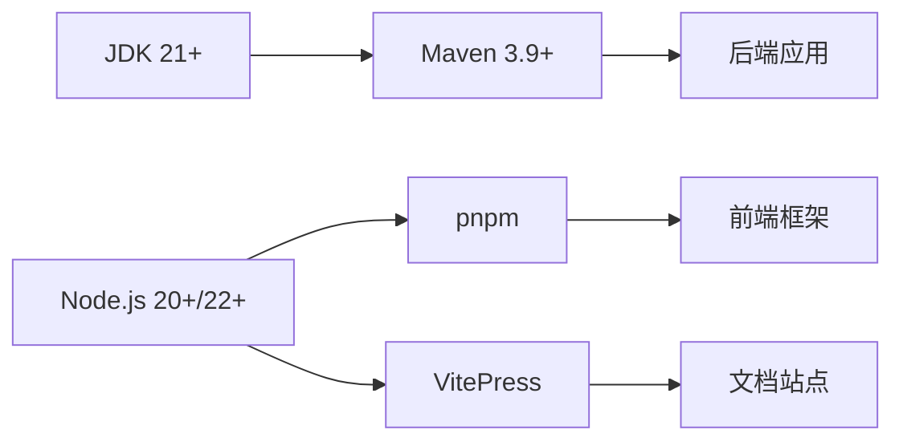
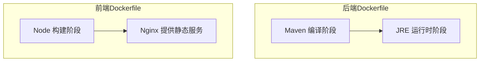
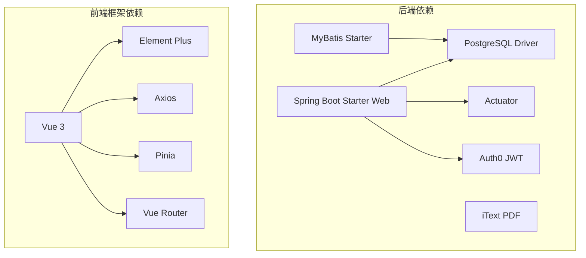

# 开发流程

<cite>
**本文引用的文件**
- [API契约.md](file://backend-repo/API_CONTRACT.md)
- [后端说明.md](file://backend-repo/README.md)
- [前端说明.md](file://frontend-fantastic-admin/README.md)
- [质量门禁工作流.yml](file://.github/workflows/quality-gate.yml)
- [版本构建工作流.yml](file://.github/workflows/version-build.yml)
- [后端pom.xml](file://backend-repo/pom.xml)
- [前端包配置.json](file://frontend-fantastic-admin/package.json)
- [前端vite配置.ts](file://frontend-fantastic-admin/vite.config.ts)
- [前端仓库包配置.json](file://frontend-repo/package.json)
- [前端仓库vite配置.ts](file://frontend-repo/vite.config.ts)
- [后端应用配置.properties](file://backend-repo/src/main/resources/application.properties)
- [后端Dockerfile](file://backend-repo/Dockerfile)
- [前端仓库Dockerfile](file://frontend-repo/Dockerfile)
- [后端.gitignore](file://backend-repo/.gitignore)
- [前端.gitignore](file://frontend-fantastic-admin/.gitignore)
- [前端仓库.gitignore](file://frontend-repo/.gitignore)
</cite>

## 目录
1. [引言](#引言)
2. [项目结构](#项目结构)
3. [核心组件](#核心组件)
4. [架构总览](#架构总览)
5. [详细组件分析](#详细组件分析)
6. [依赖关系分析](#依赖关系分析)
7. [性能考虑](#性能考虑)
8. [故障排查指南](#故障排查指南)
9. [结论](#结论)
10. [附录](#附录)

## 引言
本文件为MRR项目的完整开发流程文档，面向后端与前端团队，涵盖Git工作流、分支策略、合并规范、代码审查流程、PR模板与合并检查清单、版本控制规范与提交消息格式、标签管理策略、CI/CD流水线配置、自动化测试与部署流程、API契约管理与前后端协作规范、接口变更流程、开发环境搭建、依赖管理与构建配置、问题跟踪与需求管理、发布计划制定以及协作工具使用与沟通规范。

## 项目结构
MRR采用前后端分离架构，包含三个主要子项目：
- 后端服务：Spring Boot 4 + MyBatis + PostgreSQL，提供认证、权限、检索、统计、日志与系统监控等接口。
- 前端框架：Vue3管理后台框架，提供可复用UI组件、权限体系与多场景布局。
- 前端文档站点：基于VitePress的文档与演示站点，包含功能说明与设计规范。

**图表来源**
- [后端说明.md:1-57](file://backend-repo/README.md#L1-L57)
- [前端说明.md:1-134](file://frontend-fantastic-admin/README.md#L1-L134)
- [前端仓库vite配置.ts:69-87](file://frontend-repo/vite.config.ts#L69-L87)

**章节来源**
- [后端说明.md:1-57](file://backend-repo/README.md#L1-L57)
- [前端说明.md:1-134](file://frontend-fantastic-admin/README.md#L1-L134)

## 核心组件
- 后端应用：提供REST接口、全局异常处理、拦截器、定时任务与健康检查端点。
- 前端框架：提供统一的UI组件库、路由守卫、权限校验、状态管理与主题系统。
- 文档站点：提供项目说明、功能演示、系统监控与日志功能说明等文档。

**章节来源**
- [后端说明.md:47-56](file://backend-repo/README.md#L47-L56)
- [前端说明.md:22-33](file://frontend-fantastic-admin/README.md#L22-L33)

## 架构总览
MRR采用前后端分离架构，前端通过代理将请求转发至后端对应版本路径，后端提供统一的REST API与Swagger文档，数据库为PostgreSQL，应用通过Actuator暴露指标。

**图表来源**
- [API契约.md:5-9](file://backend-repo/API_CONTRACT.md#L5-L9)
- [后端应用配置.properties:35-38](file://backend-repo/src/main/resources/application.properties#L35-L38)

## 详细组件分析

### Git 工作流与分支策略
- 分支命名规范
  - 功能分支：feature/功能名称
  - 修复分支：fix/问题描述
  - 发布分支：release/版本号
  - 热修复分支：hotfix/紧急修复
- 合并策略
  - 使用squash merge合并PR，保证提交历史整洁
  - 合并前必须通过质量门禁与代码审查
- 提交消息格式
  - 类型(scope): 描述
  - 示例：feat(auth): 添加用户登录接口
- 标签管理
  - 语义化版本：v主.次.修订
  - 发布标签触发CI构建与制品上传

**章节来源**
- [.github工作流/质量门禁工作流.yml:1-54](file://.github/workflows/quality-gate.yml#L1-L54)
- [.github工作流/版本构建工作流.yml:1-102](file://.github/workflows/version-build.yml#L1-L102)

### 代码审查流程与PR模板
- PR模板建议字段
  - 摘要、变更内容、影响范围、测试要点、风险评估、回滚预案
- 审查要点
  - 代码风格与安全
  - 性能与可扩展性
  - API一致性与契约变更
  - 测试覆盖率与回归测试
- 合并检查清单
  - 通过质量门禁
  - 代码审查通过
  - API契约更新
  - 文档同步更新
  - 自动化测试通过

**章节来源**
- [.github工作流/质量门禁工作流.yml:1-54](file://.github/workflows/quality-gate.yml#L1-L54)
- [API契约.md:1-44](file://backend-repo/API_CONTRACT.md#L1-L44)

### CI/CD流水线配置
- 质量门禁工作流
  - 前端：安装依赖、代码检查、构建
  - 后端：安装Java、编译打包（跳过测试）
- 版本构建工作流
  - 前端：安装依赖、构建、上传制品
  - 后端：编译打包、上传JAR制品
  - 发布阶段：下载制品、打包前端静态资源、上传GitHub Release

**图表来源**
- [.github工作流/质量门禁工作流.yml:10-54](file://.github/workflows/quality-gate.yml#L10-L54)
- [.github工作流/版本构建工作流.yml:15-102](file://.github/workflows/version-build.yml#L15-L102)

**章节来源**
- [.github工作流/质量门禁工作流.yml:1-54](file://.github/workflows/quality-gate.yml#L1-L54)
- [.github工作流/版本构建工作流.yml:1-102](file://.github/workflows/version-build.yml#L1-L102)

### API契约管理与前后端协作
- 契约映射
  - 前端代理规则：/api/* → 后端/v1/*；/searchApi/* → 后端/v2/*；/loginApi → 后端/login
- 接口清单
  - 认证：POST /login
  - 图像：GET/PUT /v1/img-api/*
  - 检索：GET /v2/search/*
  - 扫描：GET/PUT/DELETE/POST /v1/scan-api/*
- 变更流程
  - 在API契约文件中同步记录新增/修改接口
  - 前端根据契约调整代理与调用逻辑
  - 后端提供兼容性支持与迁移指引

**图表来源**
- [API契约.md:5-44](file://backend-repo/API_CONTRACT.md#L5-L44)

**章节来源**
- [API契约.md:1-44](file://backend-repo/API_CONTRACT.md#L1-L44)
- [前端仓库vite配置.ts:69-87](file://frontend-repo/vite.config.ts#L69-L87)

### 开发环境搭建与依赖管理
- 后端
  - 环境要求：JDK 21+、Maven 3.9+、PostgreSQL 15+
  - 启动方式：Maven打包或直接运行Spring Boot主类
  - 关键配置：端口、数据库连接、图像服务参数、AES密钥
- 前端框架
  - 环境要求：Node.js 20.19+ 或 22.12+
  - 包管理：pnpm
  - 构建命令：dev/build/lint
- 前端文档站点
  - 环境要求：Node.js
  - 构建命令：docs:dev/docs:build

**图表来源**
- [后端说明.md:5-21](file://backend-repo/README.md#L5-L21)
- [后端应用配置.properties:1-49](file://backend-repo/src/main/resources/application.properties#L1-L49)
- [前端包配置.json:5-7](file://frontend-fantastic-admin/package.json#L5-L7)
- [前端仓库包配置.json:1-63](file://frontend-repo/package.json#L1-L63)

**章节来源**
- [后端说明.md:5-21](file://backend-repo/README.md#L5-L21)
- [后端应用配置.properties:1-49](file://backend-repo/src/main/resources/application.properties#L1-L49)
- [前端包配置.json:5-7](file://frontend-fantastic-admin/package.json#L5-L7)
- [前端仓库包配置.json:1-63](file://frontend-repo/package.json#L1-L63)

### 构建配置与Docker化
- 后端
  - 多阶段构建：Maven基础镜像编译，Temurin JRE运行时
  - 暴露端口：18045
- 前端文档站点
  - 多阶段构建：Node构建，Nginx提供静态服务
  - 暴露端口：80

**图表来源**
- [后端Dockerfile:1-16](file://backend-repo/Dockerfile#L1-L16)
- [前端仓库Dockerfile:1-18](file://frontend-repo/Dockerfile#L1-L18)

**章节来源**
- [后端Dockerfile:1-16](file://backend-repo/Dockerfile#L1-L16)
- [前端仓库Dockerfile:1-18](file://frontend-repo/Dockerfile#L1-L18)

### 自动化测试与质量门禁
- 质量门禁
  - 前端：lint、build
  - 后端：编译打包（跳过测试）
- 建议增强
  - 后端增加集成测试与单元测试执行
  - 前端增加类型检查与样式检查

**章节来源**
- [.github工作流/质量门禁工作流.yml:10-54](file://.github/workflows/quality-gate.yml#L10-L54)

### 问题跟踪、需求管理与发布计划
- 问题跟踪
  - 使用GitHub Issues进行缺陷与任务跟踪
  - 标签：bug、enhancement、documentation、help wanted
- 需求管理
  - 使用Projects进行迭代规划
  - 将需求拆分为任务卡片并分配优先级
- 发布计划
  - 里程碑：按季度/功能模块划分
  - 发布节奏：每周迭代，月度发布候选版本

[本节为通用实践指导，无需特定文件引用]

### 协作工具使用与沟通规范
- 代码评审
  - PR必须至少一名审查者同意
  - 审查者关注安全性、性能与一致性
- 沟通渠道
  - Slack/钉钉群组用于日常沟通
  - 重要决策记录在项目Wiki
- 文档同步
  - API契约、架构文档、开发指南保持同步更新

[本节为通用实践指导，无需特定文件引用]

## 依赖关系分析

**图表来源**
- [后端pom.xml:27-114](file://backend-repo/pom.xml#L27-L114)
- [前端包配置.json:27-60](file://frontend-fantastic-admin/package.json#L27-L60)

**章节来源**
- [后端pom.xml:27-114](file://backend-repo/pom.xml#L27-L114)
- [前端包配置.json:27-60](file://frontend-fantastic-admin/package.json#L27-L60)

## 性能考虑
- 后端
  - 连接池参数可调：最大池大小、空闲超时、最大生命周期
  - 启用响应压缩与静态资源缓存
  - Actuator暴露指标便于性能监控
- 前端
  - 代码分割与懒加载，优化首屏加载
  - 构建目标针对现代浏览器，减少polyfill体积

**章节来源**
- [后端应用配置.properties:1-49](file://backend-repo/src/main/resources/application.properties#L1-L49)
- [前端仓库vite配置.ts:39-56](file://frontend-repo/vite.config.ts#L39-L56)

## 故障排查指南
- 后端常见问题
  - 数据库连接失败：检查DataSource配置与网络连通性
  - 启动失败：查看日志文件与端口占用
  - 权限不足：确认图像服务凭据与路径配置
- 前端常见问题
  - 代理不生效：确认代理规则与目标地址
  - 构建失败：检查Node版本与依赖安装
- CI/CD问题
  - 质量门禁失败：修复lint错误与构建问题
  - 发布失败：检查制品上传与Release权限

**章节来源**
- [后端说明.md:11-21](file://backend-repo/README.md#L11-L21)
- [后端应用配置.properties:1-49](file://backend-repo/src/main/resources/application.properties#L1-L49)
- [前端仓库vite配置.ts:69-87](file://frontend-repo/vite.config.ts#L69-L87)
- [.github工作流/质量门禁工作流.yml:10-54](file://.github/workflows/quality-gate.yml#L10-L54)

## 结论
本开发流程文档为MRR项目提供了从代码提交到发布的全链路规范，明确了前后端协作、API契约、CI/CD与运维的关键实践。建议团队在实际执行中持续完善测试与文档，确保交付质量与协作效率。

## 附录
- 版本与许可证信息
  - 后端版本：见pom.xml
  - 前端框架版本：见package.json
  - 许可证：参见前端说明文档中的开源协议声明

**章节来源**
- [后端pom.xml:14-16](file://backend-repo/pom.xml#L14-L16)
- [前端包配置.json:1-131](file://frontend-fantastic-admin/package.json#L1-L131)
- [前端说明.md:17-20](file://frontend-fantastic-admin/README.md#L17-L20)