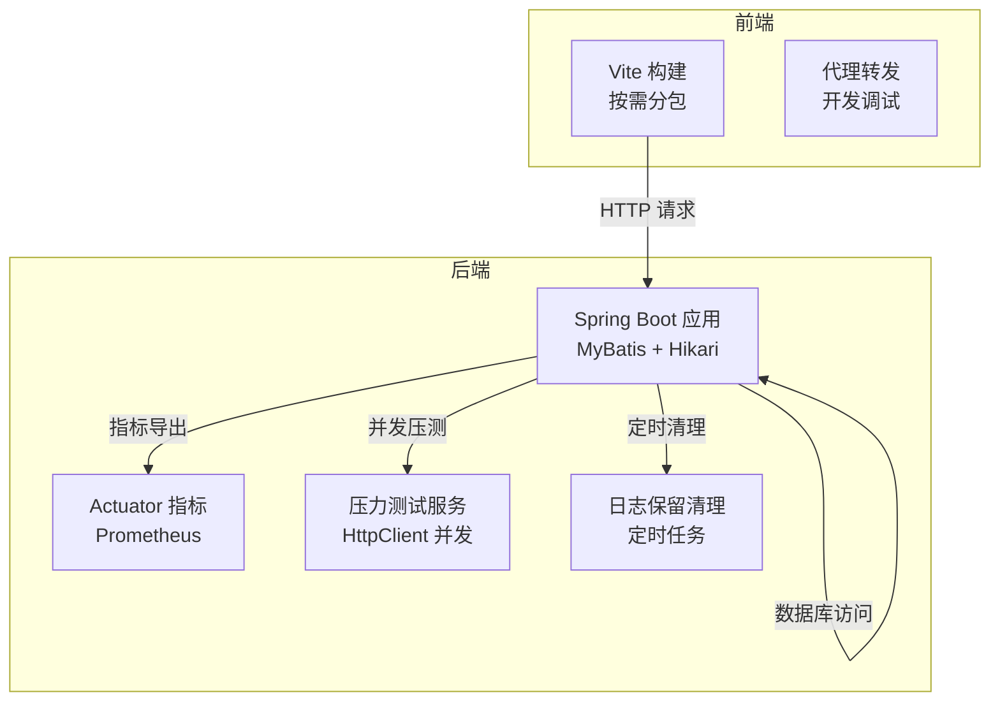
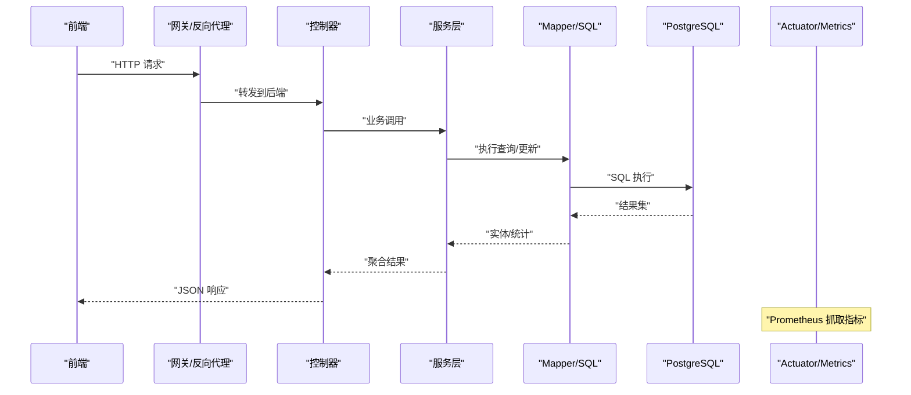
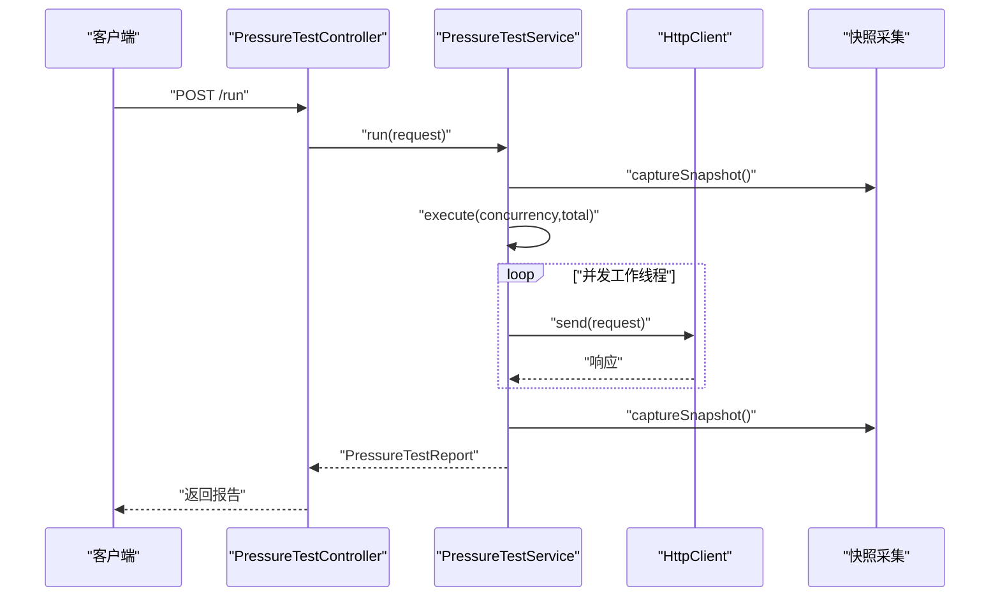
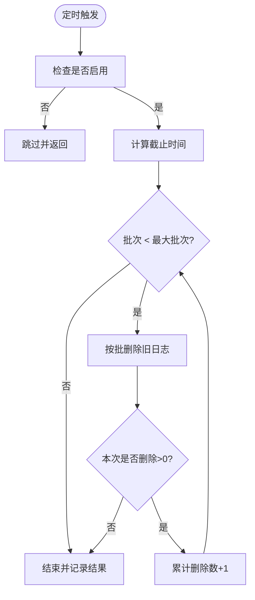
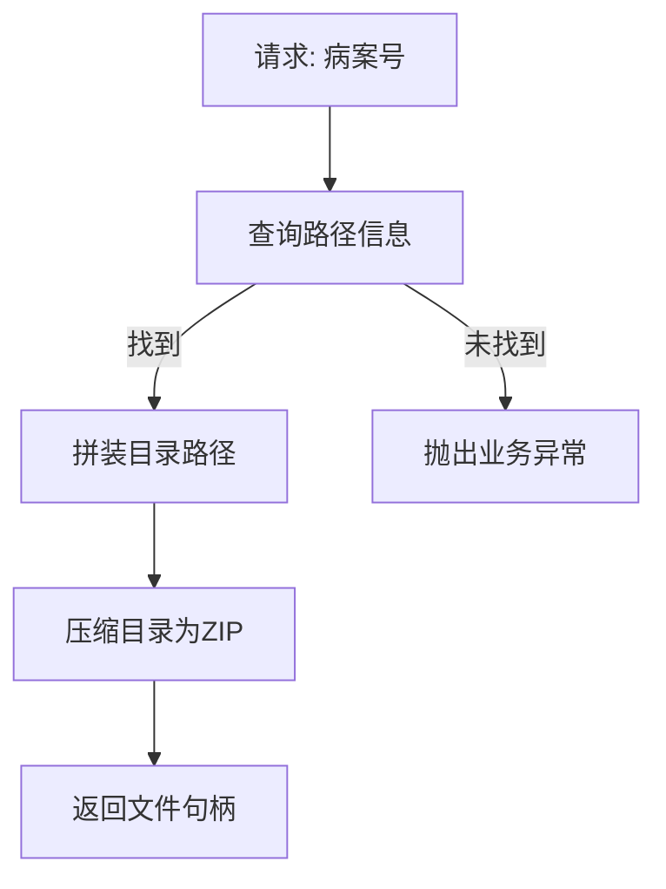
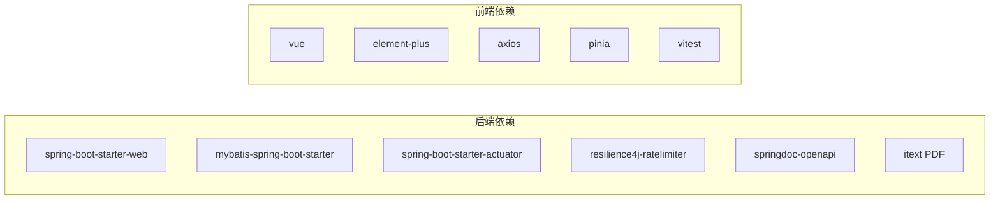

# 性能优化

<cite>
**本文引用的文件**
- [application.properties](file://backend-repo/src/main/resources/application.properties)
- [pom.xml](file://backend-repo/pom.xml)
- [WebConfig.java](file://backend-repo/src/main/java/com/zjcxph/imgapi/config/WebConfig.java)
- [ImageProperties.java](file://backend-repo/src/main/java/com/zjcxph/imgapi/config/ImageProperties.java)
- [LogRetentionProperties.java](file://backend-repo/src/main/java/com/zjcxph/imgapi/config/LogRetentionProperties.java)
- [PressureTestService.java](file://backend-repo/src/main/java/com/zjcxph/imgapi/monitoring/PressureTestService.java)
- [PressureTestController.java](file://backend-repo/src/main/java/com/zjcxph/imgapi/controller/PressureTestController.java)
- [LogRetentionCleaner.java](file://backend-repo/src/main/java/com/zjcxph/imgapi/scheduler/LogRetentionCleaner.java)
- [ScanServiceImpl.java](file://backend-repo/src/main/java/com/zjcxph/imgapi/service/impl/ScanServiceImpl.java)
- [SearchServiceImpl.java](file://backend-repo/src/main/java/com/zjcxph/imgapi/service/impl/SearchServiceImpl.java)
- [vite.config.ts（fantastic-admin）](file://frontend-fantastic-admin/vite.config.ts)
- [package.json（fantastic-admin）](file://frontend-fantastic-admin/package.json)
- [vite.config.ts（repo）](file://frontend-repo/vite.config.ts)
- [package.json（repo）](file://frontend-repo/package.json)
</cite>

## 目录
1. [简介](#简介)
2. [项目结构](#项目结构)
3. [核心组件](#核心组件)
4. [架构总览](#架构总览)
5. [详细组件分析](#详细组件分析)
6. [依赖分析](#依赖分析)
7. [性能考虑](#性能考虑)
8. [故障排查指南](#故障排查指南)
9. [结论](#结论)
10. [附录](#附录)

## 简介
本指南面向MRR项目的开发者与运维人员，围绕Spring Boot后端与Vue前端的性能优化展开，覆盖JVM参数建议、线程池与连接池配置、MyBatis查询与缓存、批量处理、前端懒加载与打包优化、压力测试与监控、日志与临时文件清理、网络与CDN策略以及常见性能问题排查方法。内容基于仓库现有实现与配置进行提炼，并提供可落地的优化建议。

## 项目结构
- 后端采用Spring Boot 4.0.3 + MyBatis，使用Hikari连接池，默认暴露Actuator指标，支持Prometheus。
- 前端包含两个仓库：fantastic-admin（管理端）与repo（文档/展示），均使用Vite构建，具备代理、分包与按需插件能力。
- 后端内置压力测试服务与日志保留清理调度器，便于压测与长期运行时的资源治理。

**图表来源**
- [application.properties:1-49](file://backend-repo/src/main/resources/application.properties#L1-L49)
- [pom.xml:1-136](file://backend-repo/pom.xml#L1-L136)
- [PressureTestService.java:1-293](file://backend-repo/src/main/java/com/zjcxph/imgapi/monitoring/PressureTestService.java#L1-L293)
- [LogRetentionCleaner.java:1-119](file://backend-repo/src/main/java/com/zjcxph/imgapi/scheduler/LogRetentionCleaner.java#L1-L119)
- [vite.config.ts（fantastic-admin）:1-64](file://frontend-fantastic-admin/vite.config.ts#L1-L64)
- [vite.config.ts（repo）:1-90](file://frontend-repo/vite.config.ts#L1-L90)

**章节来源**
- [application.properties:1-49](file://backend-repo/src/main/resources/application.properties#L1-L49)
- [pom.xml:1-136](file://backend-repo/pom.xml#L1-L136)

## 核心组件
- 运行时与资源缓存：启用响应压缩、静态资源缓存控制，降低带宽占用。
- 数据源与连接池：Hikari默认池大小、空闲超时、最大存活时间等参数可按负载调优。
- 日志与清理：日志轮转大小限制；日志保留策略通过属性与定时任务控制，避免无限增长。
- 压力测试：内置并发压测服务，支持自定义并发度、请求数、超时与头部，输出成功率、延迟分布与吞吐。
- 前端构建：Vite按模块拆分vendor块，减少重复依赖体积；开发代理简化跨域与联调。

**章节来源**
- [application.properties:1-49](file://backend-repo/src/main/resources/application.properties#L1-L49)
- [LogRetentionProperties.java:1-54](file://backend-repo/src/main/java/com/zjcxph/imgapi/config/LogRetentionProperties.java#L1-L54)
- [LogRetentionCleaner.java:1-119](file://backend-repo/src/main/java/com/zjcxph/imgapi/scheduler/LogRetentionCleaner.java#L1-L119)
- [PressureTestService.java:1-293](file://backend-repo/src/main/java/com/zjcxph/imgapi/monitoring/PressureTestService.java#L1-L293)
- [vite.config.ts（fantastic-admin）:1-64](file://frontend-fantastic-admin/vite.config.ts#L1-L64)
- [vite.config.ts（repo）:1-90](file://frontend-repo/vite.config.ts#L1-L90)

## 架构总览
后端通过Web层接收请求，经拦截器链路校验与日志记录，业务层调用Mapper执行数据库操作，Actuator暴露指标供Prometheus抓取。前端通过Vite开发服务器与代理联调，生产环境打包分包并开启压缩。

**图表来源**
- [WebConfig.java:1-61](file://backend-repo/src/main/java/com/zjcxph/imgapi/config/WebConfig.java#L1-L61)
- [application.properties:35-39](file://backend-repo/src/main/resources/application.properties#L35-L39)
- [pom.xml:87-88](file://backend-repo/pom.xml#L87-L88)

## 详细组件分析

### 后端：压力测试服务与接口
- 压测服务使用固定大小线程池并发发起HTTP请求，统计成功数、失败数、最小/平均/95分位/最大延迟与吞吐，采集JVM堆内存与系统负载快照，形成报告并维护历史上限。
- 控制器提供运行、历史、最新、按ID查询与清空历史接口，便于集成压测流程与结果查看。

**图表来源**
- [PressureTestController.java:1-73](file://backend-repo/src/main/java/com/zjcxph/imgapi/controller/PressureTestController.java#L1-L73)
- [PressureTestService.java:1-293](file://backend-repo/src/main/java/com/zjcxph/imgapi/monitoring/PressureTestService.java#L1-L293)

**章节来源**
- [PressureTestController.java:1-73](file://backend-repo/src/main/java/com/zjcxph/imgapi/controller/PressureTestController.java#L1-L73)
- [PressureTestService.java:1-293](file://backend-repo/src/main/java/com/zjcxph/imgapi/monitoring/PressureTestService.java#L1-L293)

### 后端：日志保留清理
- 定时任务根据配置的cron表达式与保留天数定期清理过期访问日志，支持批大小与每轮最大批次限制，避免单次删除造成抖动。
- 清理过程记录删除总数、剩余条数、批次数与最终消息，异常时回滚状态并记录错误。

**图表来源**
- [LogRetentionCleaner.java:1-119](file://backend-repo/src/main/java/com/zjcxph/imgapi/scheduler/LogRetentionCleaner.java#L1-L119)
- [LogRetentionProperties.java:1-54](file://backend-repo/src/main/java/com/zjcxph/imgapi/config/LogRetentionProperties.java#L1-L54)

**章节来源**
- [LogRetentionCleaner.java:1-119](file://backend-repo/src/main/java/com/zjcxph/imgapi/scheduler/LogRetentionCleaner.java#L1-L119)
- [LogRetentionProperties.java:1-54](file://backend-repo/src/main/java/com/zjcxph/imgapi/config/LogRetentionProperties.java#L1-L54)

### 后端：图像扫描与打包
- 服务根据病案号定位图片目录，生成ZIP临时文件用于下载，涉及磁盘IO与压缩，注意临时目录权限与空间。
- 提供分页查询与条件查询接口，便于前端分页与筛选。

**图表来源**
- [ScanServiceImpl.java:1-135](file://backend-repo/src/main/java/com/zjcxph/imgapi/service/impl/ScanServiceImpl.java#L1-L135)

**章节来源**
- [ScanServiceImpl.java:1-135](file://backend-repo/src/main/java/com/zjcxph/imgapi/service/impl/ScanServiceImpl.java#L1-L135)

### 后端：搜索服务
- 提供按身份证号查询病案号列表的能力，底层由SearchMapper执行SQL。

**章节来源**
- [SearchServiceImpl.java:1-26](file://backend-repo/src/main/java/com/zjcxph/imgapi/service/impl/SearchServiceImpl.java#L1-L26)

### 前端：构建与代理
- fantastic-admin与repo均使用Vite，前者侧重管理端UI，后者为文档/展示站点。
- 配置了开发代理、别名、CSS预处理全局资源注入、构建产物输出与分包策略，有助于提升开发体验与生产体积控制。

**章节来源**
- [vite.config.ts（fantastic-admin）:1-64](file://frontend-fantastic-admin/vite.config.ts#L1-L64)
- [vite.config.ts（repo）:1-90](file://frontend-repo/vite.config.ts#L1-L90)

## 依赖分析
- 后端依赖Spring Web、MyBatis Starter、Actuator、Resilience4j限流、OpenAPI文档、PDF库等，构建阶段使用spring-boot-maven-plugin重打包。
- 前端依赖Vue 3、Element Plus、Axios、Pinia、Vitest等，构建目标针对现代浏览器，具备自动导入与组件解析能力。

**图表来源**
- [pom.xml:27-114](file://backend-repo/pom.xml#L27-L114)
- [package.json（fantastic-admin）:27-61](file://frontend-fantastic-admin/package.json#L27-L61)
- [package.json（repo）:25-40](file://frontend-repo/package.json#L25-L40)

**章节来源**
- [pom.xml:1-136](file://backend-repo/pom.xml#L1-L136)
- [package.json（fantastic-admin）:1-131](file://frontend-fantastic-admin/package.json#L1-L131)
- [package.json（repo）:1-63](file://frontend-repo/package.json#L1-L63)

## 性能考虑

### JVM 参数配置建议
- 建议在容器或进程启动时设置合适的堆大小与GC策略，结合Prometheus指标观察堆使用率、晋升失败与Full GC频率，动态调整-Xms/-Xmx与并行/并发GC参数。
- 对于高并发场景，可考虑增大线程池核心/最大线程数与队列容量，但需与CPU核数、IO瓶颈匹配，避免过度上下文切换。

### 线程池优化
- 压测服务使用固定大小线程池，建议根据CPU核数与请求类型（CPU密集/IO密集）分别配置不同线程池，避免共享线程池互相影响。
- 对于外部HTTP调用，可引入有界队列与拒绝策略，防止突发流量导致内存膨胀。

### 数据库连接池设置
- Hikari连接池参数可按以下维度优化：
  - 最大池大小：根据峰值并发与数据库最大连接数上限评估。
  - 最小空闲：维持一定空闲连接以降低冷启动开销。
  - 连接超时：缩短等待可用连接的时间，避免请求堆积。
  - 空闲超时与最大生存时间：平衡连接复用与资源回收。
- 建议开启慢查询日志与连接池指标，结合数据库侧监控定位热点SQL与锁等待。

### MyBatis 查询优化、缓存与批量
- 查询优化
  - 使用分页参数与必要索引，避免SELECT *与JOIN过多列。
  - 将频繁条件下推至SQL，减少Java侧二次过滤。
- 缓存策略
  - 开启二级缓存（如Ehcache/Redis）并合理设置TTL与失效策略，避免脏读。
  - 对只读报表类数据优先走缓存，写少读多场景收益显著。
- 批量操作
  - 使用批处理插入/更新，减少网络往返与事务提交次数。
  - 分批大小建议从100~1000递增测试，结合数据库最大包大小与事务日志性能确定最优值。

### 前端性能优化
- 组件懒加载
  - 路由级懒加载与组件级动态导入，减少首屏JS体积。
- 图片压缩与格式优化
  - 使用WebP/JPEG2000等现代格式，按设备像素比选择分辨率，对缩略图进行裁剪与压缩。
- 资源打包优化
  - 利用Vite的manualChunks策略将第三方库拆分为独立chunk，结合CDN分发常用库。
  - 生产构建开启压缩与Tree Shaking，移除未使用代码。
- 代理与跨域
  - 开发环境通过代理统一转发，避免浏览器跨域限制；生产环境由网关/Nginx处理CORS与缓存头。

### 压力测试执行与监控
- 执行步骤
  - 通过控制器接口提交压测请求，指定目标URL、方法、并发度、总请求数、超时与请求头。
  - 观察历史报告中的成功率、延迟分布与吞吐，定位瓶颈点（CPU/IO/数据库/网络）。
- 监控指标
  - Actuator暴露健康、指标与Prometheus端点，关注JVM堆、线程、GC、HTTP请求速率与响应时间。
  - 结合数据库慢查询日志与连接池指标，定位热点表与索引缺失。

### 日志清理策略与临时文件管理
- 访问日志清理
  - 通过定时任务按保留天数与批大小清理过期日志，避免单次删除过大造成抖动。
- 临时文件管理
  - 打包生成的临时文件需定期清理，避免磁盘占满；建议在CI/CD中加入清理步骤。
- 存储优化
  - 图片归档与压缩策略配合冷热分层存储，降低热数据占用。

### 网络请求优化、CDN与静态资源缓存
- CDN配置
  - 将静态资源（JS/CSS/图片）接入CDN，设置长缓存与版本化命名，结合回源缓存头提升命中率。
- 缓存策略
  - 合理设置Cache-Control与ETag/Last-Modified，区分公共资源与私有资源。
- 压缩与传输
  - 启用Gzip/Brotli压缩，优先使用HTTP/2或HTTP/3，减少TLS握手与队头阻塞。

### 性能分析工具与问题排查
- 工具推荐
  - 后端：JProfiler/Async Profiler、Micrometer+Prometheus+Grafana、慢查询分析器。
  - 前端：Chrome DevTools Performance/Network/Lighthouse、Webpack Bundle Analyzer。
- 排查思路
  - 从前端Network面板定位慢请求与重定向，再回到后端对应接口分析SQL与线程池使用。
  - 关注GC停顿、连接池耗尽、数据库锁等待与外部依赖超时。

## 故障排查指南
- 压测失败或延迟过高
  - 检查并发度与线程池配置，确认目标接口限流策略与数据库连接池饱和情况。
  - 查看压测报告中的失败原因与95分位延迟，定位具体环节。
- 日志清理未生效
  - 确认开关与Cron表达式、保留天数、批大小与每轮最大批次配置是否正确。
  - 检查数据库权限与删除语句执行计划。
- 前端白屏或资源加载失败
  - 检查代理配置与构建输出目录，确认CDN缓存是否命中新版本。
  - 使用Network面板查看404/5xx与重定向链路。

**章节来源**
- [PressureTestService.java:1-293](file://backend-repo/src/main/java/com/zjcxph/imgapi/monitoring/PressureTestService.java#L1-L293)
- [LogRetentionCleaner.java:1-119](file://backend-repo/src/main/java/com/zjcxph/imgapi/scheduler/LogRetentionCleaner.java#L1-L119)
- [vite.config.ts（fantastic-admin）:1-64](file://frontend-fantastic-admin/vite.config.ts#L1-L64)
- [vite.config.ts（repo）:1-90](file://frontend-repo/vite.config.ts#L1-L90)

## 结论
通过对运行时配置、连接池、压测与监控、日志清理、前端构建与CDN策略的系统性优化，MRR项目可在高并发与大数据量场景下保持稳定与高效。建议将上述优化纳入CI/CD质量门禁与发布流程，持续观测关键指标并迭代调参。

## 附录

### 关键配置清单（后端）
- 服务器端口、压缩与静态资源缓存控制
- 数据源URL、用户名、密码、驱动与Hikari池参数
- Actuator暴露端点与健康详情
- 日志保留开关、Cron、保留天数、批大小与每轮最大批次
- 图像服务基础路径与凭证

**章节来源**
- [application.properties:1-49](file://backend-repo/src/main/resources/application.properties#L1-L49)
- [ImageProperties.java:1-45](file://backend-repo/src/main/java/com/zjcxph/imgapi/config/ImageProperties.java#L1-L45)

### 关键配置清单（前端）
- Vite开发服务器、代理与别名
- 构建输出目录与Source Map开关
- 插件与自动导入、组件解析
- 浏览器目标与Rollup分包策略

**章节来源**
- [vite.config.ts（fantastic-admin）:1-64](file://frontend-fantastic-admin/vite.config.ts#L1-L64)
- [vite.config.ts（repo）:1-90](file://frontend-repo/vite.config.ts#L1-L90)