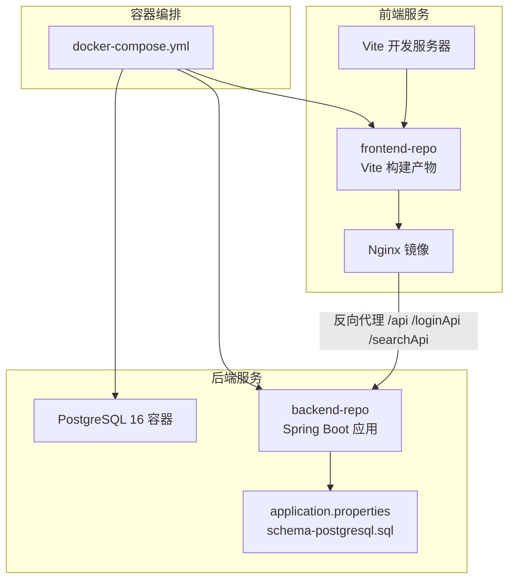
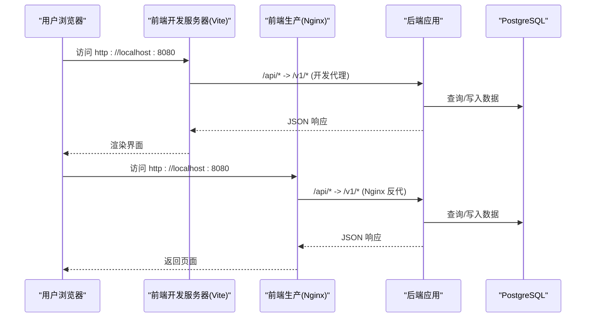
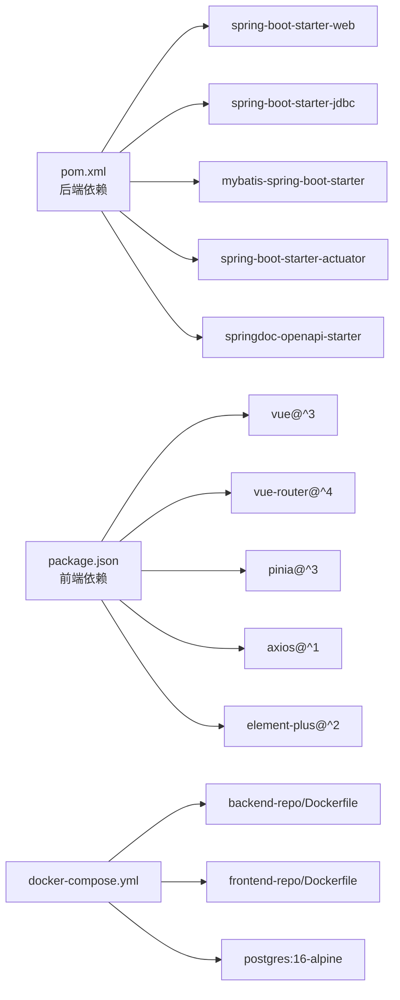

# 快速开始

<cite>
**本文引用的文件**
- [README.md](file://backend-repo/README.md)
- [docker-compose.yml](file://docker-compose.yml)
- [Dockerfile（后端）](file://backend-repo/Dockerfile)
- [Dockerfile（前端）](file://frontend-repo/Dockerfile)
- [pom.xml](file://backend-repo/pom.xml)
- [package.json（前端）](file://frontend-repo/package.json)
- [application.properties](file://backend-repo/src/main/resources/application.properties)
- [application-local.example.properties](file://backend-repo/src/main/resources/application-local.example.properties)
- [schema-postgresql.sql](file://backend-repo/src/main/resources/schema-postgresql.sql)
- [reset-br-admin-password.sql](file://backend-repo/src/main/resources/reset-br-admin-password.sql)
- [nginx.conf（前端镜像）](file://frontend-repo/nginx.conf)
- [vite.config.ts（前端开发服务器）](file://frontend-repo/vite.config.ts)
- [ImageApiApplication.java](file://backend-repo/src/main/java/com/zjcxph/imgapi/ImageApiApplication.java)
- [WebConfig.java](file://backend-repo/src/main/java/com/zjcxph/imgapi/config/WebConfig.java)
- [SwaggerConfig.java](file://backend-repo/src/main/java/com/zjcxph/imgapi/config/SwaggerConfig.java)
- [schema.sql（mrr-db）](file://mrr-db/schema.sql)
</cite>

## 目录
1. [简介](#简介)
2. [项目结构](#项目结构)
3. [核心组件](#核心组件)
4. [架构总览](#架构总览)
5. [详细组件分析](#详细组件分析)
6. [依赖关系分析](#依赖关系分析)
7. [性能注意事项](#性能注意事项)
8. [故障排查指南](#故障排查指南)
9. [结论](#结论)
10. [附录](#附录)

## 简介
本指南面向新手开发者，帮助你在约 30 分钟内完成 MRR 系统的环境搭建与首次运行验证。内容覆盖：
- 前置条件检查
- 依赖安装
- 数据库配置
- Docker 一键部署与本地开发环境配置
- 启动流程与健康检查
- 首次运行后的管理员账户创建、系统初始化与基础功能验证
- 常见问题与解决方案

## 项目结构
MRR 采用前后端分离架构，后端基于 Spring Boot 4 + MyBatis + PostgreSQL，前端基于 Vue 3 + Vite + Nginx 镜像。系统通过 docker-compose 编排 PostgreSQL、后端、前端三个服务。

图表来源
- [docker-compose.yml](file://docker-compose.yml)
- [Dockerfile（后端）](file://backend-repo/Dockerfile)
- [Dockerfile（前端）](file://frontend-repo/Dockerfile)
- [application.properties](file://backend-repo/src/main/resources/application.properties)
- [schema-postgresql.sql](file://backend-repo/src/main/resources/schema-postgresql.sql)
- [nginx.conf（前端镜像）](file://frontend-repo/nginx.conf)
- [vite.config.ts（前端开发服务器）](file://frontend-repo/vite.config.ts)

章节来源
- [README.md](file://backend-repo/README.md)
- [docker-compose.yml](file://docker-compose.yml)

## 核心组件
- 后端应用：Spring Boot 4，MyBatis 访问 PostgreSQL，提供认证、权限、病案/影像查询、统计、日志与系统监控接口。
- 前端应用：Vue 3 + Vite，打包后由 Nginx 提供静态资源与 API 反向代理。
- 数据库：PostgreSQL 15+，初始化脚本自动创建 schema、表与默认角色/用户。
- 运维：Docker 镜像与 docker-compose 编排，简化部署与扩展。

章节来源
- [README.md](file://backend-repo/README.md)
- [pom.xml](file://backend-repo/pom.xml)
- [package.json（前端）](file://frontend-repo/package.json)

## 架构总览
下图展示从浏览器到后端 API 的典型请求路径，以及前端开发与生产模式的差异。

图表来源
- [vite.config.ts（前端开发服务器）](file://frontend-repo/vite.config.ts)
- [nginx.conf（前端镜像）](file://frontend-repo/nginx.conf)
- [application.properties](file://backend-repo/src/main/resources/application.properties)

## 详细组件分析

### 环境准备与前置条件
- 操作系统：Windows/Linux/macOS（建议 Linux）
- 软件要求：
  - Docker Engine 与 Docker Compose
  - JDK 21（用于本地开发）
  - Maven 3.9+（用于本地开发）
  - PostgreSQL 15+（用于本地开发）

章节来源
- [README.md](file://backend-repo/README.md)

### Docker 一键部署（推荐）
1) 准备工作
- 确保 Docker 已安装并运行。
- 在仓库根目录执行编排文件。

2) 启动命令
- 使用 docker-compose 启动全部服务：
  - docker compose up -d
- 查看服务状态：
  - docker compose ps
- 查看日志：
  - docker compose logs -f backend
  - docker compose logs -f frontend
  - docker compose logs -f postgres

3) 访问地址
- 前端：http://localhost:8080
- Swagger UI：http://localhost:8045/v1/swagger-ui/index.html
- 健康检查：http://localhost:8045/actuator/health

4) 停止与清理
- 停止：docker compose down
- 停止并删除数据卷：docker compose down -v

章节来源
- [docker-compose.yml](file://docker-compose.yml)
- [Dockerfile（后端）](file://backend-repo/Dockerfile)
- [Dockerfile（前端）](file://frontend-repo/Dockerfile)
- [README.md](file://backend-repo/README.md)

### 本地开发环境配置（非 Docker）
1) 数据库准备
- 安装 PostgreSQL 15+ 并创建数据库与用户。
- 确保数据库可访问，并能执行 schema 初始化脚本。

2) 配置文件
- 复制后端配置示例为本地配置文件：
  - 将 application-local.example.properties 重命名为 application-local.properties
  - 在本地调整数据库连接、图像服务凭据等参数
- 后端默认配置参考：
  - 端口、数据源、日志、图像凭据、AES 密钥等

3) 启动后端
- 方式一：Maven 打包后运行
  - mvn -DskipTests package
  - java -jar backend-repo/target/*.jar --spring.profiles.active=local
- 方式二：直接运行主类
  - com.zjcxph.imgapi.ImageApiApplication

4) 启动前端（开发模式）
- 安装 Node.js 22 与包管理工具
- 安装依赖并启动开发服务器：
  - npm install
  - npm run dev
- 访问 http://localhost:8080

章节来源
- [application-local.example.properties](file://backend-repo/src/main/resources/application-local.example.properties)
- [application.properties](file://backend-repo/src/main/resources/application.properties)
- [ImageApiApplication.java](file://backend-repo/src/main/java/com/zjcxph/imgapi/ImageApiApplication.java)
- [pom.xml](file://backend-repo/pom.xml)
- [package.json（前端）](file://frontend-repo/package.json)
- [vite.config.ts（前端开发服务器）](file://frontend-repo/vite.config.ts)

### 数据库初始化与系统初始化
- 自动初始化
  - 后端启动时会自动执行 PostgreSQL 初始化脚本，创建 app schema、业务表、权限表与默认种子数据。
- 默认管理员
  - 用户名：br_admin
  - 初始密码：br_password
  - 如需重置密码，可执行重置脚本。

章节来源
- [schema-postgresql.sql](file://backend-repo/src/main/resources/schema-postgresql.sql)
- [reset-br-admin-password.sql](file://backend-repo/src/main/resources/reset-br-admin-password.sql)
- [README.md](file://backend-repo/README.md)

### 首次运行后的基本操作
1) 登录系统
- 使用默认管理员账户登录后台管理界面。
- 登录成功后，建议立即修改管理员密码。

2) 系统初始化
- 验证 Swagger 接口文档可用性。
- 通过健康检查接口确认后端服务正常。
- 在前端页面进行基础功能验证（如搜索、统计、日志查看）。

3) 权限与角色
- 根据需要创建新用户与分配角色。
- 验证不同角色的功能权限边界。

章节来源
- [README.md](file://backend-repo/README.md)
- [schema-postgresql.sql](file://backend-repo/src/main/resources/schema-postgresql.sql)

### API 访问与代理规则
- 前端开发模式下，Vite 代理将 /api、/loginApi、/searchApi 请求转发至后端对应路径。
- 生产模式下，Nginx 镜像将相同路径反向代理到后端。

章节来源
- [vite.config.ts（前端开发服务器）](file://frontend-repo/vite.config.ts)
- [nginx.conf（前端镜像）](file://frontend-repo/nginx.conf)

### 安全与认证
- 后端启用拦截器链，统一处理登录、授权与访问日志。
- Swagger 配置了基于 JWT 的安全方案，请求头需携带 Bearer Token。

章节来源
- [WebConfig.java](file://backend-repo/src/main/java/com/zjcxph/imgapi/config/WebConfig.java)
- [SwaggerConfig.java](file://backend-repo/src/main/java/com/zjcxph/imgapi/config/SwaggerConfig.java)

## 依赖关系分析

图表来源
- [pom.xml](file://backend-repo/pom.xml)
- [package.json（前端）](file://frontend-repo/package.json)
- [docker-compose.yml](file://docker-compose.yml)
- [Dockerfile（后端）](file://backend-repo/Dockerfile)
- [Dockerfile（前端）](file://frontend-repo/Dockerfile)

章节来源
- [pom.xml](file://backend-repo/pom.xml)
- [package.json（前端）](file://frontend-repo/package.json)
- [docker-compose.yml](file://docker-compose.yml)

## 性能注意事项
- 数据库连接池：后端配置了 HikariCP 的最大池大小、最小空闲、连接超时等参数，可根据并发需求调整。
- 压缩与缓存：后端启用了响应压缩与静态资源缓存策略，提升传输效率。
- 日志保留：提供可配置的日志清理任务，避免历史日志占用磁盘空间。
- 前端构建：Vite 构建时按依赖拆分代码块，减少首屏加载时间。

章节来源
- [application.properties](file://backend-repo/src/main/resources/application.properties)
- [pom.xml](file://backend-repo/pom.xml)
- [package.json（前端）](file://frontend-repo/package.json)

## 故障排查指南
- 数据库无法连接
  - 检查环境变量与配置文件中的数据库 URL、用户名、密码是否正确。
  - 确认 PostgreSQL 容器已健康启动。
- 启动失败或端口冲突
  - 修改后端端口或停止占用端口的进程。
  - 检查 docker-compose 映射端口是否冲突。
- Swagger 无法访问或鉴权失败
  - 确认已登录并获取有效 JWT Token。
  - 按 Swagger 文档在请求头添加 Authorization: Bearer {token}。
- 前端开发代理无效
  - 确认 Vite 开发服务器已启动且未报错。
  - 检查 /api、/loginApi、/searchApi 的代理规则是否匹配后端路径。
- 前端静态资源 404
  - 确认 Nginx 镜像已构建并运行。
  - 检查 /usr/share/nginx/html 下是否存在构建产物。

章节来源
- [docker-compose.yml](file://docker-compose.yml)
- [application.properties](file://backend-repo/src/main/resources/application.properties)
- [vite.config.ts（前端开发服务器）](file://frontend-repo/vite.config.ts)
- [nginx.conf（前端镜像）](file://frontend-repo/nginx.conf)
- [SwaggerConfig.java](file://backend-repo/src/main/java/com/zjcxph/imgapi/config/SwaggerConfig.java)

## 结论
通过本指南，你可以在 30 分钟内完成 MRR 系统的环境搭建与首次运行验证。建议优先使用 Docker 一键部署以降低环境差异带来的问题；在需要调试或二次开发时，再切换到本地开发模式。后续可结合 Swagger 文档与默认管理员账户进行更深入的功能探索。

## 附录

### A. 常用命令清单
- 启动：docker compose up -d
- 停止：docker compose down
- 查看日志：docker compose logs -f backend
- 进入容器：docker compose exec backend bash
- 重新构建镜像：docker compose build --no-cache

章节来源
- [docker-compose.yml](file://docker-compose.yml)

### B. 配置文件要点
- 后端配置
  - 端口、数据源、图像服务凭据、AES 密钥、日志保留策略等
- 前端配置
  - 开发代理目标、构建输出、依赖拆分策略

章节来源
- [application.properties](file://backend-repo/src/main/resources/application.properties)
- [application-local.example.properties](file://backend-repo/src/main/resources/application-local.example.properties)
- [vite.config.ts（前端开发服务器）](file://frontend-repo/vite.config.ts)

### C. 数据模型概览
- 关键表：mr_scan、mr_patient、mr_statistics、mr_user、mr_auth_role、mr_auth_user、access_log
- 关系：用户与角色关联、扫描记录与患者关联、统计与类型日期索引等

章节来源
- [schema-postgresql.sql](file://backend-repo/src/main/resources/schema-postgresql.sql)
- [schema.sql（mrr-db）](file://mrr-db/schema.sql)