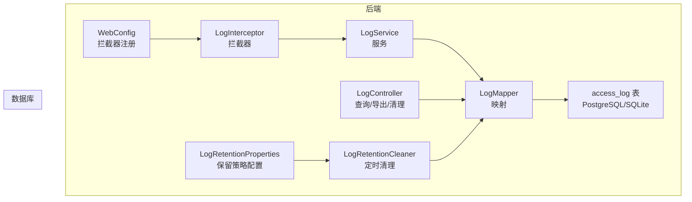
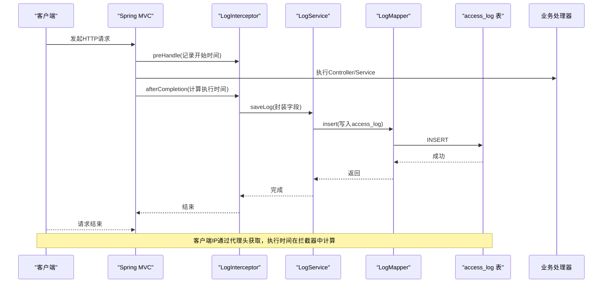
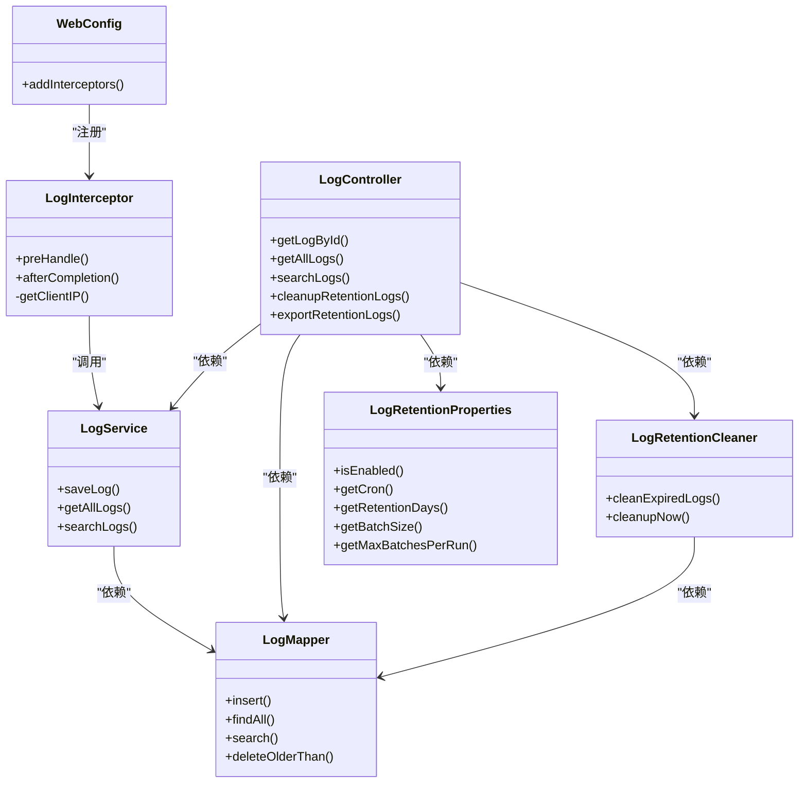

# 审计日志表

<cite>
**本文引用的文件**
- [schema.sql](file://mrr-db/schema.sql)
- [schema-postgresql.sql](file://backend-repo/src/main/resources/schema-postgresql.sql)
- [Log.java](file://backend-repo/src/main/java/com/zjcxph/imgapi/entity/Log.java)
- [LogMapper.java](file://backend-repo/src/main/java/com/zjcxph/imgapi/mapper/LogMapper.java)
- [LogServiceImpl.java](file://backend-repo/src/main/java/com/zjcxph/imgapi/service/impl/LogServiceImpl.java)
- [LogInterceptor.java](file://backend-repo/src/main/java/com/zjcxph/imgapi/interceptors/LogInterceptor.java)
- [LogController.java](file://backend-repo/src/main/java/com/zjcxph/imgapi/controller/LogController.java)
- [LogRetentionCleaner.java](file://backend-repo/src/main/java/com/zjcxph/imgapi/scheduler/LogRetentionCleaner.java)
- [LogRetentionProperties.java](file://backend-repo/src/main/java/com/zjcxph/imgapi/config/LogRetentionProperties.java)
- [application.properties](file://backend-repo/src/main/resources/application.properties)
- [WebConfig.java](file://backend-repo/src/main/java/com/zjcxph/imgapi/config/WebConfig.java)
</cite>

## 目录
1. [简介](#简介)
2. [项目结构](#项目结构)
3. [核心组件](#核心组件)
4. [架构总览](#架构总览)
5. [详细组件分析](#详细组件分析)
6. [依赖分析](#依赖分析)
7. [性能考虑](#性能考虑)
8. [故障排查指南](#故障排查指南)
9. [结论](#结论)
10. [附录](#附录)

## 简介
本文件面向MRR系统的审计日志表（access_log）进行完整数据模型说明，重点覆盖以下方面：
- 设计目的：记录客户端访问行为，支撑安全审计、性能分析、合规留存与运营监控。
- 字段含义：逐项解释客户端IP追踪、请求URI记录、HTTP方法分类、响应状态码、执行时间统计等关键字段。
- 采集机制：拦截器在请求完成后收集信息并异步入库，避免阻塞主业务流程。
- 存储格式：PostgreSQL与SQLite两种部署形态下的建表语句与字段类型差异。
- 查询优化：基于字段的查询接口、分页与搜索条件组合。
- 清理策略：基于保留天数的定时清理与批量删除，支持导出过期日志。
- 性能影响：写入路径的异步化、查询路径的索引建议与分页限制。
- 安全审计场景：异常访问识别、高风险URI追踪、跨域来源与UA分析。
- 数据分析示例与监控告警配置指导：基于字段的统计口径与阈值建议。

## 项目结构
围绕审计日志的核心模块由“实体-映射-服务-拦截器-控制器-调度器-配置”构成，形成从请求到落库再到查询与清理的闭环。

图表来源
- [LogInterceptor.java:16-89](file://backend-repo/src/main/java/com/zjcxph/imgapi/interceptors/LogInterceptor.java#L16-L89)
- [LogServiceImpl.java:11-70](file://backend-repo/src/main/java/com/zjcxph/imgapi/service/impl/LogServiceImpl.java#L11-L70)
- [LogMapper.java:9-165](file://backend-repo/src/main/java/com/zjcxph/imgapi/mapper/LogMapper.java#L9-L165)
- [LogController.java:32-244](file://backend-repo/src/main/java/com/zjcxph/imgapi/controller/LogController.java#L32-L244)
- [LogRetentionCleaner.java:13-118](file://backend-repo/src/main/java/com/zjcxph/imgapi/scheduler/LogRetentionCleaner.java#L13-L118)
- [LogRetentionProperties.java:5-53](file://backend-repo/src/main/java/com/zjcxph/imgapi/config/LogRetentionProperties.java#L5-L53)
- [WebConfig.java:11-59](file://backend-repo/src/main/java/com/zjcxph/imgapi/config/WebConfig.java#L11-L59)

章节来源
- [LogInterceptor.java:16-89](file://backend-repo/src/main/java/com/zjcxph/imgapi/interceptors/LogInterceptor.java#L16-L89)
- [LogServiceImpl.java:11-70](file://backend-repo/src/main/java/com/zjcxph/imgapi/service/impl/LogServiceImpl.java#L11-L70)
- [LogMapper.java:9-165](file://backend-repo/src/main/java/com/zjcxph/imgapi/mapper/LogMapper.java#L9-L165)
- [LogController.java:32-244](file://backend-repo/src/main/java/com/zjcxph/imgapi/controller/LogController.java#L32-L244)
- [LogRetentionCleaner.java:13-118](file://backend-repo/src/main/java/com/zjcxph/imgapi/scheduler/LogRetentionCleaner.java#L13-L118)
- [LogRetentionProperties.java:5-53](file://backend-repo/src/main/java/com/zjcxph/imgapi/config/LogRetentionProperties.java#L5-L53)
- [WebConfig.java:11-59](file://backend-repo/src/main/java/com/zjcxph/imgapi/config/WebConfig.java#L11-L59)

## 核心组件
- 实体对象：封装access_log字段，便于服务层与映射层传递。
- 映射接口：定义插入、查询、搜索、清理与统计等SQL操作。
- 服务实现：封装分页、搜索与计数逻辑，屏蔽分页偏移计算。
- 拦截器：在请求完成后采集客户端IP、URI、方法、UA、状态码、执行时间等，并持久化。
- 控制器：提供按ID、按IP、按URI、全文/条件搜索、清理与导出过期日志等接口。
- 调度器：按配置的Cron定时清理过期日志，支持批量删除与剩余量统计。
- 配置类：集中管理日志保留策略参数（启用、Cron、保留天数、批大小、每轮最大批次）。

章节来源
- [Log.java:7-19](file://backend-repo/src/main/java/com/zjcxph/imgapi/entity/Log.java#L7-L19)
- [LogMapper.java:12-165](file://backend-repo/src/main/java/com/zjcxph/imgapi/mapper/LogMapper.java#L12-L165)
- [LogServiceImpl.java:17-69](file://backend-repo/src/main/java/com/zjcxph/imgapi/service/impl/LogServiceImpl.java#L17-L69)
- [LogInterceptor.java:21-58](file://backend-repo/src/main/java/com/zjcxph/imgapi/interceptors/LogInterceptor.java#L21-L58)
- [LogController.java:56-202](file://backend-repo/src/main/java/com/zjcxph/imgapi/controller/LogController.java#L56-L202)
- [LogRetentionCleaner.java:26-117](file://backend-repo/src/main/java/com/zjcxph/imgapi/scheduler/LogRetentionCleaner.java#L26-L117)
- [LogRetentionProperties.java:8-52](file://backend-repo/src/main/java/com/zjcxph/imgapi/config/LogRetentionProperties.java#L8-L52)

## 架构总览
下图展示一次典型请求的审计日志采集与查询路径。

图表来源
- [LogInterceptor.java:21-58](file://backend-repo/src/main/java/com/zjcxph/imgapi/interceptors/LogInterceptor.java#L21-L58)
- [LogServiceImpl.java:17-20](file://backend-repo/src/main/java/com/zjcxph/imgapi/service/impl/LogServiceImpl.java#L17-L20)
- [LogMapper.java:24-27](file://backend-repo/src/main/java/com/zjcxph/imgapi/mapper/LogMapper.java#L24-L27)
- [LogController.java:56-202](file://backend-repo/src/main/java/com/zjcxph/imgapi/controller/LogController.java#L56-L202)

## 详细组件分析

### 数据模型设计与字段说明
- 表名：access_log（PostgreSQL与SQLite分别位于不同schema/sql文件）
- 主键：自增ID
- 关键字段：
  - 客户端IP：client_ip
  - 请求URI：request_uri
  - HTTP方法：method
  - 用户代理：user_agent
  - 访问时间：access_time
  - 查询字符串：query_string
  - 请求体：request_body（当前拦截器未填充）
  - 响应状态码：response_status
  - 执行时间（毫秒）：execute_time
  - 来源页：referer

字段与实体映射一致性验证
- 实体类Log的字段与映射层BASE_COLUMNS一致，确保ORM映射正确。

章节来源
- [schema.sql:1-14](file://mrr-db/schema.sql#L1-L14)
- [schema-postgresql.sql:61-73](file://backend-repo/src/main/resources/schema-postgresql.sql#L61-L73)
- [Log.java:10-19](file://backend-repo/src/main/java/com/zjcxph/imgapi/entity/Log.java#L10-L19)
- [LogMapper.java:12-22](file://backend-repo/src/main/java/com/zjcxph/imgapi/mapper/LogMapper.java#L12-L22)

### 客户端IP追踪机制
- 优先级：X-Forwarded-For -> X-Real-IP -> 远端地址
- 作用：支持反向代理/负载均衡环境下的真实客户端识别
- 注意：当存在多个IP时，取第一个有效值；生产环境需确保代理正确设置头部

章节来源
- [LogInterceptor.java:79-88](file://backend-repo/src/main/java/com/zjcxph/imgapi/interceptors/LogInterceptor.java#L79-L88)

### 请求URI记录与HTTP方法分类
- URI：request_uri，用于定位访问资源
- 方法：method，区分GET/POST/PUT/DELETE/OPTIONS等
- 用途：配合搜索接口可按URI或方法过滤

章节来源
- [LogInterceptor.java:46-53](file://backend-repo/src/main/java/com/zjcxph/imgapi/interceptors/LogInterceptor.java#L46-L53)
- [LogMapper.java:32-36](file://backend-repo/src/main/java/com/zjcxph/imgapi/mapper/LogMapper.java#L32-L36)

### 响应状态码与执行时间统计
- 状态码：response_status，字符串形式，便于模糊匹配（如以“4”开头表示客户端错误）
- 执行时间：execute_time（毫秒），在afterCompletion阶段计算
- 用途：性能分析、错误定位、SLA监控

章节来源
- [LogInterceptor.java:42-54](file://backend-repo/src/main/java/com/zjcxph/imgapi/interceptors/LogInterceptor.java#L42-L54)
- [LogController.java:150-202](file://backend-repo/src/main/java/com/zjcxph/imgapi/controller/LogController.java#L150-L202)

### 日志采集机制与存储格式
- 采集时机：请求完成后（afterCompletion），避免阻塞业务线程
- 存储格式：
  - PostgreSQL：字段类型与约束见schema-postgresql.sql
  - SQLite：字段类型与约束见schema.sql
- 写入路径：LogService.saveLog -> LogMapper.insert -> access_log

章节来源
- [LogInterceptor.java:37-58](file://backend-repo/src/main/java/com/zjcxph/imgapi/interceptors/LogInterceptor.java#L37-L58)
- [LogServiceImpl.java:17-20](file://backend-repo/src/main/java/com/zjcxph/imgapi/service/impl/LogServiceImpl.java#L17-L20)
- [LogMapper.java:24-27](file://backend-repo/src/main/java/com/zjcxph/imgapi/mapper/LogMapper.java#L24-L27)
- [schema-postgresql.sql:61-73](file://backend-repo/src/main/resources/schema-postgresql.sql#L61-L73)
- [schema.sql:1-14](file://mrr-db/schema.sql#L1-L14)

### 查询接口与优化要点
- 分页查询：按access_time倒序，支持limit/offset
- 条件查询：按client_ip、request_uri、method、response_status范围匹配
- 全文搜索：对多个字段进行LIKE匹配
- 计数接口：支持按条件统计总数，避免重复扫描
- 优化建议：
  - 在access_time上建立索引以提升排序与范围查询性能
  - 对高频查询字段（如client_ip、request_uri、method）建立二级索引
  - 使用分页参数上限（MAX_PAGE_SIZE）防止超大分页
  - 合理使用条件过滤，减少LIKE通配符前缀导致的索引失效

章节来源
- [LogServiceImpl.java:28-69](file://backend-repo/src/main/java/com/zjcxph/imgapi/service/impl/LogServiceImpl.java#L28-L69)
- [LogMapper.java:29-165](file://backend-repo/src/main/java/com/zjcxph/imgapi/mapper/LogMapper.java#L29-L165)
- [LogController.java:65-202](file://backend-repo/src/main/java/com/zjcxph/imgapi/controller/LogController.java#L65-L202)

### 日志清理策略与导出
- 定时清理：基于Cron表达式定期执行，按保留天数计算截止时间
- 批量删除：分批次删除，避免单次事务过大
- 导出过期日志：按保留天数筛选，输出CSV文件，便于离线归档
- 配置项：启用开关、Cron、保留天数、批大小、每轮最大批次

章节来源
- [LogRetentionCleaner.java:26-117](file://backend-repo/src/main/java/com/zjcxph/imgapi/scheduler/LogRetentionCleaner.java#L26-L117)
- [LogController.java:108-148](file://backend-repo/src/main/java/com/zjcxph/imgapi/controller/LogController.java#L108-L148)
- [LogRetentionProperties.java:8-52](file://backend-repo/src/main/java/com/zjcxph/imgapi/config/LogRetentionProperties.java#L8-L52)
- [application.properties:40-45](file://backend-repo/src/main/resources/application.properties#L40-L45)

### 安全审计应用场景
- 异常访问识别：按client_ip聚合，识别异常来源
- 高风险URI追踪：按request_uri过滤，结合method与response_status定位异常
- 跨域来源与UA分析：结合referer与user_agent，识别可疑来源
- 错误趋势监控：按response_status前缀统计错误占比，及时发现异常波动

章节来源
- [LogController.java:150-202](file://backend-repo/src/main/java/com/zjcxph/imgapi/controller/LogController.java#L150-L202)
- [LogMapper.java:70-102](file://backend-repo/src/main/java/com/zjcxph/imgapi/mapper/LogMapper.java#L70-L102)

### 数据分析示例与监控告警配置
- 统计口径建议：
  - QPS：按分钟/小时统计access_time数量
  - 错误率：统计response_status以“4”或“5”开头的比例
  - 平均/95分位执行时间：按method或URI分组统计execute_time
  - 来源分布：按client_ip与user_agent聚合
- 告警阈值建议（示例）：
  - 错误率超过5%持续5分钟
  - 平均执行时间超过1秒且占比超过1%
  - 单IP请求量超过阈值（如每分钟>1000）
- 可视化建议：结合时间序列与热力图展示URI与方法分布

章节来源
- [LogController.java:150-202](file://backend-repo/src/main/java/com/zjcxph/imgapi/controller/LogController.java#L150-L202)
- [LogMapper.java:70-102](file://backend-repo/src/main/java/com/zjcxph/imgapi/mapper/LogMapper.java#L70-L102)

## 依赖分析
- 拦截器注册：WebConfig统一注册LogInterceptor，排除静态资源与健康检查等路径
- 服务依赖：LogService依赖LogMapper完成CRUD
- 控制器依赖：LogController依赖LogService、LogMapper、LogRetentionCleaner与LogRetentionProperties
- 调度器依赖：LogRetentionCleaner依赖LogMapper与LogRetentionProperties

图表来源
- [LogInterceptor.java:16-89](file://backend-repo/src/main/java/com/zjcxph/imgapi/interceptors/LogInterceptor.java#L16-L89)
- [LogServiceImpl.java:11-70](file://backend-repo/src/main/java/com/zjcxph/imgapi/service/impl/LogServiceImpl.java#L11-L70)
- [LogMapper.java:9-165](file://backend-repo/src/main/java/com/zjcxph/imgapi/mapper/LogMapper.java#L9-L165)
- [LogController.java:32-244](file://backend-repo/src/main/java/com/zjcxph/imgapi/controller/LogController.java#L32-L244)
- [LogRetentionCleaner.java:13-118](file://backend-repo/src/main/java/com/zjcxph/imgapi/scheduler/LogRetentionCleaner.java#L13-L118)
- [LogRetentionProperties.java:5-53](file://backend-repo/src/main/java/com/zjcxph/imgapi/config/LogRetentionProperties.java#L5-L53)
- [WebConfig.java:11-59](file://backend-repo/src/main/java/com/zjcxph/imgapi/config/WebConfig.java#L11-L59)

## 性能考虑
- 写入路径：
  - 拦截器在请求完成后异步写入，避免阻塞业务线程
  - 批量清理采用分批次删除，降低锁竞争与事务开销
- 查询路径：
  - 分页参数上限控制，防止超大分页
  - 建议在access_time、client_ip、request_uri、method上建立索引
  - LIKE前缀匹配可能无法命中索引，建议优化为精确匹配或范围匹配
- 存储格式：
  - PostgreSQL与SQLite字段类型略有差异，需根据部署环境选择合适建表脚本
- 资源池：
  - Hikari连接池参数已在application.properties中配置，可根据并发调整

章节来源
- [LogInterceptor.java:37-58](file://backend-repo/src/main/java/com/zjcxph/imgapi/interceptors/LogInterceptor.java#L37-L58)
- [LogRetentionCleaner.java:72-79](file://backend-repo/src/main/java/com/zjcxph/imgapi/scheduler/LogRetentionCleaner.java#L72-L79)
- [LogController.java:36-37](file://backend-repo/src/main/java/com/zjcxph/imgapi/controller/LogController.java#L36-L37)
- [application.properties:10-19](file://backend-repo/src/main/resources/application.properties#L10-L19)

## 故障排查指南
- 日志未入库：
  - 检查拦截器是否被注册（WebConfig）
  - 排除路径是否包含目标URI（如/docs、/swagger-ui、/actuator）
  - 拦截器是否跳过了OPTIONS或静态资源
- 查询结果为空：
  - 确认分页参数是否合理（page、size）
  - 搜索关键字是否需要trim处理
  - 时间范围是否正确传入
- 清理任务未执行：
  - 检查app.log-retention.enabled是否开启
  - Cron表达式是否正确
  - 批大小与每轮最大批次是否合理
- 导出失败：
  - 确认保留天数大于0
  - 检查磁盘空间与文件权限

章节来源
- [WebConfig.java:49-58](file://backend-repo/src/main/java/com/zjcxph/imgapi/config/WebConfig.java#L49-L58)
- [LogInterceptor.java:60-77](file://backend-repo/src/main/java/com/zjcxph/imgapi/interceptors/LogInterceptor.java#L60-L77)
- [LogController.java:94-148](file://backend-repo/src/main/java/com/zjcxph/imgapi/controller/LogController.java#L94-L148)
- [LogRetentionCleaner.java:51-64](file://backend-repo/src/main/java/com/zjcxph/imgapi/scheduler/LogRetentionCleaner.java#L51-L64)
- [application.properties:40-45](file://backend-repo/src/main/resources/application.properties#L40-L45)

## 结论
access_log表为MRR系统提供了全面的访问审计能力，涵盖客户端IP追踪、URI与方法分类、状态码与执行时间统计、条件查询与导出、以及基于保留策略的自动化清理。通过拦截器异步写入与控制器统一查询接口，系统在保证性能的同时满足安全审计与运营监控需求。建议在生产环境中完善索引、设定合理的保留策略与告警阈值，并结合实际业务对查询与清理策略进行持续优化。

## 附录
- 建表脚本（PostgreSQL）：参见schema-postgresql.sql中的access_log建表语句
- 建表脚本（SQLite）：参见mrr-db/schema.sql中的access_log建表语句
- 配置项参考：application.properties中的app.log-retention.*相关属性

章节来源
- [schema-postgresql.sql:61-73](file://backend-repo/src/main/resources/schema-postgresql.sql#L61-L73)
- [schema.sql:1-14](file://mrr-db/schema.sql#L1-L14)
- [application.properties:40-45](file://backend-repo/src/main/resources/application.properties#L40-L45)