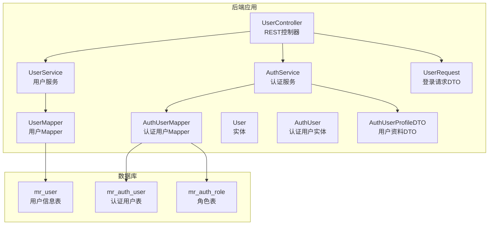
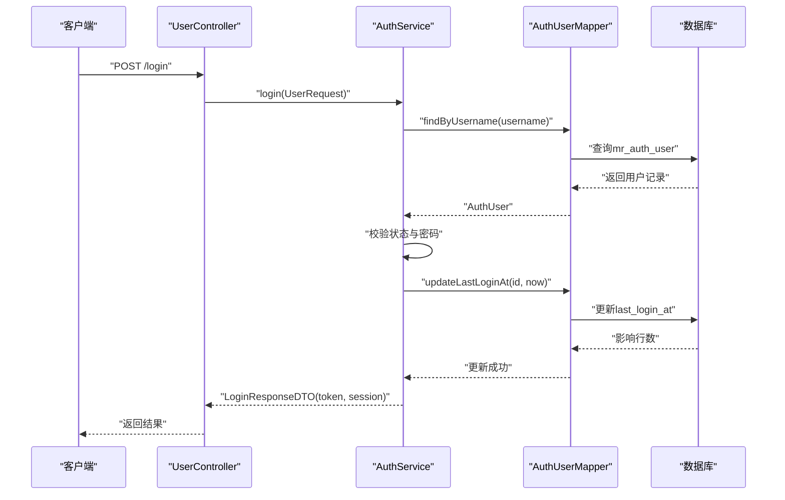
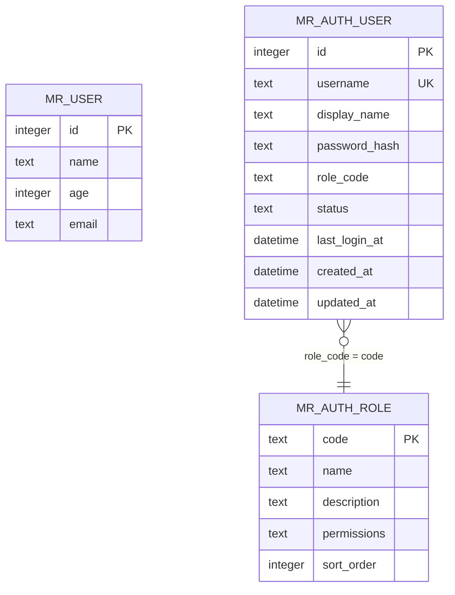
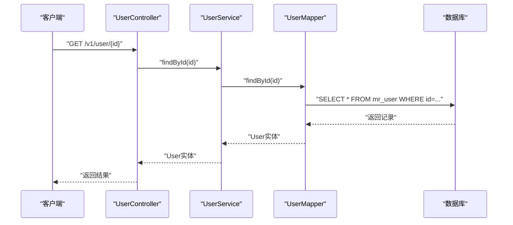
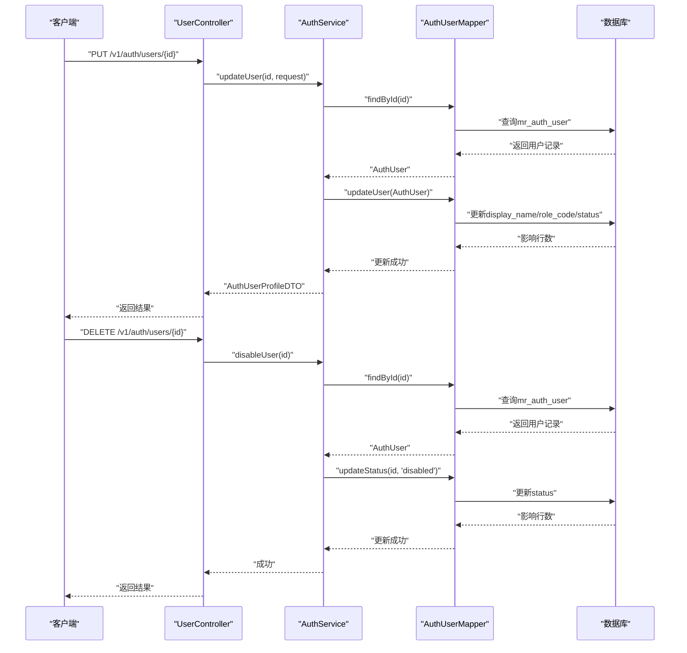
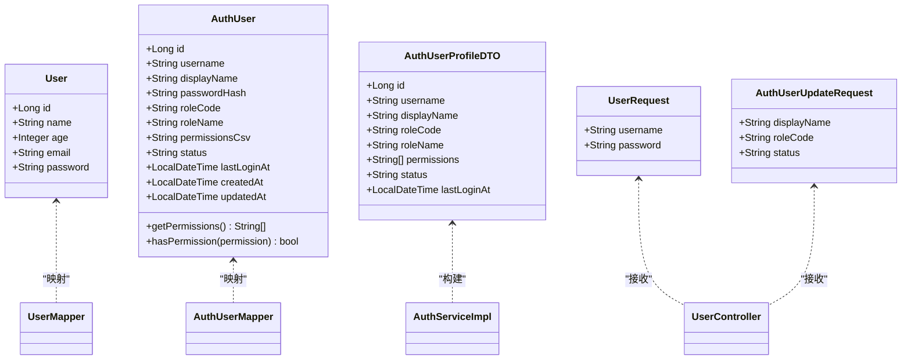
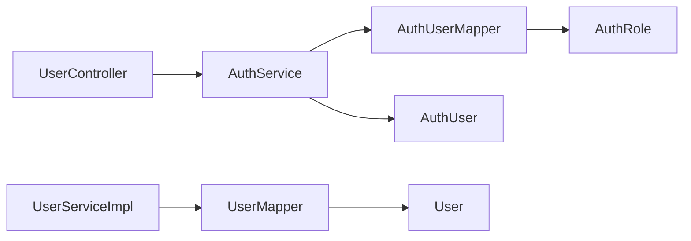

# 用户管理表

<cite>
**本文引用的文件**
- [schema.sql](file://mrr-db/schema.sql)
- [User.java](file://backend-repo/src/main/java/com/zjcxph/imgapi/entity/User.java)
- [UserMapper.java](file://backend-repo/src/main/java/com/zjcxph/imgapi/mapper/UserMapper.java)
- [UserService.java](file://backend-repo/src/main/java/com/zjcxph/imgapi/service/UserService.java)
- [UserServiceImpl.java](file://backend-repo/src/main/java/com/zjcxph/imgapi/service/impl/UserServiceImpl.java)
- [UserController.java](file://backend-repo/src/main/java/com/zjcxph/imgapi/controller/UserController.java)
- [UserRequest.java](file://backend-repo/src/main/java/com/zjcxph/imgapi/dto/req/UserRequest.java)
- [AuthUserProfileDTO.java](file://backend-repo/src/main/java/com/zjcxph/imgapi/dto/resp/AuthUserProfileDTO.java)
- [AuthService.java](file://backend-repo/src/main/java/com/zjcxph/imgapi/service/AuthService.java)
- [AuthServiceImpl.java](file://backend-repo/src/main/java/com/zjcxph/imgapi/service/impl/AuthServiceImpl.java)
- [AuthUserMapper.java](file://backend-repo/src/main/java/com/zjcxph/imgapi/mapper/AuthUserMapper.java)
- [AuthUser.java](file://backend-repo/src/main/java/com/zjcxph/imgapi/entity/AuthUser.java)
- [AuthUserUpdateRequest.java](file://backend-repo/src/main/java/com/zjcxph/imgapi/dto/req/AuthUserUpdateRequest.java)
- [reset-br-admin-password.sql](file://backend-repo/src/main/resources/reset-br-admin-password.sql)
</cite>

## 目录
1. [简介](#简介)
2. [项目结构](#项目结构)
3. [核心组件](#核心组件)
4. [架构总览](#架构总览)
5. [详细组件分析](#详细组件分析)
6. [依赖分析](#依赖分析)
7. [性能考虑](#性能考虑)
8. [故障排除指南](#故障排除指南)
9. [结论](#结论)
10. [附录](#附录)

## 简介
本文件聚焦于MRR系统中的用户管理表设计与实现，重点围绕数据库表mr_user与其在后端的映射与访问层展开。文档将从数据模型、字段定义与约束、业务场景、与其他表的关系、增删改查操作流程、数据验证规则、最佳实践与安全考虑等方面进行系统化说明，并通过图示展示关键调用链路与数据流。

## 项目结构
后端采用典型的分层架构：控制器(Controller)、服务(Service)、数据访问对象(Mapper/DAO)、实体(Entity)与DTO，配合数据库脚本定义表结构。用户管理相关的核心文件分布如下：
- 数据库脚本：定义mr_user等核心表结构
- 实体类：User（用于mr_user映射）、AuthUser（用于mr_auth_user认证用户）
- Mapper接口：UserMapper、AuthUserMapper
- Service接口与实现：UserService、UserServiceImpl、AuthService、AuthServiceImpl
- 控制器：UserController（当前暴露认证与权限相关接口，用户管理以认证用户为主）
- DTO与请求对象：AuthUserProfileDTO、AuthUserUpdateRequest、UserRequest

图表来源
- [UserController.java:27-94](file://backend-repo/src/main/java/com/zjcxph/imgapi/controller/UserController.java#L27-L94)
- [AuthService.java:12-24](file://backend-repo/src/main/java/com/zjcxph/imgapi/service/AuthService.java#L12-L24)
- [UserService.java:5-8](file://backend-repo/src/main/java/com/zjcxph/imgapi/service/UserService.java#L5-L8)
- [UserMapper.java:7-12](file://backend-repo/src/main/java/com/zjcxph/imgapi/mapper/UserMapper.java#L7-L12)
- [AuthUserMapper.java:14-77](file://backend-repo/src/main/java/com/zjcxph/imgapi/mapper/AuthUserMapper.java#L14-L77)
- [User.java:6-11](file://backend-repo/src/main/java/com/zjcxph/imgapi/entity/User.java#L6-L11)
- [AuthUser.java:14-24](file://backend-repo/src/main/java/com/zjcxph/imgapi/entity/AuthUser.java#L14-L24)
- [AuthUserProfileDTO.java:10-18](file://backend-repo/src/main/java/com/zjcxph/imgapi/dto/resp/AuthUserProfileDTO.java#L10-L18)
- [UserRequest.java:8-13](file://backend-repo/src/main/java/com/zjcxph/imgapi/dto/req/UserRequest.java#L8-L13)

章节来源
- [schema.sql:50-56](file://mrr-db/schema.sql#L50-L56)
- [User.java:6-11](file://backend-repo/src/main/java/com/zjcxph/imgapi/entity/User.java#L6-L11)
- [UserMapper.java:7-12](file://backend-repo/src/main/java/com/zjcxph/imgapi/mapper/UserMapper.java#L7-L12)
- [UserController.java:27-94](file://backend-repo/src/main/java/com/zjcxph/imgapi/controller/UserController.java#L27-L94)

## 核心组件
本节对用户管理涉及的核心组件进行深入分析，包括数据模型、字段定义、约束、业务场景与调用链路。

- 数据模型与字段定义
  - mr_user表：用于存储用户基本信息，包含主键id、姓名name、年龄age、邮箱email等字段。该表在数据库脚本中定义，且存在对应的Java实体类User与其Mapper接口。
  - 认证用户表mr_auth_user：用于系统认证与权限控制，包含用户名、显示名、密码哈希、角色编码、状态、最后登录时间等字段；与mr_auth_role通过角色编码关联。
  - DTO与请求对象：AuthUserProfileDTO用于对外返回用户资料；AuthUserUpdateRequest用于更新认证用户资料；UserRequest用于登录请求。

- 字段类型与约束
  - mr_user.id：整型，主键，非空
  - mr_user.name：文本，可空
  - mr_user.age：整型，可空
  - mr_user.email：文本，可空
  - mr_auth_user.username：文本，唯一，非空
  - mr_auth_user.password_hash：文本，非空
  - mr_auth_user.role_code：文本，非空，与mr_auth_role.code关联
  - mr_auth_user.status：文本，默认值为'active'，非空
  - mr_auth_user.created_at/updated_at：时间戳，默认值为当前时间

- 业务场景
  - 用户信息读取：通过UserMapper按id查询mr_user记录，供上层服务使用
  - 认证与权限：通过AuthUserMapper与AuthUser实体完成登录、角色与权限解析、用户状态校验
  - 用户资料展示：通过AuthUserProfileDTO封装认证用户的角色名称、权限列表、状态等信息

- 关联关系
  - mr_user与mr_auth_user：无直接外键关联，分别承担“用户信息”和“认证权限”职责
  - mr_auth_user与mr_auth_role：通过role_code=code建立一对一关联，用于加载角色名称与权限字符串

章节来源
- [schema.sql:50-78](file://mrr-db/schema.sql#L50-L78)
- [User.java:6-11](file://backend-repo/src/main/java/com/zjcxph/imgapi/entity/User.java#L6-L11)
- [AuthUser.java:14-24](file://backend-repo/src/main/java/com/zjcxph/imgapi/entity/AuthUser.java#L14-L24)
- [AuthUserProfileDTO.java:10-18](file://backend-repo/src/main/java/com/zjcxph/imgapi/dto/resp/AuthUserProfileDTO.java#L10-L18)
- [AuthUserMapper.java:16-59](file://backend-repo/src/main/java/com/zjcxph/imgapi/mapper/AuthUserMapper.java#L16-L59)

## 架构总览
下图展示了用户管理相关的系统架构与数据流，涵盖控制器、服务、数据访问与数据库之间的交互。

图表来源
- [UserController.java:38-47](file://backend-repo/src/main/java/com/zjcxph/imgapi/controller/UserController.java#L38-L47)
- [AuthServiceImpl.java:36-62](file://backend-repo/src/main/java/com/zjcxph/imgapi/service/impl/AuthServiceImpl.java#L36-L62)
- [AuthUserMapper.java:16-62](file://backend-repo/src/main/java/com/zjcxph/imgapi/mapper/AuthUserMapper.java#L16-L62)

## 详细组件分析

### 数据模型与ER关系
mr_user与mr_auth_user分别承担“用户信息”和“认证权限”的职责，二者通过业务语义关联而非外键约束。mr_auth_user与mr_auth_role通过角色编码关联，形成角色-权限模型。

图表来源
- [schema.sql:50-78](file://mrr-db/schema.sql#L50-L78)

章节来源
- [schema.sql:50-78](file://mrr-db/schema.sql#L50-L78)

### 查询流程（按ID查询用户信息）
当前代码中提供了按ID查询mr_user的Mapper方法，对应的服务层通过UserMapper完成查询。

图表来源
- [UserController.java:27-94](file://backend-repo/src/main/java/com/zjcxph/imgapi/controller/UserController.java#L27-L94)
- [UserServiceImpl.java:20-23](file://backend-repo/src/main/java/com/zjcxph/imgapi/service/impl/UserServiceImpl.java#L20-L23)
- [UserMapper.java:10-11](file://backend-repo/src/main/java/com/zjcxph/imgapi/mapper/UserMapper.java#L10-L11)

章节来源
- [UserMapper.java:7-12](file://backend-repo/src/main/java/com/zjcxph/imgapi/mapper/UserMapper.java#L7-L12)
- [UserServiceImpl.java:9-24](file://backend-repo/src/main/java/com/zjcxph/imgapi/service/impl/UserServiceImpl.java#L9-L24)

### 登录与权限校验流程
登录流程包含用户名密码校验、状态检查、最后登录时间更新与令牌签发。

图表来源
- [UserController.java:38-47](file://backend-repo/src/main/java/com/zjcxph/imgapi/controller/UserController.java#L38-L47)
- [AuthServiceImpl.java:36-62](file://backend-repo/src/main/java/com/zjcxph/imgapi/service/impl/AuthServiceImpl.java#L36-L62)
- [AuthUserMapper.java:16-62](file://backend-repo/src/main/java/com/zjcxph/imgapi/mapper/AuthUserMapper.java#L16-L62)

章节来源
- [AuthServiceImpl.java:36-62](file://backend-repo/src/main/java/com/zjcxph/imgapi/service/impl/AuthServiceImpl.java#L36-L62)
- [AuthUserMapper.java:16-62](file://backend-repo/src/main/java/com/zjcxph/imgapi/mapper/AuthUserMapper.java#L16-L62)

### 更新用户与禁用用户流程
更新用户资料与禁用用户均基于认证用户表mr_auth_user，通过AuthUserMapper执行更新操作。

图表来源
- [UserController.java:73-93](file://backend-repo/src/main/java/com/zjcxph/imgapi/controller/UserController.java#L73-L93)
- [AuthServiceImpl.java:75-100](file://backend-repo/src/main/java/com/zjcxph/imgapi/service/impl/AuthServiceImpl.java#L75-L100)
- [AuthUserMapper.java:64-72](file://backend-repo/src/main/java/com/zjcxph/imgapi/mapper/AuthUserMapper.java#L64-L72)

章节来源
- [UserController.java:73-93](file://backend-repo/src/main/java/com/zjcxph/imgapi/controller/UserController.java#L73-L93)
- [AuthServiceImpl.java:75-100](file://backend-repo/src/main/java/com/zjcxph/imgapi/service/impl/AuthServiceImpl.java#L75-L100)
- [AuthUserMapper.java:64-72](file://backend-repo/src/main/java/com/zjcxph/imgapi/mapper/AuthUserMapper.java#L64-L72)

### 类关系图（实体与DTO）

图表来源
- [User.java:6-11](file://backend-repo/src/main/java/com/zjcxph/imgapi/entity/User.java#L6-L11)
- [AuthUser.java:14-24](file://backend-repo/src/main/java/com/zjcxph/imgapi/entity/AuthUser.java#L14-L24)
- [AuthUserProfileDTO.java:10-18](file://backend-repo/src/main/java/com/zjcxph/imgapi/dto/resp/AuthUserProfileDTO.java#L10-L18)
- [UserRequest.java:8-13](file://backend-repo/src/main/java/com/zjcxph/imgapi/dto/req/UserRequest.java#L8-L13)
- [AuthUserUpdateRequest.java:8-15](file://backend-repo/src/main/java/com/zjcxph/imgapi/dto/req/AuthUserUpdateRequest.java#L8-L15)

章节来源
- [User.java:6-11](file://backend-repo/src/main/java/com/zjcxph/imgapi/entity/User.java#L6-L11)
- [AuthUser.java:14-24](file://backend-repo/src/main/java/com/zjcxph/imgapi/entity/AuthUser.java#L14-L24)
- [AuthUserProfileDTO.java:10-18](file://backend-repo/src/main/java/com/zjcxph/imgapi/dto/resp/AuthUserProfileDTO.java#L10-L18)
- [UserRequest.java:8-13](file://backend-repo/src/main/java/com/zjcxph/imgapi/dto/req/UserRequest.java#L8-L13)
- [AuthUserUpdateRequest.java:8-15](file://backend-repo/src/main/java/com/zjcxph/imgapi/dto/req/AuthUserUpdateRequest.java#L8-L15)

## 依赖分析
- 组件耦合
  - UserController依赖AuthService进行认证与权限相关操作；当前未直接暴露针对mr_user的增删改查接口
  - UserServiceImpl依赖UserMapper访问mr_user
  - AuthServiceImpl依赖AuthUserMapper访问mr_auth_user与mr_auth_role
- 外部依赖
  - 数据库：PostgreSQL（由schema脚本与实际部署环境决定）
  - 安全工具：PasswordUtil（密码校验）、JwtUtil（令牌生成）、AuthContext（会话上下文）

图表来源
- [UserController.java:32-36](file://backend-repo/src/main/java/com/zjcxph/imgapi/controller/UserController.java#L32-L36)
- [AuthServiceImpl.java:25-34](file://backend-repo/src/main/java/com/zjcxph/imgapi/service/impl/AuthServiceImpl.java#L25-L34)
- [UserServiceImpl.java:9-17](file://backend-repo/src/main/java/com/zjcxph/imgapi/service/impl/UserServiceImpl.java#L9-L17)
- [AuthUserMapper.java:14-77](file://backend-repo/src/main/java/com/zjcxph/imgapi/mapper/AuthUserMapper.java#L14-L77)
- [UserMapper.java:7-12](file://backend-repo/src/main/java/com/zjcxph/imgapi/mapper/UserMapper.java#L7-L12)

章节来源
- [UserController.java:32-36](file://backend-repo/src/main/java/com/zjcxph/imgapi/controller/UserController.java#L32-L36)
- [AuthServiceImpl.java:25-34](file://backend-repo/src/main/java/com/zjcxph/imgapi/service/impl/AuthServiceImpl.java#L25-L34)
- [UserServiceImpl.java:9-17](file://backend-repo/src/main/java/com/zjcxph/imgapi/service/impl/UserServiceImpl.java#L9-L17)
- [AuthUserMapper.java:14-77](file://backend-repo/src/main/java/com/zjcxph/imgapi/mapper/AuthUserMapper.java#L14-L77)
- [UserMapper.java:7-12](file://backend-repo/src/main/java/com/zjcxph/imgapi/mapper/UserMapper.java#L7-L12)

## 性能考虑
- 索引与查询
  - mr_auth_user存在基于username与role_code的索引，有助于登录与权限查询
  - 建议在mr_user的id上确保主键索引（默认主键即具备索引），并根据实际查询模式评估是否添加name或email的二级索引
- 缓存策略
  - 对热点用户资料与角色权限可引入缓存，降低数据库压力
- 分页与批量操作
  - 列表查询建议支持分页参数，避免一次性返回大量数据
- 连接池与SQL优化
  - 合理配置连接池大小，避免长事务与阻塞
- 加密与哈希
  - 密码采用不可逆哈希存储，避免明文或弱加密

## 故障排除指南
- 登录失败
  - 检查用户名是否存在、状态是否为激活、密码哈希是否匹配
  - 关注AuthServiceImpl中的异常抛出点与状态校验逻辑
- 用户不存在或更新失败
  - 确认传入id是否正确，以及数据库中是否存在对应记录
  - 关注AuthUserMapper的updateUser与updateStatus返回的影响行数
- 密码重置
  - 可参考reset-br-admin-password.sql脚本，确认ON CONFLICT处理逻辑与目标表结构一致

章节来源
- [AuthServiceImpl.java:36-62](file://backend-repo/src/main/java/com/zjcxph/imgapi/service/impl/AuthServiceImpl.java#L36-L62)
- [AuthUserMapper.java:64-72](file://backend-repo/src/main/java/com/zjcxph/imgapi/mapper/AuthUserMapper.java#L64-L72)
- [reset-br-admin-password.sql:1-16](file://backend-repo/src/main/resources/reset-br-admin-password.sql#L1-L16)

## 结论
- mr_user表承担用户基本信息存储职责，与mr_auth_user（认证与权限）形成互补
- 当前后端实现主要围绕认证用户表展开，mr_user的增删改查接口尚未在UserController中暴露
- 建议在完善用户管理接口的同时，强化数据验证、权限控制与安全机制，并结合业务需求优化查询与缓存策略

## 附录

### 数据模型字段定义与约束
- mr_user
  - id：整型，主键，非空
  - name：文本，可空
  - age：整型，可空
  - email：文本，可空
- mr_auth_user
  - id：整型，主键，自增
  - username：文本，唯一，非空
  - display_name：文本，可空
  - password_hash：文本，非空
  - role_code：文本，非空，关联mr_auth_role.code
  - status：文本，默认'active'，非空
  - last_login_at：时间戳，可空
  - created_at/updated_at：时间戳，默认当前时间，非空

章节来源
- [schema.sql:50-78](file://mrr-db/schema.sql#L50-L78)

### 业务应用场景
- 用户信息读取：通过UserMapper按id查询mr_user，适用于需要展示或使用用户基本信息的场景
- 认证与权限：通过AuthUserMapper与AuthUser实体完成登录、角色与权限解析、用户状态校验
- 用户资料展示：通过AuthUserProfileDTO封装认证用户的角色名称、权限列表、状态等信息

章节来源
- [UserMapper.java:10-11](file://backend-repo/src/main/java/com/zjcxph/imgapi/mapper/UserMapper.java#L10-L11)
- [AuthUserMapper.java:16-59](file://backend-repo/src/main/java/com/zjcxph/imgapi/mapper/AuthUserMapper.java#L16-L59)
- [AuthUserProfileDTO.java:10-18](file://backend-repo/src/main/java/com/zjcxph/imgapi/dto/resp/AuthUserProfileDTO.java#L10-L18)

### 增删改查操作示例（路径指引）
- 查询单个用户信息
  - 路径：[UserMapper.findById:10-11](file://backend-repo/src/main/java/com/zjcxph/imgapi/mapper/UserMapper.java#L10-L11)
  - 服务：[UserServiceImpl.findById:20-23](file://backend-repo/src/main/java/com/zjcxph/imgapi/service/impl/UserServiceImpl.java#L20-L23)
- 登录
  - 路径：[UserController.login:38-47](file://backend-repo/src/main/java/com/zjcxph/imgapi/controller/UserController.java#L38-L47)
  - 服务：[AuthServiceImpl.login:36-62](file://backend-repo/src/main/java/com/zjcxph/imgapi/service/impl/AuthServiceImpl.java#L36-L62)
- 更新用户资料
  - 路径：[UserController.updateUser:73-82](file://backend-repo/src/main/java/com/zjcxph/imgapi/controller/UserController.java#L73-L82)
  - 服务：[AuthServiceImpl.updateUser:75-91](file://backend-repo/src/main/java/com/zjcxph/imgapi/service/impl/AuthServiceImpl.java#L75-L91)
- 禁用用户
  - 路径：[UserController.disableUser:84-93](file://backend-repo/src/main/java/com/zjcxph/imgapi/controller/UserController.java#L84-L93)
  - 服务：[AuthServiceImpl.disableUser:94-100](file://backend-repo/src/main/java/com/zjcxph/imgapi/service/impl/AuthServiceImpl.java#L94-L100)

章节来源
- [UserMapper.java:10-11](file://backend-repo/src/main/java/com/zjcxph/imgapi/mapper/UserMapper.java#L10-L11)
- [UserServiceImpl.java:20-23](file://backend-repo/src/main/java/com/zjcxph/imgapi/service/impl/UserServiceImpl.java#L20-L23)
- [UserController.java:38-93](file://backend-repo/src/main/java/com/zjcxph/imgapi/controller/UserController.java#L38-L93)
- [AuthServiceImpl.java:36-100](file://backend-repo/src/main/java/com/zjcxph/imgapi/service/impl/AuthServiceImpl.java#L36-L100)

### 数据验证规则
- 登录请求
  - username与password均不能为空
- 更新用户请求
  - roleCode与status不能为空
- 其他
  - 建议在业务层补充邮箱格式、年龄范围等校验

章节来源
- [UserRequest.java:8-13](file://backend-repo/src/main/java/com/zjcxph/imgapi/dto/req/UserRequest.java#L8-L13)
- [AuthUserUpdateRequest.java:11-15](file://backend-repo/src/main/java/com/zjcxph/imgapi/dto/req/AuthUserUpdateRequest.java#L11-L15)

### 最佳实践与安全考虑
- 密码安全
  - 使用不可逆哈希存储密码，校验时采用安全比对
- 权限控制
  - 严格基于角色与权限进行访问控制，避免越权操作
- 输入校验
  - 在DTO层与业务层双重校验，防止非法输入
- 日志与审计
  - 记录关键操作日志，便于追踪与审计
- 数据一致性
  - 对并发更新进行必要的锁或乐观锁策略，保证状态变更原子性