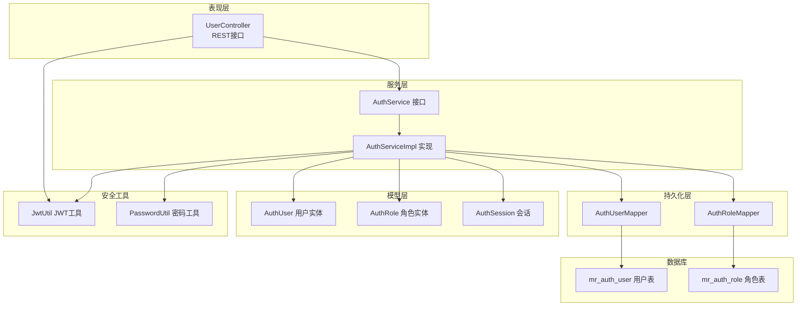
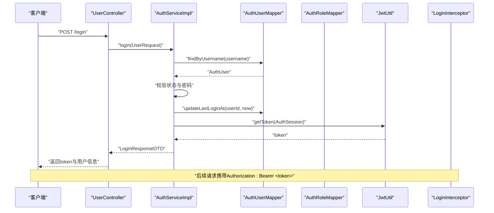
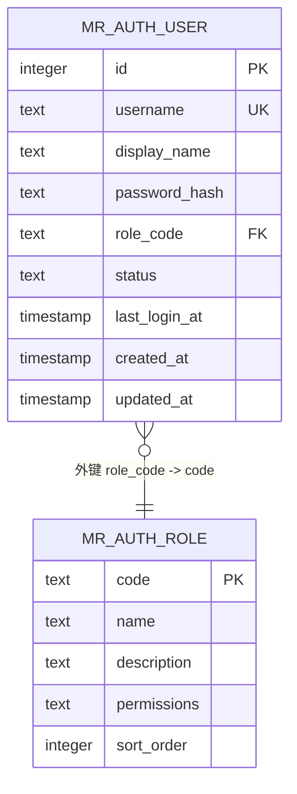
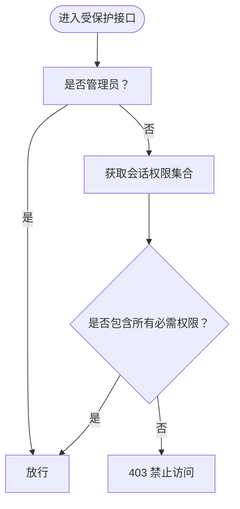
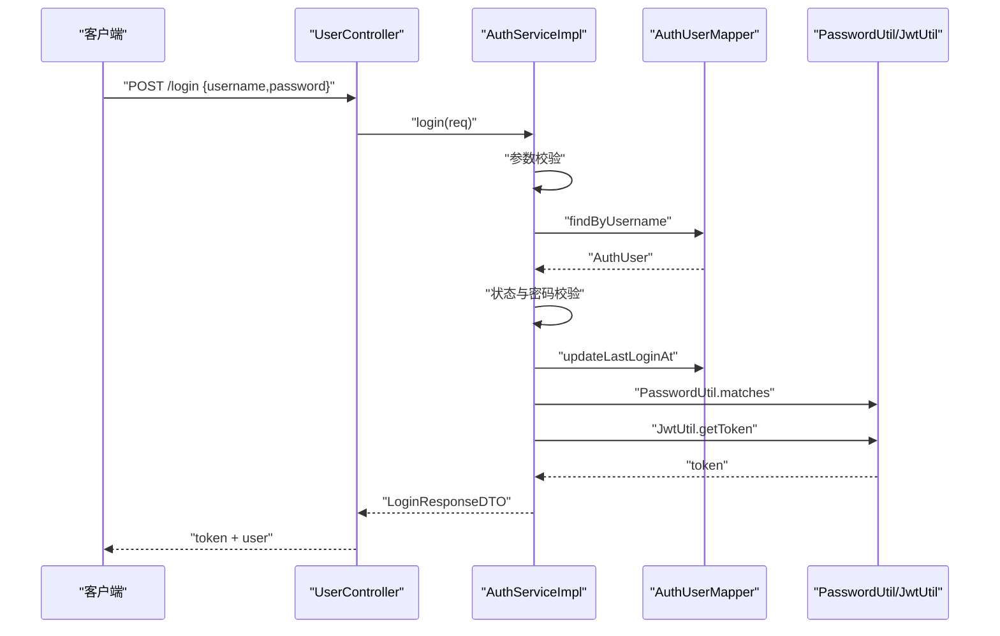
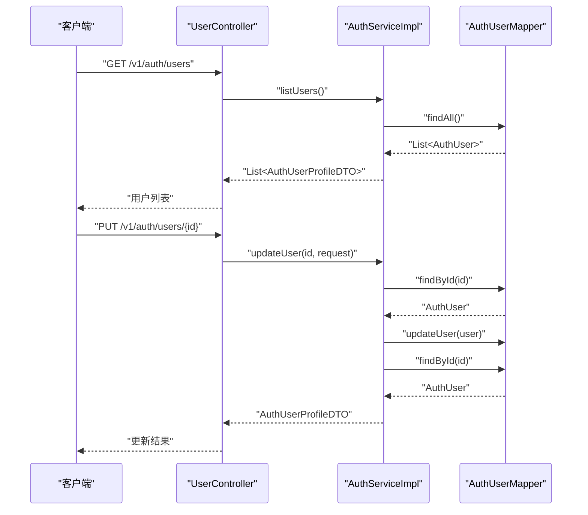
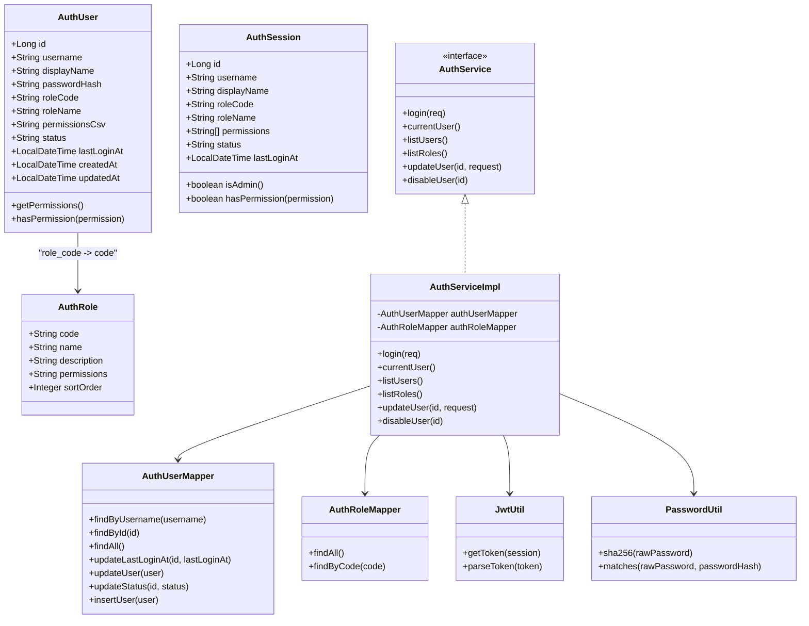

# 认证授权表

<cite>
**本文引用的文件**
- [AuthRole.java](file://backend-repo/src/main/java/com/zjcxph/imgapi/entity/AuthRole.java)
- [AuthUser.java](file://backend-repo/src/main/java/com/zjcxph/imgapi/entity/AuthUser.java)
- [AuthRoleMapper.java](file://backend-repo/src/main/java/com/zjcxph/imgapi/mapper/AuthRoleMapper.java)
- [AuthUserMapper.java](file://backend-repo/src/main/java/com/zjcxph/imgapi/mapper/AuthUserMapper.java)
- [AuthService.java](file://backend-repo/src/main/java/com/zjcxph/imgapi/service/AuthService.java)
- [AuthServiceImpl.java](file://backend-repo/src/main/java/com/zjcxph/imgapi/service/impl/AuthServiceImpl.java)
- [AuthSession.java](file://backend-repo/src/main/java/com/zjcxph/imgapi/common/AuthSession.java)
- [JwtUtil.java](file://backend-repo/src/main/java/com/zjcxph/imgapi/utils/JwtUtil.java)
- [PasswordUtil.java](file://backend-repo/src/main/java/com/zjcxph/imgapi/utils/PasswordUtil.java)
- [schema-postgresql.sql](file://backend-repo/src/main/resources/schema-postgresql.sql)
- [LoginResponseDTO.java](file://backend-repo/src/main/java/com/zjcxph/imgapi/dto/resp/LoginResponseDTO.java)
- [UserController.java](file://backend-repo/src/main/java/com/zjcxph/imgapi/controller/UserController.java)
- [AuthorizationInterceptor.java](file://backend-repo/src/main/java/com/zjcxph/imgapi/interceptors/AuthorizationInterceptor.java)
- [LoginInterceptor.java](file://backend-repo/src/main/java/com/zjcxph/imgapi/interceptors/LoginInterceptor.java)
- [UserRequest.java](file://backend-repo/src/main/java/com/zjcxph/imgapi/dto/req/UserRequest.java)
</cite>

## 目录
1. [简介](#简介)
2. [项目结构](#项目结构)
3. [核心组件](#核心组件)
4. [架构总览](#架构总览)
5. [详细组件分析](#详细组件分析)
6. [依赖关系分析](#依赖关系分析)
7. [性能考虑](#性能考虑)
8. [故障排除指南](#故障排除指南)
9. [结论](#结论)
10. [附录](#附录)

## 简介
本文件面向MRR系统的认证授权数据模型，聚焦于mr_auth_role（角色表）与mr_auth_user（用户表）的设计与实现，系统性阐述角色权限模型、用户状态管理与安全约束，并给出角色继承关系、权限分配机制与用户登录流程的数据支撑。同时提供角色权限配置示例与用户管理操作的数据流说明，帮助读者快速理解并正确使用该认证授权体系。

## 项目结构
认证授权模块由以下层次构成：
- 数据模型层：实体类承载数据库表映射与业务逻辑
- 持久化层：MyBatis Mapper负责SQL查询与更新
- 服务层：认证服务封装登录、用户与角色管理
- 控制器层：REST接口暴露认证与权限管理能力
- 安全拦截层：登录拦截器解析JWT，权限拦截器校验权限
- 工具层：JWT工具与密码工具提供安全能力

图表来源
- [UserController.java:27-95](file://backend-repo/src/main/java/com/zjcxph/imgapi/controller/UserController.java#L27-L95)
- [AuthService.java:12-25](file://backend-repo/src/main/java/com/zjcxph/imgapi/service/AuthService.java#L12-L25)
- [AuthServiceImpl.java:25-151](file://backend-repo/src/main/java/com/zjcxph/imgapi/service/impl/AuthServiceImpl.java#L25-L151)
- [AuthUserMapper.java:13-78](file://backend-repo/src/main/java/com/zjcxph/imgapi/mapper/AuthUserMapper.java#L13-L78)
- [AuthRoleMapper.java:10-19](file://backend-repo/src/main/java/com/zjcxph/imgapi/mapper/AuthRoleMapper.java#L10-L19)
- [AuthUser.java:13-134](file://backend-repo/src/main/java/com/zjcxph/imgapi/entity/AuthUser.java#L13-L134)
- [AuthRole.java:6-53](file://backend-repo/src/main/java/com/zjcxph/imgapi/entity/AuthRole.java#L6-L53)
- [AuthSession.java:7-90](file://backend-repo/src/main/java/com/zjcxph/imgapi/common/AuthSession.java#L7-L90)
- [JwtUtil.java:12-77](file://backend-repo/src/main/java/com/zjcxph/imgapi/utils/JwtUtil.java#L12-L77)
- [PasswordUtil.java:5-24](file://backend-repo/src/main/java/com/zjcxph/imgapi/utils/PasswordUtil.java#L5-L24)
- [schema-postgresql.sql:41-59](file://backend-repo/src/main/resources/schema-postgresql.sql#L41-L59)

章节来源
- [UserController.java:27-95](file://backend-repo/src/main/java/com/zjcxph/imgapi/controller/UserController.java#L27-L95)
- [AuthService.java:12-25](file://backend-repo/src/main/java/com/zjcxph/imgapi/service/AuthService.java#L12-L25)
- [AuthServiceImpl.java:25-151](file://backend-repo/src/main/java/com/zjcxph/imgapi/service/impl/AuthServiceImpl.java#L25-L151)
- [AuthUserMapper.java:13-78](file://backend-repo/src/main/java/com/zjcxph/imgapi/mapper/AuthUserMapper.java#L13-L78)
- [AuthRoleMapper.java:10-19](file://backend-repo/src/main/java/com/zjcxph/imgapi/mapper/AuthRoleMapper.java#L10-L19)
- [AuthUser.java:13-134](file://backend-repo/src/main/java/com/zjcxph/imgapi/entity/AuthUser.java#L13-L134)
- [AuthRole.java:6-53](file://backend-repo/src/main/java/com/zjcxph/imgapi/entity/AuthRole.java#L6-L53)
- [AuthSession.java:7-90](file://backend-repo/src/main/java/com/zjcxph/imgapi/common/AuthSession.java#L7-L90)
- [JwtUtil.java:12-77](file://backend-repo/src/main/java/com/zjcxph/imgapi/utils/JwtUtil.java#L12-L77)
- [PasswordUtil.java:5-24](file://backend-repo/src/main/java/com/zjcxph/imgapi/utils/PasswordUtil.java#L5-L24)
- [schema-postgresql.sql:41-59](file://backend-repo/src/main/resources/schema-postgresql.sql#L41-L59)

## 核心组件
- 用户实体（AuthUser）
  - 关键字段：id、username、display_name、password_hash、role_code、role_name、permissions_csv、status、last_login_at、created_at、updated_at
  - 权限解析：通过permissions_csv解析为字符串列表，提供hasPermission判断
  - 敏感信息：password_hash与permissions_csv标注JsonIgnore，避免在响应中泄露
- 角色实体（AuthRole）
  - 关键字段：code、name、description、permissions、sort_order
  - 权限字符串：以逗号分隔的权限集合，用于角色级权限聚合
- 会话模型（AuthSession）
  - 关键字段：id、username、display_name、roleCode、roleName、permissions、status、lastLoginAt
  - 权限判断：hasPermission方法基于permissions集合进行判断
  - 管理员判定：当roleCode为ADMIN或permissions包含user:manage或role:manage时视为管理员
- 认证服务（AuthServiceImpl）
  - 登录流程：校验用户名与密码，检查账户状态，更新最后登录时间，生成JWT
  - 用户管理：列出用户、更新用户资料、禁用用户
  - 角色管理：列出角色
- 数据访问（AuthUserMapper/AuthRoleMapper）
  - 用户：按用户名/ID查询、更新最后登录时间、更新用户信息、更新状态、插入用户
  - 角色：查询所有角色、按code查询角色
- 安全工具
  - JWT：签发与解析，携带用户身份与权限数组
  - 密码：SHA-256哈希比对

章节来源
- [AuthUser.java:13-134](file://backend-repo/src/main/java/com/zjcxph/imgapi/entity/AuthUser.java#L13-L134)
- [AuthRole.java:6-53](file://backend-repo/src/main/java/com/zjcxph/imgapi/entity/AuthRole.java#L6-L53)
- [AuthSession.java:7-90](file://backend-repo/src/main/java/com/zjcxph/imgapi/common/AuthSession.java#L7-L90)
- [AuthServiceImpl.java:36-105](file://backend-repo/src/main/java/com/zjcxph/imgapi/service/impl/AuthServiceImpl.java#L36-L105)
- [AuthUserMapper.java:13-78](file://backend-repo/src/main/java/com/zjcxph/imgapi/mapper/AuthUserMapper.java#L13-L78)
- [AuthRoleMapper.java:10-19](file://backend-repo/src/main/java/com/zjcxph/imgapi/mapper/AuthRoleMapper.java#L10-L19)
- [JwtUtil.java:12-77](file://backend-repo/src/main/java/com/zjcxph/imgapi/utils/JwtUtil.java#L12-L77)
- [PasswordUtil.java:5-24](file://backend-repo/src/main/java/com/zjcxph/imgapi/utils/PasswordUtil.java#L5-L24)

## 架构总览
认证授权的整体流程如下：
- 用户登录：控制器接收请求，调用认证服务进行校验与登录，返回JWT与会话信息
- 请求拦截：登录拦截器从Authorization头提取Bearer Token，解析JWT并注入AuthContext
- 权限校验：权限拦截器读取控制器上的权限注解，结合会话中的权限集合进行校验
- 数据访问：服务层通过Mapper访问数据库，完成用户与角色信息的读写

图表来源
- [UserController.java:38-47](file://backend-repo/src/main/java/com/zjcxph/imgapi/controller/UserController.java#L38-L47)
- [AuthServiceImpl.java:36-62](file://backend-repo/src/main/java/com/zjcxph/imgapi/service/impl/AuthServiceImpl.java#L36-L62)
- [AuthUserMapper.java:16-29](file://backend-repo/src/main/java/com/zjcxph/imgapi/mapper/AuthUserMapper.java#L16-L29)
- [JwtUtil.java:28-59](file://backend-repo/src/main/java/com/zjcxph/imgapi/utils/JwtUtil.java#L28-L59)
- [LoginInterceptor.java:29-52](file://backend-repo/src/main/java/com/zjcxph/imgapi/interceptors/LoginInterceptor.java#L29-L52)

## 详细组件分析

### 数据模型设计（角色与用户）

图表来源
- [schema-postgresql.sql:41-59](file://backend-repo/src/main/resources/schema-postgresql.sql#L41-L59)

章节来源
- [schema-postgresql.sql:41-59](file://backend-repo/src/main/resources/schema-postgresql.sql#L41-L59)

#### 角色表（mr_auth_role）
- 主键：code（角色编码）
- 权限字符串：permissions以逗号分隔的权限集合，用于角色级权限聚合
- 排序字段：sort_order决定角色展示顺序
- 示例数据：包含ADMIN、DOCTOR、NURSE三类角色及其权限字符串

章节来源
- [schema-postgresql.sql:91-96](file://backend-repo/src/main/resources/schema-postgresql.sql#L91-L96)
- [AuthRole.java:6-53](file://backend-repo/src/main/java/com/zjcxph/imgapi/entity/AuthRole.java#L6-L53)
- [AuthRoleMapper.java:10-19](file://backend-repo/src/main/java/com/zjcxph/imgapi/mapper/AuthRoleMapper.java#L10-L19)

#### 用户表（mr_auth_user）
- 主键：id（自增）
- 唯一索引：username
- 外键：role_code引用mr_auth_role(code)，级联更新
- 状态字段：status默认值为active，支持禁用
- 时间戳：created_at、updated_at自动维护
- 示例数据：内置超级管理员与基础角色的初始用户

章节来源
- [schema-postgresql.sql:49-59](file://backend-repo/src/main/resources/schema-postgresql.sql#L49-L59)
- [AuthUser.java:13-134](file://backend-repo/src/main/java/com/zjcxph/imgapi/entity/AuthUser.java#L13-L134)
- [AuthUserMapper.java:13-78](file://backend-repo/src/main/java/com/zjcxph/imgapi/mapper/AuthUserMapper.java#L13-L78)

### 权限模型与继承关系
- 角色权限：每个角色拥有一个权限字符串，服务层将其解析为去重后的权限列表
- 用户权限：用户实体包含permissions_csv字段，服务层将其解析为权限列表；同时用户还继承角色的权限
- 管理员判定：当roleCode为ADMIN或permissions包含user:manage或role:manage时，视为管理员，绕过权限校验
- 权限注解：控制器方法上使用@RequirePermissions声明所需权限，拦截器进行批量校验

图表来源
- [AuthorizationInterceptor.java:22-56](file://backend-repo/src/main/java/com/zjcxph/imgapi/interceptors/AuthorizationInterceptor.java#L22-L56)
- [AuthSession.java:81-88](file://backend-repo/src/main/java/com/zjcxph/imgapi/common/AuthSession.java#L81-L88)

章节来源
- [AuthSession.java:81-88](file://backend-repo/src/main/java/com/zjcxph/imgapi/common/AuthSession.java#L81-L88)
- [AuthorizationInterceptor.java:70-76](file://backend-repo/src/main/java/com/zjcxph/imgapi/interceptors/AuthorizationInterceptor.java#L70-L76)

### 用户状态管理与安全约束
- 账户状态：登录时校验status必须为active，否则拒绝登录
- 密码安全：服务层使用PasswordUtil进行SHA-256哈希比对，避免明文存储
- 会话安全：JWT采用HMAC256签名，默认有效期24小时，claims中包含权限数组
- 敏感字段：password_hash与permissions_csv在实体中标注JsonIgnore，防止泄露

章节来源
- [AuthServiceImpl.java:49-54](file://backend-repo/src/main/java/com/zjcxph/imgapi/service/impl/AuthServiceImpl.java#L49-L54)
- [PasswordUtil.java:17-22](file://backend-repo/src/main/java/com/zjcxph/imgapi/utils/PasswordUtil.java#L17-L22)
- [JwtUtil.java:14-17](file://backend-repo/src/main/java/com/zjcxph/imgapi/utils/JwtUtil.java#L14-L17)
- [AuthUser.java:50-82](file://backend-repo/src/main/java/com/zjcxph/imgapi/entity/AuthUser.java#L50-L82)

### 登录流程与数据流
- 输入参数：UserRequest包含username与password
- 登录校验：用户名与密码非空校验、用户存在性校验、状态校验、密码哈希比对
- 成功后：更新last_login_at，生成AuthSession并签发JWT
- 返回结果：LoginResponseDTO包含token与用户会话

图表来源
- [UserController.java:38-47](file://backend-repo/src/main/java/com/zjcxph/imgapi/controller/UserController.java#L38-L47)
- [AuthServiceImpl.java:36-62](file://backend-repo/src/main/java/com/zjcxph/imgapi/service/impl/AuthServiceImpl.java#L36-L62)
- [AuthUserMapper.java:16-29](file://backend-repo/src/main/java/com/zjcxph/imgapi/mapper/AuthUserMapper.java#L16-L29)
- [PasswordUtil.java:17-22](file://backend-repo/src/main/java/com/zjcxph/imgapi/utils/PasswordUtil.java#L17-L22)
- [JwtUtil.java:28-59](file://backend-repo/src/main/java/com/zjcxph/imgapi/utils/JwtUtil.java#L28-L59)
- [UserRequest.java:8-31](file://backend-repo/src/main/java/com/zjcxph/imgapi/dto/req/UserRequest.java#L8-L31)

章节来源
- [UserController.java:38-47](file://backend-repo/src/main/java/com/zjcxph/imgapi/controller/UserController.java#L38-L47)
- [AuthServiceImpl.java:36-62](file://backend-repo/src/main/java/com/zjcxph/imgapi/service/impl/AuthServiceImpl.java#L36-L62)
- [AuthUserMapper.java:16-29](file://backend-repo/src/main/java/com/zjcxph/imgapi/mapper/AuthUserMapper.java#L16-L29)
- [PasswordUtil.java:17-22](file://backend-repo/src/main/java/com/zjcxph/imgapi/utils/PasswordUtil.java#L17-L22)
- [JwtUtil.java:28-59](file://backend-repo/src/main/java/com/zjcxph/imgapi/utils/JwtUtil.java#L28-L59)
- [UserRequest.java:8-31](file://backend-repo/src/main/java/com/zjcxph/imgapi/dto/req/UserRequest.java#L8-L31)

### 用户管理操作的数据流
- 列出用户：服务层查询所有用户并转换为用户档案DTO
- 更新用户：根据ID查询用户，更新display_name、role_code、status，再查询确认更新结果
- 禁用用户：根据ID更新状态为disabled

图表来源
- [UserController.java:59-93](file://backend-repo/src/main/java/com/zjcxph/imgapi/controller/UserController.java#L59-L93)
- [AuthServiceImpl.java:69-91](file://backend-repo/src/main/java/com/zjcxph/imgapi/service/impl/AuthServiceImpl.java#L69-L91)
- [AuthUserMapper.java:46-76](file://backend-repo/src/main/java/com/zjcxph/imgapi/mapper/AuthUserMapper.java#L46-L76)

章节来源
- [UserController.java:59-93](file://backend-repo/src/main/java/com/zjcxph/imgapi/controller/UserController.java#L59-L93)
- [AuthServiceImpl.java:69-91](file://backend-repo/src/main/java/com/zjcxph/imgapi/service/impl/AuthServiceImpl.java#L69-L91)
- [AuthUserMapper.java:46-76](file://backend-repo/src/main/java/com/zjcxph/imgapi/mapper/AuthUserMapper.java#L46-L76)

### 角色权限配置示例
- ADMIN：拥有user:manage、role:read、role:manage、record:read、record:manage、log:read、system:read等权限
- DOCTOR：拥有record:read、record:edit、search:read、statistics:read等权限
- NURSE：拥有record:read、search:read等权限

章节来源
- [schema-postgresql.sql:91-96](file://backend-repo/src/main/resources/schema-postgresql.sql#L91-L96)
- [AuthRole.java:6-53](file://backend-repo/src/main/java/com/zjcxph/imgapi/entity/AuthRole.java#L6-L53)

## 依赖关系分析

图表来源
- [AuthUser.java:13-134](file://backend-repo/src/main/java/com/zjcxph/imgapi/entity/AuthUser.java#L13-L134)
- [AuthRole.java:6-53](file://backend-repo/src/main/java/com/zjcxph/imgapi/entity/AuthRole.java#L6-L53)
- [AuthSession.java:7-90](file://backend-repo/src/main/java/com/zjcxph/imgapi/common/AuthSession.java#L7-L90)
- [AuthService.java:12-25](file://backend-repo/src/main/java/com/zjcxph/imgapi/service/AuthService.java#L12-L25)
- [AuthServiceImpl.java:25-151](file://backend-repo/src/main/java/com/zjcxph/imgapi/service/impl/AuthServiceImpl.java#L25-L151)
- [AuthUserMapper.java:13-78](file://backend-repo/src/main/java/com/zjcxph/imgapi/mapper/AuthUserMapper.java#L13-L78)
- [AuthRoleMapper.java:10-19](file://backend-repo/src/main/java/com/zjcxph/imgapi/mapper/AuthRoleMapper.java#L10-L19)
- [JwtUtil.java:12-77](file://backend-repo/src/main/java/com/zjcxph/imgapi/utils/JwtUtil.java#L12-L77)
- [PasswordUtil.java:5-24](file://backend-repo/src/main/java/com/zjcxph/imgapi/utils/PasswordUtil.java#L5-L24)

章节来源
- [AuthUser.java:13-134](file://backend-repo/src/main/java/com/zjcxph/imgapi/entity/AuthUser.java#L13-L134)
- [AuthRole.java:6-53](file://backend-repo/src/main/java/com/zjcxph/imgapi/entity/AuthRole.java#L6-L53)
- [AuthSession.java:7-90](file://backend-repo/src/main/java/com/zjcxph/imgapi/common/AuthSession.java#L7-L90)
- [AuthService.java:12-25](file://backend-repo/src/main/java/com/zjcxph/imgapi/service/AuthService.java#L12-L25)
- [AuthServiceImpl.java:25-151](file://backend-repo/src/main/java/com/zjcxph/imgapi/service/impl/AuthServiceImpl.java#L25-L151)
- [AuthUserMapper.java:13-78](file://backend-repo/src/main/java/com/zjcxph/imgapi/mapper/AuthUserMapper.java#L13-L78)
- [AuthRoleMapper.java:10-19](file://backend-repo/src/main/java/com/zjcxph/imgapi/mapper/AuthRoleMapper.java#L10-L19)
- [JwtUtil.java:12-77](file://backend-repo/src/main/java/com/zjcxph/imgapi/utils/JwtUtil.java#L12-L77)
- [PasswordUtil.java:5-24](file://backend-repo/src/main/java/com/zjcxph/imgapi/utils/PasswordUtil.java#L5-L24)

## 性能考虑
- 查询优化：用户与角色查询均通过索引字段（username、role_code）进行过滤，减少全表扫描
- 权限解析：权限字符串在服务层一次性解析为列表，避免重复拆分
- 缓存建议：可引入Redis缓存用户会话与角色权限，降低数据库压力
- JWT负载：权限数组作为数组声明，建议控制权限数量，避免令牌过大影响网络传输

## 故障排除指南
- 登录失败
  - 现象：用户名或密码错误
  - 可能原因：用户名为空、密码为空、用户不存在、状态非active、密码哈希不匹配
  - 排查步骤：检查UserRequest参数、确认用户状态、核对密码哈希
- 权限不足
  - 现象：返回403禁止访问
  - 可能原因：会话缺失、非管理员且缺少必要权限
  - 排查步骤：确认Authorization头、检查@RequirePermissions注解、核对角色权限字符串
- 令牌无效
  - 现象：返回401未授权
  - 可能原因：缺少Authorization头、令牌格式错误、签名验证失败
  - 排查步骤：确认Bearer Token、检查JWT_SECRET_KEY环境变量、验证签名算法

章节来源
- [AuthServiceImpl.java:41-54](file://backend-repo/src/main/java/com/zjcxph/imgapi/service/impl/AuthServiceImpl.java#L41-L54)
- [AuthorizationInterceptor.java:37-52](file://backend-repo/src/main/java/com/zjcxph/imgapi/interceptors/AuthorizationInterceptor.java#L37-L52)
- [LoginInterceptor.java:35-51](file://backend-repo/src/main/java/com/zjcxph/imgapi/interceptors/LoginInterceptor.java#L35-L51)

## 结论
MRR系统的认证授权表通过角色与用户的清晰分离，结合JWT与权限注解实现了简洁而高效的安全控制。角色权限字符串提供了灵活的权限聚合能力，服务层统一处理登录、状态管理与权限解析，拦截器确保接口级别的细粒度访问控制。整体设计易于扩展与维护，适合在医疗记录场景下保障数据安全与合规。

## 附录
- 关键字段说明
  - 角色编码（code）：唯一标识角色，用于用户外键关联
  - 权限字符串（permissions）：逗号分隔的权限集合，用于角色级权限聚合
  - 密码哈希（password_hash）：SHA-256哈希值，永不存储明文密码
  - 用户状态（status）：active或disabled，控制登录可用性
  - 最后登录时间（last_login_at）：记录用户最近一次成功登录时间
- 建议实践
  - 新增角色时，确保权限字符串完整且语义明确
  - 分配用户角色时，优先选择最小权限原则
  - 定期轮换JWT_SECRET_KEY并更新部署环境
  - 对高敏感接口增加额外审计日志