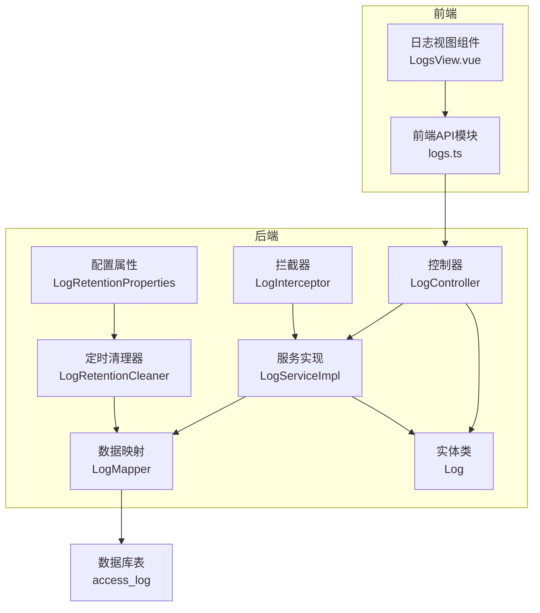
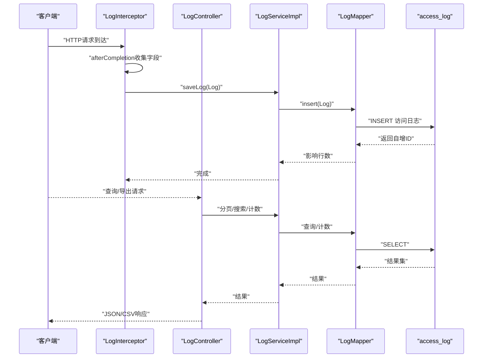
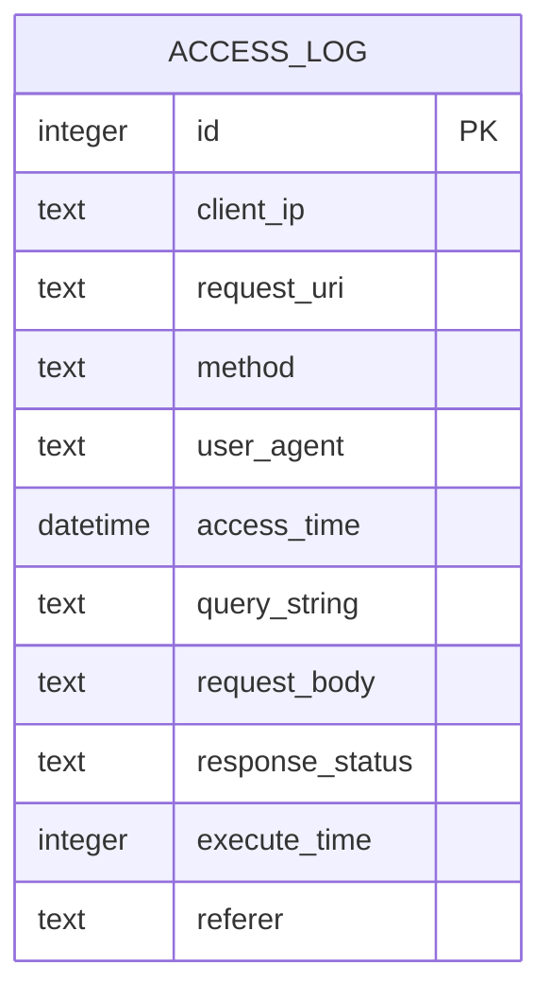
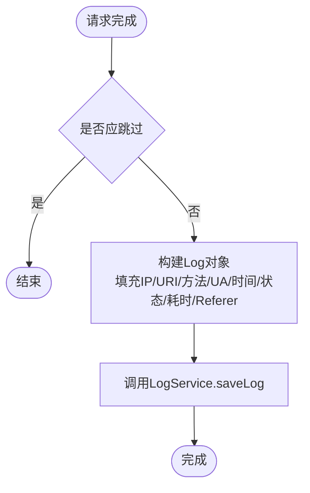
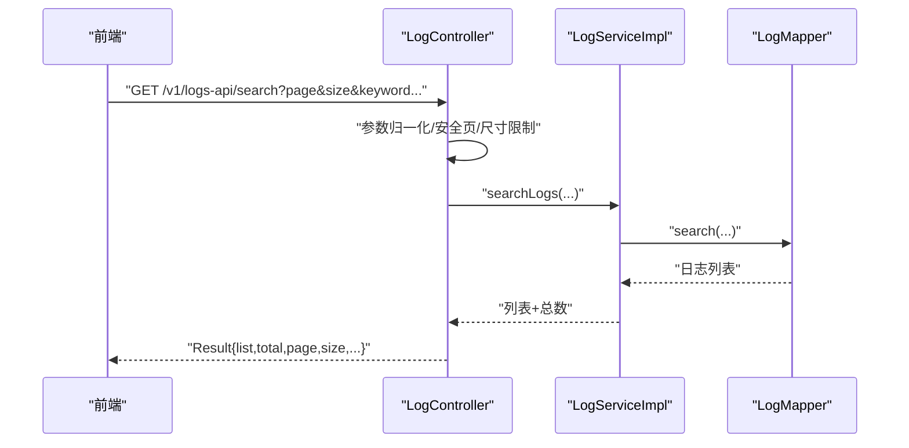
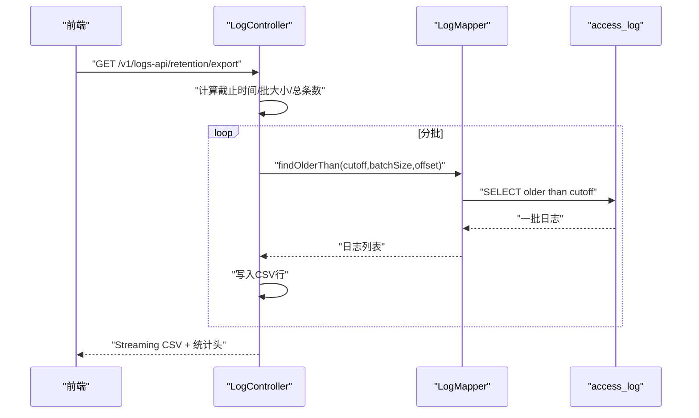
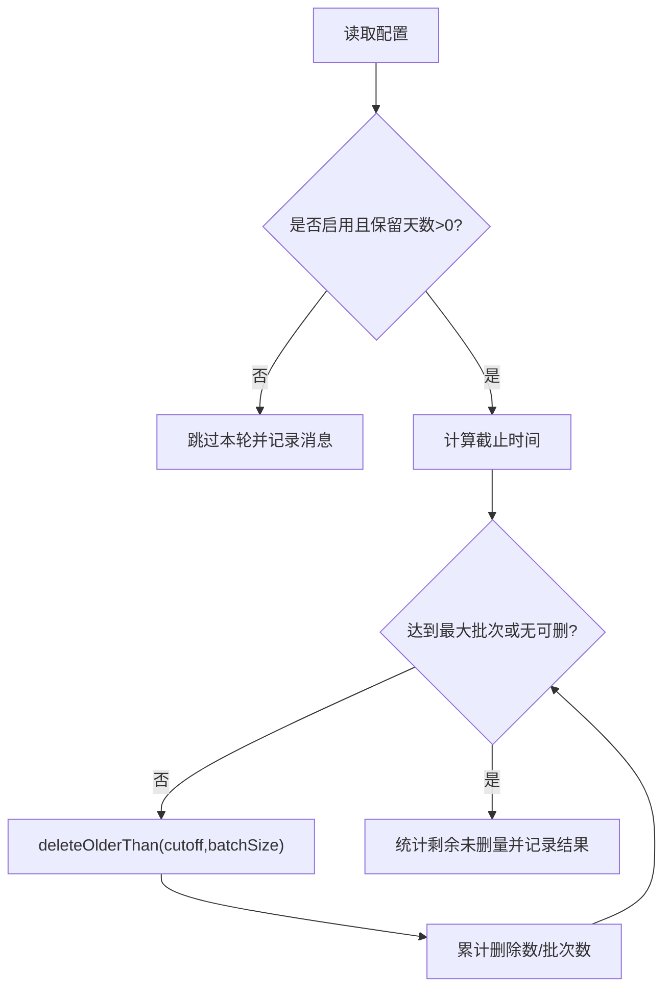
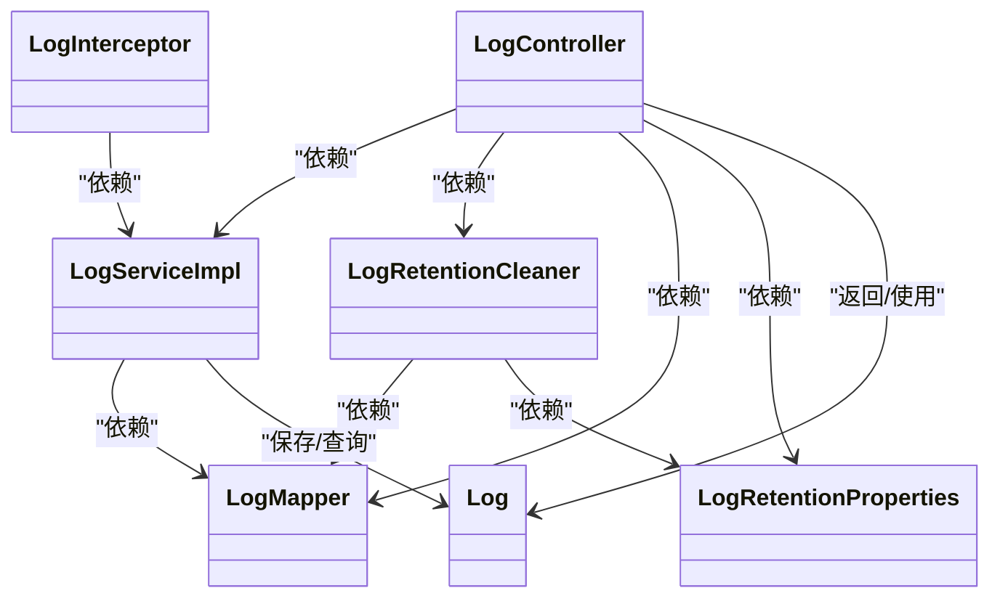

# 审计追踪

<cite>
**本文引用的文件**
- [Log.java](file://backend-repo/src/main/java/com/zjcxph/imgapi/entity/Log.java)
- [LogController.java](file://backend-repo/src/main/java/com/zjcxph/imgapi/controller/LogController.java)
- [LogServiceImpl.java](file://backend-repo/src/main/java/com/zjcxph/imgapi/service/impl/LogServiceImpl.java)
- [LogMapper.java](file://backend-repo/src/main/java/com/zjcxph/imgapi/mapper/LogMapper.java)
- [LogRetentionCleaner.java](file://backend-repo/src/main/java/com/zjcxph/imgapi/scheduler/LogRetentionCleaner.java)
- [LogRetentionProperties.java](file://backend-repo/src/main/java/com/zjcxph/imgapi/config/LogRetentionProperties.java)
- [LogInterceptor.java](file://backend-repo/src/main/java/com/zjcxph/imgapi/interceptors/LogInterceptor.java)
- [application.properties](file://backend-repo/src/main/resources/application.properties)
- [schema.sql](file://mrr-db/schema.sql)
- [LogsView.vue（前端）](file://frontend-repo/src/components/admin/LogsView.vue)
- [logs.ts（前端API）](file://frontend-repo/src/api/modules/logs.ts)
</cite>

## 目录
1. [简介](#简介)
2. [项目结构](#项目结构)
3. [核心组件](#核心组件)
4. [架构总览](#架构总览)
5. [详细组件分析](#详细组件分析)
6. [依赖分析](#依赖分析)
7. [性能考量](#性能考量)
8. [故障排查指南](#故障排查指南)
9. [结论](#结论)
10. [附录](#附录)

## 简介
本文件面向MRR系统的审计追踪子系统，系统性阐述审计日志记录机制、操作类型分类与事件级别定义、用户行为追踪、数据变更记录与系统访问监控、审计日志查询接口与权限控制、审计报告生成与合规性检查、数据完整性验证、审计日志导出与批量处理、审计策略配置与敏感操作标记、风险评估指标，以及存储优化、索引策略与查询性能调优建议。文档以代码为依据，辅以可视化图示帮助非技术读者理解。

## 项目结构
审计追踪子系统由后端控制器、服务层、持久层、拦截器、定时清理器与配置组成，并通过前端界面提供查询与导出能力。数据库表结构定义在schema中，包含访问日志主表与用户/角色等基础表。

**图表来源**
- [LogController.java:32-54](file://backend-repo/src/main/java/com/zjcxph/imgapi/controller/LogController.java#L32-L54)
- [LogServiceImpl.java:11-70](file://backend-repo/src/main/java/com/zjcxph/imgapi/service/impl/LogServiceImpl.java#L11-L70)
- [LogMapper.java:9-165](file://backend-repo/src/main/java/com/zjcxph/imgapi/mapper/LogMapper.java#L9-L165)
- [LogInterceptor.java:15-89](file://backend-repo/src/main/java/com/zjcxph/imgapi/interceptors/LogInterceptor.java#L15-L89)
- [LogRetentionCleaner.java:13-118](file://backend-repo/src/main/java/com/zjcxph/imgapi/scheduler/LogRetentionCleaner.java#L13-L118)
- [LogRetentionProperties.java:5-53](file://backend-repo/src/main/java/com/zjcxph/imgapi/config/LogRetentionProperties.java#L5-L53)
- [Log.java:7-138](file://backend-repo/src/main/java/com/zjcxph/imgapi/entity/Log.java#L7-L138)
- [schema.sql:1-14](file://mrr-db/schema.sql#L1-L14)

**章节来源**
- [LogController.java:32-54](file://backend-repo/src/main/java/com/zjcxph/imgapi/controller/LogController.java#L32-L54)
- [LogServiceImpl.java:11-70](file://backend-repo/src/main/java/com/zjcxph/imgapi/service/impl/LogServiceImpl.java#L11-L70)
- [LogMapper.java:9-165](file://backend-repo/src/main/java/com/zjcxph/imgapi/mapper/LogMapper.java#L9-L165)
- [LogInterceptor.java:15-89](file://backend-repo/src/main/java/com/zjcxph/imgapi/interceptors/LogInterceptor.java#L15-L89)
- [LogRetentionCleaner.java:13-118](file://backend-repo/src/main/java/com/zjcxph/imgapi/scheduler/LogRetentionCleaner.java#L13-L118)
- [LogRetentionProperties.java:5-53](file://backend-repo/src/main/java/com/zjcxph/imgapi/config/LogRetentionProperties.java#L5-L53)
- [Log.java:7-138](file://backend-repo/src/main/java/com/zjcxph/imgapi/entity/Log.java#L7-L138)
- [schema.sql:1-14](file://mrr-db/schema.sql#L1-L14)

## 核心组件
- 实体模型：Log用于承载访问日志字段，包括客户端IP、请求URI、方法、UA、访问时间、查询参数、请求体、响应状态、执行耗时、Referer等。
- 拦截器：LogInterceptor在请求完成后收集必要信息并写入日志表，跳过OPTIONS与静态资源等非关键路径。
- 控制器：LogController提供按ID、按IP、按URI查询，分页列表，搜索（关键词、IP、URI、方法、状态码、时间范围），以及保留期清理与CSV导出接口。
- 服务层：LogServiceImpl封装分页查询、搜索、计数等逻辑，统一调用Mapper。
- 数据映射：LogMapper定义SQL，含插入、分页查询、条件搜索、计数、按条件删除旧数据、按条件导出旧数据等。
- 定时清理：LogRetentionCleaner基于配置周期执行清理，支持批量分批删除与剩余量统计。
- 配置属性：LogRetentionProperties从应用配置读取保留天数、批大小、最大批次、Cron表达式等。
- 前端：LogsView.vue提供过滤、分页、详情查看；logs.ts封装后端接口调用。

**章节来源**
- [Log.java:7-138](file://backend-repo/src/main/java/com/zjcxph/imgapi/entity/Log.java#L7-L138)
- [LogInterceptor.java:15-89](file://backend-repo/src/main/java/com/zjcxph/imgapi/interceptors/LogInterceptor.java#L15-L89)
- [LogController.java:32-244](file://backend-repo/src/main/java/com/zjcxph/imgapi/controller/LogController.java#L32-L244)
- [LogServiceImpl.java:11-70](file://backend-repo/src/main/java/com/zjcxph/imgapi/service/impl/LogServiceImpl.java#L11-L70)
- [LogMapper.java:9-165](file://backend-repo/src/main/java/com/zjcxph/imgapi/mapper/LogMapper.java#L9-L165)
- [LogRetentionCleaner.java:13-118](file://backend-repo/src/main/java/com/zjcxph/imgapi/scheduler/LogRetentionCleaner.java#L13-L118)
- [LogRetentionProperties.java:5-53](file://backend-repo/src/main/java/com/zjcxph/imgapi/config/LogRetentionProperties.java#L5-L53)
- [LogsView.vue（前端）:1-407](file://frontend-repo/src/components/admin/LogsView.vue#L1-L407)
- [logs.ts（前端API）:1-32](file://frontend-repo/src/api/modules/logs.ts#L1-L32)

## 架构总览
审计追踪采用“拦截器采集 + 控制器查询 + 定时清理 + 前端展示”的分层设计。拦截器在请求完成阶段异步落库，控制器提供REST接口，服务层封装业务逻辑，Mapper映射到access_log表，前端通过API进行检索与导出。

**图表来源**
- [LogInterceptor.java:36-58](file://backend-repo/src/main/java/com/zjcxph/imgapi/interceptors/LogInterceptor.java#L36-L58)
- [LogServiceImpl.java:17-20](file://backend-repo/src/main/java/com/zjcxph/imgapi/service/impl/LogServiceImpl.java#L17-L20)
- [LogMapper.java:24-27](file://backend-repo/src/main/java/com/zjcxph/imgapi/mapper/LogMapper.java#L24-L27)
- [LogController.java:65-202](file://backend-repo/src/main/java/com/zjcxph/imgapi/controller/LogController.java#L65-L202)
- [schema.sql:1-14](file://mrr-db/schema.sql#L1-L14)

## 详细组件分析

### 日志实体与表结构
- 字段覆盖：客户端IP、请求URI、方法、UA、访问时间、查询串、请求体、响应状态、执行耗时、Referer。
- 表结构：access_log为主表，包含自增主键与各字段；其他业务表如mr_auth_user等与审计无直接关联。

**图表来源**
- [schema.sql:1-14](file://mrr-db/schema.sql#L1-L14)

**章节来源**
- [Log.java:7-138](file://backend-repo/src/main/java/com/zjcxph/imgapi/entity/Log.java#L7-L138)
- [schema.sql:1-14](file://mrr-db/schema.sql#L1-L14)

### 拦截器与日志采集
- 采集时机：请求完成后afterCompletion阶段，避免阻塞响应。
- 跳过规则：OPTIONS预检、静态资源、Swagger/Actuator/docs等路径。
- IP解析：优先X-Forwarded-For，其次X-Real-IP，最后远端地址。
- 写入内容：除请求体外均采集，请求体为空字符串，便于后续扩展。

**图表来源**
- [LogInterceptor.java:36-58](file://backend-repo/src/main/java/com/zjcxph/imgapi/interceptors/LogInterceptor.java#L36-L58)
- [LogServiceImpl.java:17-20](file://backend-repo/src/main/java/com/zjcxph/imgapi/service/impl/LogServiceImpl.java#L17-L20)

**章节来源**
- [LogInterceptor.java:15-89](file://backend-repo/src/main/java/com/zjcxph/imgapi/interceptors/LogInterceptor.java#L15-L89)
- [LogServiceImpl.java:11-20](file://backend-repo/src/main/java/com/zjcxph/imgapi/service/impl/LogServiceImpl.java#L11-L20)

### 查询接口与权限控制
- 接口清单：
  - GET /v1/logs-api/{id}：按ID查询单条日志
  - GET /v1/logs-api/：分页查询所有日志
  - GET /v1/logs-api/ip/{ip}：按客户端IP分页查询
  - GET /v1/logs-api/uri?uri=...：按URI分页查询
  - GET /v1/logs-api/search：关键词/IP/URI/方法/状态码/时间范围组合查询
  - POST /v1/logs-api/retention/cleanup：手动触发保留期清理
  - GET /v1/logs-api/retention/export：导出超过保留期的日志（CSV）
- 权限控制：后端未在控制器上显式声明鉴权注解，但角色权限中包含log:read，前端仅在管理后台可见。建议结合全局拦截器或方法级鉴权确保访问控制。

**图表来源**
- [LogController.java:150-202](file://backend-repo/src/main/java/com/zjcxph/imgapi/controller/LogController.java#L150-L202)
- [LogServiceImpl.java:46-49](file://backend-repo/src/main/java/com/zjcxph/imgapi/service/impl/LogServiceImpl.java#L46-L49)
- [LogMapper.java:70-113](file://backend-repo/src/main/java/com/zjcxph/imgapi/mapper/LogMapper.java#L70-L113)

**章节来源**
- [LogController.java:56-202](file://backend-repo/src/main/java/com/zjcxph/imgapi/controller/LogController.java#L56-L202)
- [LogServiceImpl.java:27-69](file://backend-repo/src/main/java/com/zjcxph/imgapi/service/impl/LogServiceImpl.java#L27-L69)
- [LogMapper.java:29-163](file://backend-repo/src/main/java/com/zjcxph/imgapi/mapper/LogMapper.java#L29-L163)
- [schema.sql:1-14](file://mrr-db/schema.sql#L1-L14)

### 审计日志导出与批量处理
- 导出接口：GET /v1/logs-api/retention/export，按保留天数计算截止时间，分批读取旧日志并流式写出CSV，设置下载头与统计头。
- 批量策略：从配置读取批大小，循环拉取，直到空集为止；同时返回总条数与截止时间，便于前端展示进度与统计。
- CSV格式：UTF-8带BOM，列名与实体字段一一对应，单元格转义遵循CSV规范。

**图表来源**
- [LogController.java:108-148](file://backend-repo/src/main/java/com/zjcxph/imgapi/controller/LogController.java#L108-L148)
- [LogMapper.java:58-68](file://backend-repo/src/main/java/com/zjcxph/imgapi/mapper/LogMapper.java#L58-L68)

**章节来源**
- [LogController.java:108-148](file://backend-repo/src/main/java/com/zjcxph/imgapi/controller/LogController.java#L108-L148)
- [LogMapper.java:41-68](file://backend-repo/src/main/java/com/zjcxph/imgapi/mapper/LogMapper.java#L41-L68)

### 定时清理与保留策略
- 触发方式：Cron表达式定时任务，默认每日凌晨2:30执行；支持手动cleanupNow与指定截止时间。
- 清理逻辑：根据保留天数计算截止时间，循环删除，每批上限由配置决定；统计删除数量、剩余未删数量与批次数。
- 配置项：启用开关、Cron、保留天数、批大小、每轮最大批次。

**图表来源**
- [LogRetentionCleaner.java:39-117](file://backend-repo/src/main/java/com/zjcxph/imgapi/scheduler/LogRetentionCleaner.java#L39-L117)
- [LogRetentionProperties.java:8-12](file://backend-repo/src/main/java/com/zjcxph/imgapi/config/LogRetentionProperties.java#L8-L12)

**章节来源**
- [LogRetentionCleaner.java:26-117](file://backend-repo/src/main/java/com/zjcxph/imgapi/scheduler/LogRetentionCleaner.java#L26-L117)
- [LogRetentionProperties.java:5-53](file://backend-repo/src/main/java/com/zjcxph/imgapi/config/LogRetentionProperties.java#L5-L53)

### 前端交互与展示
- 过滤条件：关键词（URI/IP/UA/Body）、客户端IP、请求URI、方法、状态码、时间范围。
- 展示字段：访问时间、客户端IP、方法、请求URI、状态码、耗时；支持展开查看UA、QS、Referer与请求体。
- 分页与刷新：支持页码与页大小切换，提供刷新按钮。
- 导出：前端调用后端导出接口，以Blob形式下载CSV。

**章节来源**
- [LogsView.vue（前端）:19-136](file://frontend-repo/src/components/admin/LogsView.vue#L19-L136)
- [logs.ts（前端API）:3-31](file://frontend-repo/src/api/modules/logs.ts#L3-L31)

## 依赖分析
- 组件耦合：控制器依赖服务与配置；服务依赖Mapper；拦截器依赖服务；清理器依赖Mapper与配置；前端依赖API模块。
- 关系图：

**图表来源**
- [LogInterceptor.java:15-58](file://backend-repo/src/main/java/com/zjcxph/imgapi/interceptors/LogInterceptor.java#L15-L58)
- [LogController.java:39-53](file://backend-repo/src/main/java/com/zjcxph/imgapi/controller/LogController.java#L39-L53)
- [LogServiceImpl.java:14-15](file://backend-repo/src/main/java/com/zjcxph/imgapi/service/impl/LogServiceImpl.java#L14-L15)
- [LogRetentionCleaner.java:21-24](file://backend-repo/src/main/java/com/zjcxph/imgapi/scheduler/LogRetentionCleaner.java#L21-L24)
- [LogRetentionProperties.java:5-53](file://backend-repo/src/main/java/com/zjcxph/imgapi/config/LogRetentionProperties.java#L5-L53)
- [Log.java:7-138](file://backend-repo/src/main/java/com/zjcxph/imgapi/entity/Log.java#L7-L138)

**章节来源**
- [LogInterceptor.java:15-58](file://backend-repo/src/main/java/com/zjcxph/imgapi/interceptors/LogInterceptor.java#L15-L58)
- [LogController.java:39-53](file://backend-repo/src/main/java/com/zjcxph/imgapi/controller/LogController.java#L39-L53)
- [LogServiceImpl.java:14-15](file://backend-repo/src/main/java/com/zjcxph/imgapi/service/impl/LogServiceImpl.java#L14-L15)
- [LogRetentionCleaner.java:21-24](file://backend-repo/src/main/java/com/zjcxph/imgapi/scheduler/LogRetentionCleaner.java#L21-L24)
- [LogRetentionProperties.java:5-53](file://backend-repo/src/main/java/com/zjcxph/imgapi/config/LogRetentionProperties.java#L5-L53)
- [Log.java:7-138](file://backend-repo/src/main/java/com/zjcxph/imgapi/entity/Log.java#L7-L138)

## 性能考量
- 存储层
  - 表结构：access_log包含常用查询字段，适合按时间倒序分页与按IP/URI过滤。
  - 建议索引：对access_time建立索引以加速时间范围查询；对client_ip、request_uri建立索引以提升过滤效率；对response_status建立索引以支持状态码筛选。
- 查询层
  - 分页：服务层与Mapper均支持limit/offset，避免一次性加载全量数据。
  - 搜索：MyBatis动态SQL支持多条件组合，注意在高并发下对索引的利用。
- 写入层
  - 拦截器写入在请求完成后进行，尽量减少对主链路的影响；可考虑异步队列进一步削峰。
- 清理层
  - 分批删除：通过batchSize与maxBatchesPerRun控制单次删除量，避免长事务锁表。
  - 截止时间：按保留天数计算，避免全表扫描。
- 导出层
  - 流式输出：使用StreamingResponseBody逐批写出，降低内存占用。
  - 批次与总条数：先countOlderThan再分批读取，前端可获知总量与进度。

**章节来源**
- [LogMapper.java:29-163](file://backend-repo/src/main/java/com/zjcxph/imgapi/mapper/LogMapper.java#L29-L163)
- [LogRetentionCleaner.java:43-84](file://backend-repo/src/main/java/com/zjcxph/imgapi/scheduler/LogRetentionCleaner.java#L43-L84)
- [LogController.java:108-148](file://backend-repo/src/main/java/com/zjcxph/imgapi/controller/LogController.java#L108-L148)

## 故障排查指南
- 常见问题
  - 查询无结果：确认时间范围、关键字是否正确；检查是否被跳过（Swagger/Actuator等路径默认不记录）。
  - 导出为空：确认保留天数配置是否大于0；检查清理任务是否已执行；核对截止时间。
  - 清理未生效：检查Cron配置与系统时区；确认启用开关；查看日志清理结果中的剩余量。
  - 响应缓慢：关注access_time、client_ip、request_uri等字段是否建立索引；调整批大小与最大批次。
- 参考实现
  - 控制器参数校验与异常返回：对非法页/尺寸进行安全处理；导出接口对无效配置返回400。
  - 清理器异常捕获与日志记录：失败时返回失败状态与错误信息，便于定位。

**章节来源**
- [LogController.java:65-72](file://backend-repo/src/main/java/com/zjcxph/imgapi/controller/LogController.java#L65-L72)
- [LogController.java:94-106](file://backend-repo/src/main/java/com/zjcxph/imgapi/controller/LogController.java#L94-L106)
- [LogController.java:108-148](file://backend-repo/src/main/java/com/zjcxph/imgapi/controller/LogController.java#L108-L148)
- [LogRetentionCleaner.java:110-114](file://backend-repo/src/main/java/com/zjcxph/imgapi/scheduler/LogRetentionCleaner.java#L110-L114)

## 结论
MRR审计追踪系统以拦截器为核心采集点，配合控制器REST接口、服务层与Mapper实现查询、计数与清理，前端提供直观的检索与导出能力。系统具备保留期配置、分批清理与流式导出等特性，满足合规与运维需求。建议在生产环境完善索引策略、访问控制与异步写入，持续优化查询性能与数据完整性。

## 附录

### 审计日志查询接口一览
- 获取单条日志：GET /v1/logs-api/{id}
- 分页查询：GET /v1/logs-api/?page=&size=
- 按客户端IP：GET /v1/logs-api/ip/{ip}?page=&size=
- 按请求URI：GET /v1/logs-api/uri?uri=&page=&size=
- 组合搜索：GET /v1/logs-api/search?page=&size=&keyword=&clientIp=&requestUri=&method=&responseStatus=&startTime=&endTime=
- 手动清理：POST /v1/logs-api/retention/cleanup?cutoff=
- 导出旧日志：GET /v1/logs-api/retention/export

**章节来源**
- [LogController.java:56-202](file://backend-repo/src/main/java/com/zjcxph/imgapi/controller/LogController.java#L56-L202)

### 审计策略配置项
- app.log-retention.enabled：是否启用清理
- app.log-retention.cron：Cron表达式
- app.log-retention.retention-days：保留天数
- app.log-retention.batch-size：单批删除条数
- app.log-retention.max-batches-per-run：每轮最大批次

**章节来源**
- [application.properties:40-45](file://backend-repo/src/main/resources/application.properties#L40-L45)
- [LogRetentionProperties.java:8-12](file://backend-repo/src/main/java/com/zjcxph/imgapi/config/LogRetentionProperties.java#L8-L12)

### 前端过滤与展示要点
- 支持的过滤：关键词、客户端IP、请求URI、方法、状态码、时间范围
- 展示字段：访问时间、客户端IP、方法、请求URI、状态码、耗时
- 导出：Blob下载CSV，包含UTF-8 BOM与列头

**章节来源**
- [LogsView.vue（前端）:19-136](file://frontend-repo/src/components/admin/LogsView.vue#L19-L136)
- [logs.ts（前端API）:3-31](file://frontend-repo/src/api/modules/logs.ts#L3-L31)