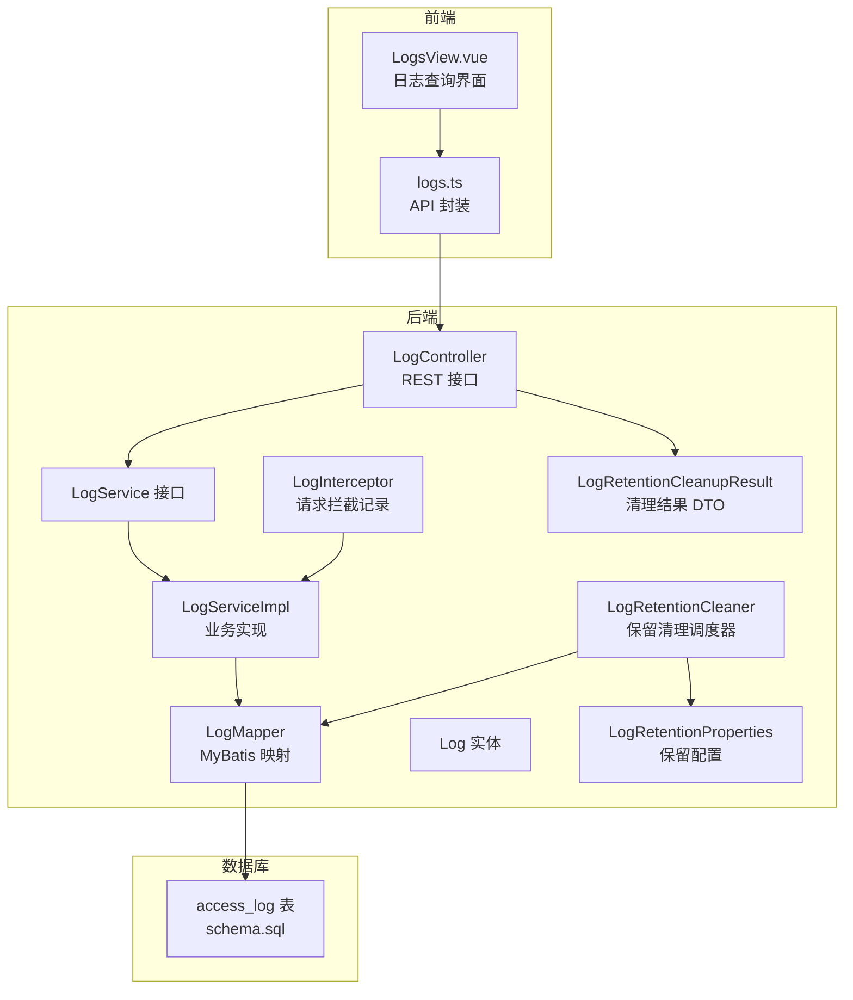
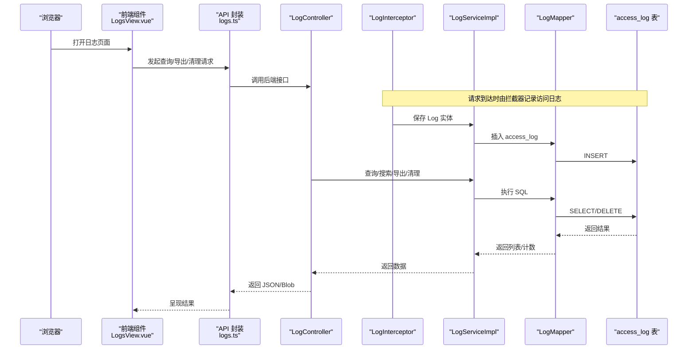
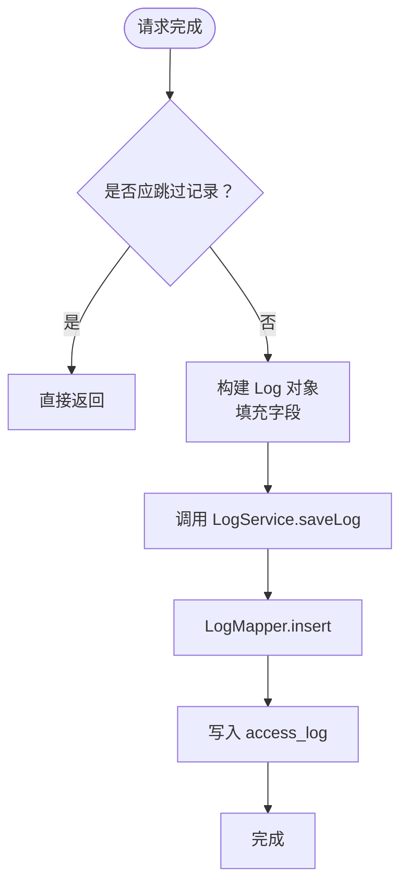
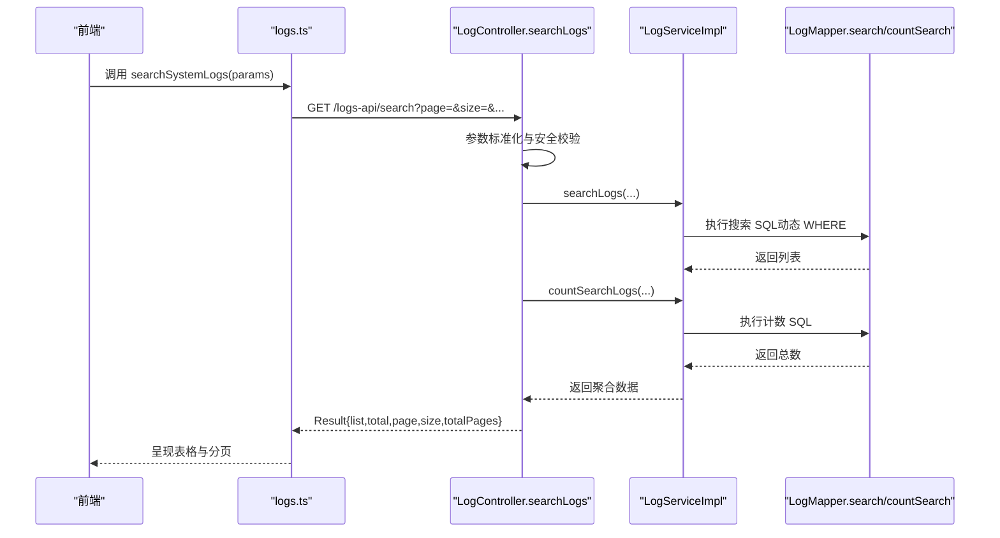
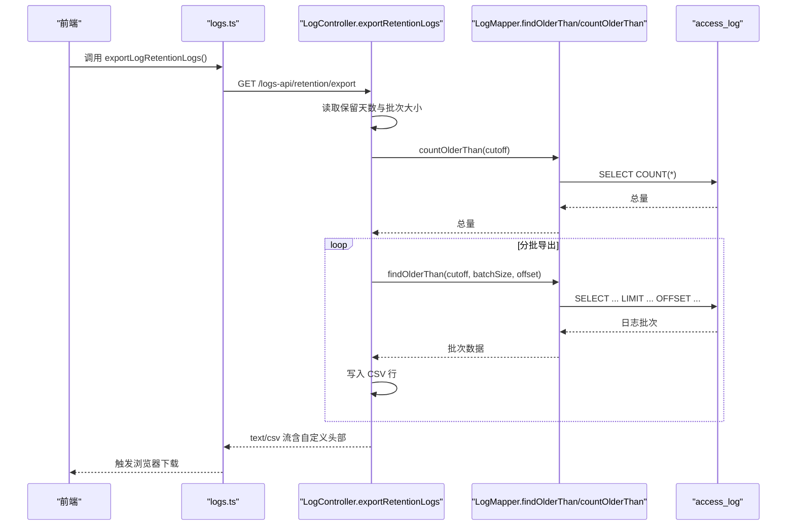
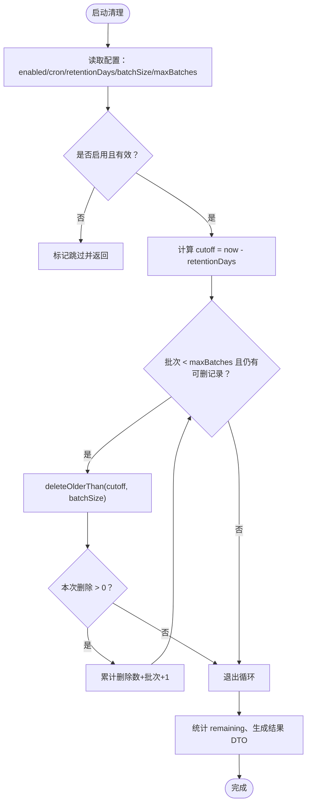
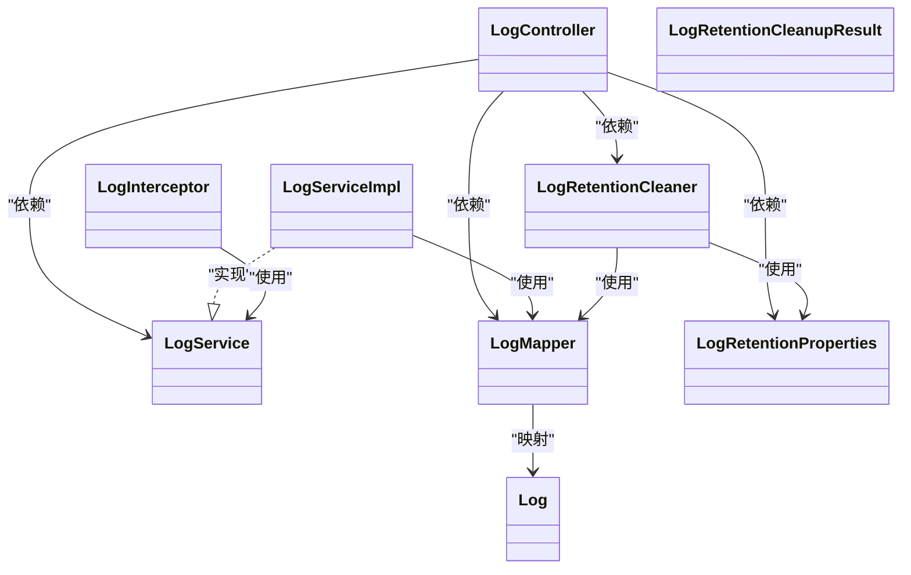

# 日志管理

<cite>
**本文引用的文件**
- [LogController.java](file://backend-repo/src/main/java/com/zjcxph/imgapi/controller/LogController.java)
- [LogService.java](file://backend-repo/src/main/java/com/zjcxph/imgapi/service/LogService.java)
- [LogServiceImpl.java](file://backend-repo/src/main/java/com/zjcxph/imgapi/service/impl/LogServiceImpl.java)
- [Log.java](file://backend-repo/src/main/java/com/zjcxph/imgapi/entity/Log.java)
- [LogMapper.java](file://backend-repo/src/main/java/com/zjcxph/imgapi/mapper/LogMapper.java)
- [LogRetentionCleaner.java](file://backend-repo/src/main/java/com/zjcxph/imgapi/scheduler/LogRetentionCleaner.java)
- [LogRetentionProperties.java](file://backend-repo/src/main/java/com/zjcxph/imgapi/config/LogRetentionProperties.java)
- [LogRetentionCleanupResult.java](file://backend-repo/src/main/java/com/zjcxph/imgapi/dto/resp/LogRetentionCleanupResult.java)
- [LogInterceptor.java](file://backend-repo/src/main/java/com/zjcxph/imgapi/interceptors/LogInterceptor.java)
- [schema.sql](file://mrr-db/schema.sql)
- [logs.ts](file://frontend-repo/src/api/logs.ts)
- [LogsView.vue](file://frontend-repo/src/components/admin/LogsView.vue)
</cite>

## 目录
1. [简介](#简介)
2. [项目结构](#项目结构)
3. [核心组件](#核心组件)
4. [架构总览](#架构总览)
5. [详细组件分析](#详细组件分析)
6. [依赖分析](#依赖分析)
7. [性能考虑](#性能考虑)
8. [故障排查指南](#故障排查指南)
9. [结论](#结论)
10. [附录](#附录)

## 简介
本文件为 MRR 系统的日志管理模块提供完整技术文档，覆盖访问日志记录机制、日志格式与字段定义、日志保留策略与自动清理、日志查询与导出接口、清理结果报告与统计、以及错误处理与异常恢复策略。文档同时给出前后端交互流程图与关键类图，帮助开发者与运维人员快速理解并正确使用该模块。

## 项目结构
日志管理相关代码主要分布在后端 Spring Boot 工程的 controller、service、mapper、entity、scheduler、config 与拦截器等包中；前端 Vue 工程提供日志查询界面与 API 调用封装。

图表来源
- [LogController.java:32-54](file://backend-repo/src/main/java/com/zjcxph/imgapi/controller/LogController.java#L32-L54)
- [LogServiceImpl.java:11-20](file://backend-repo/src/main/java/com/zjcxph/imgapi/service/impl/LogServiceImpl.java#L11-L20)
- [LogMapper.java:9-27](file://backend-repo/src/main/java/com/zjcxph/imgapi/mapper/LogMapper.java#L9-L27)
- [Log.java:8-19](file://backend-repo/src/main/java/com/zjcxph/imgapi/entity/Log.java#L8-L19)
- [LogInterceptor.java:15-58](file://backend-repo/src/main/java/com/zjcxph/imgapi/interceptors/LogInterceptor.java#L15-L58)
- [LogRetentionCleaner.java:14-24](file://backend-repo/src/main/java/com/zjcxph/imgapi/scheduler/LogRetentionCleaner.java#L14-L24)
- [LogRetentionProperties.java:5-12](file://backend-repo/src/main/java/com/zjcxph/imgapi/config/LogRetentionProperties.java#L5-L12)
- [LogRetentionCleanupResult.java:7-21](file://backend-repo/src/main/java/com/zjcxph/imgapi/dto/resp/LogRetentionCleanupResult.java#L7-L21)
- [schema.sql:1-14](file://mrr-db/schema.sql#L1-L14)
- [logs.ts:1-17](file://frontend-repo/src/api/logs.ts#L1-L17)
- [LogsView.vue:1-407](file://frontend-repo/src/components/admin/LogsView.vue#L1-L407)

章节来源
- [LogController.java:32-54](file://backend-repo/src/main/java/com/zjcxph/imgapi/controller/LogController.java#L32-L54)
- [LogServiceImpl.java:11-20](file://backend-repo/src/main/java/com/zjcxph/imgapi/service/impl/LogServiceImpl.java#L11-L20)
- [LogMapper.java:9-27](file://backend-repo/src/main/java/com/zjcxph/imgapi/mapper/LogMapper.java#L9-L27)
- [Log.java:8-19](file://backend-repo/src/main/java/com/zjcxph/imgapi/entity/Log.java#L8-L19)
- [LogInterceptor.java:15-58](file://backend-repo/src/main/java/com/zjcxph/imgapi/interceptors/LogInterceptor.java#L15-L58)
- [LogRetentionCleaner.java:14-24](file://backend-repo/src/main/java/com/zjcxph/imgapi/scheduler/LogRetentionCleaner.java#L14-L24)
- [LogRetentionProperties.java:5-12](file://backend-repo/src/main/java/com/zjcxph/imgapi/config/LogRetentionProperties.java#L5-L12)
- [LogRetentionCleanupResult.java:7-21](file://backend-repo/src/main/java/com/zjcxph/imgapi/dto/resp/LogRetentionCleanupResult.java#L7-L21)
- [schema.sql:1-14](file://mrr-db/schema.sql#L1-L14)
- [logs.ts:1-17](file://frontend-repo/src/api/logs.ts#L1-L17)
- [LogsView.vue:1-407](file://frontend-repo/src/components/admin/LogsView.vue#L1-L407)

## 核心组件
- 访问日志实体：定义日志字段模型，用于持久化与传输。
- 拦截器：在请求完成后收集必要信息并保存到数据库。
- Mapper/Service/Controller：提供日志查询、搜索、分页、导出与保留清理接口。
- 清理调度器：按配置周期性或手动执行过期日志删除。
- 配置与结果 DTO：统一管理保留策略参数与清理结果返回。

章节来源
- [Log.java:8-19](file://backend-repo/src/main/java/com/zjcxph/imgapi/entity/Log.java#L8-L19)
- [LogInterceptor.java:15-58](file://backend-repo/src/main/java/com/zjcxph/imgapi/interceptors/LogInterceptor.java#L15-L58)
- [LogMapper.java:9-27](file://backend-repo/src/main/java/com/zjcxph/imgapi/mapper/LogMapper.java#L9-L27)
- [LogService.java:7-18](file://backend-repo/src/main/java/com/zjcxph/imgapi/service/LogService.java#L7-L18)
- [LogServiceImpl.java:11-70](file://backend-repo/src/main/java/com/zjcxph/imgapi/service/impl/LogServiceImpl.java#L11-L70)
- [LogController.java:32-244](file://backend-repo/src/main/java/com/zjcxph/imgapi/controller/LogController.java#L32-L244)
- [LogRetentionCleaner.java:14-117](file://backend-repo/src/main/java/com/zjcxph/imgapi/scheduler/LogRetentionCleaner.java#L14-L117)
- [LogRetentionProperties.java:5-53](file://backend-repo/src/main/java/com/zjcxph/imgapi/config/LogRetentionProperties.java#L5-L53)
- [LogRetentionCleanupResult.java:7-118](file://backend-repo/src/main/java/com/zjcxph/imgapi/dto/resp/LogRetentionCleanupResult.java#L7-L118)

## 架构总览
下图展示从浏览器到后端控制器、拦截器、服务层、持久层与数据库的整体调用链路，以及保留清理的定时任务流程。

图表来源
- [LogsView.vue:162-316](file://frontend-repo/src/components/admin/LogsView.vue#L162-L316)
- [logs.ts:3-17](file://frontend-repo/src/api/logs.ts#L3-L17)
- [LogController.java:65-202](file://backend-repo/src/main/java/com/zjcxph/imgapi/controller/LogController.java#L65-L202)
- [LogInterceptor.java:37-58](file://backend-repo/src/main/java/com/zjcxph/imgapi/interceptors/LogInterceptor.java#L37-L58)
- [LogServiceImpl.java:17-69](file://backend-repo/src/main/java/com/zjcxph/imgapi/service/impl/LogServiceImpl.java#L17-L69)
- [LogMapper.java:24-163](file://backend-repo/src/main/java/com/zjcxph/imgapi/mapper/LogMapper.java#L24-L163)
- [schema.sql:1-14](file://mrr-db/schema.sql#L1-L14)

## 详细组件分析

### 访问日志记录机制
- 拦截器在请求完成阶段采集客户端 IP、URI、方法、UA、QS、Referer、响应状态、执行时间等，并持久化为 Log 实体。
- 支持跳过特定请求（如 OPTIONS、静态资源、Swagger/Actuator 等），避免噪音日志。
- 客户端 IP 优先级：X-Forwarded-For → X-Real-IP → 远端地址。

图表来源
- [LogInterceptor.java:37-58](file://backend-repo/src/main/java/com/zjcxph/imgapi/interceptors/LogInterceptor.java#L37-L58)
- [LogServiceImpl.java:18-20](file://backend-repo/src/main/java/com/zjcxph/imgapi/service/impl/LogServiceImpl.java#L18-L20)
- [LogMapper.java:24-27](file://backend-repo/src/main/java/com/zjcxph/imgapi/mapper/LogMapper.java#L24-L27)
- [schema.sql:1-14](file://mrr-db/schema.sql#L1-L14)

章节来源
- [LogInterceptor.java:15-89](file://backend-repo/src/main/java/com/zjcxph/imgapi/interceptors/LogInterceptor.java#L15-L89)
- [LogServiceImpl.java:17-20](file://backend-repo/src/main/java/com/zjcxph/imgapi/service/impl/LogServiceImpl.java#L17-L20)
- [LogMapper.java:24-27](file://backend-repo/src/main/java/com/zjcxph/imgapi/mapper/LogMapper.java#L24-L27)
- [schema.sql:1-14](file://mrr-db/schema.sql#L1-L14)

### 日志格式与字段定义
- 字段清单（对应数据库表）：id、client_ip、request_uri、method、user_agent、access_time、query_string、request_body、response_status、execute_time、referer。
- 字段类型：整型、文本、日期时间、整型（执行时间毫秒）。
- 前端展示字段：访问时间、客户端 IP、方法、请求 URI、状态码、耗时、扩展详情（UA、QS、Referer、Request Body）。

章节来源
- [schema.sql:1-14](file://mrr-db/schema.sql#L1-L14)
- [Log.java:8-19](file://backend-repo/src/main/java/com/zjcxph/imgapi/entity/Log.java#L8-L19)
- [LogsView.vue:80-158](file://frontend-repo/src/components/admin/LogsView.vue#L80-L158)

### 日志查询接口与过滤条件
- 分页参数：page（默认 1）、size（默认 20，最大 200）。
- 关键词搜索：支持对客户端 IP、URI、QS、UA、Body、Referer 的模糊匹配。
- 条件过滤：clientIp、requestUri、method、responseStatus、startTime、endTime。
- 结果结构：list、total、page、size、totalPages。

图表来源
- [logs.ts:3-5](file://frontend-repo/src/api/logs.ts#L3-L5)
- [LogController.java:150-202](file://backend-repo/src/main/java/com/zjcxph/imgapi/controller/LogController.java#L150-L202)
- [LogServiceImpl.java:46-69](file://backend-repo/src/main/java/com/zjcxph/imgapi/service/impl/LogServiceImpl.java#L46-L69)
- [LogMapper.java:70-154](file://backend-repo/src/main/java/com/zjcxph/imgapi/mapper/LogMapper.java#L70-L154)

章节来源
- [LogController.java:150-202](file://backend-repo/src/main/java/com/zjcxph/imgapi/controller/LogController.java#L150-L202)
- [LogServiceImpl.java:46-69](file://backend-repo/src/main/java/com/zjcxph/imgapi/service/impl/LogServiceImpl.java#L46-L69)
- [LogMapper.java:70-154](file://backend-repo/src/main/java/com/zjcxph/imgapi/mapper/LogMapper.java#L70-L154)
- [logs.ts:3-5](file://frontend-repo/src/api/logs.ts#L3-L5)

### 日志导出功能（CSV）
- 导出范围：基于保留天数计算截止时间，导出早于该时间的所有日志。
- 导出方式：服务端流式输出 CSV，逐批读取并写入，设置 Content-Disposition 与自定义头部（导出总量、截止时间）。
- 字段顺序：id、client_ip、request_uri、method、user_agent、access_time、query_string、request_body、response_status、execute_time、referer。
- 批次控制：受保留配置中的 batch_size 影响，避免一次性读取过多导致内存压力。

图表来源
- [logs.ts:15-17](file://frontend-repo/src/api/logs.ts#L15-L17)
- [LogController.java:108-148](file://backend-repo/src/main/java/com/zjcxph/imgapi/controller/LogController.java#L108-L148)
- [LogMapper.java:53-68](file://backend-repo/src/main/java/com/zjcxph/imgapi/mapper/LogMapper.java#L53-L68)
- [LogRetentionProperties.java:30-44](file://backend-repo/src/main/java/com/zjcxph/imgapi/config/LogRetentionProperties.java#L30-L44)

章节来源
- [LogController.java:108-148](file://backend-repo/src/main/java/com/zjcxph/imgapi/controller/LogController.java#L108-L148)
- [LogMapper.java:53-68](file://backend-repo/src/main/java/com/zjcxph/imgapi/mapper/LogMapper.java#L53-L68)
- [LogRetentionProperties.java:30-44](file://backend-repo/src/main/java/com/zjcxph/imgapi/config/LogRetentionProperties.java#L30-L44)
- [logs.ts:15-17](file://frontend-repo/src/api/logs.ts#L15-L17)

### 日志保留策略与自动清理
- 启用开关与计划任务：通过配置启用/禁用，cron 表达式控制每日执行时间。
- 截止时间：默认以“当前时间 - 保留天数”为准；也可手动指定截止时间触发清理。
- 批次控制：单次最多删除 maxBatchesPerRun 批，每批删除 batchSize 条，避免长时间锁表。
- 结果报告：返回清理是否成功、是否跳过、删除数量、剩余未删条目、批次数、执行时间、截止时间等。

图表来源
- [LogRetentionCleaner.java:26-117](file://backend-repo/src/main/java/com/zjcxph/imgapi/scheduler/LogRetentionCleaner.java#L26-L117)
- [LogRetentionProperties.java:8-52](file://backend-repo/src/main/java/com/zjcxph/imgapi/config/LogRetentionProperties.java#L8-L52)
- [LogRetentionCleanupResult.java:7-118](file://backend-repo/src/main/java/com/zjcxph/imgapi/dto/resp/LogRetentionCleanupResult.java#L7-L118)
- [LogMapper.java:41-56](file://backend-repo/src/main/java/com/zjcxph/imgapi/mapper/LogMapper.java#L41-L56)

章节来源
- [LogRetentionCleaner.java:26-117](file://backend-repo/src/main/java/com/zjcxph/imgapi/scheduler/LogRetentionCleaner.java#L26-L117)
- [LogRetentionProperties.java:8-52](file://backend-repo/src/main/java/com/zjcxph/imgapi/config/LogRetentionProperties.java#L8-L52)
- [LogRetentionCleanupResult.java:7-118](file://backend-repo/src/main/java/com/zjcxph/imgapi/dto/resp/LogRetentionCleanupResult.java#L7-L118)
- [LogMapper.java:41-56](file://backend-repo/src/main/java/com/zjcxph/imgapi/mapper/LogMapper.java#L41-L56)

### 日志保留清理结果报告与统计
- 报告字段：enabled、skipped、success、message、retentionDays、batchSize、maxBatchesPerRun、executedAt、cutoff、deleted、remainingOlderThanCutoff、batches。
- 统计维度：本次删除条数、剩余待删条数、实际执行批次、是否达到最大批次限制。

章节来源
- [LogRetentionCleanupResult.java:7-118](file://backend-repo/src/main/java/com/zjcxph/imgapi/dto/resp/LogRetentionCleanupResult.java#L7-L118)
- [LogRetentionCleaner.java:39-117](file://backend-repo/src/main/java/com/zjcxph/imgapi/scheduler/LogRetentionCleaner.java#L39-L117)

### 日志保留配置参数与并发处理
- 配置项：
  - enabled：是否启用保留清理
  - cron：Quartz 表达式，控制执行频率
  - retentionDays：保留天数
  - batchSize：单批删除条数
  - maxBatchesPerRun：单次运行最大批次
- 并发处理：清理过程为单线程循环删除，避免重复执行冲突；若达到最大批次仍存在旧数据，将在下次运行继续处理。

章节来源
- [LogRetentionProperties.java:8-52](file://backend-repo/src/main/java/com/zjcxph/imgapi/config/LogRetentionProperties.java#L8-L52)
- [LogRetentionCleaner.java:26-117](file://backend-repo/src/main/java/com/zjcxph/imgapi/scheduler/LogRetentionCleaner.java#L26-L117)

### 日志完整性验证、错误处理与异常恢复
- 完整性：拦截器在请求完成后记录，确保大多数请求均有日志；对 OPTIONS、静态资源、Swagger/Actuator 等进行白名单跳过，减少冗余。
- 错误处理：查询接口对 page/size 进行边界保护；导出接口在保留天数无效时返回 400；清理接口捕获异常并返回失败状态与消息。
- 异常恢复：清理失败会记录错误日志并返回失败结果；建议通过手动触发清理接口进行重试或调整批次参数。

章节来源
- [LogInterceptor.java:60-77](file://backend-repo/src/main/java/com/zjcxph/imgapi/interceptors/LogInterceptor.java#L60-L77)
- [LogController.java:108-113](file://backend-repo/src/main/java/com/zjcxph/imgapi/controller/LogController.java#L108-L113)
- [LogRetentionCleaner.java:110-114](file://backend-repo/src/main/java/com/zjcxph/imgapi/scheduler/LogRetentionCleaner.java#L110-L114)

## 依赖分析
- 控制器依赖服务、清理器、映射器与配置对象。
- 服务实现依赖映射器。
- 清理器依赖映射器与配置对象。
- 前端通过 API 封装调用后端接口。

图表来源
- [LogController.java:39-53](file://backend-repo/src/main/java/com/zjcxph/imgapi/controller/LogController.java#L39-L53)
- [LogServiceImpl.java:11-15](file://backend-repo/src/main/java/com/zjcxph/imgapi/service/impl/LogServiceImpl.java#L11-L15)
- [LogRetentionCleaner.java:18-23](file://backend-repo/src/main/java/com/zjcxph/imgapi/scheduler/LogRetentionCleaner.java#L18-L23)
- [LogRetentionProperties.java:5-53](file://backend-repo/src/main/java/com/zjcxph/imgapi/config/LogRetentionProperties.java#L5-L53)
- [LogRetentionCleanupResult.java:7-118](file://backend-repo/src/main/java/com/zjcxph/imgapi/dto/resp/LogRetentionCleanupResult.java#L7-L118)
- [LogInterceptor.java:18-19](file://backend-repo/src/main/java/com/zjcxph/imgapi/interceptors/LogInterceptor.java#L18-L19)
- [Log.java:8-19](file://backend-repo/src/main/java/com/zjcxph/imgapi/entity/Log.java#L8-L19)

章节来源
- [LogController.java:39-53](file://backend-repo/src/main/java/com/zjcxph/imgapi/controller/LogController.java#L39-L53)
- [LogServiceImpl.java:11-15](file://backend-repo/src/main/java/com/zjcxph/imgapi/service/impl/LogServiceImpl.java#L11-L15)
- [LogRetentionCleaner.java:18-23](file://backend-repo/src/main/java/com/zjcxph/imgapi/scheduler/LogRetentionCleaner.java#L18-L23)
- [LogRetentionProperties.java:5-53](file://backend-repo/src/main/java/com/zjcxph/imgapi/config/LogRetentionProperties.java#L5-L53)
- [LogRetentionCleanupResult.java:7-118](file://backend-repo/src/main/java/com/zjcxph/imgapi/dto/resp/LogRetentionCleanupResult.java#L7-L118)
- [LogInterceptor.java:18-19](file://backend-repo/src/main/java/com/zjcxph/imgapi/interceptors/LogInterceptor.java#L18-L19)
- [Log.java:8-19](file://backend-repo/src/main/java/com/zjcxph/imgapi/entity/Log.java#L8-L19)

## 性能考虑
- 分页与上限：查询接口对 size 设置最大值，防止大页导致内存压力。
- 批次删除：清理采用分批删除，避免长事务与锁竞争。
- 流式导出：导出接口使用流式写入，避免一次性加载大量数据。
- 索引建议：根据查询场景（client_ip/request_uri/access_time）评估是否需要索引优化（当前 schema 未见显式索引，可根据实际查询热点评估）。

章节来源
- [LogController.java:36-37](file://backend-repo/src/main/java/com/zjcxph/imgapi/controller/LogController.java#L36-L37)
- [LogRetentionCleaner.java:44-45](file://backend-repo/src/main/java/com/zjcxph/imgapi/scheduler/LogRetentionCleaner.java#L44-L45)
- [LogController.java:120-139](file://backend-repo/src/main/java/com/zjcxph/imgapi/controller/LogController.java#L120-L139)

## 故障排查指南
- 查询无结果：检查 page/size 是否过大，确认过滤条件是否过于严格。
- 导出为空：确认保留天数配置是否大于 0，检查 cutoff 是否合理。
- 清理未生效：确认 enabled 是否开启，cron 是否正确，观察日志输出与返回的 remainingOlderThanCutoff。
- 性能问题：适当降低 batchSize 或 maxBatchesPerRun，或增加数据库索引（视查询热点而定）。

章节来源
- [LogController.java:108-113](file://backend-repo/src/main/java/com/zjcxph/imgapi/controller/LogController.java#L108-L113)
- [LogRetentionCleaner.java:51-64](file://backend-repo/src/main/java/com/zjcxph/imgapi/scheduler/LogRetentionCleaner.java#L51-L64)
- [LogRetentionCleaner.java:110-114](file://backend-repo/src/main/java/com/zjcxph/imgapi/scheduler/LogRetentionCleaner.java#L110-L114)

## 结论
MRR 日志管理模块通过拦截器自动记录访问日志、提供灵活的查询与导出能力，并以可配置的保留策略与分批清理机制保障系统长期稳定运行。结合前端可视化界面，管理员可以高效地检索、分析与清理历史日志，满足合规与运维需求。

## 附录
- 数据库表结构参考：access_log（字段与类型见 schema.sql）。
- 前端日志页面：支持关键词、IP、URI、方法、状态码、时间范围过滤与分页展示。

章节来源
- [schema.sql:1-14](file://mrr-db/schema.sql#L1-L14)
- [LogsView.vue:19-78](file://frontend-repo/src/components/admin/LogsView.vue#L19-L78)