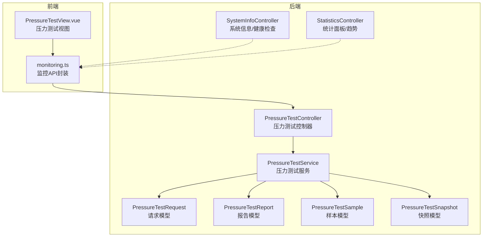
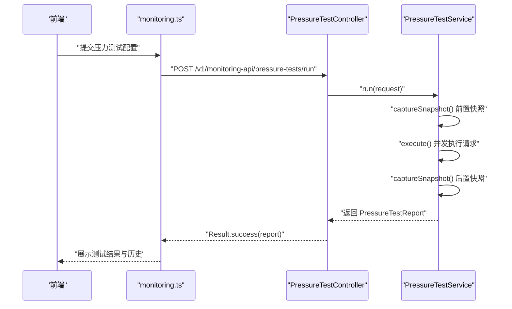
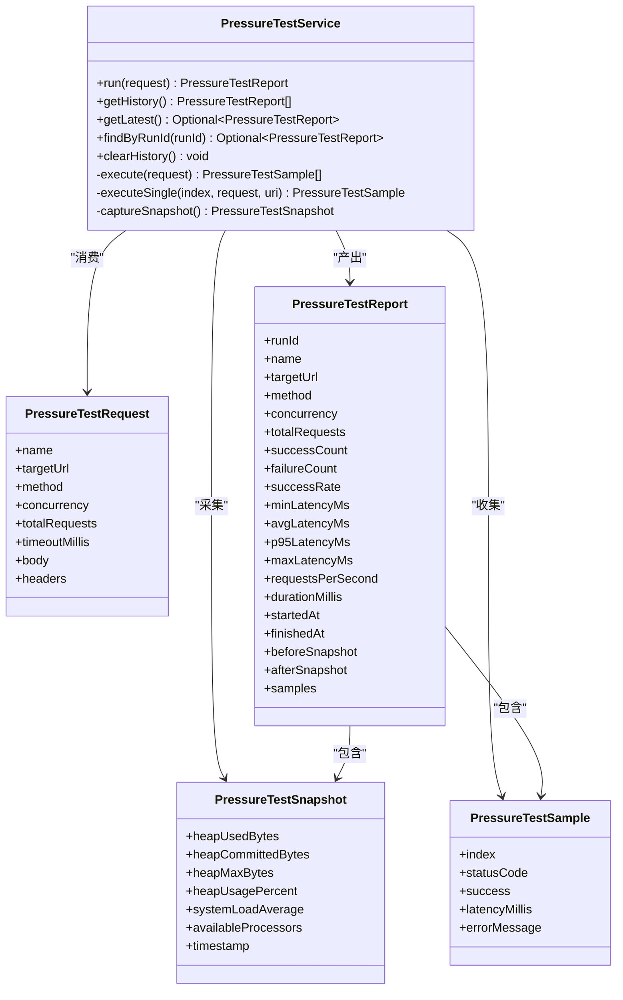
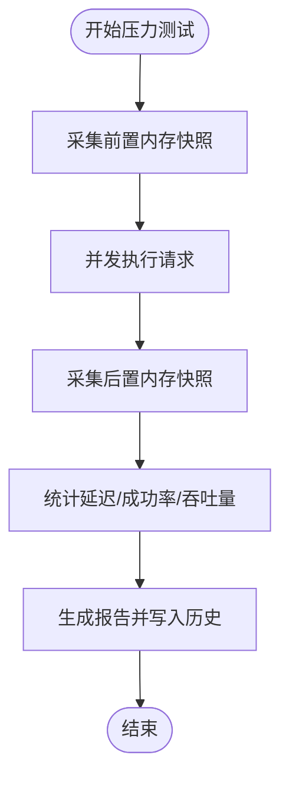
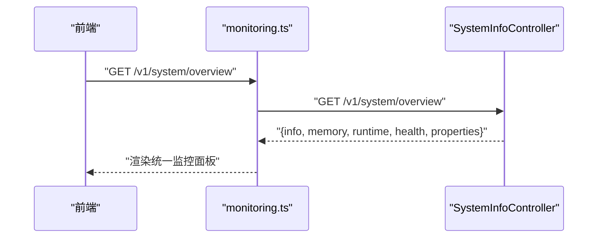
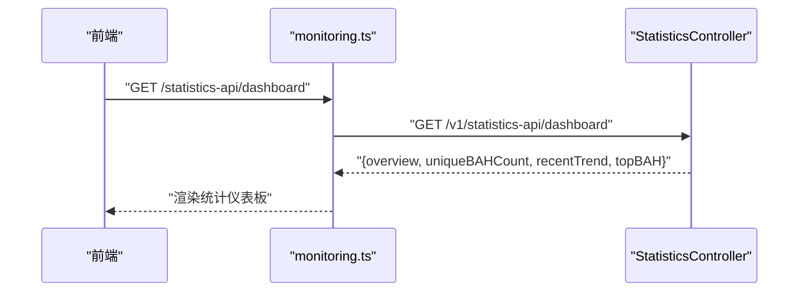
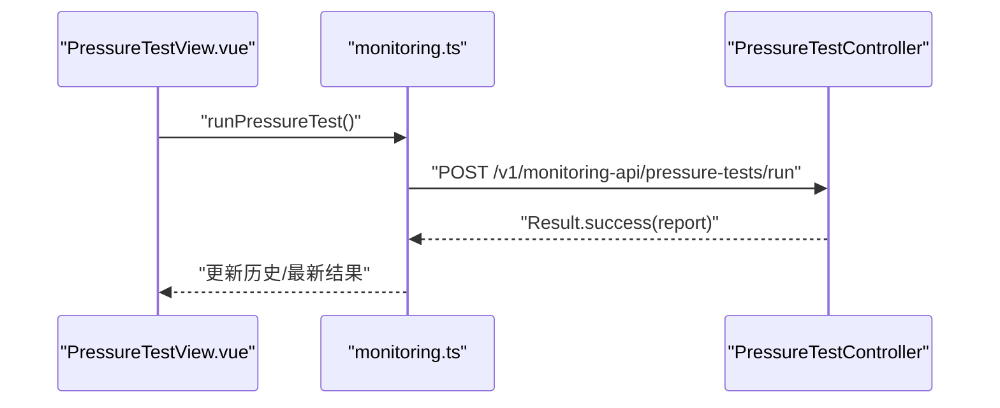
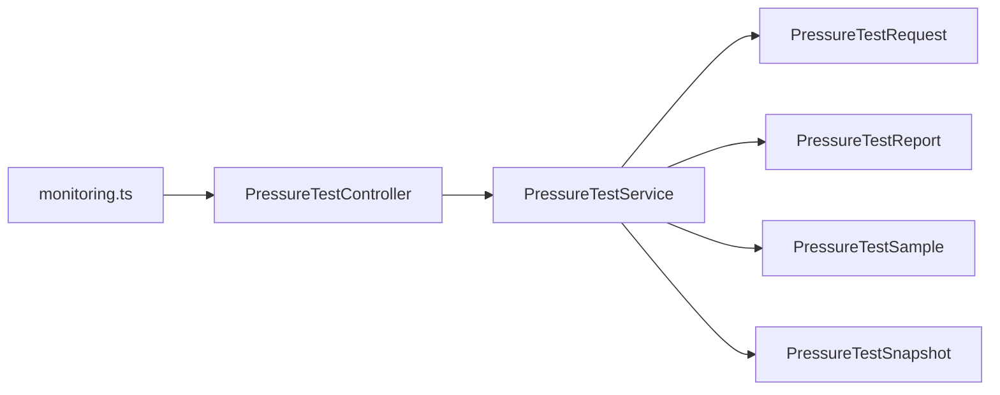

# 监控系统

<cite>
**本文引用的文件**
- [PressureTestService.java](file://backend-repo/src/main/java/com/zjcxph/imgapi/monitoring/PressureTestService.java)
- [PressureTestController.java](file://backend-repo/src/main/java/com/zjcxph/imgapi/controller/PressureTestController.java)
- [PressureTestReport.java](file://backend-repo/src/main/java/com/zjcxph/imgapi/monitoring/PressureTestReport.java)
- [PressureTestRequest.java](file://backend-repo/src/main/java/com/zjcxph/imgapi/monitoring/PressureTestRequest.java)
- [PressureTestSample.java](file://backend-repo/src/main/java/com/zjcxph/imgapi/monitoring/PressureTestSample.java)
- [PressureTestSnapshot.java](file://backend-repo/src/main/java/com/zjcxph/imgapi/monitoring/PressureTestSnapshot.java)
- [SystemInfoController.java](file://backend-repo/src/main/java/com/zjcxph/imgapi/controller/SystemInfoController.java)
- [StatisticsController.java](file://backend-repo/src/main/java/com/zjcxph/imgapi/controller/StatisticsController.java)
- [StatisticsService.java](file://backend-repo/src/main/java/com/zjcxph/imgapi/service/StatisticsService.java)
- [monitoring.ts](file://frontend-repo/src/api/monitoring.ts)
- [PressureTestView.vue](file://frontend-repo/src/components/admin/PressureTestView.vue)
</cite>

## 目录
1. [简介](#简介)
2. [项目结构](#项目结构)
3. [核心组件](#核心组件)
4. [架构总览](#架构总览)
5. [详细组件分析](#详细组件分析)
6. [依赖分析](#依赖分析)
7. [性能考虑](#性能考虑)
8. [故障排查指南](#故障排查指南)
9. [结论](#结论)
10. [附录](#附录)

## 简介
本文件为 MRR 监控系统的综合技术文档，聚焦压力测试模块的设计与实现，涵盖测试场景配置、执行流程、性能指标采集、内存快照与系统状态监控、历史数据与趋势分析、健康检查接口、以及前后端监控 API 的集成方式。文档同时提供架构图示、序列图与时序图，帮助读者从整体到细节全面理解系统。

## 项目结构
后端采用 Spring Boot 架构，监控相关能力集中在 monitoring 包与 controller 层；系统信息与健康检查由 SystemInfoController 提供；统计面板与趋势分析由 StatisticsController 提供；前端通过 monitoring.ts 调用后端监控接口，并在 PressureTestView.vue 中呈现压力测试界面。

**图表来源**
- [PressureTestService.java:32-293](file://backend-repo/src/main/java/com/zjcxph/imgapi/monitoring/PressureTestService.java#L32-L293)
- [PressureTestController.java:22-73](file://backend-repo/src/main/java/com/zjcxph/imgapi/controller/PressureTestController.java#L22-L73)
- [SystemInfoController.java:22-236](file://backend-repo/src/main/java/com/zjcxph/imgapi/controller/SystemInfoController.java#L22-L236)
- [StatisticsController.java:30-281](file://backend-repo/src/main/java/com/zjcxph/imgapi/controller/StatisticsController.java#L30-L281)
- [monitoring.ts:1-22](file://frontend-repo/src/api/monitoring.ts#L1-L22)
- [PressureTestView.vue](file://frontend-repo/src/components/admin/PressureTestView.vue)

**章节来源**
- [PressureTestService.java:32-293](file://backend-repo/src/main/java/com/zjcxph/imgapi/monitoring/PressureTestService.java#L32-L293)
- [PressureTestController.java:22-73](file://backend-repo/src/main/java/com/zjcxph/imgapi/controller/PressureTestController.java#L22-L73)
- [SystemInfoController.java:22-236](file://backend-repo/src/main/java/com/zjcxph/imgapi/controller/SystemInfoController.java#L22-L236)
- [StatisticsController.java:30-281](file://backend-repo/src/main/java/com/zjcxph/imgapi/controller/StatisticsController.java#L30-L281)
- [monitoring.ts:1-22](file://frontend-repo/src/api/monitoring.ts#L1-L22)

## 核心组件
- 压力测试服务：负责并发执行 HTTP 请求、统计延迟与成功率、生成内存快照、汇总报告并维护历史记录。
- 压力测试控制器：暴露 REST 接口，接收测试配置，返回历史、最新结果或指定 runId 的报告。
- 系统信息控制器：提供 JVM/OS/运行时信息、内存详情、健康检查与统一概览。
- 统计控制器：提供病案统计面板、趋势与摘要数据，支撑监控仪表板的数据源。
- 前端监控 API：封装压力测试相关接口调用，配合视图组件进行交互。

**章节来源**
- [PressureTestService.java:32-293](file://backend-repo/src/main/java/com/zjcxph/imgapi/monitoring/PressureTestService.java#L32-L293)
- [PressureTestController.java:22-73](file://backend-repo/src/main/java/com/zjcxph/imgapi/controller/PressureTestController.java#L22-L73)
- [SystemInfoController.java:22-236](file://backend-repo/src/main/java/com/zjcxph/imgapi/controller/SystemInfoController.java#L22-L236)
- [StatisticsController.java:30-281](file://backend-repo/src/main/java/com/zjcxph/imgapi/controller/StatisticsController.java#L30-L281)
- [monitoring.ts:1-22](file://frontend-repo/src/api/monitoring.ts#L1-L22)

## 架构总览
后端通过控制器层对外提供监控接口，业务逻辑集中在服务层；服务层使用 JDK HTTP 客户端并发发送请求，基于线程池与原子游标实现任务分发；同时采集 JVM 内存与系统负载快照，形成完整的压力测试报告。前端通过 API 封装调用后端接口，渲染监控视图与仪表板。

**图表来源**
- [PressureTestController.java:35-41](file://backend-repo/src/main/java/com/zjcxph/imgapi/controller/PressureTestController.java#L35-L41)
- [PressureTestService.java:44-112](file://backend-repo/src/main/java/com/zjcxph/imgapi/monitoring/PressureTestService.java#L44-L112)
- [monitoring.ts:3-5](file://frontend-repo/src/api/monitoring.ts#L3-L5)

## 详细组件分析

### 压力测试模块设计与执行流程
- 配置模型：PressureTestRequest 支持名称、目标 URL、方法、并发度、请求数、超时、请求体与头部等参数，并内置校验约束。
- 执行引擎：PressureTestService 使用固定线程池与原子游标分配任务，确保并发一致性；对每个请求测量延迟并记录状态码与错误信息。
- 报告聚合：计算最小/平均/95 分位/最大延迟、成功率、吞吐量、持续时间，并附带前后内存与系统负载快照。
- 历史管理：维护固定长度的历史队列，支持查询最新、按 runId 查询与清空历史。

**图表来源**
- [PressureTestRequest.java:12-180](file://backend-repo/src/main/java/com/zjcxph/imgapi/monitoring/PressureTestRequest.java#L12-L180)
- [PressureTestService.java:32-293](file://backend-repo/src/main/java/com/zjcxph/imgapi/monitoring/PressureTestService.java#L32-L293)
- [PressureTestReport.java:6-317](file://backend-repo/src/main/java/com/zjcxph/imgapi/monitoring/PressureTestReport.java#L6-L317)
- [PressureTestSample.java:3-82](file://backend-repo/src/main/java/com/zjcxph/imgapi/monitoring/PressureTestSample.java#L3-L82)
- [PressureTestSnapshot.java:3-118](file://backend-repo/src/main/java/com/zjcxph/imgapi/monitoring/PressureTestSnapshot.java#L3-L118)

**章节来源**
- [PressureTestRequest.java:12-180](file://backend-repo/src/main/java/com/zjcxph/imgapi/monitoring/PressureTestRequest.java#L12-L180)
- [PressureTestService.java:44-188](file://backend-repo/src/main/java/com/zjcxph/imgapi/monitoring/PressureTestService.java#L44-L188)
- [PressureTestReport.java:6-317](file://backend-repo/src/main/java/com/zjcxph/imgapi/monitoring/PressureTestReport.java#L6-L317)
- [PressureTestSample.java:3-82](file://backend-repo/src/main/java/com/zjcxph/imgapi/monitoring/PressureTestSample.java#L3-L82)
- [PressureTestSnapshot.java:3-118](file://backend-repo/src/main/java/com/zjcxph/imgapi/monitoring/PressureTestSnapshot.java#L3-L118)

### 性能监控指标与实时采样
- 延迟指标：最小、平均、95 分位、最大延迟，用于评估响应时间分布。
- 成功率与吞吐量：成功/失败计数与每秒请求数，衡量系统稳定性与承载能力。
- 内存快照：堆使用量、已提交、最大值与百分比，系统负载平均值与可用 CPU 数，反映 JVM 与 OS 资源占用。
- 实时性：每次测试前后各采集一次快照，对比变化以定位性能瓶颈。

**图表来源**
- [PressureTestService.java:50-112](file://backend-repo/src/main/java/com/zjcxph/imgapi/monitoring/PressureTestService.java#L50-L112)
- [PressureTestSnapshot.java:16-32](file://backend-repo/src/main/java/com/zjcxph/imgapi/monitoring/PressureTestSnapshot.java#L16-L32)

**章节来源**
- [PressureTestService.java:54-99](file://backend-repo/src/main/java/com/zjcxph/imgapi/monitoring/PressureTestService.java#L54-L99)
- [PressureTestSnapshot.java:16-32](file://backend-repo/src/main/java/com/zjcxph/imgapi/monitoring/PressureTestSnapshot.java#L16-L32)

### 系统状态监控与健康检查
- 系统概览：应用名、启动时间、运行时长、JVM/OS/运行时信息、系统属性。
- 内存详情：堆/非堆内存初始化/使用/已提交/最大值及使用率。
- 健康检查：返回整体状态、时间戳、端口、应用名，并包含内存使用率与状态（正常/预警）。
- 统一监控：一次性返回 info/memory/runtime/health/properties。

**图表来源**
- [SystemInfoController.java:170-180](file://backend-repo/src/main/java/com/zjcxph/imgapi/controller/SystemInfoController.java#L170-L180)
- [monitoring.ts:1-22](file://frontend-repo/src/api/monitoring.ts#L1-L22)

**章节来源**
- [SystemInfoController.java:35-180](file://backend-repo/src/main/java/com/zjcxph/imgapi/controller/SystemInfoController.java#L35-L180)

### 监控仪表板与趋势分析
- 统计面板：提供总体统计、唯一病案号数量、近 30 日趋势、Top 病案号等。
- 趋势接口：支持按日期范围与类型条件统计每日记录数与总页数。
- 前端集成：通过 monitoring.ts 调用后端接口，结合视图组件展示图表与表格。

**图表来源**
- [StatisticsController.java:215-242](file://backend-repo/src/main/java/com/zjcxph/imgapi/controller/StatisticsController.java#L215-L242)
- [monitoring.ts:1-22](file://frontend-repo/src/api/monitoring.ts#L1-L22)

**章节来源**
- [StatisticsController.java:189-242](file://backend-repo/src/main/java/com/zjcxph/imgapi/controller/StatisticsController.java#L189-L242)
- [StatisticsService.java:10-56](file://backend-repo/src/main/java/com/zjcxph/imgapi/service/StatisticsService.java#L10-L56)

### 前后端监控 API 集成
- 前端 API 封装：runPressureTest、getPressureTestHistory、getLatestPressureTest、getPressureTestByRunId、clearPressureTestHistory。
- 前端视图：PressureTestView.vue 负责用户输入与结果展示。
- 后端控制器：PressureTestController 对外暴露压力测试相关接口，返回标准 Result 结构。

**图表来源**
- [monitoring.ts:3-21](file://frontend-repo/src/api/monitoring.ts#L3-L21)
- [PressureTestController.java:35-71](file://backend-repo/src/main/java/com/zjcxph/imgapi/controller/PressureTestController.java#L35-L71)
- [PressureTestView.vue](file://frontend-repo/src/components/admin/PressureTestView.vue)

**章节来源**
- [monitoring.ts:1-22](file://frontend-repo/src/api/monitoring.ts#L1-L22)
- [PressureTestController.java:22-73](file://backend-repo/src/main/java/com/zjcxph/imgapi/controller/PressureTestController.java#L22-L73)

## 依赖分析
- 控制器依赖服务：PressureTestController 注入 PressureTestService，解耦接口与实现。
- 服务内部依赖：PressureTestService 内部使用 JDK HTTP 客户端、线程池与并发集合，不依赖外部中间件。
- 数据模型：四个 DTO（Request/Report/Sample/Snapshot）彼此组合，形成完整测试闭环。
- 前后端通信：monitoring.ts 作为 API 层，统一后端接口路径，便于前端复用。

**图表来源**
- [PressureTestController.java:29-33](file://backend-repo/src/main/java/com/zjcxph/imgapi/controller/PressureTestController.java#L29-L33)
- [PressureTestService.java:44-112](file://backend-repo/src/main/java/com/zjcxph/imgapi/monitoring/PressureTestService.java#L44-L112)
- [monitoring.ts:1-22](file://frontend-repo/src/api/monitoring.ts#L1-L22)

**章节来源**
- [PressureTestController.java:22-73](file://backend-repo/src/main/java/com/zjcxph/imgapi/controller/PressureTestController.java#L22-L73)
- [PressureTestService.java:32-293](file://backend-repo/src/main/java/com/zjcxph/imgapi/monitoring/PressureTestService.java#L32-L293)
- [monitoring.ts:1-22](file://frontend-repo/src/api/monitoring.ts#L1-L22)

## 性能考虑
- 并发控制：concurrency 参数限制线程池大小，避免过载；totalRequests 与 timeoutMillis 控制测试规模与响应等待。
- 内存与 GC：压力测试期间关注堆使用率与系统负载，必要时降低并发或缩短测试时长。
- I/O 与网络：合理设置超时，避免阻塞；对大体积请求体自动补充 Content-Type。
- 历史容量：固定长度历史队列，防止内存膨胀；定期清理历史以释放空间。

[本节为通用建议，无需特定文件引用]

## 故障排查指南
- 健康检查：通过 /v1/system/health 快速判断内存使用是否接近阈值（默认预警阈值为 90%），辅助定位内存泄漏或峰值过高问题。
- 压测失败：查看 PressureTestSample 中的错误信息与状态码，结合前后快照分析系统资源瓶颈。
- 历史查询：使用 /v1/monitoring-api/pressure-tests/history 与 /v1/monitoring-api/pressure-tests/latest 获取测试记录，必要时执行 /v1/monitoring-api/pressure-tests/history 清理历史。

**章节来源**
- [SystemInfoController.java:120-144](file://backend-repo/src/main/java/com/zjcxph/imgapi/controller/SystemInfoController.java#L120-L144)
- [PressureTestController.java:43-71](file://backend-repo/src/main/java/com/zjcxph/imgapi/controller/PressureTestController.java#L43-L71)
- [PressureTestSample.java:14-20](file://backend-repo/src/main/java/com/zjcxph/imgapi/monitoring/PressureTestSample.java#L14-L20)

## 结论
MRR 监控系统以压力测试为核心，结合系统信息与健康检查、统计面板与趋势分析，形成从“场景配置—执行—观测—诊断”的完整闭环。通过前后端清晰的职责划分与标准化接口，既满足日常运维监控需求，也为容量规划与性能优化提供可靠依据。

[本节为总结性内容，无需特定文件引用]

## 附录
- 监控 API 列表（后端）
  - POST /v1/monitoring-api/pressure-tests/run：运行压力测试
  - GET /v1/monitoring-api/pressure-tests/history：获取历史
  - GET /v1/monitoring-api/pressure-tests/latest：获取最新
  - GET /v1/monitoring-api/pressure-tests/{runId}：按 runId 查询
  - DELETE /v1/monitoring-api/pressure-tests/history：清空历史
  - GET /v1/system/info：系统基本信息
  - GET /v1/system/memory：内存详情
  - GET /v1/system/runtime：运行时信息
  - GET /v1/system/health：健康检查
  - GET /v1/system/overview：统一监控概览
  - GET /v1/statistics-api/dashboard：统计面板
- 前端调用封装：monitoring.ts 提供 run、history、latest、byRunId、clear 等方法

**章节来源**
- [PressureTestController.java:35-71](file://backend-repo/src/main/java/com/zjcxph/imgapi/controller/PressureTestController.java#L35-L71)
- [SystemInfoController.java:35-180](file://backend-repo/src/main/java/com/zjcxph/imgapi/controller/SystemInfoController.java#L35-L180)
- [StatisticsController.java:215-242](file://backend-repo/src/main/java/com/zjcxph/imgapi/controller/StatisticsController.java#L215-L242)
- [monitoring.ts:1-22](file://frontend-repo/src/api/monitoring.ts#L1-L22)