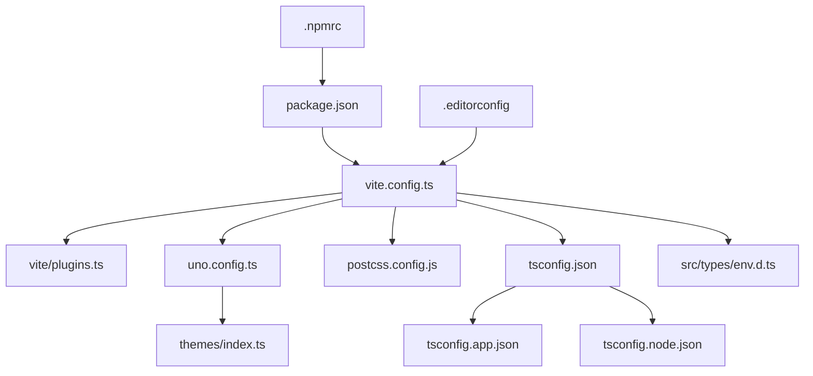
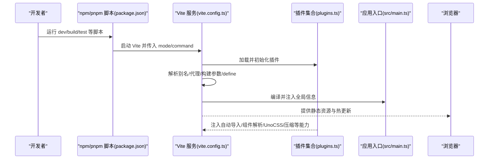
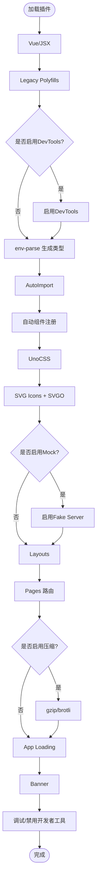
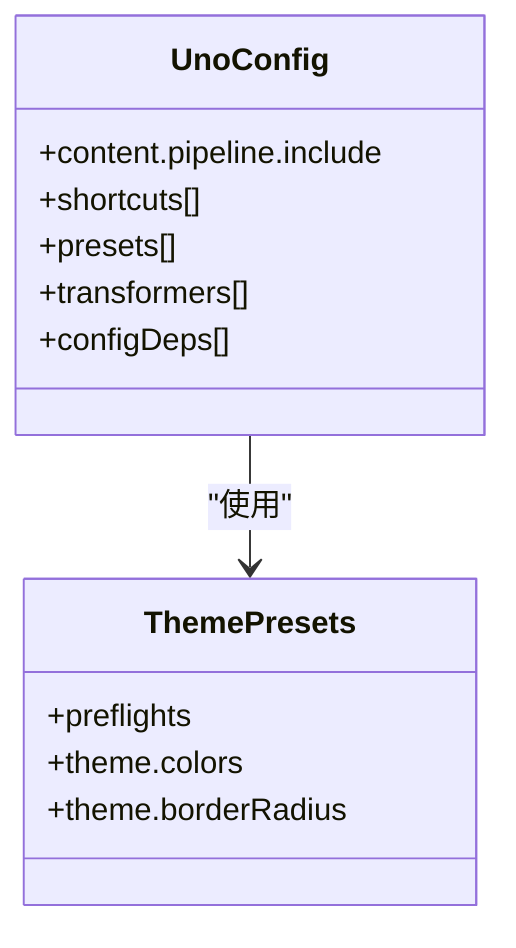
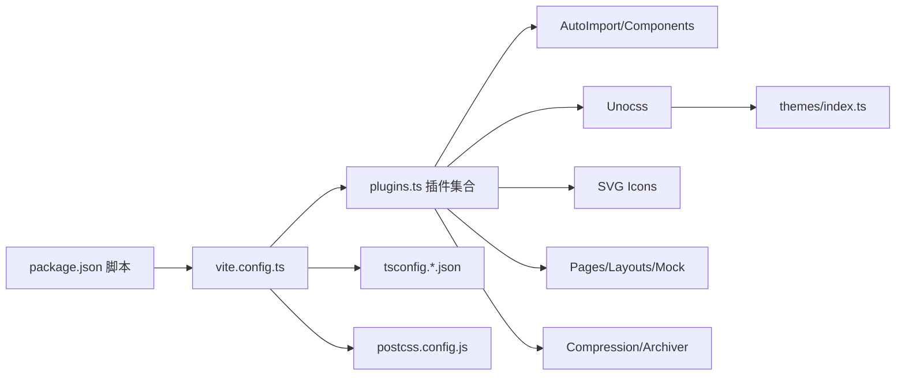

# 构建配置

<cite>
**本文引用的文件**
- [vite.config.ts](file://frontend-fantastic-admin/vite.config.ts)
- [plugins.ts](file://frontend-fantastic-admin/vite/plugins.ts)
- [package.json](file://frontend-fantastic-admin/package.json)
- [uno.config.ts](file://frontend-fantastic-admin/uno.config.ts)
- [postcss.config.js](file://frontend-fantastic-admin/postcss.config.js)
- [tsconfig.json](file://frontend-fantastic-admin/tsconfig.json)
- [tsconfig.app.json](file://frontend-fantastic-admin/tsconfig.app.json)
- [tsconfig.node.json](file://frontend-fantastic-admin/tsconfig.node.json)
- [env.d.ts](file://frontend-fantastic-admin/src/types/env.d.ts)
- [index.ts（主题）](file://frontend-fantastic-admin/themes/index.ts)
- [.npmrc](file://frontend-fantastic-admin/.npmrc)
- [.editorconfig](file://frontend-fantastic-admin/.editorconfig)
</cite>

## 目录
1. [简介](#简介)
2. [项目结构](#项目结构)
3. [核心组件](#核心组件)
4. [架构总览](#架构总览)
5. [详细组件分析](#详细组件分析)
6. [依赖关系分析](#依赖关系分析)
7. [性能考量](#性能考量)
8. [故障排除指南](#故障排除指南)
9. [结论](#结论)
10. [附录](#附录)

## 简介
本文件面向MRR前端“Fantastic Admin”子项目的构建配置，系统性梳理Vite配置、插件体系与优化策略，覆盖打包输出、开发服务器与代理、静态资源处理、UnoCSS原子化CSS、PostCSS预处理、TypeScript编译、环境变量管理、产物优化与性能监控、热重载与代码分割、缓存策略、构建优化技巧、部署建议与常见问题排查。内容以实际源码为依据，配合图示帮助不同背景读者理解与落地。

## 项目结构
前端构建相关的关键目录与文件集中在frontend-fantastic-admin中，核心包括：
- 构建配置：vite.config.ts、vite/plugins.ts
- 样式与原子化：uno.config.ts、postcss.config.js、themes/index.ts
- TypeScript：tsconfig.json、tsconfig.app.json、tsconfig.node.json
- 环境类型声明：src/types/env.d.ts
- 包管理与脚本：package.json、.npmrc、.editorconfig

图表来源
- [vite.config.ts:1-64](file://frontend-fantastic-admin/vite.config.ts#L1-L64)
- [plugins.ts:1-197](file://frontend-fantastic-admin/vite/plugins.ts#L1-L197)
- [uno.config.ts:1-140](file://frontend-fantastic-admin/uno.config.ts#L1-L140)
- [postcss.config.js:1-7](file://frontend-fantastic-admin/postcss.config.js#L1-L7)
- [tsconfig.json:1-14](file://frontend-fantastic-admin/tsconfig.json#L1-L14)
- [tsconfig.app.json:1-33](file://frontend-fantastic-admin/tsconfig.app.json#L1-L33)
- [tsconfig.node.json:1-25](file://frontend-fantastic-admin/tsconfig.node.json#L1-L25)
- [env.d.ts:1-32](file://frontend-fantastic-admin/src/types/env.d.ts#L1-L32)
- [index.ts（主题）:1-116](file://frontend-fantastic-admin/themes/index.ts#L1-L116)
- [package.json:1-131](file://frontend-fantastic-admin/package.json#L1-L131)
- [.npmrc:1-5](file://frontend-fantastic-admin/.npmrc#L1-L5)
- [.editorconfig:1-10](file://frontend-fantastic-admin/.editorconfig#L1-L10)

章节来源
- [vite.config.ts:1-64](file://frontend-fantastic-admin/vite.config.ts#L1-L64)
- [package.json:1-131](file://frontend-fantastic-admin/package.json#L1-L131)

## 核心组件
- Vite主配置：定义开发服务器、代理、构建输出、define注入、路径别名、SCSS全局资源注入等。
- 插件工厂：集中注册Vue、JSX、Legacy、DevTools、AutoImport、Components、Unocss、SVG Icons、Fake Server、Layouts、Pages、压缩归档、加载页、Banner、调试与禁用开发者工具等插件，并按模式与开关动态启用。
- UnoCSS：内容扫描、短横线快捷方式、preset组合、主题预设、transformers、配置依赖追踪。
- PostCSS：Autoprefixer与Nested。
- TypeScript：分层tsconfig，分别约束应用与Node侧构建。
- 环境变量：通过env-parse生成类型声明，结合Vite loadEnv在运行时注入。

章节来源
- [vite.config.ts:10-63](file://frontend-fantastic-admin/vite.config.ts#L10-L63)
- [plugins.ts:25-196](file://frontend-fantastic-admin/vite/plugins.ts#L25-L196)
- [uno.config.ts:17-139](file://frontend-fantastic-admin/uno.config.ts#L17-L139)
- [postcss.config.js:1-7](file://frontend-fantastic-admin/postcss.config.js#L1-L7)
- [tsconfig.app.json:1-33](file://frontend-fantastic-admin/tsconfig.app.json#L1-L33)
- [tsconfig.node.json:1-25](file://frontend-fantastic-admin/tsconfig.node.json#L1-L25)
- [env.d.ts:1-32](file://frontend-fantastic-admin/src/types/env.d.ts#L1-L32)

## 架构总览
下图展示从命令行到浏览器的构建与运行链路，以及关键配置与插件的交互关系。

图表来源
- [package.json:8-26](file://frontend-fantastic-admin/package.json#L8-L26)
- [vite.config.ts:10-63](file://frontend-fantastic-admin/vite.config.ts#L10-L63)
- [plugins.ts:25-196](file://frontend-fantastic-admin/vite/plugins.ts#L25-L196)

## 详细组件分析

### Vite 主配置（vite.config.ts）
- 开发服务器
  - 自动打开浏览器、主机监听、端口固定为9000。
  - 代理规则：将 /proxy 前缀转发至后端API基础地址，支持按模式与开关控制跨域与路径重写。
- 构建输出
  - 生产模式输出目录为dist；非生产模式输出为dist-{mode}，便于多环境区分。
  - 可根据环境变量开启SourceMap。
- define注入
  - 将系统信息（包版本、依赖、构建时间）注入到全局常量，便于运行时读取。
- 路径别名
  - @ 指向 src，# 指向 src/types，提升导入便捷性。
- SCSS全局资源
  - 动态读取 src/assets/styles/resources 下的资源文件，拼接为额外预处理数据，实现全局SCSS混入与变量注入。

章节来源
- [vite.config.ts:20-37](file://frontend-fantastic-admin/vite.config.ts#L20-L37)
- [vite.config.ts:38-47](file://frontend-fantastic-admin/vite.config.ts#L38-L47)
- [vite.config.ts:49-61](file://frontend-fantastic-admin/vite.config.ts#L49-L61)

### 插件系统（vite/plugins.ts）
- 核心插件
  - Vue与JSX：支持单文件组件与JSX语法。
  - Legacy：现代polyfill清单，关闭传统分块渲染，确保兼容性。
  - DevTools：条件启用，支持VSCode等编辑器联动。
  - env-parse：从dotenv加载并生成类型声明，统一环境变量类型。
  - AutoImport：自动导入Vue/Pinia/Router API，支持目录扫描生成类型。
  - Components：自动注册UI组件，生成类型声明。
  - Unocss：原子化CSS引擎，按内容扫描与transformers生效。
  - SVG Icons：批量生成SVG雪碧图符号，按构建状态启用SVGO优化。
  - Fake Server：开发期本地Mock，生产可按开关启用。
  - Layouts：基于meta布局的页面容器。
  - Pages：约定式路由，排除组件目录。
  - Compression/Achiver：按配置启用gzip/brotli压缩与打包归档。
  - App Loading：自定义加载页模板。
  - Banner/TurboConsole：构建信息与终端提示。
  - 调试与安全：按开关注入Eruda/VConsole或禁用开发者工具。
- 条件与开关
  - 大部分能力通过环境变量控制，避免在不同环境重复维护配置。

图表来源
- [plugins.ts:25-196](file://frontend-fantastic-admin/vite/plugins.ts#L25-L196)

章节来源
- [plugins.ts:25-196](file://frontend-fantastic-admin/vite/plugins.ts#L25-L196)

### UnoCSS 原子化CSS（uno.config.ts）
- 内容扫描与管道
  - 对多种文件类型进行内容扫描，确保仅生成使用到的样式。
- 快捷方式
  - 定义flex布局等快捷类，简化常用布局写法。
- Presets与主题
  - 组合Wind3、动画、属性化、图标、排版、Legacy兼容等预设。
  - 引入自定义主题预设，注入明暗主题变量与基础样式。
- Transformers
  - 指令、变体组、类编译等转换器，增强类名表达力。
- 配置依赖
  - 监听主题文件变更，触发重新扫描与生成。

图表来源
- [uno.config.ts:17-139](file://frontend-fantastic-admin/uno.config.ts#L17-L139)
- [index.ts（主题）:1-116](file://frontend-fantastic-admin/themes/index.ts#L1-L116)

章节来源
- [uno.config.ts:17-139](file://frontend-fantastic-admin/uno.config.ts#L17-L139)
- [index.ts（主题）:1-116](file://frontend-fantastic-admin/themes/index.ts#L1-L116)

### PostCSS 预处理器（postcss.config.js）
- Autoprefixer：自动添加浏览器前缀。
- postcss-nested：支持嵌套规则，提升CSS可读性。

章节来源
- [postcss.config.js:1-7](file://frontend-fantastic-admin/postcss.config.js#L1-L7)

### TypeScript 编译（tsconfig.json、tsconfig.app.json、tsconfig.node.json）
- tsconfig.json
  - 作为根配置，引用应用与Node两类配置，定义路径映射。
- tsconfig.app.json
  - 面向浏览器应用的严格编译选项，包含客户端类型、路径映射、严格模式、sourceMap等。
- tsconfig.node.json
  - 面向Vite与构建脚本的Node侧配置，采用Bundler解析，严格且不产出。

章节来源
- [tsconfig.json:1-14](file://frontend-fantastic-admin/tsconfig.json#L1-L14)
- [tsconfig.app.json:1-33](file://frontend-fantastic-admin/tsconfig.app.json#L1-L33)
- [tsconfig.node.json:1-25](file://frontend-fantastic-admin/tsconfig.node.json#L1-L25)

### 环境变量管理（env.d.ts 与 env-parse）
- 类型声明
  - 通过env-parse自动生成env.d.ts，包含API基础地址、调试工具、开发者工具开关、代理开关等字段。
- 运行时注入
  - Vite loadEnv按模式加载环境变量，插件侧再做类型化解析与注入。

章节来源
- [env.d.ts:1-32](file://frontend-fantastic-admin/src/types/env.d.ts#L1-L32)
- [plugins.ts:44-46](file://frontend-fantastic-admin/vite/plugins.ts#L44-L46)
- [vite.config.ts:10-11](file://frontend-fantastic-admin/vite.config.ts#L10-L11)

## 依赖关系分析
- 构建链路
  - package.json脚本驱动Vite，Vite读取vite.config.ts，加载plugins.ts中的插件，最终输出到dist或dist-{mode}。
- 插件耦合
  - AutoImport与Components依赖目录扫描生成类型文件，需与tsconfig保持一致。
  - Unocss与主题文件存在配置依赖，修改主题会触发重新扫描。
  - 压缩与归档插件受环境变量控制，避免在开发阶段引入体积开销。
- 工具链
  - TypeScript编译器与Vite协同，保证类型安全与快速热更。
  - PostCSS与SCSS全局资源共同作用于样式管线。

图表来源
- [package.json:8-26](file://frontend-fantastic-admin/package.json#L8-L26)
- [vite.config.ts:10-63](file://frontend-fantastic-admin/vite.config.ts#L10-L63)
- [plugins.ts:25-196](file://frontend-fantastic-admin/vite/plugins.ts#L25-L196)
- [uno.config.ts:17-139](file://frontend-fantastic-admin/uno.config.ts#L17-L139)
- [index.ts（主题）:1-116](file://frontend-fantastic-admin/themes/index.ts#L1-L116)
- [postcss.config.js:1-7](file://frontend-fantastic-admin/postcss.config.js#L1-L7)
- [tsconfig.json:1-14](file://frontend-fantastic-admin/tsconfig.json#L1-L14)

章节来源
- [package.json:8-26](file://frontend-fantastic-admin/package.json#L8-L26)
- [vite.config.ts:10-63](file://frontend-fantastic-admin/vite.config.ts#L10-L63)
- [plugins.ts:25-196](file://frontend-fantastic-admin/vite/plugins.ts#L25-L196)

## 性能考量
- 代码分割与懒加载
  - Pages与Layouts结合路由与布局，利于按需加载页面与容器组件。
- 压缩与归档
  - 按配置启用gzip/brotli压缩与打包归档，降低传输体积。
- 产物优化
  - SourceMap可按需开启，平衡调试与体积。
- 缓存策略
  - 构建产物命名与哈希策略由Vite默认行为与插件共同决定；建议在CDN/反向代理层设置合理的缓存头。
- 热重载
  - Vite原生HMR，结合插件的buildStart与终端提示，提升开发体验。
- UnoCSS按需
  - 内容扫描与transformers减少未使用样式，配合主题预设避免冗余变量。

章节来源
- [plugins.ts:102-112](file://frontend-fantastic-admin/vite/plugins.ts#L102-L112)
- [vite.config.ts:34-37](file://frontend-fantastic-admin/vite.config.ts#L34-L37)
- [uno.config.ts:18-25](file://frontend-fantastic-admin/uno.config.ts#L18-L25)

## 故障排除指南
- 代理无效或跨域失败
  - 检查代理目标与开关，确认Vite代理配置与环境变量一致。
- UnoCSS样式缺失
  - 确认内容扫描范围覆盖到对应文件类型与目录，必要时调整include列表。
- 类型声明未生成
  - 确认env-parse已启用并正确生成env.d.ts，同时Vite loadEnv加载成功。
- 构建产物异常
  - 检查压缩与归档插件开关，确认输出目录与SourceMap配置。
- 开发者工具无法使用
  - 检查DevTools开关与编辑器联动配置，或确认禁用开发者工具的开关是否误启。

章节来源
- [vite.config.ts:25-31](file://frontend-fantastic-admin/vite.config.ts#L25-L31)
- [uno.config.ts:18-25](file://frontend-fantastic-admin/uno.config.ts#L18-L25)
- [plugins.ts:44-46](file://frontend-fantastic-admin/vite/plugins.ts#L44-L46)
- [plugins.ts:102-112](file://frontend-fantastic-admin/vite/plugins.ts#L102-L112)
- [plugins.ts:155-173](file://frontend-fantastic-admin/vite/plugins.ts#L155-L173)

## 结论
本构建配置以Vite为核心，通过高度模块化的插件体系实现开发体验与产物质量的平衡。UnoCSS与PostCSS提供现代化样式管线，TypeScript保障类型安全。借助环境变量与条件插件，可在不同环境下灵活启用或禁用能力。建议在CI/CD中固定Node与包管理器版本，结合.editorconfig与.npmrc提升一致性与可维护性。

## 附录

### 环境变量一览（节选）
- VITE_APP_API_BASEURL：后端接口基础地址，用于axios的baseURL。
- VITE_OPEN_PROXY：是否开启代理。
- VITE_APP_DEBUG_TOOL：调试工具（eruda/vconsole）。
- VITE_APP_DISABLE_DEVTOOL：是否禁用开发者工具。
- VITE_OPEN_DEVTOOLS：是否启用DevTools。
- VITE_BUILD_COMPRESS：压缩算法（逗号分隔，如gzip,brotli）。
- VITE_BUILD_ARCHIVE：打包归档类型。
- VITE_BUILD_SOURCEMAP：是否生成SourceMap。

章节来源
- [env.d.ts:1-32](file://frontend-fantastic-admin/src/types/env.d.ts#L1-L32)
- [plugins.ts:102-112](file://frontend-fantastic-admin/vite/plugins.ts#L102-L112)
- [vite.config.ts:34-37](file://frontend-fantastic-admin/vite.config.ts#L34-L37)

### 包管理与脚本
- Node版本与包管理器：遵循package.json engines与.npmrc配置。
- 常用脚本：dev、build、build:test、serve、lint等。

章节来源
- [package.json:5-26](file://frontend-fantastic-admin/package.json#L5-L26)
- [.npmrc:1-5](file://frontend-fantastic-admin/.npmrc#L1-L5)