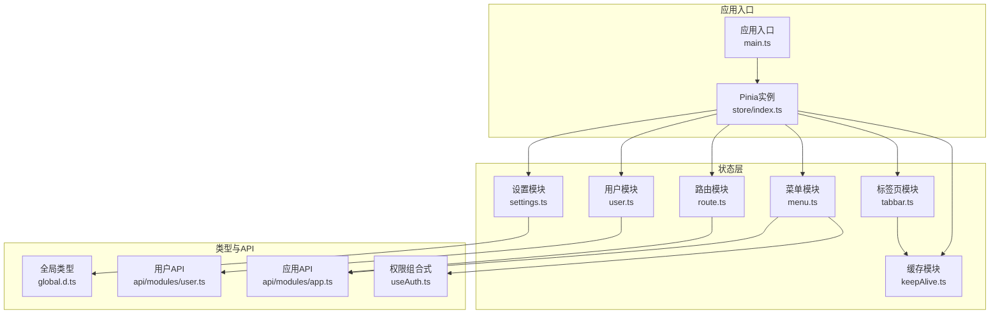
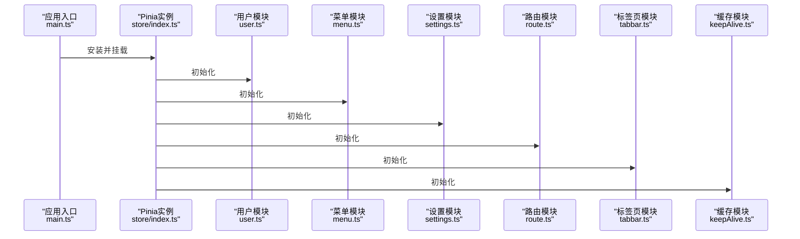
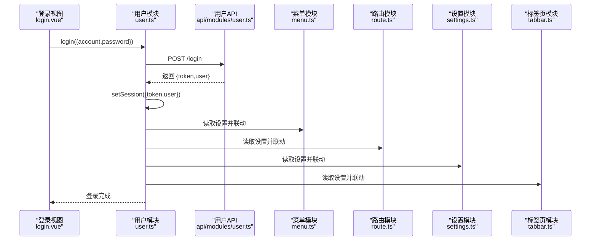
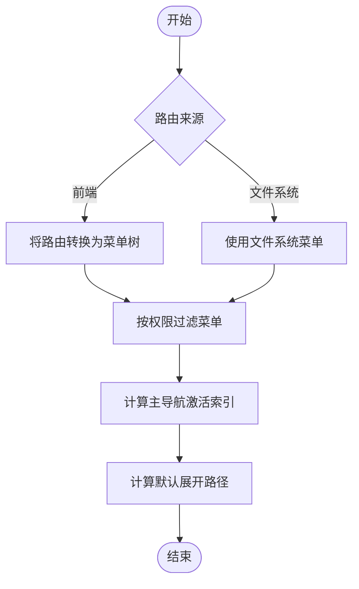
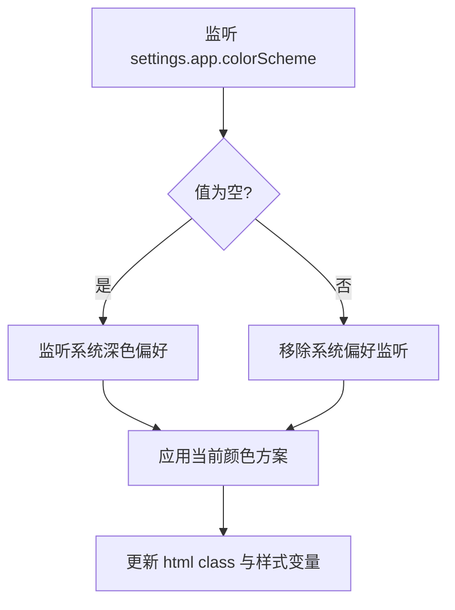
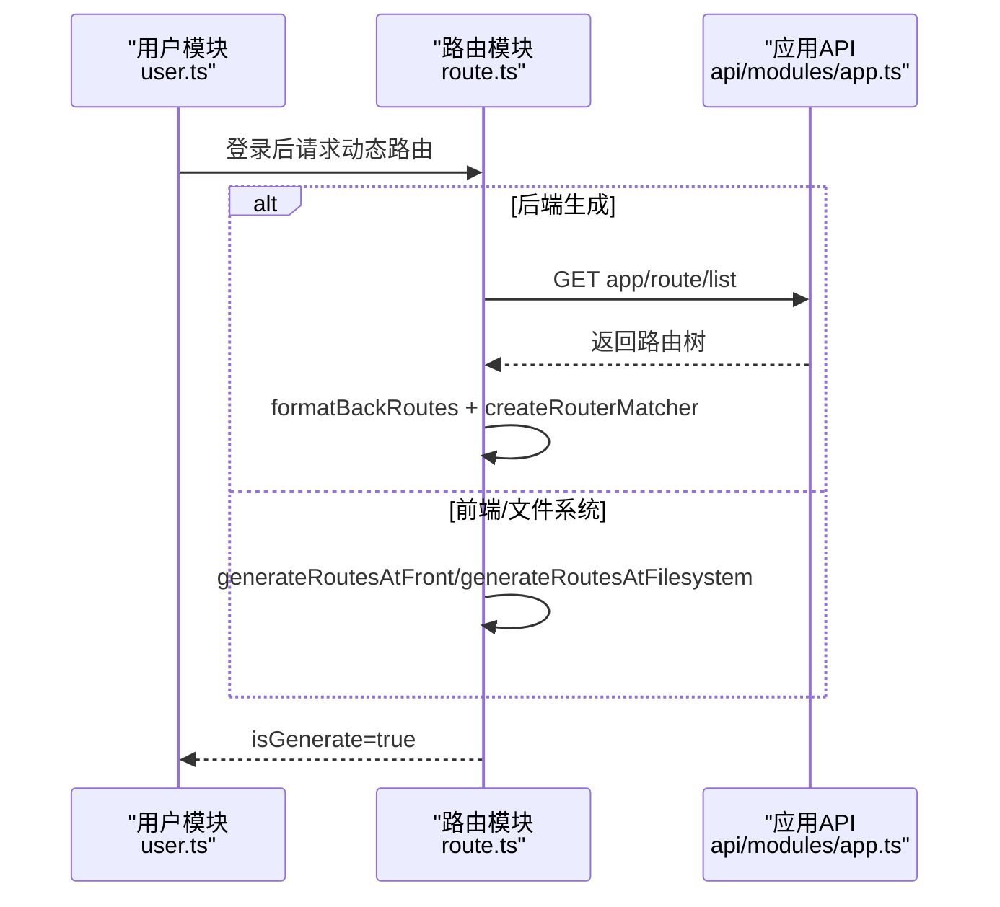
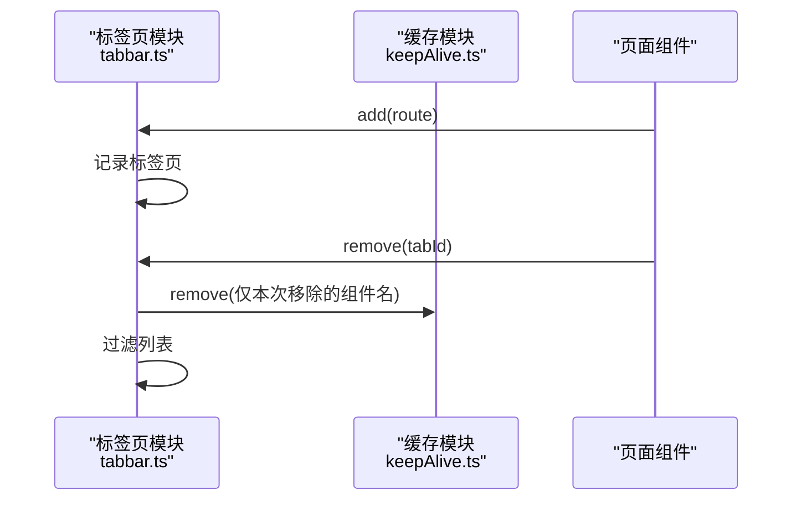
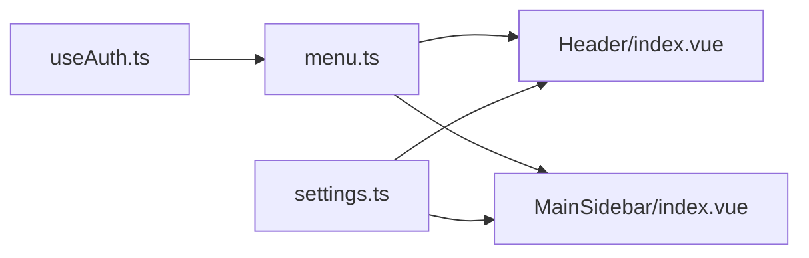
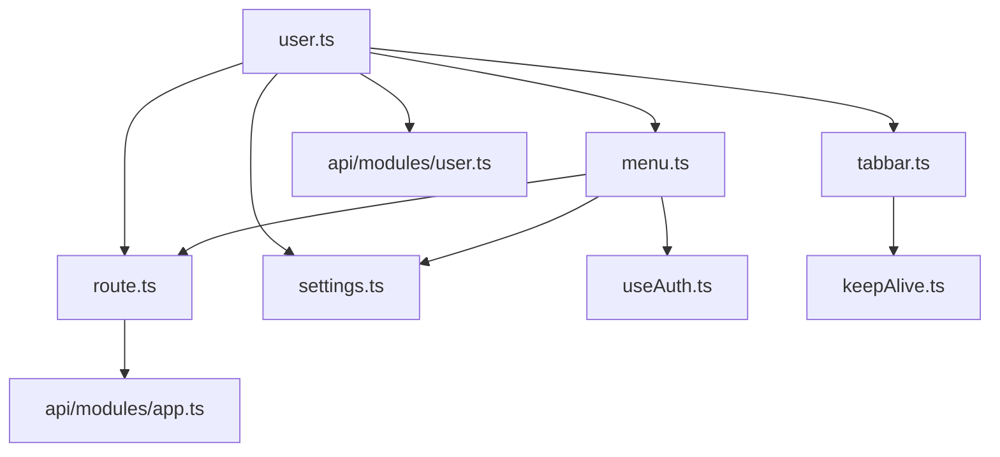

# 状态管理

<cite>
**本文引用的文件**
- [frontend-fantastic-admin/src/store/index.ts](file://frontend-fantastic-admin/src/store/index.ts)
- [frontend-fantastic-admin/src/store/modules/user.ts](file://frontend-fantastic-admin/src/store/modules/user.ts)
- [frontend-fantastic-admin/src/store/modules/menu.ts](file://frontend-fantastic-admin/src/store/modules/menu.ts)
- [frontend-fantastic-admin/src/store/modules/settings.ts](file://frontend-fantastic-admin/src/store/modules/settings.ts)
- [frontend-fantastic-admin/src/store/modules/route.ts](file://frontend-fantastic-admin/src/store/modules/route.ts)
- [frontend-fantastic-admin/src/store/modules/tabbar.ts](file://frontend-fantastic-admin/src/store/modules/tabbar.ts)
- [frontend-fantastic-admin/src/store/modules/keepAlive.ts](file://frontend-fantastic-admin/src/store/modules/keepAlive.ts)
- [frontend-fantastic-admin/src/types/global.d.ts](file://frontend-fantastic-admin/src/types/global.d.ts)
- [frontend-fantastic-admin/src/api/modules/user.ts](file://frontend-fantastic-admin/src/api/modules/user.ts)
- [frontend-fantastic-admin/src/api/modules/app.ts](file://frontend-fantastic-admin/src/api/modules/app.ts)
- [frontend-fantastic-admin/src/utils/composables/useAuth.ts](file://frontend-fantastic-admin/src/utils/composables/useAuth.ts)
- [frontend-fantastic-admin/src/main.ts](file://frontend-fantastic-admin/src/main.ts)
- [frontend-fantastic-admin/src/views/login.vue](file://frontend-fantastic-admin/src/views/login.vue)
- [frontend-fantastic-admin/src/layouts/components/Header/index.vue](file://frontend-fantastic-admin/src/layouts/components/Header/index.vue)
- [frontend-fantastic-admin/src/layouts/components/MainSidebar/index.vue](file://frontend-fantastic-admin/src/layouts/components/MainSidebar/index.vue)
- [frontend-fantastic-admin/src/settings.ts](file://frontend-fantastic-admin/src/settings.ts)
</cite>

## 目录
1. [简介](#简介)
2. [项目结构](#项目结构)
3. [核心组件](#核心组件)
4. [架构总览](#架构总览)
5. [详细组件分析](#详细组件分析)
6. [依赖关系分析](#依赖关系分析)
7. [性能考量](#性能考量)
8. [故障排查指南](#故障排查指南)
9. [结论](#结论)
10. [附录](#附录)

## 简介
本技术文档围绕 MRR 病案管理系统前端的状态管理子系统展开，基于 Pinia 进行模块化设计，覆盖用户状态、菜单状态、设置状态、路由状态、标签页状态与页面缓存状态等核心模块。文档从架构、数据流、处理逻辑、持久化策略、UI 绑定与响应式更新、性能优化、重置与同步机制、跨组件通信模式等方面进行系统化阐述，并提供最佳实践与扩展开发指南。

## 项目结构
前端状态管理位于 frontend-fantastic-admin/src/store 下，采用模块化组织：
- store/index.ts：Pinia 实例初始化入口
- store/modules：各领域状态模块
  - user.ts：用户认证与个人信息
  - menu.ts：导航菜单与主导航激活
  - settings.ts：应用主题、布局、菜单模式等全局设置
  - route.ts：动态路由生成与匹配
  - tabbar.ts：标签页集合与缓存联动
  - keepAlive.ts：页面级缓存白名单
- types/global.d.ts：全局类型定义（Settings、Menu、Route、Tabbar 等）
- api/modules：与后端交互的 API 模块（user.ts、app.ts）
- utils/composables/useAuth.ts：权限校验组合式函数
- main.ts：应用挂载 Pinia 实例
- views 与 layouts 中的组件通过 Store Composables 读取/修改状态

图表来源
- [frontend-fantastic-admin/src/store/index.ts:1-4](file://frontend-fantastic-admin/src/store/index.ts#L1-L4)
- [frontend-fantastic-admin/src/store/modules/user.ts:1-129](file://frontend-fantastic-admin/src/store/modules/user.ts#L1-L129)
- [frontend-fantastic-admin/src/store/modules/menu.ts:1-218](file://frontend-fantastic-admin/src/store/modules/menu.ts#L1-L218)
- [frontend-fantastic-admin/src/store/modules/settings.ts:1-181](file://frontend-fantastic-admin/src/store/modules/settings.ts#L1-L181)
- [frontend-fantastic-admin/src/store/modules/route.ts:1-171](file://frontend-fantastic-admin/src/store/modules/route.ts#L1-L171)
- [frontend-fantastic-admin/src/store/modules/tabbar.ts:1-161](file://frontend-fantastic-admin/src/store/modules/tabbar.ts#L1-L161)
- [frontend-fantastic-admin/src/store/modules/keepAlive.ts:1-41](file://frontend-fantastic-admin/src/store/modules/keepAlive.ts#L1-L41)
- [frontend-fantastic-admin/src/types/global.d.ts:1-307](file://frontend-fantastic-admin/src/types/global.d.ts#L1-L307)
- [frontend-fantastic-admin/src/api/modules/user.ts:1-21](file://frontend-fantastic-admin/src/api/modules/user.ts#L1-L21)
- [frontend-fantastic-admin/src/api/modules/app.ts:1-14](file://frontend-fantastic-admin/src/api/modules/app.ts#L1-L14)
- [frontend-fantastic-admin/src/utils/composables/useAuth.ts:1-33](file://frontend-fantastic-admin/src/utils/composables/useAuth.ts#L1-L33)
- [frontend-fantastic-admin/src/main.ts:1-33](file://frontend-fantastic-admin/src/main.ts#L1-L33)

章节来源
- [frontend-fantastic-admin/src/store/index.ts:1-4](file://frontend-fantastic-admin/src/store/index.ts#L1-L4)
- [frontend-fantastic-admin/src/main.ts:1-33](file://frontend-fantastic-admin/src/main.ts#L1-L33)

## 核心组件
本节概述各模块职责与关键能力：
- 用户模块（user.ts）
  - 状态：账户、令牌、头像、权限、个人资料
  - 行为：登录、退出、请求退出、获取权限、修改密码
  - 持久化：localStorage 存储令牌与用户信息
  - 依赖：菜单、路由、设置、标签页模块
- 菜单模块（menu.ts）
  - 状态：原始菜单、主导航激活索引、导航树计算结果
  - 行为：前端/后端生成菜单、权限过滤、主导航切换、默认展开路径计算
- 设置模块（settings.ts）
  - 状态：应用设置、颜色方案、移动端模式、菜单模式、侧边栏折叠状态
  - 行为：主题切换、移动端自适应、标题设置、设置合并
- 路由模块（route.ts）
  - 状态：原始路由、文件系统路由、已注册路由句柄
  - 行为：前端/后端/文件系统生成路由、路由匹配器、移除动态路由
- 标签页模块（tabbar.ts）
  - 状态：标签页列表、离开索引
  - 行为：添加、删除、清理；与 keepAlive 协作移除缓存
- 缓存模块（keepAlive.ts）
  - 状态：缓存组件名列表
  - 行为：增删清空

章节来源
- [frontend-fantastic-admin/src/store/modules/user.ts:1-129](file://frontend-fantastic-admin/src/store/modules/user.ts#L1-L129)
- [frontend-fantastic-admin/src/store/modules/menu.ts:1-218](file://frontend-fantastic-admin/src/store/modules/menu.ts#L1-L218)
- [frontend-fantastic-admin/src/store/modules/settings.ts:1-181](file://frontend-fantastic-admin/src/store/modules/settings.ts#L1-L181)
- [frontend-fantastic-admin/src/store/modules/route.ts:1-171](file://frontend-fantastic-admin/src/store/modules/route.ts#L1-L171)
- [frontend-fantastic-admin/src/store/modules/tabbar.ts:1-161](file://frontend-fantastic-admin/src/store/modules/tabbar.ts#L1-L161)
- [frontend-fantastic-admin/src/store/modules/keepAlive.ts:1-41](file://frontend-fantastic-admin/src/store/modules/keepAlive.ts#L1-L41)

## 架构总览
Pinia 在应用入口完成安装，随后各模块通过 defineStore 定义并相互协作。UI 层通过组合式 API 使用 Store，实现响应式更新与跨组件通信。

图表来源
- [frontend-fantastic-admin/src/main.ts:1-33](file://frontend-fantastic-admin/src/main.ts#L1-L33)
- [frontend-fantastic-admin/src/store/index.ts:1-4](file://frontend-fantastic-admin/src/store/index.ts#L1-L4)

## 详细组件分析

### 用户状态模块（user.ts）
- 状态定义
  - 账户、令牌、头像、权限数组、个人资料对象
- 计算属性
  - isLogin：基于令牌是否存在
- Action 异步操作
  - login：调用用户 API 获取令牌与用户信息，写入本地存储与状态
  - getPermissions：拉取权限并更新本地存储
  - editPassword：修改密码
  - logout/requestLogout：清理本地存储与会话，重定向至登录页
  - clearSession：登出时重置设置、清理标签页、移除动态路由、重置菜单激活
- 状态持久化
  - 令牌与用户信息写入 localStorage，重启后恢复
- 与其他模块的耦合
  - 登录成功后联动菜单、路由、设置、标签页模块

图表来源
- [frontend-fantastic-admin/src/views/login.vue:1-383](file://frontend-fantastic-admin/src/views/login.vue#L1-L383)
- [frontend-fantastic-admin/src/store/modules/user.ts:54-64](file://frontend-fantastic-admin/src/store/modules/user.ts#L54-L64)
- [frontend-fantastic-admin/src/api/modules/user.ts:4-7](file://frontend-fantastic-admin/src/api/modules/user.ts#L4-L7)
- [frontend-fantastic-admin/src/store/modules/menu.ts:1-218](file://frontend-fantastic-admin/src/store/modules/menu.ts#L1-L218)
- [frontend-fantastic-admin/src/store/modules/route.ts:1-171](file://frontend-fantastic-admin/src/store/modules/route.ts#L1-L171)
- [frontend-fantastic-admin/src/store/modules/settings.ts:1-181](file://frontend-fantastic-admin/src/store/modules/settings.ts#L1-L181)
- [frontend-fantastic-admin/src/store/modules/tabbar.ts:1-161](file://frontend-fantastic-admin/src/store/modules/tabbar.ts#L1-L161)

章节来源
- [frontend-fantastic-admin/src/store/modules/user.ts:1-129](file://frontend-fantastic-admin/src/store/modules/user.ts#L1-L129)
- [frontend-fantastic-admin/src/api/modules/user.ts:1-21](file://frontend-fantastic-admin/src/api/modules/user.ts#L1-L21)

### 菜单状态模块（menu.ts）
- 状态与计算
  - allMenus：根据路由或文件系统生成导航树，并按权限过滤
  - sidebarMenus/sidebarMenusFirstDeepestPath：侧栏菜单与首层最深路径
  - defaultOpenedPaths：根据 meta.defaultOpened 计算默认展开路径
  - actived：主导航激活索引
- 行为
  - generateMenusAtFront/generateMenusAtBack：前端/后端生成菜单
  - setActived：根据索引或路径激活主导航
  - filterAsyncMenus：递归权限过滤
- 与权限系统集成
  - 通过 useAuth 组合式函数对菜单进行鉴权

图表来源
- [frontend-fantastic-admin/src/store/modules/menu.ts:19-169](file://frontend-fantastic-admin/src/store/modules/menu.ts#L19-L169)
- [frontend-fantastic-admin/src/utils/composables/useAuth.ts:1-33](file://frontend-fantastic-admin/src/utils/composables/useAuth.ts#L1-L33)

章节来源
- [frontend-fantastic-admin/src/store/modules/menu.ts:1-218](file://frontend-fantastic-admin/src/store/modules/menu.ts#L1-L218)
- [frontend-fantastic-admin/src/utils/composables/useAuth.ts:1-33](file://frontend-fantastic-admin/src/utils/composables/useAuth.ts#L1-L33)

### 设置状态模块（settings.ts）
- 状态与行为
  - 主题颜色方案切换、移动端模式、菜单模式、侧边栏折叠状态
  - updateSettings：合并用户设置与默认设置
  - setTitle/setMode：页面标题与显示模式
- 响应式更新
  - 通过 watch 监听设置变化，实时更新 DOM 属性与样式变量

图表来源
- [frontend-fantastic-admin/src/store/modules/settings.ts:13-49](file://frontend-fantastic-admin/src/store/modules/settings.ts#L13-L49)

章节来源
- [frontend-fantastic-admin/src/store/modules/settings.ts:1-181](file://frontend-fantastic-admin/src/store/modules/settings.ts#L1-L181)
- [frontend-fantastic-admin/src/settings.ts:1-22](file://frontend-fantastic-admin/src/settings.ts#L1-L22)

### 路由状态模块（route.ts）
- 状态与行为
  - routesRaw/filesystemRoutesRaw：原始路由数据
  - routes/systemRoutes：计算后的可用路由
  - generateRoutesAtFront/generateRoutesAtBack/generateRoutesAtFilesystem：三种路由生成策略
  - getRouteMatchedByPath：基于路径解析匹配路由
  - removeRoutes：登出时移除动态路由
- 与菜单模块协同
  - 菜单模块根据路由生成菜单树

图表来源
- [frontend-fantastic-admin/src/store/modules/user.ts:1-129](file://frontend-fantastic-admin/src/store/modules/user.ts#L1-L129)
- [frontend-fantastic-admin/src/store/modules/route.ts:84-134](file://frontend-fantastic-admin/src/store/modules/route.ts#L84-L134)
- [frontend-fantastic-admin/src/api/modules/app.ts:4-12](file://frontend-fantastic-admin/src/api/modules/app.ts#L4-L12)

章节来源
- [frontend-fantastic-admin/src/store/modules/route.ts:1-171](file://frontend-fantastic-admin/src/store/modules/route.ts#L1-L171)
- [frontend-fantastic-admin/src/api/modules/app.ts:1-14](file://frontend-fantastic-admin/src/api/modules/app.ts#L1-L14)

### 标签页与缓存模块（tabbar.ts 与 keepAlive.ts）
- 标签页模块
  - add/remove/removeOtherSide/removeLeftSide/removeRightSide/clean：标签页 CRUD 与批量清理
  - 与 keepAlive 协作：移除标签页时同步移除缓存组件名
- 缓存模块
  - add/remove/clean：维护 keep-alive 白名单

图表来源
- [frontend-fantastic-admin/src/store/modules/tabbar.ts:14-143](file://frontend-fantastic-admin/src/store/modules/tabbar.ts#L14-L143)
- [frontend-fantastic-admin/src/store/modules/keepAlive.ts:1-41](file://frontend-fantastic-admin/src/store/modules/keepAlive.ts#L1-L41)

章节来源
- [frontend-fantastic-admin/src/store/modules/tabbar.ts:1-161](file://frontend-fantastic-admin/src/store/modules/tabbar.ts#L1-L161)
- [frontend-fantastic-admin/src/store/modules/keepAlive.ts:1-41](file://frontend-fantastic-admin/src/store/modules/keepAlive.ts#L1-L41)

### 权限与UI绑定
- 权限校验
  - useAuth：支持单个/多个权限校验与“全部满足”校验
- UI 绑定
  - Header 与 MainSidebar 组件直接读取 menuStore 与 settingsStore 的计算属性，实现响应式渲染
  - 登录页读取 settingsStore 设置并控制工具栏可见性

图表来源
- [frontend-fantastic-admin/src/utils/composables/useAuth.ts:1-33](file://frontend-fantastic-admin/src/utils/composables/useAuth.ts#L1-L33)
- [frontend-fantastic-admin/src/store/modules/menu.ts:1-218](file://frontend-fantastic-admin/src/store/modules/menu.ts#L1-L218)
- [frontend-fantastic-admin/src/layouts/components/Header/index.vue:1-145](file://frontend-fantastic-admin/src/layouts/components/Header/index.vue#L1-L145)
- [frontend-fantastic-admin/src/layouts/components/MainSidebar/index.vue:1-127](file://frontend-fantastic-admin/src/layouts/components/MainSidebar/index.vue#L1-L127)
- [frontend-fantastic-admin/src/store/modules/settings.ts:1-181](file://frontend-fantastic-admin/src/store/modules/settings.ts#L1-L181)

章节来源
- [frontend-fantastic-admin/src/utils/composables/useAuth.ts:1-33](file://frontend-fantastic-admin/src/utils/composables/useAuth.ts#L1-L33)
- [frontend-fantastic-admin/src/layouts/components/Header/index.vue:1-145](file://frontend-fantastic-admin/src/layouts/components/Header/index.vue#L1-L145)
- [frontend-fantastic-admin/src/layouts/components/MainSidebar/index.vue:1-127](file://frontend-fantastic-admin/src/layouts/components/MainSidebar/index.vue#L1-L127)
- [frontend-fantastic-admin/src/views/login.vue:1-383](file://frontend-fantastic-admin/src/views/login.vue#L1-L383)

## 依赖关系分析
- 模块内聚与耦合
  - user 模块与 menu/route/settings/tabbar 存在强耦合，用于登录后同步状态
  - menu 模块依赖 settings 与 route，以及 useAuth 权限过滤
  - tabbar 与 keepAlive 强关联，保证缓存一致性
- 外部依赖
  - API 模块提供后端数据源（路由、菜单、用户）
  - 类型定义 global.d.ts 提供 Settings/Menu/Route/Tabbar 的统一约束

图表来源
- [frontend-fantastic-admin/src/store/modules/user.ts:1-129](file://frontend-fantastic-admin/src/store/modules/user.ts#L1-L129)
- [frontend-fantastic-admin/src/store/modules/menu.ts:1-218](file://frontend-fantastic-admin/src/store/modules/menu.ts#L1-L218)
- [frontend-fantastic-admin/src/store/modules/route.ts:1-171](file://frontend-fantastic-admin/src/store/modules/route.ts#L1-L171)
- [frontend-fantastic-admin/src/store/modules/tabbar.ts:1-161](file://frontend-fantastic-admin/src/store/modules/tabbar.ts#L1-L161)
- [frontend-fantastic-admin/src/store/modules/keepAlive.ts:1-41](file://frontend-fantastic-admin/src/store/modules/keepAlive.ts#L1-L41)
- [frontend-fantastic-admin/src/utils/composables/useAuth.ts:1-33](file://frontend-fantastic-admin/src/utils/composables/useAuth.ts#L1-L33)
- [frontend-fantastic-admin/src/api/modules/user.ts:1-21](file://frontend-fantastic-admin/src/api/modules/user.ts#L1-L21)
- [frontend-fantastic-admin/src/api/modules/app.ts:1-14](file://frontend-fantastic-admin/src/api/modules/app.ts#L1-L14)

章节来源
- [frontend-fantastic-admin/src/types/global.d.ts:1-307](file://frontend-fantastic-admin/src/types/global.d.ts#L1-L307)

## 性能考量
- 响应式粒度
  - 使用 computed 精准计算菜单树与默认展开路径，避免不必要的重渲染
- 路由与菜单生成
  - 优先使用前端生成路由与菜单，减少网络往返；后端生成时注意错误兜底与降级
- 缓存策略
  - keepAlive 白名单精细化管理，结合 tabbar 的批量清理，降低内存占用
- 主题与布局
  - settings 模块通过一次性 DOM 操作更新样式变量，避免频繁重排
- 移动端自适应
  - 通过 settings.setMode 根据窗口宽度与 UA 判断，减少无效计算

## 故障排查指南
- 登录后菜单不显示
  - 检查 user.getPermissions 是否成功拉取权限并写入本地存储
  - 确认 menu.filterAsyncMenus 权限过滤逻辑与 useAuth.auth 匹配
- 主导航无法切换
  - 检查 menu.setActived 参数类型与路径归属
  - 确认 settings.menu.mode 与 enableHotkeys 配置
- 退出后状态未重置
  - 确认 user.clearSession 是否调用 settings.updateSettings、tabbar.clean、route.removeRoutes、menu.setActived(0)
- 标签页关闭后仍缓存
  - 检查 tabbar.remove 是否正确传入仅本次移除的组件名给 keepAlive.remove
- 路由动态移除失败
  - 确认 route.setCurrentRemoveRoutes 已保存移除句柄并在 logout 时调用

章节来源
- [frontend-fantastic-admin/src/store/modules/user.ts:90-100](file://frontend-fantastic-admin/src/store/modules/user.ts#L90-L100)
- [frontend-fantastic-admin/src/store/modules/menu.ts:191-203](file://frontend-fantastic-admin/src/store/modules/menu.ts#L191-L203)
- [frontend-fantastic-admin/src/store/modules/tabbar.ts:48-70](file://frontend-fantastic-admin/src/store/modules/tabbar.ts#L48-L70)
- [frontend-fantastic-admin/src/store/modules/route.ts:146-154](file://frontend-fantastic-admin/src/store/modules/route.ts#L146-L154)

## 结论
该状态管理子系统以 Pinia 为核心，围绕用户、菜单、设置、路由、标签页与缓存六大模块构建，配合权限校验与类型约束，实现了高内聚、低耦合的状态管理。通过 computed 与 watch 的合理使用，UI 响应式更新流畅；通过模块间协作与持久化策略，确保用户体验与性能的平衡。建议在扩展新模块时遵循现有命名与职责边界，复用 useAuth 与 settings 的通用能力，保持一致的开发体验。

## 附录
- 最佳实践
  - 将“状态 + 计算 + 行为”封装在同一模块内，避免跨模块状态漂移
  - 使用 computed 精准计算派生数据，减少重复计算
  - 对外暴露明确的 Action 接口，内部通过私有方法组织复杂流程
  - 严格区分“持久化状态”与“临时状态”，避免滥用 localStorage
- 扩展开发指南
  - 新增模块：参考 user/menu/settings/route/tabbar/keepAlive 的结构与命名
  - 权限接入：在菜单/路由生成处调用 useAuth.auth 或 authAll
  - 设置合并：使用 settings.updateSettings 合并用户设置与默认设置
  - UI 绑定：在组件中通过组合式 API 使用 Store，避免直接访问 DOM