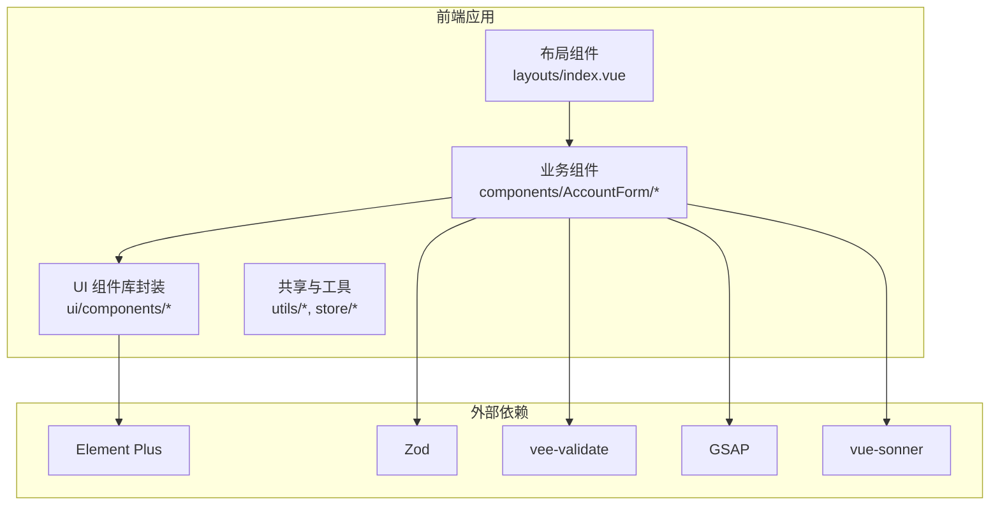
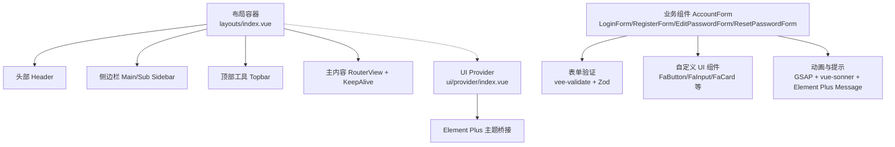
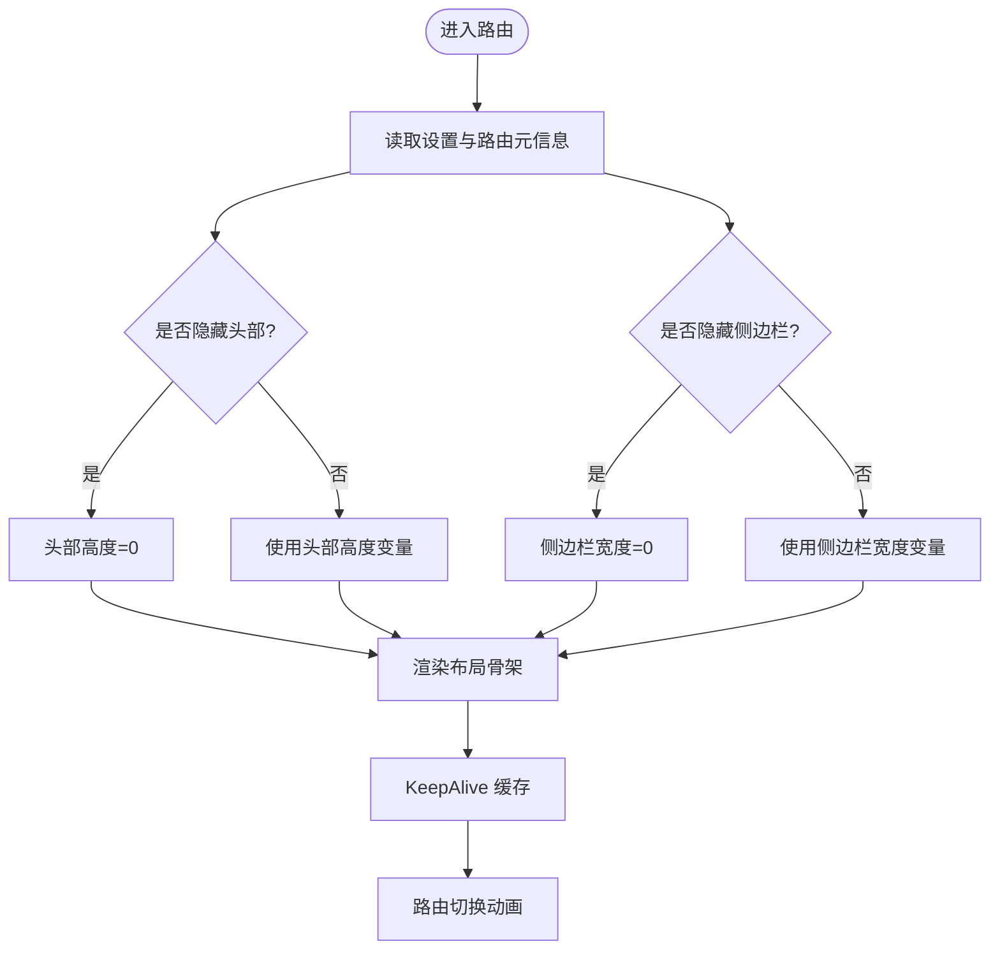
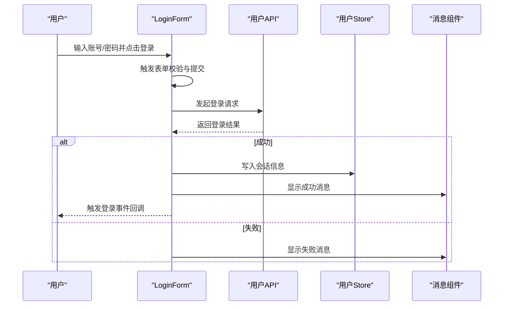
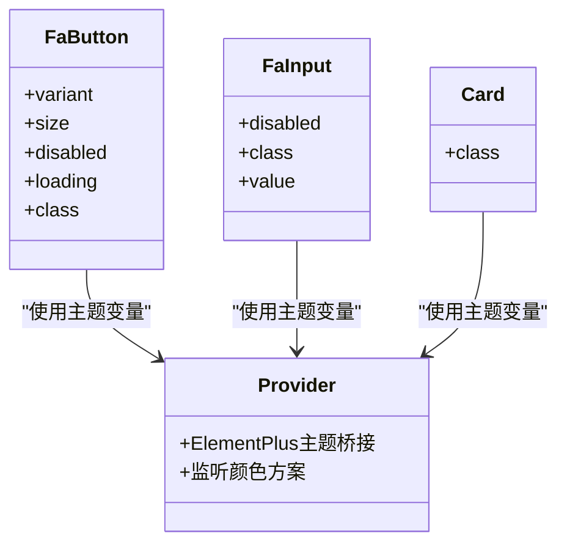
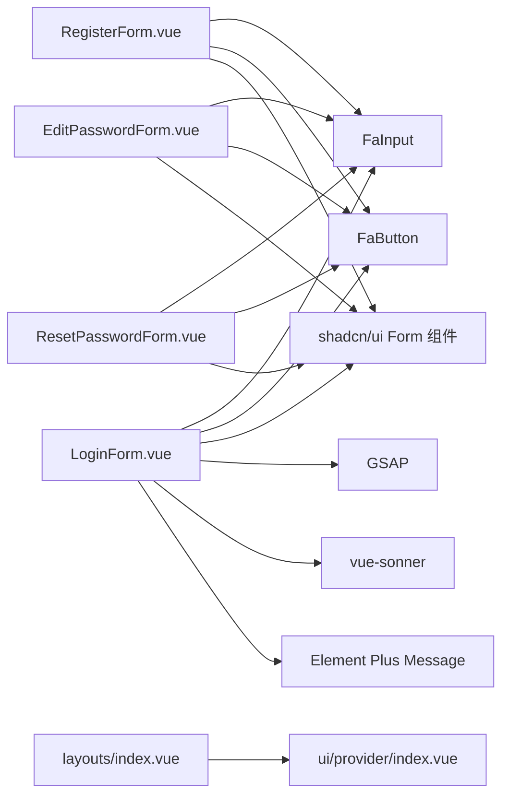

# 组件设计

<cite>
**本文引用的文件**
- [package.json](file://frontend-fantastic-admin/package.json)
- [layouts/index.vue](file://frontend-fantastic-admin/src/layouts/index.vue)
- [ui/shadcn/ui/form/index.ts](file://frontend-fantastic-admin/src/ui/shadcn/ui/form/index.ts)
- [components/AccountForm/LoginForm.vue](file://frontend-fantastic-admin/src/components/AccountForm/LoginForm.vue)
- [components/AccountForm/RegisterForm.vue](file://frontend-fantastic-admin/src/components/AccountForm/RegisterForm.vue)
- [components/AccountForm/EditPasswordForm.vue](file://frontend-fantastic-admin/src/components/AccountForm/EditPasswordForm.vue)
- [components/AccountForm/ResetPasswordForm.vue](file://frontend-fantastic-admin/src/components/AccountForm/ResetPasswordForm.vue)
- [ui/components/FaButton/index.vue](file://frontend-fantastic-admin/src/ui/components/FaButton/index.vue)
- [ui/components/FaInput/index.vue](file://frontend-fantastic-admin/src/ui/components/FaInput/index.vue)
- [ui/components/FaCard/card/Card.vue](file://frontend-fantastic-admin/src/ui/components/FaCard/card/Card.vue)
- [ui/provider/index.vue](file://frontend-fantastic-admin/src/ui/provider/index.vue)
</cite>

## 目录
1. [引言](#引言)
2. [项目结构](#项目结构)
3. [核心组件](#核心组件)
4. [架构总览](#架构总览)
5. [详细组件分析](#详细组件分析)
6. [依赖关系分析](#依赖关系分析)
7. [性能考量](#性能考量)
8. [故障排查指南](#故障排查指南)
9. [结论](#结论)
10. [附录](#附录)

## 引言
本技术文档围绕 MRR 组件设计展开，聚焦于组件架构模式、可复用组件设计与组件库集成策略。文档将深入解析共享组件（shared）、业务组件（AccountForm）与布局组件（layouts）的设计原则与实现模式；同时记录 UI 组件库（shadcn/ui）的使用方法、自定义扩展与主题定制；解释组件通信机制、事件传递与插槽使用；并提供性能优化、懒加载与代码分割建议，以及组件开发规范、命名约定与测试策略。

## 项目结构
前端采用基于 Vue 3 的单页应用架构，组件按功能域划分：业务组件位于 components 目录，布局组件位于 layouts 目录，UI 组件库封装在 ui 目录下，共享逻辑与工具位于 utils/store 等目录。包管理与构建工具通过 Vite 驱动，依赖管理采用 pnpm。

图表来源
- [layouts/index.vue:1-256](file://frontend-fantastic-admin/src/layouts/index.vue#L1-L256)
- [components/AccountForm/LoginForm.vue:1-287](file://frontend-fantastic-admin/src/components/AccountForm/LoginForm.vue#L1-L287)
- [ui/components/FaButton/index.vue:1-25](file://frontend-fantastic-admin/src/ui/components/FaButton/index.vue#L1-L25)
- [ui/components/FaInput/index.vue:1-27](file://frontend-fantastic-admin/src/ui/components/FaInput/index.vue#L1-L27)
- [package.json:27-61](file://frontend-fantastic-admin/package.json#L27-L61)

章节来源
- [package.json:1-131](file://frontend-fantastic-admin/package.json#L1-L131)
- [layouts/index.vue:1-256](file://frontend-fantastic-admin/src/layouts/index.vue#L1-L256)

## 核心组件
- 布局组件（layouts）：统一承载头部、侧边栏、标签栏、工具栏与主内容区，支持响应式与主题切换，内置 KeepAlive 缓存与路由过渡动画。
- 业务组件（AccountForm）：围绕账户相关操作的表单集合，包括登录、注册、修改密码、重置密码等，统一使用 vee-validate + Zod 进行表单校验，并结合自定义 UI 组件库进行渲染。
- UI 组件库（shadcn/ui 封装）：对 shadcn/ui 的 Form 子组件进行二次封装，提供 FormControl、FormItem、FormLabel、FormMessage、FormDescription 与 Form/Field 的导出，便于在项目内统一使用。
- 自定义 UI 组件（FaButton、FaInput、FaCard 等）：对 Element Plus 与 shadcn/ui 的能力进行组合与封装，提供变体、尺寸、状态等统一接口，增强可复用性与一致性。

章节来源
- [layouts/index.vue:1-256](file://frontend-fantastic-admin/src/layouts/index.vue#L1-L256)
- [components/AccountForm/LoginForm.vue:1-287](file://frontend-fantastic-admin/src/components/AccountForm/LoginForm.vue#L1-L287)
- [ui/shadcn/ui/form/index.ts:1-8](file://frontend-fantastic-admin/src/ui/shadcn/ui/form/index.ts#L1-L8)
- [ui/components/FaButton/index.vue:1-25](file://frontend-fantastic-admin/src/ui/components/FaButton/index.vue#L1-L25)
- [ui/components/FaInput/index.vue:1-27](file://frontend-fantastic-admin/src/ui/components/FaInput/index.vue#L1-L27)
- [ui/components/FaCard/card/Card.vue:1-22](file://frontend-fantastic-admin/src/ui/components/FaCard/card/Card.vue#L1-L22)

## 架构总览
整体架构采用“布局层 + 业务层 + UI 层”的分层设计。布局层负责页面骨架与全局行为控制；业务层聚焦领域功能与交互；UI 层提供可复用的视觉与交互组件，并通过 Provider 对 Element Plus 等第三方库进行主题桥接。

图表来源
- [layouts/index.vue:1-256](file://frontend-fantastic-admin/src/layouts/index.vue#L1-L256)
- [components/AccountForm/LoginForm.vue:1-287](file://frontend-fantastic-admin/src/components/AccountForm/LoginForm.vue#L1-L287)
- [ui/provider/index.vue:1-37](file://frontend-fantastic-admin/src/ui/provider/index.vue#L1-L37)

## 详细组件分析

### 布局组件（layouts）
- 设计原则
  - 条件渲染：根据设置与路由元信息动态控制头部、侧边栏、标签栏、工具栏的显示/隐藏。
  - 响应式适配：移动端模式下侧边栏采用覆盖层与背景遮罩，支持折叠与滚动锁定。
  - 主题与样式变量：通过 CSS 变量与 UnoCSS 实现主题切换与布局尺寸动态计算。
  - 内容缓存：使用 KeepAlive 对路由组件进行缓存，减少重复渲染开销。
- 关键特性
  - 通过计算属性与 watch 控制侧边栏折叠状态与溢出处理。
  - 使用 Transition + KeepAlive 实现路由切换动画与缓存。
  - 提供自由位置插槽用于注入额外 UI 元素。
- 通信机制
  - 通过事件总线触发全局设置面板开关。
  - 通过 Pinia Store 读取与更新菜单、标签栏、工具栏等全局配置。

图表来源
- [layouts/index.vue:22-76](file://frontend-fantastic-admin/src/layouts/index.vue#L22-L76)
- [layouts/index.vue:99-105](file://frontend-fantastic-admin/src/layouts/index.vue#L99-L105)

章节来源
- [layouts/index.vue:1-256](file://frontend-fantastic-admin/src/layouts/index.vue#L1-L256)

### 业务组件（AccountForm）
- 设计模式
  - 表单即组件：每个子功能（登录、注册、修改密码、重置密码）独立为一个组件，职责单一、易于维护与测试。
  - 统一校验：使用 vee-validate + Zod 定义类型安全的表单校验规则，支持初始值、联动校验与错误消息展示。
  - 统一渲染：通过自定义 UI 组件（FaInput、FaButton 等）与 shadcn/ui Form 组件组合，保证风格一致。
  - 事件驱动：通过 emits 向父组件传递用户行为（如跳转到登录/注册），实现组件间解耦。
- 登录组件（LoginForm）
  - 支持记住账号、提交态与动画反馈；登录成功后写入会话信息并触发事件。
  - 使用 Element Plus Message 与 vue-sonner 进行消息提示与成功/失败反馈。
- 注册组件（RegisterForm）
  - 密码强度提示与二次密码一致性校验；提供“去登录”跳转。
- 修改密码组件（EditPasswordForm）
  - 输入原密码与新密码并确认，提交后提示并触发登出流程。
- 重置密码组件（ResetPasswordForm）
  - 支持验证码倒计时与输入框联动；提供“去登录”跳转。

图表来源
- [components/AccountForm/LoginForm.vue:50-98](file://frontend-fantastic-admin/src/components/AccountForm/LoginForm.vue#L50-L98)
- [components/AccountForm/LoginForm.vue:62-74](file://frontend-fantastic-admin/src/components/AccountForm/LoginForm.vue#L62-L74)

章节来源
- [components/AccountForm/LoginForm.vue:1-287](file://frontend-fantastic-admin/src/components/AccountForm/LoginForm.vue#L1-L287)
- [components/AccountForm/RegisterForm.vue:1-101](file://frontend-fantastic-admin/src/components/AccountForm/RegisterForm.vue#L1-L101)
- [components/AccountForm/EditPasswordForm.vue:1-91](file://frontend-fantastic-admin/src/components/AccountForm/EditPasswordForm.vue#L1-L91)
- [components/AccountForm/ResetPasswordForm.vue:1-109](file://frontend-fantastic-admin/src/components/AccountForm/ResetPasswordForm.vue#L1-L109)

### UI 组件库（shadcn/ui）与自定义扩展
- shadcn/ui 集成
  - 在项目中以模块化方式导出 Form 子组件与注入键，便于在业务组件中直接使用。
- 自定义组件扩展
  - FaButton：封装 Button 变体与尺寸，支持 loading/disabled 状态，内置加载图标。
  - FaInput：泛型绑定 v-model，统一类名拼接与禁用状态。
  - FaCard：基于卡片语义封装，提供统一的边框、背景与阴影。
- 主题定制
  - 通过 Provider 将 Element Plus 的颜色体系映射到 CSS 变量，实现与项目主题的一致性。
  - 监听颜色方案变化，动态计算主色明暗梯度，确保 Element Plus 组件与主题同步。

图表来源
- [ui/components/FaButton/index.vue:1-25](file://frontend-fantastic-admin/src/ui/components/FaButton/index.vue#L1-L25)
- [ui/components/FaInput/index.vue:1-27](file://frontend-fantastic-admin/src/ui/components/FaInput/index.vue#L1-L27)
- [ui/components/FaCard/card/Card.vue:1-22](file://frontend-fantastic-admin/src/ui/components/FaCard/card/Card.vue#L1-L22)
- [ui/provider/index.vue:1-37](file://frontend-fantastic-admin/src/ui/provider/index.vue#L1-L37)

章节来源
- [ui/shadcn/ui/form/index.ts:1-8](file://frontend-fantastic-admin/src/ui/shadcn/ui/form/index.ts#L1-L8)
- [ui/components/FaButton/index.vue:1-25](file://frontend-fantastic-admin/src/ui/components/FaButton/index.vue#L1-L25)
- [ui/components/FaInput/index.vue:1-27](file://frontend-fantastic-admin/src/ui/components/FaInput/index.vue#L1-L27)
- [ui/components/FaCard/card/Card.vue:1-22](file://frontend-fantastic-admin/src/ui/components/FaCard/card/Card.vue#L1-L22)
- [ui/provider/index.vue:1-37](file://frontend-fantastic-admin/src/ui/provider/index.vue#L1-L37)

## 依赖关系分析
- 组件间依赖
  - AccountForm 组件依赖 UI 组件库（FaButton、FaInput、FaCard）与 shadcn/ui Form 组件。
  - 布局组件依赖插槽系统与事件总线，用于注入自由位置元素与全局设置面板。
- 外部依赖
  - vee-validate + Zod：提供类型安全的表单校验与错误收集。
  - Element Plus：提供基础 UI 能力与国际化配置。
  - GSAP：提供登录失败抖动与按钮悬停动画。
  - vue-sonner：提供轻量级通知提示。
- 依赖图

图表来源
- [components/AccountForm/LoginForm.vue:1-287](file://frontend-fantastic-admin/src/components/AccountForm/LoginForm.vue#L1-L287)
- [components/AccountForm/RegisterForm.vue:1-101](file://frontend-fantastic-admin/src/components/AccountForm/RegisterForm.vue#L1-L101)
- [components/AccountForm/EditPasswordForm.vue:1-91](file://frontend-fantastic-admin/src/components/AccountForm/EditPasswordForm.vue#L1-L91)
- [components/AccountForm/ResetPasswordForm.vue:1-109](file://frontend-fantastic-admin/src/components/AccountForm/ResetPasswordForm.vue#L1-L109)
- [layouts/index.vue:1-256](file://frontend-fantastic-admin/src/layouts/index.vue#L1-L256)
- [ui/provider/index.vue:1-37](file://frontend-fantastic-admin/src/ui/provider/index.vue#L1-L37)

章节来源
- [package.json:27-61](file://frontend-fantastic-admin/package.json#L27-L61)

## 性能考量
- 渲染性能
  - 使用 KeepAlive 缓存路由组件，避免重复挂载与数据请求。
  - 路由切换使用过渡动画，减少闪烁与布局抖动。
- 动画与交互
  - 登录失败抖动与按钮悬停动画采用 GSAP，注意在“减少动态效果”偏好下自动降级。
- 资源加载
  - 通过 vee-validate 的懒加载与按需导入减少首屏体积。
  - UI 组件封装统一入口，便于后续按需引入与 Tree Shaking。
- 代码分割
  - 布局与业务组件拆分清晰，配合路由懒加载可进一步优化首屏加载。
- 主题与样式
  - 通过 Provider 将 Element Plus 颜色映射到 CSS 变量，减少运行时样式计算成本。

[本节为通用性能建议，无需特定文件来源]

## 故障排查指南
- 登录失败
  - 现象：登录按钮禁用且出现错误提示。
  - 排查：检查网络请求返回结构与消息解析逻辑；确认本地存储的账号记忆状态。
- 表单校验异常
  - 现象：输入框无错误提示或提示不准确。
  - 排查：确认 vee-validate 的 FormField 与 FormControl 绑定正确；检查 Zod 规则与字段名称一致性。
- 动画无效
  - 现象：登录失败抖动或按钮悬停无效果。
  - 排查：确认浏览器支持 GSAP 并检查 prefers-reduced-motion 媒体查询分支。
- 主题不一致
  - 现象：Element Plus 组件颜色与项目主题不一致。
  - 排查：确认 Provider 中颜色变量映射与颜色方案监听逻辑正常。

章节来源
- [components/AccountForm/LoginForm.vue:33-98](file://frontend-fantastic-admin/src/components/AccountForm/LoginForm.vue#L33-L98)
- [ui/provider/index.vue:6-29](file://frontend-fantastic-admin/src/ui/provider/index.vue#L6-L29)

## 结论
本组件设计以“布局 + 业务 + UI”三层架构为核心，通过统一的表单校验与 UI 组件封装，实现了高内聚、低耦合的可复用组件体系。借助 shadcn/ui 与 Element Plus 的组合，既保证了组件一致性，又提供了灵活的主题定制能力。未来可在路由懒加载、按需引入与测试覆盖率方面持续优化，以进一步提升性能与可维护性。

## 附录
- 开发规范
  - 命名约定：组件文件夹采用帕斯卡命名，组件内部 name 选项与文件名保持一致；事件命名采用 onXxx 模式。
  - 插槽使用：优先使用具名插槽与作用域插槽，明确父子组件契约。
  - 样式组织：统一使用 CSS 变量与 UnoCSS，避免内联样式的滥用。
- 测试策略
  - 单元测试：针对表单校验规则与组件渲染快照进行断言。
  - 集成测试：模拟登录/注册流程，验证事件发射与状态变更。
  - 端到端测试：覆盖关键路径（登录、切换主题、侧边栏折叠）。

[本节为通用规范与策略建议，无需特定文件来源]