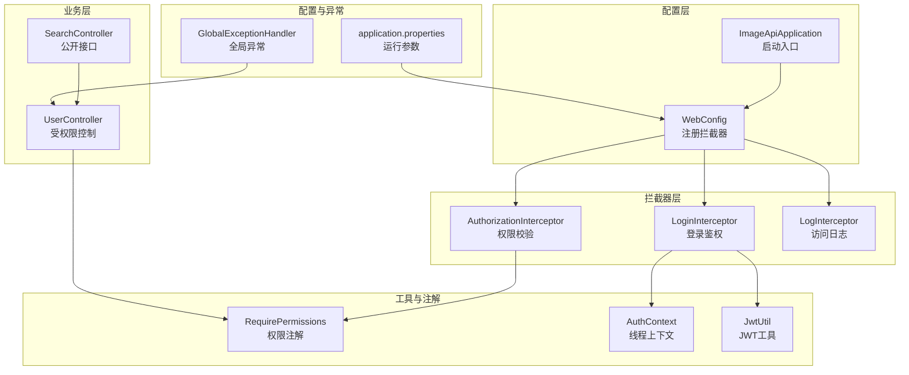
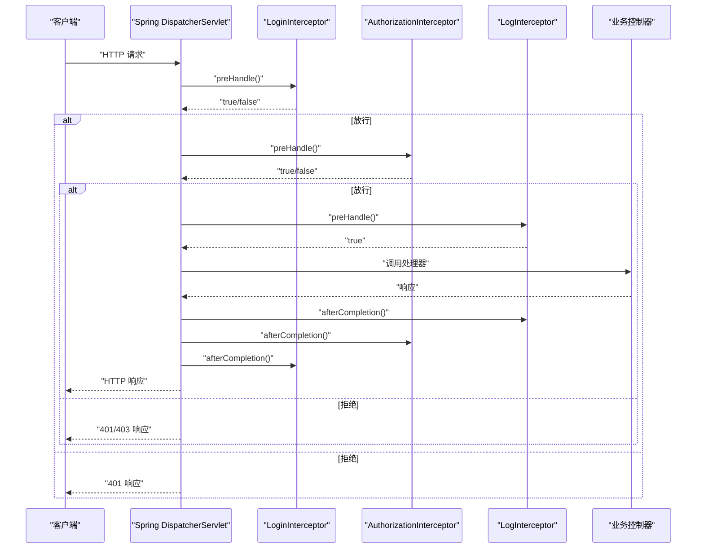
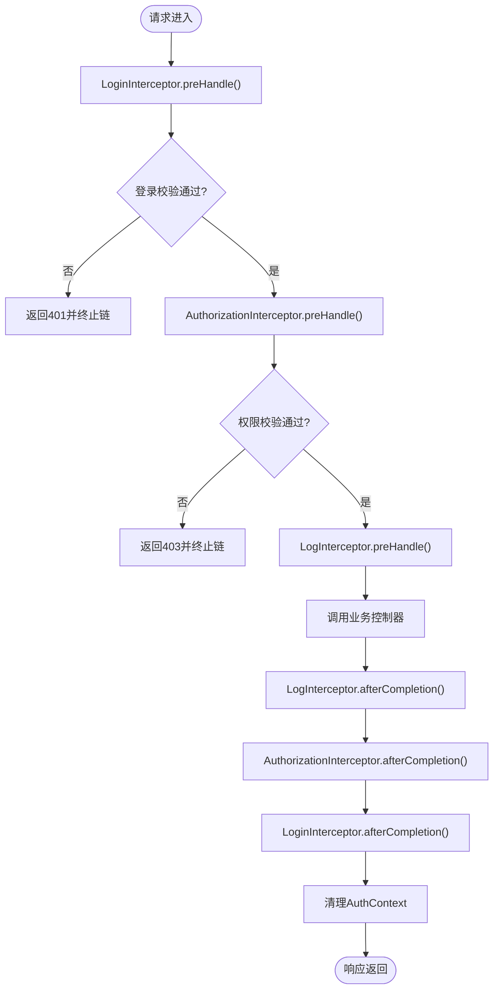
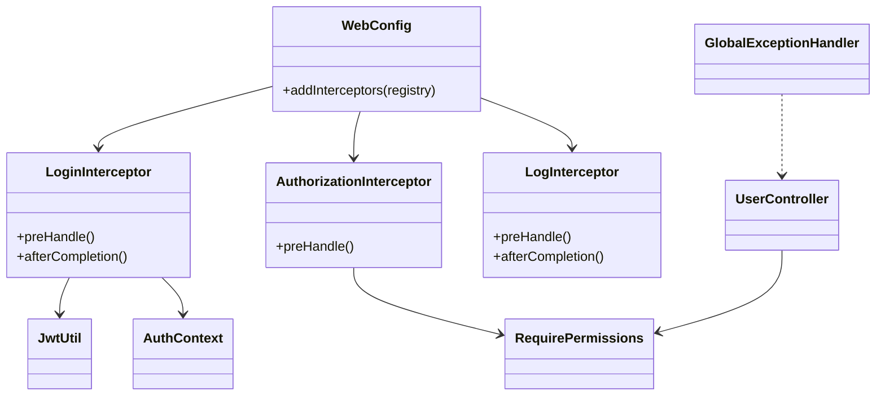

# 拦截器注册配置

<cite>
**本文引用的文件**
- [WebConfig.java](file://backend-repo/src/main/java/com/zjcxph/imgapi/config/WebConfig.java)
- [AuthorizationInterceptor.java](file://backend-repo/src/main/java/com/zjcxph/imgapi/interceptors/AuthorizationInterceptor.java)
- [LoginInterceptor.java](file://backend-repo/src/main/java/com/zjcxph/imgapi/interceptors/LoginInterceptor.java)
- [LogInterceptor.java](file://backend-repo/src/main/java/com/zjcxph/imgapi/interceptors/LogInterceptor.java)
- [RequirePermissions.java](file://backend-repo/src/main/java/com/zjcxph/imgapi/annotation/RequirePermissions.java)
- [AuthContext.java](file://backend-repo/src/main/java/com/zjcxph/imgapi/utils/AuthContext.java)
- [JwtUtil.java](file://backend-repo/src/main/java/com/zjcxph/imgapi/utils/JwtUtil.java)
- [UserController.java](file://backend-repo/src/main/java/com/zjcxph/imgapi/controller/UserController.java)
- [SearchController.java](file://backend-repo/src/main/java/com/zjcxph/imgapi/controller/SearchController.java)
- [GlobalExceptionHandler.java](file://backend-repo/src/main/java/com/zjcxph/imgapi/handler/GlobalExceptionHandler.java)
- [application.properties](file://backend-repo/src/main/resources/application.properties)
- [ImageApiApplication.java](file://backend-repo/src/main/java/com/zjcxph/imgapi/ImageApiApplication.java)
</cite>

## 目录
1. [简介](#简介)
2. [项目结构](#项目结构)
3. [核心组件](#核心组件)
4. [架构总览](#架构总览)
5. [详细组件分析](#详细组件分析)
6. [依赖分析](#依赖分析)
7. [性能考虑](#性能考虑)
8. [故障排查指南](#故障排查指南)
9. [结论](#结论)
10. [附录](#附录)

## 简介
本文件面向MRR后端项目的拦截器注册与配置，围绕WebConfig中的拦截器注册方法、执行顺序与匹配规则、路径模式语法与优先级、全局拦截器与特定处理器的差异展开，并提供拦截器链执行流程图、调试方法、性能监控与异常处理配置建议，以及动态增删拦截器的实践思路。

## 项目结构
后端采用Spring MVC + Spring Boot标准结构，拦截器注册集中在WebConfig中，拦截器实现位于interceptors包，权限注解在annotation包，上下文与工具类在utils包，控制器示例在controller包，全局异常处理在handler包，运行时配置在application.properties。

图表来源
- [WebConfig.java:23-59](file://backend-repo/src/main/java/com/zjcxph/imgapi/config/WebConfig.java#L23-L59)
- [LoginInterceptor.java:29-52](file://backend-repo/src/main/java/com/zjcxph/imgapi/interceptors/LoginInterceptor.java#L29-L52)
- [AuthorizationInterceptor.java:22-56](file://backend-repo/src/main/java/com/zjcxph/imgapi/interceptors/AuthorizationInterceptor.java#L22-L56)
- [LogInterceptor.java:21-58](file://backend-repo/src/main/java/com/zjcxph/imgapi/interceptors/LogInterceptor.java#L21-L58)
- [UserController.java:60-93](file://backend-repo/src/main/java/com/zjcxph/imgapi/controller/UserController.java#L60-L93)
- [SearchController.java:20-37](file://backend-repo/src/main/java/com/zjcxph/imgapi/controller/SearchController.java#L20-L37)
- [RequirePermissions.java:8-12](file://backend-repo/src/main/java/com/zjcxph/imgapi/annotation/RequirePermissions.java#L8-L12)
- [AuthContext.java:5-27](file://backend-repo/src/main/java/com/zjcxph/imgapi/utils/AuthContext.java#L5-L27)
- [JwtUtil.java:61-75](file://backend-repo/src/main/java/com/zjcxph/imgapi/utils/JwtUtil.java#L61-L75)
- [application.properties:35-45](file://backend-repo/src/main/resources/application.properties#L35-L45)
- [GlobalExceptionHandler.java:14-53](file://backend-repo/src/main/java/com/zjcxph/imgapi/handler/GlobalExceptionHandler.java#L14-L53)

章节来源
- [WebConfig.java:23-59](file://backend-repo/src/main/java/com/zjcxph/imgapi/config/WebConfig.java#L23-L59)
- [application.properties:1-49](file://backend-repo/src/main/resources/application.properties#L1-L49)

## 核心组件
- WebConfig：实现WebMvcConfigurer，通过addInterceptors集中注册拦截器并配置路径匹配与排除。
- LoginInterceptor：提取并校验Authorization头中的Bearer Token，解析为AuthSession并注入到请求属性与线程上下文。
- AuthorizationInterceptor：读取控制器或方法上的RequirePermissions注解，基于会话权限进行放行或拒绝。
- LogInterceptor：记录请求开始时间，在afterCompletion阶段计算耗时并持久化访问日志。
- RequirePermissions：声明式权限注解，可标注方法或类型。
- AuthContext：线程本地存储当前用户会话，支持清理。
- JwtUtil：JWT生成与解析工具，从环境变量加载密钥。
- GlobalExceptionHandler：统一异常处理，对业务异常、参数校验等进行标准化返回。

章节来源
- [WebConfig.java:23-59](file://backend-repo/src/main/java/com/zjcxph/imgapi/config/WebConfig.java#L23-L59)
- [LoginInterceptor.java:29-57](file://backend-repo/src/main/java/com/zjcxph/imgapi/interceptors/LoginInterceptor.java#L29-L57)
- [AuthorizationInterceptor.java:22-76](file://backend-repo/src/main/java/com/zjcxph/imgapi/interceptors/AuthorizationInterceptor.java#L22-L76)
- [LogInterceptor.java:21-77](file://backend-repo/src/main/java/com/zjcxph/imgapi/interceptors/LogInterceptor.java#L21-L77)
- [RequirePermissions.java:8-12](file://backend-repo/src/main/java/com/zjcxph/imgapi/annotation/RequirePermissions.java#L8-L12)
- [AuthContext.java:5-27](file://backend-repo/src/main/java/com/zjcxph/imgapi/utils/AuthContext.java#L5-L27)
- [JwtUtil.java:12-75](file://backend-repo/src/main/java/com/zjcxph/imgapi/utils/JwtUtil.java#L12-L75)
- [GlobalExceptionHandler.java:14-53](file://backend-repo/src/main/java/com/zjcxph/imgapi/handler/GlobalExceptionHandler.java#L14-L53)

## 架构总览
拦截器注册与执行遵循Spring MVC拦截器链机制：按注册顺序依次匹配路径，满足条件的拦截器在preHandle阶段按注册顺序执行；处理器执行完成后，再按相反顺序在afterCompletion阶段执行。

图表来源
- [WebConfig.java:24-58](file://backend-repo/src/main/java/com/zjcxph/imgapi/config/WebConfig.java#L24-L58)
- [LoginInterceptor.java:29-57](file://backend-repo/src/main/java/com/zjcxph/imgapi/interceptors/LoginInterceptor.java#L29-L57)
- [AuthorizationInterceptor.java:22-56](file://backend-repo/src/main/java/com/zjcxph/imgapi/interceptors/AuthorizationInterceptor.java#L22-L56)
- [LogInterceptor.java:21-58](file://backend-repo/src/main/java/com/zjcxph/imgapi/interceptors/LogInterceptor.java#L21-L58)

## 详细组件分析

### WebConfig拦截器注册与匹配规则
- 注册顺序即执行顺序：LoginInterceptor → AuthorizationInterceptor → LogInterceptor。
- 路径匹配采用addPathPatterns("/**")全量匹配，随后通过excludePathPatterns排除静态资源、Swagger、健康检查、登录等无需拦截的端点。
- 全局拦截器：三者均对/**生效，确保所有业务请求都会经过登录、权限与日志拦截。
- 特定处理器差异：通过注解@RequirePermissions在控制器方法上声明所需权限，未标注时默认放行；部分公开接口如/v2/search/**明确排除在登录拦截之外。

章节来源
- [WebConfig.java:24-58](file://backend-repo/src/main/java/com/zjcxph/imgapi/config/WebConfig.java#L24-L58)
- [UserController.java:60-93](file://backend-repo/src/main/java/com/zjcxph/imgapi/controller/UserController.java#L60-L93)
- [SearchController.java:20-37](file://backend-repo/src/main/java/com/zjcxph/imgapi/controller/SearchController.java#L20-L37)

### 登录拦截器（LoginInterceptor）
- 职责：校验Authorization头，解析JWT，注入AuthSession到请求属性与线程上下文，处理OPTIONS预检请求。
- 关键行为：
  - 提取Bearer Token并校验，失败返回401。
  - 解析成功后设置AuthContext，便于后续拦截器与业务读取当前用户。
  - afterCompletion阶段清理线程上下文，避免内存泄漏。
- 异常处理：捕获JWT解析异常，记录日志并返回401。

章节来源
- [LoginInterceptor.java:29-57](file://backend-repo/src/main/java/com/zjcxph/imgapi/interceptors/LoginInterceptor.java#L29-L57)
- [AuthContext.java:5-27](file://backend-repo/src/main/java/com/zjcxph/imgapi/utils/AuthContext.java#L5-L27)
- [JwtUtil.java:61-75](file://backend-repo/src/main/java/com/zjcxph/imgapi/utils/JwtUtil.java#L61-L75)

### 权限拦截器（AuthorizationInterceptor）
- 职责：读取@RequirePermissions注解，判断会话角色或权限集合是否满足要求。
- 关键行为：
  - 非Controller方法直接放行。
  - 未标注权限注解或空权限数组默认放行。
  - 会话为空返回401，管理员或具备user:manage/role:manage直接放行。
  - 否则要求所有权限均需具备，否则返回403。
- 与控制器结合：UserController中多处使用@RequirePermissions标注敏感操作。

章节来源
- [AuthorizationInterceptor.java:22-76](file://backend-repo/src/main/java/com/zjcxph/imgapi/interceptors/AuthorizationInterceptor.java#L22-L76)
- [RequirePermissions.java:8-12](file://backend-repo/src/main/java/com/zjcxph/imgapi/annotation/RequirePermissions.java#L8-L12)
- [UserController.java:60-93](file://backend-repo/src/main/java/com/zjcxph/imgapi/controller/UserController.java#L60-L93)

### 日志拦截器（LogInterceptor）
- 职责：记录请求开始时间并在afterCompletion阶段计算执行耗时，保存访问日志。
- 关键行为：
  - 跳过OPTIONS与静态资源请求。
  - 排除/docs、/swagger-ui、/v3/api-docs、/favicon.ico、/error、/actuator等非业务请求。
  - 采集客户端IP、URI、方法、UA、查询串、响应状态、执行时间等字段。

章节来源
- [LogInterceptor.java:21-77](file://backend-repo/src/main/java/com/zjcxph/imgapi/interceptors/LogInterceptor.java#L21-L77)

### 路径模式语法与优先级
- 语法要点：
  - /** 匹配所有路径。
  - 支持多段通配符与前缀匹配，如/v1/auth/login/**。
  - 支持精确路径，如/actuator/health。
- 优先级规则：
  - 注册顺序决定拦截器链顺序。
  - excludePathPatterns用于排除特定路径，优先于addPathPatterns。
  - 控制器方法上的@RequirePermissions注解仅影响AuthorizationInterceptor的判定，不影响路径匹配。

章节来源
- [WebConfig.java:24-58](file://backend-repo/src/main/java/com/zjcxph/imgapi/config/WebConfig.java#L24-L58)

### 全局拦截器与特定处理器差异
- 全局拦截器：LoginInterceptor、AuthorizationInterceptor、LogInterceptor均对/**生效，覆盖所有业务端点。
- 特定处理器差异：
  - LoginInterceptor对/login、/v1/auth/login、/v2/search/**等路径排除，避免循环鉴权。
  - AuthorizationInterceptor通过@RequirePermissions在方法级别声明权限需求，未标注默认放行。
  - LogInterceptor对Swagger与Actuator等管理端点排除，减少噪音日志。

章节来源
- [WebConfig.java:24-58](file://backend-repo/src/main/java/com/zjcxph/imgapi/config/WebConfig.java#L24-L58)
- [UserController.java:60-93](file://backend-repo/src/main/java/com/zjcxph/imgapi/controller/UserController.java#L60-L93)
- [SearchController.java:20-37](file://backend-repo/src/main/java/com/zjcxph/imgapi/controller/SearchController.java#L20-L37)

### 拦截器链执行流程图

图表来源
- [LoginInterceptor.java:29-57](file://backend-repo/src/main/java/com/zjcxph/imgapi/interceptors/LoginInterceptor.java#L29-L57)
- [AuthorizationInterceptor.java:22-56](file://backend-repo/src/main/java/com/zjcxph/imgapi/interceptors/AuthorizationInterceptor.java#L22-L56)
- [LogInterceptor.java:21-58](file://backend-repo/src/main/java/com/zjcxph/imgapi/interceptors/LogInterceptor.java#L21-L58)
- [AuthContext.java:5-27](file://backend-repo/src/main/java/com/zjcxph/imgapi/utils/AuthContext.java#L5-L27)

## 依赖分析
- 组件耦合：
  - WebConfig依赖三个拦截器Bean，负责装配与注册。
  - LoginInterceptor依赖JwtUtil与AuthContext，负责会话注入。
  - AuthorizationInterceptor依赖RequirePermissions注解与AuthSession，负责权限判定。
  - LogInterceptor依赖LogService，负责日志落库。
- 外部依赖：
  - application.properties启用actuator暴露，LogInterceptor排除了/actuator/**以避免日志风暴。
  - 启动类ImageApiApplication启用定时任务、配置扫描与MyBatis Mapper扫描。

图表来源
- [WebConfig.java:23-59](file://backend-repo/src/main/java/com/zjcxph/imgapi/config/WebConfig.java#L23-L59)
- [LoginInterceptor.java:29-57](file://backend-repo/src/main/java/com/zjcxph/imgapi/interceptors/LoginInterceptor.java#L29-L57)
- [AuthorizationInterceptor.java:22-56](file://backend-repo/src/main/java/com/zjcxph/imgapi/interceptors/AuthorizationInterceptor.java#L22-L56)
- [LogInterceptor.java:21-58](file://backend-repo/src/main/java/com/zjcxph/imgapi/interceptors/LogInterceptor.java#L21-L58)
- [RequirePermissions.java:8-12](file://backend-repo/src/main/java/com/zjcxph/imgapi/annotation/RequirePermissions.java#L8-L12)
- [AuthContext.java:5-27](file://backend-repo/src/main/java/com/zjcxph/imgapi/utils/AuthContext.java#L5-L27)
- [JwtUtil.java:61-75](file://backend-repo/src/main/java/com/zjcxph/imgapi/utils/JwtUtil.java#L61-L75)
- [UserController.java:60-93](file://backend-repo/src/main/java/com/zjcxph/imgapi/controller/UserController.java#L60-L93)
- [GlobalExceptionHandler.java:14-53](file://backend-repo/src/main/java/com/zjcxph/imgapi/handler/GlobalExceptionHandler.java#L14-L53)

章节来源
- [application.properties:35-45](file://backend-repo/src/main/resources/application.properties#L35-L45)
- [ImageApiApplication.java:9-12](file://backend-repo/src/main/java/com/zjcxph/imgapi/ImageApiApplication.java#L9-L12)

## 性能考虑
- 拦截器开销：
  - LoginInterceptor与AuthorizationInterceptor均为轻量逻辑，主要成本在JWT解析与权限比对。
  - LogInterceptor在afterCompletion阶段写库，建议关注数据库写入延迟与索引设计。
- 路由排除：
  - 已排除Swagger、静态资源、健康检查等高频但低价值请求，降低日志与鉴权压力。
- Actuator暴露：
  - application.properties开启actuator指标暴露，便于监控系统健康度与请求指标，但已通过excludePathPatterns避免被LogInterceptor记录。

章节来源
- [LogInterceptor.java:36-58](file://backend-repo/src/main/java/com/zjcxph/imgapi/interceptors/LogInterceptor.java#L36-L58)
- [application.properties:35-45](file://backend-repo/src/main/resources/application.properties#L35-L45)

## 故障排查指南
- 常见问题与定位：
  - 401未登录：确认Authorization头格式为Bearer Token，检查JWT是否过期或签名异常。
  - 403权限不足：核对@RequirePermissions注解值与当前会话权限列表，确认是否为管理员角色。
  - OPTIONS预检失败：LoginInterceptor对OPTIONS直接放行，若仍失败检查CORS配置。
  - 日志缺失：确认请求未被LogInterceptor的排除规则命中，检查数据库连接与日志表结构。
- 调试方法：
  - 在LoginInterceptor与AuthorizationInterceptor中增加必要日志，观察preHandle返回值。
  - 使用GlobalExceptionHandler捕获异常，统一输出错误码与消息，便于前后端联调。
  - 通过actuator端点获取健康与指标信息，辅助定位性能瓶颈。

章节来源
- [LoginInterceptor.java:29-57](file://backend-repo/src/main/java/com/zjcxph/imgapi/interceptors/LoginInterceptor.java#L29-L57)
- [AuthorizationInterceptor.java:22-56](file://backend-repo/src/main/java/com/zjcxph/imgapi/interceptors/AuthorizationInterceptor.java#L22-L56)
- [LogInterceptor.java:60-77](file://backend-repo/src/main/java/com/zjcxph/imgapi/interceptors/LogInterceptor.java#L60-L77)
- [GlobalExceptionHandler.java:14-53](file://backend-repo/src/main/java/com/zjcxph/imgapi/handler/GlobalExceptionHandler.java#L14-L53)

## 结论
MRR项目的拦截器体系通过WebConfig集中注册，形成Login → Authorization → Log的稳定执行链。路径匹配采用全局+排除策略，既保证安全又兼顾性能。配合@RequirePermissions注解实现细粒度权限控制，结合全局异常处理与actuator监控，构建了可维护、可观测的后端安全网关。

## 附录

### 动态添加与移除拦截器（实践建议）
- 动态添加：
  - 可在WebConfig中根据环境变量或配置中心开关，条件性地注册拦截器或调整excludePathPatterns。
  - 对于需要按租户或功能开关启用的拦截器，可在注册时读取外部配置。
- 动态移除：
  - 通过条件化配置禁用对应拦截器Bean，或在WebConfig中根据配置跳过注册。
  - 注意保持拦截器链的完整性与安全性，避免误关闭关键拦截器。

章节来源
- [WebConfig.java:23-59](file://backend-repo/src/main/java/com/zjcxph/imgapi/config/WebConfig.java#L23-L59)
- [application.properties:1-49](file://backend-repo/src/main/resources/application.properties#L1-L49)