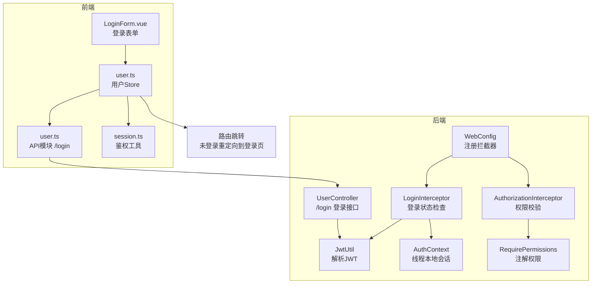
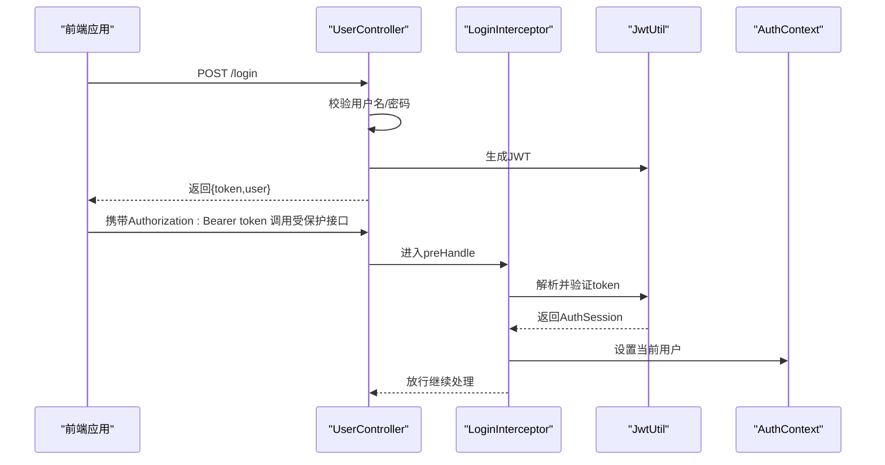
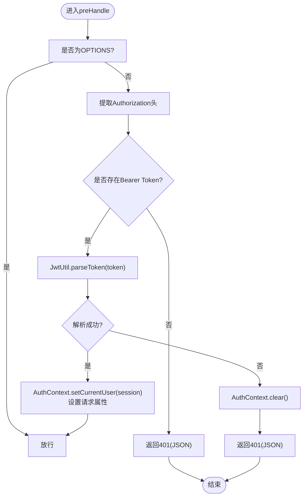
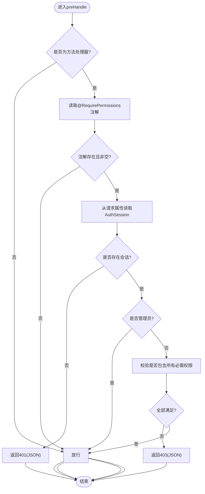
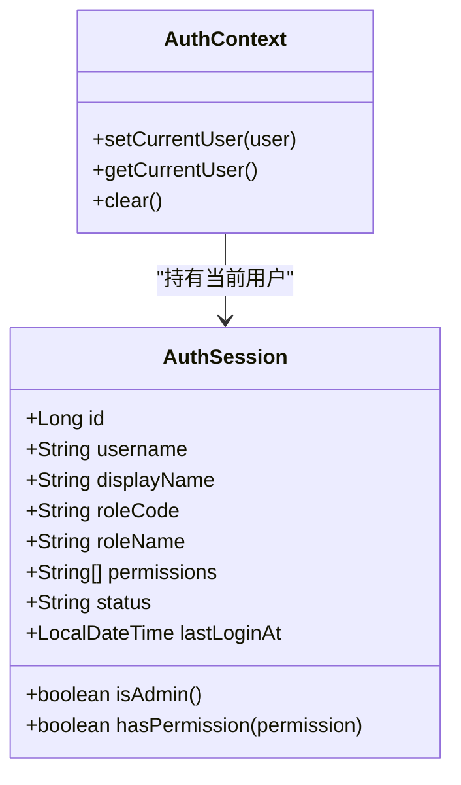
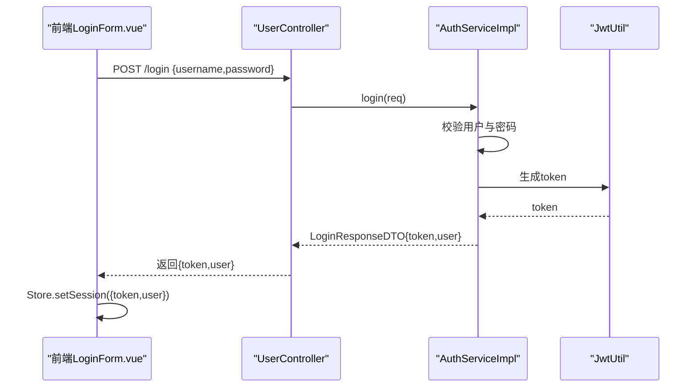
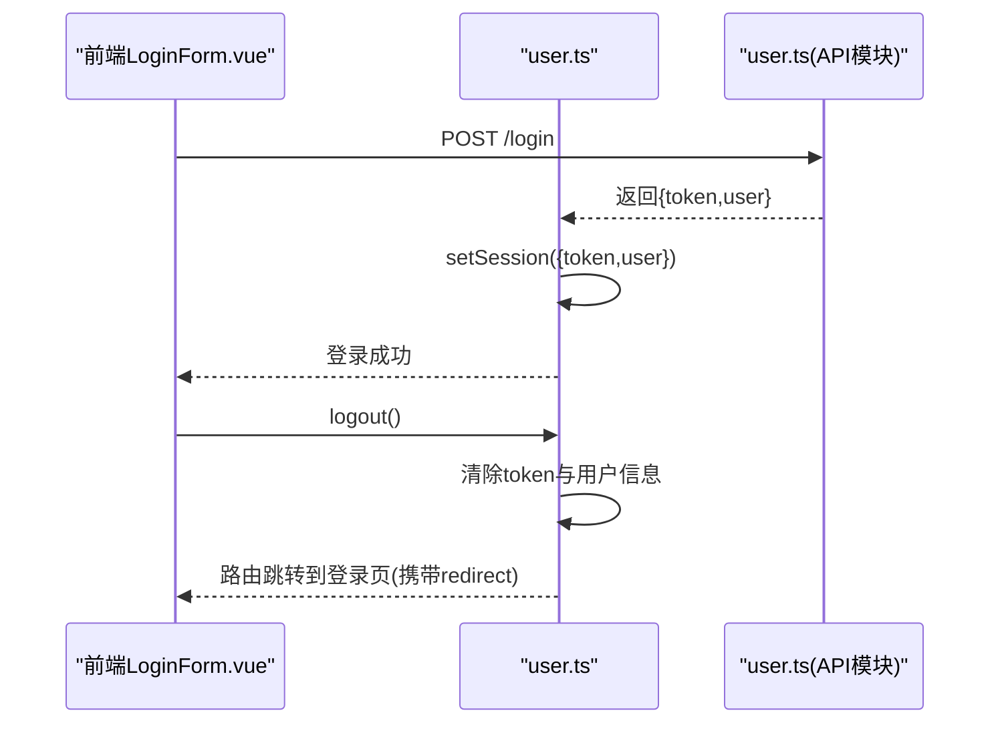
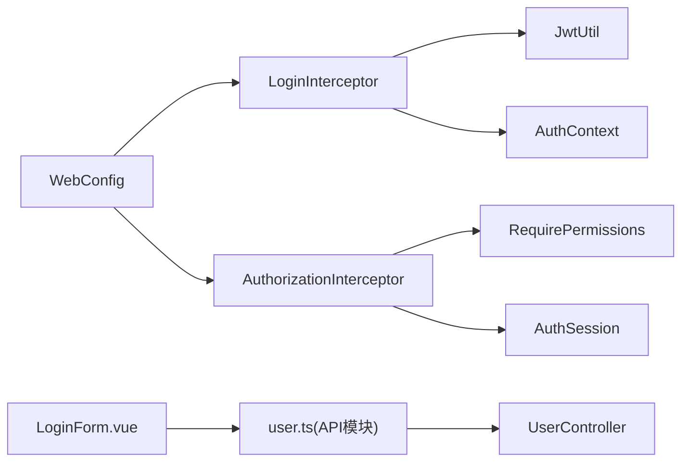

# 登录拦截器

<cite>
**本文档引用的文件**
- [LoginInterceptor.java](file://backend-repo/src/main/java/com/zjcxph/imgapi/interceptors/LoginInterceptor.java)
- [AuthorizationInterceptor.java](file://backend-repo/src/main/java/com/zjcxph/imgapi/interceptors/AuthorizationInterceptor.java)
- [WebConfig.java](file://backend-repo/src/main/java/com/zjcxph/imgapi/config/WebConfig.java)
- [AuthSession.java](file://backend-repo/src/main/java/com/zjcxph/imgapi/common/AuthSession.java)
- [AuthContext.java](file://backend-repo/src/main/java/com/zjcxph/imgapi/utils/AuthContext.java)
- [JwtUtil.java](file://backend-repo/src/main/java/com/zjcxph/imgapi/utils/JwtUtil.java)
- [UserController.java](file://backend-repo/src/main/java/com/zjcxph/imgapi/controller/UserController.java)
- [AuthService.java](file://backend-repo/src/main/java/com/zjcxph/imgapi/service/AuthService.java)
- [AuthServiceImpl.java](file://backend-repo/src/main/java/com/zjcxph/imgapi/service/impl/AuthServiceImpl.java)
- [RequirePermissions.java](file://backend-repo/src/main/java/com/zjcxph/imgapi/annotation/RequirePermissions.java)
- [LoginResponseDTO.java](file://backend-repo/src/main/java/com/zjcxph/imgapi/dto/resp/LoginResponseDTO.java)
- [LoginForm.vue](file://frontend-fantastic-admin/src/components/AccountForm/LoginForm.vue)
- [user.ts](file://frontend-fantastic-admin/src/store/modules/user.ts)
- [session.ts](file://frontend-fantastic-admin/src/utils/session.ts)
- [user.ts](file://frontend-fantastic-admin/src/api/modules/user.ts)
</cite>

## 目录
1. [简介](#简介)
2. [项目结构](#项目结构)
3. [核心组件](#核心组件)
4. [架构总览](#架构总览)
5. [详细组件分析](#详细组件分析)
6. [依赖关系分析](#依赖关系分析)
7. [性能考量](#性能考量)
8. [故障排查指南](#故障排查指南)
9. [结论](#结论)
10. [附录](#附录)

## 简介
本文件针对 MRR 项目的登录拦截器进行深入技术文档化，重点覆盖以下方面：
- LoginInterceptor 的登录状态检查与会话管理机制
- 拦截器的执行时机与拦截范围
- 会话超时与自动登出处理
- 需要登录方可访问的 URL 模式配置方法
- 登录状态验证的实现细节与安全考量
- 会话固定攻击防护与 CSRF 保护现状说明
- 未登录用户的重定向与错误响应处理

## 项目结构
后端采用 Spring MVC 拦截器链实现认证与授权控制，前端通过 Pinia Store 管理登录态与路由跳转。

图表来源
- [WebConfig.java:24-59](file://backend-repo/src/main/java/com/zjcxph/imgapi/config/WebConfig.java#L24-L59)
- [LoginInterceptor.java:29-57](file://backend-repo/src/main/java/com/zjcxph/imgapi/interceptors/LoginInterceptor.java#L29-L57)
- [AuthorizationInterceptor.java:22-56](file://backend-repo/src/main/java/com/zjcxph/imgapi/interceptors/AuthorizationInterceptor.java#L22-L56)
- [JwtUtil.java:61-75](file://backend-repo/src/main/java/com/zjcxph/imgapi/utils/JwtUtil.java#L61-L75)
- [UserController.java:38-47](file://backend-repo/src/main/java/com/zjcxph/imgapi/controller/UserController.java#L38-L47)
- [LoginForm.vue:50-98](file://frontend-fantastic-admin/src/components/AccountForm/LoginForm.vue#L50-L98)
- [user.ts:54-88](file://frontend-fantastic-admin/src/store/modules/user.ts#L54-L88)

章节来源
- [WebConfig.java:24-59](file://backend-repo/src/main/java/com/zjcxph/imgapi/config/WebConfig.java#L24-L59)
- [LoginInterceptor.java:29-57](file://backend-repo/src/main/java/com/zjcxph/imgapi/interceptors/LoginInterceptor.java#L29-L57)
- [AuthorizationInterceptor.java:22-56](file://backend-repo/src/main/java/com/zjcxph/imgapi/interceptors/AuthorizationInterceptor.java#L22-L56)

## 核心组件
- 登录拦截器 LoginInterceptor：负责从请求头提取 Bearer Token、解析 JWT 并注入 AuthSession 到线程上下文与请求属性；对 OPTIONS 预检请求放行；异常时返回 401 JSON。
- 权限拦截器 AuthorizationInterceptor：读取请求中的 AuthSession，结合 RequirePermissions 注解进行权限校验；管理员角色直接放行；普通用户需满足全部所需权限。
- 会话模型 AuthSession：承载用户身份、角色、权限、状态等信息，并提供 isAdmin/hasPermission 辅助判断。
- 上下文工具 AuthContext：基于 ThreadLocal 存储当前线程的 AuthSession，确保在业务层可全局获取登录用户。
- JWT 工具 JwtUtil：生成与解析 JWT，包含过期时间与签名密钥（环境变量）。
- WebConfig：注册拦截器并配置拦截路径与排除路径，定义登录拦截器对全站生效但排除公开接口。
- 用户控制器 UserController：提供 /login 登录接口，返回包含 token 与用户信息的 DTO。
- 前端用户 Store：持久化 token 与用户信息，提供登录、退出、权限查询与路由重定向能力。

章节来源
- [LoginInterceptor.java:16-69](file://backend-repo/src/main/java/com/zjcxph/imgapi/interceptors/LoginInterceptor.java#L16-L69)
- [AuthorizationInterceptor.java:17-78](file://backend-repo/src/main/java/com/zjcxph/imgapi/interceptors/AuthorizationInterceptor.java#L17-L78)
- [AuthSession.java:7-90](file://backend-repo/src/main/java/com/zjcxph/imgapi/common/AuthSession.java#L7-L90)
- [AuthContext.java:5-28](file://backend-repo/src/main/java/com/zjcxph/imgapi/utils/AuthContext.java#L5-L28)
- [JwtUtil.java:12-77](file://backend-repo/src/main/java/com/zjcxph/imgapi/utils/JwtUtil.java#L12-L77)
- [WebConfig.java:23-59](file://backend-repo/src/main/java/com/zjcxph/imgapi/config/WebConfig.java#L23-L59)
- [UserController.java:38-47](file://backend-repo/src/main/java/com/zjcxph/imgapi/controller/UserController.java#L38-L47)
- [user.ts:44-88](file://frontend-fantastic-admin/src/store/modules/user.ts#L44-L88)

## 架构总览
登录拦截器与权限拦截器共同构成后端认证授权链路，前端通过 Store 维护登录态并在未登录时重定向至登录页。

图表来源
- [UserController.java:38-47](file://backend-repo/src/main/java/com/zjcxph/imgapi/controller/UserController.java#L38-L47)
- [LoginInterceptor.java:29-52](file://backend-repo/src/main/java/com/zjcxph/imgapi/interceptors/LoginInterceptor.java#L29-L52)
- [JwtUtil.java:61-75](file://backend-repo/src/main/java/com/zjcxph/imgapi/utils/JwtUtil.java#L61-L75)
- [AuthContext.java:12-26](file://backend-repo/src/main/java/com/zjcxph/imgapi/utils/AuthContext.java#L12-L26)

## 详细组件分析

### 登录拦截器 LoginInterceptor
- 执行时机：Spring MVC 拦截器的 preHandle，在控制器方法调用前执行。
- 拦截范围：通过 WebConfig 对 /** 生效，排除登录、Swagger、健康检查等公开接口。
- 登录状态检查：
  - 提取 Authorization 头中的 Bearer Token；
  - 若缺失则返回 401 JSON；
  - 使用 JwtUtil 解析并验证 token，失败则清理上下文并返回 401 JSON；
  - 成功则将 AuthSession 写入 AuthContext 与请求属性，放行。
- 会话管理：
  - 在 afterCompletion 中清理 AuthContext，避免线程复用导致的会话泄漏。
- 会话超时与自动登出：
  - 后端通过 JWT 过期时间控制会话有效期；前端 Store 清除 token 后即视为登出。
- 错误响应：
  - 统一返回 JSON，包含 code 与 message 字段，状态码分别为 401/403。

图表来源
- [LoginInterceptor.java:29-57](file://backend-repo/src/main/java/com/zjcxph/imgapi/interceptors/LoginInterceptor.java#L29-L57)
- [AuthContext.java:12-26](file://backend-repo/src/main/java/com/zjcxph/imgapi/utils/AuthContext.java#L12-L26)
- [JwtUtil.java:61-75](file://backend-repo/src/main/java/com/zjcxph/imgapi/utils/JwtUtil.java#L61-L75)

章节来源
- [LoginInterceptor.java:16-69](file://backend-repo/src/main/java/com/zjcxph/imgapi/interceptors/LoginInterceptor.java#L16-L69)
- [WebConfig.java:24-44](file://backend-repo/src/main/java/com/zjcxph/imgapi/config/WebConfig.java#L24-L44)
- [AuthContext.java:5-28](file://backend-repo/src/main/java/com/zjcxph/imgapi/utils/AuthContext.java#L5-L28)

### 权限拦截器 AuthorizationInterceptor
- 执行时机：与登录拦截器相同，preHandle。
- 权限判定：
  - 从请求属性读取 AuthSession；
  - 若为空则返回 401 JSON；
  - 管理员角色直接放行；
  - 普通用户需满足 RequirePermissions 注解声明的所有权限。
- 未授权处理：返回 403 JSON。

图表来源
- [AuthorizationInterceptor.java:22-56](file://backend-repo/src/main/java/com/zjcxph/imgapi/interceptors/AuthorizationInterceptor.java#L22-L56)
- [RequirePermissions.java:8-12](file://backend-repo/src/main/java/com/zjcxph/imgapi/annotation/RequirePermissions.java#L8-L12)

章节来源
- [AuthorizationInterceptor.java:17-78](file://backend-repo/src/main/java/com/zjcxph/imgapi/interceptors/AuthorizationInterceptor.java#L17-L78)
- [RequirePermissions.java:1-13](file://backend-repo/src/main/java/com/zjcxph/imgapi/annotation/RequirePermissions.java#L1-L13)

### 会话模型与上下文
- AuthSession：包含用户标识、角色、权限列表、状态与最后登录时间等字段，并提供 isAdmin/hasPermission 等便捷方法。
- AuthContext：基于 ThreadLocal 的线程安全上下文，用于在同一线程内传递当前登录用户。

图表来源
- [AuthSession.java:7-90](file://backend-repo/src/main/java/com/zjcxph/imgapi/common/AuthSession.java#L7-L90)
- [AuthContext.java:5-28](file://backend-repo/src/main/java/com/zjcxph/imgapi/utils/AuthContext.java#L5-L28)

章节来源
- [AuthSession.java:1-90](file://backend-repo/src/main/java/com/zjcxph/imgapi/common/AuthSession.java#L1-L90)
- [AuthContext.java:1-28](file://backend-repo/src/main/java/com/zjcxph/imgapi/utils/AuthContext.java#L1-L28)

### JWT 与登录流程
- 登录接口：UserController 提供 /login，返回 LoginResponseDTO，其中包含 token 与用户信息。
- JWT 生成：AuthServiceImpl 调用 JwtUtil 生成 token，包含用户身份与权限信息，默认 24 小时过期。
- 前端登录：LoginForm.vue 调用 /login，接收 token 后写入用户 Store 并持久化到 localStorage。

图表来源
- [LoginForm.vue:50-98](file://frontend-fantastic-admin/src/components/AccountForm/LoginForm.vue#L50-L98)
- [UserController.java:38-47](file://backend-repo/src/main/java/com/zjcxph/imgapi/controller/UserController.java#L38-L47)
- [AuthServiceImpl.java:36-62](file://backend-repo/src/main/java/com/zjcxph/imgapi/service/impl/AuthServiceImpl.java#L36-L62)
- [JwtUtil.java:28-59](file://backend-repo/src/main/java/com/zjcxph/imgapi/utils/JwtUtil.java#L28-L59)

章节来源
- [UserController.java:1-95](file://backend-repo/src/main/java/com/zjcxph/imgapi/controller/UserController.java#L1-L95)
- [AuthService.java:12-25](file://backend-repo/src/main/java/com/zjcxph/imgapi/service/AuthService.java#L12-L25)
- [AuthServiceImpl.java:1-151](file://backend-repo/src/main/java/com/zjcxph/imgapi/service/impl/AuthServiceImpl.java#L1-L151)
- [JwtUtil.java:12-77](file://backend-repo/src/main/java/com/zjcxph/imgapi/utils/JwtUtil.java#L12-L77)
- [LoginResponseDTO.java:1-34](file://backend-repo/src/main/java/com/zjcxph/imgapi/dto/resp/LoginResponseDTO.java#L1-L34)

### 前端会话管理与重定向
- 用户 Store：维护 token、用户信息与权限，提供 setSession、logout、requestLogout 等方法。
- 登录成功后持久化 token 与用户信息；退出时清除 token 并重定向到登录页，携带 redirect 参数以便登录后回到原页面。
- 鉴权工具：提供 isAuthenticated、isAdminUser、hasPermission 等辅助函数。

图表来源
- [LoginForm.vue:50-98](file://frontend-fantastic-admin/src/components/AccountForm/LoginForm.vue#L50-L98)
- [user.ts:54-88](file://frontend-fantastic-admin/src/store/modules/user.ts#L54-L88)
- [user.ts:4-7](file://frontend-fantastic-admin/src/api/modules/user.ts#L4-L7)

章节来源
- [LoginForm.vue:1-287](file://frontend-fantastic-admin/src/components/AccountForm/LoginForm.vue#L1-L287)
- [user.ts:1-129](file://frontend-fantastic-admin/src/store/modules/user.ts#L1-L129)
- [session.ts:1-40](file://frontend-fantastic-admin/src/utils/session.ts#L1-40)

## 依赖关系分析
- LoginInterceptor 依赖 JwtUtil 进行 token 解析，依赖 AuthContext 注入会话上下文。
- AuthorizationInterceptor 依赖 RequirePermissions 注解与 AuthSession 进行权限判定。
- WebConfig 统一注册拦截器并配置拦截/排除路径。
- 前端 LoginForm.vue 依赖 user.ts API 模块完成登录交互。

图表来源
- [LoginInterceptor.java:16-69](file://backend-repo/src/main/java/com/zjcxph/imgapi/interceptors/LoginInterceptor.java#L16-L69)
- [AuthorizationInterceptor.java:17-78](file://backend-repo/src/main/java/com/zjcxph/imgapi/interceptors/AuthorizationInterceptor.java#L17-L78)
- [WebConfig.java:23-59](file://backend-repo/src/main/java/com/zjcxph/imgapi/config/WebConfig.java#L23-L59)
- [LoginForm.vue:50-98](file://frontend-fantastic-admin/src/components/AccountForm/LoginForm.vue#L50-L98)
- [user.ts:4-7](file://frontend-fantastic-admin/src/api/modules/user.ts#L4-L7)

章节来源
- [WebConfig.java:23-59](file://backend-repo/src/main/java/com/zjcxph/imgapi/config/WebConfig.java#L23-L59)
- [LoginInterceptor.java:16-69](file://backend-repo/src/main/java/com/zjcxph/imgapi/interceptors/LoginInterceptor.java#L16-L69)
- [AuthorizationInterceptor.java:17-78](file://backend-repo/src/main/java/com/zjcxph/imgapi/interceptors/AuthorizationInterceptor.java#L17-L78)

## 性能考量
- 拦截器链仅在必要时进行 token 解析与权限校验，避免对静态资源与公开接口产生额外开销。
- JWT 解析为内存计算，复杂度低；建议在高并发场景下注意密钥管理与过期策略。
- 建议对频繁访问的公开接口减少跨域预检请求次数，合理配置 CORS 与 OPTIONS 放行。

## 故障排查指南
- 401 未授权（缺少或无效 token）
  - 检查前端是否正确携带 Authorization: Bearer token；
  - 检查后端 JwtUtil 密钥配置与 token 是否过期；
  - 确认 LoginInterceptor 是否正确解析并注入 AuthSession。
- 403 无权限
  - 检查控制器方法上的 @RequirePermissions 注解是否正确声明；
  - 确认 AuthSession 的权限列表是否包含所需权限；
  - 管理员角色可绕过权限校验。
- 会话泄漏
  - 确认 LoginInterceptor.afterCompletion 是否被调用清理 AuthContext；
  - 检查线程池或异步任务是否复用线程导致上下文残留。
- 登录后仍提示未登录
  - 检查前端 Store 是否正确持久化 token；
  - 确认路由跳转逻辑与 redirect 参数是否正确传递。

章节来源
- [LoginInterceptor.java:49-51](file://backend-repo/src/main/java/com/zjcxph/imgapi/interceptors/LoginInterceptor.java#L49-L51)
- [AuthorizationInterceptor.java:58-68](file://backend-repo/src/main/java/com/zjcxph/imgapi/interceptors/AuthorizationInterceptor.java#L58-L68)
- [AuthContext.java:52-57](file://backend-repo/src/main/java/com/zjcxph/imgapi/utils/AuthContext.java#L52-L57)
- [user.ts:66-88](file://frontend-fantastic-admin/src/store/modules/user.ts#L66-L88)

## 结论
MRR 项目的登录拦截器通过 Spring MVC 拦截器链实现了统一的登录状态检查与权限控制，配合 JWT 实现了无状态认证。前端通过 Store 管理登录态与路由重定向，形成前后端协同的认证体系。建议在生产环境中强化 CSRF 与会话固定防护，并完善令牌刷新与安全传输策略。

## 附录

### 配置需要登录才能访问的 URL 模式
- 登录拦截器对 /** 生效，排除路径包括登录、Swagger、健康检查等公开接口。
- 权限拦截器对 /** 生效，结合 @RequirePermissions 注解控制细粒度权限。

章节来源
- [WebConfig.java:24-59](file://backend-repo/src/main/java/com/zjcxph/imgapi/config/WebConfig.java#L24-L59)
- [AuthorizationInterceptor.java:22-56](file://backend-repo/src/main/java/com/zjcxph/imgapi/interceptors/AuthorizationInterceptor.java#L22-L56)

### 安全考虑与建议
- CSRF 保护：当前拦截器未内置 CSRF 校验，建议引入 Spring Security CSRF 或自定义 CSRF Token 机制。
- 会话固定攻击：当前使用 JWT 无状态设计，天然避免会话固定风险；建议启用 HTTPS、短令牌生命周期与安全存储。
- 密钥管理：JWT 密钥应来自安全的环境变量或密钥管理系统，定期轮换。
- 日志与审计：对认证失败与权限拒绝事件进行记录与告警。

### 会话超时与自动登出
- 后端：JWT 默认 24 小时过期，过期后前端需重新登录获取新 token。
- 前端：退出登录时清除 token 并重定向到登录页，携带 redirect 参数以便登录后回到原页面。

章节来源
- [JwtUtil.java:14-17](file://backend-repo/src/main/java/com/zjcxph/imgapi/utils/JwtUtil.java#L14-L17)
- [user.ts:66-88](file://frontend-fantastic-admin/src/store/modules/user.ts#L66-L88)