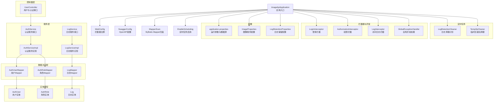
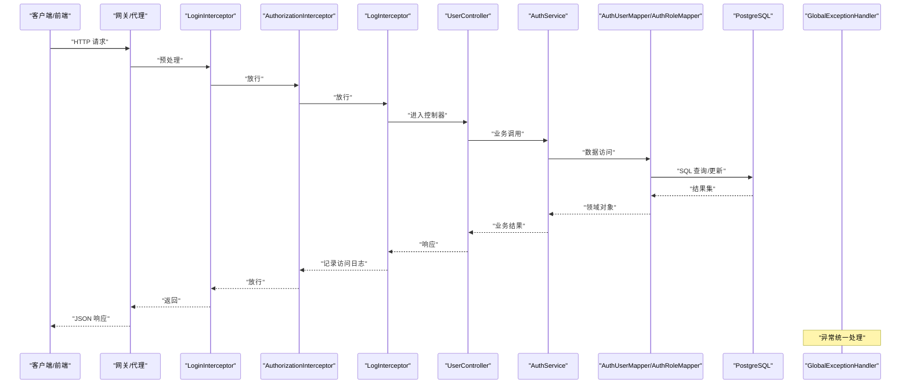
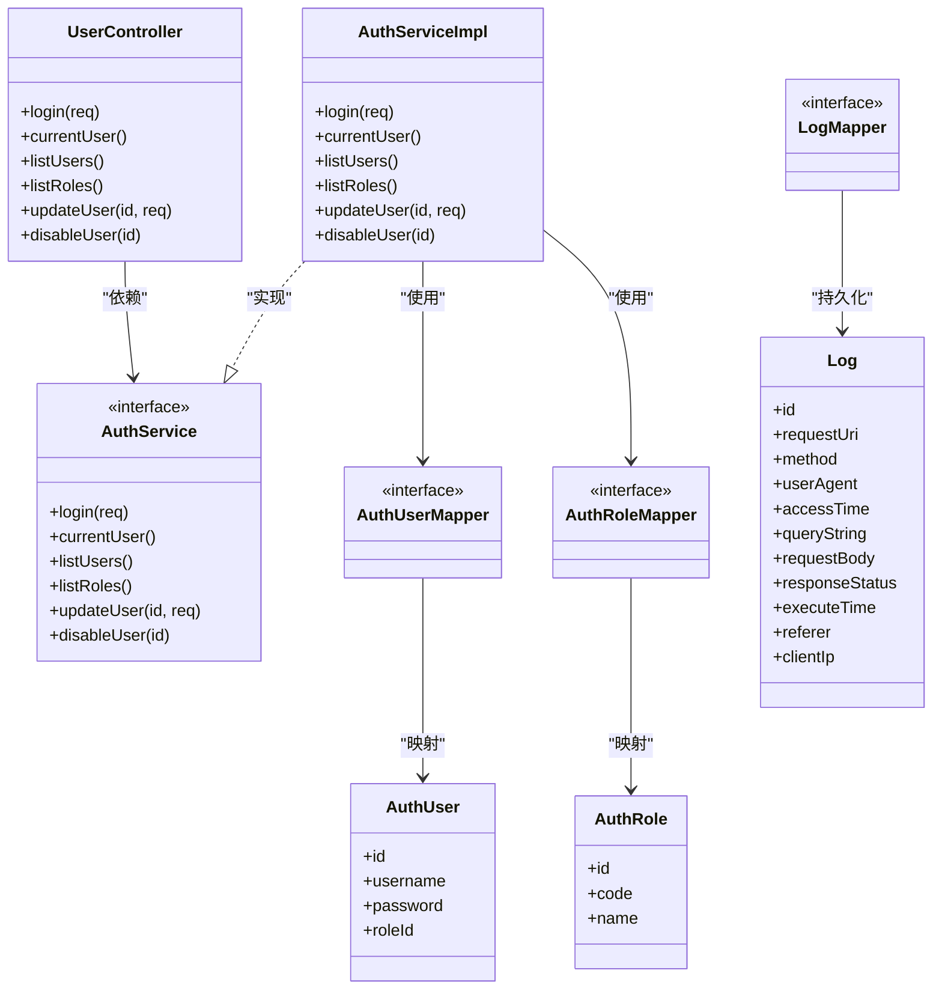
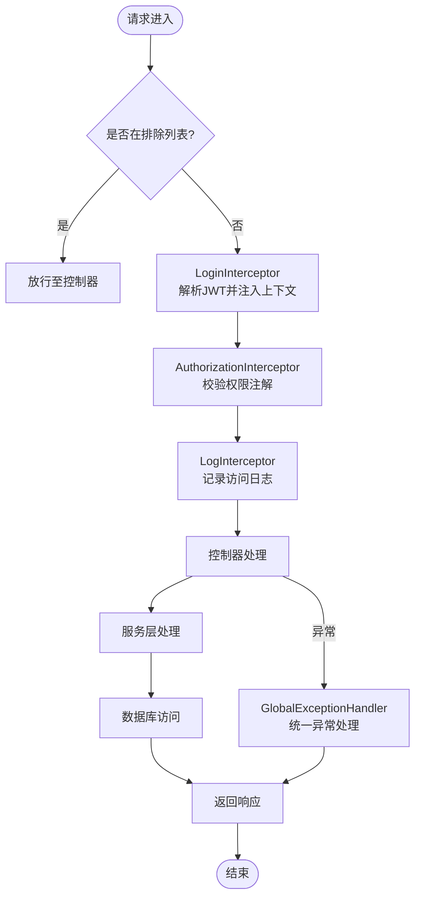
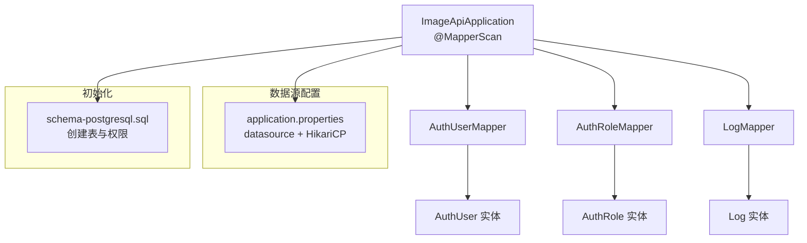
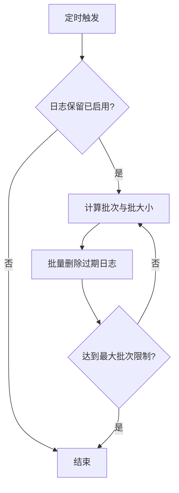
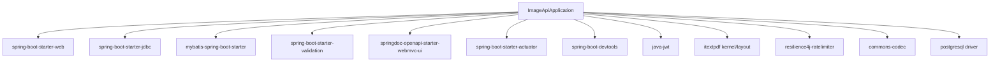

# 后端架构

<cite>
**本文引用的文件**
- [ImageApiApplication.java](file://backend-repo/src/main/java/com/zjcxph/imgapi/ImageApiApplication.java)
- [pom.xml](file://backend-repo/pom.xml)
- [application.properties](file://backend-repo/src/main/resources/application.properties)
- [API_CONTRACT.md](file://backend-repo/API_CONTRACT.md)
- [README.md](file://backend-repo/README.md)
- [WebConfig.java](file://backend-repo/src/main/java/com/zjcxph/imgapi/config/WebConfig.java)
- [SwaggerConfig.java](file://backend-repo/src/main/java/com/zjcxph/imgapi/config/SwaggerConfig.java)
- [GlobalExceptionHandler.java](file://backend-repo/src/main/java/com/zjcxph/imgapi/handler/GlobalExceptionHandler.java)
- [ImageProperties.java](file://backend-repo/src/main/java/com/zjcxph/imgapi/config/ImageProperties.java)
- [LogRetentionProperties.java](file://backend-repo/src/main/java/com/zjcxph/imgapi/config/LogRetentionProperties.java)
- [LoginInterceptor.java](file://backend-repo/src/main/java/com/zjcxph/imgapi/interceptors/LoginInterceptor.java)
- [AuthorizationInterceptor.java](file://backend-repo/src/main/java/com/zjcxph/imgapi/interceptors/AuthorizationInterceptor.java)
- [LogInterceptor.java](file://backend-repo/src/main/java/com/zjcxph/imgapi/interceptors/LogInterceptor.java)
- [UserController.java](file://backend-repo/src/main/java/com/zjcxph/imgapi/controller/UserController.java)
- [AuthService.java](file://backend-repo/src/main/java/com/zjcxph/imgapi/service/AuthService.java)
- [AuthServiceImpl.java](file://backend-repo/src/main/java/com/zjcxph/imgapi/service/impl/AuthServiceImpl.java)
- [LogService.java](file://backend-repo/src/main/java/com/zjcxph/imgapi/service/LogService.java)
- [LogServiceImpl.java](file://backend-repo/src/main/java/com/zjcxph/imgapi/service/impl/LogServiceImpl.java)
- [LogRetentionCleaner.java](file://backend-repo/src/main/java/com/zjcxph/imgapi/scheduler/LogRetentionCleaner.java)
- [TempZipCleaner.java](file://backend-repo/src/main/java/com/zjcxph/imgapi/scheduler/TempZipCleaner.java)
- [Log.java](file://backend-repo/src/main/java/com/zjcxph/imgapi/entity/Log.java)
- [AuthUser.java](file://backend-repo/src/main/java/com/zjcxph/imgapi/entity/AuthUser.java)
- [AuthRole.java](file://backend-repo/src/main/java/com/zjcxph/imgapi/entity/AuthRole.java)
- [AuthUserMapper.java](file://backend-repo/src/main/java/com/zjcxph/imgapi/mapper/AuthUserMapper.java)
- [AuthRoleMapper.java](file://backend-repo/src/main/java/com/zjcxph/imgapi/mapper/AuthRoleMapper.java)
- [LogMapper.java](file://backend-repo/src/main/java/com/zjcxph/imgapi/mapper/LogMapper.java)
- [schema-postgresql.sql](file://backend-repo/src/main/resources/schema-postgresql.sql)
- [reset-br-admin-password.sql](file://backend-repo/src/main/resources/reset-br-admin-password.sql)
</cite>

## 目录
1. [引言](#引言)
2. [项目结构](#项目结构)
3. [核心组件](#核心组件)
4. [架构总览](#架构总览)
5. [详细组件分析](#详细组件分析)
6. [依赖分析](#依赖分析)
7. [性能考虑](#性能考虑)
8. [故障排查指南](#故障排查指南)
9. [结论](#结论)
10. [附录](#附录)

## 引言
本文件面向MRR后端架构，围绕Spring Boot微服务设计与实现进行系统化技术文档整理。重点覆盖分层架构（控制器层、服务层、数据访问层）的职责分离与交互关系；Spring配置、拦截器体系、全局异常处理与跨域配置；MyBatis ORM框架的使用、SQL映射文件组织与数据库连接管理；定时任务调度、日志清理与临时文件管理；RESTful API设计原则、请求响应处理与参数验证机制；以及后端性能优化、缓存策略与安全配置建议。

## 项目结构
后端采用标准Spring Boot工程布局，按功能域划分包结构，遵循“控制器-服务-数据访问-实体-配置-拦截器-异常处理-定时任务”的分层组织方式。核心入口为应用主类，配置集中在resources目录下的属性文件与OpenAPI配置中，数据库初始化脚本位于resources根目录。

图表来源
- [ImageApiApplication.java:1-20](file://backend-repo/src/main/java/com/zjcxph/imgapi/ImageApiApplication.java#L1-L20)
- [WebConfig.java:1-61](file://backend-repo/src/main/java/com/zjcxph/imgapi/config/WebConfig.java#L1-L61)
- [SwaggerConfig.java:1-41](file://backend-repo/src/main/java/com/zjcxph/imgapi/config/SwaggerConfig.java#L1-L41)
- [application.properties:1-49](file://backend-repo/src/main/resources/application.properties#L1-L49)
- [UserController.java:1-95](file://backend-repo/src/main/java/com/zjcxph/imgapi/controller/UserController.java#L1-L95)
- [AuthService.java](file://backend-repo/src/main/java/com/zjcxph/imgapi/service/AuthService.java)
- [AuthServiceImpl.java](file://backend-repo/src/main/java/com/zjcxph/imgapi/service/impl/AuthServiceImpl.java)
- [LogService.java](file://backend-repo/src/main/java/com/zjcxph/imgapi/service/LogService.java)
- [LogServiceImpl.java](file://backend-repo/src/main/java/com/zjcxph/imgapi/service/impl/LogServiceImpl.java)
- [AuthUserMapper.java](file://backend-repo/src/main/java/com/zjcxph/imgapi/mapper/AuthUserMapper.java)
- [AuthRoleMapper.java](file://backend-repo/src/main/java/com/zjcxph/imgapi/mapper/AuthRoleMapper.java)
- [LogMapper.java](file://backend-repo/src/main/java/com/zjcxph/imgapi/mapper/LogMapper.java)
- [AuthUser.java](file://backend-repo/src/main/java/com/zjcxph/imgapi/entity/AuthUser.java)
- [AuthRole.java](file://backend-repo/src/main/java/com/zjcxph/imgapi/entity/AuthRole.java)
- [Log.java](file://backend-repo/src/main/java/com/zjcxph/imgapi/entity/Log.java)
- [LoginInterceptor.java:1-69](file://backend-repo/src/main/java/com/zjcxph/imgapi/interceptors/LoginInterceptor.java#L1-L69)
- [AuthorizationInterceptor.java:1-78](file://backend-repo/src/main/java/com/zjcxph/imgapi/interceptors/AuthorizationInterceptor.java#L1-L78)
- [LogInterceptor.java:1-90](file://backend-repo/src/main/java/com/zjcxph/imgapi/interceptors/LogInterceptor.java#L1-L90)
- [GlobalExceptionHandler.java:1-62](file://backend-repo/src/main/java/com/zjcxph/imgapi/handler/GlobalExceptionHandler.java#L1-L62)
- [LogRetentionCleaner.java](file://backend-repo/src/main/java/com/zjcxph/imgapi/scheduler/LogRetentionCleaner.java)
- [TempZipCleaner.java](file://backend-repo/src/main/java/com/zjcxph/imgapi/scheduler/TempZipCleaner.java)

章节来源
- [README.md:1-57](file://backend-repo/README.md#L1-L57)
- [API_CONTRACT.md:1-44](file://backend-repo/API_CONTRACT.md#L1-L44)

## 核心组件
- 应用入口与扫描注解：启用定时任务、配置属性扫描、Mapper扫描与Spring Boot启动。
- 配置体系：运行端口、数据源、压缩与静态资源缓存、日志级别、图像服务凭据与路径、开发工具与Actuator暴露、日志保留策略、AES密钥等。
- 拦截器体系：登录拦截（JWT解析与上下文注入）、权限拦截（基于注解的细粒度授权）、访问日志拦截（统一记录请求与响应信息）。
- 全局异常处理：对业务异常、参数校验异常、非法参数、非法状态、通用异常进行统一响应封装。
- 定时任务：日志保留清理与临时压缩包清理，支持批处理与最大批次限制。
- 控制器层：以UserController为代表的认证与权限管理接口，遵循REST风格与OpenAPI标注。
- 服务层：认证与日志服务接口与实现，封装业务逻辑与事务边界。
- 数据访问层：MyBatis Mapper接口与实体映射，配合SQL映射文件组织。
- 实体模型：用户、角色、日志等核心领域对象。

章节来源
- [ImageApiApplication.java:1-20](file://backend-repo/src/main/java/com/zjcxph/imgapi/ImageApiApplication.java#L1-L20)
- [application.properties:1-49](file://backend-repo/src/main/resources/application.properties#L1-L49)
- [WebConfig.java:1-61](file://backend-repo/src/main/java/com/zjcxph/imgapi/config/WebConfig.java#L1-L61)
- [GlobalExceptionHandler.java:1-62](file://backend-repo/src/main/java/com/zjcxph/imgapi/handler/GlobalExceptionHandler.java#L1-L62)
- [LogRetentionCleaner.java](file://backend-repo/src/main/java/com/zjcxph/imgapi/scheduler/LogRetentionCleaner.java)
- [TempZipCleaner.java](file://backend-repo/src/main/java/com/zjcxph/imgapi/scheduler/TempZipCleaner.java)
- [UserController.java:1-95](file://backend-repo/src/main/java/com/zjcxph/imgapi/controller/UserController.java#L1-L95)

## 架构总览
下图展示从客户端到后端的典型调用链路：浏览器/前端通过网关代理访问后端REST接口；请求经由拦截器链（登录、权限、日志）进入控制器；控制器调用服务层完成业务处理；服务层通过Mapper访问数据库；异常统一由全局异常处理器返回标准化结果；定时任务后台清理日志与临时文件。

图表来源
- [LoginInterceptor.java:1-69](file://backend-repo/src/main/java/com/zjcxph/imgapi/interceptors/LoginInterceptor.java#L1-L69)
- [AuthorizationInterceptor.java:1-78](file://backend-repo/src/main/java/com/zjcxph/imgapi/interceptors/AuthorizationInterceptor.java#L1-L78)
- [LogInterceptor.java:1-90](file://backend-repo/src/main/java/com/zjcxph/imgapi/interceptors/LogInterceptor.java#L1-L90)
- [UserController.java:1-95](file://backend-repo/src/main/java/com/zjcxph/imgapi/controller/UserController.java#L1-L95)
- [AuthService.java](file://backend-repo/src/main/java/com/zjcxph/imgapi/service/AuthService.java)
- [AuthUserMapper.java](file://backend-repo/src/main/java/com/zjcxph/imgapi/mapper/AuthUserMapper.java)
- [AuthRoleMapper.java](file://backend-repo/src/main/java/com/zjcxph/imgapi/mapper/AuthRoleMapper.java)
- [GlobalExceptionHandler.java:1-62](file://backend-repo/src/main/java/com/zjcxph/imgapi/handler/GlobalExceptionHandler.java#L1-L62)

## 详细组件分析

### 分层架构与职责分离
- 控制器层：负责HTTP请求接收、参数绑定与校验、返回值封装，示例见UserController。
- 服务层：封装业务规则与流程编排，示例见AuthService与AuthServiceImpl。
- 数据访问层：通过MyBatis Mapper进行数据库操作，示例见AuthUserMapper、AuthRoleMapper、LogMapper。
- 实体模型：对应数据库表结构，示例见AuthUser、AuthRole、Log。
- 配置与基础设施：WebConfig注册拦截器，SwaggerConfig提供OpenAPI安全方案，ImageProperties与LogRetentionProperties承载外部配置。

图表来源
- [UserController.java:1-95](file://backend-repo/src/main/java/com/zjcxph/imgapi/controller/UserController.java#L1-L95)
- [AuthService.java](file://backend-repo/src/main/java/com/zjcxph/imgapi/service/AuthService.java)
- [AuthServiceImpl.java](file://backend-repo/src/main/java/com/zjcxph/imgapi/service/impl/AuthServiceImpl.java)
- [AuthUserMapper.java](file://backend-repo/src/main/java/com/zjcxph/imgapi/mapper/AuthUserMapper.java)
- [AuthRoleMapper.java](file://backend-repo/src/main/java/com/zjcxph/imgapi/mapper/AuthRoleMapper.java)
- [LogMapper.java](file://backend-repo/src/main/java/com/zjcxph/imgapi/mapper/LogMapper.java)
- [AuthUser.java](file://backend-repo/src/main/java/com/zjcxph/imgapi/entity/AuthUser.java)
- [AuthRole.java](file://backend-repo/src/main/java/com/zjcxph/imgapi/entity/AuthRole.java)
- [Log.java](file://backend-repo/src/main/java/com/zjcxph/imgapi/entity/Log.java)

章节来源
- [UserController.java:1-95](file://backend-repo/src/main/java/com/zjcxph/imgapi/controller/UserController.java#L1-L95)
- [AuthService.java](file://backend-repo/src/main/java/com/zjcxph/imgapi/service/AuthService.java)
- [AuthServiceImpl.java](file://backend-repo/src/main/java/com/zjcxph/imgapi/service/impl/AuthServiceImpl.java)
- [AuthUserMapper.java](file://backend-repo/src/main/java/com/zjcxph/imgapi/mapper/AuthUserMapper.java)
- [AuthRoleMapper.java](file://backend-repo/src/main/java/com/zjcxph/imgapi/mapper/AuthRoleMapper.java)
- [LogMapper.java](file://backend-repo/src/main/java/com/zjcxph/imgapi/mapper/LogMapper.java)
- [AuthUser.java](file://backend-repo/src/main/java/com/zjcxph/imgapi/entity/AuthUser.java)
- [AuthRole.java](file://backend-repo/src/main/java/com/zjcxph/imgapi/entity/AuthRole.java)
- [Log.java](file://backend-repo/src/main/java/com/zjcxph/imgapi/entity/Log.java)

### Spring配置与拦截器体系
- WebConfig：注册登录拦截器、权限拦截器与访问日志拦截器，并精确控制排除路径（如登录、Swagger、Actuator、健康检查等）。
- SwaggerConfig：定义OpenAPI安全方案（Bearer JWT），用于文档与调试。
- 全局异常处理：对业务异常、参数校验异常、非法参数、非法状态与通用异常进行统一响应封装，保证前后端一致的错误格式。
- 配置属性：ImageProperties与LogRetentionProperties分别承载图像服务配置与日志保留策略，支持通过环境变量覆盖。

图表来源
- [WebConfig.java:1-61](file://backend-repo/src/main/java/com/zjcxph/imgapi/config/WebConfig.java#L1-L61)
- [LoginInterceptor.java:1-69](file://backend-repo/src/main/java/com/zjcxph/imgapi/interceptors/LoginInterceptor.java#L1-L69)
- [AuthorizationInterceptor.java:1-78](file://backend-repo/src/main/java/com/zjcxph/imgapi/interceptors/AuthorizationInterceptor.java#L1-L78)
- [LogInterceptor.java:1-90](file://backend-repo/src/main/java/com/zjcxph/imgapi/interceptors/LogInterceptor.java#L1-L90)
- [GlobalExceptionHandler.java:1-62](file://backend-repo/src/main/java/com/zjcxph/imgapi/handler/GlobalExceptionHandler.java#L1-L62)

章节来源
- [WebConfig.java:1-61](file://backend-repo/src/main/java/com/zjcxph/imgapi/config/WebConfig.java#L1-L61)
- [SwaggerConfig.java:1-41](file://backend-repo/src/main/java/com/zjcxph/imgapi/config/SwaggerConfig.java#L1-L41)
- [GlobalExceptionHandler.java:1-62](file://backend-repo/src/main/java/com/zjcxph/imgapi/handler/GlobalExceptionHandler.java#L1-L62)
- [ImageProperties.java:1-45](file://backend-repo/src/main/java/com/zjcxph/imgapi/config/ImageProperties.java#L1-L45)
- [LogRetentionProperties.java:1-54](file://backend-repo/src/main/java/com/zjcxph/imgapi/config/LogRetentionProperties.java#L1-L54)

### MyBatis ORM与数据库连接管理
- Mapper扫描：通过@SpringBootApplication注解上的@MapperScan启用自动扫描指定包下的Mapper接口。
- 数据库连接：基于HikariCP连接池，默认最大池大小、最小空闲、连接超时、空闲超时与最大生存时间均可通过环境变量调整。
- SQL映射文件组织：Mapper接口与XML映射文件一一对应，位于mapper包下，命名与业务模块保持一致。
- 初始化脚本：启动时自动执行PostgreSQL初始化脚本，创建schema、业务表、权限表与默认种子数据。

图表来源
- [ImageApiApplication.java:1-20](file://backend-repo/src/main/java/com/zjcxph/imgapi/ImageApiApplication.java#L1-L20)
- [application.properties:10-22](file://backend-repo/src/main/resources/application.properties#L10-L22)
- [schema-postgresql.sql](file://backend-repo/src/main/resources/schema-postgresql.sql)
- [AuthUserMapper.java](file://backend-repo/src/main/java/com/zjcxph/imgapi/mapper/AuthUserMapper.java)
- [AuthRoleMapper.java](file://backend-repo/src/main/java/com/zjcxph/imgapi/mapper/AuthRoleMapper.java)
- [LogMapper.java](file://backend-repo/src/main/java/com/zjcxph/imgapi/mapper/LogMapper.java)
- [AuthUser.java](file://backend-repo/src/main/java/com/zjcxph/imgapi/entity/AuthUser.java)
- [AuthRole.java](file://backend-repo/src/main/java/com/zjcxph/imgapi/entity/AuthRole.java)
- [Log.java](file://backend-repo/src/main/java/com/zjcxph/imgapi/entity/Log.java)

章节来源
- [ImageApiApplication.java:1-20](file://backend-repo/src/main/java/com/zjcxph/imgapi/ImageApiApplication.java#L1-L20)
- [application.properties:10-22](file://backend-repo/src/main/resources/application.properties#L10-L22)
- [schema-postgresql.sql](file://backend-repo/src/main/resources/schema-postgresql.sql)

### 定时任务调度、日志清理与临时文件管理
- 日志保留清理：通过LogRetentionCleaner按配置的cron表达式定期清理过期访问日志，支持批处理大小与每轮最大批次限制。
- 临时压缩包清理：通过TempZipCleaner定期清理临时生成的压缩包文件，避免磁盘空间占用。
- 配置项：日志保留开关、cron表达式、保留天数、批大小与每轮最大批次等均通过LogRetentionProperties注入。

图表来源
- [LogRetentionCleaner.java](file://backend-repo/src/main/java/com/zjcxph/imgapi/scheduler/LogRetentionCleaner.java)
- [LogRetentionProperties.java:1-54](file://backend-repo/src/main/java/com/zjcxph/imgapi/config/LogRetentionProperties.java#L1-L54)

章节来源
- [LogRetentionCleaner.java](file://backend-repo/src/main/java/com/zjcxph/imgapi/scheduler/LogRetentionCleaner.java)
- [TempZipCleaner.java](file://backend-repo/src/main/java/com/zjcxph/imgapi/scheduler/TempZipCleaner.java)
- [LogRetentionProperties.java:1-54](file://backend-repo/src/main/java/com/zjcxph/imgapi/config/LogRetentionProperties.java#L1-L54)

### RESTful API设计原则与参数验证
- 路由约定：遵循版本化路径前缀（如/v1、/v2），登录接口独立于版本化路由。
- 参数校验：控制器方法参数使用@Valid进行Bean验证，结合全局异常处理统一返回400错误。
- 返回封装：统一使用Result<T>封装响应结构，包含code、message与data字段，便于前端处理。
- 权限控制：通过@RequirePermissions注解在控制器方法或类上声明所需权限，拦截器自动校验。

章节来源
- [API_CONTRACT.md:1-44](file://backend-repo/API_CONTRACT.md#L1-L44)
- [UserController.java:1-95](file://backend-repo/src/main/java/com/zjcxph/imgapi/controller/UserController.java#L1-L95)
- [GlobalExceptionHandler.java:1-62](file://backend-repo/src/main/java/com/zjcxph/imgapi/handler/GlobalExceptionHandler.java#L1-L62)

## 依赖分析
后端依赖以Spring Boot Starter为核心，集成Web、JDBC、MyBatis、验证、OpenAPI、Actuator、JWT、PDF处理与Resilience4j限流等能力。数据库驱动为PostgreSQL，连接池为HikariCP。

图表来源
- [pom.xml:1-136](file://backend-repo/pom.xml#L1-L136)

章节来源
- [pom.xml:1-136](file://backend-repo/pom.xml#L1-L136)

## 性能考虑
- 连接池参数：通过环境变量调整HikariCP的最大池大小、最小空闲、连接超时、空闲超时与最大生存时间，平衡吞吐与资源占用。
- 压缩与缓存：开启响应压缩与静态资源缓存，降低带宽与提升前端加载速度。
- 定时清理：合理设置日志保留天数与批大小，避免大事务与锁竞争；临时文件清理防止磁盘膨胀。
- 限流与降级：引入Resilience4j限流器，结合Actuator指标监控系统健康状况。
- 日志级别：生产环境建议提高根日志级别，降低IO开销；仅在需要时开启Mapper调试日志。

章节来源
- [application.properties:1-49](file://backend-repo/src/main/resources/application.properties#L1-L49)
- [LogRetentionProperties.java:1-54](file://backend-repo/src/main/java/com/zjcxph/imgapi/config/LogRetentionProperties.java#L1-L54)
- [pom.xml:89-93](file://backend-repo/pom.xml#L89-L93)

## 故障排查指南
- 登录鉴权失败：检查Authorization头是否携带Bearer Token，确认Token未过期且签名有效；查看拦截器日志与全局异常响应。
- 权限不足：确认用户角色与权限集合，核对@RequirePermissions注解声明的权限是否满足；管理员角色拥有豁免。
- 参数校验错误：关注全局异常处理对ConstraintViolationException的400响应；检查请求体与路径参数是否符合约束。
- 数据库连接问题：核对数据源URL、用户名、密码与Schema；检查HikariCP连接池参数与最大连接数。
- 定时任务未执行：确认@EnableScheduling已生效，检查cron表达式与日志保留开关；验证批大小与每轮最大批次配置。
- 访问日志缺失：确认LogInterceptor排除规则与Actuator、Swagger、favicon等路径；检查日志服务实现与Mapper写入。

章节来源
- [LoginInterceptor.java:1-69](file://backend-repo/src/main/java/com/zjcxph/imgapi/interceptors/LoginInterceptor.java#L1-L69)
- [AuthorizationInterceptor.java:1-78](file://backend-repo/src/main/java/com/zjcxph/imgapi/interceptors/AuthorizationInterceptor.java#L1-L78)
- [GlobalExceptionHandler.java:1-62](file://backend-repo/src/main/java/com/zjcxph/imgapi/handler/GlobalExceptionHandler.java#L1-L62)
- [application.properties:10-22](file://backend-repo/src/main/resources/application.properties#L10-L22)
- [LogRetentionCleaner.java](file://backend-repo/src/main/java/com/zjcxph/imgapi/scheduler/LogRetentionCleaner.java)
- [LogInterceptor.java:1-90](file://backend-repo/src/main/java/com/zjcxph/imgapi/interceptors/LogInterceptor.java#L1-L90)

## 结论
MRR后端采用清晰的分层架构与完善的基础设施配置，结合拦截器链实现统一的安全与审计控制，通过MyBatis与PostgreSQL提供稳定的数据访问能力。定时任务与清理策略保障了系统的长期稳定运行。建议在生产环境中强化安全配置（如HTTPS、密钥轮换、白名单与速率限制），并持续优化连接池与日志策略以提升整体性能与可观测性。

## 附录
- 默认端口与数据源：可在application.properties中通过环境变量覆盖。
- 初始化脚本：schema-postgresql.sql与reset-br-admin-password.sql用于数据库初始化与默认账户重置。
- 文档与监控：Swagger UI地址与Actuator健康检查端点已在README中给出。

章节来源
- [README.md:23-57](file://backend-repo/README.md#L23-L57)
- [application.properties:1-49](file://backend-repo/src/main/resources/application.properties#L1-L49)
- [schema-postgresql.sql](file://backend-repo/src/main/resources/schema-postgresql.sql)
- [reset-br-admin-password.sql](file://backend-repo/src/main/resources/reset-br-admin-password.sql)