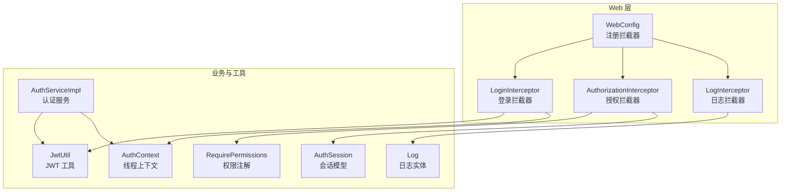
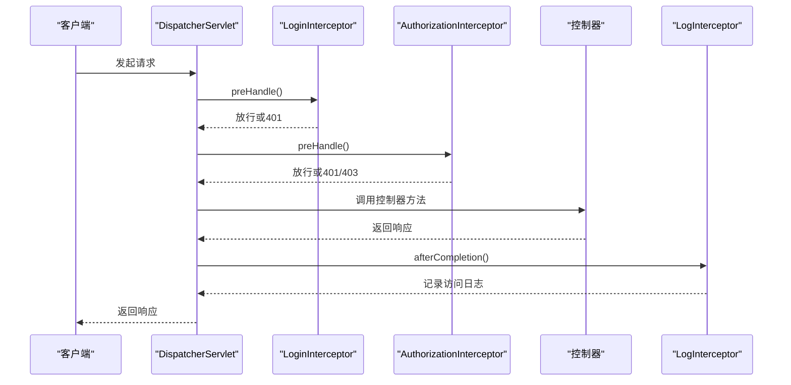
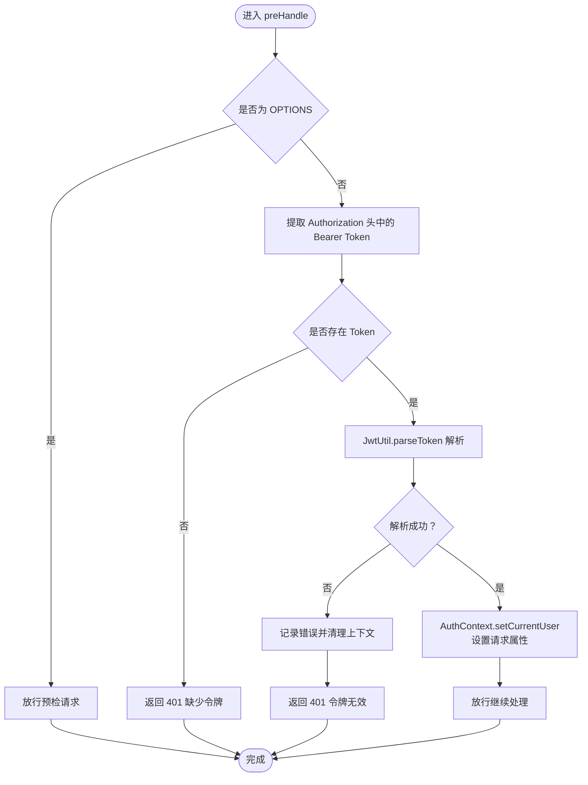
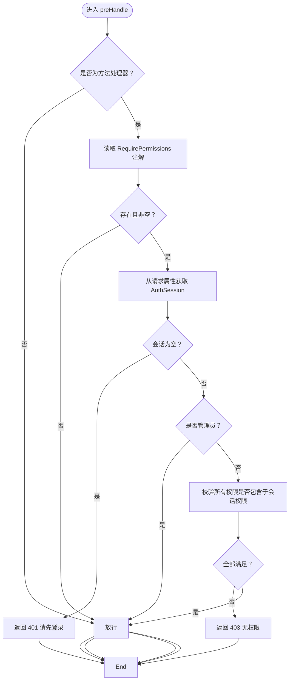
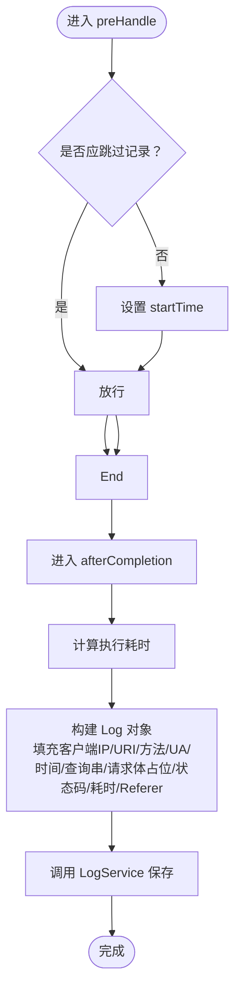
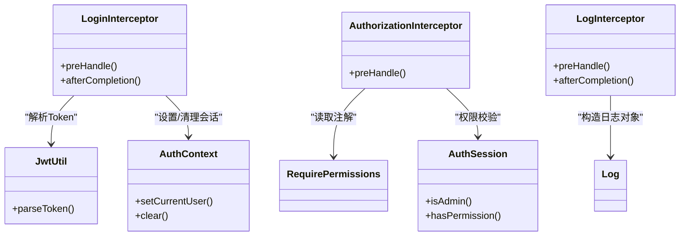

# 安全拦截器配置

<cite>
**本文引用的文件**
- [WebConfig.java](file://backend-repo/src/main/java/com/zjcxph/imgapi/config/WebConfig.java)
- [LoginInterceptor.java](file://backend-repo/src/main/java/com/zjcxph/imgapi/interceptors/LoginInterceptor.java)
- [AuthorizationInterceptor.java](file://backend-repo/src/main/java/com/zjcxph/imgapi/interceptors/AuthorizationInterceptor.java)
- [LogInterceptor.java](file://backend-repo/src/main/java/com/zjcxph/imgapi/interceptors/LogInterceptor.java)
- [AuthSession.java](file://backend-repo/src/main/java/com/zjcxph/imgapi/common/AuthSession.java)
- [JwtUtil.java](file://backend-repo/src/main/java/com/zjcxph/imgapi/utils/JwtUtil.java)
- [AuthContext.java](file://backend-repo/src/main/java/com/zjcxph/imgapi/utils/AuthContext.java)
- [RequirePermissions.java](file://backend-repo/src/main/java/com/zjcxph/imgapi/annotation/RequirePermissions.java)
- [UserController.java](file://backend-repo/src/main/java/com/zjcxph/imgapi/controller/UserController.java)
- [Log.java](file://backend-repo/src/main/java/com/zjcxph/imgapi/entity/Log.java)
- [AuthServiceImpl.java](file://backend-repo/src/main/java/com/zjcxph/imgapi/service/impl/AuthServiceImpl.java)
- [application.properties](file://backend-repo/src/main/resources/application.properties)
- [springboot-security 技能.md](file://.trae/skills/springboot-security/ SKILL.md)
- [web 安全规则.md](file://.trae/rules/web/security.md)
</cite>

## 目录
1. [简介](#简介)
2. [项目结构](#项目结构)
3. [核心组件](#核心组件)
4. [架构总览](#架构总览)
5. [详细组件分析](#详细组件分析)
6. [依赖关系分析](#依赖关系分析)
7. [性能考量](#性能考量)
8. [故障排查指南](#故障排查指南)
9. [结论](#结论)
10. [附录](#附录)

## 简介
本技术文档围绕 MRR 后端项目的“安全拦截器配置”展开，重点覆盖以下内容：
- 登录拦截器 LoginInterceptor 的登录状态检查、会话验证与自动跳转逻辑
- 日志拦截器 LogInterceptor 的请求日志记录、响应时间统计与异常捕获
- 拦截器链的执行顺序与优先级配置
- CSRF 防护、XSS 攻击防范、SQL 注入防护的实现建议
- 安全头设置（CSP、HSTS、X-Frame-Options 等）与 HTTPS 强制重定向配置
- 拦截器与 Spring Security 的集成方式与自定义过滤器开发指南

## 项目结构
后端采用 Spring MVC 拦截器体系，拦截器注册集中在 WebConfig 中，登录、授权与日志三大拦截器分别负责认证、权限校验与审计日志。

图表来源
- [WebConfig.java:24-59](file://backend-repo/src/main/java/com/zjcxph/imgapi/config/WebConfig.java#L24-L59)
- [LoginInterceptor.java:29-57](file://backend-repo/src/main/java/com/zjcxph/imgapi/interceptors/LoginInterceptor.java#L29-L57)
- [AuthorizationInterceptor.java:22-56](file://backend-repo/src/main/java/com/zjcxph/imgapi/interceptors/AuthorizationInterceptor.java#L22-L56)
- [LogInterceptor.java:21-58](file://backend-repo/src/main/java/com/zjcxph/imgapi/interceptors/LogInterceptor.java#L21-L58)
- [JwtUtil.java:61-75](file://backend-repo/src/main/java/com/zjcxph/imgapi/utils/JwtUtil.java#L61-L75)
- [AuthContext.java:12-26](file://backend-repo/src/main/java/com/zjcxph/imgapi/utils/AuthContext.java#L12-L26)
- [RequirePermissions.java:10-12](file://backend-repo/src/main/java/com/zjcxph/imgapi/annotation/RequirePermissions.java#L10-L12)
- [AuthSession.java:81-88](file://backend-repo/src/main/java/com/zjcxph/imgapi/common/AuthSession.java#L81-L88)
- [Log.java:7-22](file://backend-repo/src/main/java/com/zjcxph/imgapi/entity/Log.java#L7-L22)
- [AuthServiceImpl.java:36-62](file://backend-repo/src/main/java/com/zjcxph/imgapi/service/impl/AuthServiceImpl.java#L36-L62)

章节来源
- [WebConfig.java:24-59](file://backend-repo/src/main/java/com/zjcxph/imgapi/config/WebConfig.java#L24-L59)

## 核心组件
- 登录拦截器 LoginInterceptor：从 Authorization 头解析 Bearer Token，调用 JwtUtil 校验并解析出 AuthSession，写入 AuthContext 与请求属性；对 OPTIONS 预检放行，异常时返回 401。
- 授权拦截器 AuthorizationInterceptor：读取控制器方法上的 RequirePermissions 注解，结合 AuthSession 权限列表进行校验；管理员角色与特定管理权限直接放行；未登录返回 401，权限不足返回 403。
- 日志拦截器 LogInterceptor：记录请求开始时间，afterCompletion 统计执行耗时并保存到 Log 实体；跳过 OPTIONS、静态资源与文档/健康检查等路径；支持代理场景的客户端 IP 获取。

章节来源
- [LoginInterceptor.java:29-57](file://backend-repo/src/main/java/com/zjcxph/imgapi/interceptors/LoginInterceptor.java#L29-L57)
- [AuthorizationInterceptor.java:22-56](file://backend-repo/src/main/java/com/zjcxph/imgapi/interceptors/AuthorizationInterceptor.java#L22-L56)
- [LogInterceptor.java:21-58](file://backend-repo/src/main/java/com/zjcxph/imgapi/interceptors/LogInterceptor.java#L21-L58)

## 架构总览
拦截器链在 WebConfig 中按顺序注册，执行顺序遵循注册顺序：LoginInterceptor → AuthorizationInterceptor → LogInterceptor。LoginInterceptor 负责认证态建立，AuthorizationInterceptor 进行权限判定，LogInterceptor 完成审计日志采集。

图表来源
- [WebConfig.java:24-59](file://backend-repo/src/main/java/com/zjcxph/imgapi/config/WebConfig.java#L24-L59)
- [LoginInterceptor.java:29-57](file://backend-repo/src/main/java/com/zjcxph/imgapi/interceptors/LoginInterceptor.java#L29-L57)
- [AuthorizationInterceptor.java:22-56](file://backend-repo/src/main/java/com/zjcxph/imgapi/interceptors/AuthorizationInterceptor.java#L22-L56)
- [LogInterceptor.java:36-58](file://backend-repo/src/main/java/com/zjcxph/imgapi/interceptors/LogInterceptor.java#L36-L58)

## 详细组件分析

### 登录拦截器 LoginInterceptor
- 输入来源：Authorization 头（Bearer Token）
- 核心流程：
  - 跳过 OPTIONS 预检请求
  - 提取 Bearer Token 并校验
  - 使用 JwtUtil 解析 Token 为 AuthSession
  - 将 AuthSession 写入 AuthContext 与请求属性
  - 异常时清理上下文并返回 401 JSON
- 关键点：
  - 使用 AuthContext 保证线程内会话可被后续拦截器与控制器使用
  - afterCompletion 清理上下文，避免内存泄漏

图表来源
- [LoginInterceptor.java:29-57](file://backend-repo/src/main/java/com/zjcxph/imgapi/interceptors/LoginInterceptor.java#L29-L57)
- [JwtUtil.java:61-75](file://backend-repo/src/main/java/com/zjcxph/imgapi/utils/JwtUtil.java#L61-L75)
- [AuthContext.java:12-26](file://backend-repo/src/main/java/com/zjcxph/imgapi/utils/AuthContext.java#L12-L26)

章节来源
- [LoginInterceptor.java:29-57](file://backend-repo/src/main/java/com/zjcxph/imgapi/interceptors/LoginInterceptor.java#L29-L57)
- [JwtUtil.java:61-75](file://backend-repo/src/main/java/com/zjcxph/imgapi/utils/JwtUtil.java#L61-L75)
- [AuthContext.java:12-26](file://backend-repo/src/main/java/com/zjcxph/imgapi/utils/AuthContext.java#L12-L26)

### 授权拦截器 AuthorizationInterceptor
- 注解驱动：RequirePermissions 可标注在方法或类级别
- 校验逻辑：
  - 若目标非方法处理器则放行
  - 未标注权限注解或空值则放行
  - 从请求属性读取 AuthSession
  - 管理员角色或具备 user:manage/role:manage 直接放行
  - 否则要求所有声明权限均在会话权限列表中
- 结果：
  - 未登录：401 JSON
  - 权限不足：403 JSON

图表来源
- [AuthorizationInterceptor.java:22-56](file://backend-repo/src/main/java/com/zjcxph/imgapi/interceptors/AuthorizationInterceptor.java#L22-L56)
- [RequirePermissions.java:10-12](file://backend-repo/src/main/java/com/zjcxph/imgapi/annotation/RequirePermissions.java#L10-L12)
- [AuthSession.java:81-88](file://backend-repo/src/main/java/com/zjcxph/imgapi/common/AuthSession.java#L81-L88)

章节来源
- [AuthorizationInterceptor.java:22-56](file://backend-repo/src/main/java/com/zjcxph/imgapi/interceptors/AuthorizationInterceptor.java#L22-L56)
- [RequirePermissions.java:10-12](file://backend-repo/src/main/java/com/zjcxph/imgapi/annotation/RequirePermissions.java#L10-L12)
- [AuthSession.java:81-88](file://backend-repo/src/main/java/com/zjcxph/imgapi/common/AuthSession.java#L81-L88)

### 日志拦截器 LogInterceptor
- 记录时机：preHandle 设置开始时间；afterCompletion 统计耗时并持久化
- 过滤策略：跳过 OPTIONS、静态资源、Swagger/Docs/Actuator/错误页/Favicon 等
- 客户端 IP：优先 X-Forwarded-For，其次 X-Real-IP，最后远端地址
- 数据字段：客户端 IP、URI、方法、User-Agent、访问时间、查询串、请求体占位、响应状态码、执行耗时、Referer

图表来源
- [LogInterceptor.java:21-58](file://backend-repo/src/main/java/com/zjcxph/imgapi/interceptors/LogInterceptor.java#L21-L58)
- [Log.java:7-22](file://backend-repo/src/main/java/com/zjcxph/imgapi/entity/Log.java#L7-L22)

章节来源
- [LogInterceptor.java:21-58](file://backend-repo/src/main/java/com/zjcxph/imgapi/interceptors/LogInterceptor.java#L21-L58)
- [Log.java:7-22](file://backend-repo/src/main/java/com/zjcxph/imgapi/entity/Log.java#L7-L22)

### 拦截器链执行顺序与优先级
- 注册顺序即执行顺序：LoginInterceptor → AuthorizationInterceptor → LogInterceptor
- LoginInterceptor 负责认证态建立，必须在授权拦截器之前
- AuthorizationInterceptor 在控制器前进行权限判定
- LogInterceptor 在响应完成后统一记录审计日志

章节来源
- [WebConfig.java:24-59](file://backend-repo/src/main/java/com/zjcxph/imgapi/config/WebConfig.java#L24-L59)

### 与控制器的协作
- 控制器通过 RequirePermissions 注解声明所需权限
- LoginInterceptor 与 AuthorizationInterceptor 共同保障受保护接口的安全访问
- 示例：用户管理相关接口需 user:manage 权限

章节来源
- [UserController.java:60-93](file://backend-repo/src/main/java/com/zjcxph/imgapi/controller/UserController.java#L60-L93)
- [RequirePermissions.java:10-12](file://backend-repo/src/main/java/com/zjcxph/imgapi/annotation/RequirePermissions.java#L10-L12)

## 依赖关系分析
- LoginInterceptor 依赖 JwtUtil 与 AuthContext
- AuthorizationInterceptor 依赖 RequirePermissions 注解与 AuthSession
- LogInterceptor 依赖 Log 实体与日志服务（通过注入使用）
- WebConfig 统一注册三大拦截器并配置路径匹配与排除

图表来源
- [LoginInterceptor.java:42-44](file://backend-repo/src/main/java/com/zjcxph/imgapi/interceptors/LoginInterceptor.java#L42-L44)
- [AuthorizationInterceptor.java:37-54](file://backend-repo/src/main/java/com/zjcxph/imgapi/interceptors/AuthorizationInterceptor.java#L37-L54)
- [LogInterceptor.java:45-57](file://backend-repo/src/main/java/com/zjcxph/imgapi/interceptors/LogInterceptor.java#L45-L57)
- [JwtUtil.java:61-75](file://backend-repo/src/main/java/com/zjcxph/imgapi/utils/JwtUtil.java#L61-L75)
- [AuthContext.java:12-26](file://backend-repo/src/main/java/com/zjcxph/imgapi/utils/AuthContext.java#L12-L26)
- [RequirePermissions.java:10-12](file://backend-repo/src/main/java/com/zjcxph/imgapi/annotation/RequirePermissions.java#L10-L12)
- [AuthSession.java:81-88](file://backend-repo/src/main/java/com/zjcxph/imgapi/common/AuthSession.java#L81-L88)
- [Log.java:7-22](file://backend-repo/src/main/java/com/zjcxph/imgapi/entity/Log.java#L7-L22)

章节来源
- [WebConfig.java:24-59](file://backend-repo/src/main/java/com/zjcxph/imgapi/config/WebConfig.java#L24-L59)

## 性能考量
- 登录拦截器仅做轻量解析与校验，避免阻塞主业务
- 授权拦截器基于注解快速判定，减少数据库访问
- 日志拦截器仅在 afterCompletion 记录，避免影响响应体生成
- 建议：
  - 对高频接口启用缓存与限流
  - 合理设置 JWT 过期时间，平衡安全性与性能
  - 审计日志入库采用批量写入或异步队列

## 故障排查指南
- 401 未认证
  - 检查请求头 Authorization 是否为 Bearer Token
  - 校验 JWT_SECRET_KEY 环境变量是否正确
  - 确认 afterCompletion 是否清理了 AuthContext
- 403 无权限
  - 检查控制器方法是否添加 RequirePermissions 注解
  - 核对 AuthSession 权限列表是否包含所需权限
  - 管理员角色或 user:manage/role:manage 权限可直接放行
- 日志缺失
  - 确认路径未被排除（Swagger/Docs/Actuator/Favicon 等）
  - 检查 LogService 是否正常注入与持久化
- 客户端 IP 错误
  - 代理场景下确保正确配置转发头策略，避免直接读取 X-Forwarded-For

章节来源
- [LoginInterceptor.java:35-51](file://backend-repo/src/main/java/com/zjcxph/imgapi/interceptors/LoginInterceptor.java#L35-L51)
- [AuthorizationInterceptor.java:37-54](file://backend-repo/src/main/java/com/zjcxph/imgapi/interceptors/AuthorizationInterceptor.java#L37-L54)
- [LogInterceptor.java:60-77](file://backend-repo/src/main/java/com/zjcxph/imgapi/interceptors/LogInterceptor.java#L60-L77)
- [springboot-patterns 技能.md:243-294](file://.trae/skills/springboot-patterns/ SKILL.md#L243-L294)

## 结论
本项目通过三道拦截器防线实现了基础但完整的安全控制：登录拦截器负责认证态建立，授权拦截器基于注解进行细粒度权限控制，日志拦截器提供审计能力。配合合理的排除路径与环境变量配置，可在保证可用性的同时提升安全性。对于更高级别的安全需求（如 CSRF、CSP、HSTS、HTTPS 强制重定向），建议参考 Spring Security 技能与 Web 安全规则，逐步完善整体安全体系。

## 附录

### CSRF 防护、XSS 防范与 SQL 注入防护（实现建议）
- CSRF 防护
  - API 场景建议关闭 CSRF，依赖 Bearer Token 与 SameSite Cookie
  - 若仍需表单提交，采用双提交 Cookie 或隐藏字段令牌
- XSS 防护
  - 前端模板渲染时避免 innerHTML，使用安全的渲染库
  - 后端输出严格转义，避免直接拼接用户输入
- SQL 注入防护
  - 使用参数化查询或 ORM 的命名参数
  - 避免动态拼接 SQL 字符串

章节来源
- [springboot-security 技能.md:138-147](file://.trae/skills/springboot-security/ SKILL.md#L138-L147)
- [springboot-security 技能.md:108-118](file://.trae/skills/springboot-security/ SKILL.md#L108-L118)
- [web 安全规则.md:28-50](file://.trae/rules/web/security.md#L28-L50)

### 安全头设置与 HTTPS 强制重定向（实现建议）
- 安全头
  - CSP：生产环境务必配置，限制脚本、样式、图片等来源
  - HSTS：启用严格传输安全，建议 includeSubDomains 与 preload
  - X-Frame-Options：防止点击劫持
  - X-Content-Type-Options：阻止 MIME 类型嗅探
  - Referrer-Policy：限制来源信息泄露
- HTTPS 强制重定向
  - 在反向代理层（如 Nginx）或网关层进行 301/308 重定向
  - 应用层可通过安全过滤器或 Spring Security 配置

章节来源
- [web 安全规则.md:42-50](file://.trae/rules/web/security.md#L42-L50)
- [springboot-security 技能.md:174-184](file://.trae/skills/springboot-security/ SKILL.md#L174-L184)

### 拦截器与 Spring Security 集成与自定义过滤器开发
- 集成方式
  - 使用 OncePerRequestFilter 自定义 JWT 过滤器，从 Authorization 头提取 Bearer Token 并设置 SecurityContext
  - 在 SecurityFilterChain 中启用基于方法的授权（@EnableMethodSecurity）
- 自定义过滤器开发要点
  - 仅处理状态无关的 API 认证
  - 严格校验签名算法与密钥来源
  - 明确异常处理与响应格式

章节来源
- [springboot-security 技能.md:27-47](file://.trae/skills/springboot-security/ SKILL.md#L27-L47)
- [springboot-security 技能.md:50-56](file://.trae/skills/springboot-security/ SKILL.md#L50-L56)