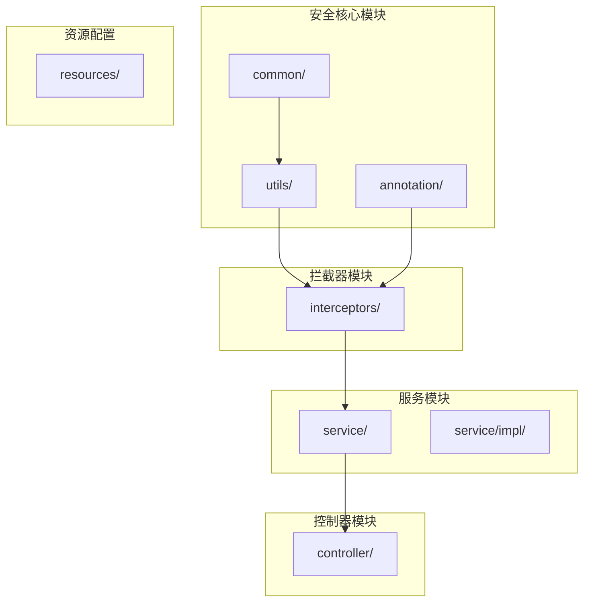
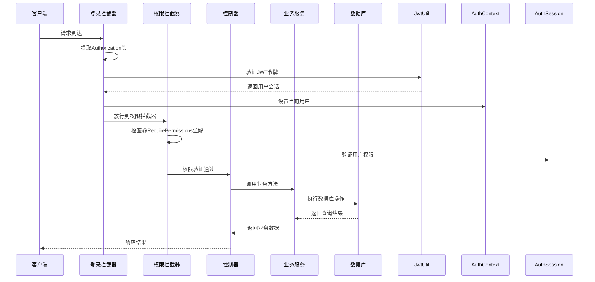
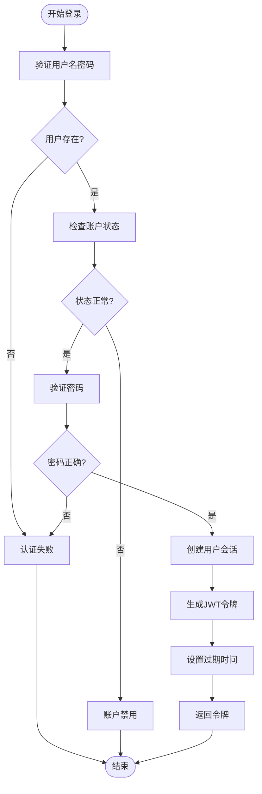
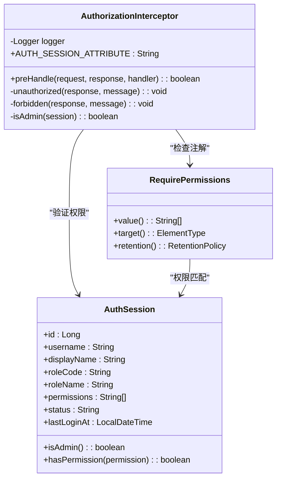
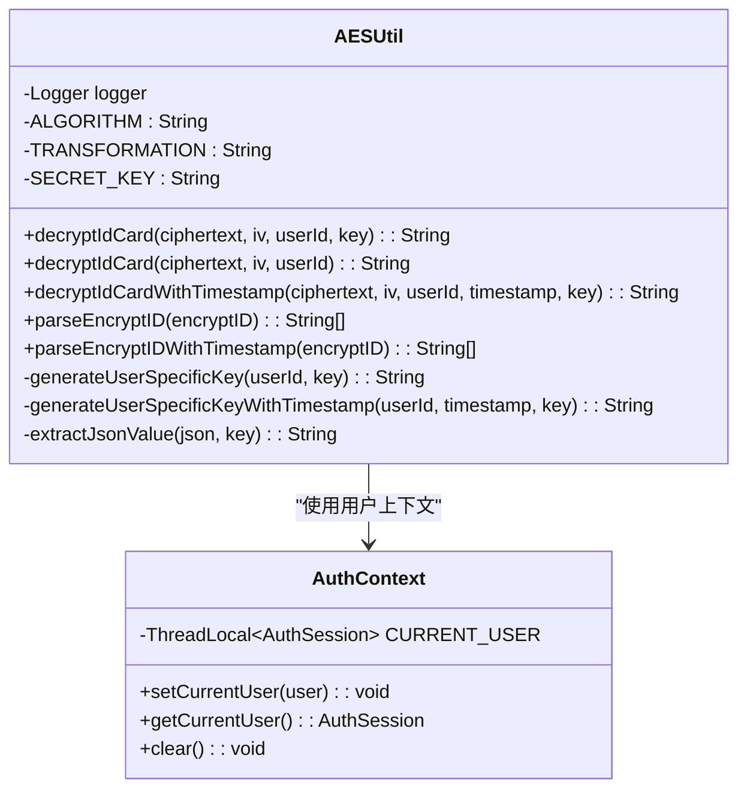
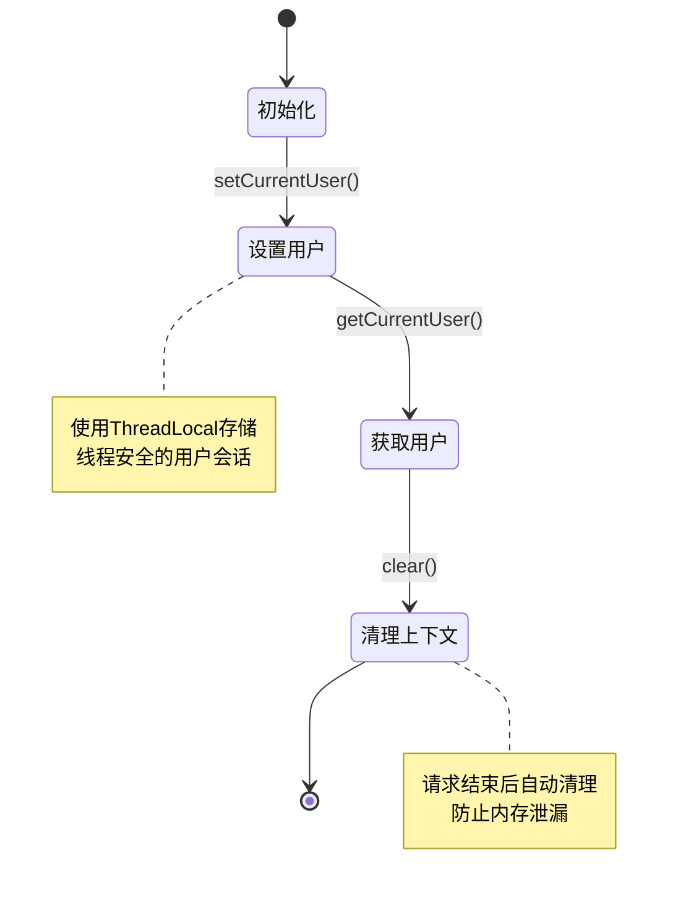
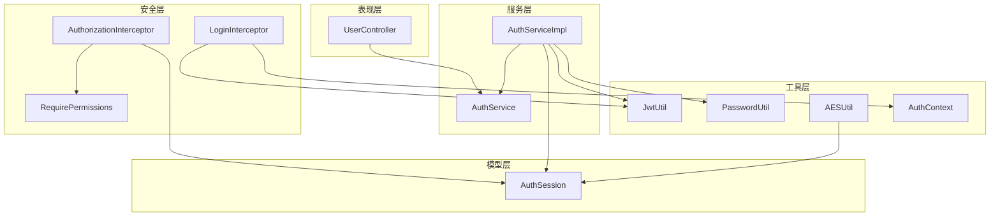

# 安全配置与认证授权

<cite>
**本文档引用的文件**
- [JwtUtil.java](file://backend-repo/src/main/java/com/zjcxph/imgapi/utils/JwtUtil.java)
- [AESUtil.java](file://backend-repo/src/main/java/com/zjcxph/imgapi/utils/AESUtil.java)
- [PasswordUtil.java](file://backend-repo/src/main/java/com/zjcxph/imgapi/utils/PasswordUtil.java)
- [RequirePermissions.java](file://backend-repo/src/main/java/com/zjcxph/imgapi/annotation/RequirePermissions.java)
- [AuthSession.java](file://backend-repo/src/main/java/com/zjcxph/imgapi/common/AuthSession.java)
- [AuthorizationInterceptor.java](file://backend-repo/src/main/java/com/zjcxph/imgapi/interceptors/AuthorizationInterceptor.java)
- [LoginInterceptor.java](file://backend-repo/src/main/java/com/zjcxph/imgapi/interceptors/LoginInterceptor.java)
- [AuthContext.java](file://backend-repo/src/main/java/com/zjcxph/imgapi/utils/AuthContext.java)
- [AuthService.java](file://backend-repo/src/main/java/com/zjcxph/imgapi/service/AuthService.java)
- [AuthServiceImpl.java](file://backend-repo/src/main/java/com/zjcxph/imgapi/service/impl/AuthServiceImpl.java)
- [UserController.java](file://backend-repo/src/main/java/com/zjcxph/imgapi/controller/UserController.java)
- [application.properties](file://backend-repo/src/main/resources/application.properties)
</cite>

## 目录
1. [简介](#简介)
2. [项目结构](#项目结构)
3. [核心组件](#核心组件)
4. [架构概览](#架构概览)
5. [详细组件分析](#详细组件分析)
6. [依赖关系分析](#依赖关系分析)
7. [性能考虑](#性能考虑)
8. [故障排除指南](#故障排除指南)
9. [结论](#结论)

## 简介

MRR项目采用多层安全架构，结合JWT令牌认证、基于角色的权限控制和对称加密技术，构建了一个完整的安全体系。本文档深入分析了项目的认证授权机制，包括JWT令牌的生成验证流程、AES加密工具类的实现、密码加密策略以及权限控制注解的使用。

项目安全架构主要由以下核心组件构成：
- **JWT令牌系统**：基于HMAC256算法的无状态认证机制
- **权限控制系统**：基于注解的细粒度访问控制
- **加密工具集**：对称加密算法和密钥管理策略
- **拦截器链**：请求拦截和权限验证
- **上下文管理**：线程本地存储的用户会话管理

## 项目结构

后端安全相关代码主要位于`backend-repo/src/main/java/com/zjcxph/imgapi/`目录下，按功能模块组织：

**图表来源**
- [JwtUtil.java:1-77](file://backend-repo/src/main/java/com/zjcxph/imgapi/utils/JwtUtil.java#L1-L77)
- [AuthSession.java:1-90](file://backend-repo/src/main/java/com/zjcxph/imgapi/common/AuthSession.java#L1-L90)

**章节来源**
- [application.properties:1-49](file://backend-repo/src/main/resources/application.properties#L1-L49)

## 核心组件

### JWT令牌管理系统

JWT（JSON Web Token）是MRR项目的核心认证机制，采用无状态设计，通过HMAC256算法确保令牌完整性。

**令牌特性**：
- **有效期**：24小时（毫秒级）
- **签名算法**：HMAC256
- **密钥来源**：环境变量优先，支持运行时配置
- **载荷内容**：用户身份信息、角色权限等

**章节来源**
- [JwtUtil.java:14-17](file://backend-repo/src/main/java/com/zjcxph/imgapi/utils/JwtUtil.java#L14-L17)
- [JwtUtil.java:22-59](file://backend-repo/src/main/java/com/zjcxph/imgapi/utils/JwtUtil.java#L22-L59)

### 权限控制注解系统

`@RequirePermissions`注解提供了声明式的权限控制机制，支持方法级别和类型级别的权限验证。

**注解特性**：
- **目标类型**：方法和类型
- **生命周期**：运行时有效
- **权限匹配**：支持多权限组合验证
- **继承机制**：支持类级别注解继承

**章节来源**
- [RequirePermissions.java:8-12](file://backend-repo/src/main/java/com/zjcxph/imgapi/annotation/RequirePermissions.java#L8-L12)

### 加密工具集

项目实现了完整的对称加密解决方案，支持AES-CBC模式的身份证号码加密解密。

**加密特性**：
- **算法标准**：AES/CBC/PKCS5Padding
- **密钥长度**：32字节
- **初始化向量**：十六进制编码
- **兼容版本**：支持带时间戳和不带时间戳两种模式

**章节来源**
- [AESUtil.java:23-25](file://backend-repo/src/main/java/com/zjcxph/imgapi/utils/AESUtil.java#L23-L25)
- [AESUtil.java:70-99](file://backend-repo/src/main/java/com/zjcxph/imgapi/utils/AESUtil.java#L70-L99)

### 用户会话管理

`AuthSession`类封装了用户认证后的会话信息，支持管理员权限判断和权限验证。

**会话属性**：
- **身份标识**：用户ID、用户名、显示名称
- **角色信息**：角色代码、角色名称、状态
- **权限集合**：动态权限列表
- **时间戳**：最后登录时间

**章节来源**
- [AuthSession.java:7-89](file://backend-repo/src/main/java/com/zjcxph/imgapi/common/AuthSession.java#L7-L89)

## 架构概览

MRR项目的安全架构采用分层设计，通过拦截器链实现请求的统一安全处理：

**图表来源**
- [LoginInterceptor.java:29-52](file://backend-repo/src/main/java/com/zjcxph/imgapi/interceptors/LoginInterceptor.java#L29-L52)
- [AuthorizationInterceptor.java:22-56](file://backend-repo/src/main/java/com/zjcxph/imgapi/interceptors/AuthorizationInterceptor.java#L22-L56)
- [JwtUtil.java:61-75](file://backend-repo/src/main/java/com/zjcxph/imgapi/utils/JwtUtil.java#L61-L75)

## 详细组件分析

### JWT令牌生成与验证流程

JWT令牌系统实现了完整的认证生命周期管理：

**图表来源**
- [AuthServiceImpl.java:36-62](file://backend-repo/src/main/java/com/zjcxph/imgapi/service/impl/AuthServiceImpl.java#L36-L62)
- [JwtUtil.java:22-59](file://backend-repo/src/main/java/com/zjcxph/imgapi/utils/JwtUtil.java#L22-L59)

**章节来源**
- [AuthServiceImpl.java:36-62](file://backend-repo/src/main/java/com/zjcxph/imgapi/service/impl/AuthServiceImpl.java#L36-L62)
- [JwtUtil.java:22-59](file://backend-repo/src/main/java/com/zjcxph/imgapi/utils/JwtUtil.java#L22-L59)

### 权限控制拦截器实现

权限拦截器提供了细粒度的访问控制机制：

**图表来源**
- [AuthorizationInterceptor.java:17-77](file://backend-repo/src/main/java/com/zjcxph/imgapi/interceptors/AuthorizationInterceptor.java#L17-L77)
- [RequirePermissions.java:8-12](file://backend-repo/src/main/java/com/zjcxph/imgapi/annotation/RequirePermissions.java#L8-L12)
- [AuthSession.java:81-88](file://backend-repo/src/main/java/com/zjcxph/imgapi/common/AuthSession.java#L81-L88)

**章节来源**
- [AuthorizationInterceptor.java:22-56](file://backend-repo/src/main/java/com/zjcxph/imgapi/interceptors/AuthorizationInterceptor.java#L22-L56)
- [AuthSession.java:81-88](file://backend-repo/src/main/java/com/zjcxph/imgapi/common/AuthSession.java#L81-L88)

### AES加密工具类分析

AES加密工具类实现了安全的数据加密解密功能：

**图表来源**
- [AESUtil.java:19-233](file://backend-repo/src/main/java/com/zjcxph/imgapi/utils/AESUtil.java#L19-L233)
- [AuthContext.java:5-28](file://backend-repo/src/main/java/com/zjcxph/imgapi/utils/AuthContext.java#L5-L28)

**章节来源**
- [AESUtil.java:70-150](file://backend-repo/src/main/java/com/zjcxph/imgapi/utils/AESUtil.java#L70-L150)
- [AESUtil.java:170-215](file://backend-repo/src/main/java/com/zjcxph/imgapi/utils/AESUtil.java#L170-L215)

### 密码加密与验证机制

密码处理采用了SHA-256哈希算法，确保密码存储的安全性：

**密码处理流程**：
1. **输入验证**：检查原始密码和哈希值的有效性
2. **哈希计算**：使用SHA-256算法生成密码哈希
3. **安全比较**：进行大小写不敏感的哈希值比较

**章节来源**
- [PasswordUtil.java:10-22](file://backend-repo/src/main/java/com/zjcxph/imgapi/utils/PasswordUtil.java#L10-L22)

### 用户会话管理

AuthContext类提供了线程本地存储的用户会话管理机制：

**图表来源**
- [AuthContext.java:12-26](file://backend-repo/src/main/java/com/zjcxph/imgapi/utils/AuthContext.java#L12-L26)

**章节来源**
- [AuthContext.java:12-26](file://backend-repo/src/main/java/com/zjcxph/imgapi/utils/AuthContext.java#L12-L26)

## 依赖关系分析

项目安全组件之间的依赖关系体现了清晰的分层架构：

**图表来源**
- [UserController.java:32-36](file://backend-repo/src/main/java/com/zjcxph/imgapi/controller/UserController.java#L32-L36)
- [AuthServiceImpl.java:25-34](file://backend-repo/src/main/java/com/zjcxph/imgapi/service/impl/AuthServiceImpl.java#L25-L34)
- [LoginInterceptor.java:16-27](file://backend-repo/src/main/java/com/zjcxph/imgapi/interceptors/LoginInterceptor.java#L16-L27)
- [AuthorizationInterceptor.java:17-32](file://backend-repo/src/main/java/com/zjcxph/imgapi/interceptors/AuthorizationInterceptor.java#L17-L32)

**章节来源**
- [UserController.java:32-36](file://backend-repo/src/main/java/com/zjcxph/imgapi/controller/UserController.java#L32-L36)
- [AuthServiceImpl.java:25-34](file://backend-repo/src/main/java/com/zjcxph/imgapi/service/impl/AuthServiceImpl.java#L25-L34)

## 性能考虑

### JWT令牌性能优化

- **令牌缓存**：可考虑实现令牌验证结果的短期缓存
- **异步验证**：对于高并发场景，可考虑异步令牌验证机制
- **负载均衡**：在集群环境中确保所有节点使用相同的密钥配置

### 加密性能优化

- **密钥预处理**：对用户特定密钥进行预计算和缓存
- **批量操作**：对于大量数据的加密解密，考虑批量处理策略
- **内存管理**：注意加密过程中的内存使用，避免大对象的重复创建

### 权限检查优化

- **权限缓存**：用户权限的定期缓存可以减少数据库查询
- **权限预加载**：在用户登录时预加载完整的权限集合
- **快速路径**：对于公共接口，跳过权限检查以提高性能

## 故障排除指南

### JWT令牌相关问题

**常见问题及解决方案**：

1. **令牌过期问题**
   - 检查服务器时间同步
   - 验证JWT_SECRET_KEY配置
   - 确认客户端重新登录流程

2. **令牌验证失败**
   - 检查Authorization头格式
   - 验证JWT密钥一致性
   - 查看服务器日志获取详细错误信息

**章节来源**
- [LoginInterceptor.java:42-51](file://backend-repo/src/main/java/com/zjcxph/imgapi/interceptors/LoginInterceptor.java#L42-L51)
- [JwtUtil.java:61-75](file://backend-repo/src/main/java/com/zjcxph/imgapi/utils/JwtUtil.java#L61-L75)

### 权限控制问题

**权限验证失败排查**：

1. **401未认证错误**
   - 检查请求是否包含有效的Authorization头
   - 验证JWT令牌格式和签名
   - 确认令牌未过期

2. **403权限不足**
   - 检查用户实际拥有的权限列表
   - 验证@RequirePermissions注解的权限值
   - 确认用户角色具有相应的管理权限

**章节来源**
- [AuthorizationInterceptor.java:37-52](file://backend-repo/src/main/java/com/zjcxph/imgapi/interceptors/AuthorizationInterceptor.java#L37-L52)

### 加密解密问题

**AES加密异常处理**：

1. **解密失败**
   - 验证密文和IV的十六进制格式
   - 检查用户ID和密钥参数
   - 确认加密版本的一致性

2. **密钥长度问题**
   - 确保密钥长度为32字节
   - 验证用户特定密钥的生成逻辑
   - 检查时间戳参数的正确性

**章节来源**
- [AESUtil.java:95-98](file://backend-repo/src/main/java/com/zjcxph/imgapi/utils/AESUtil.java#L95-L98)
- [AESUtil.java:146-149](file://backend-repo/src/main/java/com/zjcxph/imgapi/utils/AESUtil.java#L146-L149)

### 密码验证问题

**密码哈希验证失败**：

1. **空值检查**
   - 确保原始密码和哈希值都不为空
   - 验证输入参数的有效性

2. **哈希算法兼容性**
   - 确认所有密码都使用SHA-256哈希
   - 检查数据库中密码存储格式

**章节来源**
- [PasswordUtil.java:17-22](file://backend-repo/src/main/java/com/zjcxph/imgapi/utils/PasswordUtil.java#L17-L22)

## 结论

MRR项目的安全配置展现了现代Web应用的安全最佳实践。通过JWT无状态认证、基于注解的权限控制、对称加密技术和线程本地存储的会话管理，构建了一个完整且高效的安全体系。

**主要优势**：
- **无状态设计**：JWT令牌支持水平扩展和负载均衡
- **细粒度控制**：基于注解的权限验证提供精确的访问控制
- **数据保护**：AES加密确保敏感数据的安全存储
- **性能优化**：合理的缓存策略和异步处理提升系统性能

**改进建议**：
- 考虑引入Spring Security框架以获得更完善的安全功能
- 实现密码哈希算法升级（如BCrypt）以增强安全性
- 添加CSRF防护机制以应对浏览器端攻击
- 实施更严格的密钥轮换策略和安全审计日志

该安全架构为MRR项目提供了坚实的安全基础，能够有效防范常见的Web应用攻击，保障系统的稳定运行和数据安全。