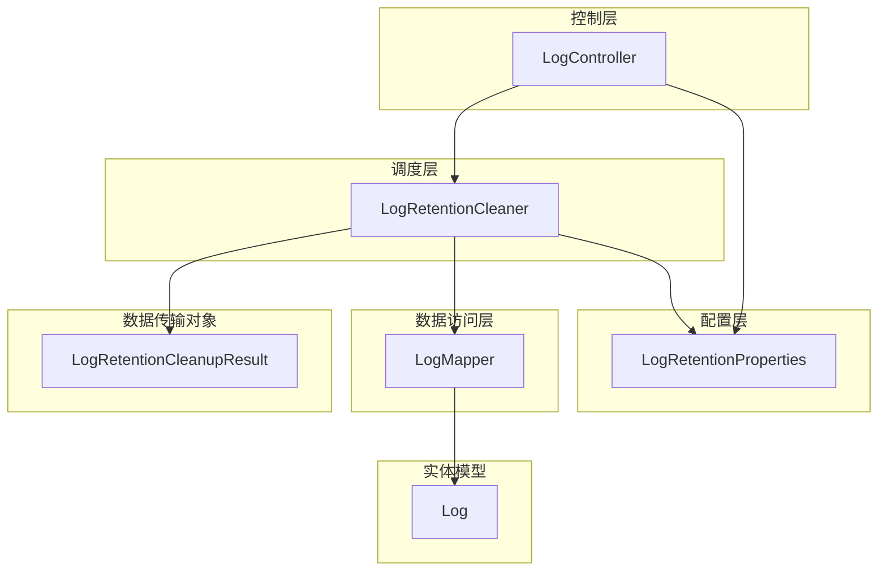
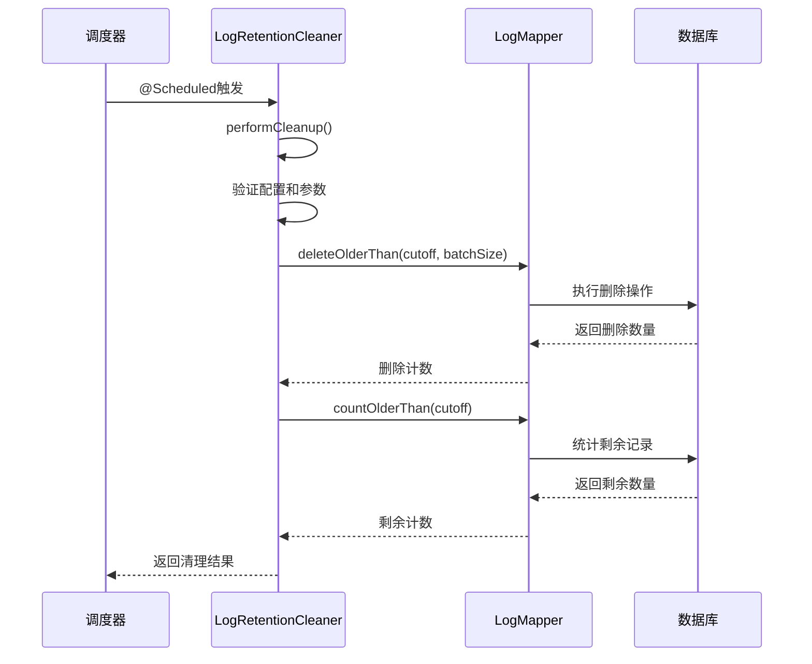
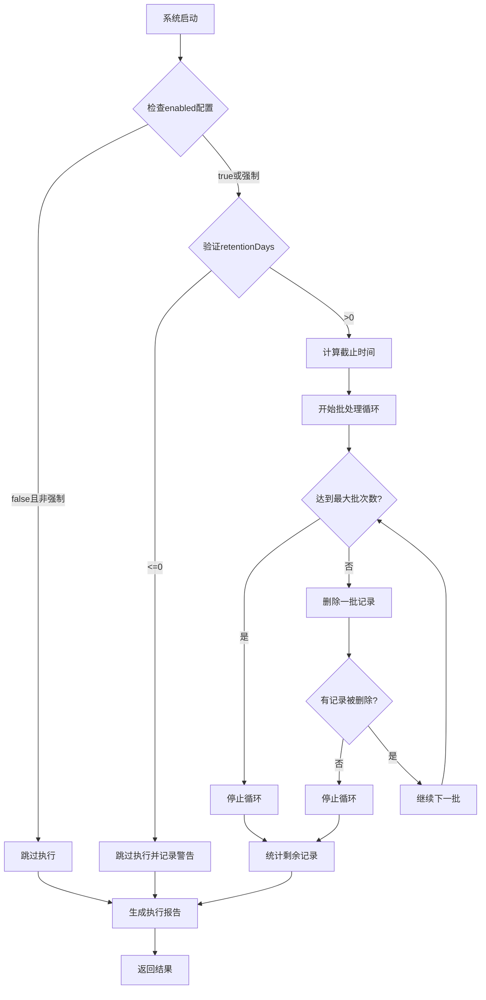
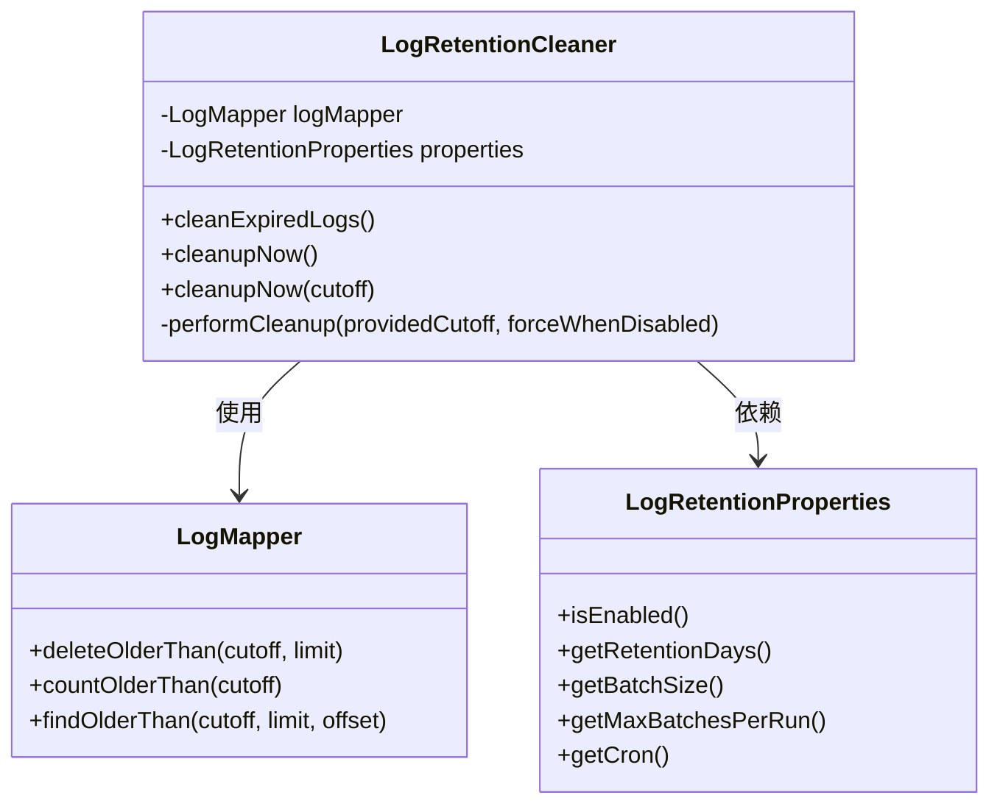
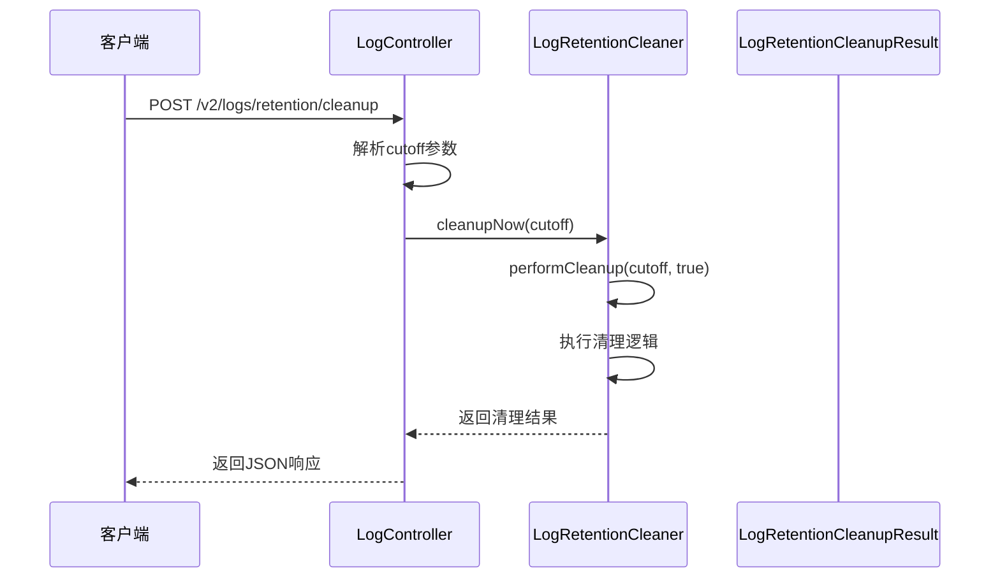
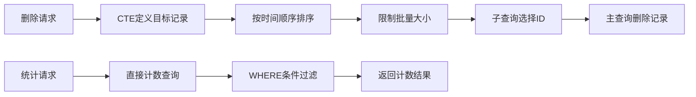
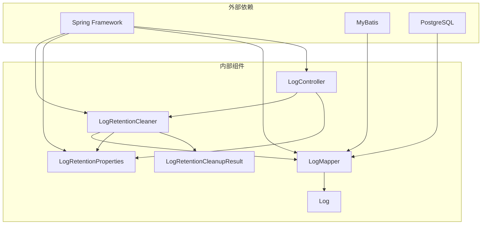
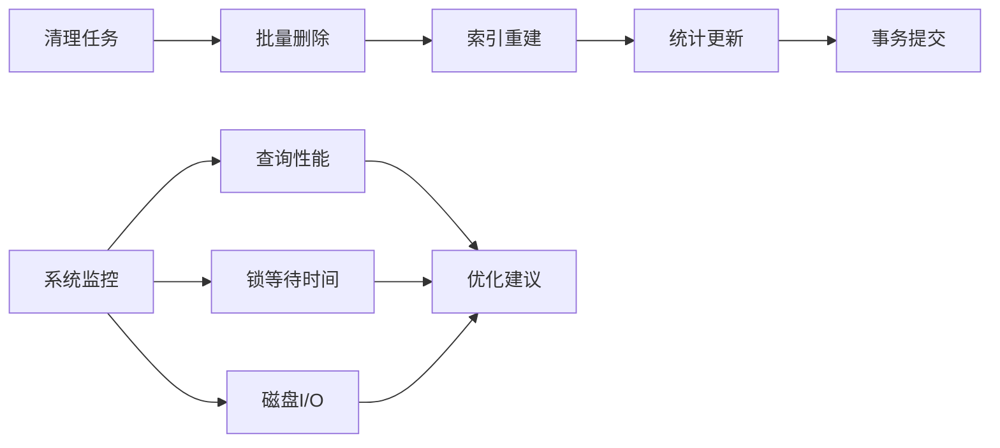

# 日志清理定时任务

<cite>
**本文档引用的文件**
- [LogRetentionCleaner.java](file://backend-repo/src/main/java/com/zjcxph/imgapi/scheduler/LogRetentionCleaner.java)
- [LogRetentionProperties.java](file://backend-repo/src/main/java/com/zjcxph/imgapi/config/LogRetentionProperties.java)
- [LogRetentionCleanupResult.java](file://backend-repo/src/main/java/com/zjcxph/imgapi/dto/resp/LogRetentionCleanupResult.java)
- [LogMapper.java](file://backend-repo/src/main/java/com/zjcxph/imgapi/mapper/LogMapper.java)
- [LogController.java](file://backend-repo/src/main/java/com/zjcxph/imgapi/controller/LogController.java)
- [Log.java](file://backend-repo/src/main/java/com/zjcxph/imgapi/entity/Log.java)
- [application.properties](file://backend-repo/src/main/resources/application.properties)
- [application-local.example.properties](file://backend-repo/src/main/resources/application-local.example.properties)
- [Result.java](file://backend-repo/src/main/java/com/zjcxph/imgapi/common/Result.java)
</cite>

## 目录
1. [简介](#简介)
2. [项目结构](#项目结构)
3. [核心组件](#核心组件)
4. [架构概览](#架构概览)
5. [详细组件分析](#详细组件分析)
6. [依赖关系分析](#依赖关系分析)
7. [性能考虑](#性能考虑)
8. [故障排除指南](#故障排除指南)
9. [结论](#结论)
10. [附录](#附录)

## 简介

MRR项目的日志清理定时任务是一个关键的维护功能，负责定期清理过期的日志数据，确保数据库性能和存储空间的有效管理。该系统基于Spring框架的调度机制，实现了自动化的日志保留策略管理。

本系统的核心目标是通过可配置的保留策略，自动清理超过指定时间范围的日志记录，同时提供手动触发和参数化清理功能。系统采用批处理模式进行数据清理，避免单次操作对数据库造成过大压力。

## 项目结构

日志清理功能在MRR项目中的组织结构如下：



**图表来源**
- [LogRetentionCleaner.java:1-119](file://backend-repo/src/main/java/com/zjcxph/imgapi/scheduler/LogRetentionCleaner.java#L1-L119)
- [LogRetentionProperties.java:1-54](file://backend-repo/src/main/java/com/zjcxph/imgapi/config/LogRetentionProperties.java#L1-L54)
- [LogMapper.java:1-166](file://backend-repo/src/main/java/com/zjcxph/imgapi/mapper/LogMapper.java#L1-L166)
- [LogController.java:1-245](file://backend-repo/src/main/java/com/zjcxph/imgapi/controller/LogController.java#L1-L245)

**章节来源**
- [LogRetentionCleaner.java:1-119](file://backend-repo/src/main/java/com/zjcxph/imgapi/scheduler/LogRetentionCleaner.java#L1-L119)
- [LogRetentionProperties.java:1-54](file://backend-repo/src/main/java/com/zjcxph/imgapi/config/LogRetentionProperties.java#L1-L54)
- [LogMapper.java:1-166](file://backend-repo/src/main/java/com/zjcxph/imgapi/mapper/LogMapper.java#L1-L166)
- [LogController.java:1-245](file://backend-repo/src/main/java/com/zjcxph/imgapi/controller/LogController.java#L1-L245)

## 核心组件

### LogRetentionCleaner 类

LogRetentionCleaner 是日志清理系统的核心调度器，负责执行定时清理任务和提供手动清理接口。

**主要职责：**
- 基于cron表达式定时执行日志清理
- 提供手动清理接口支持参数化操作
- 实现批处理清理策略
- 生成详细的清理结果报告

**关键特性：**
- 使用Spring @Scheduled注解实现定时调度
- 支持强制执行模式（即使禁用状态）
- 实现智能批处理机制
- 提供完整的错误处理和日志记录

**章节来源**
- [LogRetentionCleaner.java:14-119](file://backend-repo/src/main/java/com/zjcxph/imgapi/scheduler/LogRetentionCleaner.java#L14-L119)

### LogRetentionProperties 配置类

LogRetentionProperties 提供了日志清理的所有可配置参数，支持通过外部配置文件进行灵活调整。

**配置参数：**
- enabled: 启用/禁用日志清理功能
- cron: 定时任务的cron表达式
- retentionDays: 日志保留天数
- batchSize: 每批清理的数据量
- maxBatchesPerRun: 每次运行的最大批次数

**默认值：**
- enabled: false
- cron: 0 30 2 * * ?
- retentionDays: 1095天（约3年）
- batchSize: 5000条记录
- maxBatchesPerRun: 20批

**章节来源**
- [LogRetentionProperties.java:6-54](file://backend-repo/src/main/java/com/zjcxph/imgapi/config/LogRetentionProperties.java#L6-L54)

### LogRetentionCleanupResult 数据传输对象

LogRetentionCleanupResult 封装了每次清理操作的完整结果信息，便于监控和审计。

**结果字段：**
- enabled: 配置状态
- skipped: 是否跳过执行
- success: 执行是否成功
- message: 执行结果描述
- retentionDays: 保留天数设置
- batchSize: 批处理大小
- maxBatchesPerRun: 最大批次数限制
- executedAt: 执行时间
- cutoff: 截止时间
- deleted: 删除的记录数
- remainingOlderThanCutoff: 清理后剩余记录数
- batches: 实际执行的批次数

**章节来源**
- [LogRetentionCleanupResult.java:8-119](file://backend-repo/src/main/java/com/zjcxph/imgapi/dto/resp/LogRetentionCleanupResult.java#L8-L119)

## 架构概览

日志清理系统的整体架构采用分层设计，确保各组件职责清晰、耦合度低。



**图表来源**
- [LogRetentionCleaner.java:26-117](file://backend-repo/src/main/java/com/zjcxph/imgapi/scheduler/LogRetentionCleaner.java#L26-L117)
- [LogMapper.java:41-56](file://backend-repo/src/main/java/com/zjcxph/imgapi/mapper/LogMapper.java#L41-L56)

系统采用以下设计原则：

1. **分层架构**：调度层、配置层、数据访问层职责分离
2. **批处理策略**：避免一次性大量删除操作
3. **参数化配置**：支持运行时调整清理策略
4. **完整监控**：提供详细的执行结果和统计信息

## 详细组件分析

### 定时任务执行策略

#### Cron表达式配置

系统使用Spring的@Scheduled注解实现定时调度，默认配置为：
```
0 30 2 * * ?
```

这个cron表达式的含义是：每天凌晨2点30分执行一次清理任务。

**配置灵活性：**
- 支持通过配置文件动态修改执行时间
- 允许禁用定时任务但仍可通过手动方式执行
- 提供强制执行模式绕过禁用状态

#### 执行时机分析



**图表来源**
- [LogRetentionCleaner.java:39-117](file://backend-repo/src/main/java/com/zjcxph/imgapi/scheduler/LogRetentionCleaner.java#L39-L117)

**章节来源**
- [LogRetentionCleaner.java:26-29](file://backend-repo/src/main/java/com/zjcxph/imgapi/scheduler/LogRetentionCleaner.java#L26-L29)
- [application.properties:40-45](file://backend-repo/src/main/resources/application.properties#L40-L45)

### 批处理清理算法

#### 核心清理流程

performCleanup方法实现了完整的清理逻辑：

1. **初始化阶段**：读取配置参数，创建结果对象
2. **验证阶段**：检查启用状态和保留天数有效性
3. **计算截止时间**：基于当前时间和保留天数确定清理边界
4. **批处理循环**：重复执行删除操作直到条件满足
5. **统计阶段**：计算删除总数和剩余记录数
6. **结果生成**：封装执行结果和统计数据

#### 批处理优化策略



**图表来源**
- [LogRetentionCleaner.java:18-24](file://backend-repo/src/main/java/com/zjcxph/imgapi/scheduler/LogRetentionCleaner.java#L18-L24)
- [LogMapper.java:10-166](file://backend-repo/src/main/java/com/zjcxph/imgapi/mapper/LogMapper.java#L10-L166)
- [LogRetentionProperties.java:6-54](file://backend-repo/src/main/java/com/zjcxph/imgapi/config/LogRetentionProperties.java#L6-L54)

**章节来源**
- [LogRetentionCleaner.java:39-117](file://backend-repo/src/main/java/com/zjcxph/imgapi/scheduler/LogRetentionCleaner.java#L39-L117)

### 手动触发机制

#### cleanupNow方法族

系统提供了三种清理触发方式：

1. **自动清理**：通过@Scheduled注解定时执行
2. **即时清理**：无参数调用，使用默认截止时间
3. **参数化清理**：指定自定义截止时间

#### 参数化清理功能



**图表来源**
- [LogController.java:94-106](file://backend-repo/src/main/java/com/zjcxph/imgapi/controller/LogController.java#L94-L106)
- [LogRetentionCleaner.java:31-37](file://backend-repo/src/main/java/com/zjcxph/imgapi/scheduler/LogRetentionCleaner.java#L31-L37)

**章节来源**
- [LogController.java:94-106](file://backend-repo/src/main/java/com/zjcxph/imgapi/controller/LogController.java#L94-L106)
- [LogRetentionCleaner.java:31-37](file://backend-repo/src/main/java/com/zjcxph/imgapi/scheduler/LogRetentionCleaner.java#L31-L37)

### 数据访问层设计

#### MyBatis映射器实现

LogMapper使用MyBatis注解实现高效的数据库操作：

1. **删除操作**：使用CTE（公用表表达式）实现批量删除
2. **统计操作**：精确统计过期记录数量
3. **查询操作**：支持按条件查询过期日志

#### SQL优化策略



**图表来源**
- [LogMapper.java:41-56](file://backend-repo/src/main/java/com/zjcxph/imgapi/mapper/LogMapper.java#L41-L56)

**章节来源**
- [LogMapper.java:41-56](file://backend-repo/src/main/java/com/zjcxph/imgapi/mapper/LogMapper.java#L41-L56)

## 依赖关系分析

### 组件间依赖关系



**图表来源**
- [LogRetentionCleaner.java:3-9](file://backend-repo/src/main/java/com/zjcxph/imgapi/scheduler/LogRetentionCleaner.java#L3-L9)
- [LogMapper.java:3-7](file://backend-repo/src/main/java/com/zjcxph/imgapi/mapper/LogMapper.java#L3-L7)

### 配置依赖分析

系统配置采用层次化设计，支持多种环境的灵活配置：

| 配置项 | 默认值 | 环境变量 | 作用域 |
|--------|--------|----------|--------|
| app.log-retention.enabled | false | APP_LOG_RETENTION_ENABLED | 功能开关 |
| app.log-retention.cron | 0 30 2 * * ? | APP_LOG_RETENTION_CRON | 执行时间 |
| app.log-retention.retention-days | 1095 | APP_LOG_RETENTION_RETENTION_DAYS | 保留期限 |
| app.log-retention.batch-size | 5000 | APP_LOG_RETENTION_BATCH_SIZE | 批处理大小 |
| app.log-retention.max-batches-per-run | 20 | APP_LOG_RETENTION_MAX_BATCHES_PER_RUN | 批次限制 |

**章节来源**
- [application.properties:40-45](file://backend-repo/src/main/resources/application.properties#L40-L45)
- [application-local.example.properties:14-19](file://backend-repo/src/main/resources/application-local.example.properties#L14-L19)

## 性能考虑

### 批处理性能优化

系统采用批处理策略来平衡清理效率和数据库负载：

1. **批量删除**：每次删除固定数量的记录，避免长时间锁表
2. **分批统计**：通过多次小批量操作减少内存占用
3. **索引利用**：基于access_time字段的索引优化查询性能

### 内存和CPU优化

- **流式处理**：导出功能使用流式写入，避免大文件加载到内存
- **连接池管理**：合理配置数据库连接池参数
- **日志级别控制**：根据需要调整日志输出级别

### 数据库性能影响



## 故障排除指南

### 常见问题及解决方案

#### 清理任务未执行

**可能原因：**
- 功能被禁用（enabled=false）
- cron表达式配置错误
- 数据库连接异常

**诊断步骤：**
1. 检查配置文件中的enabled设置
2. 验证cron表达式的语法正确性
3. 查看应用日志中的调度器启动信息

#### 清理速度过慢

**优化建议：**
- 调整batchSize参数增加批处理大小
- 检查数据库索引是否完善
- 监控数据库性能指标

#### 内存使用过高

**解决方案：**
- 减少batchSize参数值
- 优化数据库连接池配置
- 调整JVM堆内存参数

### 错误处理机制

系统实现了完善的错误处理和恢复机制：

1. **异常捕获**：所有清理操作都在try-catch块中执行
2. **状态记录**：失败时记录详细的错误信息
3. **回滚机制**：数据库操作在事务中执行，失败时自动回滚
4. **重试策略**：支持手动重试清理操作

**章节来源**
- [LogRetentionCleaner.java:110-114](file://backend-repo/src/main/java/com/zjcxph/imgapi/scheduler/LogRetentionCleaner.java#L110-L114)

## 结论

MRR项目的日志清理定时任务系统是一个设计精良的自动化维护工具，具有以下特点：

1. **高度可配置**：支持运行时调整清理策略
2. **性能优化**：采用批处理策略避免数据库压力
3. **监控完善**：提供详细的执行结果和统计信息
4. **错误处理**：具备完整的异常处理和恢复机制
5. **扩展性强**：模块化设计便于功能扩展

该系统能够有效管理日志数据的生命周期，确保数据库性能稳定，同时为运维人员提供了灵活的管理和监控手段。

## 附录

### 配置参数参考表

| 参数名 | 类型 | 默认值 | 描述 | 取值范围 |
|--------|------|--------|------|----------|
| app.log-retention.enabled | boolean | false | 启用日志清理功能 | true/false |
| app.log-retention.cron | string | 0 30 2 * * ? | 定时任务执行时间 | cron表达式 |
| app.log-retention.retention-days | integer | 1095 | 日志保留天数 | >0 |
| app.log-retention.batch-size | integer | 5000 | 每批清理记录数 | >0 |
| app.log-retention.max-batches-per-run | integer | 20 | 每次运行最大批次数 | >0 |

### API接口参考

#### 清理操作接口

**POST /v2/logs/retention/cleanup**
- 功能：手动触发日志清理
- 参数：cutoff（可选，自定义截止时间）
- 返回：LogRetentionCleanupResult

**GET /v2/logs/retention/export**
- 功能：导出过期日志数据
- 参数：无
- 返回：CSV文件流

### 监控指标

系统提供以下监控指标：
- 清理执行时间
- 删除记录数量
- 剩余记录统计
- 执行成功率
- 错误率统计