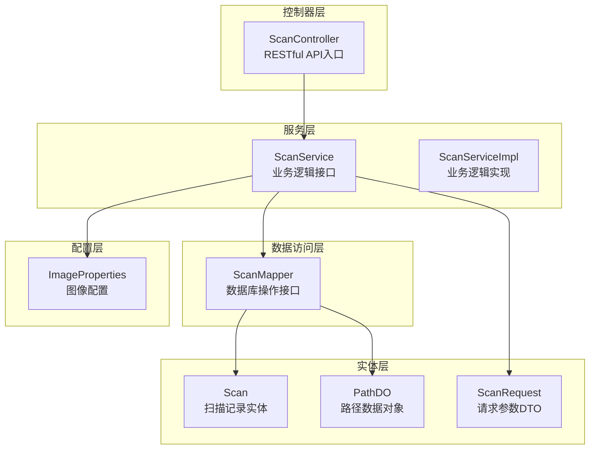
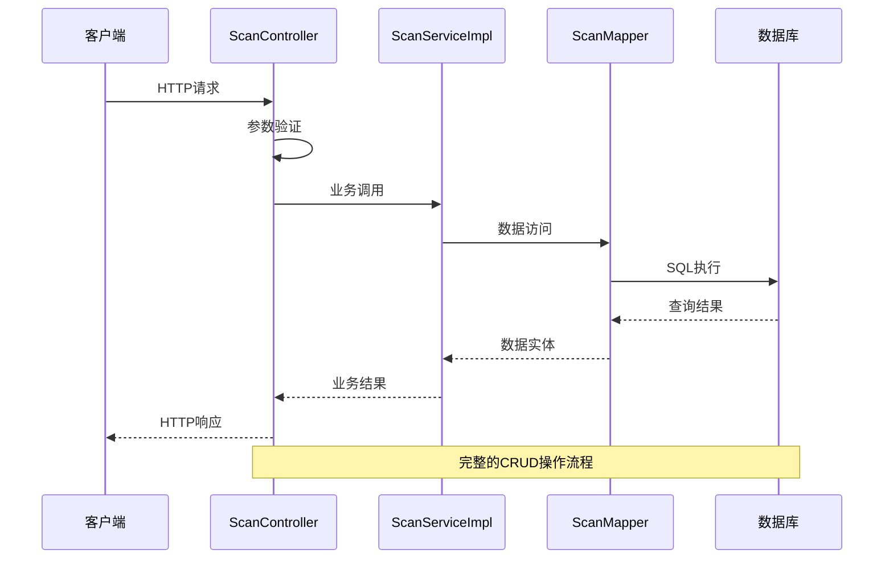
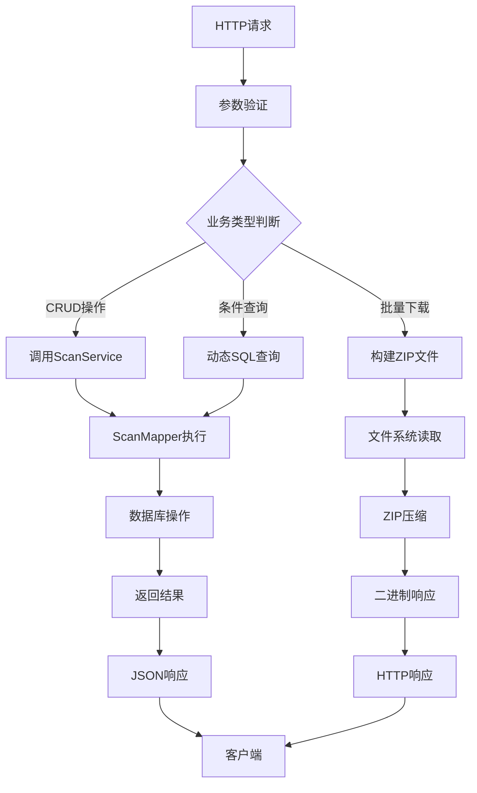
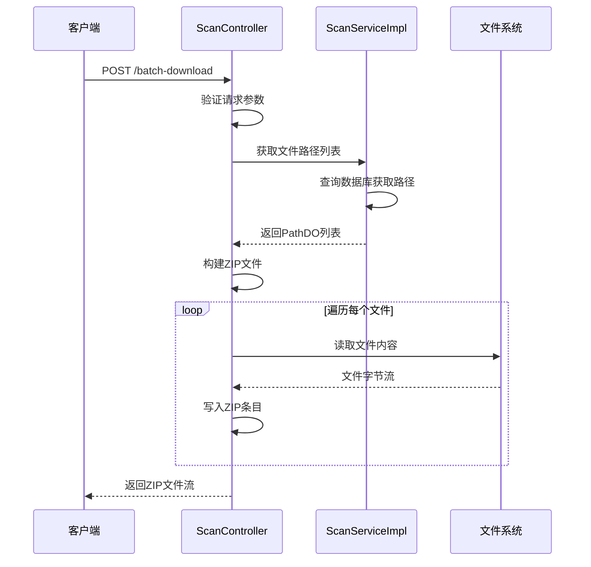
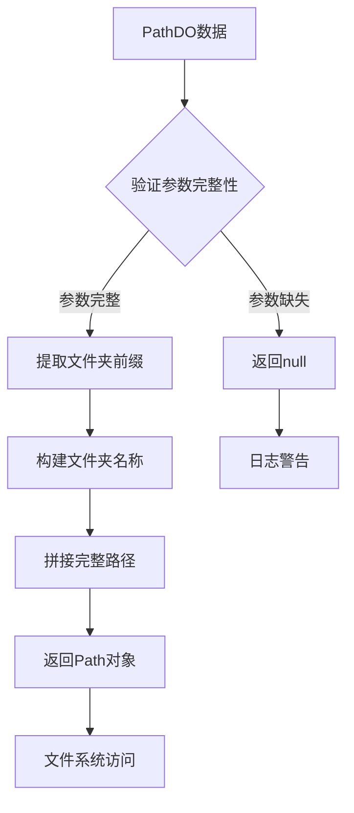
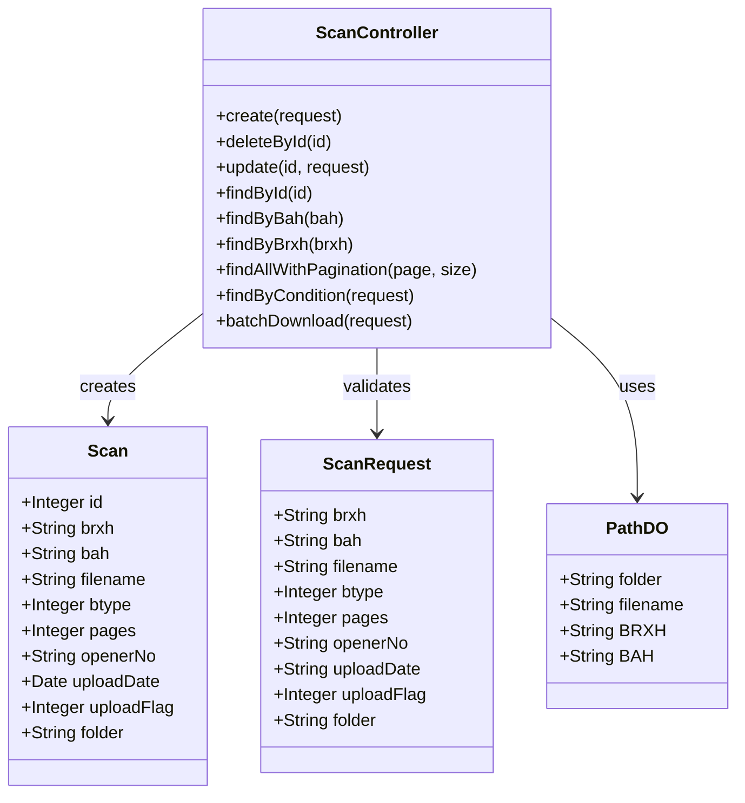
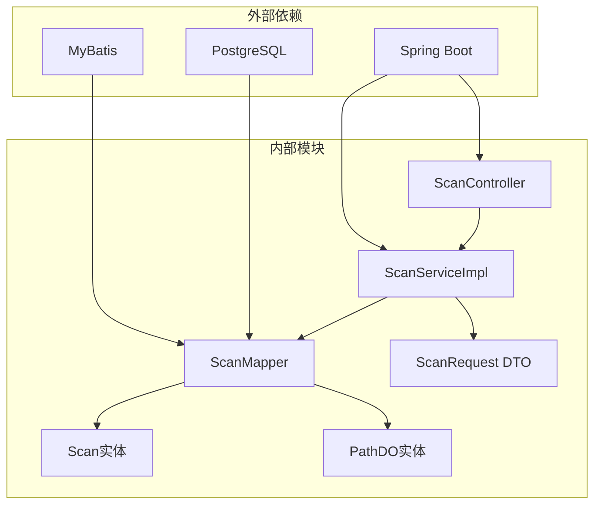

# 扫描功能控制器

<cite>
**本文档引用的文件**
- [ScanController.java](file://backend-repo/src/main/java/com/zjcxph/imgapi/controller/ScanController.java)
- [ScanRequest.java](file://backend-repo/src/main/java/com/zjcxph/imgapi/dto/req/ScanRequest.java)
- [ScanServiceImpl.java](file://backend-repo/src/main/java/com/zjcxph/imgapi/service/impl/ScanServiceImpl.java)
- [ScanService.java](file://backend-repo/src/main/java/com/zjcxph/imgapi/service/ScanService.java)
- [Scan.java](file://backend-repo/src/main/java/com/zjcxph/imgapi/entity/Scan.java)
- [PathDO.java](file://backend-repo/src/main/java/com/zjcxph/imgapi/entity/PathDO.java)
- [ScanMapper.java](file://backend-repo/src/main/java/com/zjcxph/imgapi/mapper/ScanMapper.java)
- [ImageProperties.java](file://backend-repo/src/main/java/com/zjcxph/imgapi/config/ImageProperties.java)
- [BatchDownloadRequest.java](file://backend-repo/src/main/java/com/zjcxph/imgapi/dto/req/BatchDownloadRequest.java)
- [API_CONTRACT.md](file://backend-repo/API_CONTRACT.md)
- [application.properties](file://backend-repo/src/main/resources/application.properties)
- [ScanTest.java](file://backend-repo/src/test/java/com/zjcxph/imgapi/ScanTest.java)
</cite>

## 目录
1. [简介](#简介)
2. [项目结构](#项目结构)
3. [核心组件](#核心组件)
4. [架构概览](#架构概览)
5. [详细组件分析](#详细组件分析)
6. [依赖关系分析](#依赖关系分析)
7. [性能考虑](#性能考虑)
8. [故障排除指南](#故障排除指南)
9. [结论](#结论)

## 简介

ScanController 是病案扫描记录管理系统的核心控制器，负责提供完整的扫描功能RESTful接口。该控制器实现了病案扫描记录的增删改查、批量下载、条件查询等核心功能，为医疗影像管理系统提供了完整的扫描数据管理能力。

系统采用分层架构设计，包含控制器层、服务层、数据访问层和实体层，确保了代码的可维护性和扩展性。通过标准化的RESTful API接口，前端应用可以轻松集成扫描功能，实现病案扫描数据的完整生命周期管理。

## 项目结构

扫描功能相关的项目结构组织如下：

**图表来源**
- [ScanController.java:1-333](file://backend-repo/src/main/java/com/zjcxph/imgapi/controller/ScanController.java#L1-L333)
- [ScanServiceImpl.java:1-135](file://backend-repo/src/main/java/com/zjcxph/imgapi/service/impl/ScanServiceImpl.java#L1-L135)
- [ScanMapper.java:1-131](file://backend-repo/src/main/java/com/zjcxph/imgapi/mapper/ScanMapper.java#L1-L131)

**章节来源**
- [ScanController.java:38-41](file://backend-repo/src/main/java/com/zjcxph/imgapi/controller/ScanController.java#L38-L41)
- [ScanServiceImpl.java:15-24](file://backend-repo/src/main/java/com/zjcxph/imgapi/service/impl/ScanServiceImpl.java#L15-L24)

## 核心组件

### 控制器组件

ScanController作为RESTful API的唯一入口点，提供了以下核心功能：

- **基础CRUD操作**：创建、查询、更新、删除扫描记录
- **高级查询功能**：按病案号、病人序号、条件组合查询
- **分页查询**：支持带分页的记录查询
- **批量下载**：支持多条记录的批量文件打包下载
- **文件路径解析**：根据扫描记录生成实际文件存储路径

### 数据传输对象

系统使用多个DTO来封装API请求和响应数据：

- **ScanRequest**：扫描记录的输入参数
- **BatchDownloadRequest**：批量下载的请求参数
- **PathDO**：文件路径信息的数据传输对象

### 实体模型

- **Scan**：扫描记录的完整实体模型
- **ImageProperties**：图像存储配置属性

**章节来源**
- [ScanController.java:54-80](file://backend-repo/src/main/java/com/zjcxph/imgapi/controller/ScanController.java#L54-L80)
- [ScanRequest.java:6-105](file://backend-repo/src/main/java/com/zjcxph/imgapi/dto/req/ScanRequest.java#L6-L105)
- [Scan.java:10-116](file://backend-repo/src/main/java/com/zjcxph/imgapi/entity/Scan.java#L10-L116)

## 架构概览

扫描功能采用经典的三层架构模式，确保了关注点分离和代码的可维护性：

**图表来源**
- [ScanController.java:140-166](file://backend-repo/src/main/java/com/zjcxph/imgapi/controller/ScanController.java#L140-L166)
- [ScanServiceImpl.java:73-91](file://backend-repo/src/main/java/com/zjcxph/imgapi/service/impl/ScanServiceImpl.java#L73-L91)
- [ScanMapper.java:32-58](file://backend-repo/src/main/java/com/zjcxph/imgapi/mapper/ScanMapper.java#L32-L58)

### 数据流图

**图表来源**
- [ScanController.java:256-281](file://backend-repo/src/main/java/com/zjcxph/imgapi/controller/ScanController.java#L256-L281)
- [ScanServiceImpl.java:63-65](file://backend-repo/src/main/java/com/zjcxph/imgapi/service/impl/ScanServiceImpl.java#L63-L65)
- [ScanMapper.java:21-27](file://backend-repo/src/main/java/com/zjcxph/imgapi/mapper/ScanMapper.java#L21-L27)

## 详细组件分析

### 扫描记录管理API

#### 基础CRUD操作

系统提供了完整的扫描记录管理API：

**创建扫描记录**
- **URL**: `POST /v1/scan-api`
- **请求体**: ScanRequest对象
- **响应**: 创建成功的Scan实体
- **功能**: 支持新增扫描记录到mr_scan表

**删除扫描记录**
- **URL**: `DELETE /v1/scan-api/{id}`
- **路径参数**: 记录ID
- **响应**: 删除结果状态
- **功能**: 实现逻辑删除（设置uploadflag=0）

**更新扫描记录**
- **URL**: `PUT /v1/scan-api/{id}`
- **路径参数**: 记录ID
- **请求体**: ScanRequest对象
- **响应**: 更新后的Scan实体
- **功能**: 支持部分字段更新

**查询扫描记录**
- **URL**: `GET /v1/scan-api/{id}`
- **路径参数**: 记录ID
- **响应**: 指定ID的Scan实体
- **功能**: 获取单条扫描记录详情

**章节来源**
- [ScanController.java:54-138](file://backend-repo/src/main/java/com/zjcxph/imgapi/controller/ScanController.java#L54-L138)
- [ScanMapper.java:32-58](file://backend-repo/src/main/java/com/zjcxph/imgapi/mapper/ScanMapper.java#L32-L58)

#### 高级查询功能

**分页查询**
- **URL**: `GET /v1/scan-api/page?page={page}&size={size}`
- **查询参数**: page（页码）、size（每页数量）
- **响应**: 包含列表、总数、页码信息的对象
- **功能**: 支持大数据量的分页浏览

**条件查询**
- **URL**: `POST /v1/scan-api/condition`
- **请求体**: ScanRequest对象
- **响应**: 符合条件的Scan记录列表
- **功能**: 支持多字段组合查询

**按病案号查询**
- **URL**: `GET /v1/scan-api/bah/{bah}`
- **路径参数**: 病案号
- **响应**: 指定病案号的所有扫描记录
- **功能**: 按病案号获取相关扫描记录

**按病人序号查询**
- **URL**: `GET /v1/scan-api/brxh/{brxh}`
- **路径参数**: 病人序号
- **响应**: 指定病人序号的所有扫描记录
- **功能**: 按病人序号获取相关扫描记录

**章节来源**
- [ScanController.java:140-254](file://backend-repo/src/main/java/com/zjcxph/imgapi/controller/ScanController.java#L140-L254)
- [ScanMapper.java:68-74](file://backend-repo/src/main/java/com/zjcxph/imgapi/mapper/ScanMapper.java#L68-L74)

### 批量下载功能

批量下载是扫描功能的重要特性，支持用户同时下载多个扫描记录对应的文件：

**图表来源**
- [ScanController.java:256-315](file://backend-repo/src/main/java/com/zjcxph/imgapi/controller/ScanController.java#L256-L315)
- [ScanServiceImpl.java:63-65](file://backend-repo/src/main/java/com/zjcxph/imgapi/service/impl/ScanServiceImpl.java#L63-L65)

**批量下载特性**：
- 支持多ID批量处理
- 自动构建嵌套目录结构
- 错误文件自动跳过
- 流式处理避免内存溢出

**章节来源**
- [ScanController.java:256-331](file://backend-repo/src/main/java/com/zjcxph/imgapi/controller/ScanController.java#L256-L331)
- [BatchDownloadRequest.java:8-18](file://backend-repo/src/main/java/com/zjcxph/imgapi/dto/req/BatchDownloadRequest.java#L8-L18)

### 文件路径管理

系统实现了智能的文件路径解析机制，根据扫描记录的元数据生成实际的文件存储路径：

**图表来源**
- [ScanController.java:317-331](file://backend-repo/src/main/java/com/zjcxph/imgapi/controller/ScanController.java#L317-L331)
- [ImageProperties.java:37-43](file://backend-repo/src/main/java/com/zjcxph/imgapi/config/ImageProperties.java#L37-L43)

**路径生成规则**：
- 基于配置的basePath
- 使用folder字段的前5位作为父目录
- 组合brxh和bah形成子目录
- 最终定位到具体文件

**章节来源**
- [ScanController.java:317-331](file://backend-repo/src/main/java/com/zjcxph/imgapi/controller/ScanController.java#L317-L331)
- [application.properties:33](file://backend-repo/src/main/resources/application.properties#L33)

### 数据模型设计

扫描功能涉及多个核心数据模型：

**图表来源**
- [Scan.java:10-116](file://backend-repo/src/main/java/com/zjcxph/imgapi/entity/Scan.java#L10-L116)
- [ScanRequest.java:6-105](file://backend-repo/src/main/java/com/zjcxph/imgapi/dto/req/ScanRequest.java#L6-L105)
- [PathDO.java:6-47](file://backend-repo/src/main/java/com/zjcxph/imgapi/entity/PathDO.java#L6-L47)

**章节来源**
- [Scan.java:10-116](file://backend-repo/src/main/java/com/zjcxph/imgapi/entity/Scan.java#L10-L116)
- [ScanRequest.java:6-105](file://backend-repo/src/main/java/com/zjcxph/imgapi/dto/req/ScanRequest.java#L6-L105)
- [PathDO.java:6-47](file://backend-repo/src/main/java/com/zjcxph/imgapi/entity/PathDO.java#L6-L47)

## 依赖关系分析

扫描功能的依赖关系体现了清晰的分层架构：

**图表来源**
- [ScanController.java:45-49](file://backend-repo/src/main/java/com/zjcxph/imgapi/controller/ScanController.java#L45-L49)
- [ScanServiceImpl.java:18-24](file://backend-repo/src/main/java/com/zjcxph/imgapi/service/impl/ScanServiceImpl.java#L18-L24)
- [ScanMapper.java:15-16](file://backend-repo/src/main/java/com/zjcxph/imgapi/mapper/ScanMapper.java#L15-L16)

### 关键依赖特性

**控制器依赖注入**：
- ScanController通过构造函数注入ScanService
- 实现了松耦合的设计模式
- 便于单元测试和依赖替换

**服务层依赖**：
- ScanServiceImpl依赖ScanMapper和ImageProperties
- 支持配置驱动的文件存储路径
- 提供业务逻辑的统一入口

**数据访问层**：
- ScanMapper使用MyBatis注解映射
- 支持动态SQL查询
- 实现了完整的CRUD操作

**章节来源**
- [ScanController.java:45-49](file://backend-repo/src/main/java/com/zjcxph/imgapi/controller/ScanController.java#L45-L49)
- [ScanServiceImpl.java:18-24](file://backend-repo/src/main/java/com/zjcxph/imgapi/service/impl/ScanServiceImpl.java#L18-L24)

## 性能考虑

### 查询性能优化

系统在查询性能方面采用了多项优化策略：

**索引友好查询**：
- 所有查询都基于mr_scan表的常用字段
- 支持按BAH、BRXH、id等字段的高效查询
- 分页查询使用LIMIT和OFFSET优化

**缓存策略**：
- 配置了Spring Web资源缓存
- 启用了服务器压缩以减少网络传输
- 图像文件路径查询结果可被上层应用缓存

**批量处理优化**：
- 批量下载采用流式处理避免内存溢出
- ZIP文件构建使用缓冲区减少I/O操作
- 缺失文件自动跳过避免阻塞整个过程

### 存储性能

**文件系统优化**：
- 采用分层目录结构减少单目录文件数量
- 基于时间的文件夹组织便于清理和管理
- 支持大文件的流式读取

**数据库连接池**：
- 配置了合理的连接池参数
- 支持高并发场景下的数据库访问
- 连接超时和空闲时间合理设置

## 故障排除指南

### 常见问题及解决方案

**文件路径解析失败**
- **症状**: 批量下载返回空结果或部分文件缺失
- **原因**: PathDO数据不完整或文件系统路径不存在
- **解决**: 检查扫描记录的folder、brxh、bah、filename字段完整性

**数据库连接异常**
- **症状**: CRUD操作失败，返回数据库错误
- **原因**: 数据库连接池耗尽或连接超时
- **解决**: 检查application.properties中的数据库配置

**批量下载性能问题**
- **症状**: 大批量下载时内存溢出或响应缓慢
- **原因**: 单次请求包含过多文件ID
- **解决**: 分批处理或限制单次下载文件数量

**章节来源**
- [ScanController.java:296-299](file://backend-repo/src/main/java/com/zjcxph/imgapi/controller/ScanController.java#L296-L299)
- [application.properties:15-20](file://backend-repo/src/main/resources/application.properties#L15-L20)

### 日志和监控

系统提供了完善的日志记录机制：

**关键操作日志**：
- 所有CRUD操作都有详细的日志记录
- 查询操作包含参数和结果信息
- 错误处理包含异常堆栈信息

**性能监控指标**：
- 配置了Spring Boot Actuator端点
- 支持健康检查和指标收集
- 可集成到监控系统进行实时监控

**章节来源**
- [ScanController.java:57](file://backend-repo/src/main/java/com/zjcxph/imgapi/controller/ScanController.java#L57)
- [application.properties:37-38](file://backend-repo/src/main/resources/application.properties#L37-L38)

## 结论

ScanController作为病案扫描记录管理系统的核心组件，展现了优秀的软件工程实践：

**架构优势**：
- 清晰的分层架构确保了代码的可维护性
- 标准化的RESTful API提供了良好的扩展性
- 完善的错误处理机制保证了系统的稳定性

**功能完整性**：
- 覆盖了扫描记录管理的全生命周期
- 支持复杂的查询和批量操作
- 提供了灵活的文件管理能力

**性能保障**：
- 采用多种优化策略确保系统性能
- 支持高并发场景下的稳定运行
- 提供了完善的监控和诊断能力

该控制器为医疗影像管理系统提供了可靠的基础支撑，通过标准化的接口设计和完善的错误处理机制，确保了扫描功能的稳定性和可用性。建议在生产环境中结合监控系统进行持续的性能优化和问题排查。