# 控制器层架构

<cite>
**本文档引用的文件**
- [ImageController.java](file://backend-repo/src/main/java/com/zjcxph/imgapi/controller/ImageController.java)
- [UserController.java](file://backend-repo/src/main/java/com/zjcxph/imgapi/controller/UserController.java)
- [SearchController.java](file://backend-repo/src/main/java/com/zjcxph/imgapi/controller/SearchController.java)
- [StatisticsController.java](file://backend-repo/src/main/java/com/zjcxph/imgapi/controller/StatisticsController.java)
- [DbController.java](file://backend-repo/src/main/java/com/zjcxph/imgapi/controller/DbController.java)
- [LogController.java](file://backend-repo/src/main/java/com/zjcxph/imgapi/controller/LogController.java)
- [PressureTestController.java](file://backend-repo/src/main/java/com/zjcxph/imgapi/controller/PressureTestController.java)
- [SystemInfoController.java](file://backend-repo/src/main/java/com/zjcxph/imgapi/controller/SystemInfoController.java)
- [ScanController.java](file://backend-repo/src/main/java/com/zjcxph/imgapi/controller/ScanController.java)
- [Result.java](file://backend-repo/src/main/java/com/zjcxph/imgapi/common/Result.java)
- [SwaggerConfig.java](file://backend-repo/src/main/java/com/zjcxph/imgapi/config/SwaggerConfig.java)
- [RequirePermissions.java](file://backend-repo/src/main/java/com/zjcxph/imgapi/annotation/RequirePermissions.java)
- [AuthUserUpdateRequest.java](file://backend-repo/src/main/java/com/zjcxph/imgapi/dto/req/AuthUserUpdateRequest.java)
- [LoginResponseDTO.java](file://backend-repo/src/main/java/com/zjcxph/imgapi/dto/resp/LoginResponseDTO.java)
- [ControllerIntegrationTest.java](file://backend-repo/src/test/java/com/zjcxph/imgapi/ControllerIntegrationTest.java)
- [SearchControllerTest.java](file://backend-repo/src/test/java/com/zjcxph/imgapi/SearchControllerTest.java)
- [pom.xml](file://backend-repo/pom.xml)
</cite>

## 目录
1. [简介](#简介)
2. [项目结构](#项目结构)
3. [核心组件](#核心组件)
4. [架构概览](#架构概览)
5. [详细组件分析](#详细组件分析)
6. [依赖分析](#依赖分析)
7. [性能考虑](#性能考虑)
8. [故障排除指南](#故障排除指南)
9. [结论](#结论)
10. [附录](#附录)

## 简介

MRR项目的控制器层采用Spring Boot框架构建，实现了完整的RESTful API架构。本架构文档深入分析了九个核心控制器的功能模块，包括图像管理、用户管理、搜索功能、统计分析、数据库操作、日志管理、压力测试、系统信息和扫描功能。

控制器层遵循清晰的职责分离原则，每个控制器专注于特定的业务领域，通过统一的响应格式和标准的HTTP状态码提供一致的API体验。架构设计充分考虑了可扩展性、可维护性和安全性要求。

## 项目结构

后端项目采用标准的Maven目录结构，控制器层位于`backend-repo/src/main/java/com/zjcxph/imgapi/controller/`目录下：

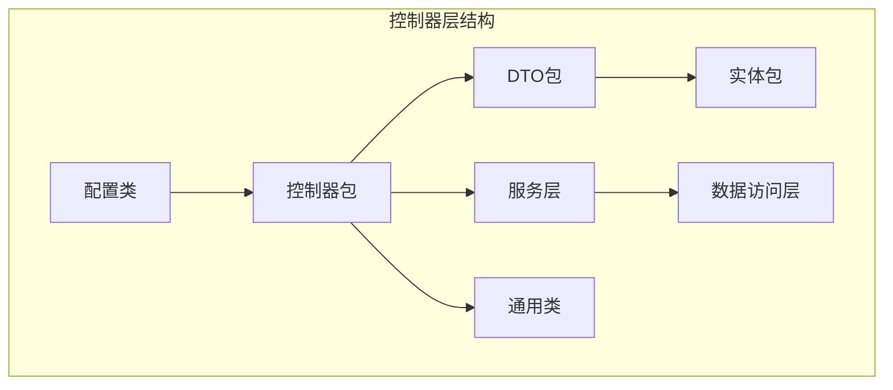

**图表来源**
- [ImageController.java:1-283](file://backend-repo/src/main/java/com/zjcxph/imgapi/controller/ImageController.java#L1-L283)
- [UserController.java:1-95](file://backend-repo/src/main/java/com/zjcxph/imgapi/controller/UserController.java#L1-L95)

**章节来源**
- [pom.xml:1-136](file://backend-repo/pom.xml#L1-L136)

## 核心组件

### 统一响应格式

所有控制器都使用统一的`Result<T>`响应格式，确保API的一致性和可预测性：

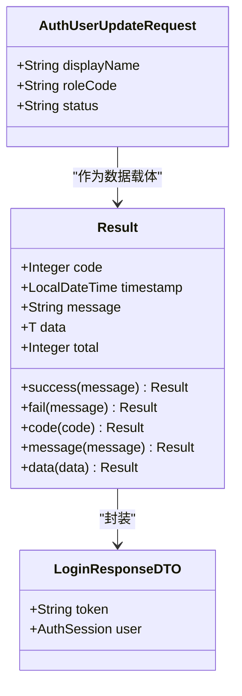

**图表来源**
- [Result.java:1-77](file://backend-repo/src/main/java/com/zjcxph/imgapi/common/Result.java#L1-L77)
- [LoginResponseDTO.java:1-34](file://backend-repo/src/main/java/com/zjcxph/imgapi/dto/resp/LoginResponseDTO.java#L1-L34)
- [AuthUserUpdateRequest.java:1-41](file://backend-repo/src/main/java/com/zjcxph/imgapi/dto/req/AuthUserUpdateRequest.java#L1-L41)

### 权限控制机制

通过自定义注解实现基于权限的访问控制：

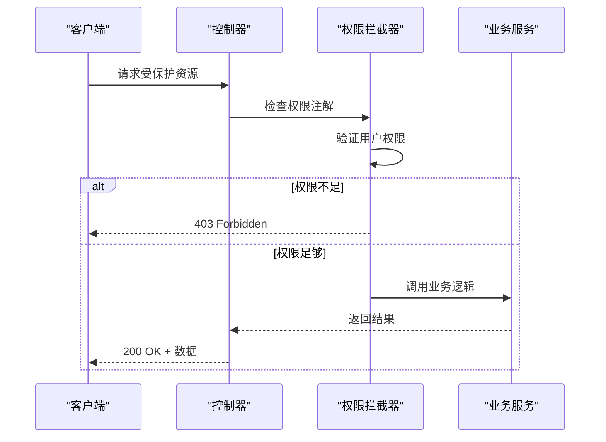

**图表来源**
- [RequirePermissions.java:1-13](file://backend-repo/src/main/java/com/zjcxph/imgapi/annotation/RequirePermissions.java#L1-L13)
- [UserController.java:60-93](file://backend-repo/src/main/java/com/zjcxph/imgapi/controller/UserController.java#L60-L93)

**章节来源**
- [Result.java:1-77](file://backend-repo/src/main/java/com/zjcxph/imgapi/common/Result.java#L1-L77)
- [RequirePermissions.java:1-13](file://backend-repo/src/main/java/com/zjcxph/imgapi/annotation/RequirePermissions.java#L1-L13)

## 架构概览

### RESTful API 设计原则

控制器层严格遵循RESTful设计原则，实现了资源导向的API架构：

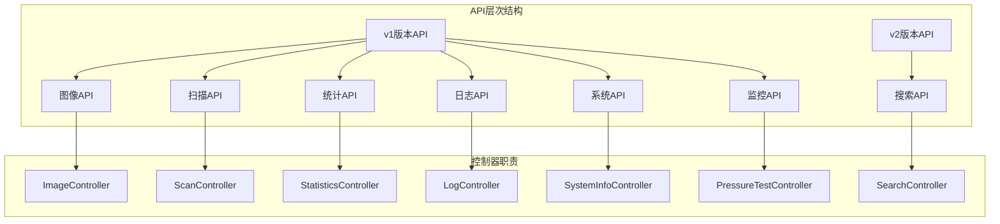

**图表来源**
- [ImageController.java:38-40](file://backend-repo/src/main/java/com/zjcxph/imgapi/controller/ImageController.java#L38-L40)
- [StatisticsController.java:31-33](file://backend-repo/src/main/java/com/zjcxph/imgapi/controller/StatisticsController.java#L31-L33)
- [SearchController.java:20-21](file://backend-repo/src/main/java/com/zjcxph/imgapi/controller/SearchController.java#L20-L21)

### 参数验证和安全控制

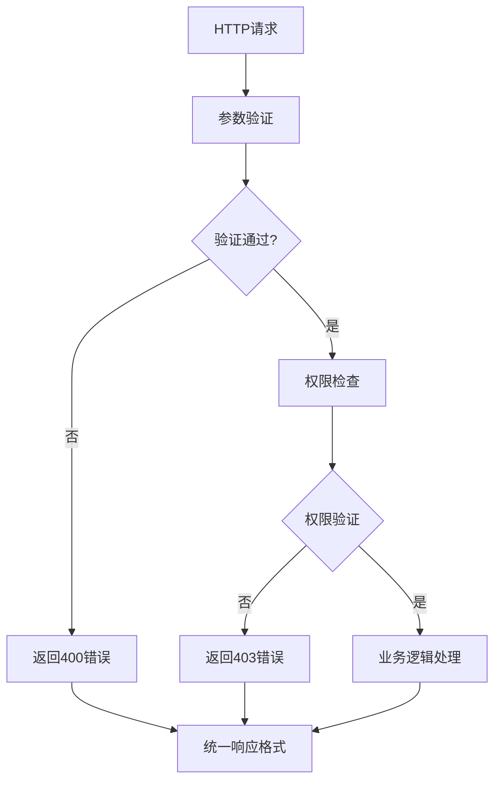

**图表来源**
- [ImageController.java:65-68](file://backend-repo/src/main/java/com/zjcxph/imgapi/controller/ImageController.java#L65-L68)
- [UserController.java:40-47](file://backend-repo/src/main/java/com/zjcxph/imgapi/controller/UserController.java#L40-L47)

**章节来源**
- [SwaggerConfig.java:1-41](file://backend-repo/src/main/java/com/zjcxph/imgapi/config/SwaggerConfig.java#L1-L41)

## 详细组件分析

### ImageController 图像管理控制器

负责病案图像的完整生命周期管理：

#### 核心功能模块

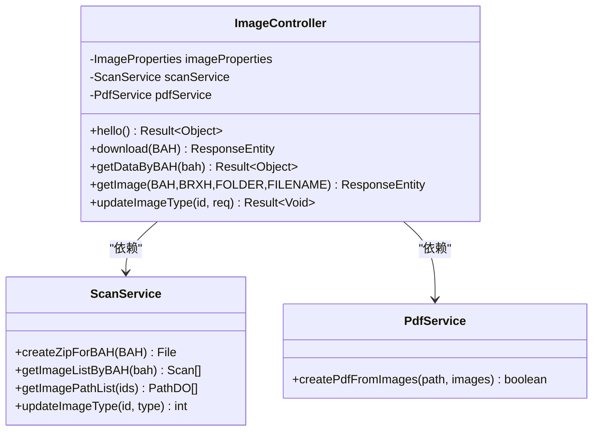

**图表来源**
- [ImageController.java:44-52](file://backend-repo/src/main/java/com/zjcxph/imgapi/controller/ImageController.java#L44-L52)

#### 请求处理流程

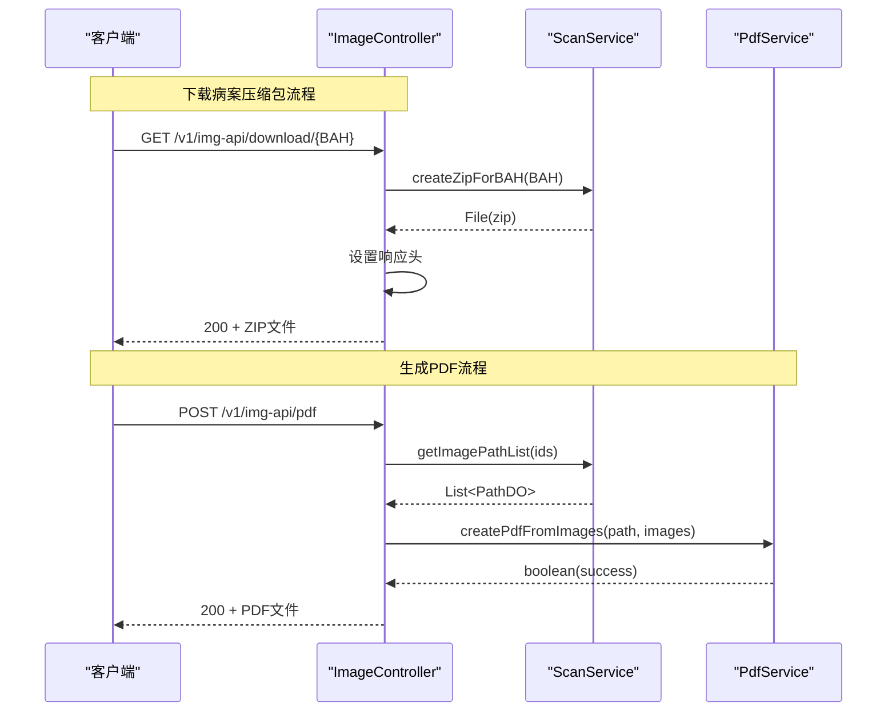

**图表来源**
- [ImageController.java:63-83](file://backend-repo/src/main/java/com/zjcxph/imgapi/controller/ImageController.java#L63-L83)
- [ImageController.java:85-166](file://backend-repo/src/main/java/com/zjcxph/imgapi/controller/ImageController.java#L85-L166)

**章节来源**
- [ImageController.java:1-283](file://backend-repo/src/main/java/com/zjcxph/imgapi/controller/ImageController.java#L1-L283)

### UserController 用户管理控制器

实现认证和授权管理的核心控制器：

#### 权限控制机制

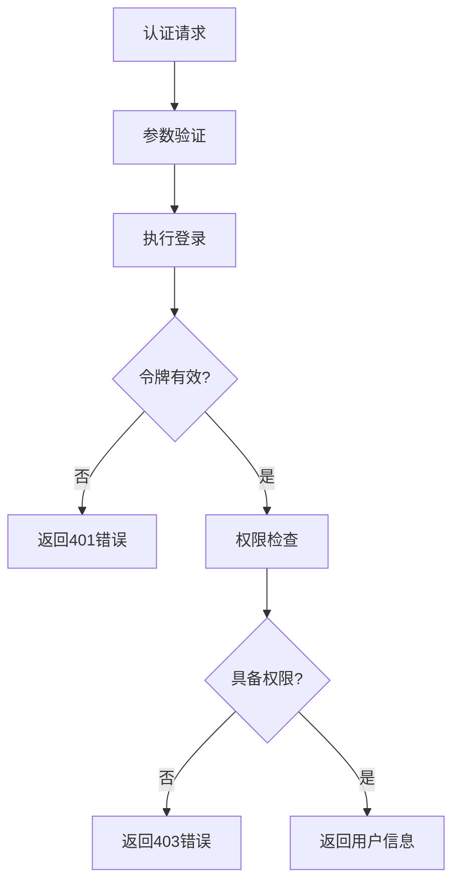

**图表来源**
- [UserController.java:38-57](file://backend-repo/src/main/java/com/zjcxph/imgapi/controller/UserController.java#L38-L57)
- [UserController.java:60-93](file://backend-repo/src/main/java/com/zjcxph/imgapi/controller/UserController.java#L60-L93)

#### 用户管理功能

| 操作 | 端点 | 权限要求 | 功能描述 |
|------|------|----------|----------|
| 登录 | POST /login | 无需 | 用户身份认证 |
| 当前用户 | GET /v1/auth/me | 已认证 | 获取当前用户信息 |
| 用户列表 | GET /v1/auth/users | user:manage | 查询所有用户 |
| 角色列表 | GET /v1/auth/roles | role:read | 查询所有角色 |
| 更新用户 | PUT /v1/auth/users/{id} | user:manage | 更新用户信息 |
| 禁用用户 | DELETE /v1/auth/users/{id} | user:manage | 禁用指定用户 |

**章节来源**
- [UserController.java:1-95](file://backend-repo/src/main/java/com/zjcxph/imgapi/controller/UserController.java#L1-L95)

### SearchController 搜索控制器

提供基于加密ID卡的病案号搜索功能：

#### 加密解密流程

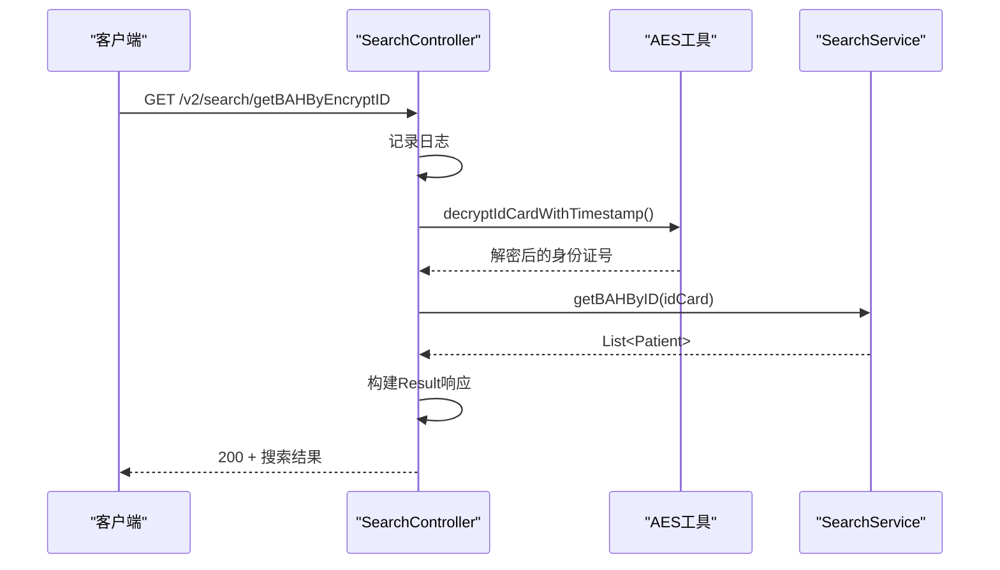

**图表来源**
- [SearchController.java:39-55](file://backend-repo/src/main/java/com/zjcxph/imgapi/controller/SearchController.java#L39-L55)

#### 搜索功能特性

| 搜索方式 | 端点 | 特性 |
|----------|------|------|
| 加密ID搜索 | GET /v2/search/getBAHByEncryptID | 支持时间戳验证 |
| 传统加密搜索 | GET /v2/search/getBAHByEncryptIDLegacy | 兼容旧版本 |
| 明文ID搜索 | GET /v2/search/getBAHByID/{idCard} | 直接搜索 |
| IP识别 | GET /v2/search/hello | 获取客户端IP |

**章节来源**
- [SearchController.java:1-92](file://backend-repo/src/main/java/com/zjcxph/imgapi/controller/SearchController.java#L1-L92)

### StatisticsController 统计分析控制器

提供全面的病案统计和分析功能：

#### 统计查询流程

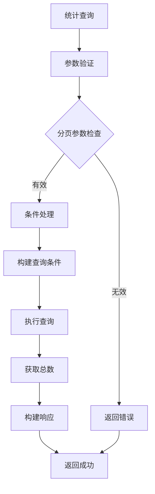

**图表来源**
- [StatisticsController.java:43-109](file://backend-repo/src/main/java/com/zjcxph/imgapi/controller/StatisticsController.java#L43-L109)

#### 统计功能分类

| 功能类别 | 端点 | 描述 |
|----------|------|------|
| 分页查询 | GET /v1/statistics-api | 支持关键字、类型、日期过滤 |
| 病案号统计 | GET /v1/statistics-api/bah/{bah} | 按病案号查询 |
| 日期统计 | GET /v1/statistics-api/date/{date} | 按日期查询 |
| 汇总统计 | GET /v1/statistics-api/bah-summary | 病案号汇总 |
| 日期汇总 | GET /v1/statistics-api/date-summary | 日期汇总 |
| 条件统计 | GET /v1/statistics-api/date-summary/condition | 条件日期统计 |
| 总体统计 | GET /v1/statistics-api/summary | 总体统计信息 |
| 类型统计 | GET /v1/statistics-api/type-summary | 按类型统计 |
| 仪表板 | GET /v1/statistics-api/dashboard | 综合统计面板 |

**章节来源**
- [StatisticsController.java:1-281](file://backend-repo/src/main/java/com/zjcxph/imgapi/controller/StatisticsController.java#L1-L281)

### LogController 日志管理控制器

实现系统日志的查询、清理和导出功能：

#### 日志清理流程

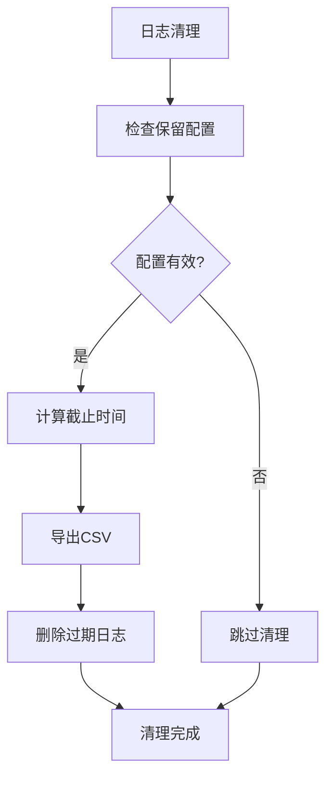

**图表来源**
- [LogController.java:94-106](file://backend-repo/src/main/java/com/zjcxph/imgapi/controller/LogController.java#L94-L106)

#### 日志管理功能

| 功能 | 端点 | 描述 |
|------|------|------|
| 单条日志 | GET /v1/logs-api/{id} | 根据ID查询 |
| 日志列表 | GET /v1/logs-api/ | 分页查询所有日志 |
| IP过滤 | GET /v1/logs-api/ip/{ip} | 按客户端IP过滤 |
| URI过滤 | GET /v1/logs-api/uri | 按请求URI过滤 |
| 清理过期 | POST /v1/logs-api/retention/cleanup | 清理过期日志 |
| 导出CSV | GET /v1/logs-api/retention/export | 导出保留日志 |
| 搜索日志 | GET /v1/logs-api/search | 多条件搜索 |

**章节来源**
- [LogController.java:1-245](file://backend-repo/src/main/java/com/zjcxph/imgapi/controller/LogController.java#L1-L245)

### PressureTestController 压力测试控制器

提供系统性能测试和监控功能：

#### 压力测试流程

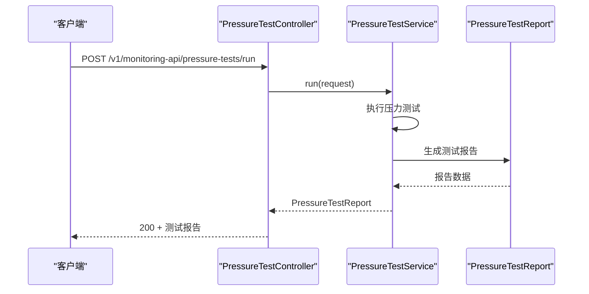

**图表来源**
- [PressureTestController.java:35-41](file://backend-repo/src/main/java/com/zjcxph/imgapi/controller/PressureTestController.java#L35-L41)

**章节来源**
- [PressureTestController.java:1-73](file://backend-repo/src/main/java/com/zjcxph/imgapi/controller/PressureTestController.java#L1-L73)

### SystemInfoController 系统信息控制器

提供系统健康检查和监控信息：

#### 系统监控架构

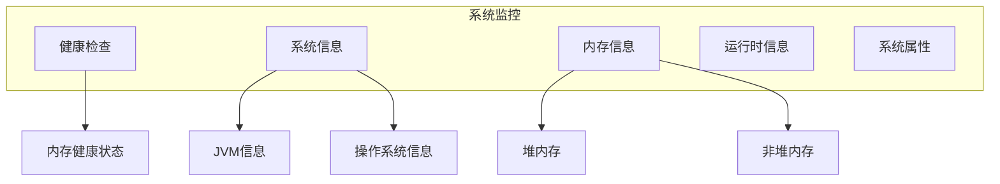

**图表来源**
- [SystemInfoController.java:120-144](file://backend-repo/src/main/java/com/zjcxph/imgapi/controller/SystemInfoController.java#L120-L144)

**章节来源**
- [SystemInfoController.java:1-236](file://backend-repo/src/main/java/com/zjcxph/imgapi/controller/SystemInfoController.java#L1-L236)

### ScanController 扫描记录控制器

管理病案扫描记录的增删改查操作：

#### 批量下载流程

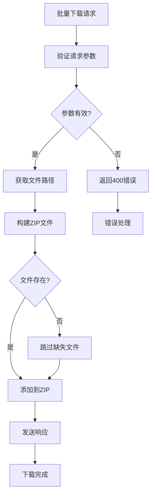

**图表来源**
- [ScanController.java:256-281](file://backend-repo/src/main/java/com/zjcxph/imgapi/controller/ScanController.java#L256-L281)

**章节来源**
- [ScanController.java:1-333](file://backend-repo/src/main/java/com/zjcxph/imgapi/controller/ScanController.java#L1-L333)

### DbController 数据库操作控制器

数据库管理接口预留位置：

虽然当前版本主要作为占位符，但已为未来的数据库管理功能做好了架构准备。

**章节来源**
- [DbController.java:1-40](file://backend-repo/src/main/java/com/zjcxph/imgapi/controller/DbController.java#L1-L40)

## 依赖分析

### 外部依赖关系

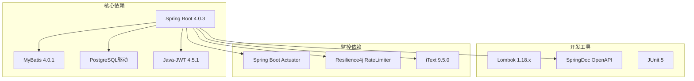

**图表来源**
- [pom.xml:27-114](file://backend-repo/pom.xml#L27-L114)

### 内部组件依赖

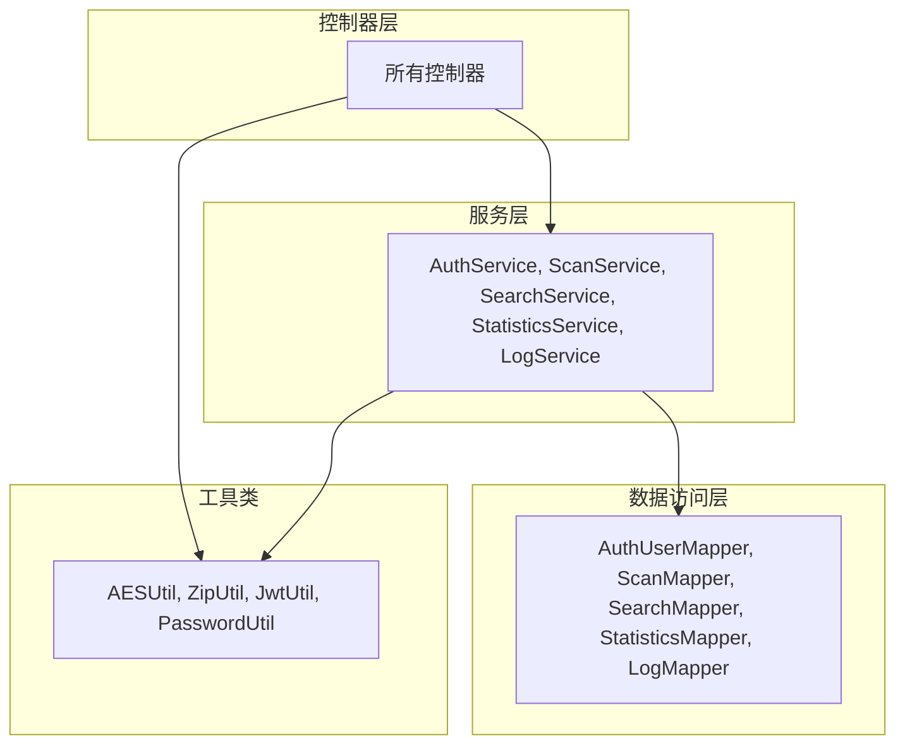

**图表来源**
- [UserController.java:11-11](file://backend-repo/src/main/java/com/zjcxph/imgapi/controller/UserController.java#L11-L11)
- [ImageController.java:8-10](file://backend-repo/src/main/java/com/zjcxph/imgapi/controller/ImageController.java#L8-L10)

**章节来源**
- [pom.xml:1-136](file://backend-repo/pom.xml#L1-L136)

## 性能考虑

### 缓存策略

- **图片缓存**：图像控制器设置合理的缓存头，减少重复请求
- **分页优化**：统计和日志查询实现高效的分页机制
- **批量处理**：扫描记录支持批量下载，提高传输效率

### 并发处理

- **线程安全**：所有控制器都是无状态的，天然支持并发访问
- **连接池**：数据库连接使用Spring Boot自动配置的连接池
- **异步处理**：大文件下载使用流式响应，避免内存溢出

### 监控指标

- **健康检查**：系统控制器提供完整的健康状态监控
- **性能指标**：集成Spring Boot Actuator收集应用指标
- **日志监控**：统一的日志格式便于问题追踪

## 故障排除指南

### 常见错误处理

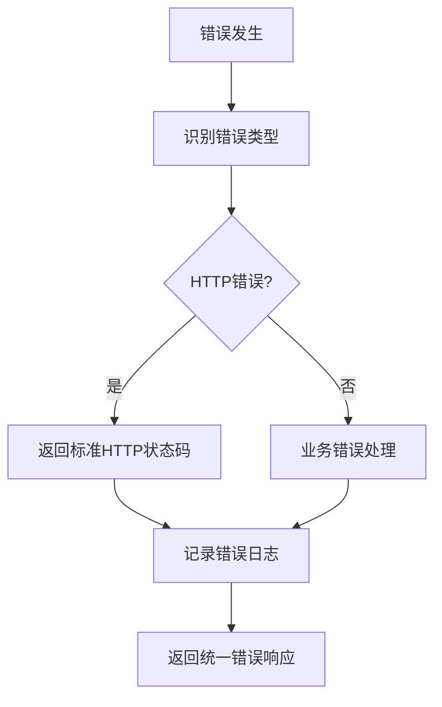

### 错误响应格式

所有控制器都遵循统一的错误响应格式：

| 字段 | 类型 | 描述 |
|------|------|------|
| code | Integer | HTTP状态码或业务错误码 |
| timestamp | LocalDateTime | 错误发生时间 |
| message | String | 错误描述信息 |
| data | T | 错误相关数据（可选） |

### 调试建议

1. **启用详细日志**：在开发环境中启用DEBUG级别日志
2. **使用Swagger UI**：通过交互式界面测试API
3. **单元测试**：运行现有的测试套件验证功能
4. **性能监控**：使用Actuator端点监控应用状态

**章节来源**
- [ControllerIntegrationTest.java:1-245](file://backend-repo/src/test/java/com/zjcxph/imgapi/ControllerIntegrationTest.java#L1-L245)
- [SearchControllerTest.java:1-84](file://backend-repo/src/test/java/com/zjcxph/imgapi/SearchControllerTest.java#L1-L84)

## 结论

MRR项目的控制器层架构展现了现代Java Web应用的最佳实践。通过清晰的职责分离、统一的响应格式和完善的错误处理机制，实现了高内聚、低耦合的API设计。

架构的主要优势包括：

1. **一致性**：统一的响应格式和错误处理确保了API的一致性体验
2. **可扩展性**：模块化的控制器设计便于功能扩展和维护
3. **安全性**：基于JWT的认证和基于权限的访问控制提供了完善的安全保障
4. **可观测性**：集成的监控和日志系统便于运维和问题排查
5. **测试友好**：完整的测试覆盖和Mock支持便于持续集成

未来可以考虑的改进方向：
- 实现更细粒度的权限控制
- 添加API版本管理
- 增强缓存策略
- 优化大数据量场景的性能

## 附录

### API文档生成

项目使用SpringDoc OpenAPI自动生成API文档，支持Swagger UI和ReDoc格式。

### 单元测试编写指南

1. **集成测试**：使用TestRestTemplate进行端到端测试
2. **单元测试**：使用MockMvc对单个控制器进行测试
3. **模拟对象**：使用Mockito创建服务层的模拟对象
4. **断言验证**：验证HTTP状态码、响应格式和业务逻辑

### 部署注意事项

1. **环境配置**：确保各环境的配置文件正确设置
2. **数据库连接**：验证数据库连接池配置
3. **安全配置**：检查JWT密钥和权限配置
4. **监控配置**：启用必要的监控和日志配置