# 搜索控制器

<cite>
**本文档引用的文件**
- [SearchController.java](file://backend-repo/src/main/java/com/zjcxph/imgapi/controller/SearchController.java)
- [SearchService.java](file://backend-repo/src/main/java/com/zjcxph/imgapi/service/SearchService.java)
- [SearchServiceImpl.java](file://backend-repo/src/main/java/com/zjcxph/imgapi/service/impl/SearchServiceImpl.java)
- [SearchMapper.java](file://backend-repo/src/main/java/com/zjcxph/imgapi/mapper/SearchMapper.java)
- [Patient.java](file://backend-repo/src/main/java/com/zjcxph/imgapi/entity/Patient.java)
- [AESUtil.java](file://backend-repo/src/main/java/com/zjcxph/imgapi/utils/AESUtil.java)
- [application.properties](file://backend-repo/src/main/resources/application.properties)
- [schema-postgresql.sql](file://backend-repo/src/main/resources/schema-postgresql.sql)
- [API_CONTRACT.md](file://backend-repo/API_CONTRACT.md)
- [SearchControllerTest.java](file://backend-repo/src/test/java/com/zjcxph/imgapi/SearchControllerTest.java)
</cite>

## 目录
1. [简介](#简介)
2. [项目结构](#项目结构)
3. [核心组件](#核心组件)
4. [架构概览](#架构概览)
5. [详细组件分析](#详细组件分析)
6. [依赖关系分析](#依赖关系分析)
7. [性能考虑](#性能考虑)
8. [故障排除指南](#故障排除指南)
9. [结论](#结论)
10. [附录](#附录)

## 简介

SearchController 是医疗记录管理系统中的核心搜索组件，负责提供多种搜索功能，包括基于病案号的搜索、基于患者信息的检索以及支持加密身份信息的安全搜索接口。该控制器实现了RESTful API设计，采用分层架构模式，确保了代码的可维护性和扩展性。

该控制器主要服务于医院信息系统中的病案管理需求，为医生、护士和其他医疗工作人员提供快速准确的患者信息检索能力。系统支持明文搜索和加密搜索两种模式，以满足不同安全级别和兼容性的需求。

## 项目结构

SearchController 属于后端服务层的一部分，遵循Spring Boot的标准目录结构：

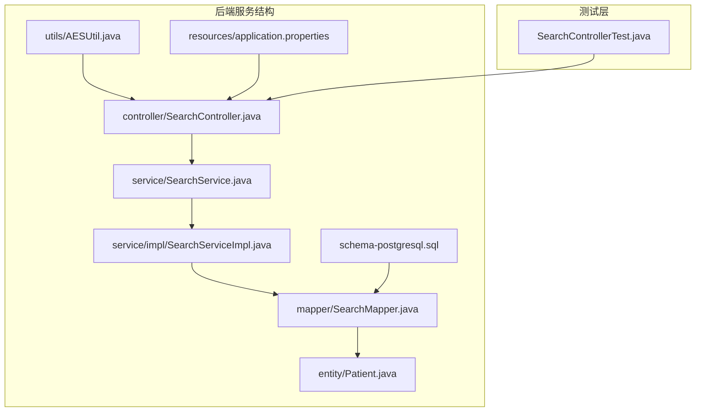

**图表来源**
- [SearchController.java:1-92](file://backend-repo/src/main/java/com/zjcxph/imgapi/controller/SearchController.java#L1-L92)
- [SearchService.java:1-11](file://backend-repo/src/main/java/com/zjcxph/imgapi/service/SearchService.java#L1-L11)
- [SearchServiceImpl.java:1-26](file://backend-repo/src/main/java/com/zjcxph/imgapi/service/impl/SearchServiceImpl.java#L1-L26)

**章节来源**
- [SearchController.java:1-92](file://backend-repo/src/main/java/com/zjcxph/imgapi/controller/SearchController.java#L1-L92)
- [API_CONTRACT.md:24-28](file://backend-repo/API_CONTRACT.md#L24-L28)

## 核心组件

SearchController 作为REST控制器，提供了三个主要的搜索接口：

### 主要接口概述

| 接口名称 | HTTP方法 | 路径 | 功能描述 |
|---------|---------|------|----------|
| getBAHByEncryptID | GET | `/v2/search/getBAHByEncryptID` | 使用新版本加密算法搜索病案号 |
| getBAHByEncryptIDLegacy | GET | `/v2/search/getBAHByEncryptIDLegacy` | 使用传统加密算法搜索病案号 |
| getBAHByID | GET | `/v2/search/getBAHByID/{idCard}` | 直接使用明文身份证号搜索 |

### 数据模型

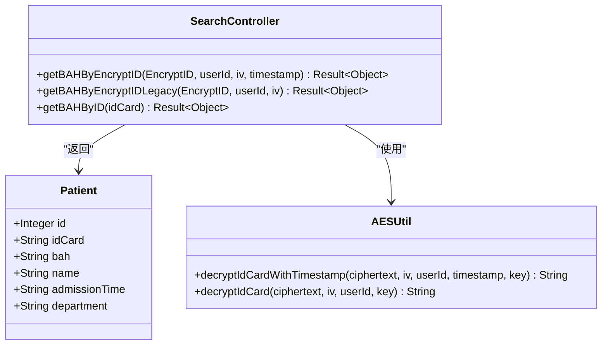

**图表来源**
- [Patient.java:1-103](file://backend-repo/src/main/java/com/zjcxph/imgapi/entity/Patient.java#L1-L103)
- [SearchController.java:39-79](file://backend-repo/src/main/java/com/zjcxph/imgapi/controller/SearchController.java#L39-L79)
- [AESUtil.java:19-233](file://backend-repo/src/main/java/com/zjcxph/imgapi/utils/AESUtil.java#L19-L233)

**章节来源**
- [Patient.java:1-103](file://backend-repo/src/main/java/com/zjcxph/imgapi/entity/Patient.java#L1-L103)
- [SearchController.java:39-79](file://backend-repo/src/main/java/com/zjcxph/imgapi/controller/SearchController.java#L39-L79)

## 架构概览

SearchController 采用了经典的MVC架构模式，实现了清晰的职责分离：

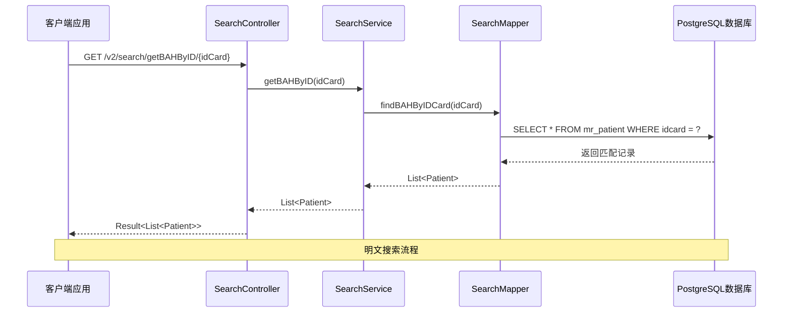

**图表来源**
- [SearchController.java:74-79](file://backend-repo/src/main/java/com/zjcxph/imgapi/controller/SearchController.java#L74-L79)
- [SearchServiceImpl.java:21-24](file://backend-repo/src/main/java/com/zjcxph/imgapi/service/impl/SearchServiceImpl.java#L21-L24)
- [SearchMapper.java:14](file://backend-repo/src/main/java/com/zjcxph/imgapi/mapper/SearchMapper.java#L14)

### 加密搜索流程

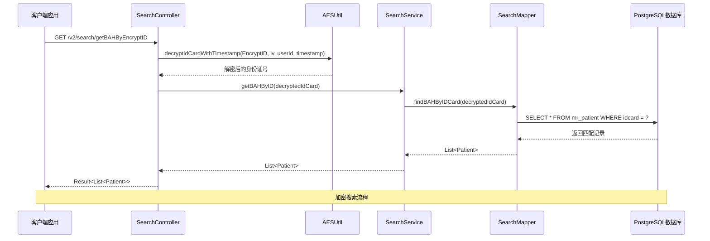

**图表来源**
- [SearchController.java:39-55](file://backend-repo/src/main/java/com/zjcxph/imgapi/controller/SearchController.java#L39-L55)
- [AESUtil.java:121-150](file://backend-repo/src/main/java/com/zjcxph/imgapi/utils/AESUtil.java#L121-L150)

**章节来源**
- [SearchController.java:39-79](file://backend-repo/src/main/java/com/zjcxph/imgapi/controller/SearchController.java#L39-L79)
- [AESUtil.java:19-233](file://backend-repo/src/main/java/com/zjcxph/imgapi/utils/AESUtil.java#L19-L233)

## 详细组件分析

### SearchController 分析

SearchController 实现了三个核心搜索接口，每个接口都有其特定的使用场景和安全要求。

#### 明文搜索接口

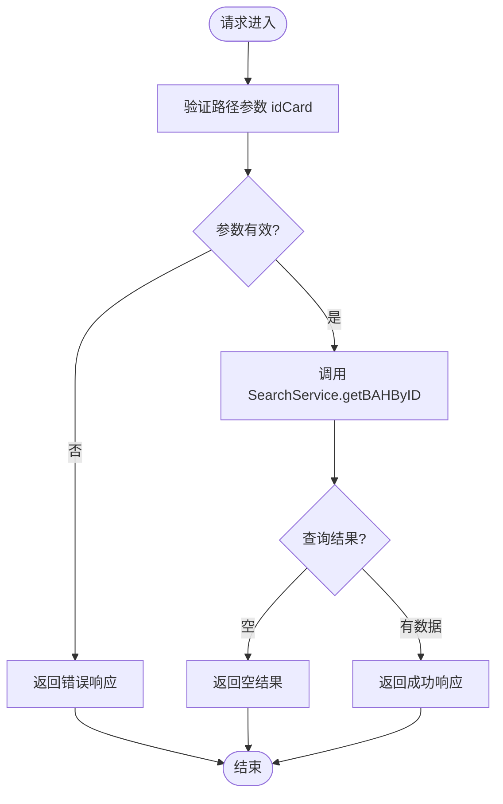

**图表来源**
- [SearchController.java:74-79](file://backend-repo/src/main/java/com/zjcxph/imgapi/controller/SearchController.java#L74-L79)

#### 加密搜索接口

加密搜索接口提供了两套不同的实现，以满足不同版本的兼容性需求：

| 方法 | 参数 | 版本 | 安全特性 |
|------|------|------|----------|
| getBAHByEncryptID | EncryptID, userId, iv, timestamp | 新版本 | 时间戳防重放攻击 |
| getBAHByEncryptIDLegacy | EncryptID, userId, iv | 传统版本 | 基础加密保护 |

**章节来源**
- [SearchController.java:39-79](file://backend-repo/src/main/java/com/zjcxph/imgapi/controller/SearchController.java#L39-L79)

### SearchService 和 SearchServiceImpl 分析

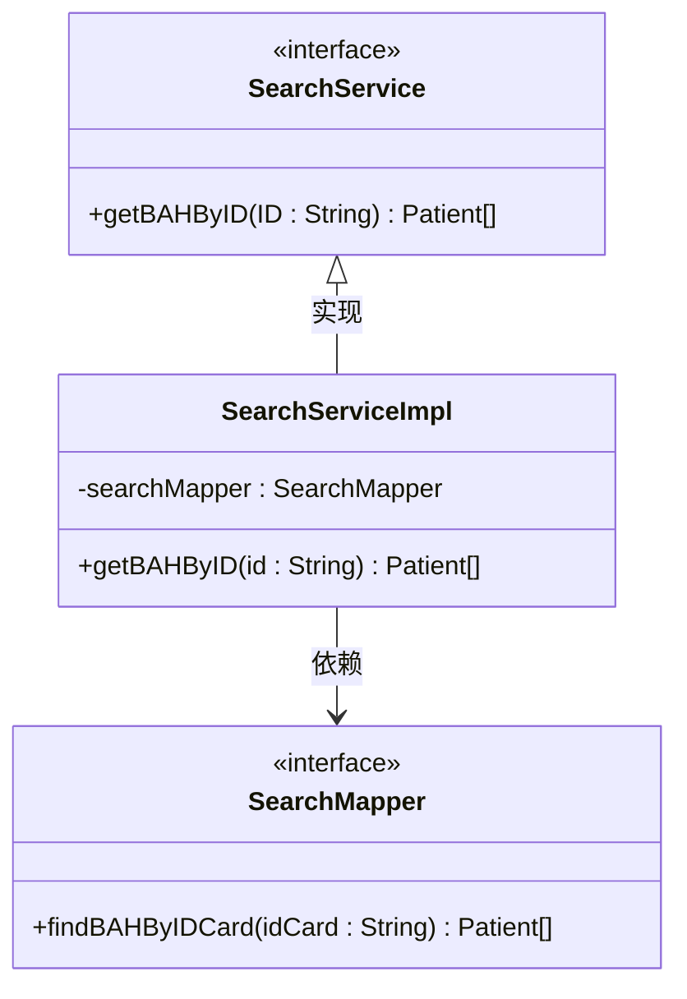

**图表来源**
- [SearchService.java:7-10](file://backend-repo/src/main/java/com/zjcxph/imgapi/service/SearchService.java#L7-L10)
- [SearchServiceImpl.java:11-25](file://backend-repo/src/main/java/com/zjcxph/imgapi/service/impl/SearchServiceImpl.java#L11-L25)
- [SearchMapper.java:9-15](file://backend-repo/src/main/java/com/zjcxph/imgapi/mapper/SearchMapper.java#L9-L15)

**章节来源**
- [SearchService.java:1-11](file://backend-repo/src/main/java/com/zjcxph/imgapi/service/SearchService.java#L1-L11)
- [SearchServiceImpl.java:1-26](file://backend-repo/src/main/java/com/zjcxph/imgapi/service/impl/SearchServiceImpl.java#L1-L26)
- [SearchMapper.java:1-16](file://backend-repo/src/main/java/com/zjcxph/imgapi/mapper/SearchMapper.java#L1-L16)

### AESUtil 工具类分析

AESUtil 提供了完整的加密解密功能，支持两种不同的密钥生成策略：

#### 密钥生成策略

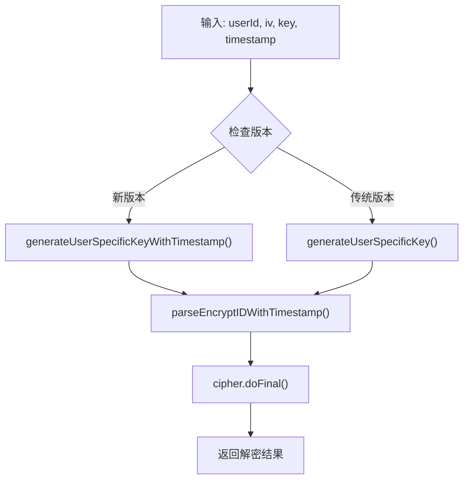

**图表来源**
- [AESUtil.java:33-60](file://backend-repo/src/main/java/com/zjcxph/imgapi/utils/AESUtil.java#L33-L60)
- [AESUtil.java:121-150](file://backend-repo/src/main/java/com/zjcxph/imgapi/utils/AESUtil.java#L121-L150)

**章节来源**
- [AESUtil.java:19-233](file://backend-repo/src/main/java/com/zjcxph/imgapi/utils/AESUtil.java#L19-L233)

## 依赖关系分析

### 数据库索引策略

系统针对搜索性能进行了专门的数据库优化：

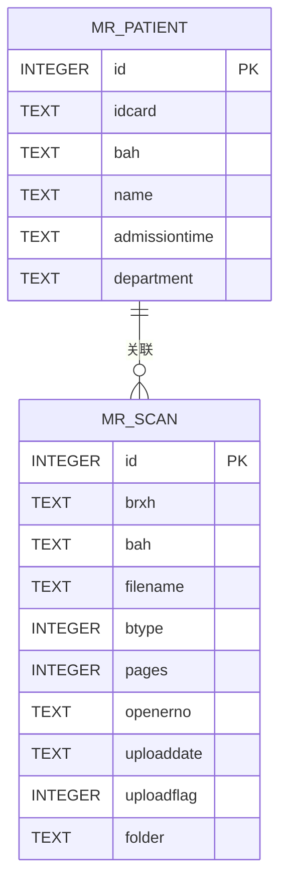

**图表来源**
- [schema-postgresql.sql:25-32](file://backend-repo/src/main/resources/schema-postgresql.sql#L25-L32)
- [schema-postgresql.sql:3-14](file://backend-repo/src/main/resources/schema-postgresql.sql#L3-L14)

### 外部依赖关系

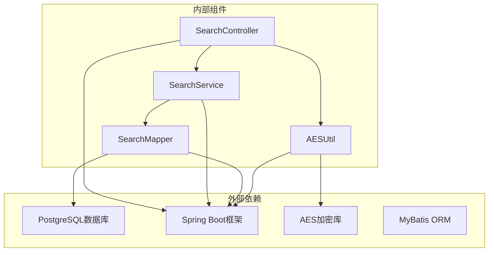

**图表来源**
- [SearchController.java:1-15](file://backend-repo/src/main/java/com/zjcxph/imgapi/controller/SearchController.java#L1-L15)
- [SearchServiceImpl.java:1-9](file://backend-repo/src/main/java/com/zjcxph/imgapi/service/impl/SearchServiceImpl.java#L1-L9)
- [AESUtil.java:1-14](file://backend-repo/src/main/java/com/zjcxph/imgapi/utils/AESUtil.java#L1-L14)

**章节来源**
- [schema-postgresql.sql:75-88](file://backend-repo/src/main/resources/schema-postgresql.sql#L75-L88)
- [application.properties:10-22](file://backend-repo/src/main/resources/application.properties#L10-L22)

## 性能考虑

### 数据库性能优化

系统在数据库层面实施了多项性能优化措施：

1. **索引策略**
   - 在 `mr_patient.idcard` 上建立了唯一索引，确保身份证号查询的高效性
   - 在 `mr_scan.bah` 和 `mr_scan.brxh` 上建立了索引，支持病案号和病人序号的快速检索

2. **连接池配置**
   - 最大连接数设置为20，最小空闲连接5个
   - 连接超时时间为30秒，空闲超时为300秒

3. **查询优化**
   - 使用精确匹配而非模糊查询，避免LIKE操作符的性能损耗
   - 采用预编译语句防止SQL注入同时提升执行效率

### 缓存策略

虽然当前实现未包含缓存层，但可以考虑以下优化方案：

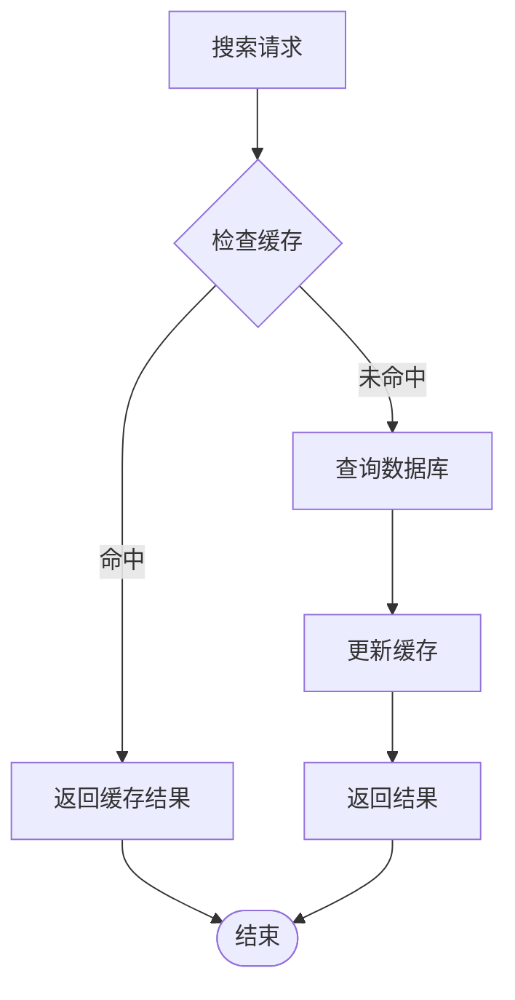

### 并发处理

系统采用Spring Boot的异步处理机制，能够有效处理高并发搜索请求：

- **线程池配置**：默认使用Spring Boot的内置线程池
- **连接池管理**：HikariCP提供高效的数据库连接管理
- **请求限流**：可通过Spring Cloud Gateway实现API限流

## 故障排除指南

### 常见问题及解决方案

#### 加密解密失败

**问题症状**：`decrypt failed: ...` 错误响应

**可能原因**：
1. 密钥配置错误
2. 加密数据格式不正确
3. 时间戳过期（新版本）

**解决步骤**：
1. 验证 `aes.secret.key` 配置项
2. 检查加密数据的JSON格式
3. 确认时间戳的有效性

#### 数据库连接问题

**问题症状**：查询超时或连接失败

**可能原因**：
1. 数据库连接池耗尽
2. 网络连接不稳定
3. SQL查询过于复杂

**解决步骤**：
1. 检查数据库连接配置
2. 监控连接池使用情况
3. 优化SQL查询语句

#### 参数验证错误

**问题症状**：HTTP 400 Bad Request

**可能原因**：
1. 缺少必需的查询参数
2. 参数格式不正确
3. 身份验证失败

**解决步骤**：
1. 检查API调用参数
2. 验证参数类型和格式
3. 确认权限配置

**章节来源**
- [SearchController.java:45-54](file://backend-repo/src/main/java/com/zjcxph/imgapi/controller/SearchController.java#L45-L54)
- [SearchController.java:62-71](file://backend-repo/src/main/java/com/zjcxph/imgapi/controller/SearchController.java#L62-L71)

### 日志分析

系统提供了详细的日志记录机制：

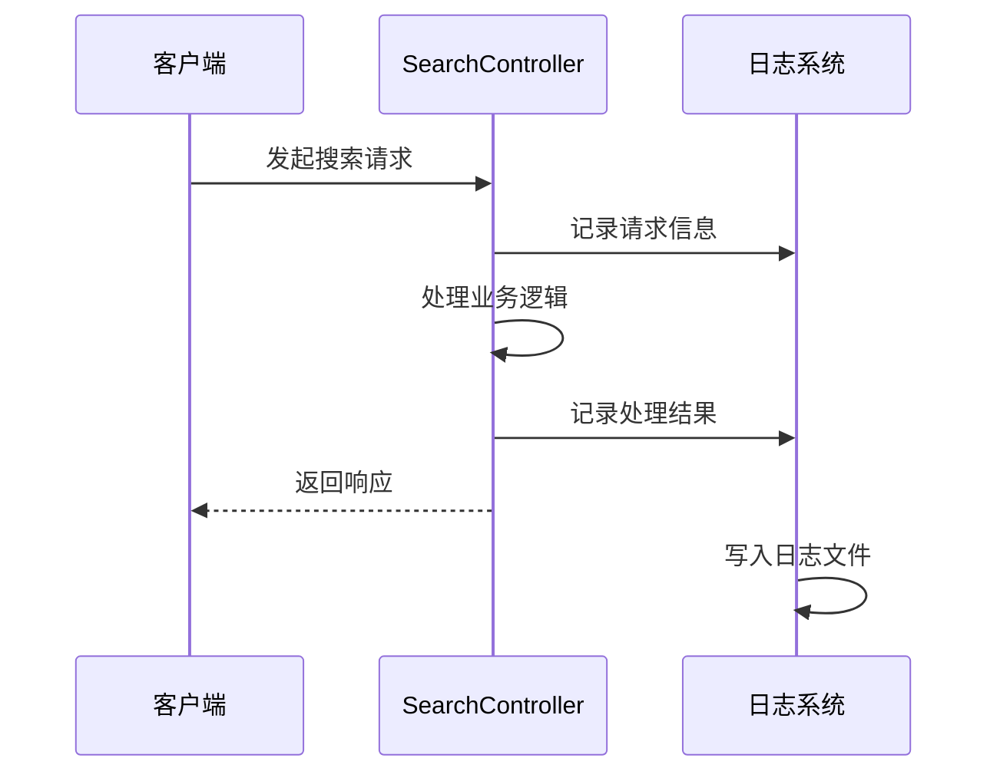

**图表来源**
- [SearchController.java:46-50](file://backend-repo/src/main/java/com/zjcxph/imgapi/controller/SearchController.java#L46-L50)

**章节来源**
- [SearchController.java:23-28](file://backend-repo/src/main/java/com/zjcxph/imgapi/controller/SearchController.java#L23-L28)

## 结论

SearchController 作为一个成熟的搜索组件，展现了良好的软件工程实践：

### 设计优势

1. **清晰的分层架构**：控制器、服务层、数据访问层职责明确
2. **灵活的安全机制**：支持明文和加密两种搜索模式
3. **完善的异常处理**：提供友好的错误响应和日志记录
4. **可扩展的设计**：易于添加新的搜索功能和优化现有功能

### 改进建议

1. **增加分页支持**：为大量搜索结果提供分页功能
2. **实现高级筛选**：支持按时间范围、科室等条件筛选
3. **添加缓存机制**：提升高频查询的响应速度
4. **增强搜索算法**：支持模糊匹配和全文搜索

该组件为整个医疗记录管理系统提供了坚实的基础，能够满足当前的业务需求，并为未来的功能扩展奠定了良好的基础。

## 附录

### API 使用示例

#### 明文搜索示例
```
GET /v2/search/getBAHByID/123456789012345678
```

#### 加密搜索示例
```
GET /v2/search/getBAHByEncryptID?EncryptID=...&userId=...&iv=...&timestamp=...
```

#### 传统加密搜索示例
```
GET /v2/search/getBAHByEncryptIDLegacy?EncryptID=...&userId=...&iv=...
```

### 配置参数说明

| 参数名 | 类型 | 必需 | 默认值 | 描述 |
|--------|------|------|--------|------|
| aes.secret.key | String | 是 | 无 | AES加密密钥 |
| server.port | Integer | 否 | 18045 | 服务器端口号 |
| SPRING_DATASOURCE_URL | String | 否 | jdbc:postgresql://localhost:5432/imgapi | 数据库连接URL |

**章节来源**
- [application.properties:47-49](file://backend-repo/src/main/resources/application.properties#L47-L49)
- [API_CONTRACT.md:24-28](file://backend-repo/API_CONTRACT.md#L24-L28)