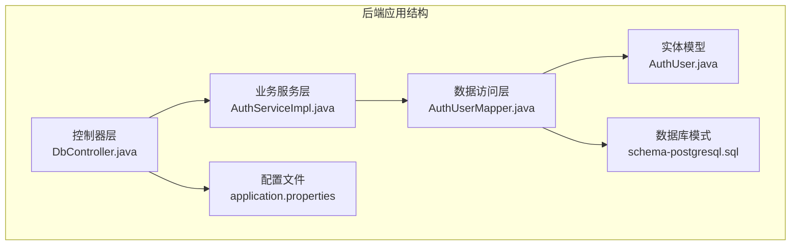
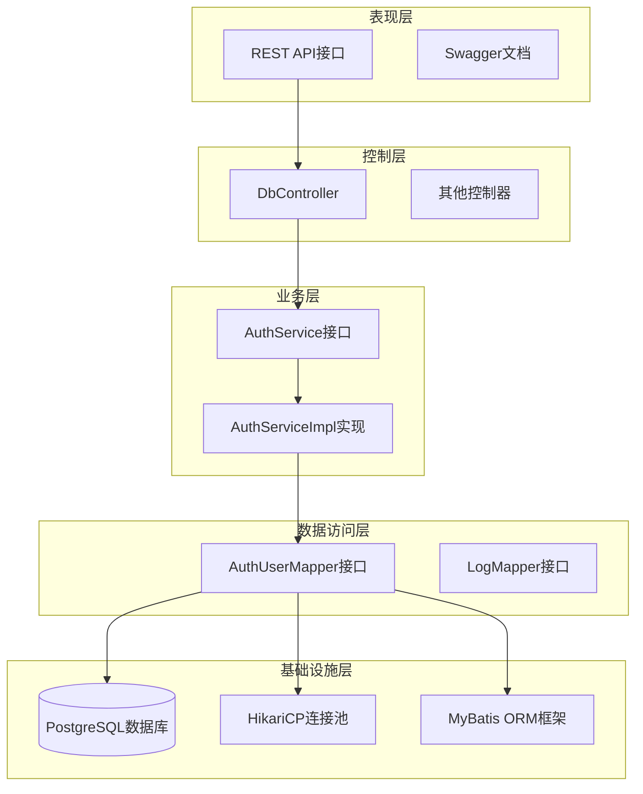
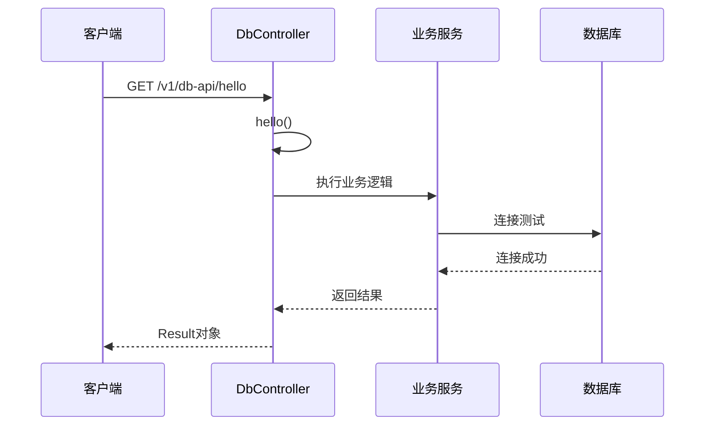
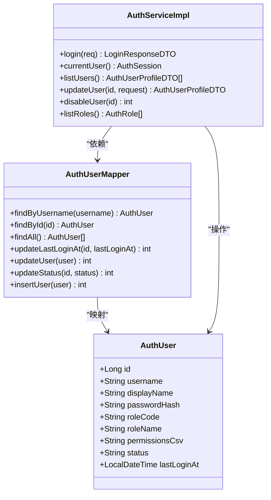
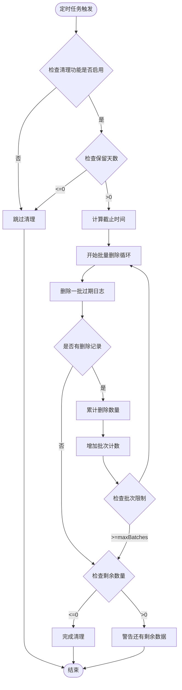
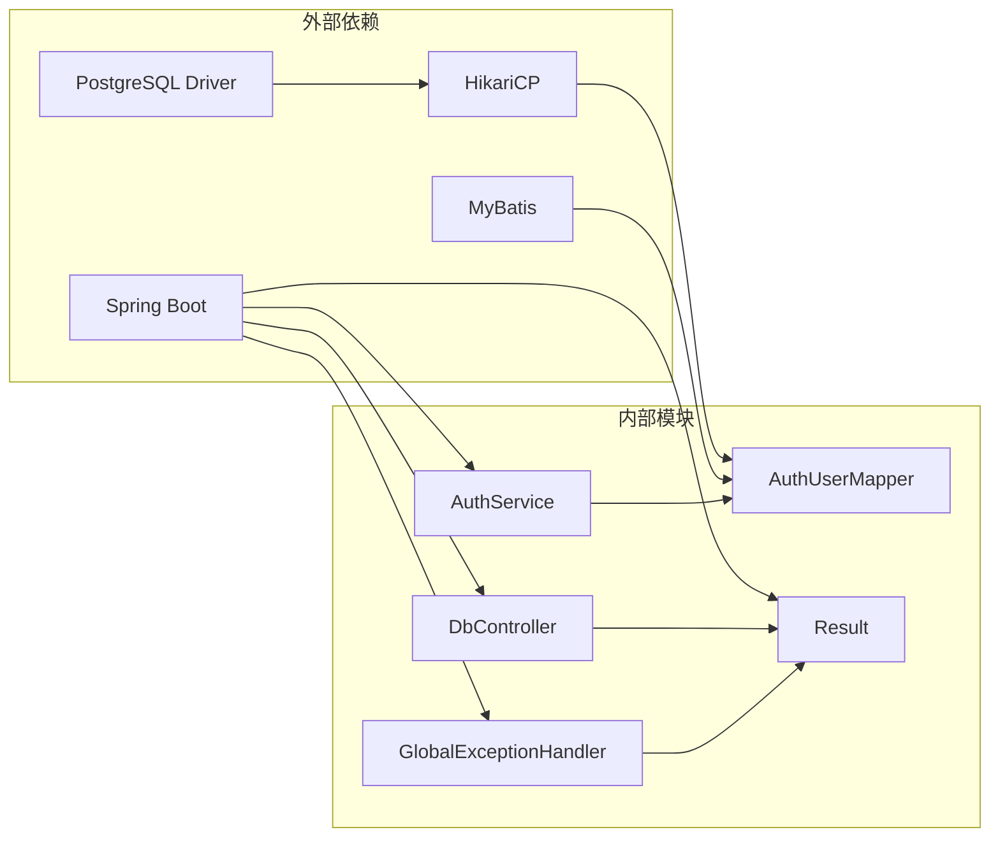

# 数据库操作控制器

<cite>
**本文档引用的文件**
- [DbController.java](file://backend-repo/src/main/java/com/zjcxph/imgapi/controller/DbController.java)
- [application.properties](file://backend-repo/src/main/resources/application.properties)
- [application-local.example.properties](file://backend-repo/src/main/resources/application-local.example.properties)
- [schema-postgresql.sql](file://backend-repo/src/main/resources/schema-postgresql.sql)
- [LogRetentionCleaner.java](file://backend-repo/src/main/java/com/zjcxph/imgapi/scheduler/LogRetentionCleaner.java)
- [AuthUserMapper.java](file://backend-repo/src/main/java/com/zjcxph/imgapi/mapper/AuthUserMapper.java)
- [AuthServiceImpl.java](file://backend-repo/src/main/java/com/zjcxph/imgapi/service/impl/AuthServiceImpl.java)
- [BusinessException.java](file://backend-repo/src/main/java/com/zjcxph/imgapi/exception/BusinessException.java)
- [GlobalExceptionHandler.java](file://backend-repo/src/main/java/com/zjcxph/imgapi/handler/GlobalExceptionHandler.java)
- [Result.java](file://backend-repo/src/main/java/com/zjcxph/imgapi/common/Result.java)
</cite>

## 目录
1. [简介](#简介)
2. [项目结构](#项目结构)
3. [核心组件](#核心组件)
4. [架构概览](#架构概览)
5. [详细组件分析](#详细组件分析)
6. [依赖分析](#依赖分析)
7. [性能考虑](#性能考虑)
8. [故障排除指南](#故障排除指南)
9. [结论](#结论)

## 简介

DbController 是本项目中的数据库管理接口控制器，负责提供数据库相关的RESTful API服务。该控制器采用Spring Boot框架构建，遵循RESTful设计原则，为数据库连接测试、表结构查询、数据导入导出和数据库维护等功能提供统一的接口入口。

项目基于PostgreSQL数据库，使用MyBatis作为ORM框架，通过HikariCP实现高效的数据库连接池管理。系统集成了完整的异常处理机制和全局响应封装，确保API调用的一致性和可靠性。

## 项目结构

后端项目采用标准的Maven目录结构，DbController位于controller包中，与业务逻辑、数据访问层和配置文件分离：

**图表来源**
- [DbController.java:1-40](file://backend-repo/src/main/java/com/zjcxph/imgapi/controller/DbController.java#L1-L40)
- [application.properties:1-49](file://backend-repo/src/main/resources/application.properties#L1-L49)

**章节来源**
- [DbController.java:1-40](file://backend-repo/src/main/java/com/zjcxph/imgapi/controller/DbController.java#L1-L40)
- [application.properties:1-49](file://backend-repo/src/main/resources/application.properties#L1-L49)

## 核心组件

### DbController 控制器

DbController是数据库管理的核心控制器，目前包含基础的健康检查接口和预留的数据库管理接口位置。控制器采用注解驱动的方式，提供了简洁的RESTful API定义。

**主要特性：**
- 使用@RestController注解提供RESTful接口
- 通过@RequestMapping定义统一的API前缀
- 集成Swagger标签描述接口用途
- 返回标准化的Result响应格式

### 数据库配置管理

系统通过application.properties文件集中管理数据库连接配置，支持环境变量覆盖和连接池优化：

**核心配置项：**
- 数据源URL、用户名、密码和驱动类名
- HikariCP连接池参数（最大池大小、最小空闲连接、连接超时等）
- SQL初始化模式和模式位置
- 日志级别和文件配置

### 异常处理机制

项目实现了全局异常处理机制，通过GlobalExceptionHandler统一处理各种异常情况：

**异常处理流程：**
- BusinessException：业务异常，返回自定义状态码
- ConstraintViolationException：参数验证异常，返回400状态码
- IllegalArgumentException：非法参数异常，返回400状态码
- IllegalStateException：非法状态异常，返回403状态码
- Exception：未捕获的系统异常，返回500状态码

**章节来源**
- [DbController.java:8-16](file://backend-repo/src/main/java/com/zjcxph/imgapi/controller/DbController.java#L8-L16)
- [application.properties:10-22](file://backend-repo/src/main/resources/application.properties#L10-L22)
- [GlobalExceptionHandler.java:19-60](file://backend-repo/src/main/java/com/zjcxph/imgapi/handler/GlobalExceptionHandler.java#L19-L60)

## 架构概览

系统采用分层架构设计，各层职责明确，便于维护和扩展：

**图表来源**
- [DbController.java:12-38](file://backend-repo/src/main/java/com/zjcxph/imgapi/controller/DbController.java#L12-L38)
- [AuthServiceImpl.java:25-34](file://backend-repo/src/main/java/com/zjcxph/imgapi/service/impl/AuthServiceImpl.java#L25-L34)
- [AuthUserMapper.java:13-77](file://backend-repo/src/main/java/com/zjcxph/imgapi/mapper/AuthUserMapper.java#L13-L77)

## 详细组件分析

### 数据库连接测试接口

DbController目前提供了一个简单的健康检查接口，用于验证数据库连接状态：

**图表来源**
- [DbController.java:13-16](file://backend-repo/src/main/java/com/zjcxph/imgapi/controller/DbController.java#L13-L16)

### 表结构查询功能

系统通过MyBatis映射器实现数据库表结构查询，支持多种查询方式：

**图表来源**
- [AuthUserMapper.java:14-77](file://backend-repo/src/main/java/com/zjcxph/imgapi/mapper/AuthUserMapper.java#L14-L77)
- [AuthServiceImpl.java:26-34](file://backend-repo/src/main/java/com/zjcxph/imgapi/service/impl/AuthServiceImpl.java#L26-L34)

### 数据库维护功能

系统实现了自动化的日志清理功能，通过定时任务定期清理过期的日志数据：

**图表来源**
- [LogRetentionCleaner.java:26-117](file://backend-repo/src/main/java/com/zjcxph/imgapi/scheduler/LogRetentionCleaner.java#L26-L117)

**章节来源**
- [DbController.java:13-16](file://backend-repo/src/main/java/com/zjcxph/imgapi/controller/DbController.java#L13-L16)
- [AuthUserMapper.java:16-76](file://backend-repo/src/main/java/com/zjcxph/imgapi/mapper/AuthUserMapper.java#L16-L76)
- [LogRetentionCleaner.java:39-117](file://backend-repo/src/main/java/com/zjcxph/imgapi/scheduler/LogRetentionCleaner.java#L39-L117)

### 数据库配置管理

系统通过配置文件集中管理数据库相关设置，支持不同环境的配置切换：

**连接池配置参数：**
- maximum-pool-size: 最大连接池大小，默认20
- minimum-idle: 最小空闲连接数，默认5
- connection-timeout: 连接超时时间，默认30秒
- idle-timeout: 空闲连接超时，默认300秒
- max-lifetime: 连接最大生命周期，默认1800秒

**章节来源**
- [application.properties:15-19](file://backend-repo/src/main/resources/application.properties#L15-L19)
- [application-local.example.properties:6-8](file://backend-repo/src/main/resources/application-local.example.properties#L6-L8)

## 依赖分析

系统依赖关系清晰，各组件间耦合度适中，便于维护和扩展：

**图表来源**
- [DbController.java:3](file://backend-repo/src/main/java/com/zjcxph/imgapi/controller/DbController.java#L3)
- [GlobalExceptionHandler.java:12](file://backend-repo/src/main/java/com/zjcxph/imgapi/handler/GlobalExceptionHandler.java#L12)

**章节来源**
- [DbController.java:1-40](file://backend-repo/src/main/java/com/zjcxph/imgapi/controller/DbController.java#L1-L40)
- [GlobalExceptionHandler.java:1-62](file://backend-repo/src/main/java/com/zjcxph/imgapi/handler/GlobalExceptionHandler.java#L1-L62)

## 性能考虑

### 连接池优化

系统采用HikariCP作为连接池实现，具有以下优化特性：

**连接池参数调优建议：**
- 根据并发请求数调整maximum-pool-size
- 设置合理的connection-timeout避免长时间等待
- 配置idle-timeout防止连接泄漏
- 监控连接池性能指标

### 查询性能优化

**索引策略：**
- 为常用查询字段建立适当索引
- 避免过度索引影响写入性能
- 定期分析查询执行计划

**SQL优化：**
- 使用参数化查询防止SQL注入
- 避免SELECT *
- 合理使用LIMIT限制结果集

### 缓存策略

系统支持Redis缓存，可显著提升读取性能：

**缓存策略：**
- 对热点数据进行缓存
- 设置合理的过期时间
- 实现缓存失效和更新机制

## 故障排除指南

### 常见问题及解决方案

**数据库连接问题：**
- 检查数据库服务状态
- 验证连接参数配置
- 查看连接池使用情况

**查询性能问题：**
- 分析慢查询日志
- 检查索引使用情况
- 优化SQL语句

**内存溢出问题：**
- 调整JVM堆大小
- 优化大数据量查询
- 及时释放资源

### 错误处理机制

系统通过统一的异常处理器处理各种异常情况：

**异常分类处理：**
- 业务异常：返回400状态码
- 参数异常：返回400状态码  
- 权限异常：返回403状态码
- 系统异常：返回500状态码

**章节来源**
- [BusinessException.java:3-19](file://backend-repo/src/main/java/com/zjcxph/imgapi/exception/BusinessException.java#L3-L19)
- [GlobalExceptionHandler.java:19-60](file://backend-repo/src/main/java/com/zjcxph/imgapi/handler/GlobalExceptionHandler.java#L19-L60)

## 结论

DbController作为数据库管理的核心组件，为整个系统提供了可靠的数据库操作接口。通过合理的架构设计、完善的异常处理机制和优化的数据库配置，系统能够稳定高效地处理各种数据库操作需求。

未来可以考虑的功能扩展包括：
- 实现完整的数据库管理API
- 添加数据导入导出功能
- 增强数据库监控和性能分析
- 实现更精细的权限控制