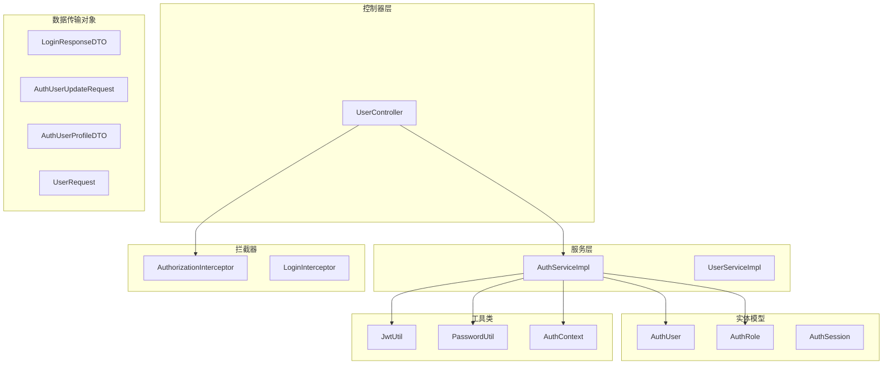
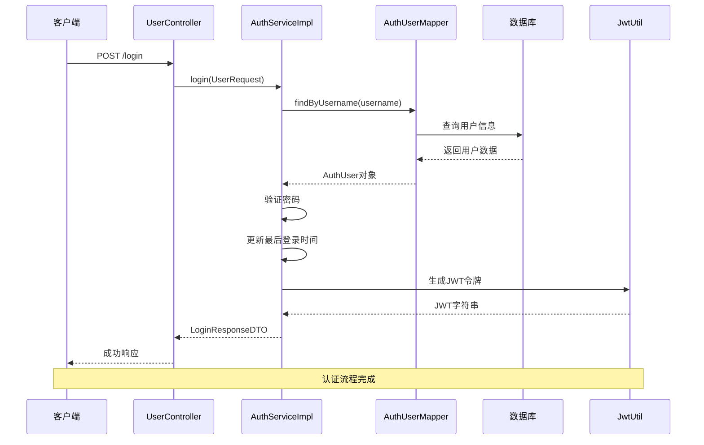
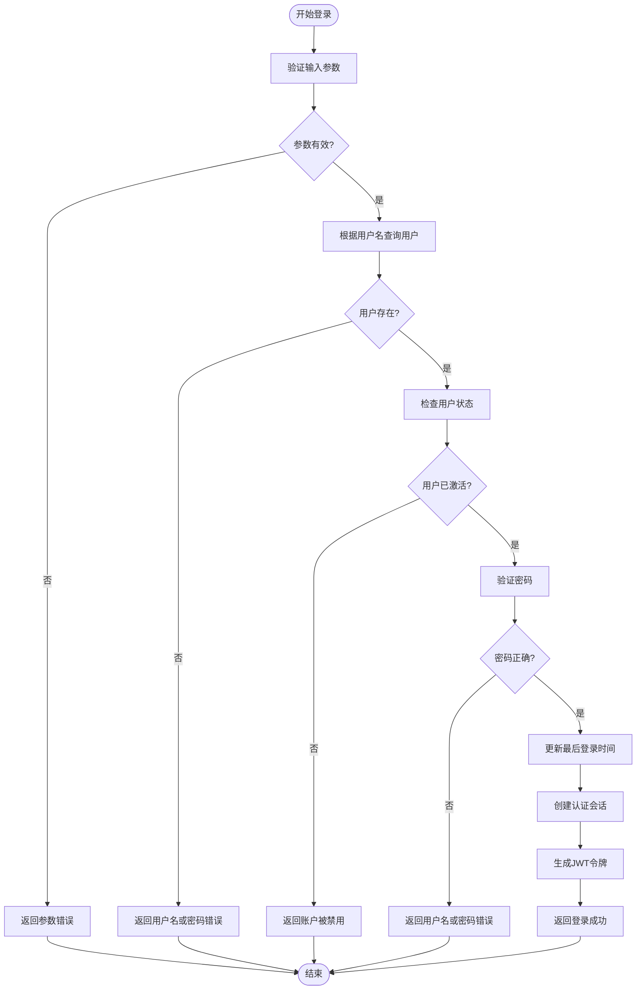
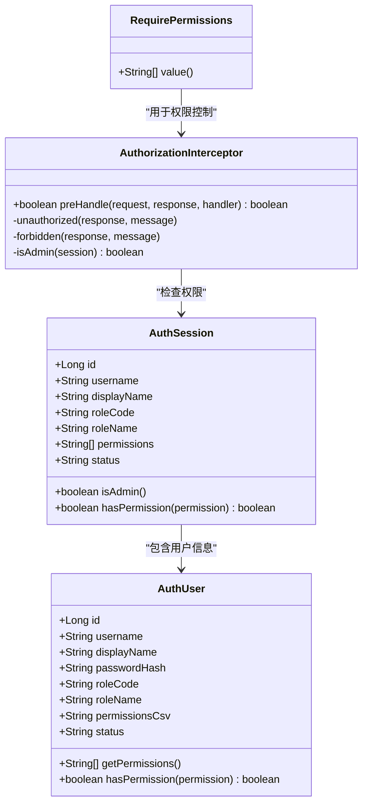
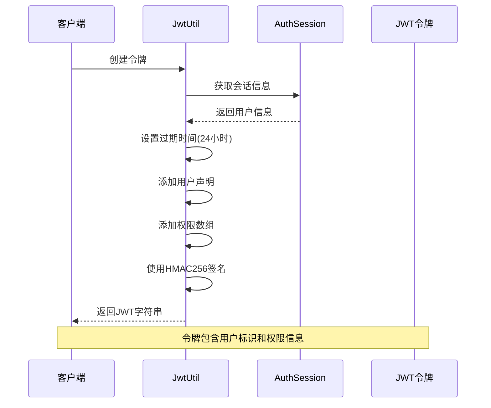
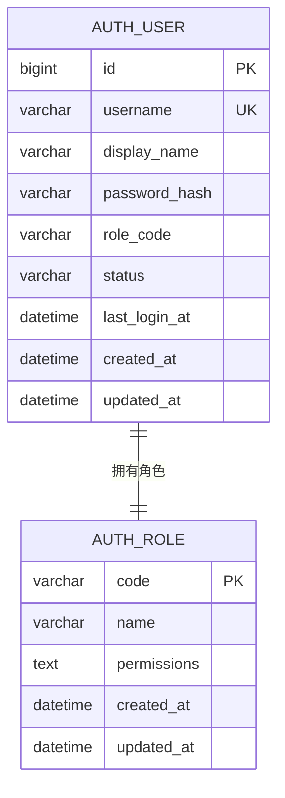
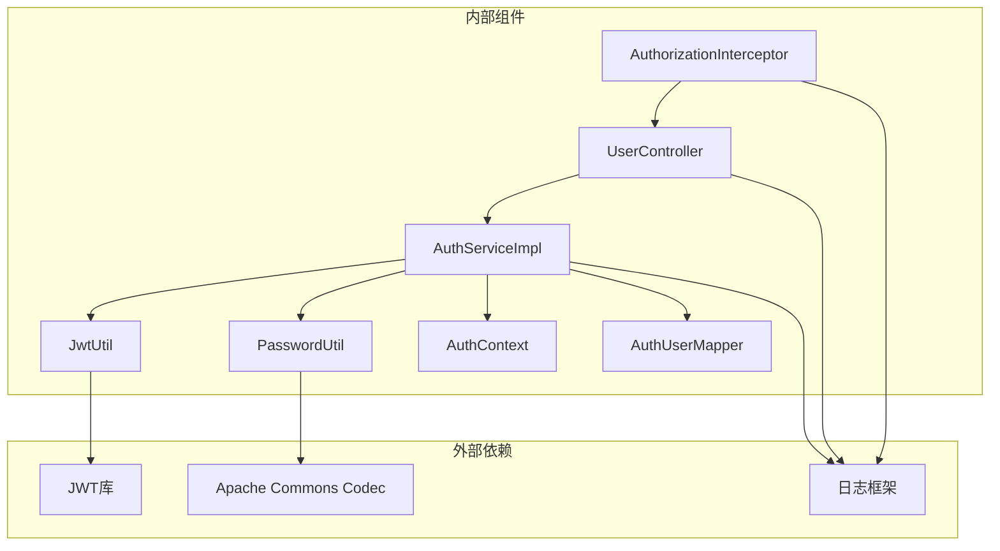

# 用户管理控制器

<cite>
**本文档引用的文件**
- [UserController.java](file://backend-repo/src/main/java/com/zjcxph/imgapi/controller/UserController.java)
- [AuthService.java](file://backend-repo/src/main/java/com/zjcxph/imgapi/service/AuthService.java)
- [AuthServiceImpl.java](file://backend-repo/src/main/java/com/zjcxph/imgapi/service/impl/AuthServiceImpl.java)
- [UserService.java](file://backend-repo/src/main/java/com/zjcxph/imgapi/service/UserService.java)
- [AuthUser.java](file://backend-repo/src/main/java/com/zjcxph/imgapi/entity/AuthUser.java)
- [AuthSession.java](file://backend-repo/src/main/java/com/zjcxph/imgapi/common/AuthSession.java)
- [LoginResponseDTO.java](file://backend-repo/src/main/java/com/zjcxph/imgapi/dto/resp/LoginResponseDTO.java)
- [AuthUserProfileDTO.java](file://backend-repo/src/main/java/com/zjcxph/imgapi/dto/resp/AuthUserProfileDTO.java)
- [UserRequest.java](file://backend-repo/src/main/java/com/zjcxph/imgapi/dto/req/UserRequest.java)
- [RequirePermissions.java](file://backend-repo/src/main/java/com/zjcxph/imgapi/annotation/RequirePermissions.java)
- [JwtUtil.java](file://backend-repo/src/main/java/com/zjcxph/imgapi/utils/JwtUtil.java)
- [PasswordUtil.java](file://backend-repo/src/main/java/com/zjcxph/imgapi/utils/PasswordUtil.java)
- [AuthContext.java](file://backend-repo/src/main/java/com/zjcxph/imgapi/utils/AuthContext.java)
- [AuthorizationInterceptor.java](file://backend-repo/src/main/java/com/zjcxph/imgapi/interceptors/AuthorizationInterceptor.java)
- [AuthUserMapper.java](file://backend-repo/src/main/java/com/zjcxph/imgapi/mapper/AuthUserMapper.java)
</cite>

## 目录
1. [简介](#简介)
2. [项目结构](#项目结构)
3. [核心组件](#核心组件)
4. [架构概览](#架构概览)
5. [详细组件分析](#详细组件分析)
6. [依赖分析](#依赖分析)
7. [性能考虑](#性能考虑)
8. [故障排除指南](#故障排除指南)
9. [结论](#结论)

## 简介

用户管理控制器是基于Spring Boot构建的认证授权系统的后端核心组件，负责处理用户相关的所有RESTful接口请求。该系统采用JWT（JSON Web Token）进行身份认证，实现了基于角色的访问控制（RBAC）机制，提供了完整的用户生命周期管理功能。

本系统的主要特性包括：
- 基于JWT的无状态认证机制
- 基于角色的权限控制系统
- 完整的用户信息管理
- 安全的密码存储和验证
- 细粒度的权限控制和拦截器机制

## 项目结构

用户管理相关的代码组织遵循典型的分层架构模式：

**图表来源**
- [UserController.java:27-36](file://backend-repo/src/main/java/com/zjcxph/imgapi/controller/UserController.java#L27-L36)
- [AuthServiceImpl.java:25-34](file://backend-repo/src/main/java/com/zjcxph/imgapi/service/impl/AuthServiceImpl.java#L25-L34)

**章节来源**
- [UserController.java:1-95](file://backend-repo/src/main/java/com/zjcxph/imgapi/controller/UserController.java#L1-L95)
- [AuthService.java:1-25](file://backend-repo/src/main/java/com/zjcxph/imgapi/service/AuthService.java#L1-L25)

## 核心组件

### 控制器层

UserController作为RESTful API的入口点，提供了以下核心功能：

- **认证接口**：用户登录、当前用户信息查询
- **用户管理接口**：用户列表查询、用户信息更新、用户状态管理
- **权限管理接口**：角色列表查询、权限验证

每个接口都通过Swagger注解提供详细的API文档，并使用统一的结果包装机制返回标准响应格式。

### 服务层

AuthService定义了用户管理的核心业务逻辑接口，具体实现由AuthServiceImpl提供：

- **认证服务**：处理用户登录验证、JWT令牌生成
- **用户信息服务**：提供用户信息查询、更新、状态管理
- **权限服务**：管理角色权限、权限验证

### 数据传输对象

系统使用DTO模式分离API接口和数据库实体：

- **请求DTO**：UserRequest、AuthUserUpdateRequest
- **响应DTO**：LoginResponseDTO、AuthUserProfileDTO
- **通用响应**：Result<T>（在控制器中使用）

### 实体模型

AuthUser实体封装了用户的所有相关信息，包括：
- 基本信息：用户名、显示名称、状态
- 权限信息：角色代码、角色名称、权限列表
- 时间戳：最后登录时间、创建时间、更新时间

**章节来源**
- [UserController.java:27-95](file://backend-repo/src/main/java/com/zjcxph/imgapi/controller/UserController.java#L27-L95)
- [AuthService.java:12-24](file://backend-repo/src/main/java/com/zjcxph/imgapi/service/AuthService.java#L12-L24)
- [AuthUser.java:12-134](file://backend-repo/src/main/java/com/zjcxph/imgapi/entity/AuthUser.java#L12-L134)

## 架构概览

系统采用经典的MVC架构模式，结合Spring Security的拦截器机制实现权限控制：

**图表来源**
- [UserController.java:38-47](file://backend-repo/src/main/java/com/zjcxph/imgapi/controller/UserController.java#L38-L47)
- [AuthServiceImpl.java:36-62](file://backend-repo/src/main/java/com/zjcxph/imgapi/service/impl/AuthServiceImpl.java#L36-L62)
- [JwtUtil.java:28-59](file://backend-repo/src/main/java/com/zjcxph/imgapi/utils/JwtUtil.java#L28-L59)

系统的核心架构特点：

1. **分层清晰**：控制器、服务、数据访问层职责明确
2. **无状态设计**：JWT令牌实现无状态认证
3. **权限控制**：基于注解的权限拦截机制
4. **数据安全**：密码哈希存储，敏感信息过滤

## 详细组件分析

### 用户认证流程

用户登录是整个认证系统的核心流程，涉及多个组件的协同工作：

**图表来源**
- [AuthServiceImpl.java:36-62](file://backend-repo/src/main/java/com/zjcxph/imgapi/service/impl/AuthServiceImpl.java#L36-L62)
- [PasswordUtil.java:17-22](file://backend-repo/src/main/java/com/zjcxph/imgapi/utils/PasswordUtil.java#L17-L22)

### 权限管理系统

系统实现了基于角色的访问控制（RBAC）机制：

**图表来源**
- [AuthSession.java:7-89](file://backend-repo/src/main/java/com/zjcxph/imgapi/common/AuthSession.java#L7-L89)
- [AuthUser.java:12-134](file://backend-repo/src/main/java/com/zjcxph/imgapi/entity/AuthUser.java#L12-L134)
- [RequirePermissions.java:8-12](file://backend-repo/src/main/java/com/zjcxph/imgapi/annotation/RequirePermissions.java#L8-L12)
- [AuthorizationInterceptor.java:17-77](file://backend-repo/src/main/java/com/zjcxph/imgapi/interceptors/AuthorizationInterceptor.java#L17-L77)

### JWT令牌机制

系统使用JWT（JSON Web Token）实现无状态认证：

**图表来源**
- [JwtUtil.java:28-59](file://backend-repo/src/main/java/com/zjcxph/imgapi/utils/JwtUtil.java#L28-L59)
- [AuthSession.java:81-88](file://backend-repo/src/main/java/com/zjcxph/imgapi/common/AuthSession.java#L81-L88)

### 数据模型设计

用户管理系统的数据模型设计体现了良好的分层原则：

**图表来源**
- [AuthUserMapper.java:16-77](file://backend-repo/src/main/java/com/zjcxph/imgapi/mapper/AuthUserMapper.java#L16-L77)

**章节来源**
- [JwtUtil.java:12-77](file://backend-repo/src/main/java/com/zjcxph/imgapi/utils/JwtUtil.java#L12-L77)
- [AuthorizationInterceptor.java:17-77](file://backend-repo/src/main/java/com/zjcxph/imgapi/interceptors/AuthorizationInterceptor.java#L17-L77)

## 依赖分析

系统各组件之间的依赖关系清晰且职责明确：

**图表来源**
- [UserController.java:11](file://backend-repo/src/main/java/com/zjcxph/imgapi/controller/UserController.java#L11)
- [AuthServiceImpl.java:3-15](file://backend-repo/src/main/java/com/zjcxph/imgapi/service/impl/AuthServiceImpl.java#L3-L15)

### 关键依赖关系

1. **控制器到服务层**：UserController依赖AuthService接口
2. **服务层到数据访问层**：AuthServiceImpl依赖AuthUserMapper
3. **工具类依赖**：JwtUtil和PasswordUtil提供核心安全功能
4. **拦截器依赖**：AuthorizationInterceptor依赖权限注解

**章节来源**
- [UserController.java:32-36](file://backend-repo/src/main/java/com/zjcxph/imgapi/controller/UserController.java#L32-L36)
- [AuthServiceImpl.java:28-34](file://backend-repo/src/main/java/com/zjcxph/imgapi/service/impl/AuthServiceImpl.java#L28-L34)

## 性能考虑

系统在设计时充分考虑了性能优化：

### 缓存策略
- **JWT令牌缓存**：令牌在内存中验证，避免频繁的数据库查询
- **用户信息缓存**：通过ThreadLocal存储当前用户上下文

### 数据库优化
- **批量查询**：用户列表查询使用单次数据库调用
- **索引优化**：用户名字段建立唯一索引
- **连接池**：使用MyBatis连接池管理数据库连接

### 网络优化
- **无状态设计**：JWT令牌减少服务器状态存储开销
- **压缩传输**：响应数据采用JSON格式，体积较小

## 故障排除指南

### 常见认证问题

**问题1：登录失败**
- 检查用户名和密码是否正确
- 确认用户账户状态为激活
- 验证密码哈希是否匹配

**问题2：权限不足**
- 检查用户是否具有所需的权限
- 确认角色配置是否正确
- 验证权限注解是否正确使用

**问题3：令牌过期**
- 检查JWT过期时间设置
- 验证服务器时间同步
- 确认环境变量配置

### 调试建议

1. **启用详细日志**：查看认证过程中的详细信息
2. **检查数据库连接**：确认用户数据查询正常
3. **验证密钥配置**：确保JWT密钥正确设置

**章节来源**
- [AuthorizationInterceptor.java:58-68](file://backend-repo/src/main/java/com/zjcxph/imgapi/interceptors/AuthorizationInterceptor.java#L58-L68)
- [JwtUtil.java:14-16](file://backend-repo/src/main/java/com/zjcxph/imgapi/utils/JwtUtil.java#L14-L16)

## 结论

用户管理控制器是一个设计良好、功能完整的认证授权系统。其主要优势包括：

1. **安全性**：采用JWT无状态认证和密码哈希存储
2. **可扩展性**：基于注解的权限控制机制易于扩展
3. **可维护性**：清晰的分层架构和职责分离
4. **性能**：无状态设计和合理的缓存策略

该系统为后续的功能扩展提供了良好的基础，包括支持多租户、OAuth集成、审计日志等高级功能。