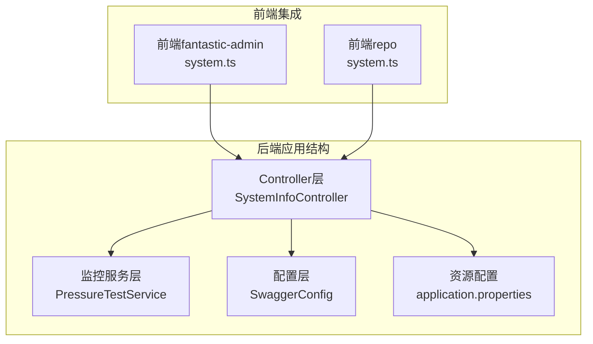
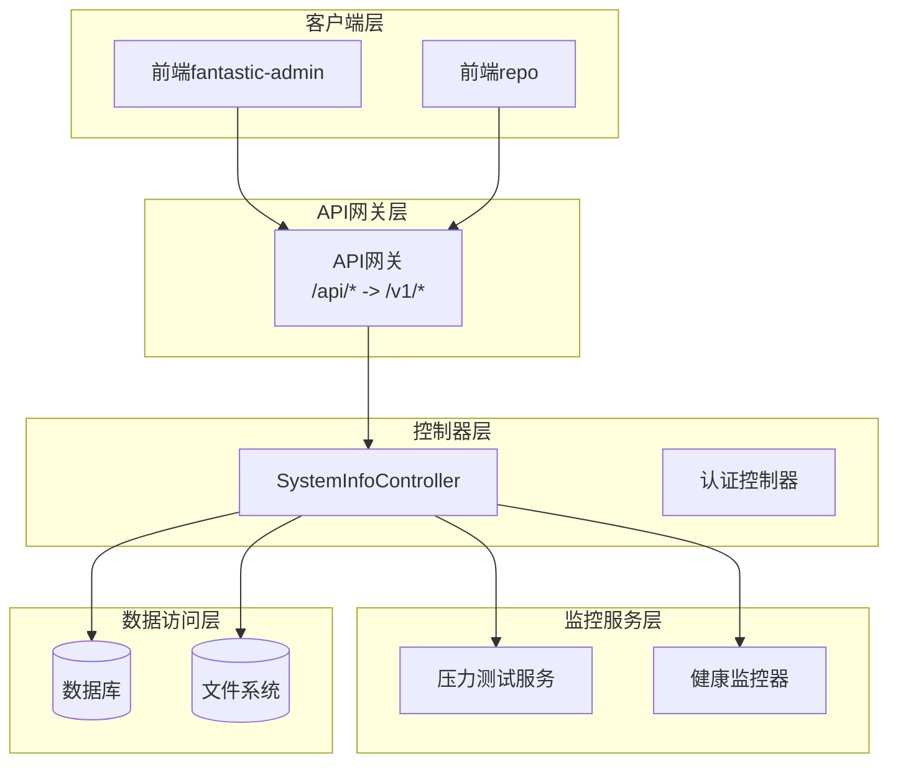
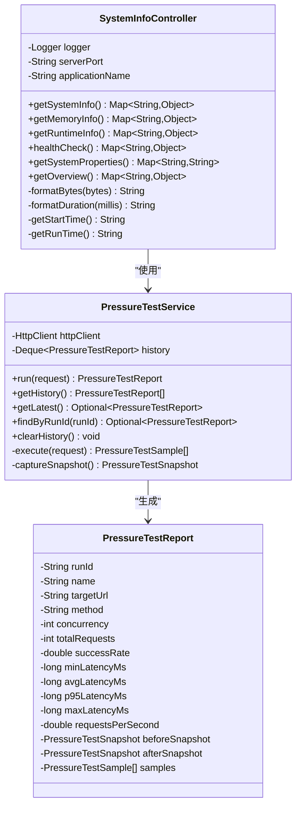
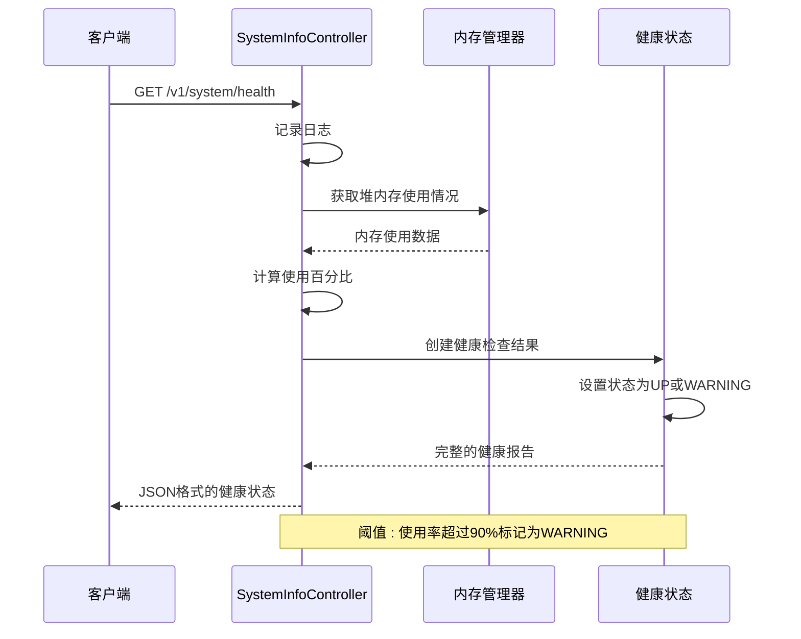
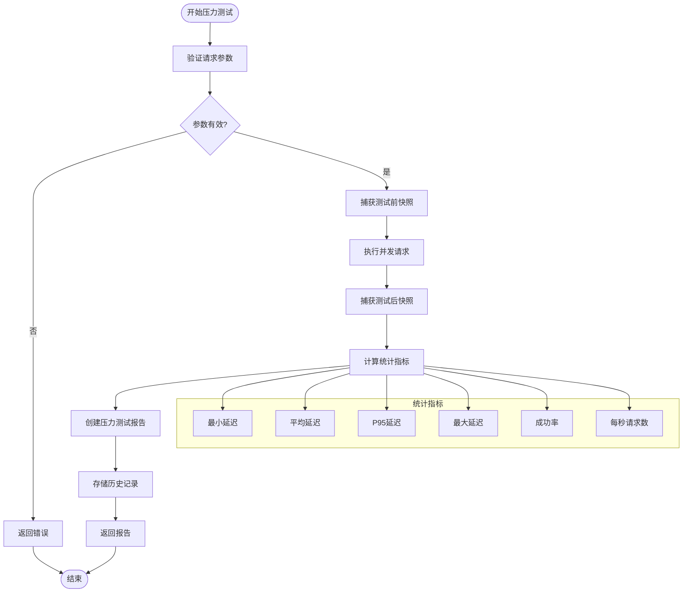
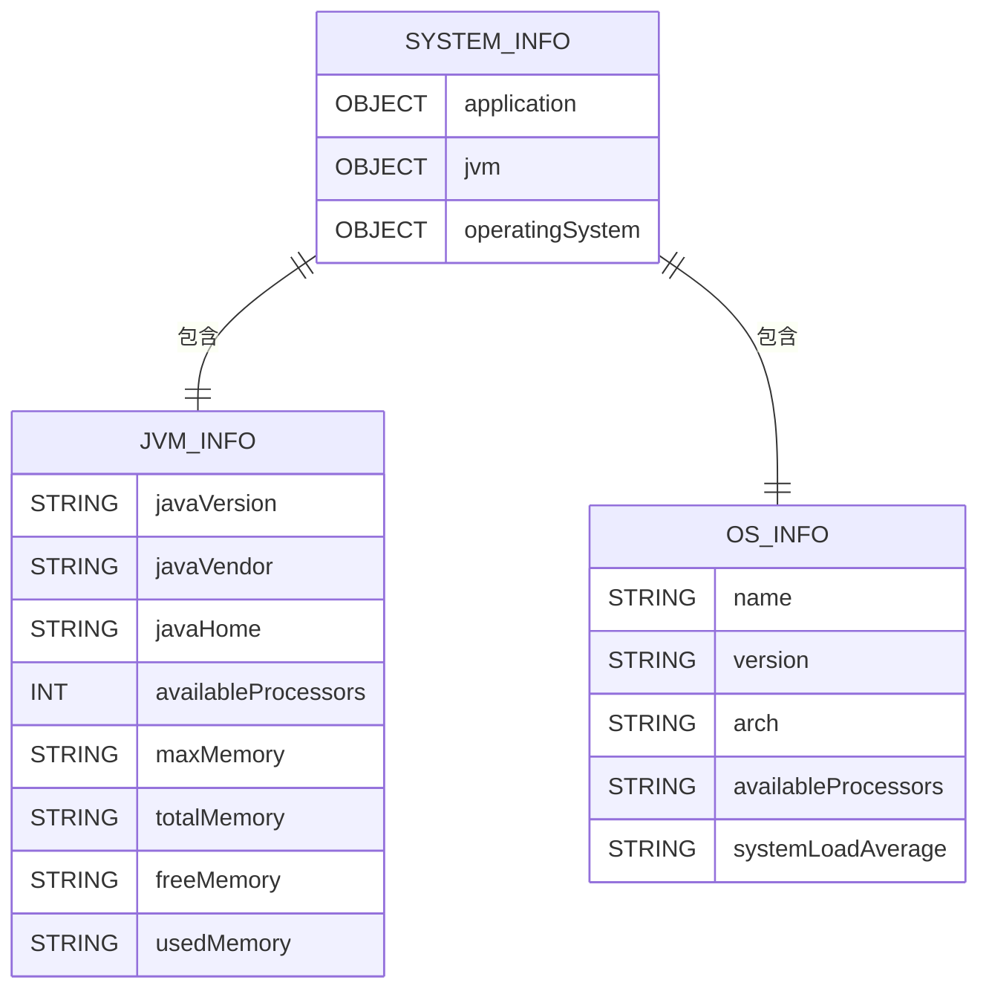
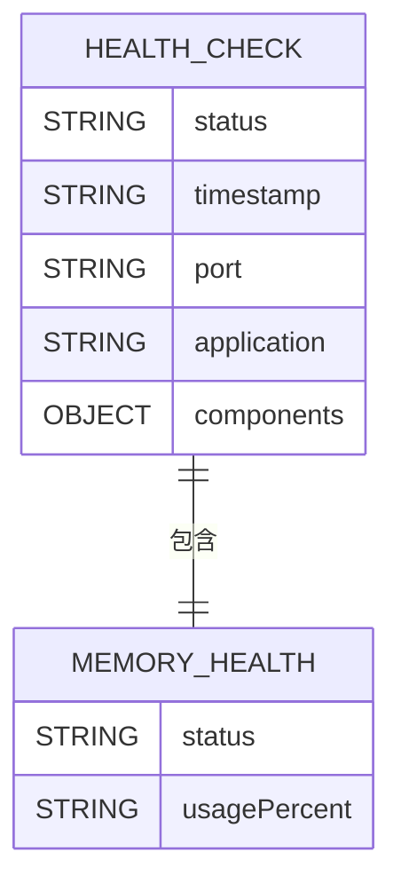
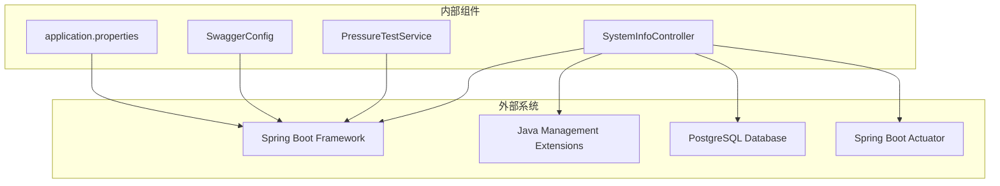
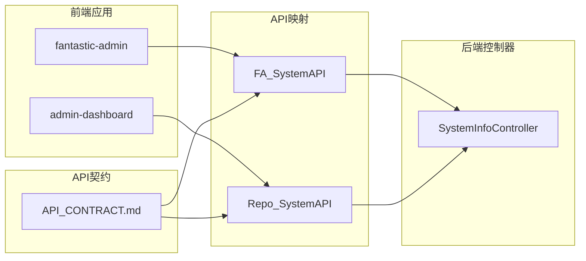

# 系统信息控制器

<cite>
**本文档引用的文件**
- [SystemInfoController.java](file://backend-repo/src/main/java/com/zjcxph/imgapi/controller/SystemInfoController.java)
- [PressureTestService.java](file://backend-repo/src/main/java/com/zjcxph/imgapi/monitoring/PressureTestService.java)
- [PressureTestReport.java](file://backend-repo/src/main/java/com/zjcxph/imgapi/monitoring/PressureTestReport.java)
- [PressureTestRequest.java](file://backend-repo/src/main/java/com/zjcxph/imgapi/monitoring/PressureTestRequest.java)
- [PressureTestSample.java](file://backend-repo/src/main/java/com/zjcxph/imgapi/monitoring/PressureTestSample.java)
- [PressureTestSnapshot.java](file://backend-repo/src/main/java/com/zjcxph/imgapi/monitoring/PressureTestSnapshot.java)
- [SwaggerConfig.java](file://backend-repo/src/main/java/com/zjcxph/imgapi/config/SwaggerConfig.java)
- [application.properties](file://backend-repo/src/main/resources/application.properties)
- [API_CONTRACT.md](file://backend-repo/API_CONTRACT.md)
- [system.ts（前端fantastic-admin）](file://frontend-fantastic-admin/src/api/modules/system.ts)
- [system.ts（前端repo）](file://frontend-repo/src/api/system.ts)
</cite>

## 目录
1. [简介](#简介)
2. [项目结构](#项目结构)
3. [核心组件](#核心组件)
4. [架构概览](#架构概览)
5. [详细组件分析](#详细组件分析)
6. [依赖关系分析](#依赖关系分析)
7. [性能考虑](#性能考虑)
8. [故障排除指南](#故障排除指南)
9. [结论](#结论)
10. [附录](#附录)

## 简介

SystemInfoController 是一个专门负责系统信息查询和监控的RESTful API控制器。该控制器提供了全面的系统状态监控、硬件资源查询、运行时环境信息收集和系统健康检查功能。通过统一的API接口，用户可以获取应用程序的基本信息、内存使用情况、运行时状态、系统属性以及完整的系统概览报告。

该控制器采用Spring Boot框架构建，集成了多种监控和诊断工具，为系统运维提供了强大的支持。所有API接口都经过了详细的文档化，并遵循RESTful设计原则，确保了良好的可维护性和扩展性。

## 项目结构

后端项目采用标准的Maven分层架构，SystemInfoController位于controller包中，与业务逻辑、数据访问层和监控服务分离。项目结构清晰，职责明确：



**图表来源**
- [SystemInfoController.java:1-236](file://backend-repo/src/main/java/com/zjcxph/imgapi/controller/SystemInfoController.java#L1-L236)
- [PressureTestService.java:1-293](file://backend-repo/src/main/java/com/zjcxph/imgapi/monitoring/PressureTestService.java#L1-L293)

**章节来源**
- [SystemInfoController.java:1-236](file://backend-repo/src/main/java/com/zjcxph/imgapi/controller/SystemInfoController.java#L1-L236)
- [application.properties:1-49](file://backend-repo/src/main/resources/application.properties#L1-L49)

## 核心组件

SystemInfoController包含以下核心功能模块：

### 主要功能模块
- **系统基本信息查询**：获取应用程序名称、启动时间、运行时长等基础信息
- **内存详细监控**：提供堆内存和非堆内存的完整使用情况
- **运行时状态跟踪**：收集JVM运行时参数和系统属性
- **健康检查服务**：实时监控系统状态和内存使用率
- **系统属性查询**：返回关键系统配置信息
- **统一监控概览**：整合所有监控数据的综合视图

### API端点设计
所有API端点都位于 `/v1/system` 基础路径下，遵循RESTful设计规范：

| 端点 | 方法 | 描述 | 返回类型 |
|------|------|------|----------|
| `/v1/system/info` | GET | 获取系统基本信息 | Map<String, Object> |
| `/v1/system/memory` | GET | 获取内存详细信息 | Map<String, Object> |
| `/v1/system/runtime` | GET | 获取运行时信息 | Map<String, Object> |
| `/v1/system/health` | GET | 系统健康检查 | Map<String, Object> |
| `/v1/system/properties` | GET | 获取系统属性 | Map<String, String> |
| `/v1/system/overview` | GET | 获取统一监控数据 | Map<String, Object> |

**章节来源**
- [SystemInfoController.java:35-180](file://backend-repo/src/main/java/com/zjcxph/imgapi/controller/SystemInfoController.java#L35-L180)

## 架构概览

SystemInfoController采用分层架构设计，确保了良好的关注点分离和可维护性：



**图表来源**
- [API_CONTRACT.md:7-8](file://backend-repo/API_CONTRACT.md#L7-L8)
- [SystemInfoController.java:23-24](file://backend-repo/src/main/java/com/zjcxph/imgapi/controller/SystemInfoController.java#L23-L24)

**章节来源**
- [API_CONTRACT.md:1-44](file://backend-repo/API_CONTRACT.md#L1-L44)
- [SwaggerConfig.java:14-39](file://backend-repo/src/main/java/com/zjcxph/imgapi/config/SwaggerConfig.java#L14-L39)

## 详细组件分析

### SystemInfoController 类结构



**图表来源**
- [SystemInfoController.java:25-236](file://backend-repo/src/main/java/com/zjcxph/imgapi/controller/SystemInfoController.java#L25-L236)
- [PressureTestService.java:32-293](file://backend-repo/src/main/java/com/zjcxph/imgapi/monitoring/PressureTestService.java#L32-L293)
- [PressureTestReport.java:6-317](file://backend-repo/src/main/java/com/zjcxph/imgapi/monitoring/PressureTestReport.java#L6-L317)

### 系统健康检查流程



**图表来源**
- [SystemInfoController.java:120-144](file://backend-repo/src/main/java/com/zjcxph/imgapi/controller/SystemInfoController.java#L120-L144)

### 压力测试监控组件



**图表来源**
- [PressureTestService.java:44-112](file://backend-repo/src/main/java/com/zjcxph/imgapi/monitoring/PressureTestService.java#L44-L112)
- [PressureTestRequest.java:12-180](file://backend-repo/src/main/java/com/zjcxph/imgapi/monitoring/PressureTestRequest.java#L12-L180)

**章节来源**
- [PressureTestService.java:1-293](file://backend-repo/src/main/java/com/zjcxph/imgapi/monitoring/PressureTestService.java#L1-L293)
- [PressureTestReport.java:1-317](file://backend-repo/src/main/java/com/zjcxph/imgapi/monitoring/PressureTestReport.java#L1-L317)

### 数据模型和格式

#### 系统信息数据结构


#### 健康检查数据结构


**图表来源**
- [SystemInfoController.java:37-144](file://backend-repo/src/main/java/com/zjcxph/imgapi/controller/SystemInfoController.java#L37-L144)

**章节来源**
- [SystemInfoController.java:182-236](file://backend-repo/src/main/java/com/zjcxph/imgapi/controller/SystemInfoController.java#L182-L236)

## 依赖关系分析

### 外部依赖和集成



**图表来源**
- [SystemInfoController.java:12-20](file://backend-repo/src/main/java/com/zjcxph/imgapi/controller/SystemInfoController.java#L12-L20)
- [application.properties:35-38](file://backend-repo/src/main/resources/application.properties#L35-L38)

### 前端集成关系



**图表来源**
- [API_CONTRACT.md:7-8](file://backend-repo/API_CONTRACT.md#L7-L8)
- [system.ts（前端fantastic-admin）:1-26](file://frontend-fantastic-admin/src/api/modules/system.ts#L1-L26)
- [system.ts（前端repo）:1-26](file://frontend-repo/src/api/system.ts#L1-L26)

**章节来源**
- [API_CONTRACT.md:1-44](file://backend-repo/API_CONTRACT.md#L1-L44)
- [SwaggerConfig.java:14-39](file://backend-repo/src/main/java/com/zjcxph/imgapi/config/SwaggerConfig.java#L14-L39)

## 性能考虑

### 内存使用优化
- **字节格式化**：提供KB、MB、GB的智能格式化，避免大数字显示问题
- **内存使用率计算**：实时计算堆内存使用百分比，阈值为90%
- **缓存策略**：合理使用ConcurrentLinkedDeque限制历史记录数量

### 并发处理
- **线程池管理**：压力测试使用固定大小的线程池，最大支持128个并发
- **原子操作**：使用AtomicInteger确保请求计数的线程安全
- **同步集合**：使用Collections.synchronizedList保证样本列表的线程安全

### 监控指标
- **延迟统计**：计算最小、平均、P95、最大延迟
- **成功率监控**：实时跟踪请求成功率
- **吞吐量测量**：计算每秒请求数(RPS)

## 故障排除指南

### 常见问题诊断

#### 健康检查失败
当系统健康检查返回WARNING状态时，通常表示内存使用率过高：
- 检查内存使用率是否超过90%
- 分析是否有内存泄漏
- 考虑增加JVM堆内存配置

#### API访问问题
如果前端无法访问系统信息API：
- 验证API网关映射配置
- 检查CORS配置
- 确认认证令牌有效性

#### 监控数据异常
压力测试报告出现异常数据时：
- 检查网络连接稳定性
- 验证目标URL可达性
- 分析超时配置是否合理

**章节来源**
- [SystemInfoController.java:136-141](file://backend-repo/src/main/java/com/zjcxph/imgapi/controller/SystemInfoController.java#L136-L141)
- [PressureTestService.java:172-188](file://backend-repo/src/main/java/com/zjcxph/imgapi/monitoring/PressureTestService.java#L172-L188)

## 结论

SystemInfoController提供了一个全面而强大的系统监控解决方案。通过统一的API接口，用户可以轻松获取系统的各种监控数据，包括硬件资源使用情况、运行时环境信息和系统健康状态。

该控制器的主要优势包括：
- **完整的监控覆盖**：从系统基本信息到详细资源使用情况
- **实时健康检查**：自动化的系统状态监控和告警机制
- **灵活的数据格式**：标准化的JSON响应格式，便于前端集成
- **强大的扩展性**：基于Spring Boot的可扩展架构设计

对于系统运维人员来说，这个控制器提供了必要的工具来监控和诊断系统状态，确保应用程序的稳定运行。

## 附录

### API使用示例

#### 获取系统基本信息
```bash
curl -X GET "http://localhost:18045/v1/system/info"
```

#### 获取内存使用详情
```bash
curl -X GET "http://localhost:18045/v1/system/memory"
```

#### 系统健康检查
```bash
curl -X GET "http://localhost:18045/v1/system/health"
```

### 配置选项

#### 应用程序配置
- **服务器端口**：默认18045，可通过环境变量覆盖
- **数据库连接**：PostgreSQL配置，支持环境变量覆盖
- **日志配置**：支持滚动日志和保留策略

#### 监控配置
- **Actuator端点**：启用health、info、metrics、prometheus端点
- **健康检查阈值**：内存使用率90%作为警告阈值
- **压力测试限制**：并发数1-128，请求总数1-10000

**章节来源**
- [application.properties:1-49](file://backend-repo/src/main/resources/application.properties#L1-L49)
- [SystemInfoController.java:29-33](file://backend-repo/src/main/java/com/zjcxph/imgapi/controller/SystemInfoController.java#L29-L33)