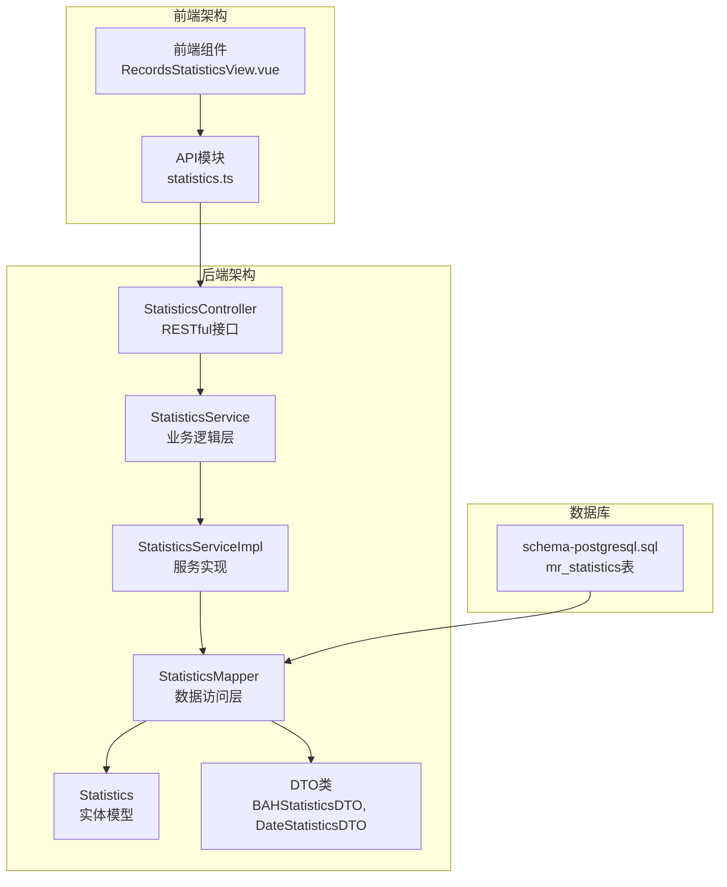
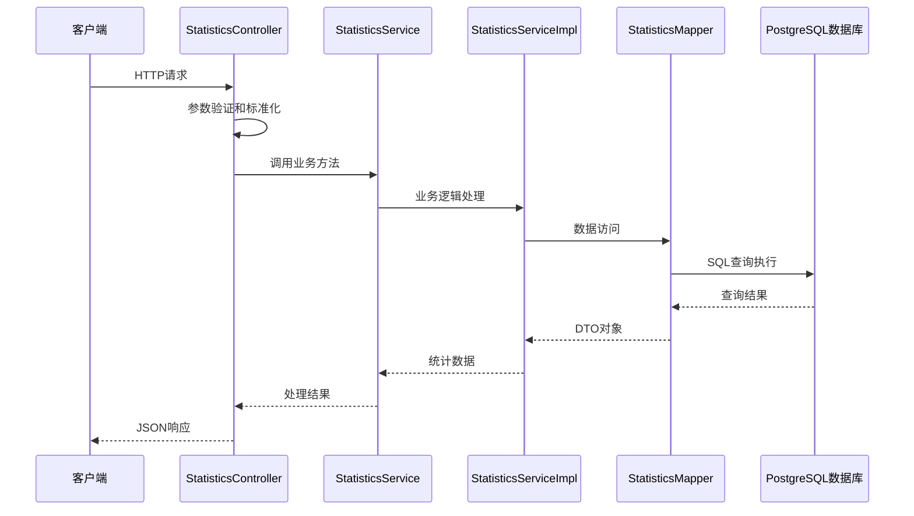
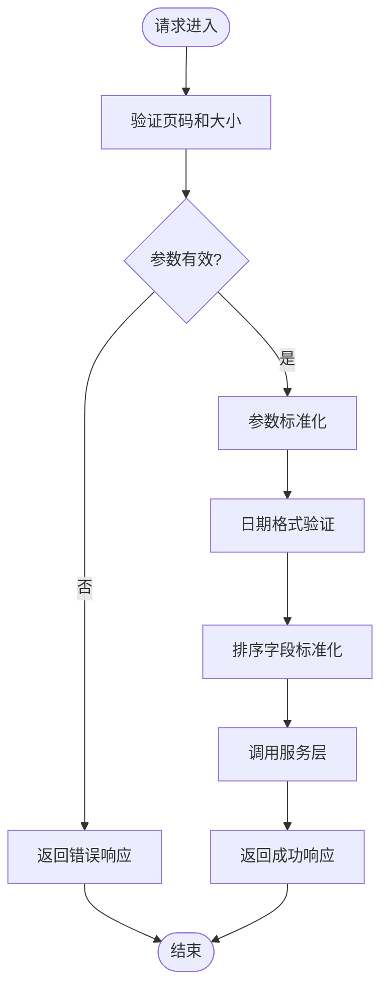
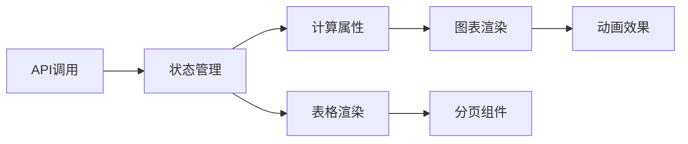
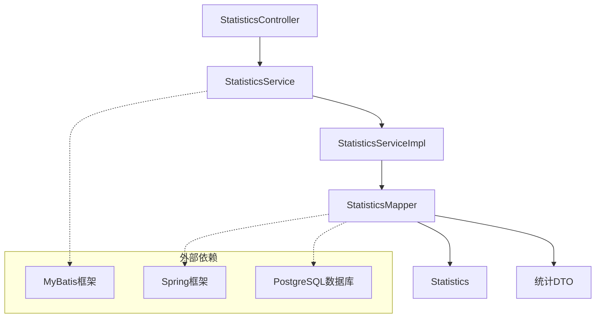
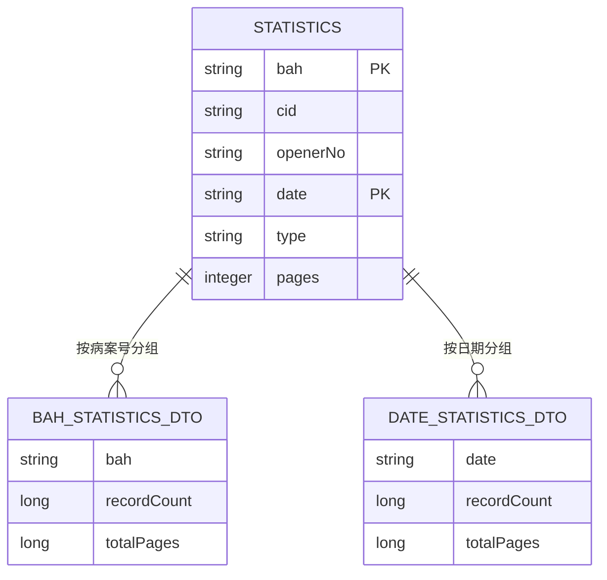

# 统计分析控制器

<cite>
**本文档引用的文件**
- [StatisticsController.java](file://backend-repo/src/main/java/com/zjcxph/imgapi/controller/StatisticsController.java)
- [StatisticsService.java](file://backend-repo/src/main/java/com/zjcxph/imgapi/service/StatisticsService.java)
- [StatisticsServiceImpl.java](file://backend-repo/src/main/java/com/zjcxph/imgapi/service/impl/StatisticsServiceImpl.java)
- [StatisticsMapper.java](file://backend-repo/src/main/java/com/zjcxph/imgapi/mapper/StatisticsMapper.java)
- [Statistics.java](file://backend-repo/src/main/java/com/zjcxph/imgapi/entity/Statistics.java)
- [BAHStatisticsDTO.java](file://backend-repo/src/main/java/com/zjcxph/imgapi/dto/resp/BAHStatisticsDTO.java)
- [DateStatisticsDTO.java](file://backend-repo/src/main/java/com/zjcxph/imgapi/dto/resp/DateStatisticsDTO.java)
- [schema-postgresql.sql](file://backend-repo/src/main/resources/schema-postgresql.sql)
- [StatisticsTest.java](file://backend-repo/src/test/java/com/zjcxph/imgapi/StatisticsTest.java)
- [RecordsStatisticsView.vue](file://frontend-repo/src/components/admin/RecordsStatisticsView.vue)
- [statistics.ts](file://frontend-repo/src/api/statistics.ts)
</cite>

## 目录
1. [简介](#简介)
2. [项目结构](#项目结构)
3. [核心组件](#核心组件)
4. [架构概览](#架构概览)
5. [详细组件分析](#详细组件分析)
6. [依赖关系分析](#依赖关系分析)
7. [性能考量](#性能考量)
8. [故障排除指南](#故障排除指南)
9. [结论](#结论)
10. [附录](#附录)

## 简介

StatisticsController 是病案统计分析系统的核心控制器，负责提供病案统计数据的RESTful接口。该控制器实现了完整的统计分析功能，包括病案统计数据查询、图像数量统计、时间趋势分析和报表生成功能。系统采用分层架构设计，通过Controller-Service-Mapper三层结构实现数据访问和业务逻辑分离。

该控制器支持多种统计维度：
- 病案维度统计：按病案号统计记录数和总页数
- 时间维度统计：按日期统计记录数和总页数
- 类型维度统计：按病案类型统计分布情况
- 综合面板统计：提供仪表板式的综合统计视图

## 项目结构

统计分析功能在MRR项目中的组织结构如下：



**图表来源**
- [StatisticsController.java:1-281](file://backend-repo/src/main/java/com/zjcxph/imgapi/controller/StatisticsController.java#L1-L281)
- [StatisticsService.java:1-56](file://backend-repo/src/main/java/com/zjcxph/imgapi/service/StatisticsService.java#L1-L56)
- [StatisticsMapper.java:1-168](file://backend-repo/src/main/java/com/zjcxph/imgapi/mapper/StatisticsMapper.java#L1-L168)

**章节来源**
- [StatisticsController.java:1-281](file://backend-repo/src/main/java/com/zjcxph/imgapi/controller/StatisticsController.java#L1-L281)
- [schema-postgresql.sql:16-23](file://backend-repo/src/main/resources/schema-postgresql.sql#L16-L23)

## 核心组件

### 统计数据实体模型

系统使用Statistics实体来表示病案统计数据，包含以下核心字段：

| 字段名 | 类型 | 描述 | 约束 |
|--------|------|------|------|
| bah | String | 病案号 | 主键之一 |
| cid | String | 扫描设备ID | 可空 |
| openerNo | String | 扫描负责人 | 可空 |
| date | String | 扫描日期 | 主键之一 |
| type | String | 病案类型 | 可空 |
| pages | Integer | 扫描页数 | 可空 |

### 统计DTO类

系统定义了专门的DTO类来封装统计结果：

**BAHStatisticsDTO** - 病案统计DTO
- bah: 病案号
- recordCount: 记录数
- totalPages: 总页数

**DateStatisticsDTO** - 日期统计DTO  
- date: 日期
- recordCount: 记录数
- totalPages: 总页数

**章节来源**
- [Statistics.java:1-74](file://backend-repo/src/main/java/com/zjcxph/imgapi/entity/Statistics.java#L1-L74)
- [BAHStatisticsDTO.java:1-47](file://backend-repo/src/main/java/com/zjcxph/imgapi/dto/resp/BAHStatisticsDTO.java#L1-L47)
- [DateStatisticsDTO.java:1-47](file://backend-repo/src/main/java/com/zjcxph/imgapi/dto/resp/DateStatisticsDTO.java#L1-L47)

## 架构概览

统计分析系统的整体架构采用经典的MVC模式，通过清晰的分层设计实现关注点分离：



**图表来源**
- [StatisticsController.java:43-109](file://backend-repo/src/main/java/com/zjcxph/imgapi/controller/StatisticsController.java#L43-L109)
- [StatisticsServiceImpl.java:13-98](file://backend-repo/src/main/java/com/zjcxph/imgapi/service/impl/StatisticsServiceImpl.java#L13-L98)
- [StatisticsMapper.java:13-168](file://backend-repo/src/main/java/com/zjcxph/imgapi/mapper/StatisticsMapper.java#L13-L168)

## 详细组件分析

### RESTful API接口设计

#### 基础查询接口

**获取所有统计数据（分页+条件）**
- 方法：GET `/v1/statistics-api`
- 功能：支持关键字搜索、类型过滤、日期范围筛选的分页查询
- 参数：
  - page: 页码，默认1
  - size: 每页大小，默认100，最大1000
  - keyword: 关键字，匹配bah/cid/openerNo/date/type
  - type: 类型精确匹配
  - startDate: 开始日期（yyyy-MM-dd）
  - endDate: 结束日期（yyyy-MM-dd）
  - sortBy: 排序字段（bah/cid/openerNo/date/type/pages）
  - sortOrder: 排序方向（asc/desc）

**根据病案号查询统计数据**
- 方法：GET `/v1/statistics-api/bah/{bah}`
- 功能：按病案号精确查询所有相关记录
- 参数：bah（病案号）

**根据日期查询统计数据**
- 方法：GET `/v1/statistics-api/date/{date}`
- 功能：按日期模糊查询相关记录
- 参数：date（支持YYYY-MM-DD或YYYY.MM.DD格式）

#### 统计分析接口

**统计每个病案号的记录数和总页数**
- 方法：GET `/v1/statistics-api/bah-summary`
- 功能：按病案号分组统计，返回记录数和总页数

**统计每个日期的记录数和总页数**
- 方法：GET `/v1/statistics-api/date-summary`
- 功能：按日期分组统计，返回记录数和总页数

**按条件统计每日数据**
- 方法：GET `/v1/statistics-api/date-summary/condition`
- 功能：支持日期范围和类型的条件统计
- 参数：startDate、endDate、type

**获取总体统计信息**
- 方法：GET `/v1/statistics-api/summary`
- 功能：返回总体统计信息，包括总记录数、总页数、唯一病案号数量、按类型统计

**按类型统计**
- 方法：GET `/v1/statistics-api/type-summary`
- 功能：按病案类型分组统计

**获取综合统计面板数据**
- 方法：GET `/v1/statistics-api/dashboard`
- 功能：返回仪表板式综合统计，包括概览、最近30天趋势、前10大病案号

#### 参数验证和标准化

控制器实现了完善的参数验证和标准化机制：



**图表来源**
- [StatisticsController.java:66-80](file://backend-repo/src/main/java/com/zjcxph/imgapi/controller/StatisticsController.java#L66-L80)
- [StatisticsController.java:244-279](file://backend-repo/src/main/java/com/zjcxph/imgapi/controller/StatisticsController.java#L244-L279)

**章节来源**
- [StatisticsController.java:43-242](file://backend-repo/src/main/java/com/zjcxph/imgapi/controller/StatisticsController.java#L43-L242)

### 业务逻辑实现

#### 统计计算逻辑

系统采用SQL聚合函数实现高效的统计计算：

**分组统计查询**
```sql
SELECT bah, COUNT(*) as recordCount, SUM(pages) as totalPages 
FROM mr_statistics 
GROUP BY bah 
ORDER BY bah
```

**日期趋势统计**
```sql
SELECT date, COUNT(*) as recordCount, SUM(pages) as totalPages 
FROM mr_statistics 
WHERE date >= #{startDate} AND date <= #{endDate}
GROUP BY date 
ORDER BY date
```

**条件统计查询**
```sql
SELECT COUNT(*) FROM mr_statistics 
WHERE keyword LIKE '%' || #{keyword} || '%' 
AND type = #{type}
AND REPLACE(date, '/', '-') >= #{startDate}
AND REPLACE(date, '/', '-') <= #{endDate}
```

#### 数据聚合策略

系统采用多种聚合策略满足不同业务需求：

1. **基础聚合**：使用GROUP BY进行分组统计
2. **条件聚合**：结合WHERE子句实现条件过滤
3. **范围聚合**：支持日期范围和数值范围的统计
4. **排序聚合**：支持多字段排序和自定义排序规则

**章节来源**
- [StatisticsMapper.java:116-166](file://backend-repo/src/main/java/com/zjcxph/imgapi/mapper/StatisticsMapper.java#L116-L166)

### 数据访问层设计

#### MyBatis映射器

StatisticsMapper使用MyBatis注解实现数据访问：

**动态SQL查询**
- 使用`<script>`标签实现动态SQL构建
- 支持条件判断和参数绑定
- 实现灵活的查询组合

**预编译查询**
- 使用`@Param`注解确保参数安全
- 防止SQL注入攻击
- 提高查询性能

**索引优化**
- 数据库表包含多个索引
- 优化常见查询场景
- 提升统计查询效率

**章节来源**
- [StatisticsMapper.java:24-106](file://backend-repo/src/main/java/com/zjcxph/imgapi/mapper/StatisticsMapper.java#L24-L106)
- [schema-postgresql.sql:75-79](file://backend-repo/src/main/resources/schema-postgresql.sql#L75-L79)

### 前端集成

#### Vue组件实现

前端使用Vue 3 Composition API实现统计面板：

**数据流设计**


**图表可视化**
- 使用SVG实现高性能图表渲染
- 支持柱状图和折线图组合
- 实现响应式设计和动画效果

**交互设计**
- 支持实时数据刷新
- 提供丰富的筛选选项
- 实现友好的用户界面

**章节来源**
- [RecordsStatisticsView.vue:1-1562](file://frontend-repo/src/components/admin/RecordsStatisticsView.vue#L1-L1562)
- [statistics.ts:1-23](file://frontend-repo/src/api/statistics.ts#L1-L23)

## 依赖关系分析

### 组件耦合度分析

统计分析系统的组件间耦合度设计合理：



**图表来源**
- [StatisticsController.java:37-41](file://backend-repo/src/main/java/com/zjcxph/imgapi/controller/StatisticsController.java#L37-L41)
- [StatisticsServiceImpl.java:16-20](file://backend-repo/src/main/java/com/zjcxph/imgapi/service/impl/StatisticsServiceImpl.java#L16-L20)

### 关键依赖关系

1. **Controller-Service依赖**：通过构造函数注入实现松耦合
2. **Service-Mapper依赖**：服务层调用数据访问层
3. **Mapper-Entity依赖**：数据映射层处理实体转换
4. **Mapper-Database依赖**：MyBatis框架处理数据库交互

**章节来源**
- [StatisticsController.java:37-41](file://backend-repo/src/main/java/com/zjcxph/imgapi/controller/StatisticsController.java#L37-L41)
- [StatisticsServiceImpl.java:16-20](file://backend-repo/src/main/java/com/zjcxph/imgapi/service/impl/StatisticsServiceImpl.java#L16-L20)

## 性能考量

### 查询优化策略

#### 索引设计
系统在关键字段上建立了复合索引：
- `bah` 字段索引：优化病案号查询
- `date` 字段索引：优化日期范围查询  
- `type` 字段索引：优化类型过滤查询

#### 查询优化
- 使用LIMIT和OFFSET实现分页查询
- 采用GROUP BY进行高效聚合
- 实现条件预编译防止SQL注入
- 使用连接池提升数据库连接效率

#### 缓存策略
- 前端实现数据缓存机制
- 支持手动刷新和自动更新
- 减少重复查询开销

### 性能监控

系统提供了全面的性能监控能力：

**响应时间监控**
- 记录每个API请求的处理时间
- 监控数据库查询执行时间
- 分析统计计算耗时

**资源使用监控**
- 监控内存使用情况
- 跟踪数据库连接池状态
- 分析CPU使用率

**性能优化建议**
- 对高频查询建立适当的索引
- 优化复杂统计查询的执行计划
- 实现查询结果缓存机制
- 考虑分库分表策略

## 故障排除指南

### 常见问题诊断

#### 数据查询异常

**症状**：统计查询返回空结果或错误数据
**可能原因**：
- 数据库连接异常
- SQL语法错误
- 参数格式不正确
- 数据库权限不足

**解决方案**：
- 检查数据库连接配置
- 验证SQL语句语法
- 确认参数格式和类型
- 检查用户权限设置

#### 性能问题

**症状**：统计查询响应缓慢
**可能原因**：
- 缺少必要的数据库索引
- 查询条件过于复杂
- 数据量过大导致查询超时
- 内存不足

**解决方案**：
- 添加适当的数据库索引
- 优化查询条件和逻辑
- 实现分页和限制查询范围
- 调整服务器资源配置

#### 前端显示问题

**症状**：图表渲染异常或数据不显示
**可能原因**：
- API接口调用失败
- 数据格式不匹配
- 前端组件状态异常
- 网络连接问题

**解决方案**：
- 检查API接口响应状态
- 验证数据格式和结构
- 检查前端组件生命周期
- 确认网络连接稳定性

### 调试工具和技巧

#### 日志分析
- 启用详细的日志记录
- 分析SQL执行计划
- 监控系统资源使用
- 跟踪异常堆栈信息

#### 性能分析
- 使用性能分析工具
- 监控数据库查询性能
- 分析内存使用情况
- 评估并发处理能力

**章节来源**
- [StatisticsTest.java:1-294](file://backend-repo/src/test/java/com/zjcxph/imgapi/StatisticsTest.java#L1-L294)

## 结论

StatisticsController作为MRR项目的核心统计分析组件，实现了完整的病案统计功能。通过合理的架构设计和优化的查询策略，系统能够高效地处理大规模统计数据的查询和分析需求。

### 主要优势

1. **架构清晰**：采用分层架构设计，职责明确，易于维护
2. **功能完整**：涵盖病案统计、时间趋势、类型分析等全方位统计需求
3. **性能优化**：通过索引设计和查询优化确保高效的数据处理
4. **用户体验**：前后端配合实现直观的统计可视化界面
5. **扩展性强**：模块化设计便于功能扩展和定制

### 应用场景

该统计分析系统适用于以下业务场景：
- 医院病案管理工作统计
- 影像扫描工作量分析
- 病案质量监控和评估
- 医疗资源使用情况统计
- 病案管理决策支持

### 发展建议

1. **增强实时性**：考虑实现实时统计数据更新机制
2. **扩展分析维度**：增加更多维度的统计分析功能
3. **优化移动端体验**：改进移动端的统计界面和交互
4. **引入机器学习**：利用AI技术进行趋势预测和异常检测
5. **加强数据安全**：完善数据访问控制和审计机制

## 附录

### API使用示例

#### 获取分页统计数据
```
GET /v1/statistics-api?page=1&size=100&keyword=0078&type=普通&startDate=2024-01-01&endDate=2024-12-31&sortBy=date&sortOrder=desc
```

#### 获取病案统计摘要
```
GET /v1/statistics-api/bah-summary
```

#### 获取日期趋势统计
```
GET /v1/statistics-api/date-summary/condition?startDate=2024-01-01&endDate=2024-12-31&type=普通
```

### 数据模型关系



**图表来源**
- [Statistics.java:6-12](file://backend-repo/src/main/java/com/zjcxph/imgapi/entity/Statistics.java#L6-L12)
- [BAHStatisticsDTO.java:9-12](file://backend-repo/src/main/java/com/zjcxph/imgapi/dto/resp/BAHStatisticsDTO.java#L9-L12)
- [DateStatisticsDTO.java:9-12](file://backend-repo/src/main/java/com/zjcxph/imgapi/dto/resp/DateStatisticsDTO.java#L9-L12)