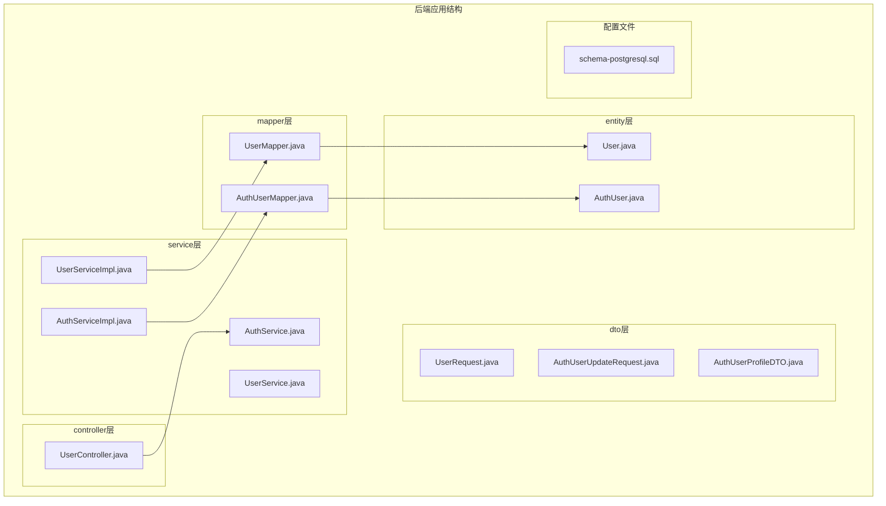
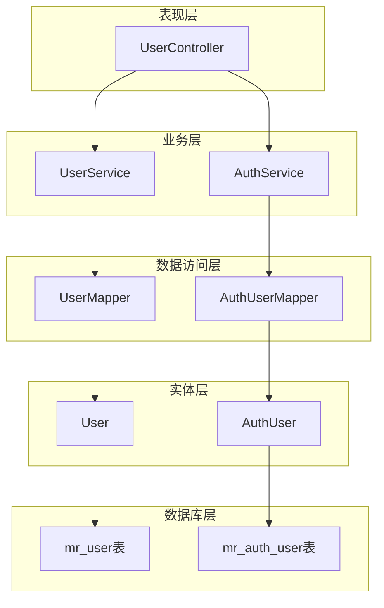
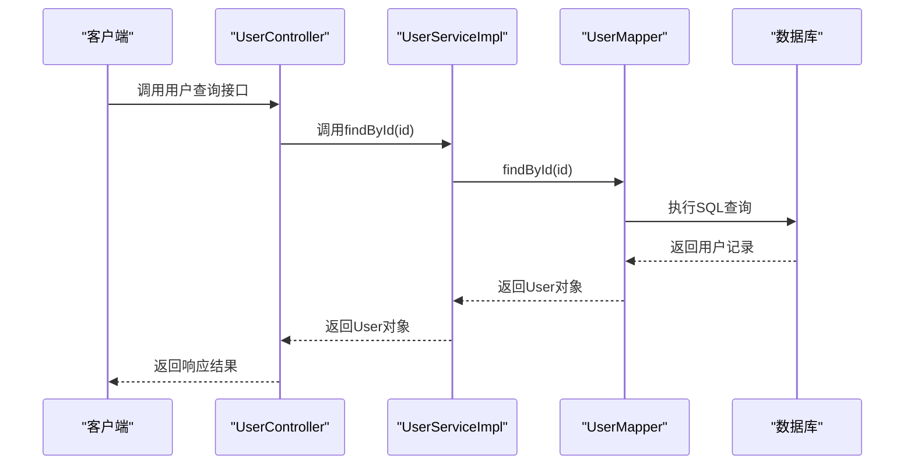
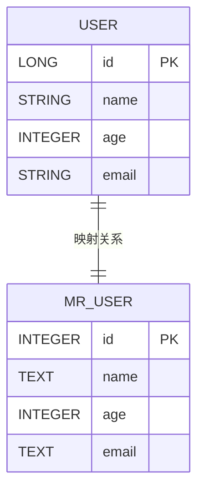
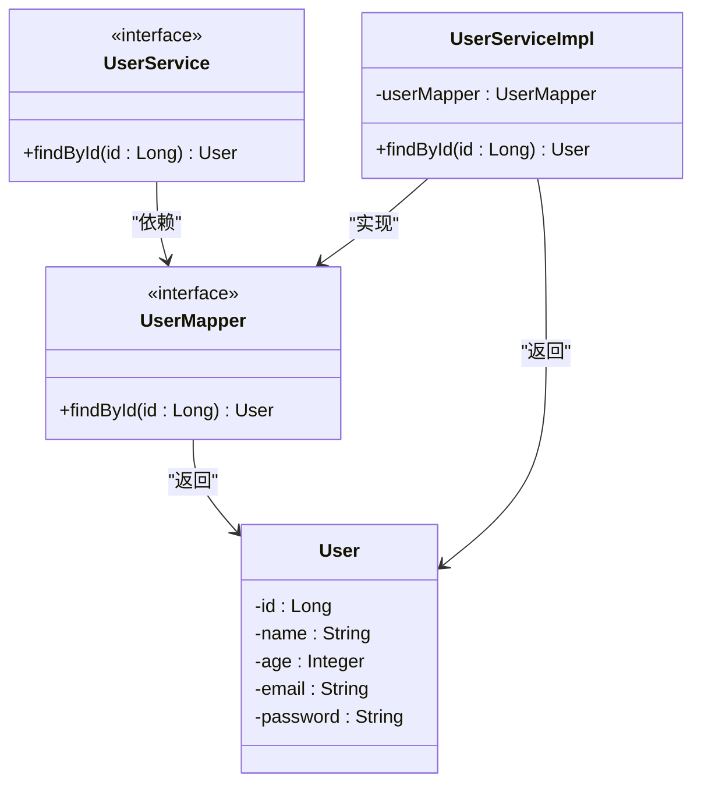

# 用户信息Mapper

<cite>
**本文档引用的文件**
- [UserMapper.java](file://backend-repo/src/main/java/com/zjcxph/imgapi/mapper/UserMapper.java)
- [User.java](file://backend-repo/src/main/java/com/zjcxph/imgapi/entity/User.java)
- [UserService.java](file://backend-repo/src/main/java/com/zjcxph/imgapi/service/UserService.java)
- [UserServiceImpl.java](file://backend-repo/src/main/java/com/zjcxph/imgapi/service/impl/UserServiceImpl.java)
- [schema-postgresql.sql](file://backend-repo/src/main/resources/schema-postgresql.sql)
- [AuthUserMapper.java](file://backend-repo/src/main/java/com/zjcxph/imgapi/mapper/AuthUserMapper.java)
- [AuthUser.java](file://backend-repo/src/main/java/com/zjcxph/imgapi/entity/AuthUser.java)
- [AuthService.java](file://backend-repo/src/main/java/com/zjcxph/imgapi/service/AuthService.java)
- [AuthServiceImpl.java](file://backend-repo/src/main/java/com/zjcxph/imgapi/service/impl/AuthServiceImpl.java)
- [UserController.java](file://backend-repo/src/main/java/com/zjcxph/imgapi/controller/UserController.java)
- [UserRequest.java](file://backend-repo/src/main/java/com/zjcxph/imgapi/dto/req/UserRequest.java)
- [AuthUserProfileDTO.java](file://backend-repo/src/main/java/com/zjcxph/imgapi/dto/resp/AuthUserProfileDTO.java)
- [AuthUserUpdateRequest.java](file://backend-repo/src/main/java/com/zjcxph/imgapi/dto/req/AuthUserUpdateRequest.java)
- [AuthSession.java](file://backend-repo/src/main/java/com/zjcxph/imgapi/common/AuthSession.java)
</cite>

## 目录
1. [简介](#简介)
2. [项目结构](#项目结构)
3. [核心组件](#核心组件)
4. [架构概览](#架构概览)
5. [详细组件分析](#详细组件分析)
6. [依赖关系分析](#依赖关系分析)
7. [性能考虑](#性能考虑)
8. [故障排除指南](#故障排除指南)
9. [结论](#结论)

## 简介

本文档为用户信息Mapper技术文档，重点分析UserMapper接口的设计与实现。在当前代码库中，存在两个相关的用户概念：基础用户信息User（对应mr_user表）和认证用户信息AuthUser（对应mr_auth_user表）。UserMapper专门负责基础用户信息的查询操作，而认证用户信息的完整管理由AuthUserMapper负责。

UserMapper采用MyBatis注解方式实现，目前仅包含按ID查询的基础功能。该接口设计简洁明了，体现了单一职责原则，专注于用户标识符查询这一核心业务场景。

## 项目结构

基于当前代码库的组织结构，用户信息相关的文件分布如下：



**图表来源**
- [UserMapper.java:1-13](file://backend-repo/src/main/java/com/zjcxph/imgapi/mapper/UserMapper.java#L1-L13)
- [AuthUserMapper.java:1-78](file://backend-repo/src/main/java/com/zjcxph/imgapi/mapper/AuthUserMapper.java#L1-L78)
- [User.java:1-49](file://backend-repo/src/main/java/com/zjcxph/imgapi/entity/User.java#L1-L49)
- [AuthUser.java:1-134](file://backend-repo/src/main/java/com/zjcxph/imgapi/entity/AuthUser.java#L1-L134)

**章节来源**
- [UserMapper.java:1-13](file://backend-repo/src/main/java/com/zjcxph/imgapi/mapper/UserMapper.java#L1-L13)
- [User.java:1-49](file://backend-repo/src/main/java/com/zjcxph/imgapi/entity/User.java#L1-L49)
- [schema-postgresql.sql:34-39](file://backend-repo/src/main/resources/schema-postgresql.sql#L34-L39)

## 核心组件

### UserMapper接口设计

UserMapper是用户信息访问层的核心接口，采用MyBatis注解驱动的方式实现数据库操作。该接口具有以下设计特点：

**接口特性**
- 使用`@Mapper`注解标识为MyBatis Mapper组件
- 采用方法名即SQL的约定式映射
- 返回类型为User实体对象
- 参数类型为Long类型的用户标识符

**方法签名分析**
```java
@Select("select * from mr_user where id = #{id}")
User findById(Long id);
```

该方法实现了基础用户信息的按ID查询功能，SQL语句直接指定查询mr_user表中的所有列，并通过参数绑定实现条件过滤。

**章节来源**
- [UserMapper.java:7-12](file://backend-repo/src/main/java/com/zjcxph/imgapi/mapper/UserMapper.java#L7-L12)

### User实体类结构

User实体类定义了基础用户信息的数据模型，包含以下字段：

**字段定义**
- `id`: Long类型，主键标识符
- `name`: String类型，用户姓名
- `age`: Integer类型，用户年龄
- `email`: String类型，用户邮箱
- `password`: String类型，用户密码

**设计模式**
- 采用Lombok的@Data注解自动生成getter/setter方法
- 提供显式的getter/setter方法以满足框架要求
- 字段命名遵循Java驼峰命名规范

**章节来源**
- [User.java:6-48](file://backend-repo/src/main/java/com/zjcxph/imgapi/entity/User.java#L6-L48)

### 数据库表结构

根据schema-postgresql.sql文件，mr_user表的结构定义如下：

**表结构定义**
```sql
CREATE TABLE IF NOT EXISTS app.mr_user (
    id INTEGER GENERATED BY DEFAULT AS IDENTITY PRIMARY KEY,
    name TEXT,
    age INTEGER,
    email TEXT
);
```

**字段映射关系**
- id → Long (主键，自增)
- name → String (文本类型)
- age → Integer (整数类型)
- email → String (文本类型)

**索引策略**
- 主键索引：自动创建，用于唯一标识和快速查找
- 建议索引：可根据实际查询需求添加name和email字段的索引

**章节来源**
- [schema-postgresql.sql:34-39](file://backend-repo/src/main/resources/schema-postgresql.sql#L34-L39)

## 架构概览

用户信息访问层采用经典的分层架构设计，各层职责清晰分离：



**图表来源**
- [UserController.java:27-36](file://backend-repo/src/main/java/com/zjcxph/imgapi/controller/UserController.java#L27-L36)
- [UserService.java:5-8](file://backend-repo/src/main/java/com/zjcxph/imgapi/service/UserService.java#L5-L8)
- [UserServiceImpl.java:9-17](file://backend-repo/src/main/java/com/zjcxph/imgapi/service/impl/UserServiceImpl.java#L9-L17)
- [UserMapper.java:7-11](file://backend-repo/src/main/java/com/zjcxph/imgapi/mapper/UserMapper.java#L7-L11)

**章节来源**
- [UserController.java:27-95](file://backend-repo/src/main/java/com/zjcxph/imgapi/controller/UserController.java#L27-L95)
- [UserServiceImpl.java:9-25](file://backend-repo/src/main/java/com/zjcxph/imgapi/service/impl/UserServiceImpl.java#L9-L25)

## 详细组件分析

### UserMapper实现流程

UserMapper的执行流程相对简单直接，体现了最小实现原则：



**图表来源**
- [UserServiceImpl.java:20-23](file://backend-repo/src/main/java/com/zjcxph/imgapi/service/impl/UserServiceImpl.java#L20-L23)
- [UserMapper.java:10-11](file://backend-repo/src/main/java/com/zjcxph/imgapi/mapper/UserMapper.java#L10-L11)

**执行步骤分析**
1. **请求接收**：UserController接收客户端的用户查询请求
2. **服务调用**：UserServiceImpl调用UserMapper的findById方法
3. **SQL执行**：MyBatis将注解SQL转换为数据库查询
4. **结果映射**：数据库返回记录并映射到User实体对象
5. **响应返回**：层层向上返回查询结果

**章节来源**
- [UserServiceImpl.java:20-23](file://backend-repo/src/main/java/com/zjcxph/imgapi/service/impl/UserServiceImpl.java#L20-L23)
- [UserMapper.java:10-11](file://backend-repo/src/main/java/com/zjcxph/imgapi/mapper/UserMapper.java#L10-L11)

### 数据类型映射分析

UserMapper涉及的数据类型映射遵循标准的JDBC类型转换规则：



**图表来源**
- [User.java:7-11](file://backend-repo/src/main/java/com/zjcxph/imgapi/entity/User.java#L7-L11)
- [schema-postgresql.sql:35-38](file://backend-repo/src/main/resources/schema-postgresql.sql#L35-L38)

**映射规则**
- Java Long ↔ PostgreSQL INTEGER（主键自增）
- Java String ↔ PostgreSQL TEXT（字符串类型）
- Java Integer ↔ PostgreSQL INTEGER（数值类型）

**类型转换注意事项**
- 主键从INTEGER转换为Long时需注意范围差异
- 文本字段在不同数据库中的长度限制可能不同
- 需要确保数据库连接的字符集设置正确

**章节来源**
- [User.java:7-11](file://backend-repo/src/main/java/com/zjcxph/imgapi/entity/User.java#L7-L11)
- [schema-postgresql.sql:35-38](file://backend-repo/src/main/resources/schema-postgresql.sql#L35-L38)

### 查询逻辑与数据验证

当前UserMapper的查询逻辑非常简洁，主要体现在以下几个方面：

**查询逻辑**
- SQL语句直接查询mr_user表的所有字段
- 使用参数绑定进行条件过滤（id = #{id}）
- 返回完整的User实体对象

**数据验证机制**
- 参数类型验证：Long类型的id参数
- 空值处理：MyBatis自动处理null值
- 结果映射：自动将数据库记录映射到User对象

**扩展建议**
- 可以添加@Param注解明确参数名称
- 可以考虑添加空值检查和异常处理
- 可以添加日志记录便于调试

**章节来源**
- [UserMapper.java:10-11](file://backend-repo/src/main/java/com/zjcxph/imgapi/mapper/UserMapper.java#L10-L11)

### SQL示例与索引优化

基于现有的数据库结构，以下是针对UserMapper的SQL查询示例和优化建议：

**基础查询示例**
```sql
-- 按ID查询用户信息
SELECT * FROM app.mr_user WHERE id = ?;

-- 查询所有用户（扩展功能）
SELECT id, name, age, email FROM app.mr_user ORDER BY id;
```

**索引优化策略**
基于现有索引策略，建议为mr_user表添加以下索引：

```sql
-- 为主键索引（已存在）
CREATE UNIQUE INDEX IF NOT EXISTS idx_mr_user_id ON app.mr_user (id);

-- 为常用查询字段添加索引
CREATE INDEX IF NOT EXISTS idx_mr_user_name ON app.mr_user (name);
CREATE INDEX IF NOT EXISTS idx_mr_user_email ON app.mr_user (email);
```

**查询优化建议**
1. **索引选择**：根据实际查询模式选择合适的索引组合
2. **查询计划**：定期检查EXPLAIN ANALYZE输出
3. **缓存策略**：对于频繁查询的用户信息可考虑应用层缓存
4. **分页查询**：当用户量增大时考虑分页查询策略

**章节来源**
- [schema-postgresql.sql:81-82](file://backend-repo/src/main/resources/schema-postgresql.sql#L81-L82)

## 依赖关系分析

用户信息Mapper的依赖关系体现了清晰的分层架构：



**图表来源**
- [UserMapper.java:8-11](file://backend-repo/src/main/java/com/zjcxph/imgapi/mapper/UserMapper.java#L8-L11)
- [UserService.java:5-8](file://backend-repo/src/main/java/com/zjcxph/imgapi/service/UserService.java#L5-L8)
- [UserServiceImpl.java:10-23](file://backend-repo/src/main/java/com/zjcxph/imgapi/service/impl/UserServiceImpl.java#L10-L23)
- [User.java:6-48](file://backend-repo/src/main/java/com/zjcxph/imgapi/entity/User.java#L6-L48)

**依赖链分析**
1. **接口依赖**：UserServiceImpl依赖UserMapper接口而非具体实现
2. **实体依赖**：UserMapper返回User实体对象
3. **Spring容器**：通过@Autowired注入UserMapper实例
4. **框架集成**：MyBatis自动实现Mapper接口

**耦合度评估**
- 低耦合：接口抽象良好，便于测试和替换
- 明确职责：每个组件职责单一，易于维护
- 可扩展性：支持通过继承或组合扩展功能

**章节来源**
- [UserServiceImpl.java:12-17](file://backend-repo/src/main/java/com/zjcxph/imgapi/service/impl/UserServiceImpl.java#L12-L17)
- [UserMapper.java:3-4](file://backend-repo/src/main/java/com/zjcxph/imgapi/mapper/UserMapper.java#L3-L4)

## 性能考虑

基于当前实现的性能特征和潜在优化点：

### 当前性能特征
- **查询复杂度**：O(log n)基于主键索引的查找
- **内存占用**：单条记录的内存占用较小
- **网络开销**：单次查询的网络往返次数为1
- **数据库负载**：简单的等值查询，负载较低

### 性能优化建议

**数据库层面**
1. **索引优化**：根据查询模式添加适当的索引
2. **查询计划**：定期分析执行计划，避免全表扫描
3. **连接池**：合理配置数据库连接池参数

**应用层面**
1. **缓存策略**：实现用户信息的二级缓存
2. **批量查询**：支持批量ID查询减少数据库往返
3. **懒加载**：对于大字段采用延迟加载策略

**监控指标**
- 查询响应时间分布
- 数据库连接池使用率
- 缓存命中率
- 内存使用情况

## 故障排除指南

### 常见问题与解决方案

**1. 数据库连接问题**
- **症状**：连接超时或连接失败
- **原因**：数据库配置错误或网络问题
- **解决**：检查数据库连接字符串和网络连通性

**2. SQL执行异常**
- **症状**：SQL语法错误或参数绑定失败
- **原因**：SQL语句错误或参数类型不匹配
- **解决**：验证SQL语法和参数类型

**3. 实体映射失败**
- **症状**：字段映射错误或空值异常
- **原因**：数据库字段与实体属性不匹配
- **解决**：检查字段名称和数据类型映射

**4. 索引性能问题**
- **症状**：查询响应时间过长
- **原因**：缺少必要的索引或索引设计不当
- **解决**：分析查询模式并添加合适索引

**章节来源**
- [UserMapper.java:10-11](file://backend-repo/src/main/java/com/zjcxph/imgapi/mapper/UserMapper.java#L10-L11)
- [schema-postgresql.sql:34-39](file://backend-repo/src/main/resources/schema-postgresql.sql#L34-L39)

## 结论

UserMapper作为用户信息访问层的核心组件，展现了简洁而有效的设计原则。其主要特点包括：

**设计优势**
- **简洁性**：单一职责，方法功能明确
- **可维护性**：接口抽象，易于测试和替换
- **性能**：基于主键的高效查询
- **可扩展性**：支持未来功能扩展

**当前局限性**
- **功能单一**：仅支持按ID查询
- **无数据验证**：缺乏输入参数验证
- **无缓存机制**：重复查询效率有待提升

**未来发展建议**
1. 扩展查询功能，支持更多查询条件
2. 添加数据验证和异常处理机制
3. 实现缓存策略提升查询性能
4. 考虑添加批量操作支持

该组件为整个用户管理体系奠定了坚实的基础，通过合理的分层设计和清晰的职责划分，为后续的功能扩展提供了良好的架构支撑。