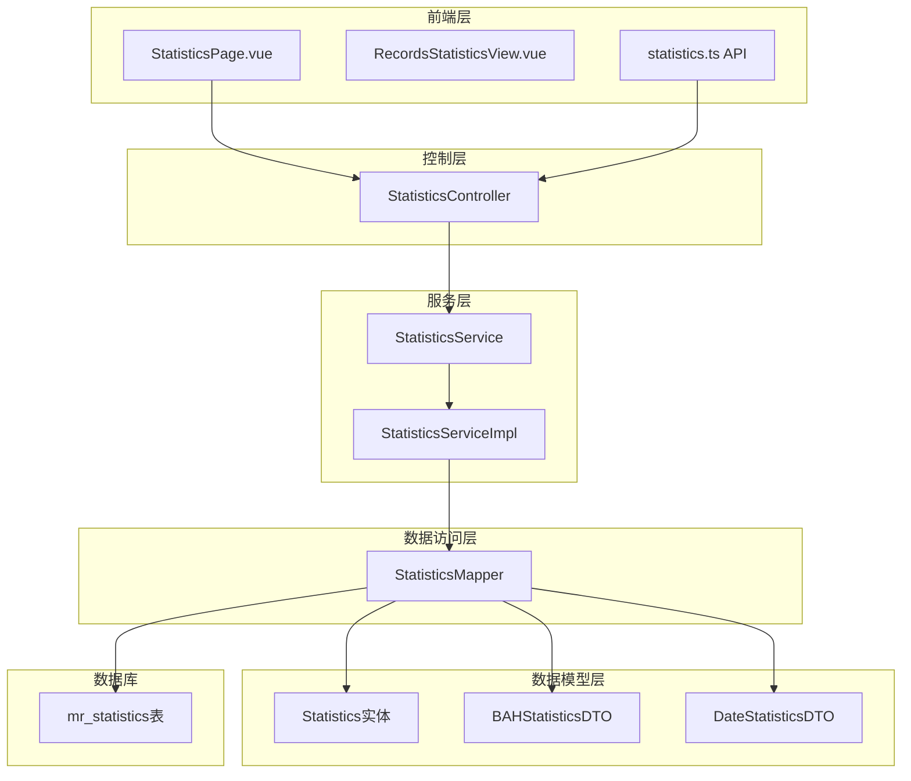
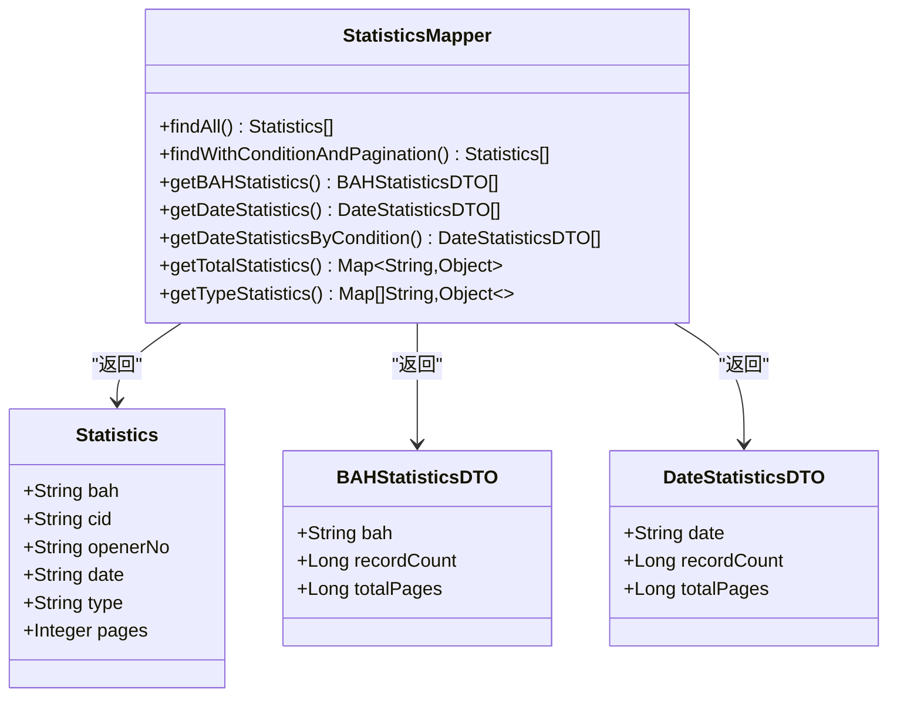
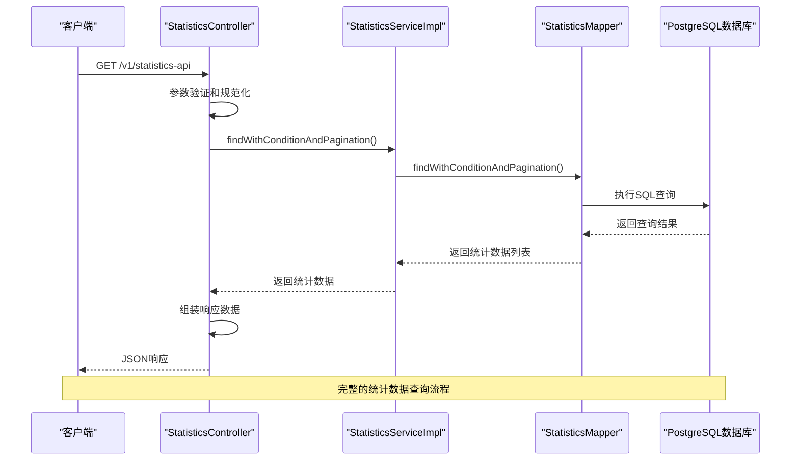
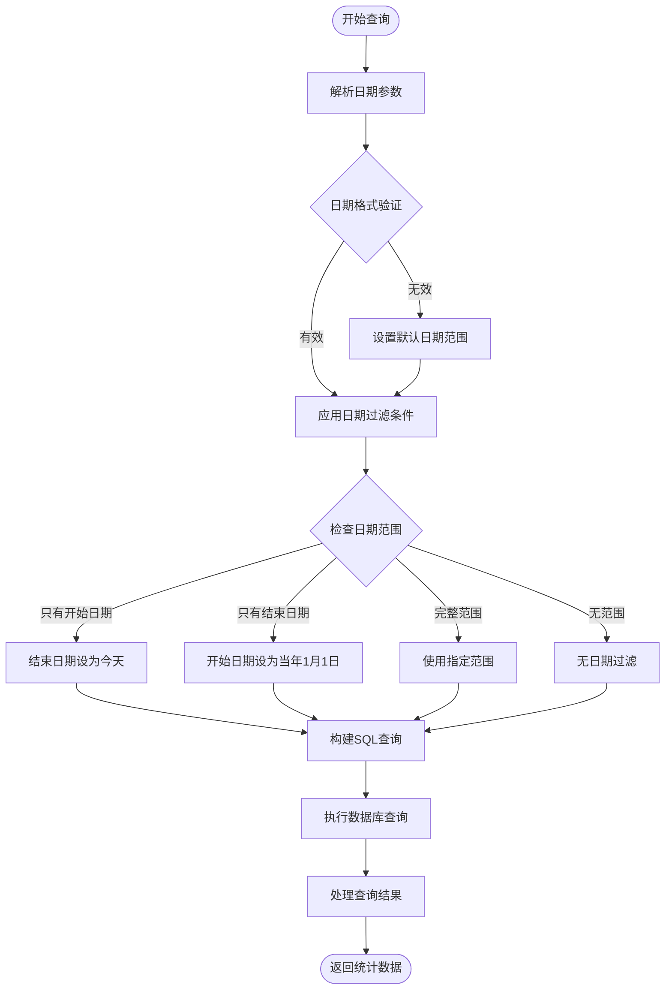
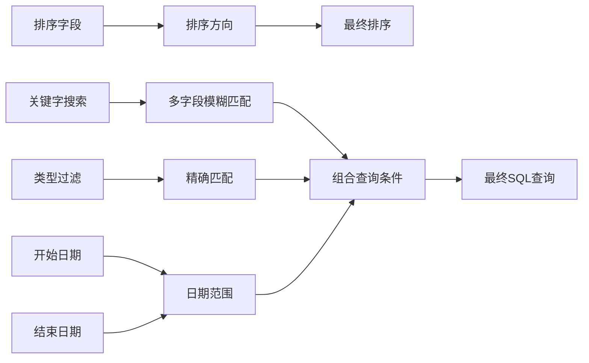
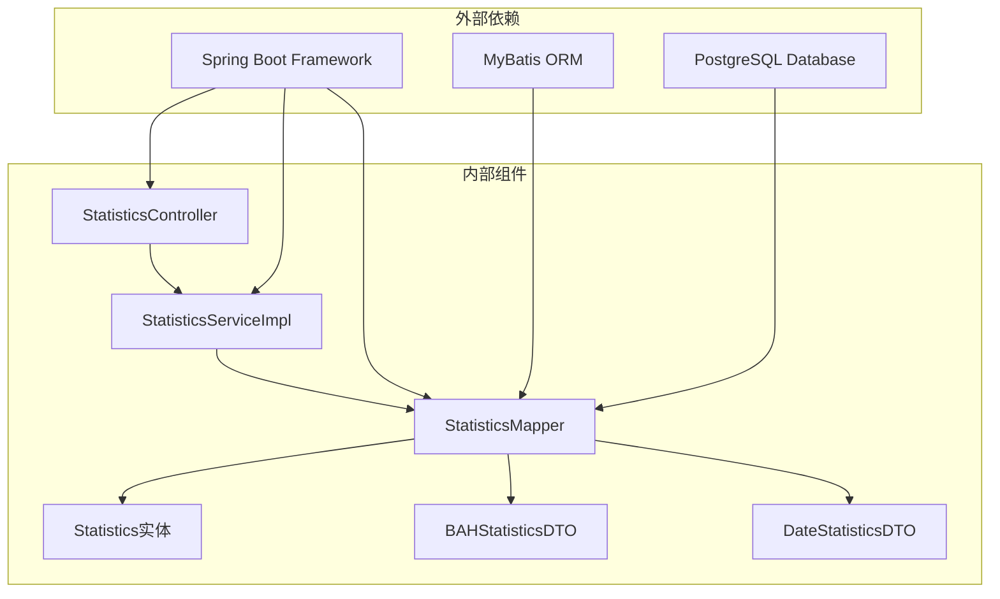
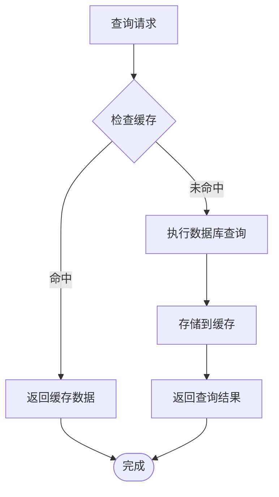
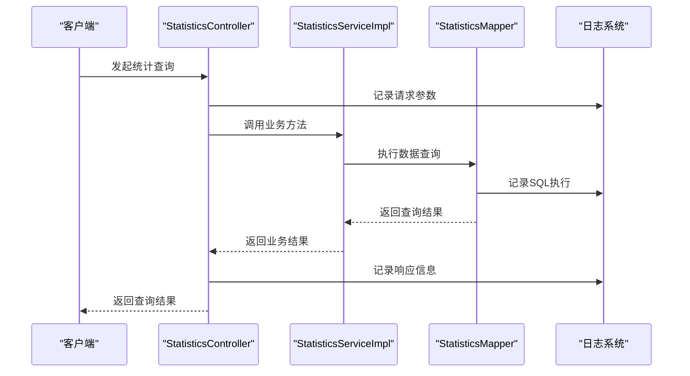

# 统计数据Mapper技术文档

<cite>
**本文档引用的文件**
- [StatisticsMapper.java](file://backend-repo/src/main/java/com/zjcxph/imgapi/mapper/StatisticsMapper.java)
- [StatisticsService.java](file://backend-repo/src/main/java/com/zjcxph/imgapi/service/StatisticsService.java)
- [StatisticsServiceImpl.java](file://backend-repo/src/main/java/com/zjcxph/imgapi/service/impl/StatisticsServiceImpl.java)
- [StatisticsController.java](file://backend-repo/src/main/java/com/zjcxph/imgapi/controller/StatisticsController.java)
- [Statistics.java](file://backend-repo/src/main/java/com/zjcxph/imgapi/entity/Statistics.java)
- [BAHStatisticsDTO.java](file://backend-repo/src/main/java/com/zjcxph/imgapi/dto/resp/BAHStatisticsDTO.java)
- [DateStatisticsDTO.java](file://backend-repo/src/main/java/com/zjcxph/imgapi/dto/resp/DateStatisticsDTO.java)
- [schema.sql](file://mrr-db/schema.sql)
- [StatisticsTest.java](file://backend-repo/src/test/java/com/zjcxph/imgapi/StatisticsTest.java)
- [application.properties](file://backend-repo/src/main/resources/application.properties)
- [statistics.ts](file://frontend-repo/src/api/statistics.ts)
</cite>

## 目录
1. [简介](#简介)
2. [项目结构](#项目结构)
3. [核心组件](#核心组件)
4. [架构概览](#架构概览)
5. [详细组件分析](#详细组件分析)
6. [依赖关系分析](#依赖关系分析)
7. [性能考虑](#性能考虑)
8. [故障排除指南](#故障排除指南)
9. [结论](#结论)

## 简介

统计数据Mapper是MRR（Medical Record Repository）系统中的核心组件，负责处理病案统计相关的数据查询和聚合操作。该组件基于MyBatis框架实现，提供了丰富的统计数据查询功能，包括分页查询、条件过滤、时间维度统计、类型分类统计等高级功能。

系统主要围绕`mr_statistics`表构建，该表存储了病案记录的基本信息，包括病案号(bah)、患者ID(cid)、操作员编号(openerno)、日期(date)、类型(type)和页数(pages)等字段。通过StatisticsMapper，系统能够高效地生成各种统计报表和仪表板数据。

## 项目结构

统计数据模块采用标准的三层架构设计，遵循Spring Boot的最佳实践：

**图表来源**
- [StatisticsController.java:1-281](file://backend-repo/src/main/java/com/zjcxph/imgapi/controller/StatisticsController.java#L1-L281)
- [StatisticsService.java:1-56](file://backend-repo/src/main/java/com/zjcxph/imgapi/service/StatisticsService.java#L1-L56)
- [StatisticsMapper.java:1-168](file://backend-repo/src/main/java/com/zjcxph/imgapi/mapper/StatisticsMapper.java#L1-L168)

**章节来源**
- [StatisticsController.java:1-281](file://backend-repo/src/main/java/com/zjcxph/imgapi/controller/StatisticsController.java#L1-L281)
- [StatisticsService.java:1-56](file://backend-repo/src/main/java/com/zjcxph/imgapi/service/StatisticsService.java#L1-L56)
- [StatisticsMapper.java:1-168](file://backend-repo/src/main/java/com/zjcxph/imgapi/mapper/StatisticsMapper.java#L1-L168)

## 核心组件

### 数据模型设计

系统采用简洁而有效的数据模型设计，确保统计查询的高效性和准确性：

**图表来源**
- [Statistics.java:1-74](file://backend-repo/src/main/java/com/zjcxph/imgapi/entity/Statistics.java#L1-L74)
- [BAHStatisticsDTO.java:1-47](file://backend-repo/src/main/java/com/zjcxph/imgapi/dto/resp/BAHStatisticsDTO.java#L1-L47)
- [DateStatisticsDTO.java:1-47](file://backend-repo/src/main/java/com/zjcxph/imgapi/dto/resp/DateStatisticsDTO.java#L1-L47)
- [StatisticsMapper.java:14-167](file://backend-repo/src/main/java/com/zjcxph/imgapi/mapper/StatisticsMapper.java#L14-L167)

### SQL聚合函数使用

StatisticsMapper实现了多种SQL聚合查询模式，充分利用了PostgreSQL的聚合功能：

| 聚合类型 | SQL函数 | 描述 | 性能特征 |
|---------|--------|------|----------|
| 分组统计 | GROUP BY | 按病案号或日期分组 | O(n log n) |
| 计数统计 | COUNT(*) | 统计记录总数 | O(n) |
| 求和统计 | SUM(pages) | 计算总页数 | O(n) |
| 去重计数 | COUNT(DISTINCT bah) | 统计唯一病案号数量 | O(n) |
| 条件过滤 | WHERE + AND/OR | 多条件组合查询 | O(n) |

**章节来源**
- [StatisticsMapper.java:116-166](file://backend-repo/src/main/java/com/zjcxph/imgapi/mapper/StatisticsMapper.java#L116-L166)

## 架构概览

统计数据系统的整体架构体现了清晰的分层设计和职责分离：

**图表来源**
- [StatisticsController.java:43-109](file://backend-repo/src/main/java/com/zjcxph/imgapi/controller/StatisticsController.java#L43-L109)
- [StatisticsServiceImpl.java:33-46](file://backend-repo/src/main/java/com/zjcxph/imgapi/service/impl/StatisticsServiceImpl.java#L33-L46)
- [StatisticsMapper.java:24-72](file://backend-repo/src/main/java/com/zjcxph/imgapi/mapper/StatisticsMapper.java#L24-L72)

### 时间维度处理

系统对时间维度的处理采用了灵活而高效的策略：

**图表来源**
- [StatisticsController.java:172-186](file://backend-repo/src/main/java/com/zjcxph/imgapi/controller/StatisticsController.java#L172-L186)

**章节来源**
- [StatisticsController.java:160-187](file://backend-repo/src/main/java/com/zjcxph/imgapi/controller/StatisticsController.java#L160-L187)

## 详细组件分析

### StatisticsMapper接口设计

StatisticsMapper作为数据访问层的核心接口，设计了全面的统计查询方法：

#### 基础查询方法

| 方法名 | 参数 | 返回值 | 功能描述 |
|-------|------|--------|----------|
| findAll | 无 | List<Statistics> | 查询所有统计数据 |
| findAllWithPagination | offset, limit | List<Statistics> | 分页查询所有统计数据 |
| findByBah | bah | List<Statistics> | 根据病案号查询 |
| findByDate | date | List<Statistics> | 根据日期查询 |

#### 高级统计方法

| 方法名 | 参数 | 返回值 | 功能描述 |
|-------|------|--------|----------|
| getBAHStatistics | 无 | List<BAHStatisticsDTO> | 按病案号统计 |
| getDateStatistics | 无 | List<DateStatisticsDTO> | 按日期统计 |
| getDateStatisticsByCondition | startDate, endDate, type | List<DateStatisticsDTO> | 条件日期统计 |
| getTotalStatistics | 无 | Map<String, Object> | 总体统计信息 |
| getTypeStatistics | 无 | List<Map<String, Object>> | 类型统计 |

**章节来源**
- [StatisticsMapper.java:16-167](file://backend-repo/src/main/java/com/zjcxph/imgapi/mapper/StatisticsMapper.java#L16-L167)

### 统计计算逻辑

#### 病案号统计逻辑

系统通过以下步骤实现病案号统计：

1. **数据分组**：使用`GROUP BY bah`按病案号分组
2. **记录计数**：使用`COUNT(*)`统计每个病案号的记录数量
3. **页数汇总**：使用`SUM(pages)`计算每个病案号的总页数
4. **结果排序**：按病案号升序排列

#### 日期统计逻辑

日期统计采用类似的方法，但针对时间维度：

1. **日期分组**：按日期字段进行分组
2. **时间序列生成**：确保连续日期的完整性
3. **统计指标计算**：同时计算记录数和总页数
4. **趋势分析**：支持按时间范围的条件查询

**章节来源**
- [StatisticsMapper.java:116-151](file://backend-repo/src/main/java/com/zjcxph/imgapi/mapper/StatisticsMapper.java#L116-L151)

### 查询条件处理

StatisticsMapper支持复杂的动态查询条件：

**图表来源**
- [StatisticsMapper.java:24-72](file://backend-repo/src/main/java/com/zjcxph/imgapi/mapper/StatisticsMapper.java#L24-L72)

**章节来源**
- [StatisticsMapper.java:24-106](file://backend-repo/src/main/java/com/zjcxph/imgapi/mapper/StatisticsMapper.java#L24-L106)

## 依赖关系分析

### 组件间依赖关系

**图表来源**
- [StatisticsController.java:37-41](file://backend-repo/src/main/java/com/zjcxph/imgapi/controller/StatisticsController.java#L37-L41)
- [StatisticsServiceImpl.java:16-20](file://backend-repo/src/main/java/com/zjcxph/imgapi/service/impl/StatisticsServiceImpl.java#L16-L20)
- [StatisticsMapper.java:3-8](file://backend-repo/src/main/java/com/zjcxph/imgapi/mapper/StatisticsMapper.java#L3-L8)

### 数据库表结构

系统基于以下数据库表结构：

| 表名 | 字段 | 类型 | 约束 | 描述 |
|------|------|------|------|------|
| mr_statistics | bah | TEXT |  | 病案号 |
| mr_statistics | cid | TEXT |  | 患者ID |
| mr_statistics | openerno | TEXT |  | 操作员编号 |
| mr_statistics | date | TEXT |  | 日期字符串 |
| mr_statistics | type | TEXT |  | 类型标识 |
| mr_statistics | pages | INTEGER |  | 页数 |

**章节来源**
- [schema.sql:40-48](file://mrr-db/schema.sql#L40-L48)

## 性能考虑

### SQL查询优化策略

#### 索引建议

基于当前查询模式，建议在以下字段上建立索引：

1. **高频查询字段**：
   - `bah`：用于病案号查询
   - `date`：用于日期查询
   - `type`：用于类型过滤

2. **复合索引建议**：
   - `(bah, date)`：用于病案号+日期的联合查询
   - `(date, type)`：用于日期+类型的联合过滤

#### 查询性能优化

| 优化策略 | 实现方式 | 性能收益 |
|----------|----------|----------|
| 分页查询 | 使用LIMIT/OFFSET | 减少内存占用 |
| 条件过滤 | 动态WHERE子句 | 提高查询精度 |
| 排序优化 | 合理的ORDER BY | 优化结果集排序 |
| 缓存策略 | 结果集缓存 | 减少重复查询 |

### 缓存机制

虽然当前实现未包含显式的缓存机制，但可以考虑以下缓存策略：

#### 应用层缓存

#### 缓存策略选择

| 缓存类型 | 适用场景 | 更新策略 |
|----------|----------|----------|
| LRU缓存 | 频繁访问的统计数据 | TTL过期 |
| 分区缓存 | 按时间维度的统计数据 | 按日期分区 |
| 预热缓存 | 热点查询数据 | 启动时预加载 |

**章节来源**
- [application.properties:10-22](file://backend-repo/src/main/resources/application.properties#L10-L22)

## 故障排除指南

### 常见问题及解决方案

#### 数据类型转换错误

**问题描述**：日期字符串与数据库格式不匹配导致查询失败

**解决方案**：
1. 在SQL中使用`REPLACE(date, '/', '-')`进行格式转换
2. 在Java端进行严格的日期格式验证
3. 提供默认的日期范围处理逻辑

#### 查询性能问题

**问题描述**：大数据量查询响应缓慢

**解决方案**：
1. 实施分页查询限制单页最大记录数
2. 优化SQL查询条件，避免全表扫描
3. 考虑添加适当的数据库索引

#### 内存溢出问题

**问题描述**：一次性查询大量数据导致内存不足

**解决方案**：
1. 设置合理的分页大小限制
2. 实施流式查询处理大数据集
3. 优化查询结果集的大小

**章节来源**
- [StatisticsController.java:66-72](file://backend-repo/src/main/java/com/zjcxph/imgapi/controller/StatisticsController.java#L66-L72)

### 日志监控

系统提供了详细的日志记录机制：

**图表来源**
- [StatisticsController.java:63-64](file://backend-repo/src/main/java/com/zjcxph/imgapi/controller/StatisticsController.java#L63-L64)
- [StatisticsServiceImpl.java:69-71](file://backend-repo/src/main/java/com/zjcxph/imgapi/service/impl/StatisticsServiceImpl.java#L69-L71)

**章节来源**
- [StatisticsController.java:35-41](file://backend-repo/src/main/java/com/zjcxph/imgapi/controller/StatisticsController.java#L35-L41)

## 结论

StatisticsMapper作为MRR系统的核心统计数据组件，展现了优秀的架构设计和实现质量。其主要特点包括：

### 技术优势

1. **清晰的分层设计**：严格遵循MVC模式，职责分离明确
2. **灵活的查询能力**：支持复杂的动态条件查询和分页处理
3. **高效的统计算法**：合理运用SQL聚合函数，确保查询性能
4. **完善的错误处理**：提供全面的参数验证和异常处理机制

### 功能特性

1. **多维度统计**：支持按病案号、日期、类型等多个维度进行统计
2. **时间范围查询**：灵活的时间范围过滤和默认值处理
3. **报表生成功能**：提供完整的统计报表数据结构
4. **仪表板集成**：支持综合统计面板的数据需求

### 改进建议

1. **缓存机制**：考虑引入应用层缓存减少重复查询
2. **索引优化**：为高频查询字段建立合适的数据库索引
3. **异步处理**：对于大数据量统计查询考虑异步处理方案
4. **监控告警**：增加查询性能监控和异常告警机制

该组件为整个MRR系统的数据分析和报表展示提供了坚实的基础，为后续的功能扩展和性能优化奠定了良好的技术基础。