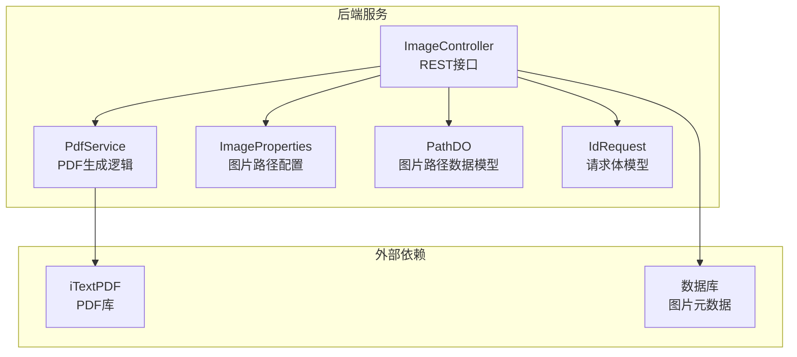
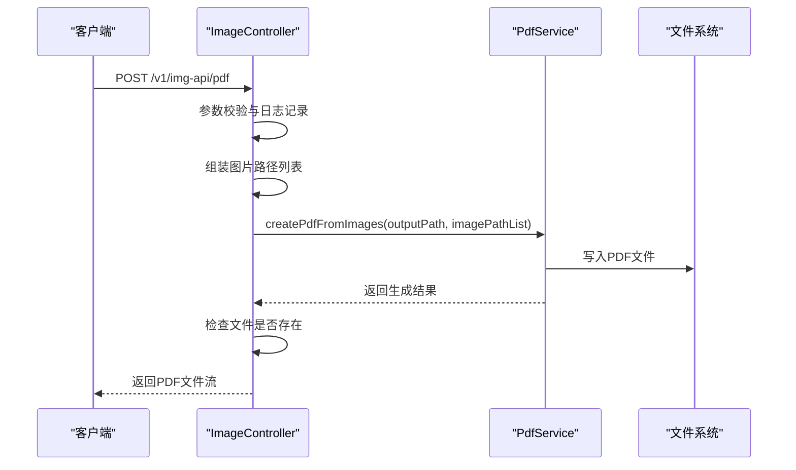
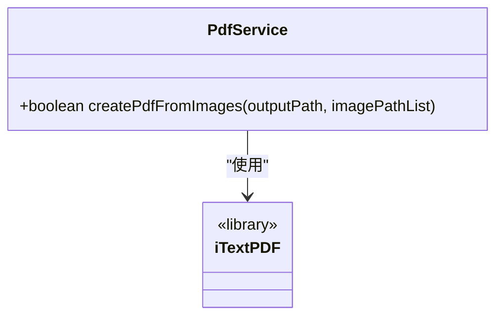
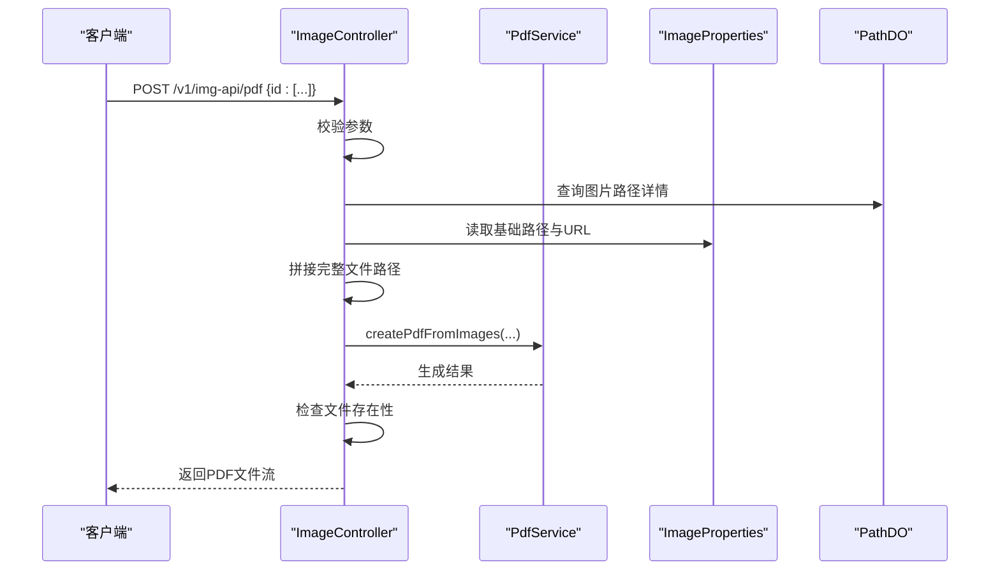
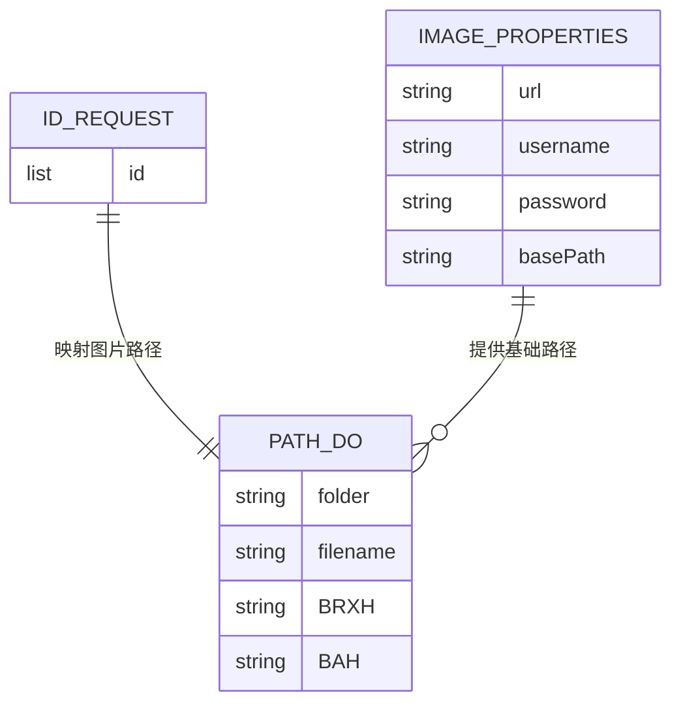
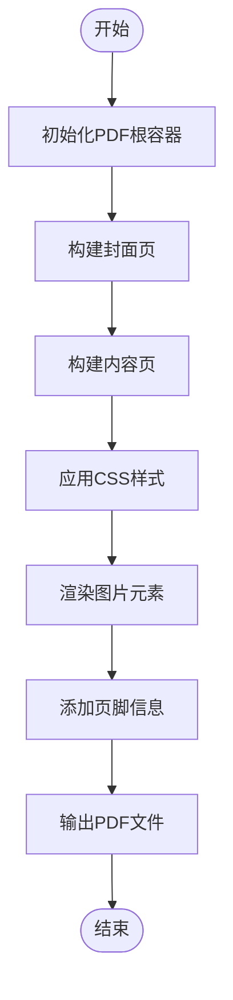
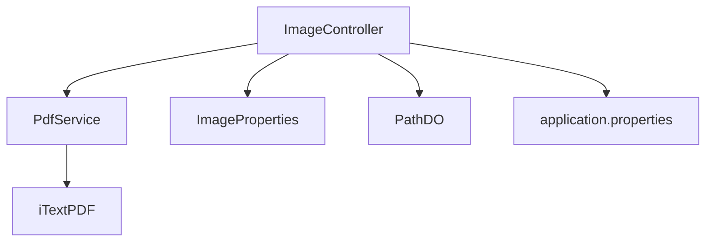

# PDF处理服务

<cite>
**本文引用的文件**
- [PdfService.java](file://backend-repo/src/main/java/com/zjcxph/imgapi/service/PdfService.java)
- [ImageController.java](file://backend-repo/src/main/java/com/zjcxph/imgapi/controller/ImageController.java)
- [ImageProperties.java](file://backend-repo/src/main/java/com/zjcxph/imgapi/config/ImageProperties.java)
- [PathDO.java](file://backend-repo/src/main/java/com/zjcxph/imgapi/entity/PathDO.java)
- [IdRequest.java](file://backend-repo/src/main/java/com/zjcxph/imgapi/dto/req/IdRequest.java)
- [pom.xml](file://backend-repo/pom.xml)
- [application.properties](file://backend-repo/src/main/resources/application.properties)
- [BatchDownloadRequest.java](file://backend-repo/src/main/java/com/zjcxph/imgapi/dto/req/BatchDownloadRequest.java)
- [printUtils.ts](file://frontend-repo/src/utils/printUtils.ts)
- [archivePdf.ts](file://frontend-repo/src/utils/archivePdf.ts)
- [SKILL.md](file://.trae/skills/nutrient-document-processing/SKILL.md)
</cite>

## 目录
1. [简介](#简介)
2. [项目结构](#项目结构)
3. [核心组件](#核心组件)
4. [架构概览](#架构概览)
5. [详细组件分析](#详细组件分析)
6. [依赖分析](#依赖分析)
7. [性能考虑](#性能考虑)
8. [故障排除指南](#故障排除指南)
9. [结论](#结论)
10. [附录](#附录)

## 简介
本技术文档面向MRR（Medical Record Repository）项目的PDF处理服务，重点阐述其在医疗影像管理系统中的作用与重要性。PDF服务负责将存储于后端的数据源中的医学影像图片批量生成PDF文档，支持病案号批量导出、PDF下载以及后续的PDF转换、合并、拆分等扩展能力。该服务通过Spring Boot后端提供REST接口，并结合前端工具链实现完整的PDF生成与交付流程。

PDF服务在医疗影像管理系统中的关键价值体现在：
- 规范化归档：将分散的医学影像图片统一输出为标准PDF，便于长期保存与合规管理
- 提升检索效率：以PDF形式呈现病案资料，便于电子病历系统的检索与调阅
- 支持打印与共享：生成的PDF可直接打印或通过系统分享给相关医护人员
- 安全与权限控制：结合系统认证与授权机制，确保PDF访问的安全性

## 项目结构
后端采用Spring Boot架构，PDF处理服务位于后端模块中，主要涉及以下文件：
- PdfService：PDF生成的核心业务逻辑
- ImageController：对外提供PDF生成的HTTP接口
- 配置类与实体类：支撑PDF生成所需的路径、凭证与数据模型
- 依赖管理：基于Maven引入iTextPDF库
- 前端工具：提供PDF导出与归档的前端实现参考

**图表来源**
- [ImageController.java:36-52](file://backend-repo/src/main/java/com/zjcxph/imgapi/controller/ImageController.java#L36-L52)
- [PdfService.java:12-36](file://backend-repo/src/main/java/com/zjcxph/imgapi/service/PdfService.java#L12-L36)
- [ImageProperties.java:5-45](file://backend-repo/src/main/java/com/zjcxph/imgapi/config/ImageProperties.java#L5-L45)
- [PathDO.java:5-47](file://backend-repo/src/main/java/com/zjcxph/imgapi/entity/PathDO.java#L5-L47)
- [IdRequest.java:7-23](file://backend-repo/src/main/java/com/zjcxph/imgapi/dto/req/IdRequest.java#L7-L23)

**章节来源**
- [ImageController.java:36-52](file://backend-repo/src/main/java/com/zjcxph/imgapi/controller/ImageController.java#L36-L52)
- [PdfService.java:12-36](file://backend-repo/src/main/java/com/zjcxph/imgapi/service/PdfService.java#L12-L36)
- [ImageProperties.java:5-45](file://backend-repo/src/main/java/com/zjcxph/imgapi/config/ImageProperties.java#L5-L45)
- [PathDO.java:5-47](file://backend-repo/src/main/java/com/zjcxph/imgapi/entity/PathDO.java#L5-L47)
- [IdRequest.java:7-23](file://backend-repo/src/main/java/com/zjcxph/imgapi/dto/req/IdRequest.java#L7-L23)

## 核心组件
- PdfService：封装PDF生成逻辑，接收输出路径与图片路径列表，逐个将图片添加到PDF中并关闭文档流
- ImageController：提供PDF生成接口，负责参数校验、路径拼接、调用PdfService生成PDF、文件存在性检查与响应返回
- ImageProperties：读取图片URL、基础路径、用户名、密码等配置项
- PathDO：封装图片所在目录、文件名及病案相关信息的数据模型
- IdRequest：定义PDF生成接口的请求体结构，包含图片ID列表
- 前端工具：printUtils.ts与archivePdf.ts提供PDF导出与归档的前端实现思路

**章节来源**
- [PdfService.java:12-36](file://backend-repo/src/main/java/com/zjcxph/imgapi/service/PdfService.java#L12-L36)
- [ImageController.java:85-166](file://backend-repo/src/main/java/com/zjcxph/imgapi/controller/ImageController.java#L85-L166)
- [ImageProperties.java:5-45](file://backend-repo/src/main/java/com/zjcxph/imgapi/config/ImageProperties.java#L5-L45)
- [PathDO.java:5-47](file://backend-repo/src/main/java/com/zjcxph/imgapi/entity/PathDO.java#L5-L47)
- [IdRequest.java:7-23](file://backend-repo/src/main/java/com/zjcxph/imgapi/dto/req/IdRequest.java#L7-L23)
- [printUtils.ts:108-167](file://frontend-repo/src/utils/printUtils.ts#L108-L167)
- [archivePdf.ts:1-240](file://frontend-repo/src/utils/archivePdf.ts#L1-240)

## 架构概览
PDF处理服务采用典型的三层架构：
- 表现层：ImageController暴露REST接口，接收客户端请求并返回PDF文件
- 业务层：PdfService执行PDF生成的具体操作
- 数据与配置层：ImageProperties提供图片存储路径与访问凭证；PathDO承载图片元数据；IdRequest定义输入参数

**图表来源**
- [ImageController.java:85-166](file://backend-repo/src/main/java/com/zjcxph/imgapi/controller/ImageController.java#L85-L166)
- [PdfService.java:14-35](file://backend-repo/src/main/java/com/zjcxph/imgapi/service/PdfService.java#L14-L35)

**章节来源**
- [ImageController.java:85-166](file://backend-repo/src/main/java/com/zjcxph/imgapi/controller/ImageController.java#L85-L166)
- [PdfService.java:14-35](file://backend-repo/src/main/java/com/zjcxph/imgapi/service/PdfService.java#L14-L35)

## 详细组件分析

### PdfService组件分析
PdfService是PDF生成的核心实现，职责包括：
- 接收输出路径与图片路径列表
- 使用iTextPDF创建PdfDocument与Document对象
- 遍历图片路径列表，将每张图片作为Image元素添加到PDF中
- 关闭Document并返回生成状态

**图表来源**
- [PdfService.java:12-36](file://backend-repo/src/main/java/com/zjcxph/imgapi/service/PdfService.java#L12-L36)

**章节来源**
- [PdfService.java:12-36](file://backend-repo/src/main/java/com/zjcxph/imgapi/service/PdfService.java#L12-L36)

### ImageController组件分析
ImageController提供PDF生成接口，关键流程如下：
- 接收IdRequest请求体，提取图片ID列表
- 调用扫描服务获取图片路径详情，拼接完整文件路径
- 调用PdfService生成PDF至临时目录
- 检查生成的PDF文件是否存在，设置响应头并返回文件流

**图表来源**
- [ImageController.java:85-166](file://backend-repo/src/main/java/com/zjcxph/imgapi/controller/ImageController.java#L85-L166)
- [ImageProperties.java:5-45](file://backend-repo/src/main/java/com/zjcxph/imgapi/config/ImageProperties.java#L5-L45)
- [PathDO.java:5-47](file://backend-repo/src/main/java/com/zjcxph/imgapi/entity/PathDO.java#L5-L47)

**章节来源**
- [ImageController.java:85-166](file://backend-repo/src/main/java/com/zjcxph/imgapi/controller/ImageController.java#L85-L166)
- [ImageProperties.java:5-45](file://backend-repo/src/main/java/com/zjcxph/imgapi/config/ImageProperties.java#L5-L45)
- [PathDO.java:5-47](file://backend-repo/src/main/java/com/zjcxph/imgapi/entity/PathDO.java#L5-L47)

### 数据模型与请求体
- IdRequest：定义PDF生成接口的请求体，包含图片ID列表
- PathDO：封装图片所在目录、文件名及病案相关信息
- ImageProperties：提供图片URL、基础路径、用户名、密码等配置项

**图表来源**
- [IdRequest.java:7-23](file://backend-repo/src/main/java/com/zjcxph/imgapi/dto/req/IdRequest.java#L7-L23)
- [PathDO.java:5-47](file://backend-repo/src/main/java/com/zjcxph/imgapi/entity/PathDO.java#L5-L47)
- [ImageProperties.java:5-45](file://backend-repo/src/main/java/com/zjcxph/imgapi/config/ImageProperties.java#L5-L45)

**章节来源**
- [IdRequest.java:7-23](file://backend-repo/src/main/java/com/zjcxph/imgapi/dto/req/IdRequest.java#L7-L23)
- [PathDO.java:5-47](file://backend-repo/src/main/java/com/zjcxph/imgapi/entity/PathDO.java#L5-L47)
- [ImageProperties.java:5-45](file://backend-repo/src/main/java/com/zjcxph/imgapi/config/ImageProperties.java#L5-L45)

### 前端PDF导出与归档
前端提供了PDF导出与归档的实现思路：
- printUtils.ts：定义了exportToPDF函数的占位实现，提示需要集成PDF生成库（如jsPDF或PDFKit）
- archivePdf.ts：实现了基于DOM渲染的PDF归档导出，包含样式构建、封面页、内容页与页脚等

**图表来源**
- [printUtils.ts:108-167](file://frontend-repo/src/utils/printUtils.ts#L108-L167)
- [archivePdf.ts:226-240](file://frontend-repo/src/utils/archivePdf.ts#L226-L240)

**章节来源**
- [printUtils.ts:108-167](file://frontend-repo/src/utils/printUtils.ts#L108-L167)
- [archivePdf.ts:1-240](file://frontend-repo/src/utils/archivePdf.ts#L1-240)

## 依赖分析
PDF处理服务的依赖关系主要体现在：
- PdfService依赖iTextPDF库进行PDF生成
- ImageController依赖PdfService、ImageProperties与PathDO等组件
- 应用配置通过application.properties提供图片路径与访问凭证

**图表来源**
- [pom.xml:94-103](file://backend-repo/pom.xml#L94-L103)
- [ImageController.java:44-51](file://backend-repo/src/main/java/com/zjcxph/imgapi/controller/ImageController.java#L44-L51)
- [application.properties:30-33](file://backend-repo/src/main/resources/application.properties#L30-L33)

**章节来源**
- [pom.xml:94-103](file://backend-repo/pom.xml#L94-L103)
- [ImageController.java:44-51](file://backend-repo/src/main/java/com/zjcxph/imgapi/controller/ImageController.java#L44-L51)
- [application.properties:30-33](file://backend-repo/src/main/resources/application.properties#L30-L33)

## 性能考虑
- I/O优化：PDF生成过程中对磁盘I/O较为敏感，建议：
  - 将临时PDF输出目录置于高性能磁盘或SSD
  - 控制并发生成数量，避免同时写入过多PDF导致I/O争用
- 内存管理：大量图片合并时需注意内存占用，建议：
  - 分批处理图片列表，避免一次性加载过多图片
  - 及时释放PDF文档资源，确保Document正确关闭
- 网络与缓存：图片访问可通过配置缓存头提升响应速度
- 压缩与格式：对于高分辨率医学影像，可考虑在生成PDF前进行适当的图像压缩或格式转换，以平衡质量与体积

## 故障排除指南
常见问题与排查步骤：
- 生成失败：检查PdfService异常捕获与日志输出，确认图片路径是否有效
- 文件不存在：确认PDF生成路径与文件名，检查临时目录权限
- 参数错误：验证IdRequest中的ID列表是否为空或格式不正确
- 权限不足：核对ImageProperties中的用户名与密码配置，确保对图片存储路径有访问权限

**章节来源**
- [PdfService.java:29-31](file://backend-repo/src/main/java/com/zjcxph/imgapi/service/PdfService.java#L29-L31)
- [ImageController.java:125-132](file://backend-repo/src/main/java/com/zjcxph/imgapi/controller/ImageController.java#L125-L132)
- [ImageController.java:138-143](file://backend-repo/src/main/java/com/zjcxph/imgapi/controller/ImageController.java#L138-L143)
- [ImageController.java:93-98](file://backend-repo/src/main/java/com/zjcxph/imgapi/controller/ImageController.java#L93-L98)

## 结论
PDF处理服务在MRR医疗影像管理系统中承担着将医学影像图片标准化输出为PDF的关键角色。通过清晰的分层设计与明确的接口规范，服务能够稳定地完成从图片路径解析到PDF生成与交付的全流程。未来可在现有基础上扩展更多PDF处理能力，如转换、合并、拆分、水印与签名等，进一步满足医疗文档管理的多样化需求。

## 附录

### API接口规范（PDF生成）
- 请求方法：POST
- 路径：/v1/img-api/pdf
- 请求体：IdRequest
  - id：图片ID列表
- 成功响应：返回PDF文件流，Content-Type为application/pdf
- 错误响应：
  - 参数错误：400 Bad Request
  - 生成失败：500 Internal Server Error
  - 文件不存在：404 Not Found

**章节来源**
- [ImageController.java:85-166](file://backend-repo/src/main/java/com/zjcxph/imgapi/controller/ImageController.java#L85-L166)
- [IdRequest.java:7-23](file://backend-repo/src/main/java/com/zjcxph/imgapi/dto/req/IdRequest.java#L7-L23)

### 扩展能力与第三方集成
- 文档处理API：可参考Nutrient DWS Processor API进行PDF转换、OCR、脱敏、加水印与数字签名等高级处理
- 建议集成点：
  - 在现有PDF生成流程中增加预处理步骤，利用第三方API优化PDF质量与安全性
  - 对扫描版PDF进行OCR识别，提升检索能力

**章节来源**
- [SKILL.md:1-122](file://.trae/skills/nutrient-document-processing/SKILL.md#L1-L122)