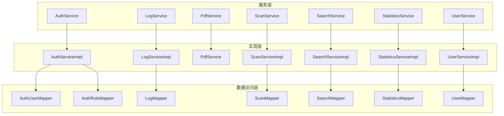
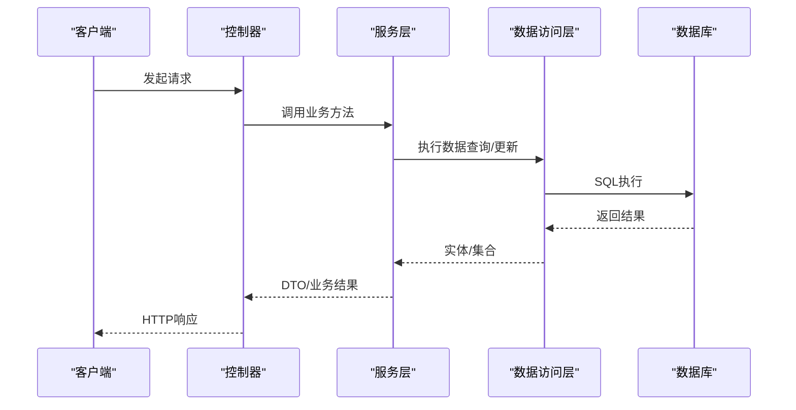
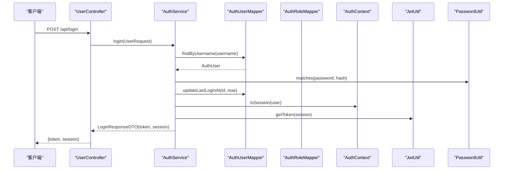
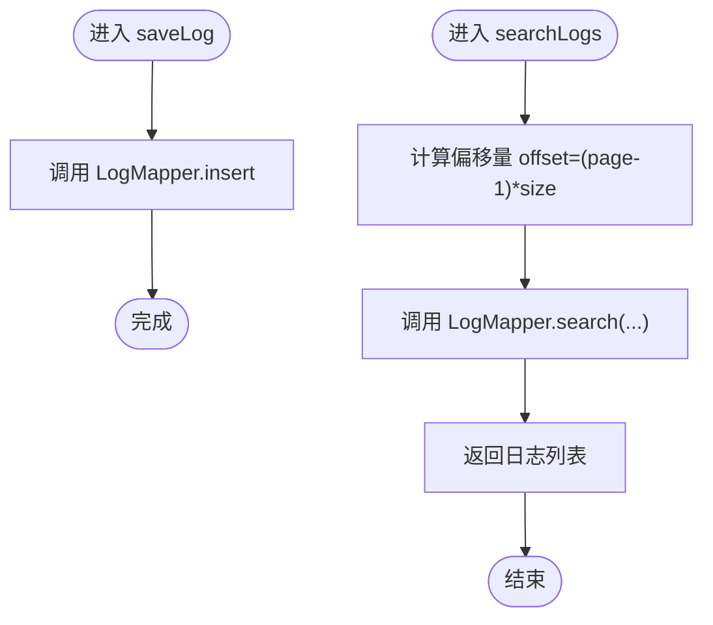
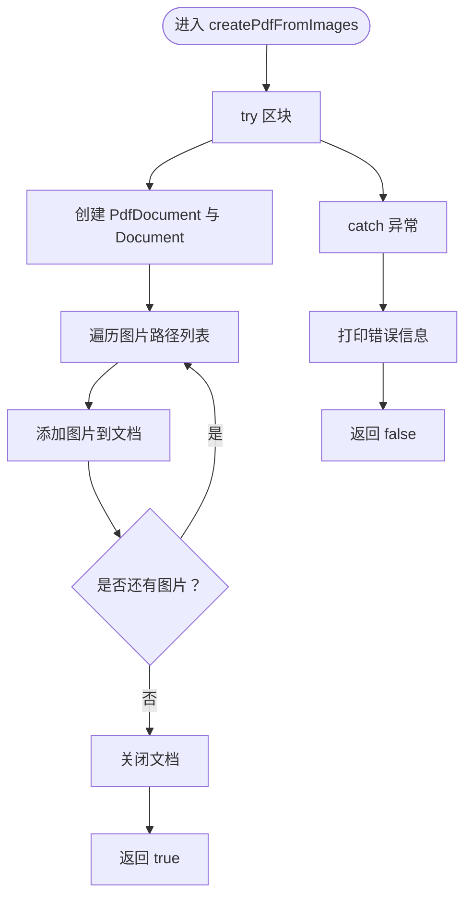
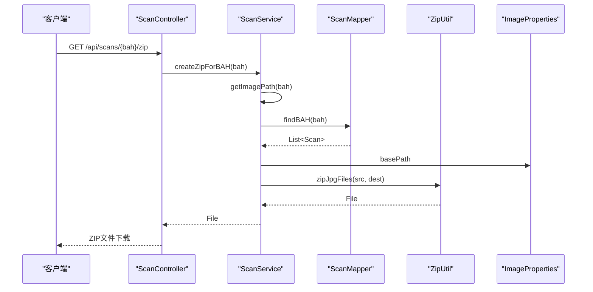
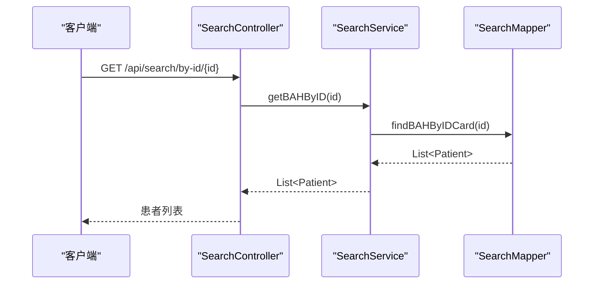
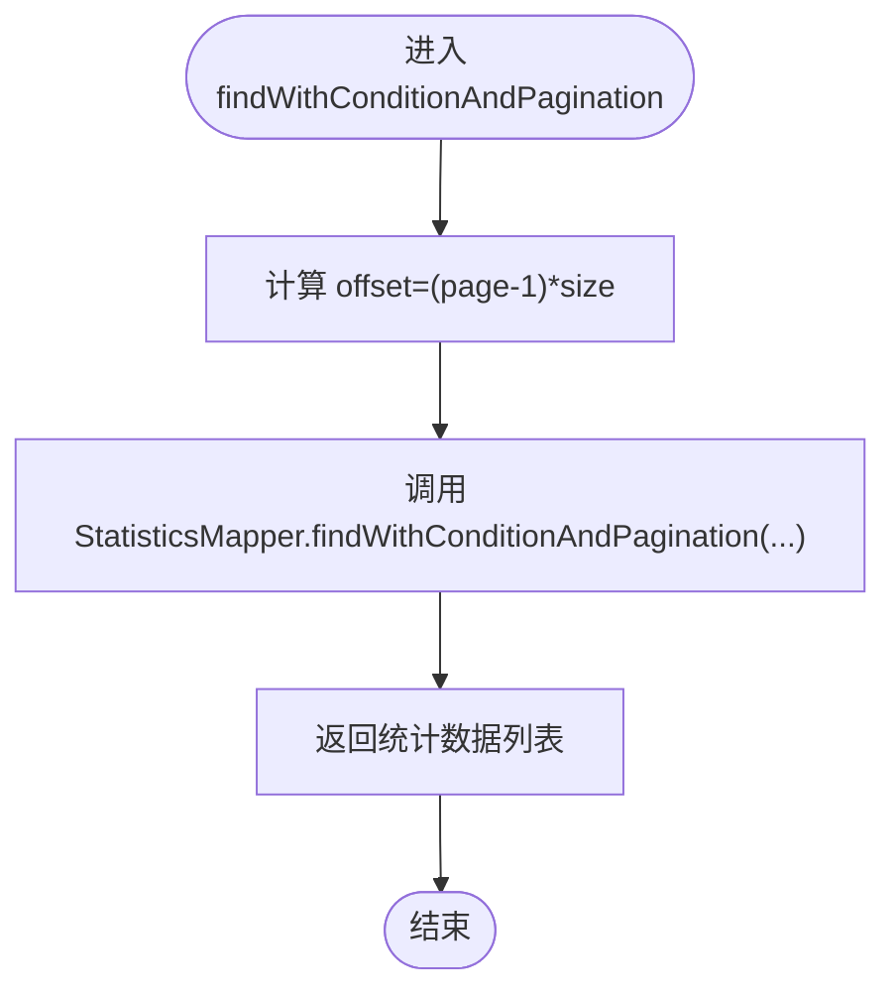
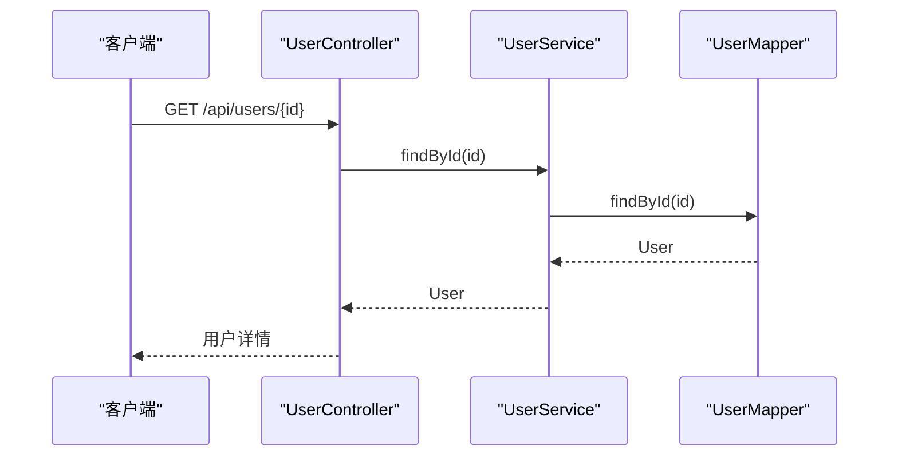
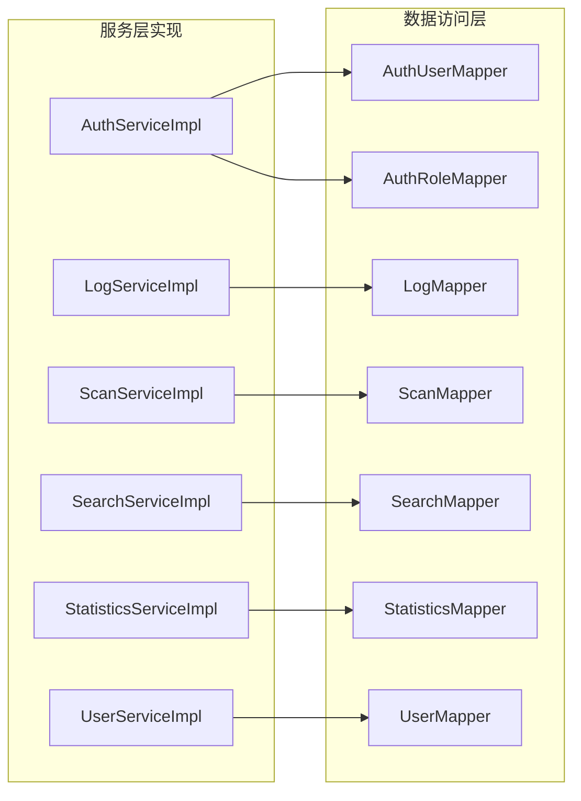

# 服务层架构

<cite>
**本文引用的文件**
- [AuthService.java](file://backend-repo/src/main/java/com/zjcxph/imgapi/service/AuthService.java)
- [AuthServiceImpl.java](file://backend-repo/src/main/java/com/zjcxph/imgapi/service/impl/AuthServiceImpl.java)
- [LogService.java](file://backend-repo/src/main/java/com/zjcxph/imgapi/service/LogService.java)
- [LogServiceImpl.java](file://backend-repo/src/main/java/com/zjcxph/imgapi/service/impl/LogServiceImpl.java)
- [PdfService.java](file://backend-repo/src/main/java/com/zjcxph/imgapi/service/PdfService.java)
- [ScanService.java](file://backend-repo/src/main/java/com/zjcxph/imgapi/service/ScanService.java)
- [ScanServiceImpl.java](file://backend-repo/src/main/java/com/zjcxph/imgapi/service/impl/ScanServiceImpl.java)
- [SearchService.java](file://backend-repo/src/main/java/com/zjcxph/imgapi/service/SearchService.java)
- [SearchServiceImpl.java](file://backend-repo/src/main/java/com/zjcxph/imgapi/service/impl/SearchServiceImpl.java)
- [StatisticsService.java](file://backend-repo/src/main/java/com/zjcxph/imgapi/service/StatisticsService.java)
- [StatisticsServiceImpl.java](file://backend-repo/src/main/java/com/zjcxph/imgapi/service/impl/StatisticsServiceImpl.java)
- [UserService.java](file://backend-repo/src/main/java/com/zjcxph/imgapi/service/UserService.java)
- [UserServiceImpl.java](file://backend-repo/src/main/java/com/zjcxph/imgapi/service/impl/UserServiceImpl.java)
- [AuthUserMapper.java](file://backend-repo/src/main/java/com/zjcxph/imgapi/mapper/AuthUserMapper.java)
- [AuthRoleMapper.java](file://backend-repo/src/main/java/com/zjcxph/imgapi/mapper/AuthRoleMapper.java)
- [LogMapper.java](file://backend-repo/src/main/java/com/zjcxph/imgapi/mapper/LogMapper.java)
- [ScanMapper.java](file://backend-repo/src/main/java/com/zjcxph/imgapi/mapper/ScanMapper.java)
- [SearchMapper.java](file://backend-repo/src/main/java/com/zjcxph/imgapi/mapper/SearchMapper.java)
- [StatisticsMapper.java](file://backend-repo/src/main/java/com/zjcxph/imgapi/mapper/StatisticsMapper.java)
- [UserMapper.java](file://backend-repo/src/main/java/com/zjcxph/imgapi/mapper/UserMapper.java)
- [AuthContext.java](file://backend-repo/src/main/java/com/zjcxph/imgapi/utils/AuthContext.java)
- [JwtUtil.java](file://backend-repo/src/main/java/com/zjcxph/imgapi/utils/JwtUtil.java)
- [PasswordUtil.java](file://backend-repo/src/main/java/com/zjcxph/imgapi/utils/PasswordUtil.java)
- [ZipUtil.java](file://backend-repo/src/main/java/com/zjcxph/imgapi/utils/ZipUtil.java)
- [ImageProperties.java](file://backend-repo/src/main/java/com/zjcxph/imgapi/config/ImageProperties.java)
- [BusinessException.java](file://backend-repo/src/main/java/com/zjcxph/imgapi/exception/BusinessException.java)
- [GlobalExceptionHandler.java](file://backend-repo/src/main/java/com/zjcxph/imgapi/handler/GlobalExceptionHandler.java)
- [AuthorizationInterceptor.java](file://backend-repo/src/main/java/com/zjcxph/imgapi/interceptors/AuthorizationInterceptor.java)
- [LoginInterceptor.java](file://backend-repo/src/main/java/com/zjcxph/imgapi/interceptors/LoginInterceptor.java)
- [LogInterceptor.java](file://backend-repo/src/main/java/com/zjcxph/imgapi/interceptors/LogInterceptor.java)
- [PressureTestService.java](file://backend-repo/src/main/java/com/zjcxph/imgapi/monitoring/PressureTestService.java)
- [PressureTestReport.java](file://backend-repo/src/main/java/com/zjcxph/imgapi/monitoring/PressureTestReport.java)
- [PressureTestRequest.java](file://backend-repo/src/main/java/com/zjcxph/imgapi/monitoring/PressureTestRequest.java)
- [PressureTestSample.java](file://backend-repo/src/main/java/com/zjcxph/imgapi/monitoring/PressureTestSample.java)
- [PressureTestSnapshot.java](file://backend-repo/src/main/java/com/zjcxph/imgapi/monitoring/PressureTestSnapshot.java)
- [LogRetentionCleaner.java](file://backend-repo/src/main/java/com/zjcxph/imgapi/scheduler/LogRetentionCleaner.java)
- [TempZipCleaner.java](file://backend-repo/src/main/java/com/zjcxph/imgapi/scheduler/TempZipCleaner.java)
- [LogRetentionProperties.java](file://backend-repo/src/main/java/com/zjcxph/imgapi/config/LogRetentionProperties.java)
- [Result.java](file://backend-repo/src/main/java/com/zjcxph/imgapi/common/Result.java)
- [AuthSession.java](file://backend-repo/src/main/java/com/zjcxph/imgapi/common/AuthSession.java)
- [LoginResponseDTO.java](file://backend-repo/src/main/java/com/zjcxph/imgapi/dto/resp/LoginResponseDTO.java)
- [AuthUserProfileDTO.java](file://backend-repo/src/main/java/com/zjcxph/imgapi/dto/resp/AuthUserProfileDTO.java)
- [BAHStatisticsDTO.java](file://backend-repo/src/main/java/com/zjcxph/imgapi/dto/resp/BAHStatisticsDTO.java)
- [DateStatisticsDTO.java](file://backend-repo/src/main/java/com/zjcxph/imgapi/dto/resp/DateStatisticsDTO.java)
- [LogRetentionCleanupResult.java](file://backend-repo/src/main/java/com/zjcxph/imgapi/dto/resp/LogRetentionCleanupResult.java)
- [UserRequest.java](file://backend-repo/src/main/java/com/zjcxph/imgapi/dto/req/UserRequest.java)
- [AuthUserUpdateRequest.java](file://backend-repo/src/main/java/com/zjcxph/imgapi/dto/req/AuthUserUpdateRequest.java)
- [ScanRequest.java](file://backend-repo/src/main/java/com/zjcxph/imgapi/dto/req/ScanRequest.java)
- [IdRequest.java](file://backend-repo/src/main/java/com/zjcxph/imgapi/dto/req/IdRequest.java)
- [BatchDownloadRequest.java](file://backend-repo/src/main/java/com/zjcxph/imgapi/dto/req/BatchDownloadRequest.java)
- [ImageRequest.java](file://backend-repo/src/main/java/com/zjcxph/imgapi/dto/req/ImageRequest.java)
- [Log.java](file://backend-repo/src/main/java/com/zjcxph/imgapi/entity/Log.java)
- [AuthUser.java](file://backend-repo/src/main/java/com/zjcxph/imgapi/entity/AuthUser.java)
- [AuthRole.java](file://backend-repo/src/main/java/com/zjcxph/imgapi/entity/AuthRole.java)
- [Scan.java](file://backend-repo/src/main/java/com/zjcxph/imgapi/entity/Scan.java)
- [Statistics.java](file://backend-repo/src/main/java/com/zjcxph/imgapi/entity/Statistics.java)
- [User.java](file://backend-repo/src/main/java/com/zjcxph/imgapi/entity/User.java)
- [Patient.java](file://backend-repo/src/main/java/com/zjcxph/imgapi/entity/Patient.java)
- [PathDO.java](file://backend-repo/src/main/java/com/zjcxph/imgapi/entity/PathDO.java)
- [ControllerIntegrationTest.java](file://backend-repo/src/test/java/com/zjcxph/imgapi/ControllerIntegrationTest.java)
- [PressureTestControllerIntegrationTest.java](file://backend-repo/src/test/java/com/zjcxph/imgapi/PressureTestControllerIntegrationTest.java)
- [PressureTestServiceTest.java](file://backend-repo/src/test/java/com/zjcxph/imgapi/PressureTestServiceTest.java)
- [ScanTest.java](file://backend-repo/src/test/java/com/zjcxph/imgapi/ScanTest.java)
- [SearchControllerTest.java](file://backend-repo/src/test/java/com/zjcxph/imgapi/SearchControllerTest.java)
- [StatisticsTest.java](file://backend-repo/src/test/java/com/zjcxph/imgapi/StatisticsTest.java)
</cite>

## 目录
1. [引言](#引言)
2. [项目结构](#项目结构)
3. [核心组件](#核心组件)
4. [架构概览](#架构概览)
5. [详细组件分析](#详细组件分析)
6. [依赖分析](#依赖分析)
7. [性能考虑](#性能考虑)
8. [故障排除指南](#故障排除指南)
9. [结论](#结论)
10. [附录](#附录)

## 引言
本文件为MRR项目服务层的全面技术文档，重点阐述服务层的业务逻辑封装与事务管理机制，深入分析各服务接口与实现类（AuthService认证服务、LogService日志服务、PdfService PDF处理服务、ScanService扫描服务、SearchService搜索服务、StatisticsService统计服务、UserService用户服务），并记录依赖注入、异常处理与性能优化策略。同时说明服务层与数据访问层的交互模式以及数据传输对象（DTO）的使用方式，并提供服务层单元测试与集成测试的最佳实践。

## 项目结构
后端采用Spring Boot + MyBatis架构，服务层位于com.zjcxph.imgapi.service包下，包含接口与实现类；数据访问层位于com.zjcxph.imgapi.mapper包下；实体、DTO、工具类、拦截器、异常处理器等分布在相应包中。服务层通过构造函数注入Mapper依赖，遵循单一职责原则，实现清晰的业务逻辑封装。

**图表来源**
- [AuthService.java:12-24](file://backend-repo/src/main/java/com/zjcxph/imgapi/service/AuthService.java#L12-L24)
- [AuthServiceImpl.java:26-34](file://backend-repo/src/main/java/com/zjcxph/imgapi/service/impl/AuthServiceImpl.java#L26-L34)
- [LogService.java:7-18](file://backend-repo/src/main/java/com/zjcxph/imgapi/service/LogService.java#L7-L18)
- [LogServiceImpl.java:12-15](file://backend-repo/src/main/java/com/zjcxph/imgapi/service/impl/LogServiceImpl.java#L12-L15)
- [ScanService.java:10-42](file://backend-repo/src/main/java/com/zjcxph/imgapi/service/ScanService.java#L10-L42)
- [ScanServiceImpl.java:15-24](file://backend-repo/src/main/java/com/zjcxph/imgapi/service/impl/ScanServiceImpl.java#L15-L24)
- [SearchService.java:7-10](file://backend-repo/src/main/java/com/zjcxph/imgapi/service/SearchService.java#L7-L10)
- [SearchServiceImpl.java:11-19](file://backend-repo/src/main/java/com/zjcxph/imgapi/service/impl/SearchServiceImpl.java#L11-L19)
- [StatisticsService.java:10-55](file://backend-repo/src/main/java/com/zjcxph/imgapi/service/StatisticsService.java#L10-L55)
- [StatisticsServiceImpl.java:13-20](file://backend-repo/src/main/java/com/zjcxph/imgapi/service/impl/StatisticsServiceImpl.java#L13-L20)
- [UserService.java:5-8](file://backend-repo/src/main/java/com/zjcxph/imgapi/service/UserService.java#L5-L8)
- [UserServiceImpl.java:9-17](file://backend-repo/src/main/java/com/zjcxph/imgapi/service/impl/UserServiceImpl.java#L9-L17)

**章节来源**
- [AuthService.java:1-25](file://backend-repo/src/main/java/com/zjcxph/imgapi/service/AuthService.java#L1-L25)
- [LogService.java:1-19](file://backend-repo/src/main/java/com/zjcxph/imgapi/service/LogService.java#L1-L19)
- [ScanService.java:1-43](file://backend-repo/src/main/java/com/zjcxph/imgapi/service/ScanService.java#L1-L43)
- [SearchService.java:1-11](file://backend-repo/src/main/java/com/zjcxph/imgapi/service/SearchService.java#L1-L11)
- [StatisticsService.java:1-56](file://backend-repo/src/main/java/com/zjcxph/imgapi/service/StatisticsService.java#L1-L56)
- [UserService.java:1-9](file://backend-repo/src/main/java/com/zjcxph/imgapi/service/UserService.java#L1-L9)

## 核心组件
本节概述服务层各组件的职责与交互关系：
- 认证服务：负责用户登录验证、会话构建、用户信息维护与角色权限查询。
- 日志服务：提供访问日志的持久化、查询、统计与清理能力。
- PDF服务：基于iText库进行图片到PDF的批量生成。
- 扫描服务：管理影像数据的查询、路径解析、压缩打包与基础CRUD操作。
- 搜索服务：根据身份证号查询病案号关联信息。
- 统计服务：提供统计数据的查询、分页、聚合与条件统计。
- 用户服务：提供用户实体的查询能力。

**章节来源**
- [AuthServiceImpl.java:26-151](file://backend-repo/src/main/java/com/zjcxph/imgapi/service/impl/AuthServiceImpl.java#L26-L151)
- [LogServiceImpl.java:12-71](file://backend-repo/src/main/java/com/zjcxph/imgapi/service/impl/LogServiceImpl.java#L12-L71)
- [PdfService.java:13-36](file://backend-repo/src/main/java/com/zjcxph/imgapi/service/PdfService.java#L13-L36)
- [ScanServiceImpl.java:15-135](file://backend-repo/src/main/java/com/zjcxph/imgapi/service/impl/ScanServiceImpl.java#L15-L135)
- [SearchServiceImpl.java:11-26](file://backend-repo/src/main/java/com/zjcxph/imgapi/service/impl/SearchServiceImpl.java#L11-L26)
- [StatisticsServiceImpl.java:13-98](file://backend-repo/src/main/java/com/zjcxph/imgapi/service/impl/StatisticsServiceImpl.java#L13-L98)
- [UserServiceImpl.java:9-25](file://backend-repo/src/main/java/com/zjcxph/imgapi/service/impl/UserServiceImpl.java#L9-L25)

## 架构概览
服务层采用接口+实现分离的设计，通过Spring容器进行依赖注入。实现类通过构造函数注入对应的Mapper，实现业务逻辑与数据访问的解耦。服务层不直接处理数据库事务，通常由MyBatis或上层控制器声明式事务管理。异常处理统一由全局异常处理器处理，确保对外响应的一致性。

**图表来源**
- [AuthServiceImpl.java:36-62](file://backend-repo/src/main/java/com/zjcxph/imgapi/service/impl/AuthServiceImpl.java#L36-L62)
- [LogServiceImpl.java:17-20](file://backend-repo/src/main/java/com/zjcxph/imgapi/service/impl/LogServiceImpl.java#L17-L20)
- [ScanServiceImpl.java:73-78](file://backend-repo/src/main/java/com/zjcxph/imgapi/service/impl/ScanServiceImpl.java#L73-L78)

## 详细组件分析

### 认证服务（AuthService）
职责与流程：
- 登录校验：验证用户名、密码非空，查询用户信息，检查状态，比对密码哈希，更新最后登录时间，生成会话并返回JWT令牌。
- 当前用户：从线程上下文中获取当前会话。
- 用户管理：列出用户、更新用户信息（显示名、角色、状态）、禁用用户。
- 角色查询：获取所有角色及其权限。

**图表来源**
- [AuthServiceImpl.java:36-62](file://backend-repo/src/main/java/com/zjcxph/imgapi/service/impl/AuthServiceImpl.java#L36-L62)
- [AuthUserMapper.java:16-29](file://backend-repo/src/main/java/com/zjcxph/imgapi/mapper/AuthUserMapper.java#L16-L29)
- [AuthContext.java](file://backend-repo/src/main/java/com/zjcxph/imgapi/utils/AuthContext.java)
- [JwtUtil.java](file://backend-repo/src/main/java/com/zjcxph/imgapi/utils/JwtUtil.java)
- [PasswordUtil.java](file://backend-repo/src/main/java/com/zjcxph/imgapi/utils/PasswordUtil.java)

关键实现要点：
- 参数校验与异常：用户名/密码为空时抛出非法参数异常；用户不存在或密码错误时抛出非法参数异常；账户禁用时抛出状态异常。
- 权限拆分：将逗号分隔的权限字符串转换为去重列表。
- 会话构建：优先使用显示名，否则回退到用户名；角色名称缺失时回退到角色代码。

**章节来源**
- [AuthService.java:12-24](file://backend-repo/src/main/java/com/zjcxph/imgapi/service/AuthService.java#L12-L24)
- [AuthServiceImpl.java:36-151](file://backend-repo/src/main/java/com/zjcxph/imgapi/service/impl/AuthServiceImpl.java#L36-L151)
- [AuthUserMapper.java:16-72](file://backend-repo/src/main/java/com/zjcxph/imgapi/mapper/AuthUserMapper.java#L16-L72)
- [AuthRoleMapper.java:13-18](file://backend-repo/src/main/java/com/zjcxph/imgapi/mapper/AuthRoleMapper.java#L13-L18)

### 日志服务（LogService）
职责与流程：
- 持久化：保存访问日志。
- 查询：按ID、客户端IP、请求URI、关键字组合条件分页查询。
- 统计：获取总数、按IP统计、按URI统计、搜索计数。

**图表来源**
- [LogServiceImpl.java:17-69](file://backend-repo/src/main/java/com/zjcxph/imgapi/service/impl/LogServiceImpl.java#L17-L69)
- [LogMapper.java:24-113](file://backend-repo/src/main/java/com/zjcxph/imgapi/mapper/LogMapper.java#L24-L113)

关键实现要点：
- 分页：通过offset与limit控制分页边界。
- 搜索：支持关键词、客户端IP、请求URI、HTTP方法、响应状态、时间范围的组合过滤。
- 清理：提供按时间阈值删除旧日志与统计数量的方法，配合定时任务清理过期日志。

**章节来源**
- [LogService.java:7-18](file://backend-repo/src/main/java/com/zjcxph/imgapi/service/LogService.java#L7-L18)
- [LogServiceImpl.java:12-71](file://backend-repo/src/main/java/com/zjcxph/imgapi/service/impl/LogServiceImpl.java#L12-L71)
- [LogMapper.java:10-166](file://backend-repo/src/main/java/com/zjcxph/imgapi/mapper/LogMapper.java#L10-L166)

### PDF服务（PdfService）
职责与流程：
- 图片转PDF：接收输出路径与图片路径列表，逐个添加到PDF文档并关闭文档流。

**图表来源**
- [PdfService.java:14-35](file://backend-repo/src/main/java/com/zjcxph/imgapi/service/PdfService.java#L14-L35)

关键实现要点：
- 异常处理：捕获异常并返回false，便于调用方判断。
- 依赖：使用iText库进行PDF生成。

**章节来源**
- [PdfService.java:13-36](file://backend-repo/src/main/java/com/zjcxph/imgapi/service/PdfService.java#L13-L36)

### 扫描服务（ScanService）
职责与流程：
- 影像查询：按病案号、病人序号、条件查询、分页查询、条件+分页查询、条件计数。
- 路径解析：根据病案号推导图片存储目录路径。
- 压缩打包：将指定病案号的所有图片压缩为zip文件。
- 基础CRUD：新增、删除、更新、查询单条、查询全部。

**图表来源**
- [ScanServiceImpl.java:48-60](file://backend-repo/src/main/java/com/zjcxph/imgapi/service/impl/ScanServiceImpl.java#L48-L60)
- [ScanMapper.java:17-18](file://backend-repo/src/main/java/com/zjcxph/imgapi/mapper/ScanMapper.java#L17-L18)
- [ImageProperties.java](file://backend-repo/src/main/java/com/zjcxph/imgapi/config/ImageProperties.java)
- [ZipUtil.java](file://backend-repo/src/main/java/com/zjcxph/imgapi/utils/ZipUtil.java)

关键实现要点：
- 路径拼接：依据配置的基础路径、日期子目录与文件夹命名规则生成完整路径。
- 错误处理：当未找到对应病案号的图片路径时，抛出自定义业务异常。
- 分页与条件查询：通过动态SQL实现灵活的查询与计数。

**章节来源**
- [ScanService.java:10-42](file://backend-repo/src/main/java/com/zjcxph/imgapi/service/ScanService.java#L10-L42)
- [ScanServiceImpl.java:15-135](file://backend-repo/src/main/java/com/zjcxph/imgapi/service/impl/ScanServiceImpl.java#L15-L135)
- [ScanMapper.java:15-131](file://backend-repo/src/main/java/com/zjcxph/imgapi/mapper/ScanMapper.java#L15-L131)

### 搜索服务（SearchService）
职责与流程：
- 身份证号查询：根据身份证号查询关联的患者信息列表。

**图表来源**
- [SearchServiceImpl.java:21-24](file://backend-repo/src/main/java/com/zjcxph/imgapi/service/impl/SearchServiceImpl.java#L21-L24)
- [SearchMapper.java](file://backend-repo/src/main/java/com/zjcxph/imgapi/mapper/SearchMapper.java)

关键实现要点：
- 简洁的查询接口，直接委托给Mapper执行SQL。

**章节来源**
- [SearchService.java:7-10](file://backend-repo/src/main/java/com/zjcxph/imgapi/service/SearchService.java#L7-L10)
- [SearchServiceImpl.java:11-26](file://backend-repo/src/main/java/com/zjcxph/imgapi/service/impl/SearchServiceImpl.java#L11-L26)

### 统计服务（StatisticsService）
职责与流程：
- 数据查询：全量查询、分页查询、条件+分页查询。
- 统计聚合：按病案号统计、按日期统计、条件日期统计、总统计、唯一病案号计数、类型统计。

**图表来源**
- [StatisticsServiceImpl.java:33-46](file://backend-repo/src/main/java/com/zjcxph/imgapi/service/impl/StatisticsServiceImpl.java#L33-L46)
- [StatisticsMapper.java](file://backend-repo/src/main/java/com/zjcxph/imgapi/mapper/StatisticsMapper.java)

关键实现要点：
- 条件查询：支持关键字、类型、起止日期、排序字段与顺序的组合查询。
- 聚合统计：提供多种维度的统计结果，便于前端展示。

**章节来源**
- [StatisticsService.java:10-55](file://backend-repo/src/main/java/com/zjcxph/imgapi/service/StatisticsService.java#L10-L55)
- [StatisticsServiceImpl.java:13-98](file://backend-repo/src/main/java/com/zjcxph/imgapi/service/impl/StatisticsServiceImpl.java#L13-L98)

### 用户服务（UserService）
职责与流程：
- 用户查询：根据ID查询用户实体。

**图表来源**
- [UserServiceImpl.java:20-23](file://backend-repo/src/main/java/com/zjcxph/imgapi/service/impl/UserServiceImpl.java#L20-L23)
- [UserMapper.java](file://backend-repo/src/main/java/com/zjcxph/imgapi/mapper/UserMapper.java)

关键实现要点：
- 最小化接口设计，仅提供必要查询能力。

**章节来源**
- [UserService.java:5-8](file://backend-repo/src/main/java/com/zjcxph/imgapi/service/UserService.java#L5-L8)
- [UserServiceImpl.java:9-25](file://backend-repo/src/main/java/com/zjcxph/imgapi/service/impl/UserServiceImpl.java#L9-L25)

## 依赖分析
服务层与数据访问层的依赖关系如下：

**图表来源**
- [AuthServiceImpl.java:28-34](file://backend-repo/src/main/java/com/zjcxph/imgapi/service/impl/AuthServiceImpl.java#L28-L34)
- [LogServiceImpl.java:14-15](file://backend-repo/src/main/java/com/zjcxph/imgapi/service/impl/LogServiceImpl.java#L14-L15)
- [ScanServiceImpl.java:18-24](file://backend-repo/src/main/java/com/zjcxph/imgapi/service/impl/ScanServiceImpl.java#L18-L24)
- [SearchServiceImpl.java:14-19](file://backend-repo/src/main/java/com/zjcxph/imgapi/service/impl/SearchServiceImpl.java#L14-L19)
- [StatisticsServiceImpl.java:16-20](file://backend-repo/src/main/java/com/zjcxph/imgapi/service/impl/StatisticsServiceImpl.java#L16-L20)
- [UserServiceImpl.java:12-17](file://backend-repo/src/main/java/com/zjcxph/imgapi/service/impl/UserServiceImpl.java#L12-L17)

依赖注入与装配：
- Spring通过构造函数注入各Mapper实例，保证不可变性和线程安全。
- 配置类（如ImageProperties）通过@Component注解被Spring管理，供服务层使用。

异常处理：
- 自定义业务异常BusinessException用于服务层显式业务错误场景（如扫描服务未找到路径）。
- 全局异常处理器GlobalExceptionHandler统一捕获并格式化响应。

**章节来源**
- [BusinessException.java](file://backend-repo/src/main/java/com/zjcxph/imgapi/exception/BusinessException.java)
- [GlobalExceptionHandler.java](file://backend-repo/src/main/java/com/zjcxph/imgapi/handler/GlobalExceptionHandler.java)
- [ScanServiceImpl.java](file://backend-repo/src/main/java/com/zjcxph/imgapi/service/impl/ScanServiceImpl.java#L52)

## 性能考虑
- 分页与限制：日志与扫描服务均采用offset+limit分页，避免一次性加载大量数据。
- 动态SQL：扫描与日志服务使用MyBatis动态SQL，按需拼接查询条件，减少不必要的字段与表连接。
- 缓存策略：可结合Redis缓存热点用户信息与权限列表，降低数据库压力。
- 异步处理：日志清理与PDF生成可异步执行，避免阻塞主线程。
- 连接池与超时：合理配置数据库连接池大小与查询超时，防止慢查询拖垮系统。
- 压测与监控：利用压力测试服务与监控快照评估服务性能瓶颈。

[本节为通用性能建议，无需特定文件引用]

## 故障排除指南
常见问题与排查步骤：
- 登录失败
  - 检查用户名/密码是否为空，确认用户是否存在且状态为激活。
  - 核对密码哈希比对逻辑与加密算法一致性。
- 业务异常
  - 扫描服务未找到路径：确认病案号正确性与文件系统路径配置。
  - PDF生成失败：检查图片路径有效性与磁盘空间。
- 日志查询异常
  - 检查搜索条件与时间范围格式，确认SQL片段拼接正确。
- 性能问题
  - 使用压力测试服务生成负载，观察数据库慢查询与连接池占用情况。

**章节来源**
- [AuthServiceImpl.java:41-54](file://backend-repo/src/main/java/com/zjcxph/imgapi/service/impl/AuthServiceImpl.java#L41-L54)
- [ScanServiceImpl.java:50-59](file://backend-repo/src/main/java/com/zjcxph/imgapi/service/impl/ScanServiceImpl.java#L50-L59)
- [PdfService.java:29-32](file://backend-repo/src/main/java/com/zjcxph/imgapi/service/PdfService.java#L29-L32)
- [LogServiceImpl.java:46-49](file://backend-repo/src/main/java/com/zjcxph/imgapi/service/impl/LogServiceImpl.java#L46-L49)

## 结论
MRR项目服务层通过清晰的接口划分与实现分离，实现了良好的可维护性与扩展性。服务层与数据访问层通过MyBatis与Spring依赖注入紧密协作，异常处理与全局响应格式统一，满足生产环境的稳定性要求。建议在现有基础上引入缓存、异步与监控机制，进一步提升系统性能与可观测性。

## 附录

### 服务层与数据传输对象（DTO）
- 认证相关：LoginResponseDTO、AuthUserProfileDTO、AuthSession。
- 统计相关：BAHStatisticsDTO、DateStatisticsDTO。
- 日志清理：LogRetentionCleanupResult。
- 请求参数：UserRequest、AuthUserUpdateRequest、ScanRequest、IdRequest、BatchDownloadRequest、ImageRequest。

这些DTO用于服务层与控制器之间的数据传递，确保响应结构一致与前后端契约明确。

**章节来源**
- [LoginResponseDTO.java](file://backend-repo/src/main/java/com/zjcxph/imgapi/dto/resp/LoginResponseDTO.java)
- [AuthUserProfileDTO.java](file://backend-repo/src/main/java/com/zjcxph/imgapi/dto/resp/AuthUserProfileDTO.java)
- [BAHStatisticsDTO.java](file://backend-repo/src/main/java/com/zjcxph/imgapi/dto/resp/BAHStatisticsDTO.java)
- [DateStatisticsDTO.java](file://backend-repo/src/main/java/com/zjcxph/imgapi/dto/resp/DateStatisticsDTO.java)
- [LogRetentionCleanupResult.java](file://backend-repo/src/main/java/com/zjcxph/imgapi/dto/resp/LogRetentionCleanupResult.java)
- [UserRequest.java](file://backend-repo/src/main/java/com/zjcxph/imgapi/dto/req/UserRequest.java)
- [AuthUserUpdateRequest.java](file://backend-repo/src/main/java/com/zjcxph/imgapi/dto/req/AuthUserUpdateRequest.java)
- [ScanRequest.java](file://backend-repo/src/main/java/com/zjcxph/imgapi/dto/req/ScanRequest.java)
- [IdRequest.java](file://backend-repo/src/main/java/com/zjcxph/imgapi/dto/req/IdRequest.java)
- [BatchDownloadRequest.java](file://backend-repo/src/main/java/com/zjcxph/imgapi/dto/req/BatchDownloadRequest.java)
- [ImageRequest.java](file://backend-repo/src/main/java/com/zjcxph/imgapi/dto/req/ImageRequest.java)

### 服务层单元测试与集成测试最佳实践
- 单元测试
  - Mock Mapper：使用Mockito模拟Mapper行为，验证服务层逻辑分支。
  - 异常场景：覆盖参数校验、业务异常与系统异常。
  - 工具类测试：对密码工具、JWT工具等进行独立单元测试。
- 集成测试
  - 控制器集成：使用Spring Boot Test启动完整上下文，验证端到端流程。
  - 压力测试：基于压力测试服务生成高并发请求，评估系统吞吐与延迟。
  - 数据一致性：在事务隔离级别下验证CRUD操作的数据一致性。

**章节来源**
- [ControllerIntegrationTest.java](file://backend-repo/src/test/java/com/zjcxph/imgapi/ControllerIntegrationTest.java)
- [PressureTestControllerIntegrationTest.java](file://backend-repo/src/test/java/com/zjcxph/imgapi/PressureTestControllerIntegrationTest.java)
- [PressureTestServiceTest.java](file://backend-repo/src/test/java/com/zjcxph/imgapi/PressureTestServiceTest.java)
- [ScanTest.java](file://backend-repo/src/test/java/com/zjcxph/imgapi/ScanTest.java)
- [SearchControllerTest.java](file://backend-repo/src/test/java/com/zjcxph/imgapi/SearchControllerTest.java)
- [StatisticsTest.java](file://backend-repo/src/test/java/com/zjcxph/imgapi/StatisticsTest.java)

### 服务层与拦截器、异常处理与定时任务
- 拦截器：AuthorizationInterceptor、LoginInterceptor、LogInterceptor用于权限校验、登录校验与日志记录。
- 全局异常：GlobalExceptionHandler统一处理异常并返回标准响应。
- 定时任务：LogRetentionCleaner负责日志保留清理，TempZipCleaner清理临时ZIP文件。
- 响应封装：Result作为统一响应包装类，配合全局异常处理。

**章节来源**
- [AuthorizationInterceptor.java](file://backend-repo/src/main/java/com/zjcxph/imgapi/interceptors/AuthorizationInterceptor.java)
- [LoginInterceptor.java](file://backend-repo/src/main/java/com/zjcxph/imgapi/interceptors/LoginInterceptor.java)
- [LogInterceptor.java](file://backend-repo/src/main/java/com/zjcxph/imgapi/interceptors/LogInterceptor.java)
- [GlobalExceptionHandler.java](file://backend-repo/src/main/java/com/zjcxph/imgapi/handler/GlobalExceptionHandler.java)
- [LogRetentionCleaner.java](file://backend-repo/src/main/java/com/zjcxph/imgapi/scheduler/LogRetentionCleaner.java)
- [TempZipCleaner.java](file://backend-repo/src/main/java/com/zjcxph/imgapi/scheduler/TempZipCleaner.java)
- [Result.java](file://backend-repo/src/main/java/com/zjcxph/imgapi/common/Result.java)