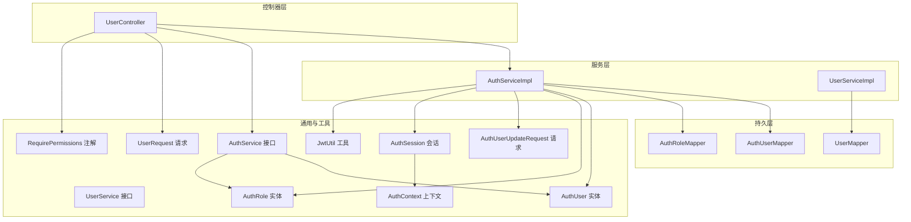
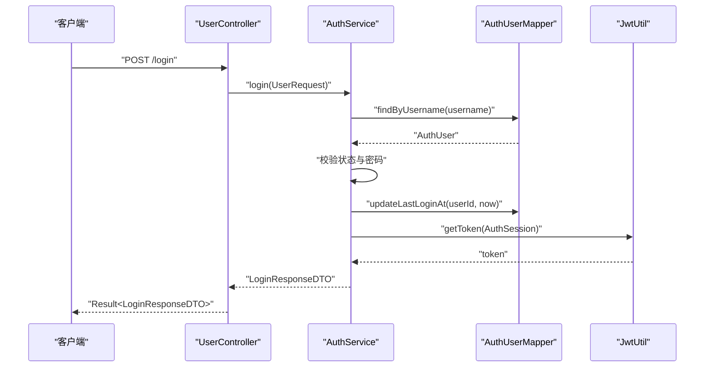
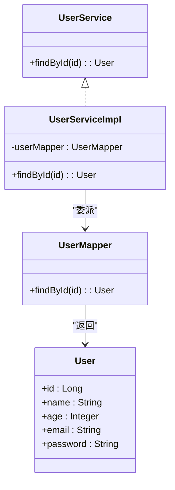
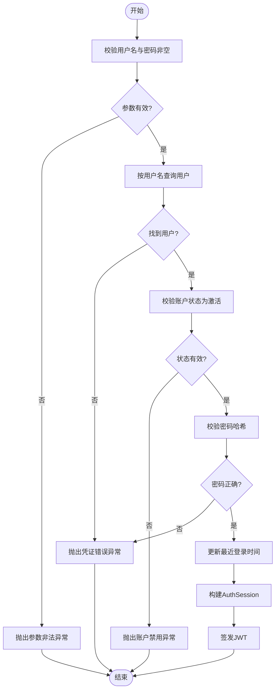
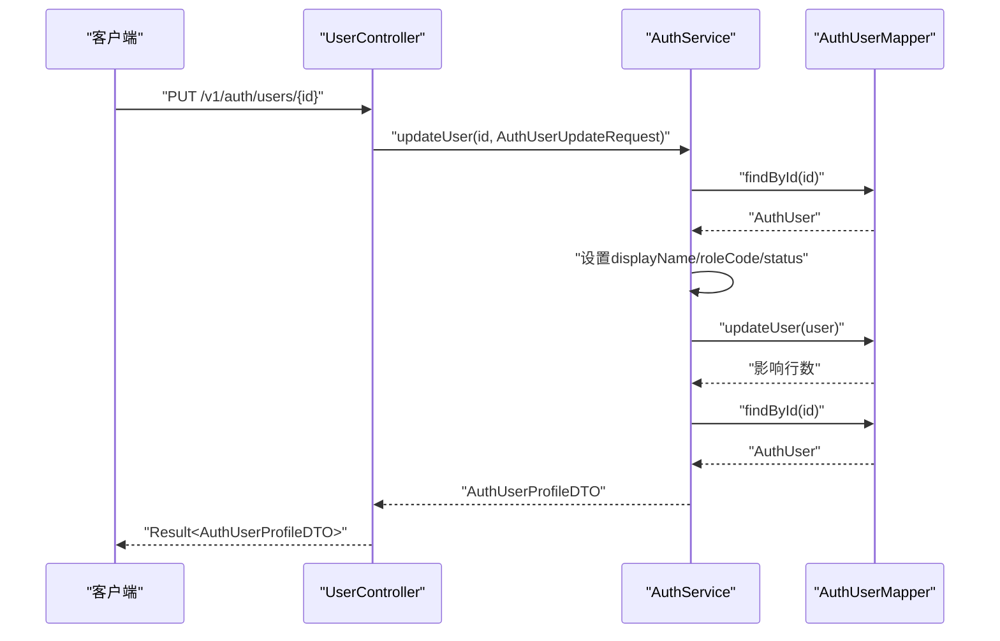
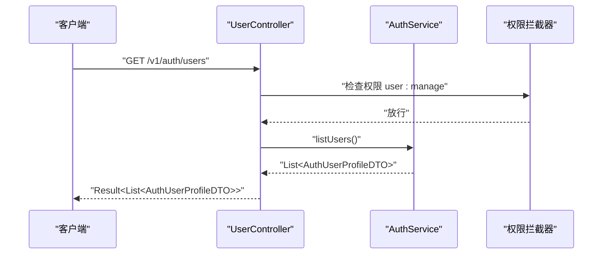
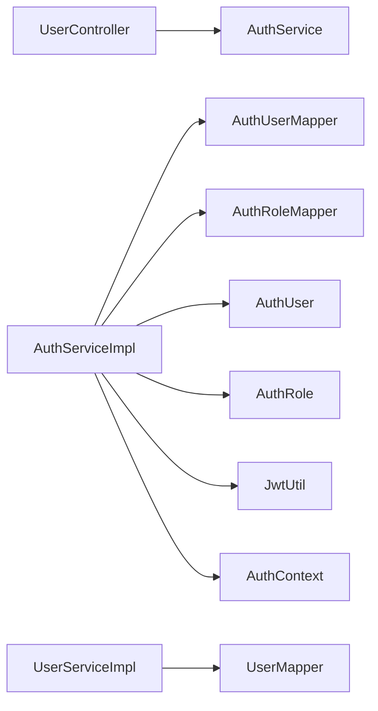

# 用户服务

<cite>
**本文引用的文件**
- [UserService.java](file://backend-repo/src/main/java/com/zjcxph/imgapi/service/UserService.java)
- [UserServiceImpl.java](file://backend-repo/src/main/java/com/zjcxph/imgapi/service/impl/UserServiceImpl.java)
- [UserMapper.java](file://backend-repo/src/main/java/com/zjcxph/imgapi/mapper/UserMapper.java)
- [User.java](file://backend-repo/src/main/java/com/zjcxph/imgapi/entity/User.java)
- [UserRequest.java](file://backend-repo/src/main/java/com/zjcxph/imgapi/dto/req/UserRequest.java)
- [UserController.java](file://backend-repo/src/main/java/com/zjcxph/imgapi/controller/UserController.java)
- [AuthService.java](file://backend-repo/src/main/java/com/zjcxph/imgapi/service/AuthService.java)
- [AuthServiceImpl.java](file://backend-repo/src/main/java/com/zjcxph/imgapi/service/impl/AuthServiceImpl.java)
- [AuthUser.java](file://backend-repo/src/main/java/com/zjcxph/imgapi/entity/AuthUser.java)
- [AuthRole.java](file://backend-repo/src/main/java/com/zjcxph/imgapi/entity/AuthRole.java)
- [AuthUserUpdateRequest.java](file://backend-repo/src/main/java/com/zjcxph/imgapi/dto/req/AuthUserUpdateRequest.java)
- [AuthSession.java](file://backend-repo/src/main/java/com/zjcxph/imgapi/common/AuthSession.java)
- [AuthContext.java](file://backend-repo/src/main/java/com/zjcxph/imgapi/utils/AuthContext.java)
- [JwtUtil.java](file://backend-repo/src/main/java/com/zjcxph/imgapi/utils/JwtUtil.java)
- [RequirePermissions.java](file://backend-repo/src/main/java/com/zjcxph/imgapi/annotation/RequirePermissions.java)
</cite>

## 目录
1. [简介](#简介)
2. [项目结构](#项目结构)
3. [核心组件](#核心组件)
4. [架构总览](#架构总览)
5. [详细组件分析](#详细组件分析)
6. [依赖分析](#依赖分析)
7. [性能考虑](#性能考虑)
8. [故障排查指南](#故障排查指南)
9. [结论](#结论)
10. [附录](#附录)

## 简介
本文件面向MRR项目的用户服务，围绕UserService接口及其实现UserServiceImpl展开，系统性阐述用户信息管理、权限分配与状态控制能力；同时梳理用户服务与认证服务的协作关系、权限继承机制、异常处理策略以及数据一致性保障措施。文档以代码级分析为基础，辅以可视化图示，帮助开发者与运维人员快速理解并高效维护用户服务。

## 项目结构
后端采用分层架构：控制器层负责HTTP接口暴露，服务层封装业务逻辑，持久层通过MyBatis Mapper访问数据库，通用模块提供会话与上下文能力，工具模块提供JWT与密码校验等支撑。



图表来源
- [UserController.java:1-95](file://backend-repo/src/main/java/com/zjcxph/imgapi/controller/UserController.java#L1-L95)
- [AuthServiceImpl.java:1-151](file://backend-repo/src/main/java/com/zjcxph/imgapi/service/impl/AuthServiceImpl.java#L1-L151)
- [UserServiceImpl.java:1-25](file://backend-repo/src/main/java/com/zjcxph/imgapi/service/impl/UserServiceImpl.java#L1-L25)
- [UserMapper.java:1-13](file://backend-repo/src/main/java/com/zjcxph/imgapi/mapper/UserMapper.java#L1-L13)
- [AuthService.java:1-25](file://backend-repo/src/main/java/com/zjcxph/imgapi/service/AuthService.java#L1-L25)
- [UserService.java:1-9](file://backend-repo/src/main/java/com/zjcxph/imgapi/service/UserService.java#L1-L9)
- [AuthUser.java:1-134](file://backend-repo/src/main/java/com/zjcxph/imgapi/entity/AuthUser.java#L1-L134)
- [AuthRole.java:1-53](file://backend-repo/src/main/java/com/zjcxph/imgapi/entity/AuthRole.java#L1-L53)
- [AuthUserUpdateRequest.java:1-41](file://backend-repo/src/main/java/com/zjcxph/imgapi/dto/req/AuthUserUpdateRequest.java#L1-L41)
- [UserRequest.java:1-31](file://backend-repo/src/main/java/com/zjcxph/imgapi/dto/req/UserRequest.java#L1-L31)
- [AuthSession.java:1-90](file://backend-repo/src/main/java/com/zjcxph/imgapi/common/AuthSession.java#L1-L90)
- [AuthContext.java:1-28](file://backend-repo/src/main/java/com/zjcxph/imgapi/utils/AuthContext.java#L1-L28)
- [JwtUtil.java:1-77](file://backend-repo/src/main/java/com/zjcxph/imgapi/utils/JwtUtil.java#L1-L77)
- [RequirePermissions.java:1-13](file://backend-repo/src/main/java/com/zjcxph/imgapi/annotation/RequirePermissions.java#L1-L13)

章节来源
- [UserController.java:1-95](file://backend-repo/src/main/java/com/zjcxph/imgapi/controller/UserController.java#L1-L95)
- [AuthService.java:1-25](file://backend-repo/src/main/java/com/zjcxph/imgapi/service/AuthService.java#L1-L25)
- [UserService.java:1-9](file://backend-repo/src/main/java/com/zjcxph/imgapi/service/UserService.java#L1-L9)

## 核心组件
- 用户服务接口与实现
  - UserService：定义用户查询能力（按ID查找）。
  - UserServiceImpl：委托UserMapper执行数据库查询。
- 认证与授权服务接口与实现
  - AuthService：定义登录、当前用户、用户列表、角色列表、更新用户、禁用用户等能力。
  - AuthServiceImpl：实现登录校验、会话构建、权限解析、用户更新与状态变更。
- 数据模型
  - User：通用用户信息（非认证维度）。
  - AuthUser：认证用户实体，包含用户名、显示名、密码哈希、角色、权限集合、状态、时间戳等。
  - AuthRole：角色实体，包含角色编码、名称、描述、权限字符串与排序。
- 请求对象
  - UserRequest：登录请求参数（用户名、密码）。
  - AuthUserUpdateRequest：用户更新请求（显示名、角色编码、状态）。
- 会话与上下文
  - AuthSession：登录后的会话载体，包含用户标识、角色、权限集合、状态与登录时间。
  - AuthContext：基于ThreadLocal的线程本地上下文，存储当前用户会话。
  - JwtUtil：JWT生成与解析工具，用于令牌签发与会话恢复。
- 权限注解
  - RequirePermissions：方法/类型级权限注解，配合拦截器进行权限校验。

章节来源
- [UserService.java:1-9](file://backend-repo/src/main/java/com/zjcxph/imgapi/service/UserService.java#L1-L9)
- [UserServiceImpl.java:1-25](file://backend-repo/src/main/java/com/zjcxph/imgapi/service/impl/UserServiceImpl.java#L1-L25)
- [UserMapper.java:1-13](file://backend-repo/src/main/java/com/zjcxph/imgapi/mapper/UserMapper.java#L1-L13)
- [User.java:1-49](file://backend-repo/src/main/java/com/zjcxph/imgapi/entity/User.java#L1-L49)
- [AuthService.java:1-25](file://backend-repo/src/main/java/com/zjcxph/imgapi/service/AuthService.java#L1-L25)
- [AuthServiceImpl.java:1-151](file://backend-repo/src/main/java/com/zjcxph/imgapi/service/impl/AuthServiceImpl.java#L1-L151)
- [AuthUser.java:1-134](file://backend-repo/src/main/java/com/zjcxph/imgapi/entity/AuthUser.java#L1-L134)
- [AuthRole.java:1-53](file://backend-repo/src/main/java/com/zjcxph/imgapi/entity/AuthRole.java#L1-L53)
- [UserRequest.java:1-31](file://backend-repo/src/main/java/com/zjcxph/imgapi/dto/req/UserRequest.java#L1-L31)
- [AuthUserUpdateRequest.java:1-41](file://backend-repo/src/main/java/com/zjcxph/imgapi/dto/req/AuthUserUpdateRequest.java#L1-L41)
- [AuthSession.java:1-90](file://backend-repo/src/main/java/com/zjcxph/imgapi/common/AuthSession.java#L1-L90)
- [AuthContext.java:1-28](file://backend-repo/src/main/java/com/zjcxph/imgapi/utils/AuthContext.java#L1-L28)
- [JwtUtil.java:1-77](file://backend-repo/src/main/java/com/zjcxph/imgapi/utils/JwtUtil.java#L1-L77)
- [RequirePermissions.java:1-13](file://backend-repo/src/main/java/com/zjcxph/imgapi/annotation/RequirePermissions.java#L1-L13)

## 架构总览
用户服务与认证服务协同工作：控制器层接收HTTP请求，调用认证服务完成登录与权限校验；认证服务内部通过Mapper访问数据库，结合会话与上下文管理用户状态，并通过JWT进行令牌签发与解析。权限注解在控制器层声明式地保护受控资源。



图表来源
- [UserController.java:38-47](file://backend-repo/src/main/java/com/zjcxph/imgapi/controller/UserController.java#L38-L47)
- [AuthServiceImpl.java:36-62](file://backend-repo/src/main/java/com/zjcxph/imgapi/service/impl/AuthServiceImpl.java#L36-L62)
- [JwtUtil.java:28-59](file://backend-repo/src/main/java/com/zjcxph/imgapi/utils/JwtUtil.java#L28-L59)

## 详细组件分析

### UserService 接口与实现
- 职责
  - 提供按ID查询用户的能力，当前实现委托给UserMapper。
- 设计要点
  - 接口最小化，便于替换与扩展。
  - 实现轻量，仅做委派，降低复杂度。
- 可扩展方向
  - 新增按用户名查询、分页查询、条件过滤等方法。
  - 引入缓存与一致性策略。



图表来源
- [UserService.java:1-9](file://backend-repo/src/main/java/com/zjcxph/imgapi/service/UserService.java#L1-L9)
- [UserServiceImpl.java:1-25](file://backend-repo/src/main/java/com/zjcxph/imgapi/service/impl/UserServiceImpl.java#L1-L25)
- [UserMapper.java:1-13](file://backend-repo/src/main/java/com/zjcxph/imgapi/mapper/UserMapper.java#L1-L13)
- [User.java:1-49](file://backend-repo/src/main/java/com/zjcxph/imgapi/entity/User.java#L1-L49)

章节来源
- [UserService.java:1-9](file://backend-repo/src/main/java/com/zjcxph/imgapi/service/UserService.java#L1-L9)
- [UserServiceImpl.java:1-25](file://backend-repo/src/main/java/com/zjcxph/imgapi/service/impl/UserServiceImpl.java#L1-L25)
- [UserMapper.java:1-13](file://backend-repo/src/main/java/com/zjcxph/imgapi/mapper/UserMapper.java#L1-L13)
- [User.java:1-49](file://backend-repo/src/main/java/com/zjcxph/imgapi/entity/User.java#L1-L49)

### 认证服务与权限继承机制
- 登录流程
  - 校验请求参数非空。
  - 按用户名查询用户，校验账户状态为“激活”。
  - 校验密码哈希匹配。
  - 更新最近登录时间。
  - 构建AuthSession并签发JWT。
- 权限继承
  - 角色实体包含权限字符串，用户实体包含权限CSV字段。
  - 会话中解析并维护权限集合，支持管理员与细粒度权限判断。
- 状态控制
  - 支持禁用用户（状态置为“disabled”），登录时拒绝非激活用户。



图表来源
- [AuthServiceImpl.java:36-62](file://backend-repo/src/main/java/com/zjcxph/imgapi/service/impl/AuthServiceImpl.java#L36-L62)
- [AuthUser.java:116-132](file://backend-repo/src/main/java/com/zjcxph/imgapi/entity/AuthUser.java#L116-L132)
- [AuthRole.java:1-53](file://backend-repo/src/main/java/com/zjcxph/imgapi/entity/AuthRole.java#L1-L53)
- [AuthSession.java:81-88](file://backend-repo/src/main/java/com/zjcxph/imgapi/common/AuthSession.java#L81-L88)

章节来源
- [AuthServiceImpl.java:1-151](file://backend-repo/src/main/java/com/zjcxph/imgapi/service/impl/AuthServiceImpl.java#L1-L151)
- [AuthUser.java:1-134](file://backend-repo/src/main/java/com/zjcxph/imgapi/entity/AuthUser.java#L1-L134)
- [AuthRole.java:1-53](file://backend-repo/src/main/java/com/zjcxph/imgapi/entity/AuthRole.java#L1-L53)
- [AuthSession.java:1-90](file://backend-repo/src/main/java/com/zjcxph/imgapi/common/AuthSession.java#L1-L90)

### 用户信息管理与更新
- 列表与详情
  - 列出所有认证用户，转换为用户档案DTO，包含角色、权限与状态。
- 更新用户
  - 支持更新显示名、角色编码与状态。
  - 更新后重新查询并返回最新档案。
- 禁用用户
  - 将用户状态置为“disabled”。



图表来源
- [UserController.java:73-82](file://backend-repo/src/main/java/com/zjcxph/imgapi/controller/UserController.java#L73-L82)
- [AuthServiceImpl.java:75-91](file://backend-repo/src/main/java/com/zjcxph/imgapi/service/impl/AuthServiceImpl.java#L75-L91)
- [AuthUserUpdateRequest.java:1-41](file://backend-repo/src/main/java/com/zjcxph/imgapi/dto/req/AuthUserUpdateRequest.java#L1-L41)

章节来源
- [UserController.java:1-95](file://backend-repo/src/main/java/com/zjcxph/imgapi/controller/UserController.java#L1-L95)
- [AuthServiceImpl.java:1-151](file://backend-repo/src/main/java/com/zjcxph/imgapi/service/impl/AuthServiceImpl.java#L1-L151)
- [AuthUserUpdateRequest.java:1-41](file://backend-repo/src/main/java/com/zjcxph/imgapi/dto/req/AuthUserUpdateRequest.java#L1-L41)

### 数据模型设计
- User（通用用户）
  - 字段：id、name、age、email、password。
  - 用途：非认证场景下的用户信息展示与基础管理。
- AuthUser（认证用户）
  - 字段：id、username、displayName、passwordHash、roleCode、roleName、permissionsCsv、status、lastLoginAt、createdAt、updatedAt。
  - 关键点：密码与权限字段标记忽略序列化，避免敏感信息泄露；提供权限集合与权限判断方法。
- AuthRole（角色）
  - 字段：code、name、description、permissions、sortOrder。
  - 关键点：角色权限字符串与排序字段，支持权限继承与展示顺序。

```mermaid
erDiagram
AUTH_USER {
bigint id PK
varchar username
varchar displayName
varchar passwordHash
varchar roleCode
varchar roleName
varchar permissionsCsv
varchar status
timestamp lastLoginAt
timestamp createdAt
timestamp updatedAt
}
AUTH_ROLE {
varchar code PK
varchar name
varchar description
varchar permissions
int sortOrder
}
AUTH_USER }o--|| AUTH_ROLE : "roleCode"
note for AUTH_USER """
密码与权限CSV字段
标记忽略序列化
"""
note for AUTH_ROLE """
角色权限字符串
支持权限继承
"""
```

图表来源
- [AuthUser.java:1-134](file://backend-repo/src/main/java/com/zjcxph/imgapi/entity/AuthUser.java#L1-L134)
- [AuthRole.java:1-53](file://backend-repo/src/main/java/com/zjcxph/imgapi/entity/AuthRole.java#L1-L53)

章节来源
- [User.java:1-49](file://backend-repo/src/main/java/com/zjcxph/imgapi/entity/User.java#L1-L49)
- [AuthUser.java:1-134](file://backend-repo/src/main/java/com/zjcxph/imgapi/entity/AuthUser.java#L1-L134)
- [AuthRole.java:1-53](file://backend-repo/src/main/java/com/zjcxph/imgapi/entity/AuthRole.java#L1-L53)

### 控制器与权限注解
- 控制器职责
  - 登录：校验请求参数，调用认证服务登录并返回结果。
  - 当前用户：返回当前会话信息。
  - 用户列表与角色列表：受权限注解保护。
  - 更新用户与禁用用户：受“user:manage”权限保护。
- 权限注解
  - RequirePermissions：声明所需权限数组，配合拦截器生效。



图表来源
- [UserController.java:59-64](file://backend-repo/src/main/java/com/zjcxph/imgapi/controller/UserController.java#L59-L64)
- [RequirePermissions.java:1-13](file://backend-repo/src/main/java/com/zjcxph/imgapi/annotation/RequirePermissions.java#L1-L13)

章节来源
- [UserController.java:1-95](file://backend-repo/src/main/java/com/zjcxph/imgapi/controller/UserController.java#L1-L95)
- [RequirePermissions.java:1-13](file://backend-repo/src/main/java/com/zjcxph/imgapi/annotation/RequirePermissions.java#L1-L13)

## 依赖分析
- 组件耦合
  - UserController依赖AuthService接口，遵循依赖倒置原则。
  - UserServiceImpl依赖UserMapper，保持实现细节隔离。
  - AuthServiceImpl依赖AuthUserMapper与AuthRoleMapper，集中处理认证与授权逻辑。
- 外部依赖
  - MyBatis Mapper负责SQL映射。
  - JWT库用于令牌生成与解析。
  - Spring Validation用于请求参数校验。
- 循环依赖
  - 未发现循环依赖，层次清晰。



图表来源
- [UserController.java:1-95](file://backend-repo/src/main/java/com/zjcxph/imgapi/controller/UserController.java#L1-L95)
- [AuthServiceImpl.java:1-151](file://backend-repo/src/main/java/com/zjcxph/imgapi/service/impl/AuthServiceImpl.java#L1-L151)
- [UserServiceImpl.java:1-25](file://backend-repo/src/main/java/com/zjcxph/imgapi/service/impl/UserServiceImpl.java#L1-L25)

章节来源
- [UserController.java:1-95](file://backend-repo/src/main/java/com/zjcxph/imgapi/controller/UserController.java#L1-L95)
- [AuthServiceImpl.java:1-151](file://backend-repo/src/main/java/com/zjcxph/imgapi/service/impl/AuthServiceImpl.java#L1-L151)
- [UserServiceImpl.java:1-25](file://backend-repo/src/main/java/com/zjcxph/imgapi/service/impl/UserServiceImpl.java#L1-L25)

## 性能考虑
- 查询优化
  - UserServiceImpl的单字段查询已具备索引友好性；建议在数据库层面为id建立主键索引。
- 缓存策略
  - 对高频读取的用户信息可引入Redis缓存，结合失效策略与写后读一致性。
- 认证性能
  - JWT签发与解析为纯内存操作，开销极低；注意密钥安全与过期时间配置。
- 并发与线程安全
  - AuthContext使用ThreadLocal，天然线程隔离；确保在请求生命周期内正确清理。

## 故障排查指南
- 登录失败
  - 参数为空：检查请求体与校验注解是否生效。
  - 用户不存在或密码错误：确认用户名大小写与密码哈希一致性。
  - 账户被禁用：检查状态字段与登录校验逻辑。
- 权限不足
  - 确认控制器上RequirePermissions注解声明的权限是否正确。
  - 检查AuthSession中的权限集合是否包含所需权限。
- 用户更新失败
  - 检查更新请求参数（角色编码、状态）是否为空。
  - 确认数据库更新影响行数与最终查询结果。
- 令牌问题
  - 检查JWT密钥环境变量与过期时间配置。
  - 验证令牌签名与Claims解析逻辑。

章节来源
- [AuthServiceImpl.java:36-62](file://backend-repo/src/main/java/com/zjcxph/imgapi/service/impl/AuthServiceImpl.java#L36-L62)
- [UserController.java:38-47](file://backend-repo/src/main/java/com/zjcxph/imgapi/controller/UserController.java#L38-L47)
- [AuthSession.java:81-88](file://backend-repo/src/main/java/com/zjcxph/imgapi/common/AuthSession.java#L81-L88)
- [JwtUtil.java:14-17](file://backend-repo/src/main/java/com/zjcxph/imgapi/utils/JwtUtil.java#L14-L17)

## 结论
用户服务在MRR项目中承担了用户信息查询与认证授权的关键职责。通过UserService与AuthServiceImpl的清晰分层、AuthUser与AuthRole的明确数据模型、RequirePermissions的声明式权限控制，以及JWT的会话管理，系统实现了从登录到权限继承再到状态控制的完整闭环。后续可在缓存、审计与更细粒度的权限模型方面持续演进。

## 附录
- 关键流程图与类图已在前述章节中给出，读者可直接参考对应图表来源定位具体实现文件。
- 若需扩展用户注册、密码加密策略或审计日志，建议沿用现有分层与注解体系，确保一致性和可维护性。