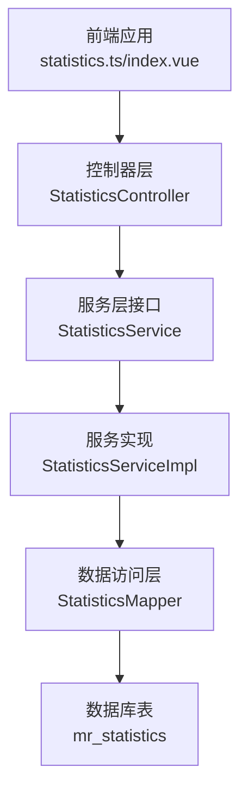
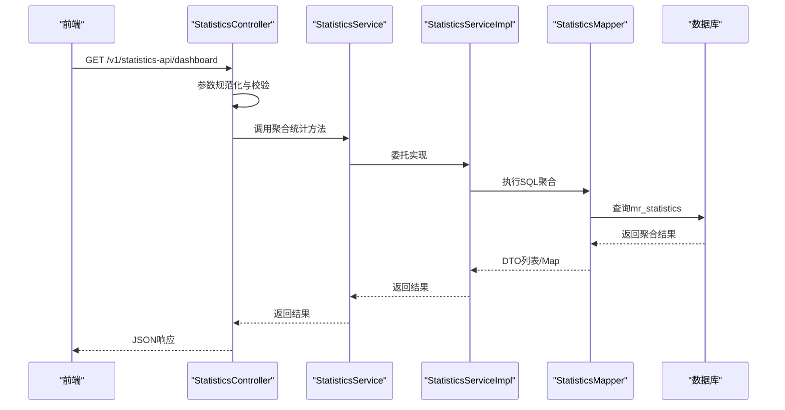
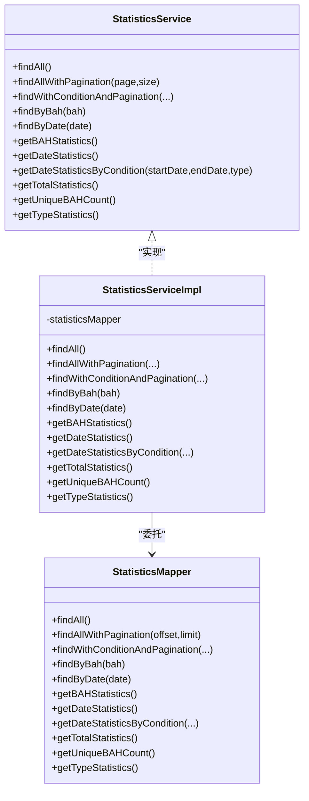
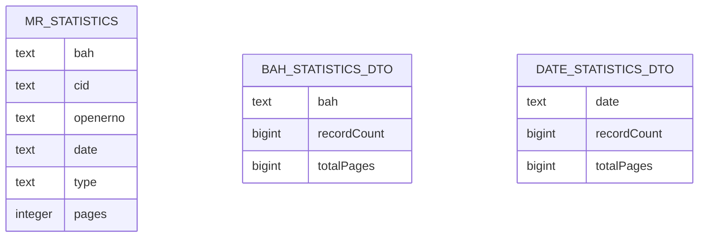
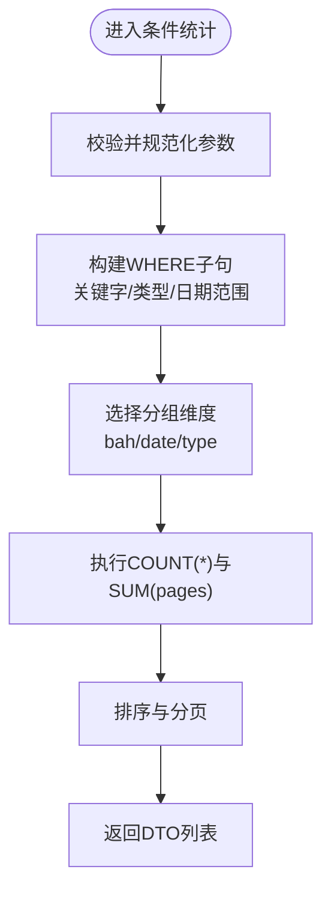
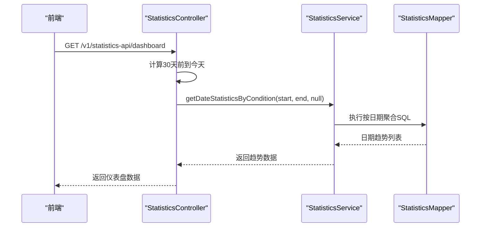
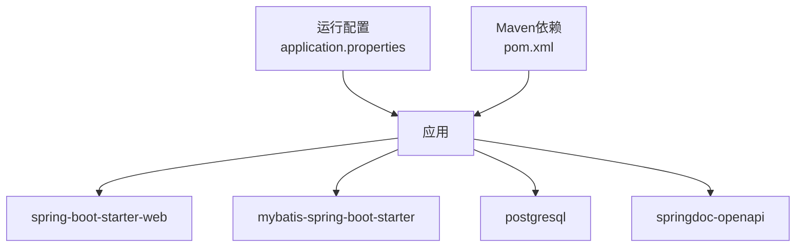

# 统计服务

<cite>
**本文引用的文件**
- [StatisticsService.java](file://backend-repo/src/main/java/com/zjcxph/imgapi/service/StatisticsService.java)
- [StatisticsServiceImpl.java](file://backend-repo/src/main/java/com/zjcxph/imgapi/service/impl/StatisticsServiceImpl.java)
- [StatisticsMapper.java](file://backend-repo/src/main/java/com/zjcxph/imgapi/mapper/StatisticsMapper.java)
- [Statistics.java](file://backend-repo/src/main/java/com/zjcxph/imgapi/entity/Statistics.java)
- [BAHStatisticsDTO.java](file://backend-repo/src/main/java/com/zjcxph/imgapi/dto/resp/BAHStatisticsDTO.java)
- [DateStatisticsDTO.java](file://backend-repo/src/main/java/com/zjcxph/imgapi/dto/resp/DateStatisticsDTO.java)
- [StatisticsController.java](file://backend-repo/src/main/java/com/zjcxph/imgapi/controller/StatisticsController.java)
- [schema.sql](file://mrr-db/schema.sql)
- [application.properties](file://backend-repo/src/main/resources/application.properties)
- [pom.xml](file://backend-repo/pom.xml)
- [StatisticsTest.java](file://backend-repo/src/test/java/com/zjcxph/imgapi/StatisticsTest.java)
- [statistics.ts](file://frontend-repo/src/api/statistics.ts)
- [index.vue](file://frontend-fantastic-admin/src/views/statistics/index.vue)
</cite>

## 目录
1. [简介](#简介)
2. [项目结构](#项目结构)
3. [核心组件](#核心组件)
4. [架构总览](#架构总览)
5. [详细组件分析](#详细组件分析)
6. [依赖分析](#依赖分析)
7. [性能考虑](#性能考虑)
8. [故障排查指南](#故障排查指南)
9. [结论](#结论)
10. [附录](#附录)

## 简介
本文件面向MRR项目的统计服务，围绕StatisticsService接口及其实现StatisticsServiceImpl，系统性阐述统计数据计算、报表生成与趋势分析功能。文档重点覆盖以下方面：
- 统计服务的数据模型与DTO设计
- 支持的统计维度与统计口径
- 数据聚合算法与统计指标计算
- 时间维度分析与趋势生成
- 控制器层的请求处理流程与参数规范化
- 性能优化策略与大数据量处理方案
- 前后端对接与前端展示用法

## 项目结构
统计服务位于后端Java工程中，采用典型的分层架构：
- 控制器层：提供REST接口，接收参数并调用服务层
- 服务层：定义统计接口与实现类，封装业务逻辑
- 数据访问层：MyBatis Mapper负责SQL执行与结果映射
- 实体与DTO：承载统计数据与响应结构
- 前端：通过API模块调用后端统计接口，渲染仪表盘与报表

图表来源
- [StatisticsController.java:30-281](file://backend-repo/src/main/java/com/zjcxph/imgapi/controller/StatisticsController.java#L30-L281)
- [StatisticsService.java:10-55](file://backend-repo/src/main/java/com/zjcxph/imgapi/service/StatisticsService.java#L10-L55)
- [StatisticsServiceImpl.java:13-97](file://backend-repo/src/main/java/com/zjcxph/imgapi/service/impl/StatisticsServiceImpl.java#L13-L97)
- [StatisticsMapper.java:13-167](file://backend-repo/src/main/java/com/zjcxph/imgapi/mapper/StatisticsMapper.java#L13-L167)
- [schema.sql:40-48](file://mrr-db/schema.sql#L40-L48)

章节来源
- [StatisticsController.java:30-281](file://backend-repo/src/main/java/com/zjcxph/imgapi/controller/StatisticsController.java#L30-L281)
- [StatisticsService.java:10-55](file://backend-repo/src/main/java/com/zjcxph/imgapi/service/StatisticsService.java#L10-L55)
- [StatisticsServiceImpl.java:13-97](file://backend-repo/src/main/java/com/zjcxph/imgapi/service/impl/StatisticsServiceImpl.java#L13-L97)
- [StatisticsMapper.java:13-167](file://backend-repo/src/main/java/com/zjcxph/imgapi/mapper/StatisticsMapper.java#L13-L167)
- [schema.sql:40-48](file://mrr-db/schema.sql#L40-L48)

## 核心组件
- 接口与实现
  - StatisticsService：定义统计数据查询、分页、条件过滤、聚合统计与趋势分析等方法
  - StatisticsServiceImpl：将接口方法委托给StatisticsMapper执行
- 数据访问层
  - StatisticsMapper：以注解方式编写SQL，涵盖全表查询、分页、条件过滤、按病案号/日期/类型聚合统计、总记录与总页数统计、唯一病案号计数等
- 控制器层
  - StatisticsController：统一入口，负责参数校验、规范化、分页计算与响应封装
- 数据模型与DTO
  - Statistics：实体，字段包含病案号、患者ID、操作员号、日期、类型、页数
  - BAHStatisticsDTO：按病案号统计的DTO，包含记录数与总页数
  - DateStatisticsDTO：按日期统计的DTO，包含记录数与总页数
- 前端对接
  - 前端通过statistics.ts调用后端接口，index.vue页面渲染统计概览、类型分布、近30天趋势与高频病案号

章节来源
- [StatisticsService.java:10-55](file://backend-repo/src/main/java/com/zjcxph/imgapi/service/StatisticsService.java#L10-L55)
- [StatisticsServiceImpl.java:13-97](file://backend-repo/src/main/java/com/zjcxph/imgapi/service/impl/StatisticsServiceImpl.java#L13-L97)
- [StatisticsMapper.java:13-167](file://backend-repo/src/main/java/com/zjcxph/imgapi/mapper/StatisticsMapper.java#L13-L167)
- [Statistics.java:5-73](file://backend-repo/src/main/java/com/zjcxph/imgapi/entity/Statistics.java#L5-L73)
- [BAHStatisticsDTO.java:8-46](file://backend-repo/src/main/java/com/zjcxph/imgapi/dto/resp/BAHStatisticsDTO.java#L8-L46)
- [DateStatisticsDTO.java:8-46](file://backend-repo/src/main/java/com/zjcxph/imgapi/dto/resp/DateStatisticsDTO.java#L8-L46)
- [statistics.ts:1-24](file://frontend-repo/src/api/statistics.ts#L1-L24)
- [index.vue:1-227](file://frontend-fantastic-admin/src/views/statistics/index.vue#L1-L227)

## 架构总览
统计服务遵循“控制器-服务-数据访问-数据库”的分层设计，控制器负责输入参数处理与响应组装，服务层负责业务编排，数据访问层负责SQL执行与结果映射。

图表来源
- [StatisticsController.java:216-242](file://backend-repo/src/main/java/com/zjcxph/imgapi/controller/StatisticsController.java#L216-L242)
- [StatisticsService.java:47-55](file://backend-repo/src/main/java/com/zjcxph/imgapi/service/StatisticsService.java#L47-L55)
- [StatisticsServiceImpl.java:83-96](file://backend-repo/src/main/java/com/zjcxph/imgapi/service/impl/StatisticsServiceImpl.java#L83-L96)
- [StatisticsMapper.java:153-166](file://backend-repo/src/main/java/com/zjcxph/imgapi/mapper/StatisticsMapper.java#L153-L166)

## 详细组件分析

### 统计接口与实现
- 接口职责
  - 列表查询与分页：findAll、findAllWithPagination、findWithConditionAndPagination
  - 条件统计：按日期范围与类型统计getDateStatisticsByCondition
  - 聚合统计：按病案号统计getBAHStatistics、按日期统计getDateStatistics、按类型统计getTypeStatistics
  - 总体统计：getTotalStatistics、getUniqueBAHCount
- 实现策略
  - StatisticsServiceImpl将接口调用直接委托至StatisticsMapper，保持实现简洁与职责单一

图表来源
- [StatisticsService.java:10-55](file://backend-repo/src/main/java/com/zjcxph/imgapi/service/StatisticsService.java#L10-L55)
- [StatisticsServiceImpl.java:13-97](file://backend-repo/src/main/java/com/zjcxph/imgapi/service/impl/StatisticsServiceImpl.java#L13-L97)
- [StatisticsMapper.java:13-167](file://backend-repo/src/main/java/com/zjcxph/imgapi/mapper/StatisticsMapper.java#L13-L167)

章节来源
- [StatisticsService.java:10-55](file://backend-repo/src/main/java/com/zjcxph/imgapi/service/StatisticsService.java#L10-L55)
- [StatisticsServiceImpl.java:13-97](file://backend-repo/src/main/java/com/zjcxph/imgapi/service/impl/StatisticsServiceImpl.java#L13-L97)

### 数据模型与DTO设计
- 实体Statistics
  - 字段：bah、cid、openerNo、date、type、pages
  - 用途：承载原始统计数据记录，用于明细查询与分页
- DTO
  - BAHStatisticsDTO：按病案号聚合，输出bah、recordCount、totalPages
  - DateStatisticsDTO：按日期聚合，输出date、recordCount、totalPages
- 设计特点
  - 字段命名清晰，便于前后端约定与序列化
  - DTO专注于展示与聚合，避免在实体中引入展示无关字段

图表来源
- [schema.sql:40-48](file://mrr-db/schema.sql#L40-L48)
- [BAHStatisticsDTO.java:8-46](file://backend-repo/src/main/java/com/zjcxph/imgapi/dto/resp/BAHStatisticsDTO.java#L8-L46)
- [DateStatisticsDTO.java:8-46](file://backend-repo/src/main/java/com/zjcxph/imgapi/dto/resp/DateStatisticsDTO.java#L8-L46)

章节来源
- [Statistics.java:5-73](file://backend-repo/src/main/java/com/zjcxph/imgapi/entity/Statistics.java#L5-L73)
- [BAHStatisticsDTO.java:8-46](file://backend-repo/src/main/java/com/zjcxph/imgapi/dto/resp/BAHStatisticsDTO.java#L8-L46)
- [DateStatisticsDTO.java:8-46](file://backend-repo/src/main/java/com/zjcxph/imgapi/dto/resp/DateStatisticsDTO.java#L8-L46)
- [schema.sql:40-48](file://mrr-db/schema.sql#L40-L48)

### 统计维度与统计口径
- 维度
  - 按病案号（bah）：统计各病案号的记录数与总页数
  - 按日期（date）：统计每日记录数与总页数
  - 按类型（type）：统计各类别的记录数与总页数
  - 综合维度：唯一病案号数量、总体记录与页数
- 统计口径
  - 记录数：COUNT(*)，即满足条件的行数
  - 总页数：SUM(pages)，对满足条件的记录求和
  - 唯一病案号：COUNT(DISTINCT bah)
  - 时间维度：支持按日期范围过滤，支持模糊匹配或精确匹配

章节来源
- [StatisticsMapper.java:116-166](file://backend-repo/src/main/java/com/zjcxph/imgapi/mapper/StatisticsMapper.java#L116-L166)
- [StatisticsController.java:160-187](file://backend-repo/src/main/java/com/zjcxph/imgapi/controller/StatisticsController.java#L160-L187)

### 数据聚合算法与统计指标计算
- 分组聚合
  - 使用GROUP BY对bah、date、type进行分组
  - 使用COUNT(*)与SUM(pages)计算记录数与总页数
- 条件过滤
  - 关键字keyword：对bah、cid、openerNo、date、type进行LIKE模糊匹配
  - 类型type：精确匹配
  - 日期范围：支持startDate与endDate，内部对date字段做替换处理以兼容不同日期格式
- 排序与分页
  - 支持sortBy与sortOrder，支持按bah、cid、openerNo、date、type、pages排序
  - 分页通过LIMIT与OFFSET实现，最大单页限制为1000

图表来源
- [StatisticsController.java:43-109](file://backend-repo/src/main/java/com/zjcxph/imgapi/controller/StatisticsController.java#L43-L109)
- [StatisticsMapper.java:24-72](file://backend-repo/src/main/java/com/zjcxph/imgapi/mapper/StatisticsMapper.java#L24-L72)

章节来源
- [StatisticsMapper.java:24-72](file://backend-repo/src/main/java/com/zjcxph/imgapi/mapper/StatisticsMapper.java#L24-L72)
- [StatisticsController.java:43-109](file://backend-repo/src/main/java/com/zjcxph/imgapi/controller/StatisticsController.java#L43-L109)

### 趋势分析与时间维度
- 最近30天趋势
  - 控制器自动计算30天前到今天的日期区间，并调用按条件统计接口
  - 返回最近30天的每日记录数与总页数，用于前端折线图或堆叠卡片展示
- 日期范围与类型组合
  - 支持仅开始日期、仅结束日期、完整日期范围与类型筛选的组合查询
  - 内部对边界日期进行默认值推断，确保查询稳定性

图表来源
- [StatisticsController.java:216-242](file://backend-repo/src/main/java/com/zjcxph/imgapi/controller/StatisticsController.java#L216-L242)
- [StatisticsMapper.java:130-151](file://backend-repo/src/main/java/com/zjcxph/imgapi/mapper/StatisticsMapper.java#L130-L151)

章节来源
- [StatisticsController.java:216-242](file://backend-repo/src/main/java/com/zjcxph/imgapi/controller/StatisticsController.java#L216-L242)
- [StatisticsMapper.java:130-151](file://backend-repo/src/main/java/com/zjcxph/imgapi/mapper/StatisticsMapper.java#L130-L151)

### 控制器层处理流程
- 参数规范化
  - 对keyword、type、startDate、endDate、sortBy、sortOrder进行trim与默认值处理
  - sortBy支持bah、cid、openerNo、date、type、pages；sortOrder支持asc/ascending/desc
- 分页与总数
  - page与size进行边界校验，size最大1000
  - 同时查询符合条件的总数，用于前端分页控件
- 响应封装
  - 统一包装为Result对象，包含code、list、total、page、size、totalPages、sortBy、sortOrder

章节来源
- [StatisticsController.java:43-109](file://backend-repo/src/main/java/com/zjcxph/imgapi/controller/StatisticsController.java#L43-L109)
- [StatisticsController.java:244-279](file://backend-repo/src/main/java/com/zjcxph/imgapi/controller/StatisticsController.java#L244-L279)

### 前后端对接与前端展示
- API调用
  - 前端通过statistics.ts发起请求，分别调用统计概览、日期汇总与仪表盘数据接口
- 页面渲染
  - index.vue页面并行加载三类数据，渲染总记录数、总页数、唯一病案号、类型分布、近10日趋势与高频病案号表格

章节来源
- [statistics.ts:1-24](file://frontend-repo/src/api/statistics.ts#L1-L24)
- [index.vue:1-227](file://frontend-fantastic-admin/src/views/statistics/index.vue#L1-L227)

## 依赖分析
- 技术栈
  - Spring Boot Web、MyBatis、PostgreSQL、Lombok、OpenAPI/Swagger
- 关键依赖
  - spring-boot-starter-web：提供Web容器与REST能力
  - mybatis-spring-boot-starter：简化MyBatis集成
  - postgresql：数据库驱动
  - springdoc-openapi：接口文档
- 运行配置
  - 数据源连接池参数可调，启用压缩与缓存策略
  - 日志级别对Mapper开启DEBUG便于调试

图表来源
- [application.properties:10-49](file://backend-repo/src/main/resources/application.properties#L10-L49)
- [pom.xml:27-114](file://backend-repo/pom.xml#L27-L114)

章节来源
- [application.properties:10-49](file://backend-repo/src/main/resources/application.properties#L10-L49)
- [pom.xml:27-114](file://backend-repo/pom.xml#L27-L114)

## 性能考虑
- SQL层面
  - 使用GROUP BY与COUNT/SUM进行高效聚合，建议在date、type、bah字段建立索引以提升分组与过滤性能
  - LIKE模糊匹配可能影响索引利用，建议对高频关键字建立全文索引或预处理关键词
- 分页与缓存
  - 控制单页最大1000条，避免一次性返回大量数据
  - 对高频查询（如仪表盘概览）可考虑短期缓存（如Redis），降低数据库压力
- 连接池与资源
  - 合理设置Hikari连接池参数，避免高并发下的连接争用
  - 启用HTTP响应压缩与静态资源缓存，减少网络传输开销
- 大数据量处理
  - 对历史数据可考虑分区表或归档策略，缩小热数据集
  - 异步任务定期生成预聚合报表，前端轮询或推送更新

## 故障排查指南
- 常见问题
  - 参数非法：page与size需大于0，超过上限会被截断
  - 日期格式：后端对date字段做格式替换以兼容不同输入，若仍异常请检查输入格式
  - 关键字匹配：LIKE模糊匹配可能返回较多结果，建议配合类型与日期范围过滤
- 调试建议
  - 开启Mapper日志，观察生成的SQL与参数
  - 使用单元测试验证聚合逻辑与边界条件
- 单元测试要点
  - 分页一致性与去重验证
  - 数据完整性校验（非空与正数约束）
  - 条件统计的边界用例（仅开始/结束日期、空条件）

章节来源
- [StatisticsController.java:66-72](file://backend-repo/src/main/java/com/zjcxph/imgapi/controller/StatisticsController.java#L66-L72)
- [StatisticsTest.java:229-252](file://backend-repo/src/test/java/com/zjcxph/imgapi/StatisticsTest.java#L229-L252)
- [StatisticsTest.java:257-292](file://backend-repo/src/test/java/com/zjcxph/imgapi/StatisticsTest.java#L257-L292)

## 结论
统计服务通过清晰的分层设计与标准化的DTO输出，实现了对病案数据的多维度统计与趋势分析。接口覆盖了明细查询、聚合统计、时间维度分析与仪表盘所需的核心能力。结合合理的SQL优化、分页控制与缓存策略，可在大数据量场景下保持稳定性能。前端通过并行加载与卡片化展示，提供了直观的统计概览与趋势视图。

## 附录
- 数据库表结构参考
  - mr_statistics：包含bah、cid、openerno、date、type、pages字段
- 前端API与页面
  - statistics.ts：封装统计接口调用
  - index.vue：统计概览与趋势展示页面

章节来源
- [schema.sql:40-48](file://mrr-db/schema.sql#L40-L48)
- [statistics.ts:1-24](file://frontend-repo/src/api/statistics.ts#L1-L24)
- [index.vue:1-227](file://frontend-fantastic-admin/src/views/statistics/index.vue#L1-L227)