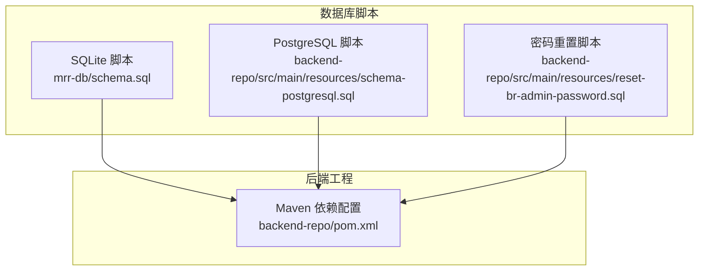
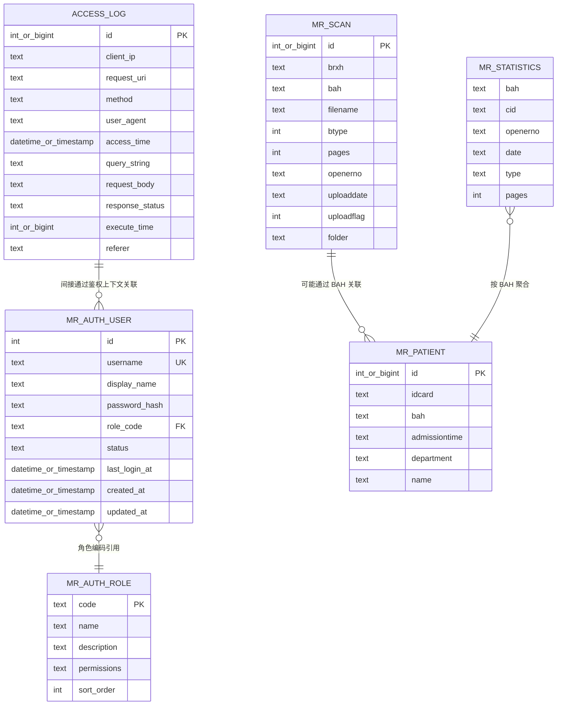
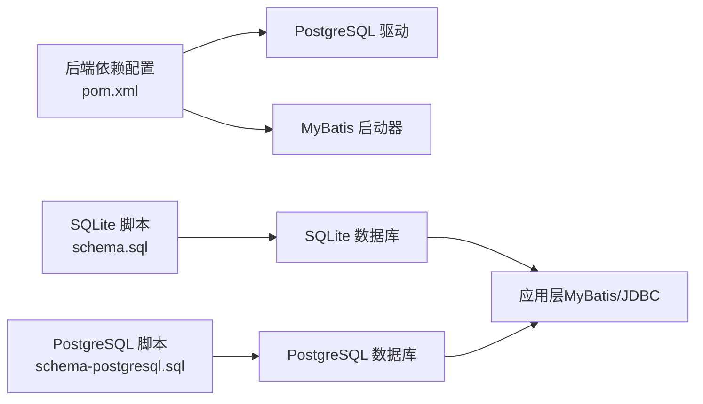

# 数据库表结构

<cite>
**本文引用的文件**
- [schema.sql](file://mrr-db/schema.sql)
- [schema-postgresql.sql](file://backend-repo/src/main/resources/schema-postgresql.sql)
- [reset-br-admin-password.sql](file://backend-repo/src/main/resources/reset-br-admin-password.sql)
- [pom.xml](file://backend-repo/pom.xml)
</cite>

## 目录
1. [简介](#简介)
2. [项目结构](#项目结构)
3. [核心组件](#核心组件)
4. [架构总览](#架构总览)
5. [详细组件分析](#详细组件分析)
6. [依赖分析](#依赖分析)
7. [性能考虑](#性能考虑)
8. [故障排除指南](#故障排除指南)
9. [结论](#结论)
10. [附录](#附录)

## 简介
本设计文档面向 MRR（医学影像归档与通信）系统的数据库表结构，基于仓库中提供的 SQLite 与 PostgreSQL 初始化脚本进行梳理。文档覆盖以下核心目标：
- 全面描述各核心表的字段定义、数据类型、约束条件与业务含义
- 明确主键、外键关系与索引策略
- 解释每张表的业务用途：访问日志表用于审计追踪，患者信息表存储病案基本信息，扫描记录表管理影像文件元数据，统计数据表提供业务分析数据，用户表和角色表实现权限管理
- 给出表初始化脚本与默认数据插入逻辑，并说明在不同数据库引擎下的差异

## 项目结构
数据库初始化脚本位于两个位置：
- SQLite 脚本：mrr-db/schema.sql
- PostgreSQL 脚本：backend-repo/src/main/resources/schema-postgresql.sql
- 密码重置脚本：backend-repo/src/main/resources/reset-br-admin-password.sql

后端工程通过 Maven 管理依赖，其中包含对 PostgreSQL 驱动与 MyBatis 的依赖，表明系统以 PostgreSQL 为主要生产数据库。

**图表来源**
- [schema.sql:1-95](file://mrr-db/schema.sql#L1-L95)
- [schema-postgresql.sql:1-109](file://backend-repo/src/main/resources/schema-postgresql.sql#L1-L109)
- [reset-br-admin-password.sql:1-16](file://backend-repo/src/main/resources/reset-br-admin-password.sql#L1-L16)
- [pom.xml:1-136](file://backend-repo/pom.xml#L1-L136)

**章节来源**
- [schema.sql:1-95](file://mrr-db/schema.sql#L1-L95)
- [schema-postgresql.sql:1-109](file://backend-repo/src/main/resources/schema-postgresql.sql#L1-L109)
- [reset-br-admin-password.sql:1-16](file://backend-repo/src/main/resources/reset-br-admin-password.sql#L1-L16)
- [pom.xml:1-136](file://backend-repo/pom.xml#L1-L136)

## 核心组件
本节概述各核心表的业务职责与关键字段，统一采用“业务含义—字段—类型—约束”的结构化描述。

- 访问日志表（access_log）
  - 业务用途：记录系统访问行为，支持审计追踪与性能分析
  - 关键字段：客户端 IP、请求 URI、HTTP 方法、用户代理、访问时间、查询参数、请求体、响应状态码、执行耗时、来源页等
  - 主键：自增整型（SQLite）或自增整型（PostgreSQL）
  - 索引：按访问时间降序；复合索引（访问时间升序+ID 升序）；按客户端 IP、请求 URI、方法、响应状态建立索引
  - 时间类型：SQLite 使用 DATETIME 文本；PostgreSQL 使用带时区的时间戳

- 患者信息表（mr_patient）
  - 业务用途：存储病案基本信息，支撑检索与统计
  - 关键字段：主键 ID、身份证号、病案号（BAH）、入院时间、科室、姓名
  - 主键：自增整型（SQLite）或自增整型（PostgreSQL）
  - 索引：身份证号建立唯一性或快速检索索引（PostgreSQL）

- 扫描记录表（mr_scan）
  - 业务用途：管理影像文件元数据，包括编号、病案号、文件名、类型、页数、操作员、上传时间与状态、存储目录等
  - 关键字段：主键 ID、序列号（BRXH）、病案号（BAH）、文件名、类型（btype）、页数、操作员（openerno）、上传日期、上传标志、存储目录（folder）
  - 主键：非空整型（SQLite）或自增整型（PostgreSQL）
  - 索引：按病案号与序列号建立索引，便于快速定位

- 统计数据表（mr_statistics）
  - 业务用途：提供按病案号、日期、类型等维度的统计聚合数据
  - 关键字段：病案号（bah）、人员代码（cid）、操作员（openerno）、日期（date）、类型（type）、页数（pages）
  - 主键：无显式主键（可按业务组合键作为逻辑主键）
  - 索引：按病案号、日期、类型建立索引，优化统计查询

- 用户表（mr_auth_user）
  - 业务用途：存储认证用户信息，绑定角色并维护登录状态与时间
  - 关键字段：主键 ID、用户名（唯一）、显示名、密码哈希、角色编码（外键）、状态（默认 active）、最近登录时间、创建与更新时间
  - 主键：自增整型（SQLite）或自增整型（PostgreSQL）
  - 约束：用户名唯一；角色编码引用角色表；默认值与时间戳
  - 索引：用户名、角色编码建立索引

- 角色表（mr_auth_role）
  - 业务用途：定义系统角色与权限集合，支撑细粒度权限控制
  - 关键字段：角色编码（主键）、角色名称、描述、权限字符串、排序序号（默认 0）
  - 主键：编码（唯一）
  - 约束：权限字符串必填；排序序号必填且默认 0
  - 索引：无额外索引（主键已唯一）

**章节来源**
- [schema.sql:1-95](file://mrr-db/schema.sql#L1-L95)
- [schema-postgresql.sql:1-109](file://backend-repo/src/main/resources/schema-postgresql.sql#L1-L109)

## 架构总览
下图展示各表之间的关系与数据流向，强调访问日志与业务表的解耦、角色与用户的关联以及扫描记录与患者/统计表的潜在关联。

**图表来源**
- [schema.sql:1-95](file://mrr-db/schema.sql#L1-L95)
- [schema-postgresql.sql:1-109](file://backend-repo/src/main/resources/schema-postgresql.sql#L1-L109)

## 详细组件分析

### 访问日志表（access_log）
- 字段与约束
  - 客户端 IP、请求 URI、方法、用户代理、查询字符串、请求体、来源页：文本类型，无强制长度限制
  - 访问时间：SQLite 使用 DATETIME 文本；PostgreSQL 使用带时区的时间戳
  - 响应状态码：文本类型，便于范围查询与统计
  - 执行耗时：整型，支持性能分析
- 索引策略
  - 按访问时间降序索引，满足审计与时间线回溯
  - 复合索引（访问时间升序+ID 升序），优化分页与范围扫描
  - 按客户端 IP、请求 URI、方法、响应状态建立独立索引，提升过滤效率
- 业务意义
  - 支持安全审计、性能监控与异常排查

**章节来源**
- [schema.sql:1-14](file://mrr-db/schema.sql#L1-L14)
- [schema-postgresql.sql:61-90](file://backend-repo/src/main/resources/schema-postgresql.sql#L61-L90)

### 患者信息表（mr_patient）
- 字段与约束
  - 主键 ID：自增整型（SQLite）或自增整型（PostgreSQL）
  - 身份证号：文本，建议建立唯一索引以避免重复
  - 病案号（BAH）、入院时间、科室、姓名：文本类型
- 索引策略
  - 建议对身份证号建立唯一索引，确保主索引命中率与去重效率
- 业务意义
  - 作为病案检索与统计的基础维度

**章节来源**
- [schema.sql:16-24](file://mrr-db/schema.sql#L16-L24)
- [schema-postgresql.sql:25-32](file://backend-repo/src/main/resources/schema-postgresql.sql#L25-L32)

### 扫描记录表（mr_scan）
- 字段与约束
  - 主键 ID：非空整型（SQLite）或自增整型（PostgreSQL）
  - 序列号（BRXH）、病案号（BAH）、文件名、类型（btype）、页数、操作员（openerno）、上传日期、上传标志、存储目录（folder）
- 索引策略
  - 建议对病案号（BAH）与序列号（BRXH）建立索引，加速按病案与序列的检索
- 业务意义
  - 存储影像文件元数据，支撑归档与检索

**章节来源**
- [schema.sql:26-38](file://mrr-db/schema.sql#L26-L38)
- [schema-postgresql.sql:3-14](file://backend-repo/src/main/resources/schema-postgresql.sql#L3-L14)

### 统计数据表（mr_statistics）
- 字段与约束
  - 病案号（bah）、人员代码（cid）、操作员（openerno）、日期（date）、类型（type）、页数（pages）
- 索引策略
  - 建议对病案号（bah）、日期（date）、类型（type）建立索引，优化统计聚合
- 业务意义
  - 提供按维度的统计结果，支撑报表与分析

**章节来源**
- [schema.sql:40-48](file://mrr-db/schema.sql#L40-L48)
- [schema-postgresql.sql:16-23](file://backend-repo/src/main/resources/schema-postgresql.sql#L16-L23)

### 用户表（mr_auth_user）
- 字段与约束
  - 主键 ID：自增整型（SQLite）或自增整型（PostgreSQL）
  - 用户名：文本，唯一；用于登录与鉴权
  - 显示名、密码哈希：文本类型
  - 角色编码（role_code）：外键引用角色表；级联更新
  - 状态：文本，默认 active
  - 登录时间、创建与更新时间：带时区时间戳（PostgreSQL）或 DATETIME 文本（SQLite）
- 索引策略
  - 对用户名与角色编码建立索引，提升登录与权限判定效率
- 业务意义
  - 实现用户身份与权限控制

**章节来源**
- [schema.sql:67-78](file://mrr-db/schema.sql#L67-L78)
- [schema-postgresql.sql:49-59](file://backend-repo/src/main/resources/schema-postgresql.sql#L49-L59)

### 角色表（mr_auth_role）
- 字段与约束
  - 角色编码（code）：主键，唯一标识角色
  - 名称、描述：文本类型
  - 权限字符串（permissions）：文本，必填
  - 排序序号（sort_order）：整型，默认 0
- 索引策略
  - 无额外索引（主键已唯一）
- 业务意义
  - 定义角色与权限集合，支撑 RBAC

**章节来源**
- [schema.sql:58-65](file://mrr-db/schema.sql#L58-L65)
- [schema-postgresql.sql:41-47](file://backend-repo/src/main/resources/schema-postgresql.sql#L41-L47)

### 表初始化与默认数据
- SQLite 初始化脚本
  - 创建访问日志、患者、扫描、统计、用户、角色表
  - 为用户表创建用户名与角色编码索引
  - 插入三条角色与四条用户默认数据（含加密密码哈希）
- PostgreSQL 初始化脚本
  - 使用 app 架构（Schema）组织表
  - 定义自增主键（GENERATED BY DEFAULT AS IDENTITY）
  - 建立更全面的索引集（含访问日志复合索引与扫描/统计/患者/用户/访问日志多维索引）
  - 使用 INSERT … ON CONFLICT 语义，确保幂等初始化
- 密码重置脚本
  - 针对 br_admin 用户重置密码，使用 ON CONFLICT UPDATE 保持幂等

**章节来源**
- [schema.sql:1-95](file://mrr-db/schema.sql#L1-L95)
- [schema-postgresql.sql:1-109](file://backend-repo/src/main/resources/schema-postgresql.sql#L1-L109)
- [reset-br-admin-password.sql:1-16](file://backend-repo/src/main/resources/reset-br-admin-password.sql#L1-L16)

## 依赖分析
- 数据库引擎差异
  - SQLite：使用自增整型主键与 DATETIME 文本存储时间
  - PostgreSQL：使用自增整型主键与带时区时间戳；支持复杂索引与幂等插入
- 外部依赖
  - 后端工程依赖 PostgreSQL 驱动与 MyBatis，表明系统以 PostgreSQL 为主要运行环境
- 索引与约束
  - 用户表：用户名唯一；角色编码外键引用角色表并级联更新
  - 访问日志：多维索引覆盖常见审计与分析场景

**图表来源**
- [pom.xml:33-44](file://backend-repo/pom.xml#L33-L44)
- [schema.sql:1-95](file://mrr-db/schema.sql#L1-L95)
- [schema-postgresql.sql:1-109](file://backend-repo/src/main/resources/schema-postgresql.sql#L1-L109)

**章节来源**
- [pom.xml:1-136](file://backend-repo/pom.xml#L1-L136)
- [schema.sql:1-95](file://mrr-db/schema.sql#L1-L95)
- [schema-postgresql.sql:1-109](file://backend-repo/src/main/resources/schema-postgresql.sql#L1-L109)

## 性能考虑
- 索引选择
  - 访问日志：按访问时间降序与复合时间+ID索引，满足审计与分页；按客户端 IP、URI、方法、状态建立独立索引，提升过滤效率
  - 扫描记录：按病案号与序列号建立索引，加速按病案检索
  - 统计数据：按病案号、日期、类型建立索引，优化统计聚合
  - 用户表：用户名与角色编码索引，提升登录与权限判定效率
- 时间类型
  - PostgreSQL 使用带时区时间戳，有利于跨时区部署与精确统计
- 幂等初始化
  - PostgreSQL 使用 ON CONFLICT 语义，避免重复初始化导致的数据不一致

## 故障排除指南
- 初始化失败
  - 确认数据库引擎与脚本匹配：生产环境使用 PostgreSQL 脚本，开发/测试可用 SQLite 脚本
  - 检查 app 架构是否存在，PostgreSQL 脚本要求先创建架构
- 登录问题
  - 使用密码重置脚本重置 br_admin 密码，确保用户名唯一性与哈希正确性
- 性能问题
  - 为高频查询字段补充索引；避免全表扫描；合理使用复合索引
- 数据一致性
  - 用户表角色编码外键约束需保证角色存在；访问日志与业务表解耦，避免强耦合

**章节来源**
- [schema-postgresql.sql:1-109](file://backend-repo/src/main/resources/schema-postgresql.sql#L1-L109)
- [reset-br-admin-password.sql:1-16](file://backend-repo/src/main/resources/reset-br-admin-password.sql#L1-L16)

## 结论
本设计文档基于仓库中的数据库脚本，系统性梳理了 MRR 的核心表结构、字段定义、约束与索引策略，并明确了各表的业务用途与相互关系。生产环境推荐使用 PostgreSQL 脚本与相应的索引策略，以获得更好的性能与稳定性；同时通过幂等初始化与默认数据，降低部署与运维成本。

## 附录
- 初始化流程建议
  - PostgreSQL 环境：先执行 schema-postgresql.sql，再执行 reset-br-admin-password.sql（如需重置）
  - SQLite 环境：直接执行 schema.sql
- 默认数据
  - 角色：系统管理员、医生、护士
  - 用户：系统管理员、值班医生、门诊护士（含加密密码哈希）
- 索引清单
  - 访问日志：访问时间（降序/升序+ID）、客户端 IP、请求 URI、方法、响应状态
  - 扫描记录：病案号、序列号
  - 统计数据：病案号、日期、类型
  - 患者信息：身份证号
  - 用户表：用户名、角色编码