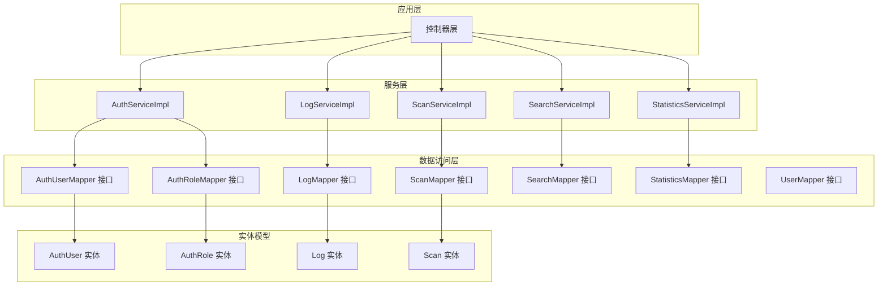
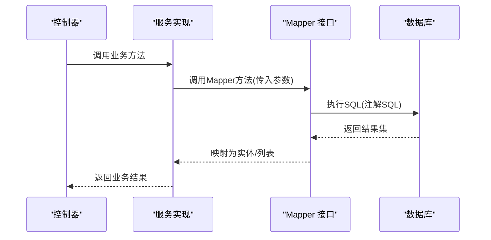
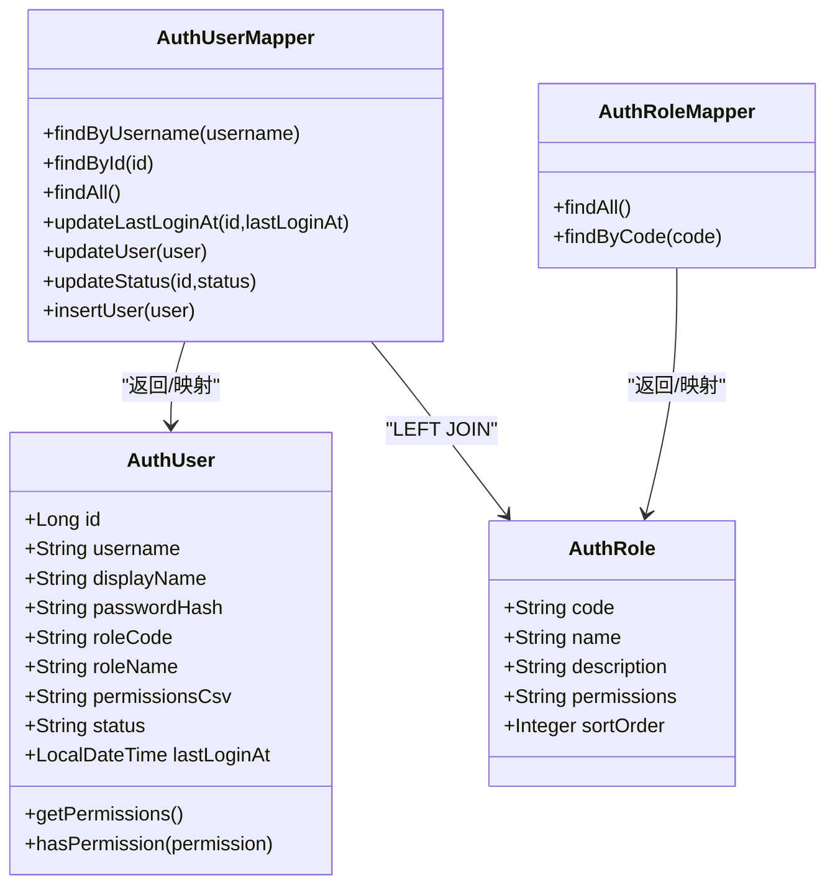
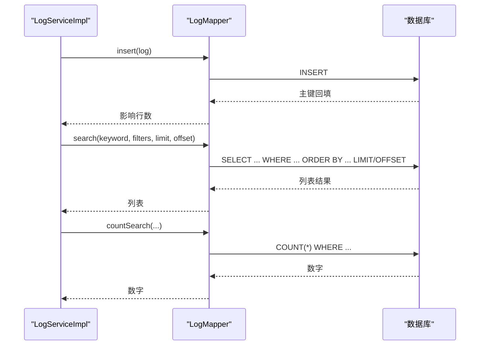
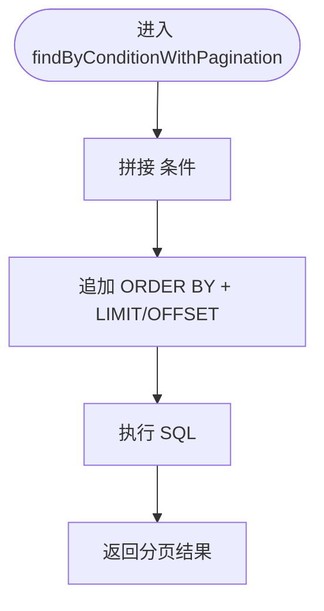
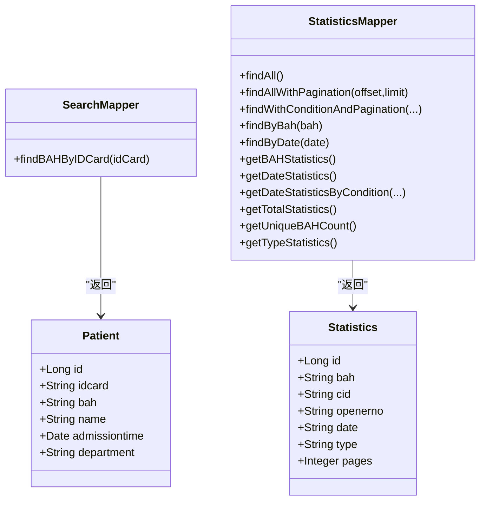
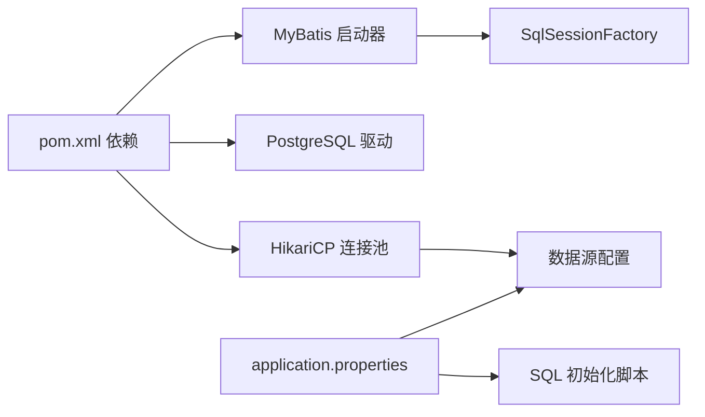

# 数据访问层

<cite>
**本文引用的文件**
- [AuthUserMapper.java](file://backend-repo/src/main/java/com/zjcxph/imgapi/mapper/AuthUserMapper.java)
- [AuthRoleMapper.java](file://backend-repo/src/main/java/com/zjcxph/imgapi/mapper/AuthRoleMapper.java)
- [LogMapper.java](file://backend-repo/src/main/java/com/zjcxph/imgapi/mapper/LogMapper.java)
- [ScanMapper.java](file://backend-repo/src/main/java/com/zjcxph/imgapi/mapper/ScanMapper.java)
- [SearchMapper.java](file://backend-repo/src/main/java/com/zjcxph/imgapi/mapper/SearchMapper.java)
- [StatisticsMapper.java](file://backend-repo/src/main/java/com/zjcxph/imgapi/mapper/StatisticsMapper.java)
- [UserMapper.java](file://backend-repo/src/main/java/com/zjcxph/imgapi/mapper/UserMapper.java)
- [AuthUser.java](file://backend-repo/src/main/java/com/zjcxph/imgapi/entity/AuthUser.java)
- [AuthRole.java](file://backend-repo/src/main/java/com/zjcxph/imgapi/entity/AuthRole.java)
- [Log.java](file://backend-repo/src/main/java/com/zjcxph/imgapi/entity/Log.java)
- [Scan.java](file://backend-repo/src/main/java/com/zjcxph/imgapi/entity/Scan.java)
- [application.properties](file://backend-repo/src/main/resources/application.properties)
- [pom.xml](file://backend-repo/pom.xml)
- [AuthServiceImpl.java](file://backend-repo/src/main/java/com/zjcxph/imgapi/service/impl/AuthServiceImpl.java)
- [LogServiceImpl.java](file://backend-repo/src/main/java/com/zjcxph/imgapi/service/impl/LogServiceImpl.java)
- [ScanServiceImpl.java](file://backend-repo/src/main/java/com/zjcxph/imgapi/service/impl/ScanServiceImpl.java)
- [SearchServiceImpl.java](file://backend-repo/src/main/java/com/zjcxph/imgapi/service/impl/SearchServiceImpl.java)
- [StatisticsServiceImpl.java](file://backend-repo/src/main/java/com/zjcxph/imgapi/service/impl/StatisticsServiceImpl.java)
</cite>

## 目录
1. [简介](#简介)
2. [项目结构](#项目结构)
3. [核心组件](#核心组件)
4. [架构总览](#架构总览)
5. [详细组件分析](#详细组件分析)
6. [依赖关系分析](#依赖关系分析)
7. [性能考量](#性能考量)
8. [故障排查指南](#故障排查指南)
9. [结论](#结论)
10. [附录](#附录)

## 简介
本设计文档聚焦于MRR项目的“数据访问层”，系统性阐述基于MyBatis的Mapper接口设计模式、SQL映射配置、CRUD与复杂查询实现、分页策略、事务与连接池配置、性能优化与缓存策略，并结合服务层交互与依赖注入进行说明。文档面向开发者与运维人员，兼顾可读性与工程实践。

## 项目结构
后端采用Spring Boot + MyBatis结构，数据访问层位于mapper包，实体类位于entity包，服务层位于service.impl包，配置集中在application.properties与pom.xml中。下图展示与数据访问层直接相关的模块关系：

图表来源
- [AuthServiceImpl.java:25-34](file://backend-repo/src/main/java/com/zjcxph/imgapi/service/impl/AuthServiceImpl.java#L25-L34)
- [LogServiceImpl.java:11-15](file://backend-repo/src/main/java/com/zjcxph/imgapi/service/impl/LogServiceImpl.java#L11-L15)
- [ScanServiceImpl.java:15-24](file://backend-repo/src/main/java/com/zjcxph/imgapi/service/impl/ScanServiceImpl.java#L15-L24)
- [SearchServiceImpl.java:11-19](file://backend-repo/src/main/java/com/zjcxph/imgapi/service/impl/SearchServiceImpl.java#L11-L19)
- [StatisticsServiceImpl.java:13-20](file://backend-repo/src/main/java/com/zjcxph/imgapi/service/impl/StatisticsServiceImpl.java#L13-L20)
- [AuthUserMapper.java:13-77](file://backend-repo/src/main/java/com/zjcxph/imgapi/mapper/AuthUserMapper.java#L13-L77)
- [AuthRoleMapper.java:10-18](file://backend-repo/src/main/java/com/zjcxph/imgapi/mapper/AuthRoleMapper.java#L10-L18)
- [LogMapper.java:9-165](file://backend-repo/src/main/java/com/zjcxph/imgapi/mapper/LogMapper.java#L9-L165)
- [ScanMapper.java:15-130](file://backend-repo/src/main/java/com/zjcxph/imgapi/mapper/ScanMapper.java#L15-L130)
- [SearchMapper.java:9-15](file://backend-repo/src/main/java/com/zjcxph/imgapi/mapper/SearchMapper.java#L9-L15)
- [StatisticsMapper.java:13-167](file://backend-repo/src/main/java/com/zjcxph/imgapi/mapper/StatisticsMapper.java#L13-L167)
- [UserMapper.java:7-12](file://backend-repo/src/main/java/com/zjcxph/imgapi/mapper/UserMapper.java#L7-L12)

章节来源
- [application.properties:10-22](file://backend-repo/src/main/resources/application.properties#L10-L22)
- [pom.xml:27-44](file://backend-repo/pom.xml#L27-L44)

## 核心组件
- Mapper接口：以注解形式声明SQL，覆盖基础CRUD、关联查询、动态条件查询、分页查询与统计聚合。
- 实体类：承载数据库字段到Java对象的映射，部分实体提供工具方法（如权限解析）。
- 服务实现：通过构造函数注入Mapper，封装业务逻辑并调用Mapper执行数据操作。
- 配置：数据源与连接池参数、MyBatis启动器依赖、SQL初始化脚本位置等。

章节来源
- [AuthUserMapper.java:13-77](file://backend-repo/src/main/java/com/zjcxph/imgapi/mapper/AuthUserMapper.java#L13-L77)
- [AuthRoleMapper.java:10-18](file://backend-repo/src/main/java/com/zjcxph/imgapi/mapper/AuthRoleMapper.java#L10-L18)
- [LogMapper.java:9-165](file://backend-repo/src/main/java/com/zjcxph/imgapi/mapper/LogMapper.java#L9-L165)
- [ScanMapper.java:15-130](file://backend-repo/src/main/java/com/zjcxph/imgapi/mapper/ScanMapper.java#L15-L130)
- [SearchMapper.java:9-15](file://backend-repo/src/main/java/com/zjcxph/imgapi/mapper/SearchMapper.java#L9-L15)
- [StatisticsMapper.java:13-167](file://backend-repo/src/main/java/com/zjcxph/imgapi/mapper/StatisticsMapper.java#L13-L167)
- [UserMapper.java:7-12](file://backend-repo/src/main/java/com/zjcxph/imgapi/mapper/UserMapper.java#L7-L12)
- [AuthUser.java:12-133](file://backend-repo/src/main/java/com/zjcxph/imgapi/entity/AuthUser.java#L12-L133)
- [AuthRole.java:5-52](file://backend-repo/src/main/java/com/zjcxph/imgapi/entity/AuthRole.java#L5-L52)
- [Log.java:7-137](file://backend-repo/src/main/java/com/zjcxph/imgapi/entity/Log.java#L7-L137)
- [Scan.java:9-115](file://backend-repo/src/main/java/com/zjcxph/imgapi/entity/Scan.java#L9-L115)
- [application.properties:10-22](file://backend-repo/src/main/resources/application.properties#L10-L22)
- [pom.xml:27-44](file://backend-repo/pom.xml#L27-L44)

## 架构总览
数据访问层遵循“接口驱动 + 注解SQL”的设计，服务层通过依赖注入获取Mapper实例，控制器层调用服务层完成业务编排。MyBatis自动扫描Mapper接口并生成代理，执行SQL时依据注解中的SQL字符串与参数绑定规则完成映射。

图表来源
- [AuthServiceImpl.java:36-62](file://backend-repo/src/main/java/com/zjcxph/imgapi/service/impl/AuthServiceImpl.java#L36-L62)
- [LogServiceImpl.java:17-49](file://backend-repo/src/main/java/com/zjcxph/imgapi/service/impl/LogServiceImpl.java#L17-L49)
- [ScanServiceImpl.java:26-127](file://backend-repo/src/main/java/com/zjcxph/imgapi/service/impl/ScanServiceImpl.java#L26-L127)
- [SearchServiceImpl.java:21-24](file://backend-repo/src/main/java/com/zjcxph/imgapi/service/impl/SearchServiceImpl.java#L21-L24)
- [StatisticsServiceImpl.java:22-45](file://backend-repo/src/main/java/com/zjcxph/imgapi/service/impl/StatisticsServiceImpl.java#L22-L45)

## 详细组件分析

### 认证用户与角色：AuthUserMapper 与 AuthRoleMapper
- 设计要点
  - 使用@Mapper标注接口，MyBatis自动扫描。
  - 关联查询：AuthUserMapper通过LEFT JOIN将用户与角色信息拼装到一个实体中，便于服务层直接使用。
  - 参数传递：@Param用于明确SQL参数名，避免按索引绑定带来的歧义。
  - 结果映射：通过SQL别名与实体字段一一对应，实现自动映射。
- 方法概览
  - 用户：按用户名/ID查询、更新最后登录时间、更新状态、更新用户信息、插入用户。
  - 角色：查询全部角色、按编码查询角色。
- 性能与优化
  - 关联查询在单次查询中返回所需字段，减少多次往返。
  - 建议在常用查询列上建立索引（如username、id、role_code）。

图表来源
- [AuthUserMapper.java:13-77](file://backend-repo/src/main/java/com/zjcxph/imgapi/mapper/AuthUserMapper.java#L13-L77)
- [AuthRoleMapper.java:10-18](file://backend-repo/src/main/java/com/zjcxph/imgapi/mapper/AuthRoleMapper.java#L10-L18)
- [AuthUser.java:12-133](file://backend-repo/src/main/java/com/zjcxph/imgapi/entity/AuthUser.java#L12-L133)
- [AuthRole.java:5-52](file://backend-repo/src/main/java/com/zjcxph/imgapi/entity/AuthRole.java#L5-L52)

章节来源
- [AuthUserMapper.java:13-77](file://backend-repo/src/main/java/com/zjcxph/imgapi/mapper/AuthUserMapper.java#L13-L77)
- [AuthRoleMapper.java:10-18](file://backend-repo/src/main/java/com/zjcxph/imgapi/mapper/AuthRoleMapper.java#L10-L18)
- [AuthUser.java:12-133](file://backend-repo/src/main/java/com/zjcxph/imgapi/entity/AuthUser.java#L12-L133)
- [AuthRole.java:5-52](file://backend-repo/src/main/java/com/zjcxph/imgapi/entity/AuthRole.java#L5-L52)

### 日志访问：LogMapper
- 设计要点
  - 基础列常量：统一抽取列清单，避免重复与不一致。
  - 插入：使用@Options生成主键并回填到实体。
  - 分页：通过LIMIT/OFFSET实现分页，服务层负责计算offset。
  - 过滤与搜索：支持IP、URI、方法、状态、时间范围等多维过滤；全文检索使用LIKE组合。
  - 清理：提供按截止时间删除与计数的SQL，配合定时任务清理过期日志。
- 方法概览
  - 插入、按ID查询、分页查询、按客户端IP/请求URI过滤、按截止时间清理、按截止时间查询、搜索与计数、全量计数、按维度计数。

图表来源
- [LogMapper.java:9-165](file://backend-repo/src/main/java/com/zjcxph/imgapi/mapper/LogMapper.java#L9-L165)
- [LogServiceImpl.java:17-69](file://backend-repo/src/main/java/com/zjcxph/imgapi/service/impl/LogServiceImpl.java#L17-L69)

章节来源
- [LogMapper.java:9-165](file://backend-repo/src/main/java/com/zjcxph/imgapi/mapper/LogMapper.java#L9-L165)
- [LogServiceImpl.java:17-69](file://backend-repo/src/main/java/com/zjcxph/imgapi/service/impl/LogServiceImpl.java#L17-L69)

### 扫描/归档：ScanMapper
- 设计要点
  - 动态IN查询：通过XML脚本与<foreach>实现批量ID查询。
  - 条件更新：<set>标签动态拼接更新字段，仅对非空字段生效。
  - 动态查询：<where>与<if>组合实现多条件过滤。
  - 分页：标准LIMIT/OFFSET分页。
  - 计数：与动态查询配套的COUNT(*)统计。
- 方法概览
  - 按病案号查询、按ID集合查询路径、更新图像类型、插入、软删除、更新、查询全部、按ID查询、按病案号/病人序号查询、分页查询、动态条件查询、动态条件+分页查询、按条件计数。

图表来源
- [ScanMapper.java:80-129](file://backend-repo/src/main/java/com/zjcxph/imgapi/mapper/ScanMapper.java#L80-L129)

章节来源
- [ScanMapper.java:15-130](file://backend-repo/src/main/java/com/zjcxph/imgapi/mapper/ScanMapper.java#L15-L130)
- [ScanServiceImpl.java:103-133](file://backend-repo/src/main/java/com/zjcxph/imgapi/service/impl/ScanServiceImpl.java#L103-L133)

### 搜索与统计：SearchMapper 与 StatisticsMapper
- SearchMapper
  - 通过身份证号查询病案号相关信息，返回Patient列表。
- StatisticsMapper
  - 提供多维统计与聚合：按病案号、日期、类型统计记录数与总页数。
  - 支持关键字、类型、日期范围筛选与排序控制（动态排序字段与方向）。
  - 提供分页查询与计数。

图表来源
- [SearchMapper.java:9-15](file://backend-repo/src/main/java/com/zjcxph/imgapi/mapper/SearchMapper.java#L9-L15)
- [StatisticsMapper.java:13-167](file://backend-repo/src/main/java/com/zjcxph/imgapi/mapper/StatisticsMapper.java#L13-L167)

章节来源
- [SearchMapper.java:9-15](file://backend-repo/src/main/java/com/zjcxph/imgapi/mapper/SearchMapper.java#L9-L15)
- [StatisticsMapper.java:13-167](file://backend-repo/src/main/java/com/zjcxph/imgapi/mapper/StatisticsMapper.java#L13-L167)
- [SearchServiceImpl.java:21-24](file://backend-repo/src/main/java/com/zjcxph/imgapi/service/impl/SearchServiceImpl.java#L21-L24)
- [StatisticsServiceImpl.java:22-96](file://backend-repo/src/main/java/com/zjcxph/imgapi/service/impl/StatisticsServiceImpl.java#L22-L96)

### 其他Mapper
- UserMapper：最小化示例，按ID查询用户。
- 作用：验证Mapper扫描与基本查询能力。

章节来源
- [UserMapper.java:7-12](file://backend-repo/src/main/java/com/zjcxph/imgapi/mapper/UserMapper.java#L7-L12)

## 依赖关系分析
- 依赖注入
  - 服务实现通过构造函数注入Mapper，确保线程安全与不可变性。
- MyBatis启动器
  - 引入mybatis-spring-boot-starter，自动装配SqlSessionFactory与MapperScannerConfigurer。
- 数据源与连接池
  - HikariCP作为默认连接池，提供最大池大小、最小空闲、连接超时、空闲超时、最大生存时间等参数。
- SQL初始化
  - Spring Boot在启动时加载PostgreSQL脚本，确保表结构存在。

图表来源
- [pom.xml:27-44](file://backend-repo/pom.xml#L27-L44)
- [application.properties:10-22](file://backend-repo/src/main/resources/application.properties#L10-L22)

章节来源
- [pom.xml:27-44](file://backend-repo/pom.xml#L27-L44)
- [application.properties:10-22](file://backend-repo/src/main/resources/application.properties#L10-L22)

## 性能考量
- SQL层面
  - 关联查询一次性返回所需字段，减少往返。
  - 动态条件使用<where>+<if>，避免拼接SQL风险；注意在高频字段上建立索引。
  - 分页使用LIMIT/OFFSET，建议对排序字段建立复合索引。
- 连接池与事务
  - HikariCP参数已配置，建议根据并发与查询复杂度调整最大池大小与连接超时。
  - 事务管理：服务层方法通常承担事务边界，Mapper本身不显式开启事务；若需要跨多个Mapper的原子性操作，应在服务层使用@Transactional。
- 缓存策略
  - MyBatis二级缓存：可在Mapper级别启用，适合只读或低写场景；需谨慎处理脏读。
  - 查询结果缓存：可在服务层引入Redis等缓存组件，对热点查询结果进行缓存。
- 批量操作
  - 可考虑使用JDBC批处理或MyBatis的批量插入/更新（需自定义SQL），减少网络往返。
- 监控与日志
  - 开启mapper日志级别，便于定位慢查询与异常。

章节来源
- [application.properties:10-22](file://backend-repo/src/main/resources/application.properties#L10-L22)
- [pom.xml:27-44](file://backend-repo/pom.xml#L27-L44)

## 故障排查指南
- SQL语法与参数
  - XML脚本中使用了HTML转义字符（如&lt;、&gt;），需确保MyBatis正确解析；如遇异常，检查脚本片段与参数命名一致性。
- 分页偏移
  - 服务层需正确计算offset = (page - 1) * size；若出现空页或重复数据，检查分页参数与排序字段。
- 字段映射
  - SQL别名需与实体字段严格对应；若出现字段为空，检查实体getter/setter与Lombok配置。
- 连接池问题
  - 若出现连接耗尽或超时，检查maximum-pool-size、connection-timeout、idle-timeout、max-lifetime参数。
- 日志清理
  - 清理任务依赖截止时间与批次大小，确保数据库具备相应索引以提升删除效率。

章节来源
- [LogMapper.java:41-51](file://backend-repo/src/main/java/com/zjcxph/imgapi/mapper/LogMapper.java#L41-L51)
- [LogMapper.java:58-68](file://backend-repo/src/main/java/com/zjcxph/imgapi/mapper/LogMapper.java#L58-L68)
- [application.properties:15-19](file://backend-repo/src/main/resources/application.properties#L15-L19)

## 结论
本数据访问层以MyBatis注解为核心，结合动态SQL与分页策略，实现了认证、日志、扫描、搜索与统计等关键业务的数据持久化需求。通过合理的参数传递、结果映射与连接池配置，满足了生产环境的可用性与性能要求。建议在高并发场景下进一步完善缓存与批量处理策略，并持续监控慢查询与连接池健康状况。

## 附录
- 使用示例（路径）
  - 登录流程：[AuthServiceImpl.java:36-62](file://backend-repo/src/main/java/com/zjcxph/imgapi/service/impl/AuthServiceImpl.java#L36-L62)
  - 日志保存与分页查询：[LogServiceImpl.java:17-69](file://backend-repo/src/main/java/com/zjcxph/imgapi/service/impl/LogServiceImpl.java#L17-L69)
  - 扫描数据分页与条件查询：[ScanServiceImpl.java:103-133](file://backend-repo/src/main/java/com/zjcxph/imgapi/service/impl/ScanServiceImpl.java#L103-L133)
  - 搜索与统计：[SearchServiceImpl.java:21-24](file://backend-repo/src/main/java/com/zjcxph/imgapi/service/impl/SearchServiceImpl.java#L21-L24)、[StatisticsServiceImpl.java:22-96](file://backend-repo/src/main/java/com/zjcxph/imgapi/service/impl/StatisticsServiceImpl.java#L22-L96)
- 异常处理与错误恢复
  - 服务层对空结果与无效参数进行判空与抛错，避免空指针；建议在全局异常处理器中统一包装响应。
- 依赖注入配置
  - 通过构造函数注入Mapper，保证线程安全与可测试性；无需XML配置即可启用Mapper扫描。