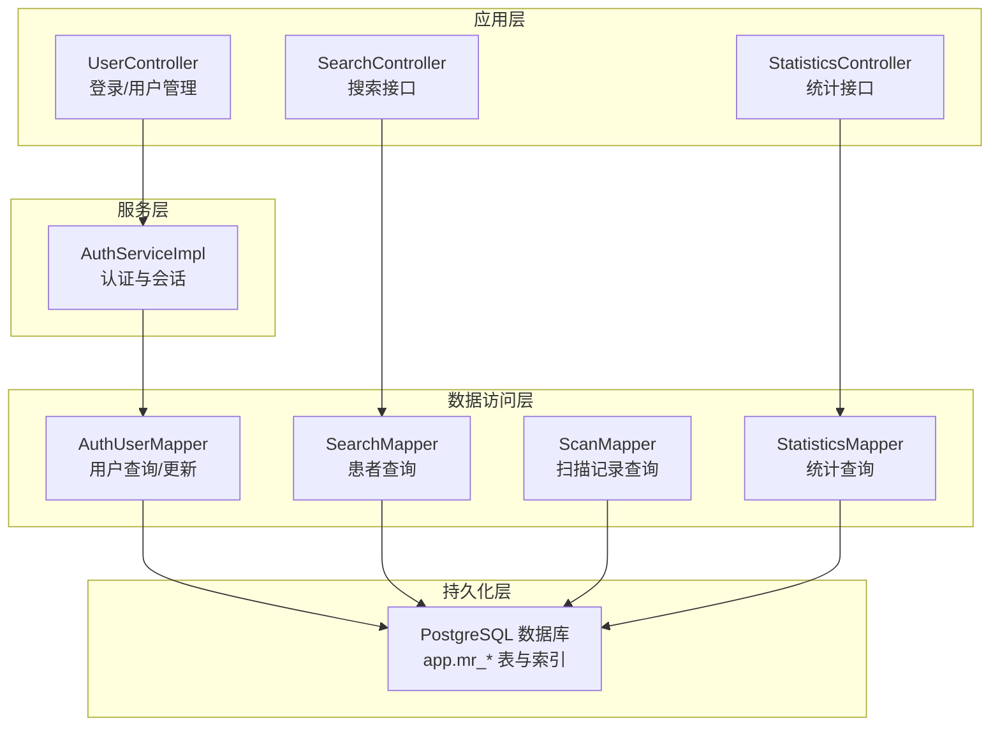
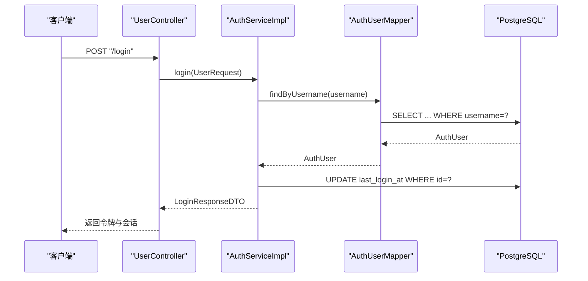
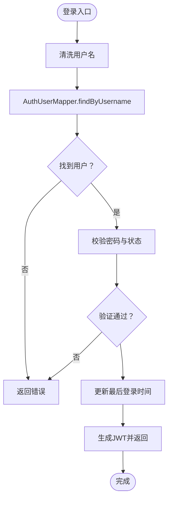
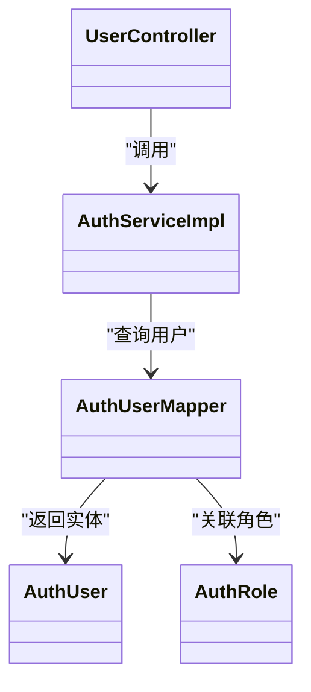

# 索引与查询优化

<cite>
**本文引用的文件**
- [schema-postgresql.sql](file://backend-repo/src/main/resources/schema-postgresql.sql)
- [schema.sql](file://mrr-db/schema.sql)
- [application.properties](file://backend-repo/src/main/resources/application.properties)
- [AuthUserMapper.java](file://backend-repo/src/main/java/com/zjcxph/imgapi/mapper/AuthUserMapper.java)
- [SearchMapper.java](file://backend-repo/src/main/java/com/zjcxph/imgapi/mapper/SearchMapper.java)
- [ScanMapper.java](file://backend-repo/src/main/java/com/zjcxph/imgapi/mapper/ScanMapper.java)
- [StatisticsMapper.java](file://backend-repo/src/main/java/com/zjcxph/imgapi/mapper/StatisticsMapper.java)
- [AuthUser.java](file://backend-repo/src/main/java/com/zjcxph/imgapi/entity/AuthUser.java)
- [AuthRole.java](file://backend-repo/src/main/java/com/zjcxph/imgapi/entity/AuthRole.java)
- [UserController.java](file://backend-repo/src/main/java/com/zjcxph/imgapi/controller/UserController.java)
- [SearchController.java](file://backend-repo/src/main/java/com/zjcxph/imgapi/controller/SearchController.java)
- [StatisticsController.java](file://backend-repo/src/main/java/com/zjcxph/imgapi/controller/StatisticsController.java)
- [AuthServiceImpl.java](file://backend-repo/src/main/java/com/zjcxph/imgapi/service/impl/AuthServiceImpl.java)
</cite>

## 目录
1. [简介](#简介)
2. [项目结构](#项目结构)
3. [核心组件](#核心组件)
4. [架构总览](#架构总览)
5. [详细组件分析](#详细组件分析)
6. [依赖关系分析](#依赖关系分析)
7. [性能考量](#性能考量)
8. [故障排查指南](#故障排查指南)
9. [结论](#结论)
10. [附录](#附录)

## 简介
本技术文档聚焦于MRR数据库的索引与查询优化，目标包括：
- 深入评估现有索引策略的有效性与性能影响
- 解释用户名索引、角色代码索引、病案号索引等关键索引的设计原理与优化效果
- 记录高频查询的SQL执行计划分析、索引选择性评估与瓶颈识别
- 说明复合索引设计原则、覆盖索引应用场景与索引维护策略
- 提供慢查询日志分析、执行计划优化与数据库参数调优建议
- 总结索引创建最佳实践、性能监控指标与容量规划建议
- 阐述不同查询模式下的索引选择策略

## 项目结构
后端采用Spring Boot + MyBatis，数据库初始化脚本位于PostgreSQL模式下，表与索引定义集中于初始化SQL；应用通过Mapper层映射SQL至实体，控制器层暴露REST接口。

图表来源
- [application.properties:10-22](file://backend-repo/src/main/resources/application.properties#L10-L22)
- [AuthUserMapper.java:16-29](file://backend-repo/src/main/java/com/zjcxph/imgapi/mapper/AuthUserMapper.java#L16-L29)
- [SearchMapper.java:14-15](file://backend-repo/src/main/java/com/zjcxph/imgapi/mapper/SearchMapper.java#L14-L15)
- [ScanMapper.java:17-70](file://backend-repo/src/main/java/com/zjcxph/imgapi/mapper/ScanMapper.java#L17-L70)
- [StatisticsMapper.java:108-114](file://backend-repo/src/main/java/com/zjcxph/imgapi/mapper/StatisticsMapper.java#L108-L114)
- [schema-postgresql.sql:3-59](file://backend-repo/src/main/resources/schema-postgresql.sql#L3-L59)

章节来源
- [application.properties:10-22](file://backend-repo/src/main/resources/application.properties#L10-L22)
- [schema-postgresql.sql:1-109](file://backend-repo/src/main/resources/schema-postgresql.sql#L1-L109)

## 核心组件
- 用户认证与授权
  - 实体：AuthUser、AuthRole
  - Mapper：AuthUserMapper（用户名/角色码查询、分页、更新）
  - 控制器：UserController（登录、用户列表、角色列表、更新、禁用）
  - 服务：AuthServiceImpl（登录校验、会话构建、用户状态更新）

- 搜索与统计
  - SearchMapper：按身份证查询病案号
  - ScanMapper：按病案号/编号查询、动态条件分页查询
  - StatisticsMapper：按条件/日期/类型统计、分页与聚合

- 数据库与索引
  - 初始化脚本定义表结构与索引，涵盖mr_auth_user、mr_patient、mr_scan、mr_statistics、access_log等

章节来源
- [AuthUser.java:13-134](file://backend-repo/src/main/java/com/zjcxph/imgapi/entity/AuthUser.java#L13-L134)
- [AuthRole.java:6-53](file://backend-repo/src/main/java/com/zjcxph/imgapi/entity/AuthRole.java#L6-L53)
- [AuthUserMapper.java:16-62](file://backend-repo/src/main/java/com/zjcxph/imgapi/mapper/AuthUserMapper.java#L16-L62)
- [UserController.java:38-94](file://backend-repo/src/main/java/com/zjcxph/imgapi/controller/UserController.java#L38-L94)
- [SearchMapper.java:14-15](file://backend-repo/src/main/java/com/zjcxph/imgapi/mapper/SearchMapper.java#L14-L15)
- [ScanMapper.java:17-129](file://backend-repo/src/main/java/com/zjcxph/imgapi/mapper/ScanMapper.java#L17-L129)
- [StatisticsMapper.java:108-167](file://backend-repo/src/main/java/com/zjcxph/imgapi/mapper/StatisticsMapper.java#L108-L167)
- [schema-postgresql.sql:3-89](file://backend-repo/src/main/resources/schema-postgresql.sql#L3-L89)

## 架构总览
应用通过控制器接收请求，调用服务层进行业务处理，服务层再通过Mapper执行SQL，最终访问PostgreSQL数据库。索引策略直接影响查询性能，尤其是高频路径如登录、搜索、统计。

图表来源
- [UserController.java:38-47](file://backend-repo/src/main/java/com/zjcxph/imgapi/controller/UserController.java#L38-L47)
- [AuthServiceImpl.java:36-62](file://backend-repo/src/main/java/com/zjcxph/imgapi/service/impl/AuthServiceImpl.java#L36-L62)
- [AuthUserMapper.java:16-29](file://backend-repo/src/main/java/com/zjcxph/imgapi/mapper/AuthUserMapper.java#L16-L29)
- [schema-postgresql.sql:49-59](file://backend-repo/src/main/resources/schema-postgresql.sql#L49-L59)

## 详细组件分析

### 用户名索引与角色代码索引
- 设计原理
  - 用户名唯一且用于登录主键查找，适合单列唯一索引
  - 角色代码用于连接查询，适合单列索引
- 查询优化效果
  - 登录流程通过用户名快速定位用户，避免全表扫描
  - 用户列表与权限关联查询可利用角色码索引减少连接成本
- 现状与建议
  - 已存在用户名与角色码索引
  - 可考虑在用户表上建立覆盖索引以进一步减少回表

图表来源
- [AuthServiceImpl.java:36-62](file://backend-repo/src/main/java/com/zjcxph/imgapi/service/impl/AuthServiceImpl.java#L36-L62)
- [AuthUserMapper.java:16-29](file://backend-repo/src/main/java/com/zjcxph/imgapi/mapper/AuthUserMapper.java#L16-L29)
- [schema-postgresql.sql:49-59](file://backend-repo/src/main/resources/schema-postgresql.sql#L49-L59)

章节来源
- [AuthUserMapper.java:16-29](file://backend-repo/src/main/java/com/zjcxph/imgapi/mapper/AuthUserMapper.java#L16-L29)
- [schema-postgresql.sql:80-82](file://backend-repo/src/main/resources/schema-postgresql.sql#L80-L82)

### 身份证号到病案号的查询索引
- 设计原理
  - 搜索接口按身份证精确匹配，需在mr_patient.idcard建立索引
- 查询优化效果
  - 精确等值查询可直接走索引，避免全表扫描
- 现状与建议
  - 已存在mr_patient.idcard索引
  - 若存在大量模糊匹配需求，可评估是否引入函数索引或规范化输入

章节来源
- [SearchMapper.java:14-15](file://backend-repo/src/main/java/com/zjcxph/imgapi/mapper/SearchMapper.java#L14-L15)
- [schema-postgresql.sql](file://backend-repo/src/main/resources/schema-postgresql.sql#L80)

### 病案号与编号的查询索引
- 设计原理
  - mr_scan按BAH与BRXH查询频繁，分别建立索引
  - BAH用于病案号检索，BRXH用于病人序号检索
- 查询优化效果
  - 等值查询可快速定位记录，有序查询可利用索引排序
- 现状与建议
  - 已存在BAH与BRXH索引
  - 对于动态条件分页查询，建议结合覆盖索引减少回表

章节来源
- [ScanMapper.java:17-74](file://backend-repo/src/main/java/com/zjcxph/imgapi/mapper/ScanMapper.java#L17-L74)
- [schema-postgresql.sql:75-76](file://backend-repo/src/main/resources/schema-postgresql.sql#L75-L76)

### 统计数据查询索引
- 设计原理
  - mr_statistics按bah/date/type等字段查询与聚合，已建立相应索引
  - 日期字段使用REPLACE函数，可能影响索引使用，建议统一存储格式或使用函数索引
- 查询优化效果
  - 精确匹配与范围查询可利用索引
  - 聚合查询可借助索引减少数据扫描
- 现状与建议
  - 已存在bah、date、type索引
  - 对日期范围查询，建议统一日期格式或在查询中避免函数转换

章节来源
- [StatisticsMapper.java:108-114](file://backend-repo/src/main/java/com/zjcxph/imgapi/mapper/StatisticsMapper.java#L108-L114)
- [schema-postgresql.sql:77-79](file://backend-repo/src/main/resources/schema-postgresql.sql#L77-L79)

### 访问日志索引
- 设计原理
  - access_log用于审计与监控，按时间、方法、状态等维度查询
  - 已建立access_time、client_ip、request_uri、method、response_status等索引
  - 同时建立了按时间升序与id升序的复合索引，便于分页与时间序列扫描
- 查询优化效果
  - 时间序列查询与分页扫描效率提升
  - 多维过滤查询可利用索引组合
- 现状与建议
  - 已有较全面的索引覆盖
  - 建议定期清理旧日志，控制表规模

章节来源
- [schema-postgresql.sql:61-89](file://backend-repo/src/main/resources/schema-postgresql.sql#L61-L89)

## 依赖关系分析
- 控制器依赖服务层，服务层依赖Mapper，Mapper依赖数据库
- 关键依赖链：UserController → AuthServiceImpl → AuthUserMapper → app.mr_auth_user
- 查询依赖索引：登录依赖用户名索引，搜索依赖身份证索引，统计依赖bah/date/type索引

图表来源
- [UserController.java:32-36](file://backend-repo/src/main/java/com/zjcxph/imgapi/controller/UserController.java#L32-L36)
- [AuthServiceImpl.java:26-34](file://backend-repo/src/main/java/com/zjcxph/imgapi/service/impl/AuthServiceImpl.java#L26-L34)
- [AuthUserMapper.java:14-29](file://backend-repo/src/main/java/com/zjcxph/imgapi/mapper/AuthUserMapper.java#L14-L29)
- [AuthUser.java:13-25](file://backend-repo/src/main/java/com/zjcxph/imgapi/entity/AuthUser.java#L13-L25)
- [AuthRole.java:6-12](file://backend-repo/src/main/java/com/zjcxph/imgapi/entity/AuthRole.java#L6-L12)

## 性能考量
- 索引选择性
  - 用户名与角色码具备高选择性，适合单列索引
  - 身份证号与病案号具备高选择性，适合单列索引
  - 日期字段若存在函数转换，可能降低索引选择性，建议统一格式
- 覆盖索引
  - 登录与用户列表查询可考虑覆盖索引，减少回表
  - 统计查询中的常用投影可纳入覆盖索引
- 执行计划优化
  - 使用EXPLAIN/ANALYZE观察查询计划，确认索引被使用
  - 避免在WHERE中对列使用函数，防止索引失效
- 数据库参数调优
  - 连接池大小：根据并发与资源情况调整最大连接数
  - 日志保留：按天清理access_log，避免表膨胀
- 监控与告警
  - 开启慢查询日志与执行计划分析
  - 关注索引命中率与查询耗时分布

## 故障排查指南
- 登录失败
  - 检查用户名是否存在与状态是否有效
  - 确认用户名索引可用，避免全表扫描
- 搜索无结果
  - 核对身份证号输入是否正确与索引是否生效
  - 检查数据是否已入库
- 统计查询慢
  - 确认日期格式是否与索引一致
  - 检查是否使用了函数导致索引失效
- 访问日志查询慢
  - 检查时间范围与过滤条件
  - 确认复合索引是否被合理利用

章节来源
- [AuthServiceImpl.java:45-54](file://backend-repo/src/main/java/com/zjcxph/imgapi/service/impl/AuthServiceImpl.java#L45-L54)
- [SearchMapper.java:14-15](file://backend-repo/src/main/java/com/zjcxph/imgapi/mapper/SearchMapper.java#L14-L15)
- [StatisticsMapper.java:131-147](file://backend-repo/src/main/java/com/zjcxph/imgapi/mapper/StatisticsMapper.java#L131-L147)
- [schema-postgresql.sql:80-89](file://backend-repo/src/main/resources/schema-postgresql.sql#L80-L89)

## 结论
- 现有索引策略基本覆盖高频查询路径，登录、搜索、统计与日志查询均有对应索引保障
- 建议持续关注索引选择性与执行计划，避免函数转换导致的索引失效
- 通过覆盖索引与合理的复合索引设计，可进一步降低回表与排序成本
- 建立完善的慢查询日志与监控体系，配合参数调优与容量规划，确保系统长期稳定高效运行

## 附录
- 索引创建最佳实践
  - 高选择性列优先建索引
  - 覆盖常用查询投影，减少回表
  - 避免在WHERE中对列使用函数
  - 定期分析执行计划与索引使用情况
- 性能监控指标
  - 查询响应时间P50/P95/P99
  - 索引命中率
  - 缓冲区命中率
  - 慢查询数量与占比
- 容量规划建议
  - 基于访问日志趋势估算数据增长
  - 制定定期归档与清理策略
  - 评估连接池与磁盘IO瓶颈