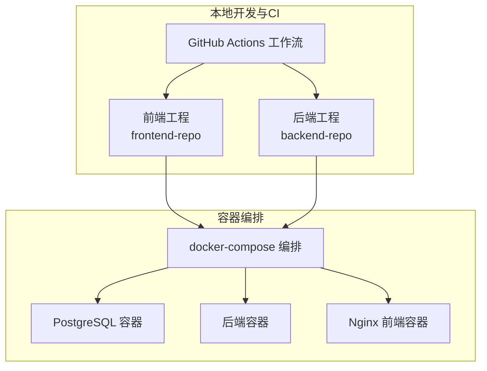
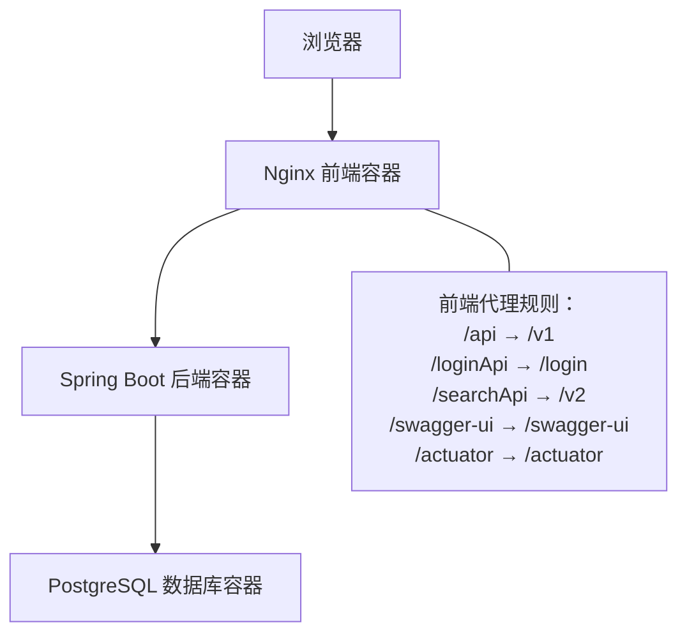
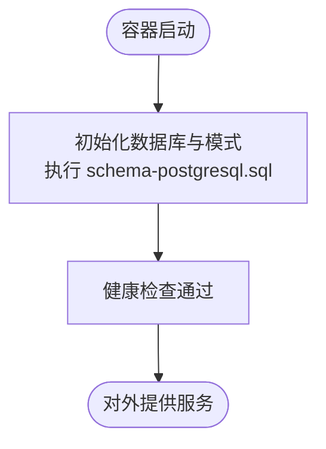
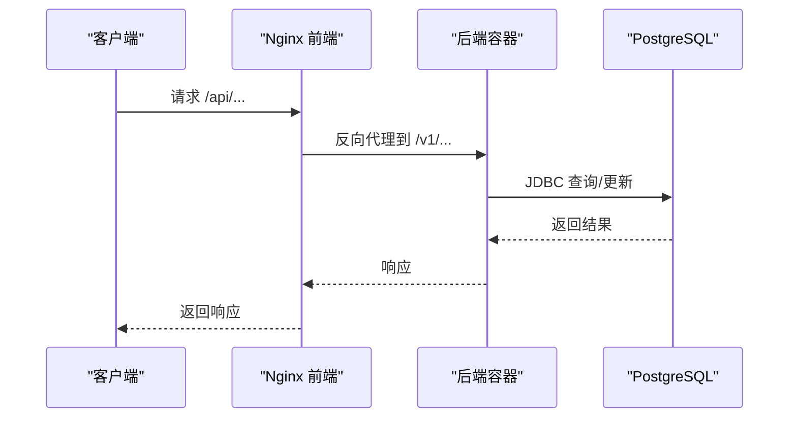
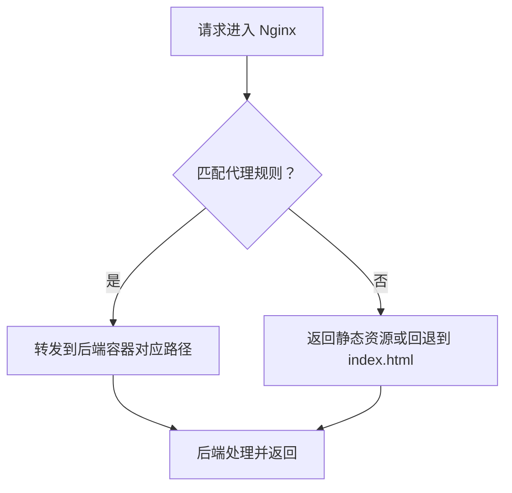
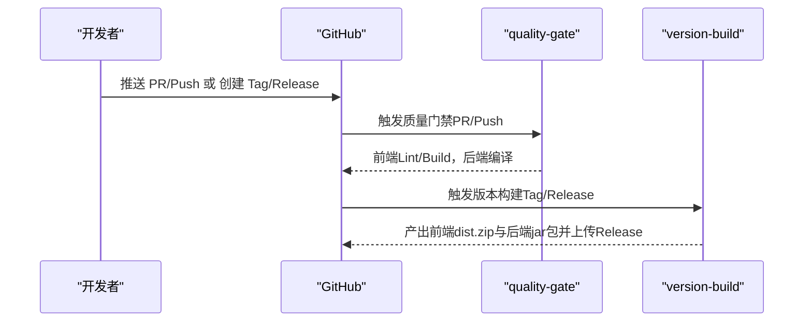
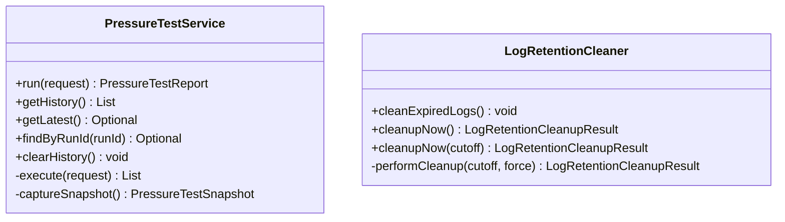
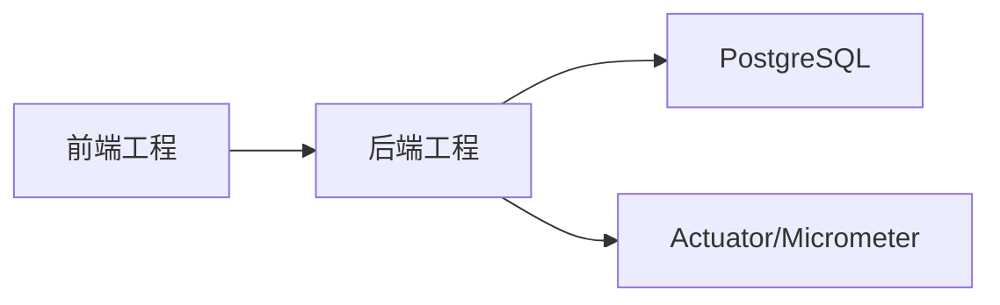

# 部署架构

<cite>
**本文引用的文件**
- [docker-compose.yml](file://docker-compose.yml)
- [backend-repo/Dockerfile](file://backend-repo/Dockerfile)
- [frontend-repo/Dockerfile](file://frontend-repo/Dockerfile)
- [backend-repo/src/main/resources/application.properties](file://backend-repo/src/main/resources/application.properties)
- [frontend-repo/nginx.conf](file://frontend-repo/nginx.conf)
- [backend-repo/pom.xml](file://backend-repo/pom.xml)
- [.github/workflows/version-build.yml](file://.github/workflows/version-build.yml)
- [.github/workflows/quality-gate.yml](file://.github/workflows/quality-gate.yml)
- [SYSTEM_ARCHITECTURE.md](file://SYSTEM_ARCHITECTURE.md)
- [backend-repo/src/main/resources/schema-postgresql.sql](file://backend-repo/src/main/resources/schema-postgresql.sql)
- [backend-repo/src/main/java/com/zjcxph/imgapi/monitoring/PressureTestService.java](file://backend-repo/src/main/java/com/zjcxph/imgapi/monitoring/PressureTestService.java)
- [backend-repo/src/main/java/com/zjcxph/imgapi/scheduler/LogRetentionCleaner.java](file://backend-repo/src/main/java/com/zjcxph/imgapi/scheduler/LogRetentionCleaner.java)
- [backend-repo/src/main/resources/reset-br-admin-password.sql](file://backend-repo/src/main/resources/reset-br-admin-password.sql)
</cite>

## 目录
1. [简介](#简介)
2. [项目结构](#项目结构)
3. [核心组件](#核心组件)
4. [架构总览](#架构总览)
5. [详细组件分析](#详细组件分析)
6. [依赖关系分析](#依赖关系分析)
7. [性能考虑](#性能考虑)
8. [故障排查指南](#故障排查指南)
9. [结论](#结论)
10. [附录](#附录)

## 简介
本文件面向MRR（医学影像归档）系统的生产级容器化部署，围绕PostgreSQL数据库容器、Spring Boot后端容器与Nginx前端容器的编排与配置进行系统性说明。内容涵盖容器编排与服务发现、负载均衡策略、环境变量与配置挂载、密钥与敏感信息管理、CI/CD自动化流水线、监控告警与日志聚合、性能指标采集、以及生产环境最佳实践与故障恢复预案。

## 项目结构
MRR采用多模块仓库组织方式：后端Java工程、前端工程、数据库初始化脚本、容器编排与CI/CD工作流。核心部署由docker-compose统一编排，后端通过Spring Boot提供REST API，前端通过Nginx提供静态资源与反向代理。

图表来源
- [docker-compose.yml:1-47](file://docker-compose.yml#L1-L47)
- [.github/workflows/version-build.yml:1-102](file://.github/workflows/version-build.yml#L1-L102)

章节来源
- [docker-compose.yml:1-47](file://docker-compose.yml#L1-L47)
- [SYSTEM_ARCHITECTURE.md:1-72](file://SYSTEM_ARCHITECTURE.md#L1-L72)

## 核心组件
- 数据库层：PostgreSQL 16，使用健康检查保障可用性，数据持久化至命名卷。
- 应用层：Spring Boot后端，基于JDBC+MyBatis访问数据库，启用Actuator暴露监控端点。
- 前端层：Nginx静态站点，代理API请求到后端，支持Swagger与Actuator路径转发。
- CI/CD：质量门禁与版本构建工作流，分别在PR/Push与Tag/Release触发。

章节来源
- [docker-compose.yml:1-47](file://docker-compose.yml#L1-L47)
- [backend-repo/src/main/resources/application.properties:1-49](file://backend-repo/src/main/resources/application.properties#L1-L49)
- [frontend-repo/nginx.conf:1-101](file://frontend-repo/nginx.conf#L1-L101)
- [.github/workflows/quality-gate.yml:1-54](file://.github/workflows/quality-gate.yml#L1-L54)
- [.github/workflows/version-build.yml:1-102](file://.github/workflows/version-build.yml#L1-L102)

## 架构总览
系统采用“前端Nginx作为统一入口”的拓扑：浏览器仅与前端容器交互，前端通过反向代理将API、登录、搜索、Swagger与Actuator等路径转发至后端容器；后端容器连接PostgreSQL数据库完成数据读写。

图表来源
- [SYSTEM_ARCHITECTURE.md:49-56](file://SYSTEM_ARCHITECTURE.md#L49-L56)
- [frontend-repo/nginx.conf:1-101](file://frontend-repo/nginx.conf#L1-L101)

章节来源
- [SYSTEM_ARCHITECTURE.md:49-56](file://SYSTEM_ARCHITECTURE.md#L49-L56)

## 详细组件分析

### PostgreSQL 数据库容器
- 镜像与端口：使用官方postgres:16-alpine镜像，映射宿主5432端口。
- 健康检查：通过pg_isready探测数据库就绪状态，重试次数与间隔可调。
- 数据持久化：使用命名卷postgres_data保存数据目录。
- 初始化：容器启动时通过SQL脚本初始化模式与基础表结构（schema-postgresql.sql）。

图表来源
- [docker-compose.yml:2-17](file://docker-compose.yml#L2-L17)
- [backend-repo/src/main/resources/schema-postgresql.sql:1-109](file://backend-repo/src/main/resources/schema-postgresql.sql#L1-L109)

章节来源
- [docker-compose.yml:2-17](file://docker-compose.yml#L2-L17)
- [backend-repo/src/main/resources/schema-postgresql.sql:1-109](file://backend-repo/src/main/resources/schema-postgresql.sql#L1-L109)

### Spring Boot 后端容器
- 构建与打包：基于Maven多阶段构建，最终以最小JRE运行。
- 端口与暴露：容器内监听18045端口，映射至宿主机端口18045。
- 数据源：通过环境变量注入JDBC URL、用户名、密码，并设置Hikari连接池参数。
- 初始化：首次启动时按PostgreSQL模式初始化数据库脚本。
- Actuator：启用健康、信息、指标与Prometheus端点，便于监控集成。
- 日志：默认输出到img-api.log，支持滚动策略。
- 访问日志保留：通过调度器按配置清理过期访问日志，支持手动导出与批量清理。

图表来源
- [frontend-repo/nginx.conf:16-86](file://frontend-repo/nginx.conf#L16-L86)
- [backend-repo/src/main/resources/application.properties:10-22](file://backend-repo/src/main/resources/application.properties#L10-L22)

章节来源
- [backend-repo/Dockerfile:1-16](file://backend-repo/Dockerfile#L1-L16)
- [backend-repo/src/main/resources/application.properties:1-49](file://backend-repo/src/main/resources/application.properties#L1-L49)
- [backend-repo/src/main/resources/schema-postgresql.sql:1-109](file://backend-repo/src/main/resources/schema-postgresql.sql#L1-L109)
- [backend-repo/src/main/java/com/zjcxph/imgapi/scheduler/LogRetentionCleaner.java:1-119](file://backend-repo/src/main/java/com/zjcxph/imgapi/scheduler/LogRetentionCleaner.java#L1-L119)

### Nginx 前端容器
- 构建：多阶段构建，先安装依赖与构建产物，再复制到Nginx运行时。
- 配置：监听80端口，将API、登录、搜索、Swagger与Actuator路径转发至后端容器。
- 静态资源：直接提供dist目录下的Vue应用静态文件，支持SPA路由回退到index.html。

图表来源
- [frontend-repo/Dockerfile:1-18](file://frontend-repo/Dockerfile#L1-L18)
- [frontend-repo/nginx.conf:1-101](file://frontend-repo/nginx.conf#L1-L101)

章节来源
- [frontend-repo/Dockerfile:1-18](file://frontend-repo/Dockerfile#L1-L18)
- [frontend-repo/nginx.conf:1-101](file://frontend-repo/nginx.conf#L1-L101)

### 环境变量与配置管理
- 后端环境变量
  - 数据源：SPRING_DATASOURCE_URL、SPRING_DATASOURCE_USERNAME、SPRING_DATASOURCE_PASSWORD
  - 运行端口：SERVER_PORT
  - 日志保留：APP_LOG_RETENTION_ENABLED、APP_LOG_RETENTION_CRON、APP_LOG_RETENTION_RETENTION_DAYS、APP_LOG_RETENTION_BATCH_SIZE、APP_LOG_RETENTION_MAX_BATCHES_PER_RUN
  - 图片访问：IMAGE_USERNAME、IMAGE_PASSWORD、IMAGE_BASE_PATH
  - 加密密钥：AES_SECRET_KEY（生产必须覆盖）
- 前端Nginx
  - 监听端口80，代理规则见nginx.conf

章节来源
- [backend-repo/src/main/resources/application.properties:1-49](file://backend-repo/src/main/resources/application.properties#L1-L49)
- [docker-compose.yml:26-34](file://docker-compose.yml#L26-L34)
- [frontend-repo/nginx.conf:1-101](file://frontend-repo/nginx.conf#L1-L101)

### 密钥与安全
- AES密钥：AES_SECRET_KEY需在生产环境覆盖，确保数据加密安全。
- 数据库凭证：当前compose中示例密码用于本地开发，生产需替换为强口令并通过安全渠道注入。
- 登录凭据：reset-br-admin-password.sql提供重置脚本，便于恢复管理员账户。

章节来源
- [backend-repo/src/main/resources/application.properties:47-49](file://backend-repo/src/main/resources/application.properties#L47-L49)
- [backend-repo/src/main/resources/reset-br-admin-password.sql:1-16](file://backend-repo/src/main/resources/reset-br-admin-password.sql#L1-L16)

### CI/CD 流水线
- 质量门禁（quality-gate）
  - 在PR与main/master分支上触发，分别对前端与后端执行代码检查与构建。
- 版本构建（version-build）
  - 在tag或release发布时触发，分别构建前端dist与后端jar包，并将产物作为Release资产上传。

图表来源
- [.github/workflows/quality-gate.yml:1-54](file://.github/workflows/quality-gate.yml#L1-L54)
- [.github/workflows/version-build.yml:1-102](file://.github/workflows/version-build.yml#L1-L102)

章节来源
- [.github/workflows/quality-gate.yml:1-54](file://.github/workflows/quality-gate.yml#L1-L54)
- [.github/workflows/version-build.yml:1-102](file://.github/workflows/version-build.yml#L1-L102)

### 监控、日志与性能指标
- Actuator与Prometheus
  - 启用health、info、metrics、prometheus端点，便于外部监控系统抓取。
- 压力测试
  - 后端提供压力测试服务，收集延迟、吞吐、内存快照等指标，历史限制在固定数量。
- 访问日志保留
  - 支持按配置定时清理过期访问日志，避免无限增长。

图表来源
- [backend-repo/src/main/java/com/zjcxph/imgapi/monitoring/PressureTestService.java:1-293](file://backend-repo/src/main/java/com/zjcxph/imgapi/monitoring/PressureTestService.java#L1-L293)
- [backend-repo/src/main/java/com/zjcxph/imgapi/scheduler/LogRetentionCleaner.java:1-119](file://backend-repo/src/main/java/com/zjcxph/imgapi/scheduler/LogRetentionCleaner.java#L1-L119)

章节来源
- [backend-repo/src/main/resources/application.properties:35-45](file://backend-repo/src/main/resources/application.properties#L35-L45)
- [backend-repo/src/main/java/com/zjcxph/imgapi/monitoring/PressureTestService.java:1-293](file://backend-repo/src/main/java/com/zjcxph/imgapi/monitoring/PressureTestService.java#L1-L293)
- [backend-repo/src/main/java/com/zjcxph/imgapi/scheduler/LogRetentionCleaner.java:1-119](file://backend-repo/src/main/java/com/zjcxph/imgapi/scheduler/LogRetentionCleaner.java#L1-L119)

## 依赖关系分析
- 组件耦合
  - 前端依赖后端API；后端依赖PostgreSQL；三者通过docker-compose统一编排。
- 外部依赖
  - 后端使用Spring Boot、MyBatis、PostgreSQL驱动、Actuator、JWT与PDF工具等。
- 潜在循环依赖
  - 无直接循环依赖，遵循“前端→后端→数据库”的单向依赖。

图表来源
- [backend-repo/pom.xml:27-114](file://backend-repo/pom.xml#L27-L114)
- [docker-compose.yml:1-47](file://docker-compose.yml#L1-L47)

章节来源
- [backend-repo/pom.xml:1-136](file://backend-repo/pom.xml#L1-L136)
- [docker-compose.yml:1-47](file://docker-compose.yml#L1-L47)

## 性能考虑
- 连接池与超时
  - Hikari连接池参数已显式配置，建议结合数据库规模与并发需求调整最大池大小、空闲超时与最大生命周期。
- 压力测试
  - 使用内置压力测试服务评估接口延迟与吞吐，结合内存快照定位瓶颈。
- 静态资源缓存
  - 后端开启静态资源缓存与压缩，减少带宽占用。
- 建议
  - 生产环境启用HTTPS与限流；数据库索引与查询计划定期审查；监控关键指标阈值告警。

## 故障排查指南
- 数据库不可用
  - 检查健康检查失败原因与日志；确认网络连通与凭据正确。
- 后端无法连接数据库
  - 核对SPRING_DATASOURCE_URL、用户名与密码；确认schema初始化是否成功。
- 前端无法访问API
  - 检查Nginx代理规则与后端端口映射；确认后端容器健康状态。
- 日志保留未生效
  - 检查APP_LOG_RETENTION_ENABLED与cron表达式；查看清理结果与剩余条数。
- 管理员密码丢失
  - 使用reset-br-admin-password.sql脚本重置管理员密码。

章节来源
- [docker-compose.yml:13-17](file://docker-compose.yml#L13-L17)
- [backend-repo/src/main/resources/application.properties:40-45](file://backend-repo/src/main/resources/application.properties#L40-L45)
- [backend-repo/src/main/resources/reset-br-admin-password.sql:1-16](file://backend-repo/src/main/resources/reset-br-admin-password.sql#L1-L16)

## 结论
本部署架构以docker-compose为核心，结合前后端容器与PostgreSQL数据库，形成清晰的三层结构。通过环境变量与配置文件实现灵活的运行时定制，配合CI/CD工作流实现自动化构建与发布。建议在生产环境中强化密钥管理、启用HTTPS与限流、完善监控告警与日志聚合，并制定定期备份与灾难恢复预案。

## 附录

### 部署清单（生产建议）
- 使用独立的密钥管理服务注入敏感变量（如数据库密码、AES密钥）。
- 将Nginx升级为HTTPS并配置证书；启用安全头与CORS策略。
- 数据库使用只读副本与连接池优化；开启慢查询日志与性能分析。
- 监控体系：Prometheus + Grafana + Alertmanager；日志：ELK/EFK或Loki+Grafana。
- 备份策略：数据库定时全量备份与增量日志备份；定期演练恢复流程。

### 关键配置参考路径
- 后端运行参数与数据源：[application.properties:1-49](file://backend-repo/src/main/resources/application.properties#L1-L49)
- 前端代理规则：[nginx.conf:1-101](file://frontend-repo/nginx.conf#L1-L101)
- 容器编排定义：[docker-compose.yml:1-47](file://docker-compose.yml#L1-L47)
- 压力测试服务实现：[PressureTestService.java:1-293](file://backend-repo/src/main/java/com/zjcxph/imgapi/monitoring/PressureTestService.java#L1-L293)
- 日志保留清理器：[LogRetentionCleaner.java:1-119](file://backend-repo/src/main/java/com/zjcxph/imgapi/scheduler/LogRetentionCleaner.java#L1-L119)
- 数据库初始化脚本：[schema-postgresql.sql:1-109](file://backend-repo/src/main/resources/schema-postgresql.sql#L1-L109)