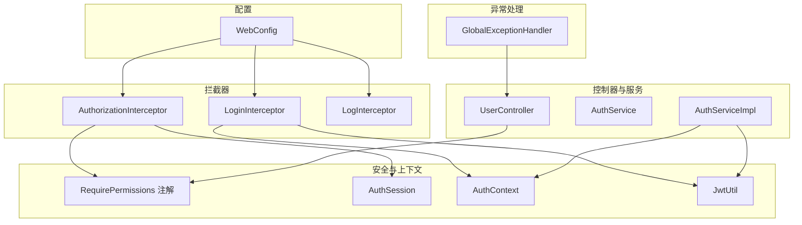
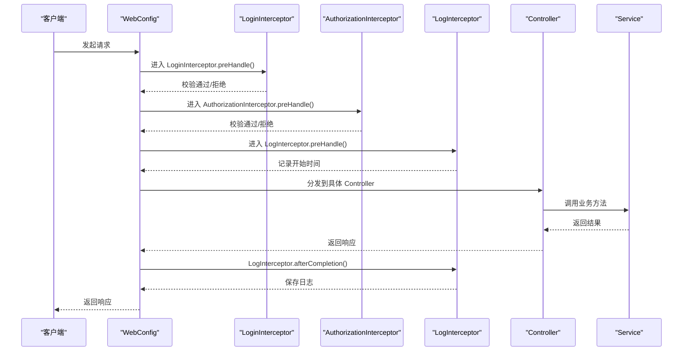
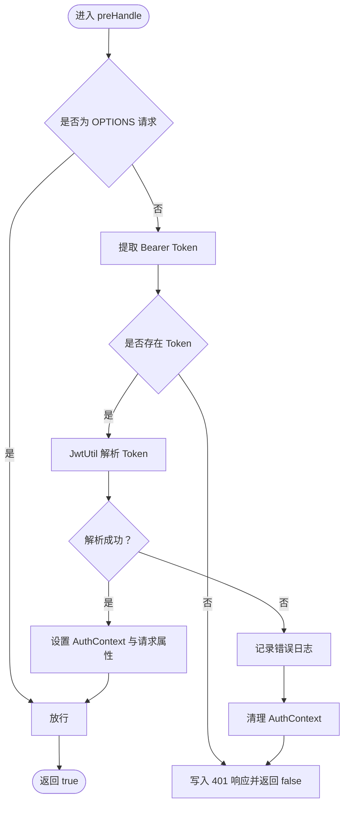
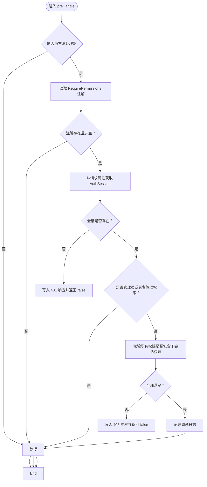
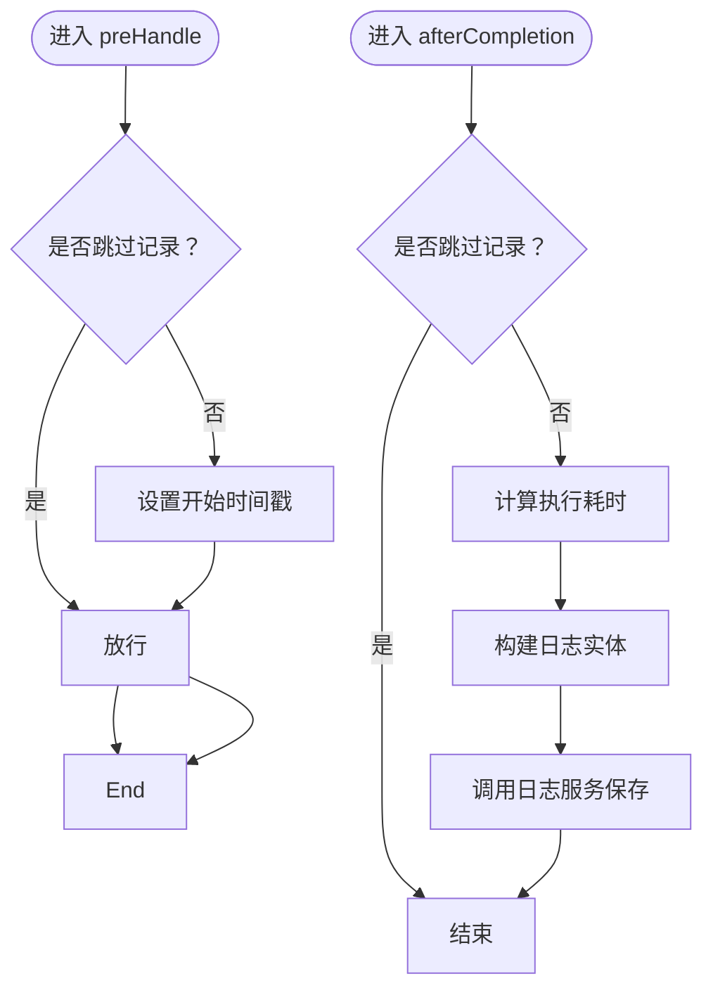
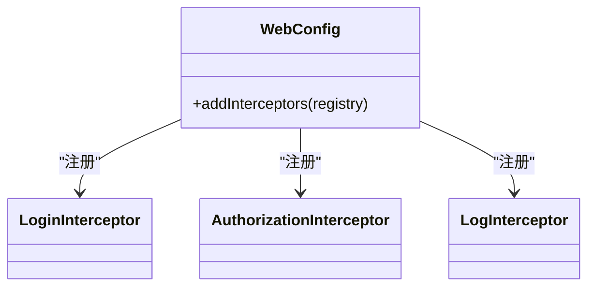
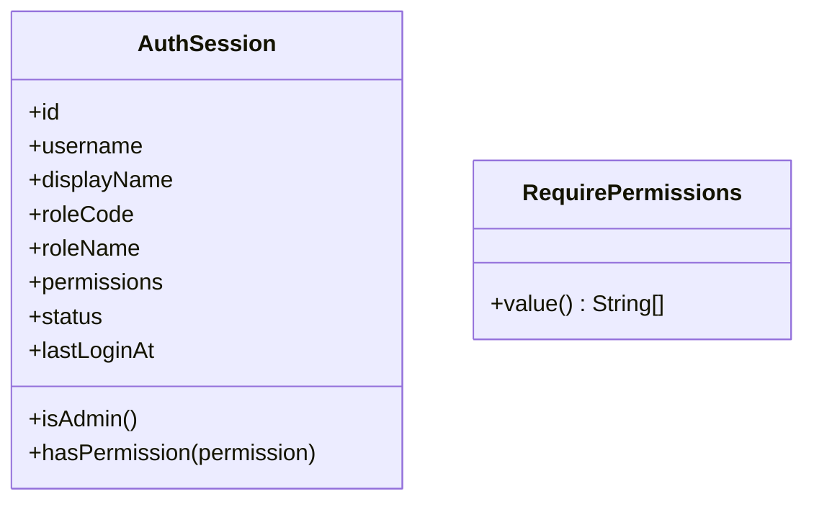
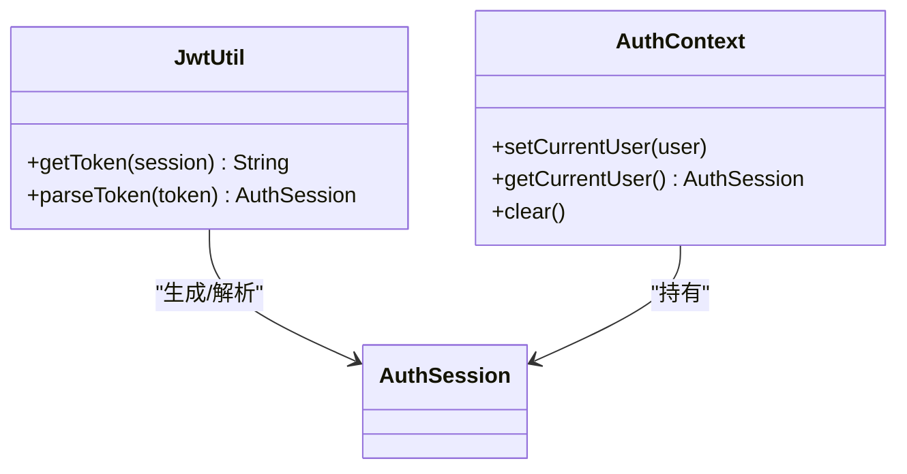
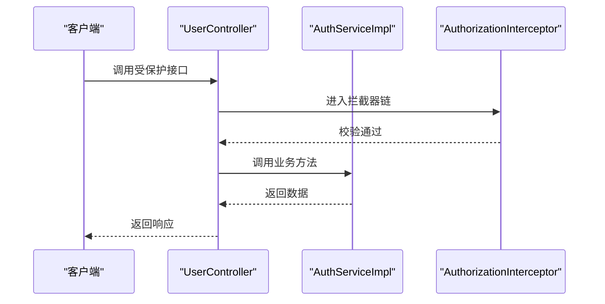
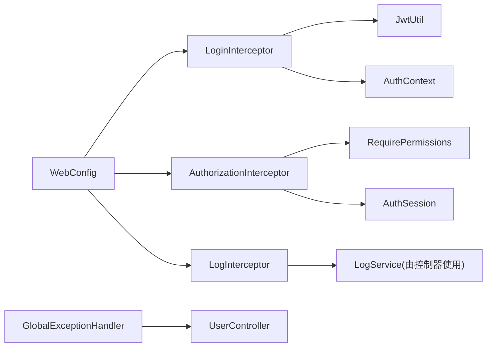

# 拦截器与安全过滤

<cite>
**本文引用的文件**
- [AuthorizationInterceptor.java](file://backend-repo/src/main/java/com/zjcxph/imgapi/interceptors/AuthorizationInterceptor.java)
- [LoginInterceptor.java](file://backend-repo/src/main/java/com/zjcxph/imgapi/interceptors/LoginInterceptor.java)
- [LogInterceptor.java](file://backend-repo/src/main/java/com/zjcxph/imgapi/interceptors/LogInterceptor.java)
- [WebConfig.java](file://backend-repo/src/main/java/com/zjcxph/imgapi/config/WebConfig.java)
- [AuthSession.java](file://backend-repo/src/main/java/com/zjcxph/imgapi/common/AuthSession.java)
- [RequirePermissions.java](file://backend-repo/src/main/java/com/zjcxph/imgapi/annotation/RequirePermissions.java)
- [JwtUtil.java](file://backend-repo/src/main/java/com/zjcxph/imgapi/utils/JwtUtil.java)
- [AuthContext.java](file://backend-repo/src/main/java/com/zjcxph/imgapi/utils/AuthContext.java)
- [GlobalExceptionHandler.java](file://backend-repo/src/main/java/com/zjcxph/imgapi/handler/GlobalExceptionHandler.java)
- [UserController.java](file://backend-repo/src/main/java/com/zjcxph/imgapi/controller/UserController.java)
- [AuthService.java](file://backend-repo/src/main/java/com/zjcxph/imgapi/service/AuthService.java)
- [AuthServiceImpl.java](file://backend-repo/src/main/java/com/zjcxph/imgapi/service/impl/AuthServiceImpl.java)
</cite>

## 目录
1. [简介](#简介)
2. [项目结构](#项目结构)
3. [核心组件](#核心组件)
4. [架构总览](#架构总览)
5. [详细组件分析](#详细组件分析)
6. [依赖分析](#依赖分析)
7. [性能考虑](#性能考虑)
8. [故障排查指南](#故障排查指南)
9. [结论](#结论)
10. [附录](#附录)

## 简介
本文件聚焦于 MRR 系统的拦截器与安全过滤机制，系统性阐述拦截器链的执行顺序与职责分工，深入解析 AuthorizationInterceptor 权限拦截器的实现逻辑，记录 LoginInterceptor 登录状态检查与会话验证机制，并说明 LogInterceptor 日志拦截器的日志记录策略与审计功能。同时覆盖拦截器注册配置、异常处理与响应定制、扩展点与自定义拦截器开发建议，以及性能优化与调试技巧。

## 项目结构
拦截器与安全过滤相关代码主要位于以下模块：
- 拦截器：interceptors 包下包含三个核心拦截器
- 配置：config 包下的 WebConfig 负责拦截器注册与路径匹配
- 安全上下文与会话：common 与 utils 包中的 AuthSession、AuthContext、JwtUtil
- 注解：annotation 包下的 RequirePermissions 用于标注权限需求
- 控制器示例：controller 包下的 UserController 展示注解使用
- 全局异常处理：handler 包下的 GlobalExceptionHandler 统一处理异常

图表来源
- [WebConfig.java:24-59](file://backend-repo/src/main/java/com/zjcxph/imgapi/config/WebConfig.java#L24-L59)
- [LoginInterceptor.java:29-52](file://backend-repo/src/main/java/com/zjcxph/imgapi/interceptors/LoginInterceptor.java#L29-L52)
- [AuthorizationInterceptor.java:22-56](file://backend-repo/src/main/java/com/zjcxph/imgapi/interceptors/AuthorizationInterceptor.java#L22-L56)
- [LogInterceptor.java:21-58](file://backend-repo/src/main/java/com/zjcxph/imgapi/interceptors/LogInterceptor.java#L21-L58)
- [RequirePermissions.java:8-12](file://backend-repo/src/main/java/com/zjcxph/imgapi/annotation/RequirePermissions.java#L8-L12)
- [AuthSession.java:81-88](file://backend-repo/src/main/java/com/zjcxph/imgapi/common/AuthSession.java#L81-L88)
- [JwtUtil.java:61-75](file://backend-repo/src/main/java/com/zjcxph/imgapi/utils/JwtUtil.java#L61-L75)
- [AuthContext.java:12-26](file://backend-repo/src/main/java/com/zjcxph/imgapi/utils/AuthContext.java#L12-L26)
- [UserController.java:60-93](file://backend-repo/src/main/java/com/zjcxph/imgapi/controller/UserController.java#L60-L93)
- [GlobalExceptionHandler.java:19-60](file://backend-repo/src/main/java/com/zjcxph/imgapi/handler/GlobalExceptionHandler.java#L19-L60)

章节来源
- [WebConfig.java:24-59](file://backend-repo/src/main/java/com/zjcxph/imgapi/config/WebConfig.java#L24-L59)

## 核心组件
- LoginInterceptor：负责从请求头提取 Bearer Token，校验有效性，解析出 AuthSession 并注入到请求属性与线程上下文，同时在请求完成后清理上下文。
- AuthorizationInterceptor：根据方法或类上的 RequirePermissions 注解判断所需权限，结合 AuthSession 进行权限比对；支持管理员角色豁免与特定管理权限豁免。
- LogInterceptor：在请求进入与完成阶段采集关键信息（如客户端 IP、URI、方法、UA、耗时等），并持久化到日志表，自动跳过静态资源与文档相关路径。
- WebConfig：统一注册拦截器，配置路径匹配与排除规则，决定拦截器链的执行顺序与生效范围。
- AuthSession：封装用户会话信息与权限集合，提供 isAdmin 与 hasPermission 辅助方法。
- RequirePermissions：声明式权限注解，标注在方法或类型上以声明所需权限集合。
- JwtUtil：基于 HMAC256 的 JWT 生成与解析工具，承载 AuthSession 的关键字段。
- AuthContext：线程本地存储，保存当前请求的 AuthSession，便于后续流程使用。
- GlobalExceptionHandler：统一异常处理，将业务异常转换为标准响应格式。

章节来源
- [LoginInterceptor.java:29-57](file://backend-repo/src/main/java/com/zjcxph/imgapi/interceptors/LoginInterceptor.java#L29-L57)
- [AuthorizationInterceptor.java:22-76](file://backend-repo/src/main/java/com/zjcxph/imgapi/interceptors/AuthorizationInterceptor.java#L22-L76)
- [LogInterceptor.java:21-88](file://backend-repo/src/main/java/com/zjcxph/imgapi/interceptors/LogInterceptor.java#L21-L88)
- [WebConfig.java:24-59](file://backend-repo/src/main/java/com/zjcxph/imgapi/config/WebConfig.java#L24-L59)
- [AuthSession.java:81-88](file://backend-repo/src/main/java/com/zjcxph/imgapi/common/AuthSession.java#L81-L88)
- [RequirePermissions.java:8-12](file://backend-repo/src/main/java/com/zjcxph/imgapi/annotation/RequirePermissions.java#L8-L12)
- [JwtUtil.java:61-75](file://backend-repo/src/main/java/com/zjcxph/imgapi/utils/JwtUtil.java#L61-L75)
- [AuthContext.java:12-26](file://backend-repo/src/main/java/com/zjcxph/imgapi/utils/AuthContext.java#L12-L26)
- [GlobalExceptionHandler.java:19-60](file://backend-repo/src/main/java/com/zjcxph/imgapi/handler/GlobalExceptionHandler.java#L19-L60)

## 架构总览
拦截器链在 Spring MVC 中按注册顺序依次执行，WebConfig 决定每个拦截器的生效路径与排除项。典型的请求生命周期如下：

图表来源
- [WebConfig.java:24-59](file://backend-repo/src/main/java/com/zjcxph/imgapi/config/WebConfig.java#L24-L59)
- [LoginInterceptor.java:29-52](file://backend-repo/src/main/java/com/zjcxph/imgapi/interceptors/LoginInterceptor.java#L29-L52)
- [AuthorizationInterceptor.java:22-56](file://backend-repo/src/main/java/com/zjcxph/imgapi/interceptors/AuthorizationInterceptor.java#L22-L56)
- [LogInterceptor.java:21-58](file://backend-repo/src/main/java/com/zjcxph/imgapi/interceptors/LogInterceptor.java#L21-L58)
- [UserController.java:60-93](file://backend-repo/src/main/java/com/zjcxph/imgapi/controller/UserController.java#L60-L93)

## 详细组件分析

### LoginInterceptor 登录拦截器
职责与流程
- 忽略 OPTIONS 预检请求。
- 从 Authorization 请求头中提取 Bearer Token。
- 使用 JwtUtil 解析 Token 为 AuthSession，设置到 AuthContext 与请求属性。
- 在请求完成后清理 AuthContext，避免线程复用导致的数据残留。

关键实现要点
- Token 提取与校验：若缺失或无效，直接写入 401 响应并中断后续链路。
- 会话注入：将 AuthSession 注入到请求属性，供后续拦截器与控制器使用。
- 上下文清理：afterCompletion 清理线程上下文，确保安全与内存释放。

图表来源
- [LoginInterceptor.java:29-57](file://backend-repo/src/main/java/com/zjcxph/imgapi/interceptors/LoginInterceptor.java#L29-L57)
- [JwtUtil.java:61-75](file://backend-repo/src/main/java/com/zjcxph/imgapi/utils/JwtUtil.java#L61-L75)
- [AuthContext.java:12-26](file://backend-repo/src/main/java/com/zjcxph/imgapi/utils/AuthContext.java#L12-L26)

章节来源
- [LoginInterceptor.java:29-57](file://backend-repo/src/main/java/com/zjcxph/imgapi/interceptors/LoginInterceptor.java#L29-L57)
- [JwtUtil.java:61-75](file://backend-repo/src/main/java/com/zjcxph/imgapi/utils/JwtUtil.java#L61-L75)
- [AuthContext.java:12-26](file://backend-repo/src/main/java/com/zjcxph/imgapi/utils/AuthContext.java#L12-L26)

### AuthorizationInterceptor 权限拦截器
职责与流程
- 若处理器非方法处理器则放行。
- 从方法或类上读取 RequirePermissions 注解，若未声明或为空则放行。
- 从请求属性中获取 AuthSession，若为空则返回 401。
- 管理员角色与特定管理权限可直接放行。
- 对比注解声明的权限集合与会话权限集合，全部满足才放行，否则返回 403。
- 记录调试日志，输出当前用户与授权的权限列表。

图表来源
- [AuthorizationInterceptor.java:22-76](file://backend-repo/src/main/java/com/zjcxph/imgapi/interceptors/AuthorizationInterceptor.java#L22-L76)
- [RequirePermissions.java:8-12](file://backend-repo/src/main/java/com/zjcxph/imgapi/annotation/RequirePermissions.java#L8-L12)
- [AuthSession.java:81-88](file://backend-repo/src/main/java/com/zjcxph/imgapi/common/AuthSession.java#L81-L88)

章节来源
- [AuthorizationInterceptor.java:22-76](file://backend-repo/src/main/java/com/zjcxph/imgapi/interceptors/AuthorizationInterceptor.java#L22-L76)
- [RequirePermissions.java:8-12](file://backend-repo/src/main/java/com/zjcxph/imgapi/annotation/RequirePermissions.java#L8-L12)
- [AuthSession.java:81-88](file://backend-repo/src/main/java/com/zjcxph/imgapi/common/AuthSession.java#L81-L88)

### LogInterceptor 日志拦截器
职责与流程
- preHandle：对需要记录的请求设置开始时间戳。
- afterCompletion：计算执行耗时，组装日志对象（含客户端 IP、URI、方法、UA、查询串、响应状态码、执行时间、Referer 等），调用日志服务持久化。
- shouldSkipLogging：跳过 OPTIONS、静态资源处理器与文档/健康检查等路径。

图表来源
- [LogInterceptor.java:21-88](file://backend-repo/src/main/java/com/zjcxph/imgapi/interceptors/LogInterceptor.java#L21-L88)

章节来源
- [LogInterceptor.java:21-88](file://backend-repo/src/main/java/com/zjcxph/imgapi/interceptors/LogInterceptor.java#L21-L88)

### WebConfig 拦截器注册与路径配置
- LoginInterceptor：对所有路径生效，排除登录、Swagger、Actuator、健康检查、favicon 等。
- AuthorizationInterceptor：对所有路径生效，无需额外排除。
- LogInterceptor：对所有路径生效，排除文档、Swagger、Actuator、favicon、error 等。

图表来源
- [WebConfig.java:24-59](file://backend-repo/src/main/java/com/zjcxph/imgapi/config/WebConfig.java#L24-L59)

章节来源
- [WebConfig.java:24-59](file://backend-repo/src/main/java/com/zjcxph/imgapi/config/WebConfig.java#L24-L59)

### AuthSession 与 RequirePermissions
- AuthSession：封装用户标识、角色、权限集合与状态，提供 isAdmin 与 hasPermission 辅助方法，便于快速判断。
- RequirePermissions：声明式注解，标注在方法或类上，值为权限字符串数组，用于授权拦截器判定。

图表来源
- [AuthSession.java:81-88](file://backend-repo/src/main/java/com/zjcxph/imgapi/common/AuthSession.java#L81-L88)
- [RequirePermissions.java:8-12](file://backend-repo/src/main/java/com/zjcxph/imgapi/annotation/RequirePermissions.java#L8-L12)

章节来源
- [AuthSession.java:81-88](file://backend-repo/src/main/java/com/zjcxph/imgapi/common/AuthSession.java#L81-L88)
- [RequirePermissions.java:8-12](file://backend-repo/src/main/java/com/zjcxph/imgapi/annotation/RequirePermissions.java#L8-L12)

### JwtUtil 与 AuthContext
- JwtUtil：负责生成与解析 JWT，将 AuthSession 关键字段编码进 Token，并在解析时还原为 AuthSession。
- AuthContext：线程本地存储，保存当前请求的 AuthSession，便于在整个请求链路中获取当前用户信息。

图表来源
- [JwtUtil.java:61-75](file://backend-repo/src/main/java/com/zjcxph/imgapi/utils/JwtUtil.java#L61-L75)
- [AuthContext.java:12-26](file://backend-repo/src/main/java/com/zjcxph/imgapi/utils/AuthContext.java#L12-L26)

章节来源
- [JwtUtil.java:61-75](file://backend-repo/src/main/java/com/zjcxph/imgapi/utils/JwtUtil.java#L61-L75)
- [AuthContext.java:12-26](file://backend-repo/src/main/java/com/zjcxph/imgapi/utils/AuthContext.java#L12-L26)

### 控制器与服务中的权限使用
- UserController 示例展示了在方法上使用 RequirePermissions 注解进行权限控制，例如用户管理与角色读取等接口。
- AuthService 与 AuthServiceImpl 提供登录、当前用户查询、用户与角色管理等能力，配合拦截器实现端到端的安全控制。

图表来源
- [UserController.java:60-93](file://backend-repo/src/main/java/com/zjcxph/imgapi/controller/UserController.java#L60-L93)
- [AuthService.java:12-24](file://backend-repo/src/main/java/com/zjcxph/imgapi/service/AuthService.java#L12-L24)
- [AuthServiceImpl.java:64-67](file://backend-repo/src/main/java/com/zjcxph/imgapi/service/impl/AuthServiceImpl.java#L64-L67)

章节来源
- [UserController.java:60-93](file://backend-repo/src/main/java/com/zjcxph/imgapi/controller/UserController.java#L60-L93)
- [AuthService.java:12-24](file://backend-repo/src/main/java/com/zjcxph/imgapi/service/AuthService.java#L12-L24)
- [AuthServiceImpl.java:64-67](file://backend-repo/src/main/java/com/zjcxph/imgapi/service/impl/AuthServiceImpl.java#L64-L67)

## 依赖分析
- LoginInterceptor 依赖 JwtUtil 与 AuthContext，负责会话建立与清理。
- AuthorizationInterceptor 依赖 RequirePermissions 注解与 AuthSession，负责权限判定。
- LogInterceptor 依赖日志服务接口，负责审计日志采集与落库。
- WebConfig 统一装配三个拦截器并配置路径规则。
- GlobalExceptionHandler 与控制器交互，保证异常场景下的统一响应格式。

图表来源
- [LoginInterceptor.java:29-57](file://backend-repo/src/main/java/com/zjcxph/imgapi/interceptors/LoginInterceptor.java#L29-L57)
- [AuthorizationInterceptor.java:22-76](file://backend-repo/src/main/java/com/zjcxph/imgapi/interceptors/AuthorizationInterceptor.java#L22-L76)
- [LogInterceptor.java:21-58](file://backend-repo/src/main/java/com/zjcxph/imgapi/interceptors/LogInterceptor.java#L21-L58)
- [WebConfig.java:24-59](file://backend-repo/src/main/java/com/zjcxph/imgapi/config/WebConfig.java#L24-L59)
- [GlobalExceptionHandler.java:19-60](file://backend-repo/src/main/java/com/zjcxph/imgapi/handler/GlobalExceptionHandler.java#L19-L60)

章节来源
- [WebConfig.java:24-59](file://backend-repo/src/main/java/com/zjcxph/imgapi/config/WebConfig.java#L24-L59)
- [GlobalExceptionHandler.java:19-60](file://backend-repo/src/main/java/com/zjcxph/imgapi/handler/GlobalExceptionHandler.java#L19-L60)

## 性能考虑
- 拦截器链顺序：LoginInterceptor → AuthorizationInterceptor → LogInterceptor，尽量减少不必要的计算与 IO。
- Token 解析成本：JwtUtil 使用对称算法，解析开销较低；建议在高并发场景下保持合理的密钥长度与刷新策略。
- 权限判定：AuthorizationInterceptor 使用集合包含判断，建议权限集合规模可控，避免超大权限列表带来的比较成本。
- 日志落库：LogInterceptor 在 afterCompletion 阶段写库，注意数据库连接池与异步化策略，避免阻塞主线程。
- 路径排除：WebConfig 已对静态资源与文档路径进行排除，减少无关请求的处理负担。
- 线程上下文清理：LoginInterceptor.afterCompletion 清理 AuthContext，防止线程复用导致的内存泄漏与数据污染。

## 故障排查指南
常见问题与定位思路
- 401 未认证
  - 现象：接口返回 401，消息提示缺少 Token 或无效。
  - 排查：确认 Authorization 头是否为 Bearer Token；检查 Token 是否过期或被篡改；查看 JwtUtil 密钥配置。
  - 参考实现路径：[LoginInterceptor.java:35-51](file://backend-repo/src/main/java/com/zjcxph/imgapi/interceptors/LoginInterceptor.java#L35-L51)，[JwtUtil.java:61-75](file://backend-repo/src/main/java/com/zjcxph/imgapi/utils/JwtUtil.java#L61-L75)
- 403 无权限
  - 现象：接口返回 403，消息提示无权限。
  - 排查：确认控制器方法是否标注 RequirePermissions；核对当前用户权限集合；检查管理员角色或管理权限是否满足。
  - 参考实现路径：[AuthorizationInterceptor.java:37-52](file://backend-repo/src/main/java/com/zjcxph/imgapi/interceptors/AuthorizationInterceptor.java#L37-L52)，[RequirePermissions.java:8-12](file://backend-repo/src/main/java/com/zjcxph/imgapi/annotation/RequirePermissions.java#L8-L12)
- 日志未记录
  - 现象：访问日志未入库。
  - 排查：确认请求未被 LogInterceptor.shouldSkipLogging 跳过；检查日志服务是否正常；核对 afterCompletion 是否执行。
  - 参考实现路径：[LogInterceptor.java:60-77](file://backend-repo/src/main/java/com/zjcxph/imgapi/interceptors/LogInterceptor.java#L60-L77)，[LogInterceptor.java:37-58](file://backend-repo/src/main/java/com/zjcxph/imgapi/interceptors/LogInterceptor.java#L37-L58)
- 异常响应不一致
  - 现象：业务异常未按预期返回统一格式。
  - 排查：确认 GlobalExceptionHandler 是否正确捕获对应异常类型；检查控制器返回值包装是否符合 Result 规范。
  - 参考实现路径：[GlobalExceptionHandler.java:19-60](file://backend-repo/src/main/java/com/zjcxph/imgapi/handler/GlobalExceptionHandler.java#L19-L60)，[Result.java:12-29](file://backend-repo/src/main/java/com/zjcxph/imgapi/common/Result.java#L12-L29)

章节来源
- [LoginInterceptor.java:35-51](file://backend-repo/src/main/java/com/zjcxph/imgapi/interceptors/LoginInterceptor.java#L35-L51)
- [AuthorizationInterceptor.java:37-52](file://backend-repo/src/main/java/com/zjcxph/imgapi/interceptors/AuthorizationInterceptor.java#L37-L52)
- [LogInterceptor.java:60-77](file://backend-repo/src/main/java/com/zjcxph/imgapi/interceptors/LogInterceptor.java#L60-L77)
- [GlobalExceptionHandler.java:19-60](file://backend-repo/src/main/java/com/zjcxph/imgapi/handler/GlobalExceptionHandler.java#L19-L60)
- [Result.java:12-29](file://backend-repo/src/main/java/com/zjcxph/imgapi/common/Result.java#L12-L29)

## 结论
MRR 系统通过三层拦截器实现了“鉴权—授权—审计”的完整闭环：LoginInterceptor 负责会话建立与上下文注入，AuthorizationInterceptor 实现细粒度权限控制，LogInterceptor 提供统一审计记录。WebConfig 将三者有序组合并精确控制生效范围。配合 RequirePermissions 注解与 AuthSession 的辅助方法，开发者可以以声明式方式快速扩展权限控制。建议在生产环境中关注 Token 密钥管理、权限集合规模、日志落库性能与异常统一处理，以获得更稳定与可观测的运行效果。

## 附录
- 自定义拦截器开发步骤
  - 实现 HandlerInterceptor 接口，重写 preHandle/postHandle/afterCompletion。
  - 在 WebConfig 中注册并配置 addPathPatterns 与 excludePathPatterns。
  - 如需上下文传递，可参考 AuthContext 的线程本地存储模式。
  - 注意在 afterCompletion 中清理线程上下文，避免资源泄露。
- 集成示例
  - 在控制器方法上添加 @RequirePermissions 注解，声明所需权限字符串数组。
  - 登录后在 Authorization 头中携带 Bearer Token，遵循标准 JWT 格式。
- 调试技巧
  - 开启拦截器与安全相关日志级别，观察请求链路与权限判定过程。
  - 使用单元测试或集成测试验证不同权限组合下的行为。
  - 利用全局异常处理器输出统一错误格式，便于前端与运维定位问题。