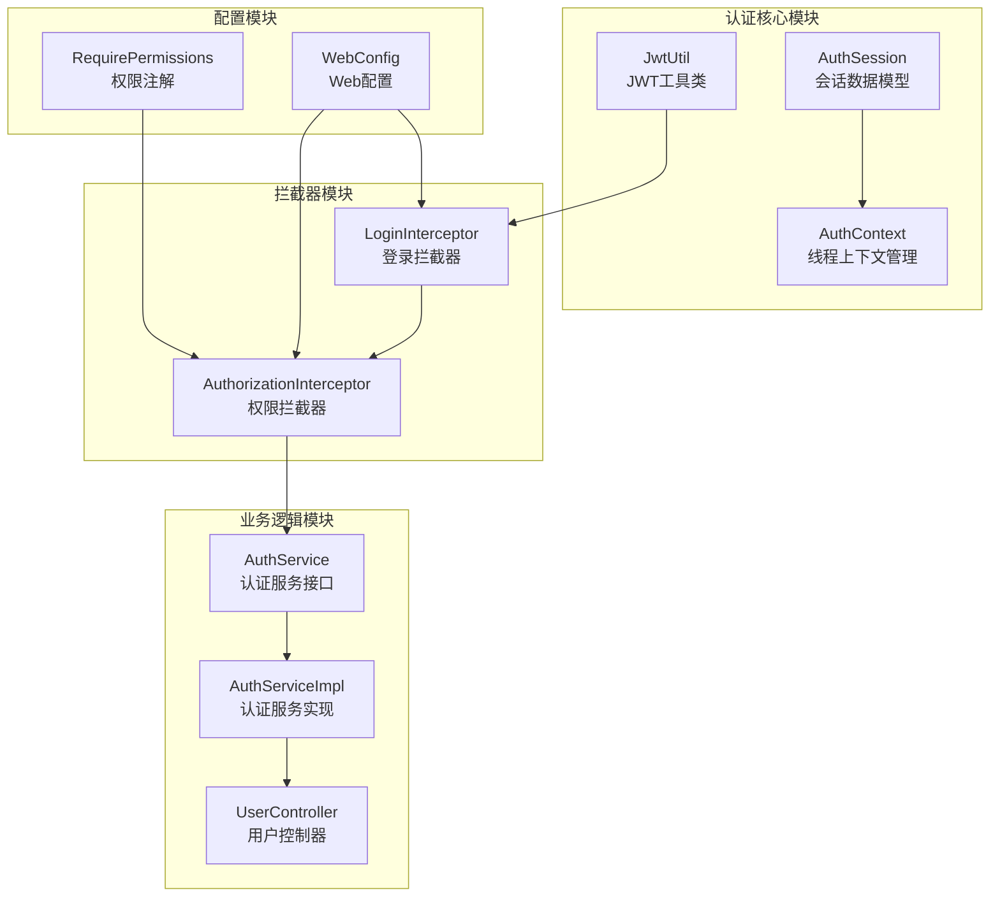
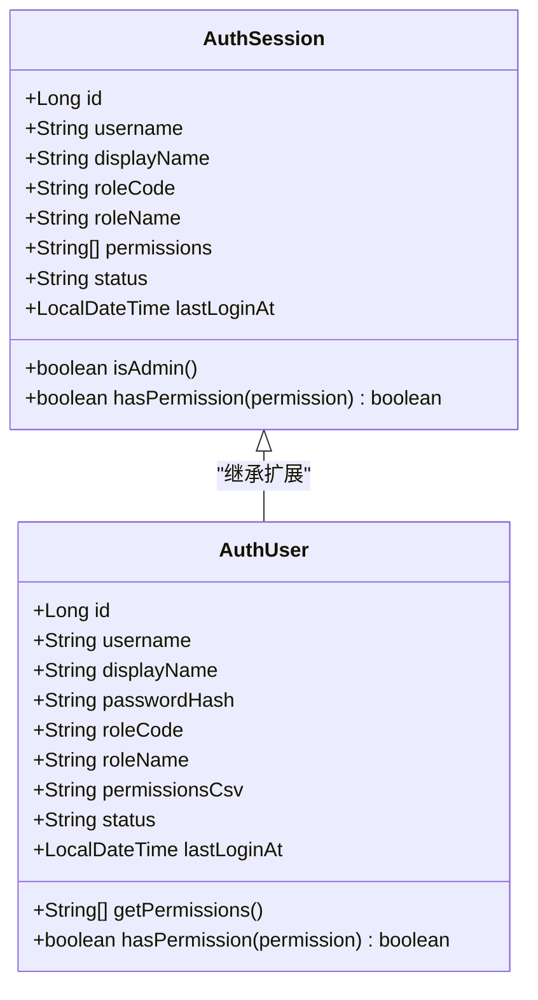
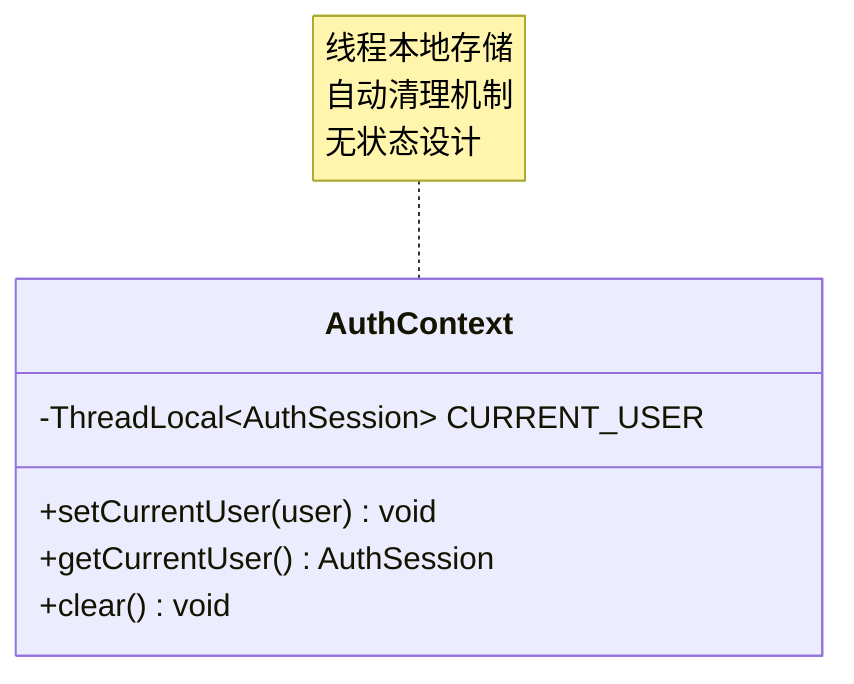
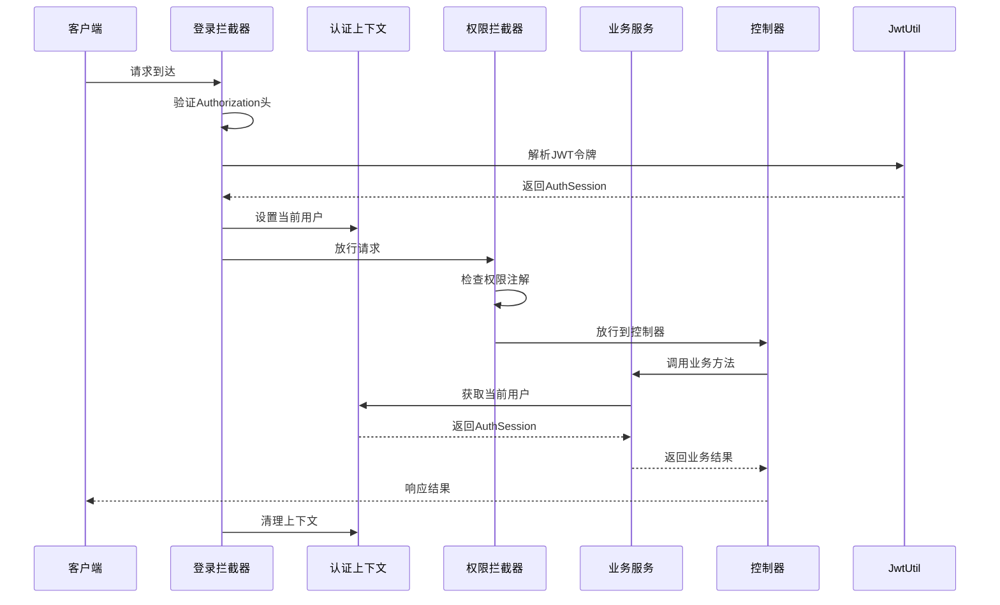
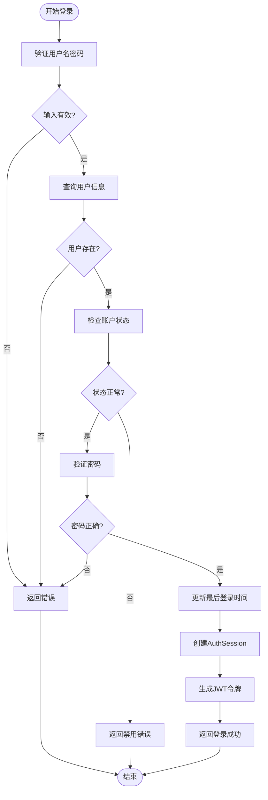
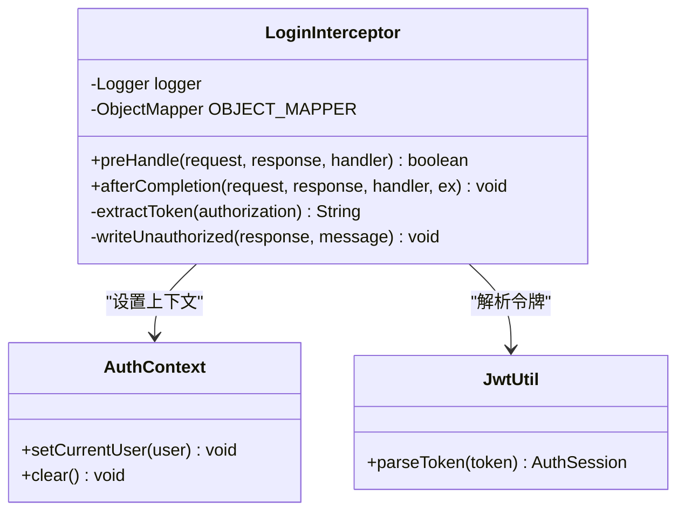
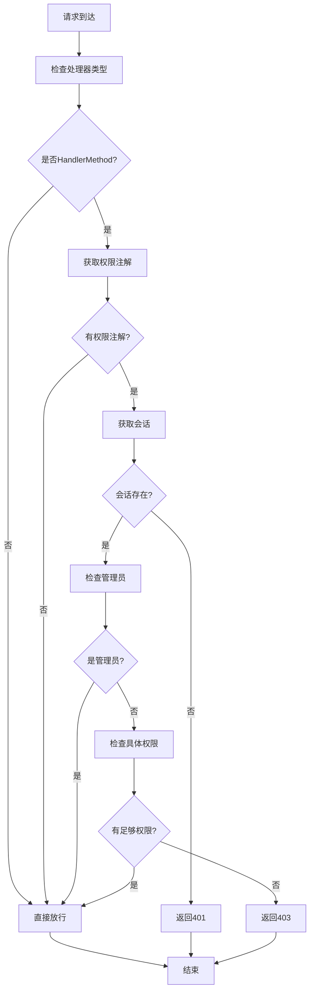
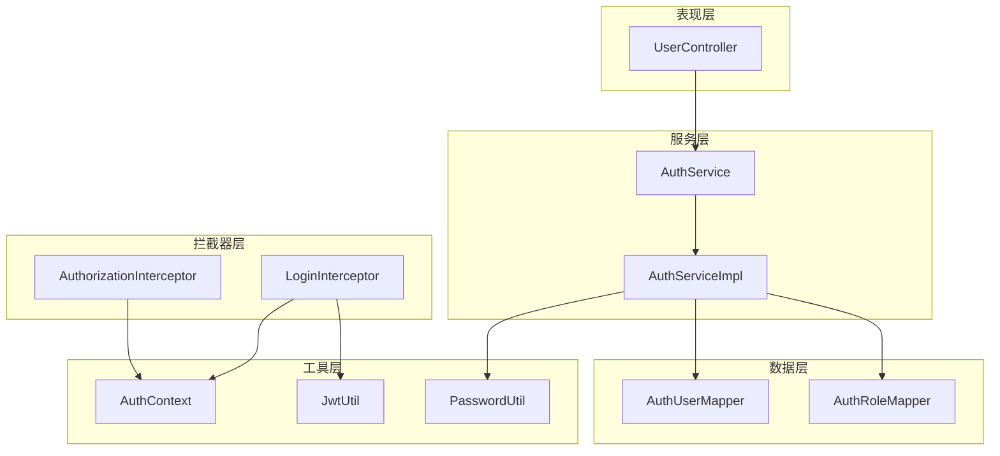

# 认证上下文与会话管理

<cite>
**本文档引用的文件**
- [AuthSession.java](file://backend-repo/src/main/java/com/zjcxph/imgapi/common/AuthSession.java)
- [AuthContext.java](file://backend-repo/src/main/java/com/zjcxph/imgapi/utils/AuthContext.java)
- [LoginInterceptor.java](file://backend-repo/src/main/java/com/zjcxph/imgapi/interceptors/LoginInterceptor.java)
- [AuthorizationInterceptor.java](file://backend-repo/src/main/java/com/zjcxph/imgapi/interceptors/AuthorizationInterceptor.java)
- [JwtUtil.java](file://backend-repo/src/main/java/com/zjcxph/imgapi/utils/JwtUtil.java)
- [AuthServiceImpl.java](file://backend-repo/src/main/java/com/zjcxph/imgapi/service/impl/AuthServiceImpl.java)
- [UserController.java](file://backend-repo/src/main/java/com/zjcxph/imgapi/controller/UserController.java)
- [RequirePermissions.java](file://backend-repo/src/main/java/com/zjcxph/imgapi/annotation/RequirePermissions.java)
- [WebConfig.java](file://backend-repo/src/main/java/com/zjcxph/imgapi/config/WebConfig.java)
- [AuthUser.java](file://backend-repo/src/main/java/com/zjcxph/imgapi/entity/AuthUser.java)
- [LoginResponseDTO.java](file://backend-repo/src/main/java/com/zjcxph/imgapi/dto/resp/LoginResponseDTO.java)
- [application.properties](file://backend-repo/src/main/resources/application.properties)
</cite>

## 目录
1. [简介](#简介)
2. [项目结构](#项目结构)
3. [核心组件](#核心组件)
4. [架构概览](#架构概览)
5. [详细组件分析](#详细组件分析)
6. [依赖关系分析](#依赖关系分析)
7. [性能考虑](#性能考虑)
8. [故障排查指南](#故障排查指南)
9. [结论](#结论)
10. [附录](#附录)

## 简介

MRR系统的认证上下文与会话管理系统采用基于JWT的无状态认证机制，通过ThreadLocal实现线程级会话上下文管理。该系统提供了完整的用户认证、授权、权限检查和会话生命周期管理功能。

系统的核心特性包括：
- 基于JWT的无状态认证
- 线程本地会话上下文管理
- 细粒度权限控制
- 自动会话清理机制
- 安全的会话数据传输

## 项目结构

后端认证相关代码主要位于`backend-repo/src/main/java/com/zjcxph/imgapi/`目录下，按功能模块组织：



**图表来源**
- [AuthSession.java:1-90](file://backend-repo/src/main/java/com/zjcxph/imgapi/common/AuthSession.java#L1-L90)
- [AuthContext.java:1-28](file://backend-repo/src/main/java/com/zjcxph/imgapi/utils/AuthContext.java#L1-L28)
- [JwtUtil.java:1-77](file://backend-repo/src/main/java/com/zjcxph/imgapi/utils/JwtUtil.java#L1-L77)

**章节来源**
- [WebConfig.java:1-61](file://backend-repo/src/main/java/com/zjcxph/imgapi/config/WebConfig.java#L1-L61)
- [RequirePermissions.java:1-13](file://backend-repo/src/main/java/com/zjcxph/imgapi/annotation/RequirePermissions.java#L1-L13)

## 核心组件

### AuthSession 会话数据模型

AuthSession是系统的核心数据模型，封装了用户认证后的所有信息：



**图表来源**
- [AuthSession.java:7-89](file://backend-repo/src/main/java/com/zjcxph/imgapi/common/AuthSession.java#L7-L89)
- [AuthUser.java:13-133](file://backend-repo/src/main/java/com/zjcxph/imgapi/entity/AuthUser.java#L13-L133)

AuthSession包含以下关键属性：
- **身份标识**：用户ID、用户名、显示名称
- **角色信息**：角色编码、角色名称
- **权限集合**：动态权限列表
- **状态管理**：账户状态、最后登录时间
- **安全方法**：管理员判断、权限验证

**章节来源**
- [AuthSession.java:1-90](file://backend-repo/src/main/java/com/zjcxph/imgapi/common/AuthSession.java#L1-L90)
- [AuthUser.java:1-134](file://backend-repo/src/main/java/com/zjcxph/imgapi/entity/AuthUser.java#L1-L134)

### AuthContext 线程上下文管理

AuthContext采用ThreadLocal实现线程级会话上下文管理：



**图表来源**
- [AuthContext.java:5-27](file://backend-repo/src/main/java/com/zjcxph/imgapi/utils/AuthContext.java#L5-L27)

AuthContext提供三个核心方法：
- **setCurrentUser()**：设置当前线程的用户会话
- **getCurrentUser()**：获取当前线程的用户会话
- **clear()**：清理当前线程的用户会话

**章节来源**
- [AuthContext.java:1-28](file://backend-repo/src/main/java/com/zjcxph/imgapi/utils/AuthContext.java#L1-L28)

## 架构概览

系统采用Spring MVC拦截器模式实现认证和授权：



**图表来源**
- [LoginInterceptor.java:29-57](file://backend-repo/src/main/java/com/zjcxph/imgapi/interceptors/LoginInterceptor.java#L29-L57)
- [AuthorizationInterceptor.java:22-56](file://backend-repo/src/main/java/com/zjcxph/imgapi/interceptors/AuthorizationInterceptor.java#L22-L56)
- [AuthContext.java:12-26](file://backend-repo/src/main/java/com/zjcxph/imgapi/utils/AuthContext.java#L12-L26)

## 详细组件分析

### JWT 认证流程

JWT认证采用对称加密算法，支持自定义密钥配置：



**图表来源**
- [AuthServiceImpl.java:36-62](file://backend-repo/src/main/java/com/zjcxph/imgapi/service/impl/AuthServiceImpl.java#L36-L62)
- [JwtUtil.java:22-59](file://backend-repo/src/main/java/com/zjcxph/imgapi/utils/JwtUtil.java#L22-L59)

**章节来源**
- [JwtUtil.java:1-77](file://backend-repo/src/main/java/com/zjcxph/imgapi/utils/JwtUtil.java#L1-L77)
- [AuthServiceImpl.java:1-151](file://backend-repo/src/main/java/com/zjcxph/imgapi/service/impl/AuthServiceImpl.java#L1-L151)

### 登录拦截器实现

LoginInterceptor负责JWT令牌的解析和会话上下文的设置：



**图表来源**
- [LoginInterceptor.java:17-57](file://backend-repo/src/main/java/com/zjcxph/imgapi/interceptors/LoginInterceptor.java#L17-L57)
- [AuthContext.java:12-26](file://backend-repo/src/main/java/com/zjcxph/imgapi/utils/AuthContext.java#L12-L26)
- [JwtUtil.java:61-75](file://backend-repo/src/main/java/com/zjcxph/imgapi/utils/JwtUtil.java#L61-L75)

**章节来源**
- [LoginInterceptor.java:1-69](file://backend-repo/src/main/java/com/zjcxph/imgapi/interceptors/LoginInterceptor.java#L1-L69)

### 权限拦截器实现

AuthorizationInterceptor实现基于注解的权限控制：



**图表来源**
- [AuthorizationInterceptor.java:22-56](file://backend-repo/src/main/java/com/zjcxph/imgapi/interceptors/AuthorizationInterceptor.java#L22-L56)

**章节来源**
- [AuthorizationInterceptor.java:1-78](file://backend-repo/src/main/java/com/zjcxph/imgapi/interceptors/AuthorizationInterceptor.java#L1-L78)

### Web 配置管理

WebConfig统一管理拦截器注册和排除规则：

**章节来源**
- [WebConfig.java:1-61](file://backend-repo/src/main/java/com/zjcxph/imgapi/config/WebConfig.java#L1-L61)

## 依赖关系分析

系统采用清晰的分层架构，各组件间依赖关系明确：



**图表来源**
- [UserController.java:32-36](file://backend-repo/src/main/java/com/zjcxph/imgapi/controller/UserController.java#L32-L36)
- [AuthServiceImpl.java:25-34](file://backend-repo/src/main/java/com/zjcxph/imgapi/service/impl/AuthServiceImpl.java#L25-L34)
- [LoginInterceptor.java:5-6](file://backend-repo/src/main/java/com/zjcxph/imgapi/interceptors/LoginInterceptor.java#L5-L6)

**章节来源**
- [RequirePermissions.java:8-12](file://backend-repo/src/main/java/com/zjcxph/imgapi/annotation/RequirePermissions.java#L8-L12)

## 性能考虑

### 内存优化策略

1. **ThreadLocal内存泄漏防护**
   - 在请求完成后自动清理ThreadLocal变量
   - 使用afterCompletion回调确保资源释放

2. **JWT令牌优化**
   - 24小时有效期，避免过长令牌占用内存
   - 只包含必要声明，减少令牌大小

3. **权限数据缓存**
   - 权限列表在会话中缓存，避免重复查询

### 并发访问控制

1. **线程隔离**
   - ThreadLocal确保每个线程独立的会话上下文
   - 避免多线程环境下的数据竞争

2. **无状态设计**
   - 服务器端不保存会话状态
   - 支持水平扩展和负载均衡

### 性能监控指标

建议监控以下关键指标：
- JWT令牌解析耗时
- 权限检查响应时间
- 并发用户数峰值
- 会话清理频率

## 故障排查指南

### 常见问题诊断

1. **401 未授权错误**
   - 检查Authorization头格式是否正确
   - 验证JWT密钥配置
   - 确认令牌未过期

2. **403 权限不足**
   - 检查用户权限列表
   - 验证权限注解配置
   - 确认管理员角色判断

3. **会话丢失问题**
   - 检查ThreadLocal清理逻辑
   - 验证拦截器执行顺序
   - 确认异常处理机制

### 调试工具

1. **日志配置**
   ```properties
   logging.level.com.zjcxph.imgapi.interceptors=DEBUG
   logging.level.com.zjcxph.imgapi.utils=DEBUG
   ```

2. **性能监控**
   - 启用Spring Boot Actuator
   - 配置Prometheus监控
   - 设置合理的日志轮转策略

**章节来源**
- [application.properties:24-49](file://backend-repo/src/main/resources/application.properties#L24-L49)

## 结论

MRR系统的认证上下文与会话管理方案具有以下优势：

1. **安全性**：基于JWT的无状态认证，支持分布式部署
2. **可扩展性**：ThreadLocal线程隔离，支持高并发场景
3. **易维护性**：清晰的分层架构和明确的职责划分
4. **可观测性**：完善的日志记录和监控指标

该方案为MRR系统提供了可靠的身份认证和权限控制基础，支持系统的持续发展和扩展需求。

## 附录

### 开发者集成示例

1. **基本权限控制**
   ```java
   @RequirePermissions({"user:read"})
   @GetMapping("/users")
   public List<User> getUsers() { ... }
   ```

2. **管理员权限**
   ```java
   @RequirePermissions({"user:manage"})
   @PostMapping("/users")
   public User createUser(@RequestBody CreateUserRequest request) { ... }
   ```

3. **获取当前用户**
   ```java
   @GetMapping("/profile")
   public AuthSession getProfile() {
       return authService.currentUser();
   }
   ```

### 最佳实践

1. **安全配置**
   - 生产环境必须设置JWT_SECRET_KEY环境变量
   - 定期轮换加密密钥
   - 启用HTTPS传输

2. **性能优化**
   - 合理设置令牌有效期
   - 使用连接池优化数据库访问
   - 实施适当的缓存策略

3. **监控告警**
   - 监控认证失败率
   - 跟踪权限拒绝事件
   - 设置异常告警阈值