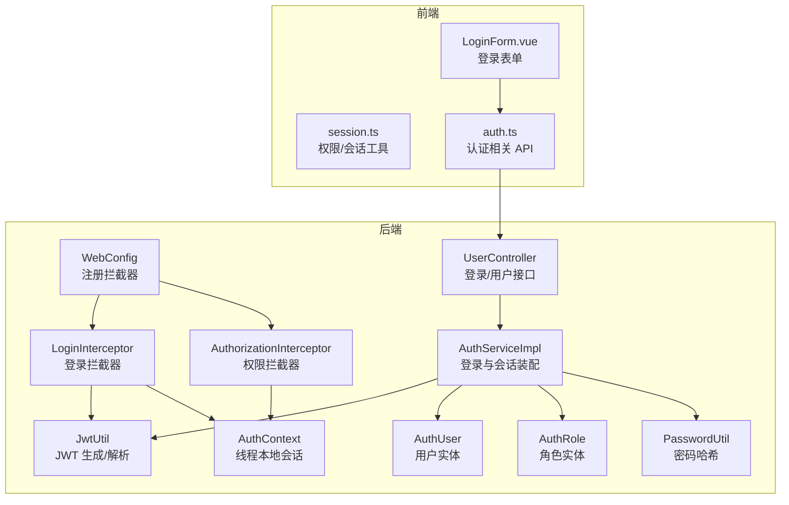
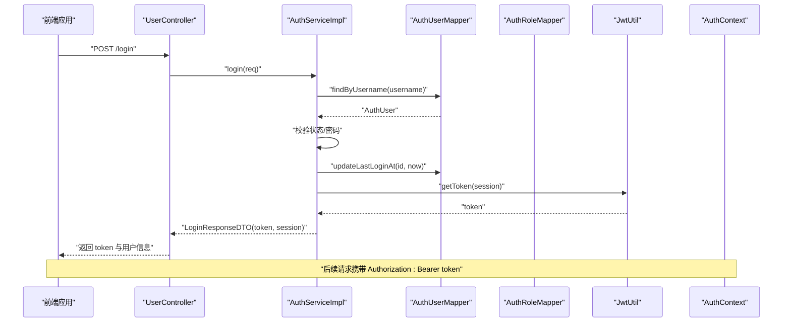
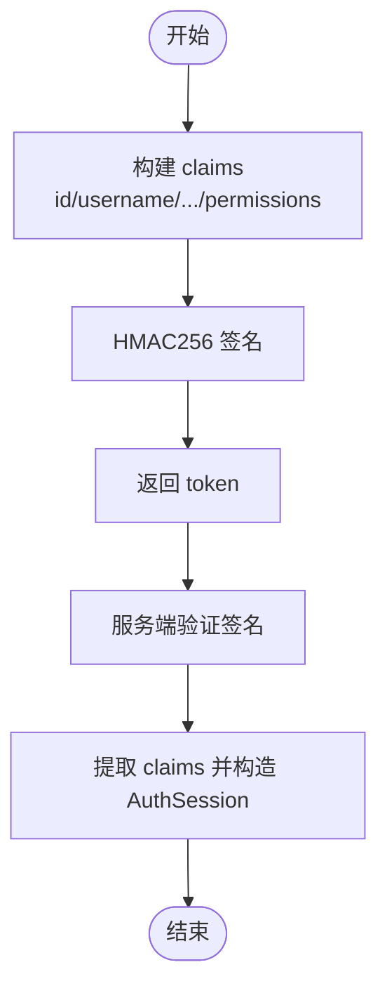
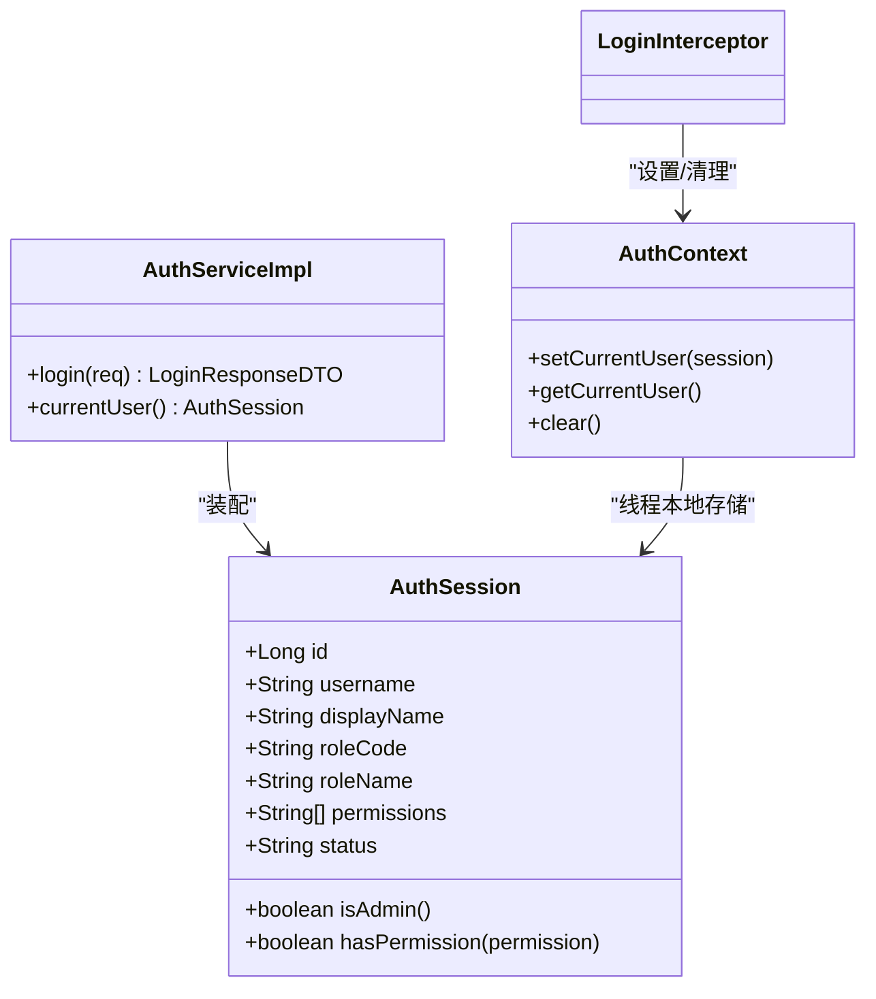
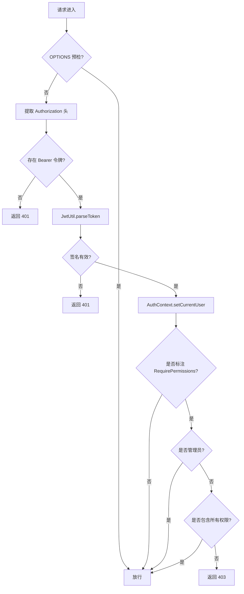
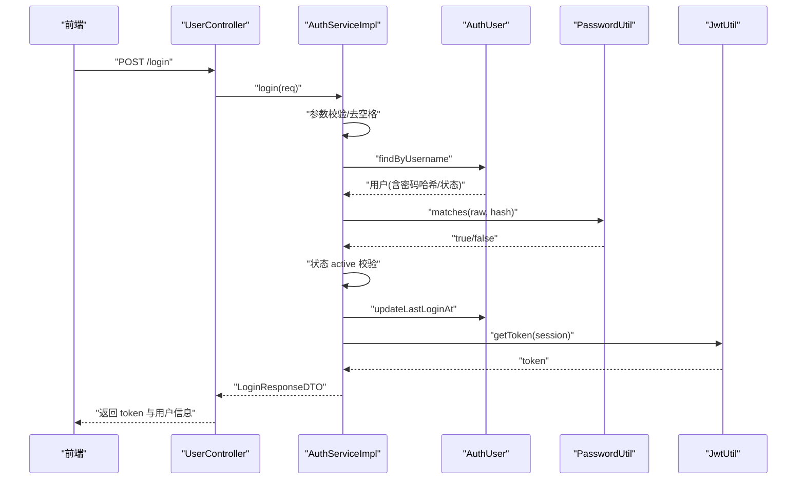
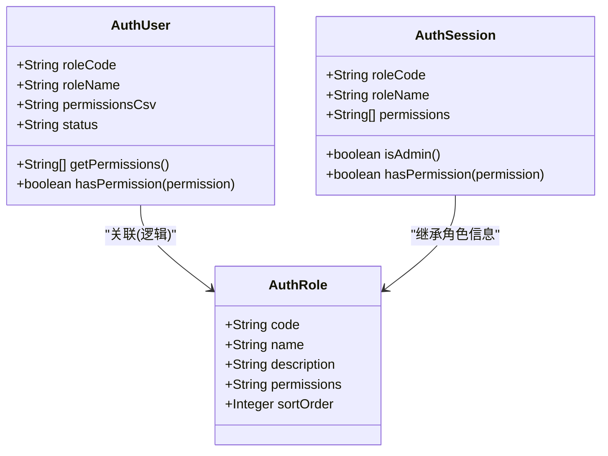
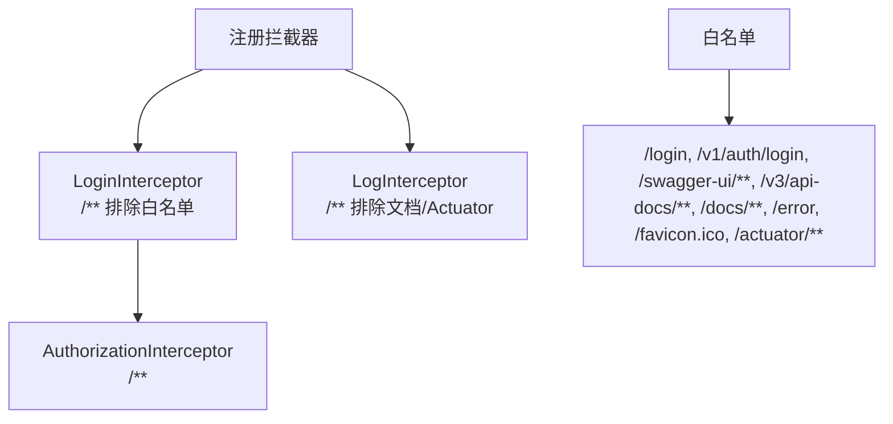
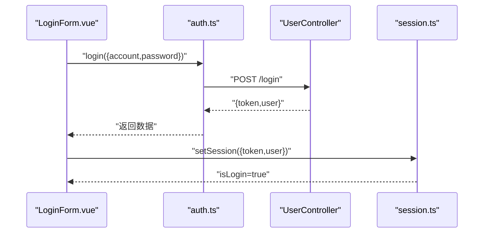
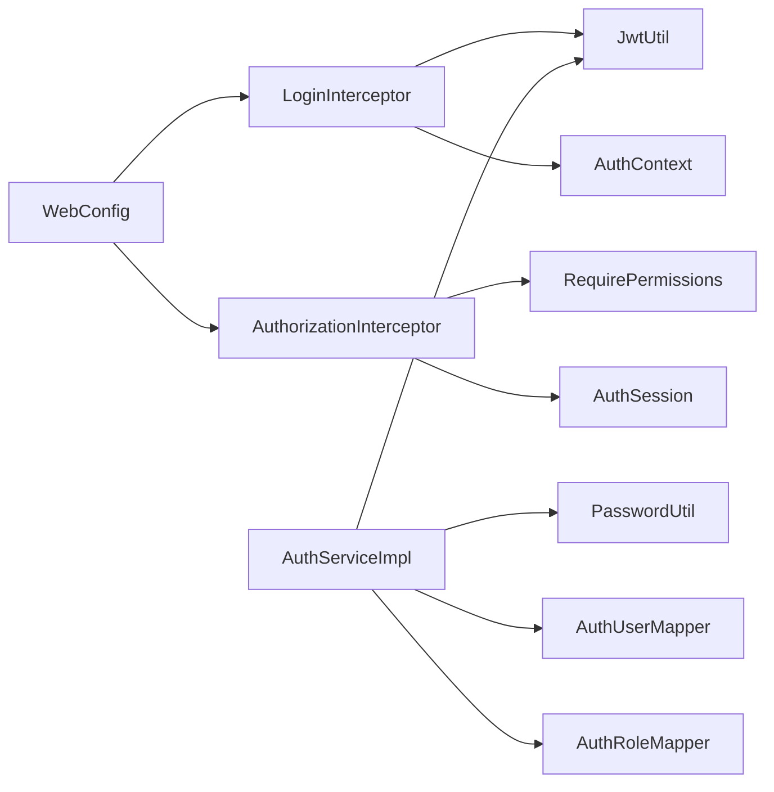

# 认证授权

<cite>
**本文引用的文件**
- [JwtUtil.java](file://backend-repo/src/main/java/com/zjcxph/imgapi/utils/JwtUtil.java)
- [AuthSession.java](file://backend-repo/src/main/java/com/zjcxph/imgapi/common/AuthSession.java)
- [RequirePermissions.java](file://backend-repo/src/main/java/com/zjcxph/imgapi/annotation/RequirePermissions.java)
- [AuthorizationInterceptor.java](file://backend-repo/src/main/java/com/zjcxph/imgapi/interceptors/AuthorizationInterceptor.java)
- [LoginInterceptor.java](file://backend-repo/src/main/java/com/zjcxph/imgapi/interceptors/LoginInterceptor.java)
- [AuthContext.java](file://backend-repo/src/main/java/com/zjcxph/imgapi/utils/AuthContext.java)
- [AuthService.java](file://backend-repo/src/main/java/com/zjcxph/imgapi/service/AuthService.java)
- [AuthServiceImpl.java](file://backend-repo/src/main/java/com/zjcxph/imgapi/service/impl/AuthServiceImpl.java)
- [UserController.java](file://backend-repo/src/main/java/com/zjcxph/imgapi/controller/UserController.java)
- [WebConfig.java](file://backend-repo/src/main/java/com/zjcxph/imgapi/config/WebConfig.java)
- [PasswordUtil.java](file://backend-repo/src/main/java/com/zjcxph/imgapi/utils/PasswordUtil.java)
- [AuthUser.java](file://backend-repo/src/main/java/com/zjcxph/imgapi/entity/AuthUser.java)
- [AuthRole.java](file://backend-repo/src/main/java/com/zjcxph/imgapi/entity/AuthRole.java)
- [application.properties](file://backend-repo/src/main/resources/application.properties)
- [LoginForm.vue](file://frontend-fantastic-admin/src/components/AccountForm/LoginForm.vue)
- [session.ts](file://frontend-fantastic-admin/src/utils/session.ts)
- [auth.ts](file://frontend-fantastic-admin/src/api/modules/auth.ts)
</cite>

## 目录
1. [简介](#简介)
2. [项目结构](#项目结构)
3. [核心组件](#核心组件)
4. [架构总览](#架构总览)
5. [详细组件分析](#详细组件分析)
6. [依赖分析](#依赖分析)
7. [性能考虑](#性能考虑)
8. [故障排查指南](#故障排查指南)
9. [结论](#结论)
10. [附录](#附录)

## 简介
本文件系统性梳理 MRR 后端的认证授权机制，覆盖以下主题：
- JWT 令牌生成与验证流程
- 用户会话管理与上下文传递
- 权限控制策略与注解式权限校验
- 登录流程、密码加密与安全最佳实践
- API 访问控制、跨域与安全响应头
- 认证失败处理、令牌刷新与会话超时
- 安全威胁防护（CSRF、XSS）与前端集成要点
- 面向开发者的集成指南与常见问题

## 项目结构
后端采用 Spring MVC + 拦截器模式实现认证与授权，核心位于 backend-repo 模块；前端在 frontend-fantastic-admin 中提供登录与会话工具。

图表来源
- [WebConfig.java:24-59](file://backend-repo/src/main/java/com/zjcxph/imgapi/config/WebConfig.java#L24-L59)
- [LoginInterceptor.java:29-57](file://backend-repo/src/main/java/com/zjcxph/imgapi/interceptors/LoginInterceptor.java#L29-L57)
- [AuthorizationInterceptor.java:22-56](file://backend-repo/src/main/java/com/zjcxph/imgapi/interceptors/AuthorizationInterceptor.java#L22-L56)
- [UserController.java:38-47](file://backend-repo/src/main/java/com/zjcxph/imgapi/controller/UserController.java#L38-L47)
- [AuthServiceImpl.java:36-62](file://backend-repo/src/main/java/com/zjcxph/imgapi/service/impl/AuthServiceImpl.java#L36-L62)
- [JwtUtil.java:22-75](file://backend-repo/src/main/java/com/zjcxph/imgapi/utils/JwtUtil.java#L22-L75)
- [AuthContext.java:12-26](file://backend-repo/src/main/java/com/zjcxph/imgapi/utils/AuthContext.java#L12-L26)
- [AuthUser.java:116-132](file://backend-repo/src/main/java/com/zjcxph/imgapi/entity/AuthUser.java#L116-L132)
- [AuthRole.java:37-43](file://backend-repo/src/main/java/com/zjcxph/imgapi/entity/AuthRole.java#L37-L43)
- [PasswordUtil.java:10-22](file://backend-repo/src/main/java/com/zjcxph/imgapi/utils/PasswordUtil.java#L10-L22)
- [LoginForm.vue:50-98](file://frontend-fantastic-admin/src/components/AccountForm/LoginForm.vue#L50-L98)
- [session.ts:3-39](file://frontend-fantastic-admin/src/utils/session.ts#L3-L39)
- [auth.ts:3-25](file://frontend-fantastic-admin/src/api/modules/auth.ts#L3-L25)

章节来源
- [WebConfig.java:24-59](file://backend-repo/src/main/java/com/zjcxph/imgapi/config/WebConfig.java#L24-L59)
- [UserController.java:38-47](file://backend-repo/src/main/java/com/zjcxph/imgapi/controller/UserController.java#L38-L47)

## 核心组件
- JWT 工具：负责令牌签发与解析，携带用户标识、角色与权限数组等声明。
- 会话模型：封装用户身份、角色、权限与状态，支持管理员判定与权限查询。
- 注解与拦截器：通过 RequirePermissions 注解与拦截器链实现方法级权限控制。
- 登录服务：完成凭据校验、状态检查、最后登录时间更新与令牌发放。
- 拦截器链：统一处理登录态校验与权限校验，清理线程上下文。
- 前端会话工具：基于用户仓库状态判断权限、显示名称与是否已登录。

章节来源
- [JwtUtil.java:22-75](file://backend-repo/src/main/java/com/zjcxph/imgapi/utils/JwtUtil.java#L22-L75)
- [AuthSession.java:81-88](file://backend-repo/src/main/java/com/zjcxph/imgapi/common/AuthSession.java#L81-L88)
- [RequirePermissions.java:8-12](file://backend-repo/src/main/java/com/zjcxph/imgapi/annotation/RequirePermissions.java#L8-L12)
- [AuthorizationInterceptor.java:22-56](file://backend-repo/src/main/java/com/zjcxph/imgapi/interceptors/AuthorizationInterceptor.java#L22-L56)
- [LoginInterceptor.java:29-57](file://backend-repo/src/main/java/com/zjcxph/imgapi/interceptors/LoginInterceptor.java#L29-L57)
- [AuthServiceImpl.java:36-62](file://backend-repo/src/main/java/com/zjcxph/imgapi/service/impl/AuthServiceImpl.java#L36-L62)
- [AuthContext.java:12-26](file://backend-repo/src/main/java/com/zjcxph/imgapi/utils/AuthContext.java#L12-L26)
- [session.ts:3-39](file://frontend-fantastic-admin/src/utils/session.ts#L3-L39)

## 架构总览
下图展示从请求进入后端到鉴权放行的关键路径，以及前后端交互。

图表来源
- [UserController.java:38-47](file://backend-repo/src/main/java/com/zjcxph/imgapi/controller/UserController.java#L38-L47)
- [AuthServiceImpl.java:36-62](file://backend-repo/src/main/java/com/zjcxph/imgapi/service/impl/AuthServiceImpl.java#L36-L62)
- [JwtUtil.java:22-59](file://backend-repo/src/main/java/com/zjcxph/imgapi/utils/JwtUtil.java#L22-L59)

## 详细组件分析

### JWT 令牌生成与验证
- 生成：以固定密钥签名，有效期 24 小时；claims 包含 id、username、displayName、roleCode、roleName、status、permissions 数组。
- 解析：使用相同密钥验证签名并提取 claims，构造 AuthSession 返回给拦截器与控制器使用。
- 密钥来源：优先从环境变量读取，否则使用内置默认值（生产环境务必替换）。

图表来源
- [JwtUtil.java:28-75](file://backend-repo/src/main/java/com/zjcxph/imgapi/utils/JwtUtil.java#L28-L75)

章节来源
- [JwtUtil.java:14-17](file://backend-repo/src/main/java/com/zjcxph/imgapi/utils/JwtUtil.java#L14-L17)
- [JwtUtil.java:28-59](file://backend-repo/src/main/java/com/zjcxph/imgapi/utils/JwtUtil.java#L28-L59)
- [JwtUtil.java:61-75](file://backend-repo/src/main/java/com/zjcxph/imgapi/utils/JwtUtil.java#L61-L75)

### 用户会话管理与上下文
- AuthSession：承载用户身份、角色、权限与状态，并提供管理员判定与权限查询。
- AuthContext：线程本地存储当前会话，拦截器解析出的 AuthSession 写入上下文并在请求结束后清理。
- 登录服务：将数据库中的角色与权限 CSV 转换为列表，注入到会话对象。

图表来源
- [AuthSession.java:81-88](file://backend-repo/src/main/java/com/zjcxph/imgapi/common/AuthSession.java#L81-L88)
- [AuthContext.java:12-26](file://backend-repo/src/main/java/com/zjcxph/imgapi/utils/AuthContext.java#L12-L26)
- [AuthServiceImpl.java:107-118](file://backend-repo/src/main/java/com/zjcxph/imgapi/service/impl/AuthServiceImpl.java#L107-L118)

章节来源
- [AuthSession.java:13-15](file://backend-repo/src/main/java/com/zjcxph/imgapi/common/AuthSession.java#L13-L15)
- [AuthSession.java:81-88](file://backend-repo/src/main/java/com/zjcxph/imgapi/common/AuthSession.java#L81-L88)
- [AuthContext.java:12-26](file://backend-repo/src/main/java/com/zjcxph/imgapi/utils/AuthContext.java#L12-L26)
- [AuthServiceImpl.java:107-118](file://backend-repo/src/main/java/com/zjcxph/imgapi/service/impl/AuthServiceImpl.java#L107-L118)

### 权限注解与拦截器实现
- 注解 RequirePermissions：用于方法或类型级别声明所需权限集合。
- 登录拦截器 LoginInterceptor：
  - 提取 Authorization 头中的 Bearer 令牌；
  - 解析并校验 JWT，成功则写入 AuthContext 与请求属性；
  - 异常时返回 401。
- 权限拦截器 AuthorizationInterceptor：
  - 从请求属性读取 AuthSession；
  - 若标注 RequirePermissions，则校验是否为管理员或包含全部所需权限；
  - 缺少权限返回 403。

图表来源
- [LoginInterceptor.java:29-57](file://backend-repo/src/main/java/com/zjcxph/imgapi/interceptors/LoginInterceptor.java#L29-L57)
- [AuthorizationInterceptor.java:22-56](file://backend-repo/src/main/java/com/zjcxph/imgapi/interceptors/AuthorizationInterceptor.java#L22-L56)
- [RequirePermissions.java:8-12](file://backend-repo/src/main/java/com/zjcxph/imgapi/annotation/RequirePermissions.java#L8-L12)

章节来源
- [RequirePermissions.java:8-12](file://backend-repo/src/main/java/com/zjcxph/imgapi/annotation/RequirePermissions.java#L8-L12)
- [AuthorizationInterceptor.java:22-56](file://backend-repo/src/main/java/com/zjcxph/imgapi/interceptors/AuthorizationInterceptor.java#L22-L56)
- [LoginInterceptor.java:29-57](file://backend-repo/src/main/java/com/zjcxph/imgapi/interceptors/LoginInterceptor.java#L29-L57)

### 登录流程与密码加密
- 登录接口：接收用户名与密码，去空格后校验非空；按用户名查询用户；校验状态为 active；比对密码哈希；更新最后登录时间；生成 JWT 与会话返回。
- 密码加密：使用 SHA-256 哈希进行比对（注意：生产环境建议升级为 bcrypt 或 scrypt）。
- 用户实体：支持从 permissions CSV 字符串解析权限列表与权限判定。

图表来源
- [UserController.java:38-47](file://backend-repo/src/main/java/com/zjcxph/imgapi/controller/UserController.java#L38-L47)
- [AuthServiceImpl.java:36-62](file://backend-repo/src/main/java/com/zjcxph/imgapi/service/impl/AuthServiceImpl.java#L36-L62)
- [PasswordUtil.java:17-22](file://backend-repo/src/main/java/com/zjcxph/imgapi/utils/PasswordUtil.java#L17-L22)
- [AuthUser.java:116-132](file://backend-repo/src/main/java/com/zjcxph/imgapi/entity/AuthUser.java#L116-L132)

章节来源
- [UserController.java:38-47](file://backend-repo/src/main/java/com/zjcxph/imgapi/controller/UserController.java#L38-L47)
- [AuthServiceImpl.java:36-62](file://backend-repo/src/main/java/com/zjcxph/imgapi/service/impl/AuthServiceImpl.java#L36-L62)
- [PasswordUtil.java:10-22](file://backend-repo/src/main/java/com/zjcxph/imgapi/utils/PasswordUtil.java#L10-L22)
- [AuthUser.java:116-132](file://backend-repo/src/main/java/com/zjcxph/imgapi/entity/AuthUser.java#L116-L132)

### 角色系统设计与权限模型
- 角色实体：包含 code、name、description、permissions、sortOrder。
- 用户实体：包含 roleCode、roleName、permissionsCsv、status；提供权限解析与判定。
- 会话模型：roleCode、roleName、permissions 列表，支持管理员判定与权限查询。
- 控制器示例：部分接口通过 RequirePermissions 注解声明所需权限，如 user:manage、role:read。

图表来源
- [AuthRole.java:37-43](file://backend-repo/src/main/java/com/zjcxph/imgapi/entity/AuthRole.java#L37-L43)
- [AuthUser.java:116-132](file://backend-repo/src/main/java/com/zjcxph/imgapi/entity/AuthUser.java#L116-L132)
- [AuthSession.java:81-88](file://backend-repo/src/main/java/com/zjcxph/imgapi/common/AuthSession.java#L81-L88)

章节来源
- [AuthRole.java:37-43](file://backend-repo/src/main/java/com/zjcxph/imgapi/entity/AuthRole.java#L37-L43)
- [AuthUser.java:116-132](file://backend-repo/src/main/java/com/zjcxph/imgapi/entity/AuthUser.java#L116-L132)
- [AuthSession.java:81-88](file://backend-repo/src/main/java/com/zjcxph/imgapi/common/AuthSession.java#L81-L88)
- [UserController.java:60-61](file://backend-repo/src/main/java/com/zjcxph/imgapi/controller/UserController.java#L60-L61)
- [UserController.java:67-69](file://backend-repo/src/main/java/com/zjcxph/imgapi/controller/UserController.java#L67-L69)
- [UserController.java:74-76](file://backend-repo/src/main/java/com/zjcxph/imgapi/controller/UserController.java#L74-L76)

### API 访问控制与拦截器注册
- 登录拦截器：对除白名单外的所有路径生效，预检 OPTIONS 请求直接放行。
- 权限拦截器：对所有路径生效，结合注解进行权限校验。
- 白名单：登录、Swagger、健康检查、公开接口等。

图表来源
- [WebConfig.java:24-59](file://backend-repo/src/main/java/com/zjcxph/imgapi/config/WebConfig.java#L24-L59)

章节来源
- [WebConfig.java:24-59](file://backend-repo/src/main/java/com/zjcxph/imgapi/config/WebConfig.java#L24-L59)

### 前端集成与会话工具
- 登录表单：提交账户与密码，调用 /login 获取 token 与用户信息，保存到用户仓库并可选择记住账户。
- 会话工具：提供当前用户、显示名、角色名、是否管理员、权限判断与登出清理。
- 认证 API：封装 /login、/v1/auth/me、用户与角色管理等接口。

图表来源
- [LoginForm.vue:50-98](file://frontend-fantastic-admin/src/components/AccountForm/LoginForm.vue#L50-L98)
- [auth.ts:3-5](file://frontend-fantastic-admin/src/api/modules/auth.ts#L3-L5)
- [session.ts:3-39](file://frontend-fantastic-admin/src/utils/session.ts#L3-L39)

章节来源
- [LoginForm.vue:50-98](file://frontend-fantastic-admin/src/components/AccountForm/LoginForm.vue#L50-L98)
- [session.ts:3-39](file://frontend-fantastic-admin/src/utils/session.ts#L3-L39)
- [auth.ts:3-25](file://frontend-fantastic-admin/src/api/modules/auth.ts#L3-L25)

## 依赖分析
- 组件耦合：
  - LoginInterceptor 依赖 JwtUtil 与 AuthContext；
  - AuthorizationInterceptor 依赖 AuthSession 与 RequirePermissions；
  - AuthServiceImpl 依赖 AuthUserMapper、AuthRoleMapper、JwtUtil、PasswordUtil；
  - WebConfig 注册拦截器并配置排除规则。
- 外部依赖：
  - JWT 库用于签名与验证；
  - Spring MVC 拦截器链；
  - 数据源与 Actuator（由 application.properties 配置）。

图表来源
- [LoginInterceptor.java:42-44](file://backend-repo/src/main/java/com/zjcxph/imgapi/interceptors/LoginInterceptor.java#L42-L44)
- [AuthorizationInterceptor.java:37-41](file://backend-repo/src/main/java/com/zjcxph/imgapi/interceptors/AuthorizationInterceptor.java#L37-L41)
- [AuthServiceImpl.java:31-34](file://backend-repo/src/main/java/com/zjcxph/imgapi/service/impl/AuthServiceImpl.java#L31-L34)
- [WebConfig.java:24-47](file://backend-repo/src/main/java/com/zjcxph/imgapi/config/WebConfig.java#L24-L47)

章节来源
- [LoginInterceptor.java:42-44](file://backend-repo/src/main/java/com/zjcxph/imgapi/interceptors/LoginInterceptor.java#L42-L44)
- [AuthorizationInterceptor.java:37-41](file://backend-repo/src/main/java/com/zjcxph/imgapi/interceptors/AuthorizationInterceptor.java#L37-L41)
- [AuthServiceImpl.java:31-34](file://backend-repo/src/main/java/com/zjcxph/imgapi/service/impl/AuthServiceImpl.java#L31-L34)
- [WebConfig.java:24-47](file://backend-repo/src/main/java/com/zjcxph/imgapi/config/WebConfig.java#L24-L47)

## 性能考虑
- 令牌有效期：24 小时，避免频繁刷新导致的额外开销。
- 拦截器链：仅在必要路径执行，白名单减少不必要的校验。
- 密码哈希：SHA-256 在性能上较优，但安全性不足，建议迁移至 bcrypt/scrypt。
- 日志与缓存：Spring 资源缓存与压缩配置可提升静态资源响应效率。

## 故障排查指南
- 401 未认证：
  - 检查 Authorization 头格式是否为 Bearer 令牌；
  - 确认 JWT 密钥一致且未被篡改；
  - 核对服务端异常日志与拦截器输出。
- 403 禁止访问：
  - 确认用户权限列表是否包含所需权限；
  - 检查 RequirePermissions 注解声明是否正确；
  - 管理员角色应具备 user:manage 或 role:manage。
- 登录失败：
  - 校验用户名与密码非空；
  - 确认用户状态为 active；
  - 比对密码哈希是否匹配。
- 会话清理：
  - 登录拦截器在 afterCompletion 清理 AuthContext，确保线程安全。

章节来源
- [LoginInterceptor.java:35-51](file://backend-repo/src/main/java/com/zjcxph/imgapi/interceptors/LoginInterceptor.java#L35-L51)
- [AuthorizationInterceptor.java:37-52](file://backend-repo/src/main/java/com/zjcxph/imgapi/interceptors/AuthorizationInterceptor.java#L37-L52)
- [AuthServiceImpl.java:41-54](file://backend-repo/src/main/java/com/zjcxph/imgapi/service/impl/AuthServiceImpl.java#L41-L54)
- [AuthContext.java:24-26](file://backend-repo/src/main/java/com/zjcxph/imgapi/utils/AuthContext.java#L24-L26)

## 结论
该认证授权体系以 JWT 为核心，结合拦截器链实现登录态与权限控制，结构清晰、扩展性强。建议在生产环境中重点加固以下方面：
- 替换密码哈希算法为 bcrypt/scrypt；
- 使用环境变量注入 JWT 密钥与 AES 密钥；
- 引入 CSRF 与 XSS 防护中间件；
- 增加令牌刷新与会话超时策略；
- 完善审计日志与异常告警。

## 附录

### 安全最佳实践清单
- 密钥管理：JWT_SECRET_KEY、AES_SECRET_KEY 必须通过环境变量注入，严禁硬编码。
- 传输安全：启用 HTTPS，强制 TLS 1.2+。
- 响应头：建议添加 Content-Security-Policy、X-Frame-Options、X-Content-Type-Options、Referrer-Policy。
- 跨域：后端通过 CORS 配置允许可信域名，避免通配符。
- 输入校验：对所有输入进行长度、字符集与业务规则校验。
- 最小权限：权限注解精确到操作粒度，避免过度授权。
- 审计日志：记录登录、权限变更、敏感操作等关键事件。

### 开发者集成指南
- 后端：
  - 在 application.properties 中设置 JWT_SECRET_KEY 与 AES_SECRET_KEY；
  - 在 WebConfig 中确认拦截器路径与白名单；
  - 使用 RequirePermissions 注解保护敏感接口。
- 前端：
  - 登录成功后将 token 存储于用户仓库并设置 Cookie/HttpOnly（可选）；
  - 请求时统一在 Authorization 头附加 Bearer token；
  - 使用 session.ts 的权限工具进行界面元素显隐控制。

章节来源
- [application.properties:14-16](file://backend-repo/src/main/resources/application.properties#L14-L16)
- [application.properties:47-49](file://backend-repo/src/main/resources/application.properties#L47-L49)
- [WebConfig.java:24-59](file://backend-repo/src/main/java/com/zjcxph/imgapi/config/WebConfig.java#L24-L59)
- [LoginForm.vue:50-98](file://frontend-fantastic-admin/src/components/AccountForm/LoginForm.vue#L50-L98)
- [session.ts:3-39](file://frontend-fantastic-admin/src/utils/session.ts#L3-L39)